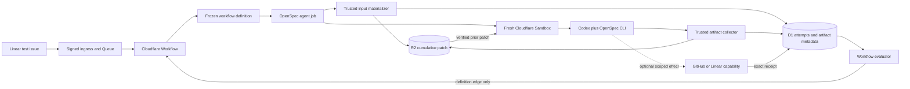
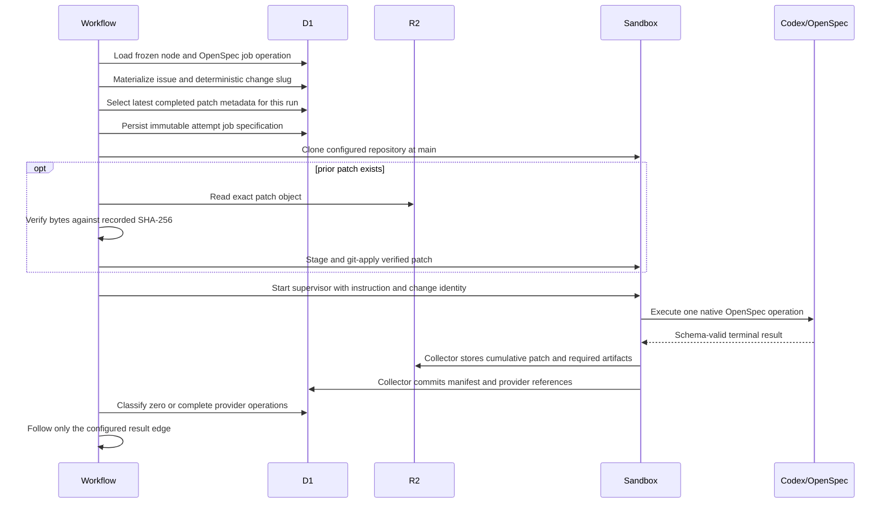

## Context

See [proposal.md](proposal.md) for the receipt mismatch and intended OpenSpec progression. The deployed version 3 definition represents proposal, specs, tasks, verify, and archive as `system_action` nodes, but the shipped `SystemActionController` can only recognize a pre-existing exact D1 receipt; it does not execute OpenSpec. The sandbox runner already executes arbitrary agent jobs, persists an immutable job specification in D1, collects a cumulative `git diff` in R2, and destroys the sandbox after every attempt.

The current runner clones `main` for every attempt. Prior structured results are materialized, but prior repository changes are not, so a fresh consumer cannot inspect or extend an earlier unmerged artifact. The change must preserve clean-sandbox isolation while making repository state durable across nodes. It must also distinguish zero provider operations from provider operations that exist but are incomplete.

Cloudflare Workflows may replay steps and hibernate between them, so attempt allocation, continuation selection, and edge evaluation remain deterministic and D1-backed. The Sandbox package and container remain on the already pinned `0.13.0-next.738.2` preview line; process execution continues to use its argv/handle API.

## Goals / Non-Goals

**Goals:**

- Express OpenSpec continue, apply, verify, and release finalization as typed agent-job operations in the frozen workflow definition.
- Give every OpenSpec attempt a trusted deterministic change identity and exact native instruction.
- Rehydrate the latest cumulative repository state into each clean sandbox from integrity-checked R2 evidence.
- Permit completed repository-local OpenSpec work with zero provider receipts while still failing closed for every attempted external effect.
- Prove the path with a provider-originated Linear canary that builds a small change through planning and implementation in the controlled repository.

**Non-Goals:**

- Add a trusted adapter for each OpenSpec artifact or infer artifact progression outside OpenSpec.
- Add a new branch lifecycle, merge strategy, or unrestricted GitHub credential to the sandbox.
- Let agent output select nodes, edges, or Linear states.
- Change the receipt contract for ordinary agents or system actions.
- Add speculative terminal artifact validation when no real downstream consumer exists.
- Implement the separate executor/business lifecycle proposal.

## Component Diagram



## Event Flow



The cumulative patch is always captured relative to the configured base checkout. Applying only the latest successful patch therefore recreates all earlier unmerged work without replaying a chain of diffs or trusting a prior sandbox filesystem.

## Minimal Data Model

No schema migration is required. Existing records gain new JSON fields or are queried through existing relationships:

```text
workflow definition job
  operation.kind             = openspec
  operation.instruction      = /opsx:continue | /opsx:apply | /opsx:verify | /opsx:archive

agent_attempts.job_spec_json
  openspecInstruction        exact frozen job instruction
  openspecChange             trusted deterministic Linear issue slug
  continuationPatch          null | { r2Key, sha256, manifestId, attemptId }

artifacts
  logical_name               patch.diff
  r2_key                     existing private object reference
  sha256                     existing integrity digest

provider_operations
  attempt_id                 distinguishes zero operations from attempted effects
  state                      existing receipt authority
```

The trusted materializer derives the first-slice change name from the Linear issue identifier lowercased, which is already unique and conforms to OpenSpec's kebab-case constraint. It writes the value into both materialized context and the immutable attempt job. Agent text cannot override it.

## Decisions

### 1. Represent native OpenSpec work as typed job metadata

`WorkflowJob` gains an optional `operation` object. The first supported operation kind is `openspec`, with an allowlisted instruction enum. The YAML uses separate jobs for continue, apply, verify, and archive while sharing one prompt and result schema. OpenSpec nodes become ordinary `agent` nodes referencing those jobs; `deploy` remains a `system_action` because it is an external effect.

This keeps operation identity in the canonical definition digest and immutable D1 snapshot. Encoding only prose in prompt files was rejected because neither validation nor audit queries could distinguish repository-local OpenSpec work from an ordinary agent.

### 2. Derive and persist one trusted change identity per Linear issue

The input materializer converts `SAC-123` to `sac-123` and validates it before allocation. Every attempt for that issue receives the same value. The OpenSpec prompt names both the canonical native instruction and the exact change identity, and tells Codex to use OpenSpec status and artifact instructions rather than creating downstream artifacts early.

Parsing an agent-proposed slug or free-form issue text was rejected because it makes identity mutable between attempts. Adding a policy column was rejected for the first slice because one issue maps to one change and the existing identifier is already stable.

### 3. Continue repository work from the latest verified cumulative patch

The materializer queries the newest complete `patch.diff` artifact for the run and records its R2 key, digest, manifest, and attempt in the next job specification. Before Codex starts, the trusted controller reads that object, verifies SHA-256, writes it outside the repository, checks it with `git apply --check`, applies it, and removes the staged file. Any read, digest, or apply failure is a startup failure.

The trusted supervisor builds each patch through an isolated temporary Git index: it reads `HEAD`, stages all repository changes with `git add -A`, and captures `git diff --cached --binary HEAD` without mutating the checkout's real index. This includes new OpenSpec files that are still untracked while keeping the patch cumulative relative to the same base. Selecting one latest patch is deterministic and bounded. Persisting entire patches in D1 was rejected because patches can be large; replaying all historical patches was rejected because cumulative diffs would conflict and enlarge the failure surface. Reusing a Sandbox was rejected because it violates clean-attempt isolation and makes cleanup a correctness dependency.

### 4. Make receipt exemption specific to OpenSpec jobs and zero operations

`ValidatedAgentOutcome` records both whether any provider receipts exist and whether the exact declared set is complete. For successful ordinary agents, receipts remain mandatory. For successful OpenSpec jobs, zero provider operations are valid; if any operation exists, the existing exact-match and D1 verification rules remain mandatory. Blocked and failed results continue through their explicit edges.

Treating an empty receipt list as globally complete was rejected because it would weaken every ordinary agent. Trusting the result's empty list without checking mechanically captured references was rejected because an agent could omit an attempted or denied operation.

### 5. Let real downstream consumers perform semantic validation

The workflow continues to send specs to BDD review, design to DDD review, implementation to code review and evidence verification, and completed work to native OpenSpec verify. Those consumers see the restored cumulative repository. A missing or invalid artifact produces the consumer's normal `changes_requested`, `blocked`, or `failed` outcome and therefore follows its existing graph edge.

Evidence verification is explicitly pre-release and phase-scoped. It evaluates the restored implementation, applicable acceptance criteria, prior results, and supplied operator evidence, but it cannot require native OpenSpec verify, release approval, deployment, release finalization, sync, or archive because those nodes are downstream of its certified edge. Trusted controller checks for immutable job identity, manifest completeness, cumulative patch integrity, Sandbox cleanup, and exact provider receipts remain service-owned; the review agent neither receives platform credentials nor duplicates those controls. Provider-originated and visual proof are required only when the implemented feature actually has a provider or user-interface surface.

No additional validator runs after archive because there is no later semantic consumer in the current graph. The terminal schema-valid result and durable artifacts are accepted unless live evidence reveals a concrete gap.

### 6. Put the OpenSpec CLI in the pinned Sandbox image

The container installs an exact `@fission-ai/openspec` version alongside the pinned Codex CLI and verifies both during image build. The OpenSpec prompt translates the canonical `/opsx:*` instruction into the installed CLI's status/instructions/apply/archive operations when Codex CLI does not expose command-palette expansion in non-interactive execution.

Relying on the host CLI was rejected because the remote Sandbox image is the execution environment. Installing an unpinned latest version was rejected because artifact ordering and instruction contracts belong to reproducible execution evidence.

## Failure Modes

| Failure | Required behavior |
| --- | --- |
| Linear issue identifier cannot form a valid change slug | Attempt allocation fails before Sandbox creation; no node transition occurs. |
| Latest patch metadata points to a missing R2 object | Attempt startup fails closed and cleanup runs. |
| Patch digest differs from D1 | Attempt startup fails before Codex and records a bounded startup failure. |
| Patch does not apply to the configured base | Attempt startup fails; no partial workspace is accepted. |
| OpenSpec CLI is absent or wrong version | Supervisor exits failed; the node follows its failed edge. |
| Agent creates more than the native next artifact | The next real review/consumer reports a non-success result; the workflow follows that edge. |
| Pre-release evidence review requires a downstream release or archive artifact | The phase-scoped prompt rejects that circular prerequisite and evaluates only evidence applicable before native OpenSpec verify. |
| Agent returns completed with no provider operations | OpenSpec node may take its completed edge after artifact collection succeeds. |
| Agent returns completed after an incomplete provider operation | Evaluator rejects the success transition; no external effect is inferred. |
| Agent returns blocked or failed | Persist the result and use only the configured matching edge. |
| Workflow step replays after attempt completion | D1 returns the same terminal attempt and receipt classification without starting another Sandbox. |

## Risks / Trade-offs

- **[Risk] A cumulative patch can grow across a long run.** → Keep the existing artifact size limits, use one latest patch, and fail before execution when limits or integrity checks fail.
- **[Risk] Patches assume the configured base remains reproducible.** → Every attempt clones the same policy base for the first slice; record patch metadata in the immutable job, and fail rather than rebasing implicitly.
- **[Risk] The Linear identifier is less descriptive than a title-derived slug.** → Prefer stable uniqueness for the canary; a future explicit policy field can add a human-readable slug without changing receipt semantics.
- **[Risk] OpenSpec command-palette names are not directly executable in non-interactive Codex.** → Preserve the canonical instruction in audit data and have the prompt use the installed OpenSpec CLI's native status/instructions operations.
- **[Risk] A review agent can make repository edits.** → The collector still captures them, so the next cumulative patch remains authoritative and auditable; review prompts continue to constrain intended behavior.

## Migration Plan

1. Keep trial dispatch disabled and confirm no active run uses the mutable checked definition.
2. Add typed OpenSpec jobs, cumulative patch materialization, receipt classification, the pinned OpenSpec CLI, and deterministic coverage.
3. Validate the OpenSpec change, TypeScript types, Worker bundle, tests, generated bindings, and container package/image alignment.
4. Deploy the new immutable workflow definition version with dispatch still disabled and verify D1 registration plus Worker/container health.
5. Enable only the controlled test project and create a dedicated calculator-style Linear issue.
6. Trigger the provider-originated start transition and use human Linear transitions only at the definition's configured gates.
7. At each OpenSpec node, verify D1 transition history, attempt job instruction/change identity, manifest completion, cleanup, and the next attempt's continuation patch reference.
8. Inspect the final cumulative patch to confirm proposal, specs, design, tasks, calculator implementation, tests, and OpenSpec verification all belong to the same change.
9. Disable dispatch after the canary and retain D1/R2/Workflow evidence.

Rollback disables dispatch first, then deploys the prior Worker version. Existing version 4 definition snapshots and artifacts remain immutable and readable; no D1 rows, R2 objects, or Workflow history are deleted.
