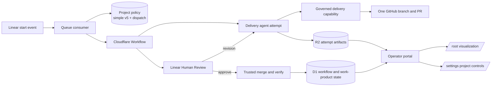

## Context

See [proposal.md](proposal.md) for the motivation. The deployed system currently bundles a full definition and simple version 4. Project policy points at the full definition, while an enabled `simple-workflow` selector can override it for labeled issues. Simple version 4 runs one planning-only agent, stores a planning manifest on a stable run branch, waits in Linear Human Review, then merges and verifies that manifest.

The portal Worker currently serves one asset directory with single-page fallback. The approved visualization build now owns that directory, so `/settings` receives the visualization entry point even though the route-aware settings application still exists in `portal/src`.

Existing runs are immutable. Their definition identity, digest, visits, attempts, work links, and artifacts must remain readable after this change. Provider credentials, merge authority, and Linear transition authority remain outside the sandbox.

## Goals / Non-Goals

**Goals:**

- Select the simple workflow from project policy for every new admitted run.
- Produce a complete OpenSpec change, implementation, validation, and one review pull request in one agent attempt per delivery cycle.
- Reuse the same governed branch and pull request when Human Review asks for a revision.
- Keep merge and post-merge verification as trusted system actions after explicit human approval.
- Restore `/settings` without changing the approved root visualization.
- Deploy with dispatch off, prove a real no-label Linear run, and turn canary dispatch off after proof.

**Non-Goals:**

- Delete the larger workflow definition or rewrite its historical runs.
- Archive the OpenSpec change inside the delivery attempt.
- Let the sandbox deploy, merge, approve, or change Linear state.
- Remove label capture from webhook ingress. Labels can remain bounded event evidence but no longer select a definition.
- Generalize the portal to arbitrary products or public users.

## Component Diagram



## Event Flow

1. Linear sends an accepted start transition. Ingress can still record bounded label evidence, but selection does not inspect it.
2. The Queue consumer checks the project dispatch switch. When enabled, it freezes the policy's simple definition identity, version, and digest on a new run and records `default` plus `project_policy` as the selection.
3. Simple version 5 delegates and starts the issue, then enters one `openspec_delivery` agent node.
4. The trusted materializer allocates or restores the run's delivery branch and pull-request record. It supplies the issue, exact OpenSpec change identity, prior attempt results, current governed head, and bounded Linear and GitHub feedback.
5. The sandbox creates or revises proposal, specs, design, tasks, implementation, and tests. It runs strict OpenSpec and repository validation and submits one full manifest to the delivery capability.
6. The capability validates the run, attempt, repository, branch, change identity, required OpenSpec set, completed tasks, review replies, and bounded files. It writes the exact revision to the stable run branch, creates or updates one pull request, and persists the confirmed head and manifest digest.
7. A successful or reconciled capability receipt lets the Workflow enter Human Review. A revision transition creates a fresh sandbox attempt at step 4. Approval enters trusted merge and verification.
8. Merge uses the recorded pull-request database ID, number, branch, and reviewed head. Verification reads the merged files at the merge commit, recomputes the recorded manifest digest, and confirms the commit is on `main` before the run succeeds.

## Decisions

### 1. Project policy directly names simple version 5

Registration will make `simple` the default bundled definition. New-run dispatch will allocate from the definition named by the durable project policy and will remove the label-selector branch. The former selector row can remain for historical compatibility, but registration and settings will no longer create, enable, or read it.

The existing selection columns will record `selection_kind = default` and `selection_value = project_policy`. Label name and legacy label-reason fields will be null. The source delivery, observation time, and bounded evidence digest remain recorded. This avoids rebuilding the run table only to expand a legacy check constraint.

Alternative considered: enable the current selector for every repository. That would still make unavailable or missing label evidence affect selection and would leave a misleading operator control, so it does not meet the contract.

### 2. Simple version 5 has one delivery agent node

Version 5 will keep the visible lifecycle shape: claim, delivery work, Human Review, trusted merge and check, success or stopped/failed. Its agent job will use a new `openspec-delivery.md` prompt and a new `github.publish_delivery_work_product` capability. The prompt will require the complete OpenSpec artifact set, implementation, tests, strict validation, one pull request, and exact provider receipt. It will forbid deployment, merge, archive, and Linear transitions.

Revision returns to the same delivery node. The Workflow run remains one run, while each revision uses a new attributable attempt and a clean sandbox.

Alternative considered: chain the existing proposal, design, task, and apply jobs. That recreates the larger workflow and makes several attempts when the user explicitly wants one delivery attempt per cycle.

### 3. Full delivery work products get a distinct durable contract

An additive `run_delivery_work_products` table will own the stable branch, OpenSpec change identity, pull-request identity, confirmed head, full manifest digest and JSON, publication receipt, merge receipt, verification receipt, and timestamps. Planning-only version 4 rows remain in `run_work_products` and keep their existing adapters.

The stable branch will be derived from the run identity, not the attempt identity. On a revision, the capability compares the expected prior head, applies the new complete changed-file manifest, restores or removes paths dropped since the prior manifest, and confirms the resulting provider head before updating D1. Review replies target the supplied top-level threads and remain unresolved for the reviewer.

Alternative considered: use generic `publish_work_product` with `deos/<attempt-id>`. That action creates a different branch per attempt and has no governed identity for automatic merge, so it cannot support safe revision or verification.

### 4. Publication and merge validate different facts

Publication validation will require:

- the exact service-authored repository, run branch, OpenSpec change identity, and operation key;
- `.openspec.yaml`, `proposal.md`, at least one `specs/**/spec.md`, `design.md`, and `tasks.md` under the exact change directory;
- no unchecked task boxes;
- a bounded non-empty implementation manifest outside the change directory;
- a validation record that includes strict OpenSpec validation and the repository checks declared by the agent;
- one reply for each supplied review thread on revisions.

Publication proves what was put on the review branch. Merge separately proves that the user approved that exact recorded head. Post-merge verification proves that every recorded manifest file at the merge commit matches the stored digest and that the commit is on `main`.

Alternative considered: trust the agent's result summary. A summary is not durable provider proof and cannot protect against head substitution.

### 5. Build two portal entries and route them explicitly

The production portal build will create the approved visualization entry at `/index.html` and a settings entry at a distinct asset path without emptying the first build. The Worker will authenticate first, route `/` to the visualization asset, internally map `/settings` and `/settings/` to the settings asset, pass only declared hashed assets, and return a safe not-found response for other browser paths. API routing remains Worker-owned.

The settings contract and UI will remove selector fields and mutation logic. Repository save will still turn dispatch off. Workflow save will accept only `dispatchEnabled` and `expectedRevision`, keep the active-run guard and compare-and-set revision, and confirm the D1 read-back.

Alternative considered: copy the settings panel into the visualization prototype. That would create two settings implementations and repeat a sensitive mutation surface.

## Minimal Data Model

```text
project_workflow_policies
  project_id PK
  definition_id, definition_version, definition_digest  -> simple v5
  trial_repository
  dispatch_enabled
  workflow_revision, workflow_updated_by, workflow_updated_at

orchestration_runs
  run_id PK
  definition_id, definition_version, definition_digest  -> frozen per run
  selection_kind = default
  selection_value = project_policy
  selection_label_name = null
  selection_reason = null
  selection_delivery_id, selection_observed_at, selection_provider_digest

run_delivery_work_products
  run_id PK -> orchestration_runs
  repository, base_branch = main, remote_branch UNIQUE, change_id
  pull_request_database_id, pull_request_number, pull_request_url
  head_sha, manifest_digest, manifest_json, publication_operation_id
  merge_operation_id, merge_commit_sha
  verification_operation_id, verified_at
  created_at, updated_at
```

The table uses all-or-none checks for pull-request identity, publication identity, merge identity, and verification identity. Provider operation IDs retain foreign keys to durable receipts.

## Failure Modes

- **Dispatch policy or definition read-back differs**: fail before run allocation and leave the Queue message retryable by stable delivery identity.
- **Old selector remains enabled**: it is ignored for selection; settings no longer exposes it. Deployment read-back confirms policy points to simple v5.
- **OpenSpec set, tasks, implementation manifest, or validation is incomplete**: deny publication before GitHub and keep the node from completing.
- **Provider response is ambiguous**: reconcile the stable branch and pull-request identity before retry; otherwise enter manual reconciliation without creating another PR.
- **Revision uses a stale governed head**: deny the update and reload current provider state before another attempt.
- **Human approves after an unrecorded head change**: merge fails closed and does not merge the substituted head.
- **Merged files differ from the manifest**: verification fails and the run cannot report success.
- **One portal entry is absent**: the Worker returns a safe unavailable or not-found response for that route; it does not fall through to the other entry.
- **Settings update races another operator or an active run**: compare-and-set or active-run guards reject the mutation and return the latest safe state.

## Risks / Trade-offs

- **[Risk] One agent attempt has a broader job and may run longer** → Keep the 24-hour absolute limit, five-minute heartbeat check, bounded prompt inputs, and durable intermediate transcript. A fresh revision attempt can continue from the governed branch.
- **[Risk] Full manifests can be larger than planning manifests** → Bound file count and per-file size, reject forbidden paths, store only the sanitized manifest and digest in D1, and keep source bodies in GitHub rather than D1.
- **[Risk] The old full workflow remains bundled but unused** → Name simple explicitly in project policy and test registration and allocation read-back. Deleting the old definition is a later migration.
- **[Risk] Two frontend entries can drift** → Share authentication, API types, settings modules, theme tokens, and one production build command. Keep route tests that inspect both generated entries.
- **[Risk] Legacy selector rows may confuse direct database inspection** → Stop reading and mutating them in runtime code and document them as historical compatibility state until a later cleanup migration.

## Migration Plan

1. Keep project dispatch disabled and confirm no active run.
2. Apply the additive delivery-work-product migration and read back its schema and constraints.
3. Deploy the capability service changes while existing workflow workers still use only legacy actions.
4. Deploy simple version 5, its prompt, job materializer, Queue consumer, Workflow worker, and portal entries. Registration updates project policy to the immutable simple v5 identity but preserves the durable dispatch value.
5. Read back the policy definition, digest, dispatch value, minimum portal bindings, Access policy, and both authenticated browser routes. Confirm `/` is the visualization, `/settings` is settings, and an unsupported path is not the visualization.
6. Enable dispatch without any selector. Create one real Linear issue with no `simple-workflow` label and move it through the configured start transition.
7. Capture matching Linear, Queue, Workflow, D1, R2 transcript, governed pull request, portal, Human Review, merge, and terminal evidence. Confirm the PR contains proposal, specs, design, tasks, implementation, tests, and validation from one agent attempt.
8. Disable canary dispatch and read it back after the run is terminal.

Rollback keeps dispatch off, restores the prior Worker versions, and explicitly restores the prior project-policy definition identity before admitting another run. The additive table and simple version 5 definition remain inert. Frozen version 4, version 5, and full-workflow runs remain readable and resumable by their recorded definition snapshots.
