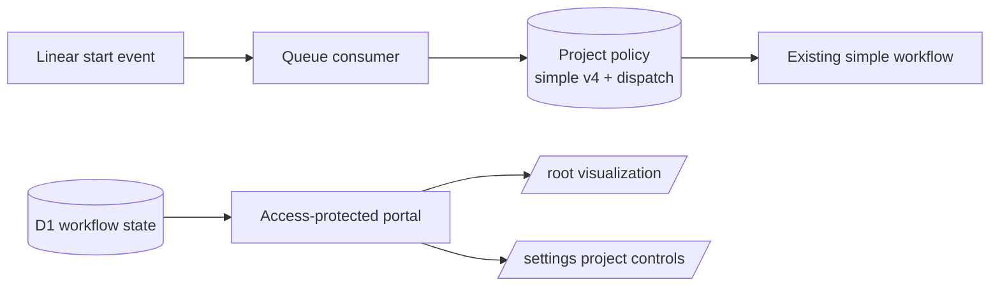

## Context

See [proposal.md](proposal.md) for the motivation. The deployed bundle contains the larger `openspec-delivery` definition and simple version 4. Registration currently makes the larger definition project policy, while an enabled `simple-workflow` selector can override it for a labeled start event. Simple version 4 is already proven through a real terminal SAC-132 run and must not change.

The production portal build currently places only the approved visualization in the portal asset directory. Because the Worker uses single-page fallback, `/settings` receives that same visualization entry even though the route-aware settings application remains in `portal/src`.

## Goals / Non-Goals

**Goals:**

- Point project policy at the existing immutable simple version 4 definition for every new admitted run.
- Stop consulting or exposing the former label selector.
- Restore `/settings` without changing the approved visualization at `/`.
- Preserve dispatch guards, authentication, historical definitions, and historical run projection.

**Non-Goals:**

- Change the simple workflow graph, prompt, artifacts, pull request, Human Review, merge, or verification behavior.
- Delete the larger definition, selector table, label evidence, or historical selector records.
- Run a new agent shape or add provider capabilities.

## Component Diagram



## Event Flow

1. Ingress authenticates and stores the accepted Linear event and its bounded label evidence as it does now.
2. The Queue consumer registers both bundled definitions but makes existing simple version 4 the project-policy definition.
3. When dispatch is enabled and a start event has no active run, the consumer allocates the run from that default definition. It does not read a selector or inspect labels to choose a definition.
4. The existing simple workflow executes without any graph, prompt, capability, or merge-path change.
5. The portal Worker authenticates first. It serves the visualization entry for `/`, the settings entry for `/settings` and `/settings/`, declared assets for those entries, and a safe not-found response for other browser paths.

## Decisions

### 1. Change the default, not the workflow

`simple` becomes the bundled default definition used by registration and new-run allocation. All bundled definitions remain registered so frozen larger-workflow runs can still restore. The Queue consumer removes the selector override branch and records a default selection for new runs.

Alternative considered: enable the existing selector for every repository. That would keep label evidence in the selection path and leave a misleading operator control.

### 2. Keep label evidence for compatibility

Ingress and Queue payloads keep their current bounded label evidence and digest. The consumer still checks that durable delivery evidence matches the queued event, but it does not use label names to select the workflow. This avoids an unrelated webhook and schema migration.

Alternative considered: remove labels from ingress and D1 now. That is broader than removing the operator requirement to apply a label.

### 3. Retire selector behavior without deleting history

Runtime registration stops creating or updating selector rows. New-run dispatch stops reading them. Settings no longer returns or accepts selector state. Existing rows and historical run selection fields remain untouched for audit and version 4 history.

Repository changes still turn dispatch off. Dispatch changes retain the active-run guard, revision compare-and-set, actor identity, and read-back confirmation.

### 4. Build and route two portal entries

The production build first writes the visualization entry and then adds a settings entry without clearing the asset directory. The Worker maps the two declared browser routes to their exact entry assets after Access authentication. Hashed assets remain available, while unsupported browser paths return a safe not-found response instead of using visualization fallback.

Alternative considered: copy settings into the visualization prototype. That would duplicate a mutation surface and allow the two settings implementations to drift.

## Minimal Data Model

```text
project_workflow_policies
  project_id PK
  definition_id, definition_version, definition_digest -> existing simple v4
  trial_repository
  dispatch_enabled
  workflow_revision, workflow_updated_by, workflow_updated_at

workflow_definition_selectors
  retained as historical compatibility data
  not read, registered, or mutated by the new runtime path

orchestration_runs
  existing definition identity and selection evidence remain frozen per run
```

No migration is required.

## Failure Modes

- **Policy definition read-back differs**: registration or dispatch fails before allocating a new run.
- **A legacy selector remains enabled**: it has no effect because the runtime no longer reads it.
- **Dispatch is disabled**: the start event remains unmatched and no run is created.
- **A historical run names another definition**: restoration uses its frozen definition and does not substitute simple version 4.
- **One portal entry is missing**: the Worker returns a safe unavailable or not-found response for that route and does not show the other product.
- **Settings update races an active run or another operator**: the existing guard or revision check rejects the mutation.

## Risks / Trade-offs

- **[Risk] Direct D1 inspection still shows selector rows** → Treat them as historical records and verify that runtime code has no selector read in the allocation path.
- **[Risk] Two frontend builds could erase or overwrite assets** → Use one production command, disable output clearing for the second entry, and assert both generated entries in tests.
- **[Risk] Changing the bundled default could affect restoration** → Keep every definition registered and retain explicit frozen-definition restoration tests.

## Migration Plan

1. Confirm dispatch is disabled and no run is active.
2. Deploy the Queue consumer with simple version 4 as the direct default and without selector registration or selection.
3. Build and deploy both portal entries and explicit Worker routing.
4. Read back project policy to confirm the exact simple version 4 identity and digest while dispatch remains disabled.
5. Verify through the authenticated browser that `/` is the visualization, `/settings` is settings without a selector, and an unsupported browser path is not the visualization.

Rollback keeps dispatch disabled, restores the previous Queue and portal Worker versions, and restores the prior project-policy definition identity before admitting another run. Frozen historical runs require no data rollback.
