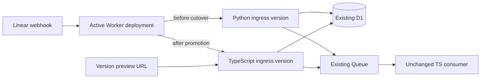
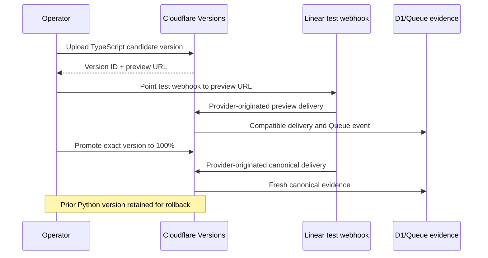

## Context

See `proposal.md` for motivation. The current Python Worker reads the request as text and re-encodes it before HMAC verification, while the domain contract requires the exact raw request bytes. The TypeScript Queue consumer is already the provider-proven runtime for Queue handling, but the HTTP migration must preserve the existing D1, Queue, and Linear behavior rather than redesign it.

Cloudflare versions separate uploaded Worker state from active deployments, provide versioned preview URLs, and support rollback to a known version. Preview URLs do not currently expose Workers Logs, so preview verification must use HTTP plus durable Queue/D1 evidence; final canonical verification includes telemetry. See [Versions and deployments](https://developers.cloudflare.com/workers/versions-and-deployments/), [Preview URLs](https://developers.cloudflare.com/workers/versions-and-deployments/preview-urls/), and [Rollbacks](https://developers.cloudflare.com/workers/versions-and-deployments/rollbacks/).

## Goals / Non-Goals

**Goals:**

- Implement the Cloudflare HTTP adapter in TypeScript with byte-accurate verification.
- Prove behavior parity before provider testing and preserve downstream schemas.
- Test a candidate version without routing canonical traffic to it.
- Promote at 100% only after preview proof and retain an immediate rollback path.
- Remove only adapter-specific Python code after canonical provider proof.

**Non-Goals:**

- Split real Linear webhook traffic between Python and TypeScript versions.
- Change workflow logic, Queue-consumer behavior, storage schemas, or filter policy.
- Migrate readable provider-neutral Python modules without a demonstrated need.
- Depend on preview logs, which Cloudflare does not currently provide.

## Decisions

### Capture the existing contract as shared fixtures before writing the adapter

Canonical byte fixtures and expected outcomes cover method handling, valid/relevant, valid/irrelevant, duplicate, stale timestamp, malformed headers, invalid signature, invalid payload, and Queue failure. Python tests remain the baseline while TypeScript runs the same request bytes, header values, clock, and expected D1/Queue effects.

Alternative considered: port code first and compare manually. Rejected because equivalent-looking implementations can differ on raw bytes, timestamps, or response semantics.

### Verify exact request bytes in TypeScript

The Worker obtains an `ArrayBuffer` from the request, verifies HMAC-SHA256 over those bytes, and only then decodes/parses JSON through the ACL. Header lookup is case-insensitive. Timestamp parsing treats `Linear-Timestamp` as milliseconds and uses the same freshness policy. `Linear-Delivery` remains mandatory for the durable idempotency path.

Alternative considered: call `request.json()` before verification. Rejected because parsing and reserialization do not preserve the signed byte sequence.

### Preserve the Queue message and D1 contracts byte-for-field

The TypeScript adapter emits the existing application-event field names and timestamp representation. It uses the existing deliveries table and classification values. No D1 migration, Queue rename, binding rename, or downstream consumer change is part of this stage.

### Use version upload, preview proof, then a single-version promotion

The candidate is uploaded as a new version without changing the active deployment. A versioned preview URL is explicitly enabled for the test Worker and temporarily configured as the Linear test webhook URL. The canonical Python URL is not simultaneously registered for the same test trigger. Provider-originated preview proof uses HTTP response, fresh D1 delivery, Queue consumption, and workflow state.

After preview proof, the exact candidate version is promoted to 100% traffic; a percentage split is not used because webhook retries could reach different runtimes and obscure parity. A second real Linear transition proves the canonical deployment and its telemetry. The prior Python version identifier is recorded for `wrangler rollback`.

Alternative considered: gradual percentage rollout. Rejected for this low-volume webhook because one delivery cannot provide meaningful percentage evidence and retries may experience version skew.

### Defer cleanup until canonical proof is complete

The Python HTTP entrypoint, its adapter tests, and rollback instructions remain until the TypeScript version has provider-originated canonical proof. Provider-neutral Python domain modules remain unless the final dependency graph shows they are used only by the removed adapter and migration is separately justified.

### Component and event flow

### Minimal data model

- `ingress_contract_fixture`: raw body bytes, headers, fixed clock, configuration, expected status/classification, expected D1 effect, and expected Queue event.
- `deployment_evidence`: candidate version ID, prior Python version ID, preview URL, canonical URL, binding fingerprint, trigger issue/delivery, and proof timestamps.
- Existing `delivery` and `application_event` schemas remain unchanged.

## Risks / Trade-offs

- [Candidate preview URL is public] → Enable it explicitly only for the test Worker, retain webhook HMAC verification, and disable or rotate the alias after proof.
- [Preview URLs lack logs] → Use HTTP and fresh D1/Queue evidence for preview; require canonical telemetry after promotion.
- [Storage state changes make rollback unsafe] → Prohibit destructive schema/binding changes and record the compatible Python version before promotion.
- [Two Linear webhooks duplicate work] → Configure only one test webhook target for each proof phase and capture the provider configuration.
- [Raw-body parity differs for non-UTF-8 input] → Contract tests use bytes directly and parsing occurs only after signature verification.
- [Cleanup removes readable shared domain code] → Remove only code proven adapter-specific; retain provider-neutral Python modules by default.

## Migration Plan

1. Record the active Python version, canonical URL, binding/resource identifiers, and rollback command.
2. Build shared byte-level contract fixtures and make both runtime suites pass them.
3. Implement and dry-run the TypeScript ingress adapter without changing downstream schemas or bindings.
4. Upload a candidate version without promotion and obtain its versioned preview URL.
5. Point the Linear sample webhook only to the preview URL, trigger a test issue transition, and verify fresh D1/Queue workflow evidence.
6. Promote the exact candidate version to a single-version 100% deployment and repeat provider-originated verification at the canonical URL with telemetry and sanitized screenshots.
7. If any canonical check fails, roll back immediately to the recorded Python version; connected resources remain unchanged.
8. Only after successful canonical proof, remove the Python HTTP adapter and adapter-specific tests, rerun every gate, and keep the rollback evidence in the PR.
