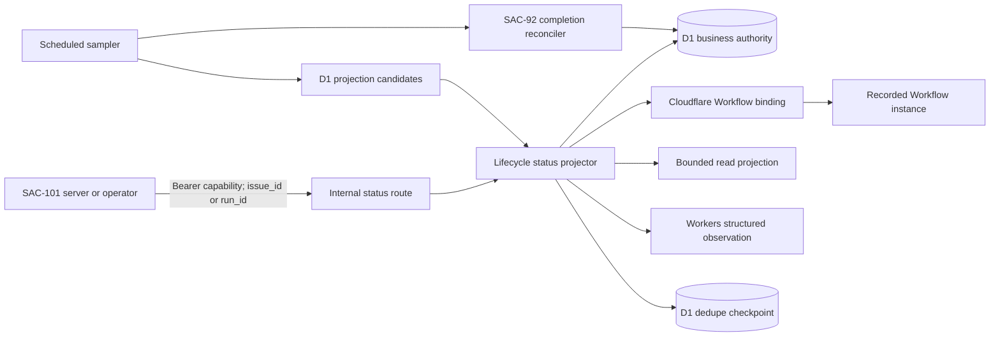
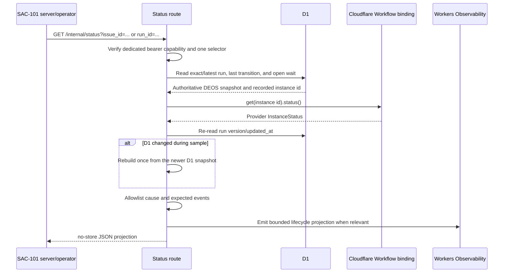
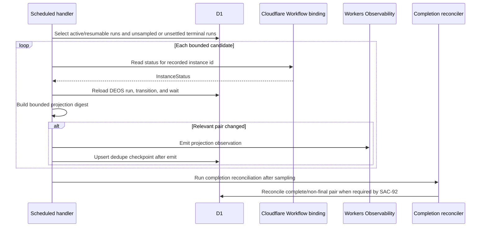

## Context

See [proposal.md](proposal.md) for the motivation and scope. The current telemetry contract provides correlated orchestration observations, but it does not expose the independently named executor/business fields required by SAC-103. The SAC-92 implementation adds resumable D1 statuses, durable wait descriptors, safe terminal causes, and a scheduled completion reconciler; that implementation is present at commit `4b6d088` on `agent/sac-92-lifecycle-implementation` and has deployed evidence, but is not yet an ancestor of the current `main`. SAC-103 implementation must first reconcile that dependency with the newer mainline transition-identity work without putting it in this planning PR.

Cloudflare's current Workers API reports Workflow instance status as `queued`, `running`, `paused`, `errored`, `terminated`, `complete`, `waiting`, `waitingForPause`, or `unknown`, with optional error and output data. Only the status enum is admissible to this projection; error messages and output are not. The primary contracts are [Workflow instance status](https://developers.cloudflare.com/workflows/build/workers-api/#instancestatus) and [Workers Logs](https://developers.cloudflare.com/workers/observability/logs/workers-logs/).

The orchestration Worker already has a Workflow binding, D1 binding, structured console observations, a protected HTTP capability pattern, and a scheduled trigger. Those boundaries are sufficient; this change does not need a new service or analytics product.

## Goals / Non-Goals

**Goals:**

- Produce one typed projection from a live Cloudflare instance-status read and authoritative D1 business records.
- Give SAC-101 a protected, read-only server-side contract keyed by issue or run.
- Emit queryable status-pair observations when Cloudflare reaches waiting or a terminal/error state.
- Bound cause and expected-event data so projection cannot become a provider-content or diagnostic exfiltration path.
- Make deployed evidence compare D1 first, then Cloudflare instance status, then Workers Observability for the same identities.

**Non-Goals:**

- Add an aggregate success state or decide how SAC-101 visually presents the fields.
- Let the projection endpoint reconcile, resume, cancel, or transition a run.
- Persist a second authoritative business status or copy raw Cloudflare output into D1.
- Expand the exact wait matcher or provider-event contract established by SAC-92.

## Component Diagram



The response and log event share one projection builder. The checkpoint suppresses identical scheduled log samples; it is operational bookkeeping and is never read as business authority or served instead of a live provider/D1 read.

## Event Flow

### Authenticated projection read



If D1 changes again during the bounded rebuild, the route returns `projection_changing` instead of presenting fields sampled from incompatible business snapshots. A Cloudflare status transport failure returns the D1 fields with a partial projection marker, a null executor status, and the service-authored category `workflow_status_unavailable`; it never reuses a cached provider status.

### Scheduled lifecycle observation



Sampling before completion reconciliation preserves evidence of a real `complete`/non-final mismatch. The guarded reconciler may then record `failed`; the changed D1 fingerprint causes a later `complete`/`failed` observation. At-least-once duplicate observations are acceptable if checkpoint persistence fails, because the projection digest and identities make them distinguishable without losing the underlying event.

## Minimal Data Model

The served and logged projection uses the same versioned flat attribute set:

```text
deos.lifecycle_projection.schema_version  "1"
event.time                                sample time
deos.workflow.correlation_id              existing correlation identity
deos.workflow.run_id                      D1 run identity
cloudflare.workflow.instance_id           instance id recorded on that run
cloudflare.execution.status               exact InstanceStatus value, or null on read failure
deos.run.status                            exact D1 business status
deos.current_node                          exact D1 node id
deos.transition.cause                      bounded service-authored category
deos.expected_event                        absent, or bounded resume/cancel descriptors
error.type                                 optional service-authored projection error
```

`deos.expected_event` is rebuilt rather than copied. It contains up to one `resume` and one `cancel` descriptor, each limited to `purpose`, allowlisted event `type`, `actor_type`, and configured target state. The decoder rejects extra keys, executable values, unbounded strings, or descriptor types not supported by the frozen definition. `deos.transition.cause` is derived from `terminal_cause` or the latest transition's type and known shape; unknown references map to `unknown_transition_cause` rather than being returned verbatim.

The only new durable record is a dedupe checkpoint:

```text
workflow_status_projection_checkpoints
  run_id                         primary key; references orchestration_runs
  workflow_instance_id           identity guard
  projection_digest              digest of schema and projected fields, excluding event.time
  cloudflare_execution_status    last observed provider enum
  deos_updated_at                D1 business snapshot version used for the digest
  observed_at                    sample time
```

The projection route never reads this table. Scheduled candidate selection uses it only to suppress an identical digest and to keep polling a terminal DEOS run until Cloudflare reaches a terminal provider status.

## Decisions

### 1. Build one projection from two authoritative reads

The projector reads DEOS state from D1, queries the Workflow binding by the instance id recorded on that exact run, and verifies that the D1 snapshot did not change while sampling. It does not calculate an aggregate `success` boolean.

This keeps authority explicit: D1 answers what the governed process means, while Cloudflare answers what the executor is doing. It also makes `complete`/`denied`, `complete`/`failed`, and `complete`/non-final combinations visible instead of forcing them into one state.

Alternative considered: infer executor state inside the running Workflow and log the expected post-return state. Rejected because a Workflow cannot truthfully report that Cloudflare has marked it `waiting`, `complete`, or `errored` before the platform does so.

### 2. Use a shared typed serializer for HTTP and Workers Logs

A pure projection builder accepts the D1 run, latest transition, optional open wait, and provider `InstanceStatus`. The HTTP route serializes that object directly; the observation writer adds event metadata without renaming lifecycle fields. Tests use fixtures for every provider status and DEOS lifecycle pair named in the specs.

Alternative considered: maintain separate API and logging mappers. Rejected because the two surfaces could drift and make deployed evidence appear consistent while exposing different meanings to SAC-101.

### 3. Normalize causes and wait descriptors through a closed allowlist

The projector never includes `InstanceStatus.error`, Workflow output, `cause_reference`, or stored matcher JSON. It maps known terminal causes and transition shapes to fixed categories. It parses frozen wait descriptors with an exact schema, emits only the operator-relevant fields, and fails closed with a safe projection warning if a supposedly valid stored descriptor does not match.

Alternative considered: rely on SAC-92 validation and pass its canonical JSON through. Rejected because database corruption, legacy rows, or later schema growth could silently widen a read API and Workers Logs beyond the reviewed data boundary.

### 4. Protect one read-only route with a dedicated capability

The Worker adds `GET /internal/status` with exactly one of `issue_id` or `run_id`. It requires `Authorization: Bearer <STATUS_PROJECTION_SECRET>`, returns `Cache-Control: no-store`, and uses generic authorization/not-found errors. SAC-101 will call it only from its server-side Worker or through a service binding; the credential is never shipped to browser code.

The route is observational: it may emit a log, but it cannot update run/wait/transition state, send an event, call Linear, or invoke the completion reconciler. A separate secret prevents a read consumer from inheriting GitHub, Linear, cleanup, or agent capabilities.

Alternative considered: expose the route publicly because the fields are sanitized. Rejected because run, issue, and Workflow identifiers are operational metadata and unrestricted enumeration would create an unnecessary disclosure surface.

### 5. Sample out of band and deduplicate by projection digest

The existing scheduled Worker gains a bounded sampler that polls active/resumable runs and terminal runs whose provider state has not settled. It emits only waiting or terminal/error provider observations, plus complete/non-success mismatches, and stores a non-authoritative digest after logging. It runs before the SAC-92 completion reconciler so the pre-reconciliation mismatch remains visible.

Alternative considered: log every run on every cron. Rejected because unchanged long-lived waits would create avoidable noise and make actual lifecycle changes harder to find. A transactional telemetry outbox was also rejected for this slice because Workers console log delivery is not transactionally acknowledgeable; a small at-least-once dedupe checkpoint states the achievable guarantee honestly.

### 6. Keep proof comparative and provider-originated

The implementation evidence uses real Linear transitions to create selected lifecycle paths. For each proof run, evidence is ordered as:

1. D1 business status, node, safe cause, wait summary source, run id, and recorded instance id;
2. Cloudflare Workflow instance status for that exact instance id;
3. Workers Observability projection for the same run and instance;
4. the authenticated projection response with secrets removed; and
5. visual screenshots of the provider issue state and Cloudflare instance/configuration where available.

Deterministic tests cover waiting, final denial, executor failure, and Cloudflare-complete/DEOS-non-success pairs, but they are supporting evidence only. After implementation without an implementation PR, the sanitized Showboat record, D1 queries, provider links, and screenshots are added as a follow-up comment to the merged SAC-103 planning PR and linked from Linear so this single PR remains the review/evidence anchor.

## Failure Modes

| Failure | Required behavior |
| --- | --- |
| Issue selector has no run | Return a generic not-found response without querying or revealing a Workflow instance. |
| D1 read fails | Return a bounded unavailable response; do not query Cloudflare with an unverified instance id. |
| Cloudflare status read fails | Preserve freshly read D1 fields, set the executor field to null with `workflow_status_unavailable`, and never substitute a checkpoint value. |
| D1 changes during the provider read | Rebuild once; if it changes again, return `projection_changing` and retry on the next request/sample. |
| Stored instance id differs from the selected run | Fail with `workflow_instance_identity_mismatch`; do not query another instance. |
| Wait descriptor fails strict decoding | Omit expected-event details, emit `expected_event_projection_invalid`, and do not expose the raw row. |
| Transition cause has an unknown shape | Emit `unknown_transition_cause`; do not expose `cause_reference`. |
| Cloudflare is `complete` while DEOS is non-final | Emit the exact pair before the separate completion reconciler applies SAC-92 policy; never label success or transition Linear. |
| Checkpoint write fails after logging | Permit a later duplicate observation with the same digest; do not suppress the original log or affect business state. |
| Scheduled sample exceeds its bound | Stop at the configured batch limit and continue on a later trigger without delaying cleanup or completion reconciliation indefinitely. |

## Risks / Trade-offs

- **[Risk] The two providers cannot be read atomically.** → Guard the D1 snapshot with a bounded reread, include the sample time, and never claim a globally atomic state.
- **[Risk] Long-lived waits require continued polling to detect a provider-side error or completion.** → Keep non-final runs eligible while deduplicating unchanged projections.
- **[Risk] A new internal endpoint expands operational metadata access.** → Use a dedicated server-side secret, no-store responses, exact selectors, generic failures, and no provider content.
- **[Risk] SAC-92 is deployed but absent from current mainline history.** → Reconcile and validate its implementation against later mainline work before creating SAC-103 tasks or runtime changes; do not hide that integration in this planning diff.
- **[Risk] At-least-once logs can duplicate after a checkpoint failure.** → Include a deterministic projection digest and stable identities; consumers deduplicate without treating the checkpoint as evidence of log delivery.

## Migration Plan

1. After this planning PR is approved and merged, reconcile SAC-92 commit `4b6d088` onto the refreshed mainline and re-run its lifecycle, migration, and provider-proof invariants before generating SAC-103 tasks.
2. With trial dispatch disabled, add the projection checkpoint migration and rehearse it against a D1 copy; verify row counts, foreign keys, and existing run/wait/transition data remain unchanged.
3. Add the shared projector, strict safe-field decoder, authenticated route, scheduled sampler, observation fields, and deterministic tests. Keep the route credential in a new secret and keep dispatch disabled.
4. Run strict OpenSpec validation, TypeScript/Python tests, type and binding checks, migration rehearsal, log-schema checks, and Wrangler dry-run validation.
5. Deploy with dispatch disabled, verify the secret/configuration and empty checkpoint behavior, then enable only the bounded canary project.
6. Use real Linear events to prove a waiting path, a final denial, and a controlled executor-failure path. Capture D1 before Cloudflare status, then Workers Observability and the sanitized route response for the same run and instance; capture visual provider proof.
7. Disable trial dispatch, read it back, verify Sandbox cleanup and D1 invariants, and attach the evidence to the merged planning PR and SAC-103.

Rollback disables trial dispatch and deploys the prior Worker version. The additive checkpoint table and unused projection secret can remain because neither affects business-state evaluation. No D1 business rows, Workflow history, wait records, or observations are deleted during rollback.
