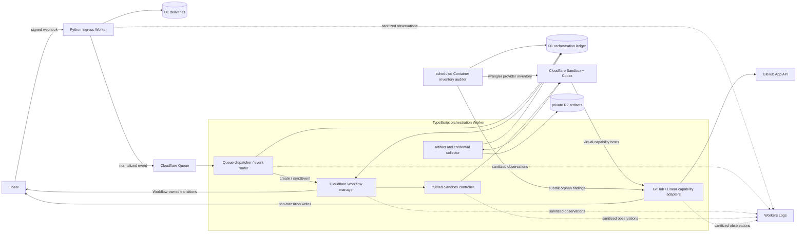
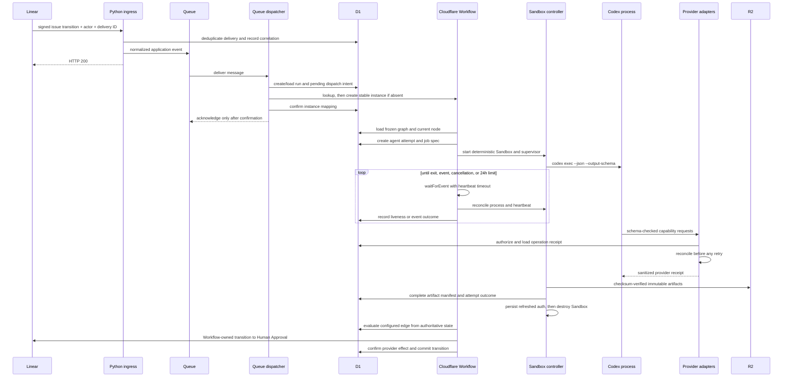

## Context

See `proposal.md` for motivation and the delta specifications under `specs/`
for normative behavior. The implemented system currently has a Python HTTP
ingress Worker, a separate TypeScript Queue consumer, D1 business-state tables,
an R2 binding that is not yet used for production artifacts, and shared Workers
Logs telemetry. The Queue consumer currently performs the first Linear state
change itself; it does not create a Cloudflare Workflow or run an agent.

This design adds orchestration to the TypeScript Worker while preserving the
authenticated Python ingress and its normalized Queue event boundary. It is
grounded in these provider contracts:

- [Linear webhooks](https://linear.app/developers/webhooks) provide a unique
  `Linear-Delivery`, a millisecond timestamp, a signed raw body, and an `actor`
  that can be a user, OAuth client, integration, or null. Only a signed event
  whose actor is an authorized user can satisfy a configured human gate.
- [Cloudflare Workflow bindings](https://developers.cloudflare.com/workflows/build/workers-api/)
  allow a caller-supplied unique instance ID, instance lookup, status
  inspection, and event delivery. Creating with an already-used ID fails, so
  dispatch must reconcile by ID before retrying creation.
- [Workflow events](https://developers.cloudflare.com/workflows/build/events-and-parameters/)
  are buffered when sent before the matching `waitForEvent`, and their payload
  is immutable. Durable mutable business state therefore remains in D1.
- [Workflow instance rules](https://developers.cloudflare.com/workflows/build/rules-of-workflows/)
  make instance IDs unique for the retained history of a Workflow. A new run
  after a terminal run therefore needs a new run and instance identity.
- The Sandbox runner is a new component, so it will use an exactly pinned
  `@cloudflare/sandbox@next` package and matching `cloudflare/sandbox:next`
  image from the same release line. The preview process-handle API is needed
  because `exec(argv)` starts a process and liveness/completion are observed
  separately. Package types and preview documentation are authoritative at
  implementation time.
- [Codex authentication](https://learn.chatgpt.com/docs/auth) permits a trusted
  headless runner to seed `auth.json`; Codex refreshes ChatGPT-managed tokens
  during active use. The file is plaintext credential material and must be
  treated like a password.
- [Codex non-interactive mode](https://learn.chatgpt.com/docs/non-interactive-mode)
  provides JSONL events with `--json`, a schema-constrained final response with
  `--output-schema`, and explicit workspace permissions. The first slice uses
  ChatGPT-managed authentication and does not set an OpenAI API key.
- [R2 Workers writes](https://developers.cloudflare.com/r2/api/workers/workers-api-reference/)
  are strongly consistent, accept conditional writes, and can verify a supplied
  SHA-256 checksum. D1 records the searchable manifest and R2 stores the bytes.
- [`wrangler containers instances`](https://developers.cloudflare.com/changelog/post/2026-03-12-wrangler-containers-instances/)
  provides machine-readable provider inventory for a Container application.
  That inventory is required to find an orphan that has no surviving D1 row.

The first slice runs only against a controlled trial repository and the
configured Linear test project. This boundary is important: ChatGPT-managed
Codex authentication must exist inside the trusted Sandbox long enough for the
CLI to use and refresh it. General execution of untrusted public repositories
requires a stronger authentication isolation design and is not enabled here.

## Goals / Non-Goals

**Goals:**

- Preserve one traceable path from a signed Linear delivery through Queue,
  Workflow, Sandbox, Codex, R2, GitHub, Linear, and cleanup.
- Make D1 the authoritative business-state, idempotency, and audit ledger while
  using Cloudflare Workflow for durable orchestration and event waiting.
- Represent workflow behavior as a versioned graph so autonomous nodes,
  follow-up agents, loops, human gates, and terminal nodes are policy choices
  rather than hard-coded approval after every agent.
- Run each Codex attempt in a clean, attributable, bounded Sandbox and make a
  fresh attempt independently recoverable from durable context.
- Keep agent-requested provider work behind narrow capability adapters and keep
  every Linear transition under Workflow control.
- Preserve complete, integrity-verifiable evidence before destroying the
  Sandbox and package provider-originated and visual proof with implementation.

**Non-Goals:**

- A multi-tenant scheduling or credential platform.
- A general expression language or arbitrary code in workflow definitions.
- Keeping a Sandbox alive so the same agent process can handle later review.
- Letting an agent call Linear state mutations, receive provider tokens, or
  select a workflow edge directly.
- Migrating existing legacy D1 runs into active Sandbox executions.
- Replacing Workers Logs with a new dashboard or retaining raw agent content in
  telemetry.

## Decisions

### 1. Extend the TypeScript Queue Worker into one orchestration Worker

The existing TypeScript Queue Worker will own four runtime entry points in one
deployment:

1. the Queue consumer and event router;
2. the Cloudflare Workflow entrypoint;
3. the trusted Sandbox controller and artifact collector; and
4. provider capability adapters.

The Python ingress Worker remains unchanged except for extending the normalized
application event with the actor type and other already-authenticated decision
fields. The orchestration Worker receives Workflow, Sandbox, D1, R2, Queue, and
secret bindings. Co-location avoids an additional network-authentication layer
between dispatch, Workflow, and Sandbox while keeping the public ingress small.

The Sandbox container is separately built from a pinned image. It contains an
exact Codex CLI version, the runner supervisor, the result JSON Schema, the
provider-capability command shims, Git, and only the build tools required by the
controlled repository. The lockfile, Sandbox package, and container base image
must resolve to the same `@next` line; deployment fails closed if generated
bindings or types do not match.

Alternative considered: create a new public runner Worker. That adds another
authenticated HTTP boundary without improving the first slice. The components
can be split later behind service bindings if deployment or scaling evidence
shows that separation is needed.



### 2. Separate lineage, run, Workflow, attempt, Sandbox, and operation identities

The existing correlation value `workflow:{project_id}:{issue_id}` remains the
issue lineage identifier so ingress telemetry does not need to know which run a
Queue consumer will allocate. Each new start after a terminal run receives a
monotonic run sequence and a distinct `run_id`:

```text
correlation_id       = workflow:{project_id}:{issue_id}
run_id               = {correlation_id}:run:{sequence}
workflow_instance_id = wf-v1-{base32(sha256(run_id))}
attempt_id            = UUIDv7 generated once and stored before Sandbox start
sandbox_id            = sbx-v1-{base32(sha256(attempt_id))}
operation_id          = {run_id}:{node_id}:{logical_operation}:{ordinal}
```

The hashed provider IDs contain only provider-safe characters, remain under the
Workflow ID limit, and reveal no raw provider identifiers. D1 stores every
mapping. A retry reuses the recorded Workflow ID but never reuses an attempt ID
or Sandbox from a failed or completed attempt. Telemetry always includes
`correlation_id` and, when allocated, `run_id`, Workflow ID, attempt ID, Sandbox
ID, artifact manifest ID, or operation ID as applicable.

Alternative considered: continue using the current correlation ID as the
Workflow instance ID. That prevents a later run for the same issue because a
Workflow ID cannot be reused and does not distinguish multiple runs in D1.

### 3. Use a D1 dispatch intent and reconcile across the non-transactional create boundary

D1 and Cloudflare Workflow creation cannot participate in one transaction. The
dispatcher therefore uses an intent/reconciliation protocol:

1. In one D1 transaction, deduplicate `Linear-Delivery`, load project policy,
   find the active run, or allocate a new run and stable Workflow ID. Insert a
   `pending` dispatch intent before any provider call.
2. Verify that the D1 intent derives the same stable ID, then look up that
   Workflow instance and inspect its status. If it does not exist, call
   `create` once with the stable ID and immutable start parameters.
3. After create success or successful lookup reconciliation, mark the D1
   mapping `established` and link the source delivery.
4. Acknowledge the Queue message only after both the instance and mapping are
   confirmed. Any ambiguous create response is retried by lookup first, never
   by blind creation.

Later Linear events are first written to a D1 event inbox keyed by delivery ID,
then sent to the mapped instance using one fixed provider-safe event type. A
crash between `sendEvent` and marking the inbox row delivered may cause a
duplicate buffered event. The Workflow consumes every event through the inbox,
claims it by delivery ID, and ignores an already-processed row before applying
any state or provider effect. An unmatched non-start event is audited and does
not create a run.

Alternative considered: rely on Queue retries and Workflow `create` errors as
idempotency. That cannot distinguish a successful create followed by a failed
D1 mapping write and cannot safely handle ambiguous `sendEvent` outcomes.

### 4. Freeze a versioned declarative graph for each run

Project policy points to an immutable workflow-definition version. The
definition contains:

- nodes with stable IDs and a type: `agent`, `system_action`, `human_gate`, or
  `terminal`;
- permitted result classes and ordered outgoing edges;
- allowlisted conditions over the previous node, current node, accumulated run
  data, validated agent result, and provider-receipt outcomes;
- retry, blocked, failure, cancellation, and timeout actions; and
- the Linear state associated with a node when a visible board transition is
  required.

At run creation, D1 stores the definition ID, version, digest, and start node.
Definitions cannot contain executable code, free-form expressions, prompts, or
agent-provided state names. A small service-owned evaluator handles typed
operators such as equality, set membership, receipt completeness, and outcome
class. An unknown operator or missing edge is a configuration failure, not an
implicit human gate.

Before every decision, the Workflow reloads the run, current node, accumulated
data, processed events, attempt outcome, and receipts from D1. It selects one
permitted edge and commits the transition with a compare-and-set on the current
node. Cloudflare Workflow step returns are orchestration checkpoints, not the
business-state authority.

For the controlled path, the configured success edge after the initial agent
and provider work enters `Human Approval`. Other graph versions may continue
autonomously, dispatch a fresh agent, loop, block, or terminate without human
approval.

Alternative considered: let the final Codex result name a desired state. This
makes prompt output authoritative and cannot enforce workflow policy. The
result instead reports facts and references; the graph selects the action.

### 5. Record outward transitions and other side effects as reconcilable operations

No automatically retried Workflow step performs a provider write without a D1
operation row. The operation protocol is:

1. derive the stable operation ID from logical intent;
2. authorize the action and target, then insert or load its D1 receipt;
3. if the receipt is terminal, return it;
4. if prior execution is ambiguous, query provider state by the stable branch,
   PR, comment marker, attachment URL, or expected Linear state;
5. execute only when reconciliation proves the effect absent; and
6. store a sanitized success, denial, failure, duplicate, or reconciled receipt.

For a Workflow-owned Linear transition, D1 first records a pending transition
effect. After Linear confirms the expected state, the Workflow commits the
authoritative D1 node transition. A retry reconciles Linear first. This avoids a
false D1 advance and closes the current gap where a D1 transition may succeed
before its Linear update fails.

At a human gate, the signed application event must have `actor.type == "user"`
and an actor ID authorized by the frozen run policy. OAuth clients,
integrations, null/deleted actors, agents, and unlisted users cannot approve or
reject. If one of them moves the issue, the Workflow records the rejected
delivery and uses a stable repair operation to restore `Human Approval`. Gate
processing remains blocked until restoration is confirmed.

### 6. Run long Codex work as a supervised Sandbox process

Each agent node creates an `agent_attempt` row and a complete immutable job
specification before starting a Sandbox. The job includes repository and source
revision, target branch, prompt-template version, result-schema version,
workflow context references, allowed capabilities, absolute deadline, and
artifact limits. A follow-up agent receives the prior branch/revision, review
feedback, structured result, shared Linear working-note reference, and artifact
manifest references from this durable specification.

The Sandbox controller starts an exactly pinned supervisor using the preview
SDK's argv-based process API. It passes `cwd` and non-secret environment values
explicitly; it does not depend on shell state from an earlier command. The
supervisor invokes Codex with:

- the service-authored task prompt;
- `--json` for the provenance event stream;
- `--output-schema` and `--output-last-message` for the final JSON result; and
- explicit `workspace-write` permissions, never `danger-full-access`.

The supervisor writes JSONL, final output, validation output, and process status
to fixed files outside the repository checkout. The Workflow does not hold an
open request for the full run. It waits for a Linear event with a bounded
heartbeat timeout, then inspects the stored Sandbox and process identity. A
live process and a fresh supervisor heartbeat update D1 and repeat the wait.
An arriving event can request a configured cancellation or otherwise update the
inbox while the attempt is active.

If the heartbeat threshold is missed, the Workflow checks Sandbox and process
state before acting. Process IDs are treated as container-local: if the
container was replaced or the process cannot be recovered, the attempt fails
as interrupted. Policy may create a new attempt from the complete job spec, but
the same attempt is never silently relaunched. At the 24-hour absolute limit,
the controller kills the process, records `absolute_timeout`, and begins
collection and cleanup.

The Sandbox uses `keepAlive` only while the D1 attempt lease is active. Every
terminal path disables it and calls `destroy()`. Orphan reconciliation has two
passes. A Worker cron checks every D1-known nonterminal Sandbox ID without
starting a missing container. A scheduled repository operator job also runs
`wrangler containers instances <application-id> --json`, compares that provider
inventory with D1, and submits unmatched resource IDs to a narrow authenticated
cleanup-audit endpoint on the trusted Worker. The Worker creates or updates a
stable Linear cleanup work item for every orphan, including a provider resource
with no recoverable run. The job receives only the Cloudflare inventory and
cleanup-audit credentials; Linear credentials remain in the Worker.

Alternative considered: await Codex in a single Workflow step. That hides
liveness, makes later event handling difficult, and couples a 24-hour process
to one Worker call. Keeping a Sandbox alive across review is also rejected;
durable handoff makes a fresh attempt equivalent and avoids idle cost.

### 7. Treat ChatGPT-managed authentication as a leased protected credential

The Worker stores the Codex authentication cache as an encrypted private object
separate from agent artifacts. The encryption key is a Worker secret; the R2
object contains only a versioned AES-GCM envelope and never appears through the
agent-artifact APIs. D1 holds a lease and the current object ETag/version so the
controlled first slice allows only one attempt to refresh a given Codex profile
at a time.

At attempt start, trusted controller code decrypts the cache and writes it to a
per-attempt `CODEX_HOME` outside the repository with restrictive permissions.
It is not passed in argv or environment values. The container image has no
baked-in credentials. After Codex exits, trusted collector code reads the
possibly refreshed cache, validates its expected structure and size, encrypts
it with a fresh nonce, and conditionally replaces the prior protected object.
Only after the protected write is confirmed may the Sandbox be destroyed and
the lease released.

If the lease, seed, decryption, authentication, validation, or refreshed-cache
write fails, no provider capability is enabled and the attempt cannot follow a
success edge. Logs and telemetry receive only a closed error category and an
opaque protected diagnostic reference.

This is a controlled-runner exception, not a claim that arbitrary repositories
can safely receive ChatGPT-managed authentication. Egress is deny-by-default,
the source revision and prompt are controlled, Codex tool permissions are
bounded, and artifact scanning is defense in depth. Expansion beyond the trial
requires a separate design that removes reusable account credentials from the
agent execution boundary.

### 8. Expose provider work as credentialless, schema-checked capabilities

The Sandbox SDK outbound-handler boundary maps virtual hosts to trusted Worker
handlers. The agent receives command shims such as `deos-github` and
`deos-linear`; it never receives provider headers or tokens. The handler uses
the Sandbox/container identity to load the attempt, frozen capability policy,
target allowlist, and operation ledger from D1.

The first GitHub adapter supports only the operations required to publish or
update work in the configured trial repository. It mints a short-lived GitHub
App installation token scoped to that repository and the minimum required
permissions inside trusted Worker code. Stable branch names, PR head/base, and
embedded operation markers allow reconciliation before retry. The token is not
returned to the Sandbox.

The first Linear adapter supports only an upsert of the run's shared working
note and attachment of durable work-product references in the configured
workspace/project/issue. Its request schema has no state field. A separate
Workflow-only adapter performs state transitions and operator cleanup work-item
updates. Any agent request containing a transition, unknown action, external
target, or unstable operation identity is denied and receipted before a
provider call.

Capability request and response bodies are bounded and schema validated. The
agent result references provider receipts; it does not treat a CLI exit code as
proof that the provider effect exists. A success edge is eligible only when all
required receipts are successful or reconciled.

Alternative considered: inject GitHub and Linear tokens into the Sandbox and
let `git`, `gh`, or arbitrary scripts use them. That would expose credentials to
repository-controlled commands and make authorization and idempotency depend on
the prompt. The outbound adapter also preserves the seam for a later standalone
credentialless gateway.

### 9. Commit immutable R2 artifacts before a successful attempt outcome

The collector, not an agent command, owns persistence. It reads only an
allowlisted set of files, enforces per-file and total size limits, validates the
final result against the frozen JSON Schema, scans every candidate for known
credential material, and either rejects it or creates a verified redacted
derivative. Raw Codex output is never copied into Workers Logs.

Artifact keys are immutable and attempt-scoped:

```text
runs/{run_id}/attempts/{attempt_id}/transcript.jsonl
runs/{run_id}/attempts/{attempt_id}/result.json
runs/{run_id}/attempts/{attempt_id}/patch.diff
runs/{run_id}/attempts/{attempt_id}/validation.txt
runs/{run_id}/attempts/{attempt_id}/provider-references.json
runs/{run_id}/attempts/{attempt_id}/manifest.json
diagnostics/{diagnostic_id}.enc
credentials/codex/{profile_id}.enc
```

For every agent artifact, the collector computes SHA-256 over the exact bytes,
passes that checksum to R2 `put`, uses a create-only conditional write, and
records media type, byte size, digest, creation time, and R2 key in D1. If a key
already exists, the collector accepts it only after its checksum and metadata
match. It writes `manifest.json` last, then commits the D1 manifest as complete.
The result is not successful until every required object and the manifest can
be read and verified.

Protected diagnostics are encrypted, access controlled, and referenced by
opaque ID. Authentication objects are never part of a run manifest. Artifact
retrieval verifies the D1 digest against R2 before returning bytes to an
authorized operator.

### 10. Keep telemetry bounded and joinable

The existing telemetry envelope is extended with closed stages for dispatch,
Workflow decisions, event routing, Sandbox lifecycle, heartbeat, Codex result,
artifact writes, provider operations, Linear transition repair, and cleanup.
Each observation has a terminal success or closed failure category and the
identifiers needed to join it to D1.

Telemetry excludes prompts, issue titles/descriptions, actor names or emails,
agent messages, JSONL bodies, diffs, validation text, provider responses,
authorization material, and raw exceptions. An authorized operator follows an
opaque diagnostic ID into the encrypted diagnostic store when detail is
required. No stage emits success after a dependent stage fails.

### 11. Prove the deployed provider path, not only the implementation contracts

Validation is layered and each claim is named accurately:

1. Deterministic tests cover graph evaluation, D1 compare-and-set behavior,
   dispatch reconciliation, duplicate events, provider receipt reconciliation,
   result validation, artifact policy, auth leasing, and cleanup decisions.
2. A real Sandbox test resource proves the pinned image starts, the process
   handle can be recovered and terminated, a controlled Codex run can use the
   protected ChatGPT cache, refreshed auth can be preserved, R2 checksums match,
   and explicit destroy removes the resource.
3. Synthetic ingress sends a locally generated correctly signed request to the
   deployed Worker. It proves the deployed cryptographic and orchestration path
   but is labeled synthetic.
4. Provider-originated proof uses Linear MCP to create a fresh issue in the
   configured test project and move it to `In Progress`. Linear must emit the
   real delivery; the deployed system must create one Workflow and Sandbox
   attempt, Codex must publish the expected controlled GitHub work and Linear
   note through capabilities, artifacts must be verifiable in R2/D1, cleanup
   must succeed, and the Workflow must move the issue to `Human Approval`.
5. Visual proof captures the sanitized Linear webhook configuration, trigger
   issue, resulting Human Approval state, and GitHub work product. Showboat
   records executable deployment, D1 read-only evidence, Workflow/Sandbox
   inspection, R2 metadata verification, and telemetry queries. The evidence is
   attached to the implementation PR.



## Minimal Data Model

The implementation uses additive tables so existing audit history remains
readable and rollback does not require destructive schema changes.

| Record | Essential fields and invariant |
|---|---|
| `workflow_definitions` | Definition ID, version, project, canonical graph JSON, digest, enabled time. Versions are immutable. |
| `orchestration_runs` | Run ID, correlation ID, sequence, project/issue, definition version/digest, Workflow ID, previous/current node, gate-origin node, status, accumulated-data JSON, timestamps. At most one active run per project/issue. |
| `dispatch_intents` | Run, source delivery, Workflow ID, `pending/established/failed`, attempt timestamps, safe error category. One row per run. |
| `workflow_event_inbox` | Delivery ID, run, actor ID/type, event kind, provider time, payload digest, sent/claimed/processed state. Delivery ID is unique. |
| `workflow_transitions_v2` | Stable transition ID, run, from/to node, cause type/reference, verified actor or system cause, provider operation ID, timestamps. |
| `agent_attempts` | Attempt and Sandbox IDs, run/node, immutable job-spec digest, process identity, state, start/heartbeat/deadline/end times, result class, manifest ID, cleanup state. |
| `credential_leases` | Protected profile ID, attempt, encrypted-object version/ETag, lease expiry, refresh outcome. No credential bytes. |
| `provider_operations` | Stable operation ID, run/attempt, capability/action, sanitized target, request digest, state, provider resource ID, safe error category, diagnostic ID, timestamps. |
| `artifact_manifests` | Manifest ID, run/attempt, R2 key, state, aggregate digest, object count, total bytes, timestamps. |
| `artifacts` | Manifest, logical name, R2 key, media type, byte size, SHA-256, creation time, policy outcome. |
| `diagnostics` | Opaque ID, run/attempt/stage, encrypted R2 key, safe category, access-policy metadata, timestamps. |
| `cleanup_work_items` | Sandbox ID, optional run/attempt, stable Linear operation ID/resource ID, cleanup state, last attempt and error category. One active item per resource. |

Legacy `workflow_runs` and `workflow_transitions` remain read-only historical
records for the previous direct-mutation path. The controlled rollout creates
fresh rows in the new tables; it does not reinterpret a legacy Human Approval
row as an active Sandbox run.

## Retry and Failure Model

Retry is scoped to a logical operation, not a block of unrelated work. A new
agent attempt always receives a new attempt and Sandbox ID.

| Operation or condition | Retry rule |
|---|---|
| D1 read/write conflict or transient failure | Retry the same compare-and-set or intent. Never repeat a provider effect based only on a D1 error. |
| Workflow create response lost or mapping write fails | Look up the stable Workflow ID, verify run identity, then repair mapping. Do not create blindly. |
| Workflow event send is ambiguous | Retain the D1 inbox row and resend only through the same delivery identity; Workflow claim/dedup prevents a second effect. |
| Workflow step resumes | Reload D1 current node, processed events, attempts, and receipts before deciding. Completed effects are not replayed. |
| Sandbox start fails before a process exists | Mark the attempt failed and let graph policy create a fresh attempt if allowed. |
| Heartbeat is late | Reconcile Sandbox and process state before kill or retry. A recent live process is not timed out. |
| Container/process identity is gone | Mark the attempt interrupted; never recreate a process under the same attempt. Policy may dispatch a fresh attempt. |
| 24-hour limit or explicit cancellation | Kill if present, collect allowed evidence, persist refreshed auth if valid, destroy, and apply the configured non-success edge. |
| R2 put is interrupted or ambiguous | Read the deterministic key and accept only an exact digest/metadata match; otherwise fail the artifact set. |
| Provider call times out after a possible write | Reconcile by stable operation marker/resource identity before retry. Only missing effects are retried. |
| Partial provider success | Keep successful receipts and retry only incomplete required operations. Success edge remains closed. |
| Cleanup fails | Keep attempt non-successful, retain Sandbox ID, and upsert the stable operator cleanup item. Scheduled reconciliation continues. |
| Invalid graph, result schema, target, capability, or requested Linear transition | Non-retryable for that input. Record a configuration/contract/policy failure without broadening authority. |
| Missing, revoked, malformed, or conflicting Codex auth cache | Non-retryable until protected credential state is repaired. No agent or provider capability runs. |
| Sensitive artifact candidate | Reject or produce a verified redacted derivative. Never retry by weakening scanning policy. |

## Risks / Trade-offs

- **`@cloudflare/sandbox@next` is a preview contract** -> Pin exact package and
  image versions together, validate against installed types, and keep Sandbox
  calls behind one adapter. Upgrade work is explicit and cannot ride an
  unrelated change.
- **D1 and Workflow/provider calls are not atomic** -> Use intent/outbox rows,
  stable identities, lookup-first reconciliation, and compare-and-set state
  transitions.
- **Buffered Workflow events may be delivered more than once after ambiguity**
  -> Persist and claim every event by Linear delivery ID before it can affect
  state.
- **A long-running `keepAlive` Sandbox can accrue cost** -> Tie keepAlive to a
  D1 lease, impose the 24-hour absolute limit, destroy on every terminal path,
  and reconcile orphan resources on a schedule with operator work items.
- **ChatGPT-managed auth is reusable plaintext inside the trusted runner** ->
  Limit this slice to a controlled repository, serialize access with a lease,
  keep the file outside the checkout, deny unneeded egress, bound Codex
  permissions, scan artifacts, encrypt at rest, and require a new design before
  expanding trust.
- **Prompt injection can ask Codex to disclose secrets or exceed authority** ->
  Treat repository and Linear text as untrusted input, use a service-authored
  prompt, omit arbitrary issue content where unnecessary, deny direct provider
  credentials, enforce provider policy outside the agent, and keep transitions
  in the graph evaluator.
- **Artifact scanning can have false negatives** -> Minimize which files can be
  collected, prohibit auth/config paths structurally, scan content, keep the R2
  bucket private, and treat scanning as defense in depth rather than a reason to
  expose broader credentials.
- **D1 remains authoritative while Linear is operator-visible** -> Model every
  outward state mutation as a pending effect, reconcile before commit, and
  block gate processing if visible provider state cannot be repaired.
- **One issue lineage correlation groups multiple runs** -> Include run ID and
  run sequence in every post-dispatch observation so queries can narrow one run
  while still joining back to ingress.
- **GitHub and Linear APIs do not provide universal idempotency keys** -> Use
  deterministic branches, PR lookup, comment/workpad markers, attachment URLs,
  expected-state reads, and durable receipts before retry.

## Migration Plan

1. **Contract and resource preflight**
   - Resolve and pin an exact Sandbox `@next` package and matching container
     image; verify the account can start and explicitly destroy a real Sandbox.
   - Validate the current Workflow binding types, event-name constraints,
     instance lookup/create behavior, Container inventory output, and D1/R2
     bindings.
   - Create the repository-scoped GitHub App installation and confirm its exact
     permissions against the controlled repository. Configure protected Codex
     auth and provider secrets without printing or committing them.
2. **Additive storage and inactive deployment**
   - Apply additive D1 tables and indexes. Leave legacy run tables intact.
   - Deploy the Workflow entrypoint, Sandbox binding/container, R2 collector,
     scheduled orphan reconciler, and capability adapters with trial dispatch
     disabled in project policy.
   - Validate generated bindings, package/image parity, migrations, and
     read-only inspection commands.
3. **Controlled Sandbox proof**
   - Run a bounded test job against the controlled repository, prove Codex
     ChatGPT auth and refresh, verify schema output and R2 digests, and confirm
     Sandbox destruction. This is integration evidence but not Linear E2E.
4. **Synthetic deployed ingress proof**
   - Send a locally generated correctly signed delivery through the deployed
     Worker and verify Queue, Workflow, Sandbox, D1, R2, and provider-capability
     behavior. Label it synthetic in all evidence.
5. **Provider-originated canary**
   - Enable the new graph only for the test project and one fresh test issue.
   - Trigger it using Linear MCP, capture the real delivery, and require the
     full provider-originated and visual proof described above.
6. **Cutover**
   - After the canary succeeds, make the orchestration graph the configured
     start policy for the intended test scope. Do not convert legacy active
     rows. Update the living architecture document in the implementation PR.

### Rollback

Disable new orchestration in project policy first so no additional runs start.
Do not delete D1, R2, Workflow, or diagnostic history. For each active new run,
either allow its current bounded step to finish, or record an operator-approved
cancellation, terminate its Workflow/process, preserve available evidence, and
confirm Sandbox cleanup. Reconcile any pending Linear effect before returning
the trial project to the previous Queue consumer behavior.

The previous Worker version can then be redeployed because the schema change is
additive and legacy tables remain intact. New orchestration tables stay
read-only during rollback. A later forward deployment resumes only after it
reconciles pending dispatch intents, provider operations, credential leases,
and cleanup work items; it never assumes that rollback erased external effects.
