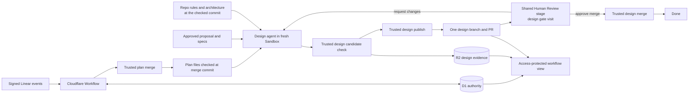

## Context

See [proposal.md](proposal.md) for the reason for this change. The current
`simple-traceability` definition ends after the planning pull request merges.
It already provides several parts that the design flow needs:

- a frozen workflow definition and repository route for each run.
- visit-scoped human decisions from signed Linear events.
- repository-local OpenSpec jobs in disposable Sandboxes.
- trusted GitHub publication and merge actions.
- cumulative patch restore from D1-selected, hash-checked R2 evidence.
- a portal that derives history from saved visits and the frozen graph.

The planning path has one run-level `run_work_products` row. That row can hold
only one branch and pull request. Its candidate policy allows only the proposal,
delta specs, and change settings. The design cannot reuse that contract. Doing
so would mix two gates. It could also remove approved plan files from a design
branch.

The new flow must keep old definitions readable. It must also keep GitHub and
Linear credentials in trusted Worker code. Design agents receive repository
write access only inside their Sandbox checkout. They receive no provider
capability.

## Goals / Non-Goals

**Goals:**

- Continue a newly allocated default run from the checked plan merge to one
  design pull request.
- Bind each human decision to one saved gate visit and one saved work product.
- Give the design agent the approved plan and bounded repository guidance from
  one exact commit.
- Validate and publish only `design.md` during design work.
- Reuse the same design branch and pull request for each requested change.
- End only after trusted code records the approved design merge.
- Show the plan and design loops from the frozen run graph and saved visit data.

**Non-Goals:**

- Generate tasks, implement code, deploy the planned product, or archive its
  OpenSpec change.
- Add semantic model review to the design stage.
- Change or backfill old run graphs, visits, work products, or evidence.
- Give a Sandbox a GitHub or Linear credential.

## Component diagram



## Event flow

```mermaid
sequenceDiagram
    participant U as Allowed person
    participant L as Linear
    participant W as DEOS Workflow
    participant D as D1/R2
    participant G as GitHub
    participant S as Sandbox agent

    U->>L: Move plan review to Merging
    L->>W: Signed state-change delivery
    W->>D: Claim decision for the saved plan gate visit
    W->>G: Merge saved plan PR at approved head
    W->>G: Read merged PR and plan files at merge commit
    W->>D: Save merge and file-check receipts
    W->>S: Start design job at checked commit
    S-->>W: design.md patch and validation output
    W->>D: Validate, store, and read back design candidate
    W->>G: Create or update the run design branch and PR
    W->>G: Read branch, base, head, and open PR
    W->>D: Save publication receipt and design gate binding
    W->>L: Enter Human Review
    alt Changes requested
        U->>L: Move design review to In Progress
        L->>W: Signed state-change delivery
        W->>S: Fresh job with saved design and bounded feedback
        S-->>W: Revised design and thread replies
        W->>G: Update the same branch and PR; reply to changed threads
        W->>L: Return to Human Review
    else Merge approved
        U->>L: Move design review to Merging
        L->>W: Signed state-change delivery
        W->>G: Merge saved design PR at approved head
        W->>G: Read merged result and merge commit once
        W->>D: Save the merge receipt and successful end visit
    end
```

## Decisions

### 1. Add a new frozen workflow version with two named gates

The default `simple-traceability` definition will advance by one version. New
runs will add these nodes after `merge_planning_pr`:

1. `verify_planning_merge`.
2. `design_author`.
3. `publish_design`.
4. `design_review`.
5. `start_new_design_round` and `design_revision_author` for changes.
6. `merge_design_pr`.
7. `done`.

`planning_review` and `design_review` both use the visible Linear state `Human
Review`. They remain different workflow nodes and visits. Each has its own
decision edges. A plan approval can call only the plan merge path. A design
approval can call only the design merge path.

The definition snapshot and digest remain the source for graph display and
execution. Versions through 16 keep their saved graph and old terminal edge.
There is no data rewrite or inferred design stage for those runs.

An alternative was to reuse `planning_review` twice. That would make late
events, retry identities, and pull request selection depend on implicit round
order. Separate nodes make the active gate explicit in the frozen graph.

### 2. Save a gate binding before entering Human Review

A new `human_gate_visits` table will bind one run visit to:

- `gate_kind`: `plan` or `design`.
- `work_type`: `proposal_and_specs` or `design`.
- the run-scoped work product.
- repository, pull request database ID and number.
- branch, base branch, and approved head SHA.
- round, state, creation time, decision delivery, and decision outcome.

The `(run_id, visit_sequence)` pair is the main key. One guarded insert creates
the binding before DEOS asks Linear to enter `Human Review`. The insert reads the
current work product. It refuses a pull request that is absent, closed, draft,
on the wrong base, or at an unknown head. The human event claims that same row.
One D1 batch saves the delivery and decision and moves the run. It cannot claim
a past visit. It cannot use work from another gate.

Provider operation identities continue to include the visit sequence. Replayed
or late signed events remain auditable, but they cannot mutate the active gate.
An unrecognized departure restores the same visible state and leaves the gate
binding open.

An alternative was to infer the gate from `current_node` and read the latest
pull request at decision time. That would not preserve the exact authority the
person reviewed.

### 3. Keep plan and design work products separate

`run_work_products` remains the plan work product for compatibility. A new
`design_work_products` table has one row per run. It stores:

- the checked plan merge commit used as the design base.
- a deterministic `deos/design/<run-hash>` branch.
- the OpenSpec change ID.
- design pull request identity, URL, and head.
- the current design manifest and publication operation.
- merge operation and merge commit.
- created and updated times.

The two work-product tables have separate guarded write methods. A design action
cannot accept a plan pull request ID. It also cannot accept a plan branch,
manifest, or operation. The portal resolves each gate through its saved binding.
It does not use a run-wide “latest pull request.”

Generalizing the existing table to several rows per run was considered. It
would change the primary key and every old query. A separate table keeps the
migration additive and leaves historical readers stable.

### 4. Check the plan merge before starting design

`merge_planning_pr` keeps the approved plan visit, pull request, and head as its
inputs. The GitHub adapter first reads the saved pull request. It asks for the
merge only when the identity and head match. It then performs the existing one
read-back that requires a merged result and merge commit.

`verify_planning_merge` uses that saved merge commit. Trusted code reads the
saved proposal at that commit. It also reads every spec in the accepted plan
list. It checks each path, byte count, and SHA-256. The pull request base must be
the saved default branch. Trusted code also reads the default branch ref. The
merge commit must be part of that branch. The receipt saves the commit, plan
digest, checked paths, and check time.

A timeout or lost merge reply returns to the same read-back and provider
operation. It does not create or merge another pull request. A closed pull
request causes a safe failure. A wrong head, wrong base, conflict, failed merge
rule, or mismatched ID does the same. Missing or changed plan files record
`planning_merge_files_unproved`. DEOS posts a short repair note. It starts no
design attempt. After repair, an operator can retry that exact check.

The design job base is the checked merge commit. Later changes to `main` do not
silently alter its approved plan or repository guidance.

### 5. Use a typed, design-only OpenSpec job

The design job uses the native `/opsx:continue` operation with the trusted
change identity. It starts in a fresh Sandbox at the checked plan merge commit.
The input materializer supplies:

- the approved proposal and complete delta specs with hashes.
- the prior accepted design for a revision, when one exists.
- bounded Linear and GitHub review feedback for the saved design pull request.
- root `AGENTS.md` and `agents.md` files when present.
- root `architecture.md` and `architecture-*.md` files when present.
- `docs/current-architecture.md` when present.

Repository guidance is read from the same commit as the job base. Paths are
fixed, symlinks are rejected, files are UTF-8 text, duplicate names are
rejected, and the full context has a trusted size bound. Missing optional guide
files are recorded, not invented.

The prompt tells the agent to read the OpenSpec design instructions and all
declared dependencies. It may create or revise only
`openspec/changes/<change>/design.md`. It may not write tasks, app code,
configuration, canonical specs, archive paths, or another change. It has no
provider access.

Using the general planning-author job was considered. Its candidate inventory
and review loop are specific to proposal/spec traceability. A typed design job
keeps its output and permissions narrow.

### 6. Build a separate immutable design candidate

After the Sandbox exits, trusted code builds `design-candidate.json`. The
candidate names the run, round, source attempt, checked base, and change. It
holds the `design.md` bytes and hash. It can hold review replies. One digest
covers all of these fields.

The trusted checks require:

- exactly one changed repository path, the named change's `design.md`.
- no deletion or edit to the approved proposal or specs.
- no whitespace error.
- `openspec validate <change> --strict`.
- a non-empty design with the repository-required component diagram, event
  flow, minimal data model, and failure modes.

The Worker repeats the path and strict OpenSpec checks after collection. It
writes the candidate and check receipt to create-only R2 keys. It reads both
back by SHA-256. Only then can it index the accepted candidate in D1. A mismatch
uses `invalid_design_candidate`. It cannot enter publish or Human Review.

The design candidate is separate from `planning_candidates`. Mixing them would
weaken both file policies and make a proposal/spec review appear to certify a
design it never saw.

### 7. Publish and revise one design pull request through trusted code

`publish_design` reads the accepted design and saved design work product. The
GitHub adapter creates the fixed design branch at the checked plan merge commit.
It writes only `design.md`. It opens one ready pull request to `main`. It never
deletes proposal or spec files from the base.

Before entering design review, trusted code reads back:

- the branch ref and exact head.
- the pull request database ID and number.
- open, non-draft, unmerged state.
- the saved base and head branches.
- `design.md` at the head with the candidate hash.

The first post saves all facts and its provider receipt. A retry after a lost
reply searches only by the fixed branch and saved pull request ID. It uses that
same resource or fails safely. It never makes a second pull request.

A design change is a new attempt and candidate round. It restores the last
accepted design from the patch and R2 proof. It then updates the same branch and
pull request. The candidate must include one short reply for each changed root
review thread. Trusted GitHub code posts one safe reply to each root. It says
what changed or why not. It leaves the thread open. A missing or unknown reply
rejects the post.

### 8. Merge the approved design head and stop

The design gate binding freezes the pull request and approved head. The trusted
`merge_design_pr` action reads that identity, asks GitHub to merge it, and reads
the pull request back once. Success requires the merged flag and a merge commit.
The provider operation and gate visit must agree. The design work product, pull
request, and head must also agree. Only then can D1 move to `done`.

An ambiguous response reuses the same provider operation and read-back. A
confirmed prior merge is reconciled. A mismatch records a safe failure. There
is no later provider check or agent job after the recorded design merge.

The plan merge helper will be generalized around a typed work-product input,
but plan and design entry points keep distinct action names and database
methods. This shares the proven provider logic without making the selected gate
implicit.

### 9. Derive the portal view from the frozen graph and gate bindings

The new definition maps these logical stages:

- planning author and publish nodes to `Create planning PR`.
- independent trace nodes to `Independent review`.
- both human gates to `Human approval`.
- plan merge and file check to `Merge plan & check`.
- design author and publish nodes to `Create design PR`.
- design merge to `Merge design & check`.
- the terminal node to `Completed`.

The stage detail keeps every visit. A gate visit displays its saved gate name,
round, work type, pull request, approved head, and governed artifact links. The
active or selected visit is highlighted. Design cycle count comes from saved
design rounds, not wall-clock time or the current Linear state. The return edge
from design review to design work stays visible.

The portal validates GitHub URLs against the work product's frozen repository.
It exposes only safe IDs, hashes, counts, states, and governed links. It does not
read GitHub or change D1 while rendering. Older frozen definitions use their
existing stage map and show no design stage.

## Minimal data model

```text
orchestration_runs
  1 ── 1 run_work_products                 # existing plan branch and PR
  1 ── 1 design_work_products              # new design branch and PR
  1 ── * human_gate_visits                 # exact visit authority
  1 ── * design_candidates                 # immutable accepted revisions
  1 ── * agent_attempts
  1 ── * provider_operations

human_gate_visits
  (run_id, visit_sequence) PK
  gate_kind, work_type, round, state
  work_product_kind, pull_request_database_id, pull_request_number
  repository, base_branch, head_branch, approved_head_sha
  decision_delivery_id, decision_outcome, created_at, decided_at

design_work_products
  run_id PK
  base_commit, repository, base_branch, remote_branch, change_id
  pull_request_database_id, pull_request_number, pull_request_url, head_sha
  design_manifest_digest, design_manifest_json, publication_operation_id
  merge_operation_id, merge_commit_sha, created_at, updated_at

design_candidates
  candidate_id PK
  run_id, round, source_attempt_id, base_commit, change_id
  design_digest, candidate_r2_key, candidate_sha256
  validation_r2_key, validation_sha256, state, created_at, accepted_at
```

Foreign keys bind each new row to its run, attempt, candidate, or provider
operation. Unique rules cover the fixed branch, pull request ID, and R2 keys.
They also cover one gate visit and one candidate digest per round. Database
checks guard state and gate values. No migration updates old rows.

## Failure modes

| Failure | Result |
| --- | --- |
| Plan pull request identity or approved head does not match | Record a safe system-action failure; do not verify or start design. |
| Merge reply is lost | Read back the saved pull request under the same operation identity. |
| Approved plan file is absent or has the wrong hash at the merge commit | Record `planning_merge_files_unproved`, ask for repair, and allocate no design attempt. |
| Repo guidance is missing | Record the missing optional path and continue with the approved plan and available guidance. |
| Repo guidance is unsafe, too large, or not valid text | Fail input materialization before the Sandbox starts. |
| Design changes another path or fails strict OpenSpec | Reject the candidate and do not publish it. |
| R2 write or read-back is ambiguous | Do not index or publish the candidate until the exact hash is proved. |
| Design branch or pull request read-back differs | Record a safe publication failure and do not enter Human Review. |
| A revision omits an affected thread reply | Reject publication; leave all review threads unchanged and open. |
| A late plan decision arrives during design review | Record it as unrelated to the active visit; do not change the run or either pull request. |
| Design merge is rejected or conflicts | Record a safe failure; do not claim completion. |
| Workflow deploy rolls back | Existing runs restore their frozen definition; new runs use the selected deployed version after policy read-back. |

## Migration Plan

1. Add the new D1 tables and indexes as an additive migration. Apply them to a
   local database and run foreign-key checks.
2. Add design candidate checks and typed design job inputs. Add a separate
   design work store, gate binding, and trusted GitHub actions.
3. Add the next `simple-traceability` definition and update definition,
   orchestrator, retry, and lifecycle tests. Keep older snapshots loadable.
4. Update the portal model and presentation map. Test old and new frozen graphs,
   both gate visits, the design return loop, and both pull requests.
5. Deploy with dispatch off for the DEOS sample-project route. Apply the remote
   migration. Register the new definition and select it for that route. Read
   back the exact version and digest.
6. Enable only the sample-project route. Create a real Linear issue for a search
   tool CLI. It searches Google for a term. An LLM returns a short two-paragraph
   digest of the articles found.
7. Review and merge the new plan pull request through the plan gate. Ask for one
   design change. Confirm that DEOS updates the same design pull request. Check
   that each changed root thread gets an open reply. Then approve its merge.
8. Check the sample repo after the run. It must have `proposal.md`, all named
   delta specs, and `design.md`. It must have no tasks or app code. Capture the
   signed Linear delivery and D1 run. Capture both gate visits and provider
   operations. Capture R2 hashes, both GitHub pull requests, both merge commits,
   Sandbox cleanup, and portal screenshots.
9. Disable sample dispatch and read it back. Attach the sanitized executable
   evidence and screenshots to the implementation pull request.

Rollback first disables dispatch for the affected route. Then it selects the
previous registered definition for new runs and deploys the prior Worker and
portal versions. The additive tables and immutable evidence remain in place.
Active runs continue from their frozen definition or are stopped through their
recorded gate. Rollback does not rewrite a run to version 16.

## Risks / Trade-offs

- **Two work stores repeat some code** -> Share typed helper functions. Keep the
  plan or design choice clear at every trust check.
- **The design branch may fall behind `main`** -> Keep the reviewed base. Let
  GitHub reject a conflict before approval.
- **The repo guide list may miss a useful nested file** -> Start with the agreed
  root files and current architecture. Add more only through a reviewed rule.
- **The same Linear state represents two gates** -> Bind decisions to the exact
  run visit, gate kind, work product, and head in D1.
- **Design validation does not prove architectural quality** -> Keep explicit
  human review. The trusted checks prove form, scope, identity, and provider
  state only.
- **A deploy can expose a new graph too soon** -> Keep sample dispatch off at
  first. Select and read back the digest. Enable only the sample route for the
  provider canary.
