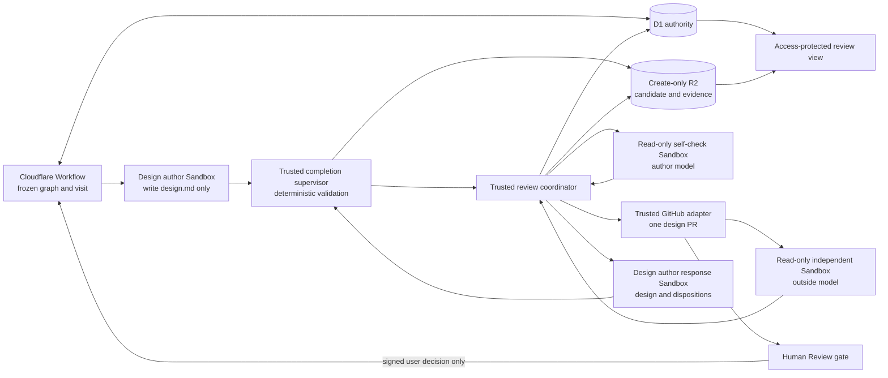

## Context

The current design path already creates a validated `design.md` candidate, stores
its immutable evidence, publishes one deterministic design pull request, and
waits at a user-only design gate. The planning merge commit is the immutable
base for the design job. Its service-authored context contains the approved plan,
an optional prior design, complete review feedback, and allowlisted repository
guidance from that commit.

This change inserts semantic checks between design authoring and every visit to
the design human gate. It must preserve four existing boundaries:

- Agent sandboxes have no GitHub or Linear capability. Trusted Worker adapters
  own publication, provider summaries, and state transitions.
- A design author may change only
  `openspec/changes/<change>/design.md`; deterministic supervisor and Worker
  checks remain authoritative for path, OpenSpec, whitespace, and required
  sections.
- D1 is the workflow authority, while create-only, hash-checked R2 objects hold
  candidates, validation receipts, and model evidence.
- Each run restores its frozen workflow definition. New review nodes must not be
  inferred or inserted into an older run.

See `proposal.md` for motivation and the three delta specs for the required
behavior.

## Goals / Non-Goals

**Goals:**

- Check the first private design with the author's saved model and reasoning
  level before any GitHub publication.
- Independently check every published design version that may enter human
  review, using the run's saved outside model and the exact pull request head.
- Preserve review inputs, findings, author dispositions, and evidence as an
  auditable sequence of rounds.
- Make gate eligibility a trusted, exact-input predicate rather than an agent
  claim or a displayed check status.

**Non-Goals:**

- Rechecking or rewriting the saved graphs of runs created before this workflow
  version.
- Giving a reviewer write access or allowing any agent output, check, or comment
  to approve or merge a design.
- Changing the approved proposal, delta specs, or repository guidance during a
  design round.
- Generalizing the planning and design artifact schemas into one migration. The
  implementation may reuse review primitives, but design records keep explicit
  identities and gate rules.

## Component Diagram

The review coordinator is trusted Worker logic, not a new credentialed agent.
It constructs immutable inputs, validates model output, selects the next frozen
graph edge, and invokes existing trusted publication and evidence adapters.

## Event Flow

### First design round

1. The Workflow allocates round `1` and starts the existing initial design
   author job with the approved-plan manifest, design base commit, allowlisted
   guidance manifest, and frozen author and outside model settings.
2. The supervisor accepts only the allowed design path and runs the existing
   deterministic checks. The Worker independently repeats those checks, writes
   the candidate and receipt to create-only R2 keys, reads them back by digest,
   and indexes the candidate in D1. It does not create a branch or pull request.
3. The coordinator derives a canonical self-check input digest and starts a
   fresh read-only Sandbox. The input contains the exact candidate, approved
   plan, repository guidance, base commit, round, and the saved author model and
   reasoning level. The reviewer can return structured findings but cannot edit
   the candidate or call a provider.
4. Invalid proof or an execution failure blocks publication. Valid findings go
   to the design author in the same round. Each repaired candidate passes the
   full deterministic checks and receives a new digest before a fresh
   self-check. The graph uses the existing bounded semantic-repair policy of at
   most three author repair turns; exhaustion reaches a typed design-review
   failure.
5. When the self-check has no open concern, the trusted GitHub adapter publishes
   the accepted candidate to the deterministic design branch and pull request.
   It reads the pull request back and saves its database identity and exact head.
6. The coordinator reads `design.md` and the unchanged approved planning files
   from that exact head, verifies their hashes, adds the pull request identity
   and head to the review input, and starts a fresh read-only independent review
   with the saved outside model.
7. A structurally valid independent result completes discovery even if it has
   concerns. The author receives every finding and records exactly one
   `applied`, `declined`, or `no_change` disposition with a short reason.
   `declined` and `no_change` are valid outcomes; reviewers do not vote on the
   design.
8. If the response changes `design.md`, trusted code validates and publishes the
   candidate to the same pull request, reads back the new head, marks the prior
   exact-head result stale, and performs a new independent review. Concerns in
   that result also require dispositions. The round repeats until the current
   head has a valid result with complete dispositions and no subsequent design
   change. The same three-response bound prevents an unending review loop.
9. The Worker atomically creates a gate binding only after the eligibility
   predicate below passes. It refreshes the exact-head Check Run and provider
   summary, then enters `Human Review`. Those provider effects use stable
   operation identities and are not authority to approve the gate.

The accepted first-draft self-check remains evidence that publication was
earned. If independent feedback later changes the design, the view labels that
self-check as applying to the earlier candidate; it is not misrepresented as a
check of the new head and is not rerun. Current-head readiness comes from the
final independent result.

### Later human-change round

1. A signed Linear delivery from `actor.type == user` that moves the active
   design gate from `Human Review` to `In Progress` closes that gate visit and
   allocates the next monotonic design round on the same pull request.
2. The revision author receives the prior design and all root-thread review
   items. Its candidate and one short reply per affected root thread pass the
   normal completion checks. The trusted adapter publishes the candidate and
   posts replies idempotently without resolving threads.
3. The round records `self_required = false`; no self-check attempt, Sandbox, or
   synthetic result is created. The view renders this as “not required,” not as
   a pass.
4. The changed head follows the independent-review and author-disposition loop
   from steps 6–8 above. Only current independent proof can create the next
   design gate binding.

An unchanged revision is allowed when every review item has an explicit
reply explaining why no design change was made. It still receives a fresh
independent result for the current head and new round; old proof is not promoted
to the new visit.

## Decisions

### 1. Bind every result to a canonical review input

Trusted code builds a canonical `DesignReviewInput` and hashes its encoded form.
The common fields are run, change, round, phase, candidate digest, approved-plan
manifest digest, design base commit, guidance manifest digest, model identity,
and reasoning setting. Independent inputs additionally require pull request
database identity and head SHA. Every referenced object is read back and
hash-checked before an attempt starts and again before its result is accepted.

This makes staleness deterministic. A result is current only when all fields
that apply to its phase still match. Model output cannot choose or omit those
bindings. Passing loose file paths or branch names to a reviewer was rejected
because either can change while a review is running.

### 2. Reuse immutable candidates and separate private review from publication

The first candidate uses the existing candidate validation and R2 persistence
path, but publication becomes a later trusted graph node. Self-check repairs
create new candidate identities; they never overwrite R2 evidence. Only the
candidate selected by a passing self-check can be published.

After publication, an independent reviewer consumes bytes read from the exact
GitHub head, not the author's checkout. The Worker also proves that the approved
planning inventory at that head still matches the plan merge. This closes the
gap between “the author produced these bytes” and “these bytes are what a person
will review.” Publishing first and checking a local candidate was rejected
because it cannot prove the pull request version.

### 3. Add explicit review nodes to a new frozen graph version

The new default graph places design self-discovery and repair before the first
publish, then independent discovery, author response, optional republish, and
independent recheck before each design gate visit. A later revision edge enters
after the self-check subgraph. Each transition uses the existing source-visit
and traversal guards, so an exact replay reuses the transition while a genuine
later round receives a new visit and round.

Old definitions remain loadable by saved shape and digest and keep their prior
design path. Runtime feature detection or graph mutation was rejected because
it would alter the meaning of an active run.

### 4. Treat independent concerns as advice with mandatory accounting

An accepted independent result owns a stable finding inventory. Before the
result can support a gate, every finding must have one validated author
disposition. A response that changes the candidate makes that result historical
and requires a complete review of the new head; findings are not silently
carried forward as proof. A response with only declines or no-change reasons
leaves the head unchanged, so that exact-head result can remain current.

This separates review completeness from reviewer agreement. Blocking on any
concern was rejected because it would grant the outside model approval power.
Ignoring concerns was rejected because a person could not tell whether the
author considered them.

### 5. Gate on trusted D1 state, not presentation state

For round `1`, gate eligibility requires:

- a valid accepted self-check for the candidate that first became publishable;
- a valid accepted independent result bound to the current pull request head;
- one valid disposition for every finding in each independent result that
  triggered an author response; and
- no newer candidate, publication intent, head observation, or review attempt
  left unresolved.

For later rounds, the first condition is replaced by `self_required = false`.
In every round, current plan, base, guidance, model, pull request identity, and
head values must match the accepted input. One guarded D1 transaction records
the accepted result IDs and exact head on the new human-gate visit. The existing
user-only signed-event rule remains the sole merge authority.

### 6. Keep evidence immutable and expose a derived protected view

D1 stores normalized identities, outcomes, current/stale state, and relations.
R2 stores validation receipts, review inputs, and raw structured model outputs
under create-only keys. Acceptance requires a D1 digest match after R2 read-back.
The protected review page derives its timeline from those accepted records and
shows the round, phase, model, result, dispositions, evidence link, candidate
digest, and independent head SHA. It explicitly labels self-check as historical
after a later edit and “not required” in later rounds.

Raw evidence continues to use an allowlisted, hash-verifying route with
`Cache-Control: no-store`. Check Runs and Linear summaries contain only bounded,
safe status and a protected link; they do not embed prompts, raw provider text,
credentials, or approval language.

### 7. Preserve complete authored and review context

Trusted workflow code does not impose local byte, character, file-count,
finding-count, range-count, or reply-count ceilings on otherwise valid planning,
design, and review material. It passes complete context forward and lets an
actual provider or platform boundary produce an observable failure. A new
ceiling requires measured evidence for that boundary and a clear diagnostic.

This decision does not remove protections for untrusted ingress, credentials,
process output, sandbox artifact collection, provider pagination completeness,
or the three-turn semantic repair policy. Those protect a resource or authority
boundary rather than shortening valid workflow context. If workflow context
approaches a durable-store boundary, large values move to hash-checked R2
objects instead of being silently truncated.

## Minimal Data Model

The names below are logical D1 records. They may share existing review storage
primitives, but these keys and constraints must remain visible to trusted code.

| Record | Minimum fields and constraints |
| --- | --- |
| `design_candidates` (existing) | `candidate_id`, `run_id`, `round_no`, `design_sha256`, `plan_manifest_sha256`, `base_commit`, `guidance_manifest_sha256`, `r2_key`, `validation_receipt_id`, `created_by_attempt`; candidate identity and R2 key are immutable and unique. |
| `design_review_rounds` | `round_id`, `run_id`, monotonic `round_no`, `kind` (`initial` or `human_revision`), `self_required`, frozen author/outside model settings, `status`; unique on `(run_id, round_no)`. |
| `design_review_attempts` | `attempt_id`, `round_id`, `phase` (`self` or `independent`), `input_sha256`, `candidate_id`, nullable `pr_database_id` and `head_sha`, model and reasoning identity, `outcome`, evidence manifest key and digest, timestamps; index the input digest for exact-result reuse, while keeping each retry as a distinct attempt. A guarded accepted-result link allows only one current accepted proof for a phase and input. |
| `design_review_findings` | `attempt_id`, stable `finding_id`, complete message and source ranges, severity/category; unique on `(attempt_id, finding_id)` and immutable after acceptance. |
| `design_review_dispositions` | `attempt_id`, `finding_id`, `author_attempt_id`, enum `applied`/`declined`/`no_change`, complete reason, resulting candidate ID; exactly one active disposition per finding. |
| `design_gate_binding` | Existing gate-visit identity plus `round_id`, `pr_database_id`, `head_sha`, nullable accepted self attempt, accepted independent attempt, and input digest. Insert only through the eligibility transaction; immutable for that visit. |

Attempt rows record failed and invalid executions as history, but only an
accepted manifest may be referenced by a gate. Current versus stale is derived
from the saved bindings and latest trusted observations; it is not a mutable
boolean supplied by an agent.

## Failure Modes

| Failure | Required behavior |
| --- | --- |
| Candidate changes a forbidden path or fails deterministic validation | Reject it before semantic review. Keep the last accepted candidate and record a bounded safe cause for same-session author repair where allowed. |
| Review input object is missing or fails a digest check | Create no model attempt and no proof. Record an integrity failure and take the typed failure edge. |
| Self-check finds concerns | Keep the design private, send only validated findings to the author, and recheck the new candidate. Exhaustion of the three-turn bound fails the stage without publication. |
| Reviewer returns malformed identities, ranges, unsafe values, or an invalid structure | Do not infer a result. Use the review framework's bounded proof-repair path for that same immutable input; otherwise fail closed. |
| Model channel is unavailable or times out | Record the failed attempt and keep the gate ineligible. A stage retry may allocate a new attempt only after cleanup is complete; it must reuse the same frozen input and model setting. |
| GitHub publication has an ambiguous result | Reconcile through the deterministic branch, pull request, and operation identity, then read back the head. Never start independent review from an unconfirmed write response. |
| Pull request head changes during or after independent review | The compare-and-set acceptance loses, the result remains historical/stale, and the Worker rereads the head. An unexpected path or changed plan file fails closed; an allowed design update requires a fresh review. |
| An author omits or duplicates a disposition | Reject the response and do not update the pull request or enter the gate. Declines remain valid when complete. |
| An author response changes the design | Publish to the same pull request, invalidate current-head eligibility, and independently review the confirmed new head. Exhaustion of the response bound reaches a typed failure rather than bypassing review. |
| Approved-plan, base, guidance, or saved model data no longer matches | Mark dependent proof stale and prevent a gate binding. Do not silently refresh the context inside the round. |
| R2 evidence read-back or D1 digest verification fails | Do not accept the attempt or expose its raw evidence. Preserve the integrity failure for operator retry or reconciliation. |
| Duplicate Workflow delivery or node replay occurs | Reuse stable round, traversal, candidate, attempt, and provider-operation identities. Do not create another model call, comment, Check Run, or gate visit for an exact replay. |
| Agent, check, bot comment, or non-user Linear actor appears to approve | Audit the event and leave the active human gate waiting. No merge action is authorized. |
| A saved older run has no design-review nodes | Restore and execute its original graph unchanged. The UI shows no invented checks or proof. |

## Risks / Trade-offs

- **Review latency and model cost increase for every design version** → Run the
  self-check only for the first private draft, reuse an attempt only for the
  exact canonical input digest, and keep loops visit-bounded.
- **The author-model self-check may share the author's blind spots** → Treat it
  as a private quality filter, then require the frozen outside model on every
  published head.
- **A self-check can become historical after independent feedback changes the
  design** → Preserve its exact candidate binding, label it accurately, and use
  final independent proof—not the old self-check—for current-head readiness.
- **Exact-head checks can race with GitHub updates** → Read back provider state
  and use a D1 compare-and-set on the observed head before accepting proof or
  creating a gate visit.
- **A bounded review loop can fail a design that might converge with more
  turns** → Prefer a visible typed failure and stage retry over an unbounded
  Workflow or a hidden bypass.
- **More evidence can expose sensitive repository context** → Keep raw inputs
  in hash-checked R2, serve them only through the protected no-store route, and
  publish bounded summaries.
- **Complete context can expose a real provider or storage boundary** → Record
  that boundary and its safe provider evidence. Use streaming or hash-checked R2
  references when needed instead of adding an unmeasured local ceiling.

## Migration Plan

1. Add the D1 review-round, attempt, finding, disposition, and gate-binding
   fields with additive migrations. Deploy readers that tolerate no design
   review rows before enabling writers.
2. Add immutable R2 manifest kinds and trusted validators for design review
   input and output. Reuse the existing attempt-scoped model channel, candidate
   validation, Sandbox cleanup, GitHub reconciliation, and protected evidence
   route.
3. Register a new workflow definition version containing the first-round and
   later-round subgraphs. Keep all older definition snapshots and loaders
   unchanged. Switch the project default only after graph, replay, staleness,
   exact-head, and user-only gate tests pass.
4. Extend the review page, Check Run summary, and bounded Linear summary to show
   the new records. Verify first draft, independent response with and without an
   edit, repeated human revision, stale head, invalid proof, duplicate replay,
   and unauthorized approval paths.
5. Roll back by restoring the prior default definition for new runs. Runs
   already frozen to the new version continue with that version, so the code and
   additive schema readers remain deployed until those runs finish.
