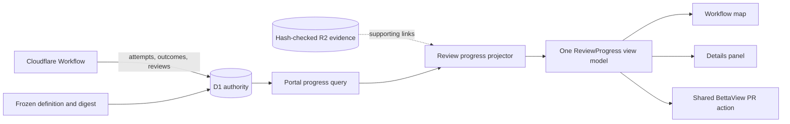

## Context

The portal already reads the frozen workflow definition, current visit, attempts,
accepted reviews, candidate identities, pull request bindings, and durable failure
outcomes from D1. Review artifacts in R2 can support those records. They are not
the source of the displayed state. See `proposal.md` for the user problem and
`specs/workflow-observability/spec.md` for the required behavior.

Planning and design have multi-step checks. A planning self-check can include
discovery, an author repair, and a recheck. An independent review can include
discovery, an author response, publication, and a final exact-head trace. The
design flow has the same need to distinguish active, actionable, failed, and
complete work. A pull request can exist before those steps finish. Therefore,
neither the current node nor the pull request alone is enough to label a check.

Runs keep an immutable workflow definition. The portal must interpret the run's
frozen definition, including older versions, rather than the latest deployed
graph. Existing review and approval rules remain authoritative.

## Goals / Non-Goals

**Goals:**

- Derive one review-progress projection from durable flow and review facts.
- Bind every state and proof result to the current plan or design version.
- Give the workflow map and details panel the same request-scoped projection.
- Preserve a published pull request independently of review readiness.
- Make durable, safe failure facts sufficient for the main error display.

**Non-Goals:**

- Change the workflow graph, review rules, repair limits, or approval gates.
- Re-run reviews, infer missing checks, or manufacture historical failure facts.
- Make R2 artifacts, elapsed time, Linear state, or pull request presence a
  progress authority.

## Component Diagram



The progress query loads the current work identity, frozen definition identity,
required-check contract, authoritative visit and attempt states, accepted review
bindings, outstanding author obligations, failed outcomes, and published pull
request binding. The projector is a pure server-side reducer. It returns one
view model that both portal surfaces consume. UI components do not derive or
override check state.

## Decisions

### 1. Describe required checks beside each immutable workflow definition

Each supported frozen definition has a review-progress contract keyed by its
definition digest. The contract lists only checks that definition requires. A
check entry contains a stable `check_key`, its `artifact_kind` (`planning` or
`design`), its label, the stages that make it active, the accepted result that
completes it, and the author or final-check obligations that keep it incomplete.
The contract is presentation metadata; it does not add a graph node or alter an
edge.

New definition bundles include this contract with the reviewed graph. Adapters
for already supported definition digests live with their immutable definition
loaders. A run always selects the adapter for its saved digest. If a check is
absent from that contract, the projector does not create it and its absence does
not block readiness. An unknown digest produces no readiness claim and a bounded
portal data error; it does not fall back to the current definition.

This is preferred to a list hard-coded in the page because it preserves old and
later-round flows. Inferring checks from node names was rejected because names
do not express completion and obligation rules.

### 2. Bind progress to one canonical work identity

The progress query selects the current artifact identity already saved by the
controller. Before publication, this is the accepted candidate inventory digest.
After publication, it is the exact saved pull request head used by review proof.
Every attempt, accepted result, disposition set, and final check used by the
projector must carry or resolve to that identity.

A fact bound to an older identity remains history but cannot produce `Running`,
`Needs work`, or `Passed` for the current version. This is preferred to using
timestamps because retries and restored runs can finish out of wall-clock order.

### 3. Use one deterministic state reducer

For each required check, the projector evaluates authoritative facts in this
order:

1. `Running` when a contract-listed job or final check is active for the current
   work identity. This replaces any earlier result while that job runs.
2. `Needs work` when no matching job is active and the latest accepted review
   result for the current identity has an outstanding author fix, reply, or
   required final check.
3. `Failed` when no matching job is active and the latest contract-listed stage
   for the current identity ended without an accepted review result. The state
   points to that stage's durable failure envelope.
4. `Passed` when the contract's completion result is accepted for the current
   identity and no fix, reply, publication, or final check remains due.
5. `Not started` when none of the conditions above holds for the current
   identity.

Visit sequence, traversal identity, and the controller's attempt state determine
which fact is active or latest. The reducer never compares the current time. The
planning independent-review contract, for example, cannot pass on discovery
alone when an author response or final exact-head trace is still due.

Artifact readiness is `true` only when every contract-listed check is `Passed`
and the saved flow's existing gate facts say the artifact has reached human
review. For a contract with no checks, the all-checks condition is empty and the
saved gate facts decide readiness. The projector neither invents a blocker nor
creates a success condition. Readiness is display data only and cannot dispatch
or bypass a gate.

One server request computes the projection once. The workflow map and details
panel receive the same check objects and readiness value. This is preferred to
two UI reducers because separate reducers can disagree during later flow changes.

### 4. Persist a bounded failure envelope before recording stage failure

Every review-stage failure writer stores a failure envelope in the same guarded
operation that makes the attempt or stage terminal. The envelope contains:

- `stage_key`, from the frozen progress contract;
- `safe_reason`, the exact sanitized message retained for display;
- `category`, the exact retained safe category;
- optional `exit_code`, `timed_out`, and `signal` values.

The reason is sanitized before the write and stored with the existing bounded
text limit. Exit code uses a bounded integer. Timeout is nullable so absence is
distinct from `false`. Signal uses the controller's bounded normalized value.
The portal escapes all strings and shows optional fields only when stored.

The portal uses `safe_reason` as the main error message. It may link to accepted,
hash-checked evidence, but it never parses a transcript or artifact to replace
the reason. Atomic persistence is preferred to reconstructing failures at read
time because evidence can be absent, inaccessible, or unsafe for direct display.

### 5. Treat pull request visibility as separate data

The view model carries the saved planning or design pull request whenever it has
been published, regardless of the current check state. A shared pull request
action component renders one BettaView action with BettaView's beta symbol. The
map and details panel both use this component. They do not add a GitHub action or
turn pull request presence into a review or readiness state.

## Event Flow

1. The controller starts a review job with its run, visit, check key, and current
   work identity. D1 records the attempt as active.
2. A portal request reads the frozen definition digest and matching progress
   contract with the current work and review facts. The reducer returns
   `Running` for that check, even if an older accepted result exists.
3. A review result is accepted and bound to the same work identity. If author
   work, a reply, publication, or a final check is due, the reducer returns
   `Needs work` after the active attempt ends.
4. Later author and controller events clear only their saved obligations. A
   required final check creates a new active attempt, so the state returns to
   `Running`.
5. When the contract's completion proof is accepted for the current identity
   and no obligation remains, the reducer returns `Passed`. The artifact becomes
   ready only after every required projected check passes.
6. If a stage ends without an accepted result, the controller atomically stores
   its bounded failure envelope and terminal state. The reducer returns `Failed`
   and the UI displays those exact saved facts.
7. If a new candidate or pull request head becomes current, facts bound to the
   former identity become history. Each required check starts again from the
   facts, if any, bound to the new identity.
8. Publication stores the pull request binding separately. A later failure
   changes the check projection but leaves the BettaView action visible.

## Minimal Data Model

No materialized progress table is added. Progress is a projection over existing
authoritative records plus the following contracts and failure fields:

```text
ReviewProgressContract (immutable, keyed by definition_digest)
  check_key
  artifact_kind: planning | design
  label
  active_stage_keys[]
  completion_result_key
  obligation_keys[]

DurableFailureEnvelope (on the terminal attempt/stage outcome)
  stage_key
  safe_reason
  category
  exit_code?        bounded integer
  timed_out?        boolean
  signal?           bounded normalized value

ReviewCheckProjection (request-only)
  check_key
  artifact_kind
  work_identity
  state: not_started | running | needs_work | failed | passed
  failure?          DurableFailureEnvelope

ArtifactReviewProjection (request-only)
  artifact_kind
  work_identity
  checks[]
  ready_for_human_review
  published_pull_request?
```

Existing run, visit, attempt, accepted-review, disposition, candidate, exact-head,
and pull request records remain the source facts. The implementation should add
failure columns to the existing terminal outcome record rather than duplicate
attempt history in a new table. A database constraint or writer validation must
require `safe_reason`, `category`, and `stage_key` for new review-stage failures.

## Failure Modes

- **Unknown or mismatched definition digest** -> Return a bounded data error and
  no readiness claim. Never use the latest graph or invent checks.
- **Active attempt is bound to stale work** -> Ignore it for current progress.
  The current version remains `Not started` unless it has matching facts.
- **Failure envelope cannot be committed** -> Do not commit the stage as a
  displayable terminal failure. Let the existing controller reconciliation path
  record a bounded durable controller failure before the portal shows `Failed`.
- **Optional process fact is absent** -> Omit that row. Do not display a default
  exit code, timeout, or signal.
- **Legacy failure lacks a safe reason** -> Use an existing durable bounded cause
  only when it is already an authoritative field. Otherwise show the non-success
  state without reconstructing a reason from R2.
- **R2 evidence is missing or fails its hash check** -> Keep the D1-derived state
  and main failure reason. Hide or disable only the supporting evidence link.
- **D1 read fails** -> Fail the progress response closed. Do not reuse a success
  label from pull request presence or cached page age.
- **Map and panel render during an update** -> Both render the same projection
  from one response. The next poll replaces both together.
- **Published pull request precedes a failure** -> Preserve the shared BettaView
  action while showing the failed check and no readiness claim.
- **Unsafe failure text reaches a writer** -> Sanitize and bound it before the
  terminal write. Never persist credentials, headers, or raw provider replies.

## Risks / Trade-offs

- **Definition adapters can drift from their graphs** -> Validate every bundled
  contract against known node and result keys, and snapshot-test each supported
  definition digest.
- **A pure projection performs more reads than a cached status field** -> Use one
  focused query and a request-local reducer. Correctness is more important than
  duplicating mutable state in this small portal view.
- **A newly published head changes the work identity** -> Make publication and
  proof bindings explicit in tests so a candidate-level pass cannot leak onto an
  unreviewed head.
- **Legacy failures may have less detail** -> Preserve only existing bounded
  facts and omit missing optional data. Do not weaken new failure writes.
- **UI wording or color can diverge** -> Centralize labels, icons, tones, and the
  BettaView action in shared components driven by the state enum.

## Migration Plan

1. Add nullable bounded failure-envelope fields to the existing durable terminal
   outcome storage. Add reviewed progress contracts for each supported frozen
   definition digest. Do not change any graph or historical check list.
2. Deploy controller writers that populate the envelope before they commit new
   review-stage failures. Backfill only values already present in an authoritative
   durable field; do not infer from transcripts.
3. Add the query and pure projector behind the portal response. Test all five
   states, state precedence, work-version changes, omitted checks, later-round
   flows, legacy failures, and retained pull requests.
4. Switch the map and panel together to the shared projection and BettaView
   action. Remove their independent success heuristics in the same release.
5. Validate against saved D1 facts and capture signed-in screenshots showing the
   map and panel for non-success and passed states. Treat deterministic fixtures
   as supporting proof, not as visual or provider-originated evidence.

Rollback restores the prior portal reader and components while leaving the
additive failure fields unused. Because this change does not alter workflow
edges or approval authority, in-flight runs continue under their frozen graphs.
