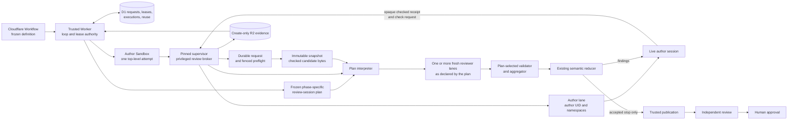

## Context

See `proposal.md` for the motivation and the three delta specs for required
behavior. The current architecture gives every top-level attempt a sealed
Sandbox, UUIDv7 identity, pinned supervisor, frozen workflow definition,
D1-backed authority, and hash-checked R2 evidence. It separates deterministic
artifact validation, semantic self-check, trusted publication, independent
review, and human approval.

This change moves only plan and design self-check execution into the active
author's Sandbox. The author session must survive check, repair, and recheck,
while every reviewer remains a fresh, read-only child execution. The Sandbox
has no GitHub or Linear credential. Provider writes, independent review, and
human gates remain outside it.

A shared Sandbox is not permission to share process state. The pinned
supervisor must isolate the author and reviewer lanes with kernel-enforced
credentials and namespaces. It must also execute the phase-specific review
contract exactly as frozen for the run. Planning discovery may use two blind
directional sessions and a link reconciler; a design check may use a different
number of sessions, dependency graph, result schema, and aggregator. The
in-Sandbox executor must not replace either topology with a generic one.

## Goals / Non-Goals

**Goals:**

- Keep one plan or design author session alive for the complete private
  self-check and repair loop.
- Interpret each check and recheck solely from its frozen review-session plan,
  preserving its session count, dependencies, blindness rules, schemas,
  aggregator, and semantic slot.
- Give every launched reviewer a distinct child identity, fresh model session,
  enforceable process boundary, immutable checked candidate, and read-only
  tools.
- Give every request, preflight fault, execution, reuse decision, and accepted
  stop durable and replayable identity before the author Sandbox is cleaned up.
- Recover abandoned work without duplicate model calls, concurrent reviewers,
  or extra semantic turns.
- Preserve candidate-based identical-input reuse across top-level retries and
  preserve the current reducer's limits, finding rules, and stop outcomes.

**Non-Goals:**

- Running independent review or human approval inside the author Sandbox.
- Giving an author or reviewer provider capabilities.
- Changing a phase's review topology, prompt, model, result schema, finding
  identity, reconciliation rules, repair limits, turn limits, or stop policy.
- Keeping reviewer state across rechecks or exposing one session's result to a
  sibling unless the frozen plan explicitly requires that dependency.
- Running author edits concurrently with a reviewer.
- Treating a cgroup by itself as a security or filesystem-isolation boundary.

## Component diagram

The trusted Worker owns logical request identity, D1 state transitions, leases,
reuse, and semantic reduction. The pinned supervisor is the only privileged
process in the Sandbox. It owns process isolation, author quiescence, snapshot
creation, plan execution, tool brokerage, and evidence staging. The author can
request the configured check and receive a validated result, but cannot choose
the plan, child configuration, context, model, tools, schema, aggregator, or
retry allowance.

## Decisions

### 1. Run the author and reviewers in supervisor-owned OS isolation lanes

The supervisor exposes one bounded `start_self_review` operation. Trusted code
accepts it only after deterministic artifact checks have produced an opaque,
create-only checked-candidate receipt and no conflicting request is active. A
reviewer remains a child of the current `author_attempt_id`; it never creates a
Workflow visit, top-level attempt, writable checkout, or new Sandbox.

The supervisor starts the author in a dedicated unprivileged user, PID, mount,
IPC, and network namespace. The writable attempt checkout exists only in that
mount namespace. All author descendants remain in a non-delegated cgroup. The
author cannot create or join cgroups, user namespaces, or mount namespaces.
`no_new_privs` is set; ambient and inheritable capabilities are empty; and
cross-boundary capabilities including `CAP_SYS_ADMIN`, `CAP_SYS_PTRACE`,
`CAP_KILL`, `CAP_DAC_OVERRIDE`, and `CAP_DAC_READ_SEARCH` are absent from the
bounding set. Seccomp denies tracing, cross-process memory access, and
namespace-changing syscalls not required by the existing author tool contract.

Each declared reviewer session gets a new unprivileged UID/GID, PID, mount,
IPC, and network namespace, cgroup, root filesystem, child ID, and model-session
ID. Its root is read-only except for a bounded private tmpfs used by the model
harness. It sees its immutable candidate snapshot, canonical envelope, and only
the tools declared by the frozen plan. It cannot see other process trees,
reviewer roots, supervisor staging, the live checkout, author state, or sibling
state. No writable mount is shared across lanes. Neither author nor reviewer
has direct network egress; only supervisor-owned attempt-scoped model and tool
channels are reachable.

Supervisor sockets, model channels, result pipes, and evidence staging are
owned by the supervisor UID and absent from unprivileged mount namespaces. The
author receives only the narrow request endpoint. Reviewer output crosses a
framed supervisor-owned result channel that cannot address another process.

Before reading candidate bytes, the supervisor freezes the entire author
cgroup, including every descendant, and verifies its process inventory. The
cgroup supplies complete quiescence; credentials, namespaces, dropped
capabilities, seccomp, protected channels, and immutable mounts supply the
security boundary. Launch evidence records namespace identities, UID/GID,
capability sets, seccomp digest, cgroup membership, process inventory, and
mount-policy digest. A missing control or an author-owned process outside the
lane causes a durable non-consuming preflight fault. No reviewer starts.

The author stays frozen until every session declared by the plan has closed,
post-run checks have completed, and child processes have been reaped. The
supervisor then removes the snapshot, thaws the same author session, and returns
the accepted result. A repair must pass deterministic checks again. A recheck
uses a new logical request when its checked candidate or review input changes
and launches fresh session identities unless trusted identical-input reuse
returns verified proof.

Alternative considered: use only cgroups and brokered paths. Cgroups freeze and
account for processes but do not prevent signaling, tracing, or filesystem
access, so they are insufficient as the security boundary.

Alternative considered: let the author spawn arbitrary subagents. That would
make process configuration, model choice, context, tools, and evidence depend
on untrusted author output.

### 2. Interpret, rather than reconstruct, the frozen phase-specific plan

The trusted Worker continues to build the same complete self-check input and
`ReviewSessionPlan` used by the current separate-Sandbox job. The plan is an
immutable, digest-bound contract and contains:

- phase, discovery or recheck mode, semantic slot, and fixed finding inventory
  when present;
- an ordered set of session declarations with stable session keys, dependency
  edges, visibility rules, role, prompt, model settings, tool profile, input
  projection, and output schema;
- an execution-mode declaration, including which sessions must remain blind
  and whether independent sessions may run sequentially or concurrently;
- required-session and completion predicates;
- the exact validator and aggregator/reconciler identifier and configuration;
  and
- review, result, retry, limit, and stop-policy revisions.

The Sandbox plan interpreter is generic infrastructure. It may launch only
declared sessions, expose only declared dependencies, validate each result with
that session's schema, and invoke only the declared phase adapter after the
plan's completion predicate holds. It must not infer a session from `phase`,
hardcode two directions, run the planning link reconciler for a design result,
or treat one child as a complete logical review when the plan requires more.
Unknown plan revisions, session types, schemas, adapters, dependency cycles, or
impossible visibility rules fail closed before a model session is allocated.

For the current planning discovery plan, the declarations are the blind
proposal-first and requirement-first sessions and the selected adapter is the
existing link reconciler. The second session receives no first-session result
even if the interpreter executes them sequentially. For a current design
check, the interpreter executes the design plan's own declared topology and
result contract. Rechecks likewise follow their frozen recheck plan and fixed
finding inventory; no discovery topology is assumed.

For each declared session, the supervisor creates a canonical
`ReviewLaunchEnvelope` containing the request, execution, parent attempt,
session key, child and model-session identities; the trusted change context;
the checked candidate and immutable snapshot identities; the declared prompt,
model, tools, input projection, schema, dependencies, and visibility rules; and
all governing contract digests. Every child starts with no forked turns, author
transcript, parent model state, unsaved notes, or undeclared sibling results.
A launch receipt records the envelope digest, model-session identity,
`parent_context_included: false`, declared sibling inputs, OS-isolation proof,
and configuration digests.

Only after all plan-required sessions close does the selected adapter produce
the existing phase result shape. Missing sessions, undeclared information flow,
invalid output, or the wrong adapter rejects the logical review before semantic
reduction.

Alternative considered: always launch proposal-first and requirement-first
sessions and use the link reconciler. That is correct for the current planning
discovery contract but overrides other phase contracts, especially design
review.

Alternative considered: fork the author's conversation and ask the reviewer to
ignore it. Instructions do not prove fresh context and expose state the specs
forbid.

### 3. Bind every review to the deterministic checked candidate

Each successful deterministic author check writes a checked-candidate receipt
containing the candidate ID, phase inventory, ordered logical paths, byte
lengths and SHA-256 values, aggregate manifest SHA-256, candidate SHA-256,
check-policy revision, and validation result. The author receives only its
opaque identity.

When a request arrives, the Worker first derives and inserts the attempt-local
request record from the checked receipt and canonical review input. This occurs
before any Sandbox isolation, freeze, or snapshot work, so every later fault is
attributable to a durable request. The supervisor then claims a fenced
preflight under that request and freezes the author cgroup.

With the author frozen, trusted code enumerates the live tracked scope using
the same inventory builder. Paths, byte lengths, hashes, aggregate manifest,
and candidate digest must exactly equal the checked receipt. A mismatch writes
`stale_checked_candidate` to the preflight, stores its evidence, starts no
child, thaws the author, and requires a fresh deterministic check.

Only after equality is proved does the supervisor copy the exact frozen bytes
to a content-addressed supervisor-owned snapshot. It independently enumerates
the snapshot and requires equality with both the frozen checkout and checked
receipt. Reviewers never read the live checkout.

Immediately before and after every declared reviewer session, while the author
remains frozen, the supervisor enumerates both the snapshot and live tracked
scope. Acceptance requires identical ordered paths, lengths, and hashes across
the checked receipt and every checkout and snapshot manifest. Missing, added,
or changed paths produce a non-consuming file-integrity fault. Read-only tools
and mounts are preventive controls; manifest equality is the acceptance
control.

Alternative considered: compare only manifests around the reviewer. They can
agree even if candidate bytes changed after deterministic validation but before
the freeze.

Alternative considered: mount the live checkout read-only for reviewers. That
couples review reads to mutable author state and weakens candidate identity.

### 4. Separate request, preflight, execution, replay, and reuse identities

Trusted code derives `review_request_id` before preflight from the run, author
attempt, phase, semantic slot, checked-candidate receipt, canonical input
digest, and review-contract revision. A guarded D1 insert serializes lost
responses and concurrent calls within that author attempt. An existing request
is returned rather than recreated.

Every attempt to prepare that request has a `preflight_id` and ordinal.
Isolation, quiescence, stale-candidate, snapshot, and other faults that occur
before a reviewer execution are written to this record. Its create-only R2
proof is located by an exact key, byte length, and SHA-256 stored in D1. Thus a
pre-execution rejection is attributable and replayable even though no
`self_review_execution` exists.

`review_reuse_key` has a different scope and excludes `author_attempt_id`. It
is derived from run and trusted change identity, phase, candidate and inventory
digests, canonical review-input digest, finding-inventory digest when present,
semantic slot, and complete review-contract digest. After the current preflight
has proved that the frozen checkout and snapshot match the checked receipt, but
before allocating an execution, the Worker may find an accepted source by this
key. It verifies the source candidate receipt, every reviewed file hash, result
digest, semantic slot, contract, and source evidence object by exact R2 key,
length, and SHA-256.

Successful reuse creates an attempt-local request and a `self_review_reuse`
binding but no reviewer execution, model call, Sandbox, or counter increment.
The attempt-specific reuse-validation receipt is a canonical create-only R2
object. D1 stores its key, byte length, and SHA-256, as well as the source
evidence identity. Final completion and later audit read that exact object back
and verify it. A digest without a locator is not acceptable proof.

If reuse does not apply, the controller allocates an execution under the
request. Request replay alone cannot increment an execution retry ordinal.
Only the existing reducer or typed infrastructure recovery policy can authorize
a later execution after a rejected or abandoned one. A valid author repair
changes the candidate or input and therefore creates a different logical
request and reuse key.

Alternative considered: include the author attempt in the only identity. That
handles local replay but prevents identical-input reuse after a top-level
retry.

Alternative considered: omit the attempt from every identity. That permits
reuse but cannot serialize and audit one attempt's request or lost response.

### 5. Fence live work and reconcile abandoned preflights and executions

Every preflight and execution is claimed through a D1 compare-and-set lease
with `lease_owner`, monotonic `fence_epoch`, `lease_expires_at`, and
`heartbeat_at`. The owner renews before a bounded deadline. Every supervisor
command, model channel, evidence write, and state transition carries the fence
epoch. D1 and the supervisor reject late writes or commands from an older
epoch. A lease expiry is evidence to reconcile, not permission to launch a
second reviewer.

The Workflow recovery path and the existing D1 reconciliation cron may inspect
expired work. Recovery first reads the request, preflight or execution, Sandbox
identity, supervisor process inventory, model-channel state, and any staged or
durable evidence:

1. If complete hash-checked evidence already proves a valid result, the
   reconciler finishes validation and indexing under the same identity. It does
   not launch another model call.
2. If a preflight provably ended before any child identity or model channel was
   allocated, the reconciler fences the old owner, marks that preflight
   `abandoned`, saves bounded evidence, and may allocate the next preflight
   ordinal under policy.
3. If a child or model call started, or start status is ambiguous, trusted code
   first revokes that execution's model and tool channels, stops its child
   processes, obtains a terminal or canceled acknowledgement for the brokered
   model operation, and proves from the supervisor inventory that no process or
   channel for the old fence remains. It then marks the execution `abandoned`
   with non-consuming evidence. Only the typed recovery policy may allocate a
   new execution and fresh child identities.
4. If termination and quiescence cannot be proved, the controller starts no
   replacement. It rejects the parent attempt through the existing failure and
   Sandbox-retention path for proof repair.

An abandoned execution never reaches the semantic reducer, never increments a
review turn, and is never a reusable accepted source. A late old owner cannot
publish evidence, accept a result, renew the lease, or thaw the author under a
newer fence. If the author process died, recovery may preserve proof but cannot
reattach the child to a new top-level attempt.

Lease durations, heartbeat cadence, maximum infrastructure retries, and
absolute Sandbox lifetime come from the frozen contract. Recovery cannot add
semantic turns or extend the 24-hour attempt bound.

Alternative considered: return `in_progress` forever after a winning worker
dies. That can block the loop until the top-level timeout and leaves no safe
operational recovery.

Alternative considered: take over immediately when a lease expires. The old
model call may still be running, so expiry alone cannot prove that duplicate
work is safe.

### 6. Preserve the existing phase adapter and semantic reducer

After the plan interpreter proves OS and context isolation, tool policy,
checked-candidate equality, per-session integrity, required-session
completeness, adapter correctness, and output schemas, it submits the
plan-selected phase result to the existing self-check reducer. The reducer
remains the sole authority for finding IDs, accepted findings, pass, judgment,
repair limits, review turns, and stop results. Executor location, lease retry,
and preflight count are not semantic inputs.

For findings, the reducer sends the same bounded inventory to the live author.
For pass, limit, or judgment, it emits the same accepted stop record as the old
flow. A rejected, abandoned, malformed, partial, or wrongly aggregated result
cannot become a semantic result.

Alternative considered: implement phase reconciliation and semantic counters
inside the Sandbox. Duplicating these policies would allow the local executor
to diverge from the frozen workflow contract.

### 7. Persist locatable proof before completing the author attempt

Each preflight and actual execution writes a create-only R2 evidence bundle.
Execution evidence includes the checked-candidate receipt, frozen session plan,
launch envelopes, freshness and OS-isolation receipts, manifests, tool audits,
lease and fencing history, per-session outputs or faults, plan-adapter result,
and validation receipt. The trusted Worker indexes a bundle only after reading
it back and matching the exact byte length and SHA-256. D1 stores the R2 key,
length, and digest on the owning preflight or execution row.

Reuse writes its own attempt-specific validation object and stores the exact
key, length, and digest on the reuse row. It references rather than copies the
source accepted execution evidence.

At an allowed semantic stop, D1 binds the final request and accepted review to
the parent attempt. The Worker reads back the result plus every required
preflight, execution, or reuse proof reference. Only this verified closure lets
the author attempt complete and normal Sandbox cleanup begin. Storage or
read-back failure rejects the attempt and uses the existing Sandbox-retention
path for proof repair.

Trusted publication consumes only the accepted stop record and checked
candidate. It remains outside the Sandbox. Independent review runs later in its
own fresh stage, and human approval remains bound to a separate gate visit.

Alternative considered: store only final reviewer text or only evidence
digests. Text cannot prove isolation or immutability, and an unlocated digest
cannot be read back or audited.

## Event flow

1. The author writes a private plan or design draft. The supervisor runs the
   current phase-specific deterministic checks and stores the exact
   checked-candidate receipt.
2. The author requests the configured self-check with that opaque receipt. The
   Worker loads the frozen review-session plan, derives the attempt-local
   request and candidate-scoped reuse identities, and inserts or reads the D1
   request before any Sandbox preflight.
3. The controller claims a fenced preflight. The supervisor freezes
   the complete author lane and proves its credentials, namespaces,
   capabilities, seccomp, mounts, cgroup, channels, and process inventory.
   Faults are stored against the already durable preflight.
4. The supervisor requires the frozen checkout to equal the saved checked
   receipt, creates an immutable snapshot, and proves the snapshot equal to
   both. A mismatch starts no child and records a non-consuming preflight fault.
5. Only after that equality proof may the Worker accept identical-input reuse.
   It verifies the source candidate, contract, result, and R2 object, then
   writes and reads back the attempt-specific reuse-validation object and
   records its key, length, and hash. Valid reuse removes the temporary
   snapshot, thaws the author, and returns the result without an execution,
   model call, or counter change.
6. When reuse does not apply, the controller claims a fenced execution. The
   interpreter validates the frozen plan and launches exactly its declared
   sessions with fresh identities and declared dependencies. It neither assumes
   two directions nor selects an adapter from the phase name.
7. Before and after each session, the supervisor records snapshot and live
   checkout manifests while the author stays frozen. Each child receives only
   its canonical envelope, snapshot, declared dependencies, and read-only tool
   profile.
8. When the plan's completion predicate holds, its declared validator and
   adapter produce the existing phase result. The supervisor validates all
   isolation, visibility, manifest, tool, schema, plan, and fencing proof.
9. An invalid or abandoned preflight/execution is saved without a semantic turn.
   Expired work follows the fenced reconciliation protocol; no replacement
   launches until old processes and channels are proved absent.
10. For accepted findings, the reducer records the turn and sends the bounded
    findings to the same author. The author repairs, reruns deterministic
    checks, and requests the frozen recheck plan with fresh session identities.
11. For pass, limit, or judgment, the Worker writes and reads back all locatable
    proof, binds the accepted stop to the author attempt, and permits cleanup.
12. Trusted publication posts the checked artifacts and records its provider
    receipt. Independent review and human approval continue in separate stages.

## Minimal data model

Existing run, top-level attempt, candidate, accepted-review, and
provider-operation records remain authoritative. Child sessions never enter
the top-level attempt relation.

| Record | Minimal fields | Purpose |
|---|---|---|
| `self_review_loop` | `run_id`, `author_attempt_id`, `phase`, `revision`, `turns_used`, nullable `stop_result`, nullable `final_review_request_id` | Serializes one phase loop. The existing reducer owns counters and stops. |
| `self_review_request` | `review_request_id`, `review_reuse_key`, `run_id`, `author_attempt_id`, `phase`, `semantic_slot`, `candidate_id`, `candidate_sha256`, `checked_manifest_sha256`, `input_sha256`, `session_plan_sha256`, nullable `finding_inventory_sha256`, `contract_revision`, `state`, nullable `accepted_execution_id`, nullable `reused_from_request_id`, timestamps | Provides attempt-local replay and exists before preflight. The request ID is unique. |
| `self_review_preflight` | `preflight_id`, `review_request_id`, `ordinal`, `state`, `lease_owner`, `fence_epoch`, `lease_expires_at`, `heartbeat_at`, nullable `fault_code`, nullable `evidence_r2_key`, nullable `evidence_byte_length`, nullable `evidence_sha256`, timestamps | Gives isolation, quiescence, candidate, snapshot, and other pre-execution work durable identity and locatable proof. `(review_request_id, ordinal)` is unique. |
| `self_review_execution` | `review_execution_id`, `review_request_id`, `preflight_id`, `retry_ordinal`, `state`, `lease_owner`, `fence_epoch`, `lease_expires_at`, `heartbeat_at`, `counts_as_turn`, nullable `semantic_turn`, nullable `result_sha256`, nullable `fault_code`, nullable `evidence_r2_key`, nullable `evidence_byte_length`, nullable `evidence_sha256`, timestamps | Records one actual plan execution, fenced ownership, outcome, and proof. `(review_request_id, retry_ordinal)` is unique. |
| `self_review_session` | `subagent_id`, `review_execution_id`, `author_attempt_id`, `phase`, `session_key`, `launch_seq`, nullable `direction`, `model_session_id`, `input_projection_sha256`, `schema_sha256`, `visibility_sha256`, `os_isolation_sha256`, `envelope_sha256`, `state`, nullable `result_sha256`, nullable `fault_code`, timestamps | Correlates each plan-declared fresh session without assuming topology. `(review_execution_id, session_key)` and `(author_attempt_id, phase, launch_seq)` are unique. |
| `self_review_reuse` | `review_request_id`, `review_reuse_key`, `source_request_id`, `source_execution_id`, `source_evidence_r2_key`, `source_evidence_byte_length`, `source_evidence_sha256`, `validation_r2_key`, `validation_byte_length`, `validation_sha256`, `created_at` | Audits identical-input reuse and makes attempt-specific validation proof locatable and hash-checkable. |
| R2 evidence objects | checked receipt; preflight or execution envelope; frozen session plan; fencing history; OS/context receipts; manifests; tool audits; session results or faults; adapter result; reuse validation | Hold immutable detailed proof at the exact key, length, and SHA-256 recorded by D1. |

Request state is bounded to `allocated`, `preparing`, `executing`, `accepted`,
`reused`, and `rejected`. Preflight and execution state is bounded to
`allocated`, `running`, `validating`, `accepted`, `rejected`, and `abandoned`.
Session state is bounded to `allocated`, `running`, `accepted`, `rejected`, and
`abandoned`. `counts_as_turn` is written only by the reducer. `semantic_turn`
is null for work rejected or abandoned before semantic acceptance. A reused
request has no new execution row.

No prompt bodies, provider credentials, author transcript, hidden model state,
or unsaved notes are stored in D1. Stable digests identify allowlisted
configuration; hash-checked R2 objects hold the bounded evidence.

## Failure modes

| Failure | Required behavior |
|---|---|
| The request cannot be durably inserted before preflight | Start no Sandbox work and return the existing infrastructure failure; there is no unattributed execution. |
| Required namespace, credential, capability, seccomp, mount, cgroup, or protected-channel isolation cannot be established | Save a non-consuming preflight fault under the durable request and use the existing infrastructure retry/failure policy. Never fall back to cgroups alone. |
| The supervisor cannot freeze every author-owned process | Save a non-consuming quiescence preflight fault and start no reviewer. |
| The frozen checkout differs from the checked-candidate receipt | Save `stale_checked_candidate` with locatable preflight proof, thaw the author, and require a new deterministic check. Do not review or reuse the old candidate. |
| Snapshot materialization differs from the frozen checkout | Save a non-consuming snapshot-integrity preflight fault and start no reviewer. |
| The frozen plan is unknown, invalid, or asks for an unavailable schema or adapter | Reject before model allocation, store the plan-validation fault, and do not substitute a generic topology. |
| A plan-required session cannot start or its model context is not fresh | Save a launch or context-isolation execution fault, accept no partial semantic result, and follow the existing retry/stop policy. |
| A plan-blind session sees undeclared sibling output | Reject the execution, save visibility proof, and do not invoke the phase adapter. |
| A required session is absent, returns the wrong schema, or the wrong adapter is selected | Reject the logical execution and do not infer or reconcile a partial result. |
| The author process exits while a child runs | Fence and stop the child, retain evidence, and fail the parent through existing recovery. Never convert the child into a standalone attempt. |
| An author can see, signal, trace, or read a reviewer or supervisor resource | Reject as an OS-isolation fault, retain evidence, and fail closed before reduction. |
| A reviewer reads forbidden parent or sibling state | Deny the read, record a tool-policy fault, and reject the execution. |
| A reviewer requests provider access | Deny it, record the attempted capability and safe target class, and reject without an external effect. |
| Any checked, checkout, or snapshot manifest differs | Record all manifests and a non-consuming file-integrity fault; do not send the result to the reducer. |
| Reviewer output is malformed or incomplete | Store the bounded invalid result and follow the current proof-repair or failure rule; never infer findings from free text. |
| A request is replayed while its owner is healthy | Return the current durable state. Do not allocate another preflight, execution, model call, or turn. |
| A preflight or execution lease expires | Reconcile durable evidence and live supervisor state. Fence the old owner; launch replacement work only after old processes and channels are proved absent, any brokered model operation is confirmed terminal or canceled, and typed policy authorizes it. |
| Complete evidence exists after the owner dies | Validate and index it under the original identity instead of repeating the model call. |
| Started work cannot be proved terminated after lease expiry | Start no replacement, reject the parent attempt, and retain the Sandbox for proof repair. |
| A late fenced owner sends a result or heartbeat | Reject it by fence epoch and record the stale-owner event without changing accepted state. |
| Accepted reuse proof fails candidate, contract, result, or source-object verification | Refuse reuse, save a locatable reuse-validation fault, and follow proof-repair/failure policy. Do not silently launch under ambiguous proof. |
| A reuse-validation object cannot be written or read back by key, length, and hash | Do not accept the reuse binding or complete the attempt. |
| A top-level retry has a new attempt ID but identical checked input | Create an attempt-local request and verified reuse binding to the accepted source. Create no execution, model call, or turn. |
| A rejected or abandoned execution needs retry | Only typed reducer or infrastructure recovery policy may advance `retry_ordinal`; caller replay cannot create an allowance. |
| The author repair fails deterministic checks | Resume the author only while an existing repair allowance remains; launch no reviewer for invalid bytes. |
| Semantic limit or judgment stop is reached | Emit the unchanged stop result and proof; local execution grants no extra turn. |
| R2 write, read-back, checksum, or D1 indexing fails | Do not accept the author attempt or clean up its Sandbox; enter existing proof repair/failure. |
| Sandbox heartbeat or absolute lifetime expires | Apply existing top-level failure and cleanup. A child or recovery lease does not extend the 24-hour bound. |
| Trusted publication fails after valid self-check | Preserve accepted private proof and use existing publication reconciliation; the reviewer never publishes. |

## Risks / Trade-offs

- [One Sandbox is a weaker physical boundary than two Sandboxes] → Put the
  privileged supervisor outside distinct author and reviewer user, PID, mount,
  IPC, and network namespaces; drop capabilities; apply seccomp; protect
  channels; use immutable mounts; and persist proof of every control.
- [A kernel or supervisor defect could cross the shared host boundary] → Fail
  closed on any isolation mismatch, retain immutable workflow rollback, and
  keep independent review outside the author Sandbox.
- [Keeping the author alive consumes Sandbox capacity longer] → Execute only
  the topology required by the plan and retain heartbeat, absolute timeout,
  stop limits, and cleanup.
- [Candidate bytes can change between validation and review] → Freeze the full
  author lane and compare checkout and snapshot against the checked receipt
  before launch and around every session.
- [Negative context-isolation claims are difficult to audit] → Construct each
  child from one canonical envelope, deny undeclared state paths, and persist
  model, namespace, capability, mount, channel, and visibility receipts.
- [A generic interpreter could accidentally normalize phase topology] → Treat
  session declarations and the adapter as digest-bound data, fail on unknown
  declarations, and test planning and design plans independently.
- [Lease recovery could duplicate a still-running model call] → Fence every
  command and result, revoke channels, prove process absence, and fail the
  parent rather than taking over ambiguous work.
- [Cross-attempt reuse could accept stale proof] → Scope the key to the complete
  checked input and contract, verify source objects, and store a locatable
  attempt-specific reuse receipt.
- [Child identities may look like attempts] → Carry both
  `author_attempt_id` and `subagent_id` and keep sessions out of the attempt
  table.
- [Serialization prevents concurrent author work] → Accept it because exact
  candidate binding and attributable integrity evidence require quiescence.

## Migration Plan

1. Add request, preflight, execution, session, and reuse records. Include lease
   fences and exact R2 key, length, and SHA-256 fields. Keep existing attempt
   and accepted-review readers unchanged.
2. Start author sessions inside the new isolation lane. Verify checkout writes,
   model access, descendant containment, namespace visibility, denied
   signaling/tracing, capability bounding, seccomp, and supervisor-only
   channels before enabling child reviews.
3. Insert logical requests before preflight. Add checked-candidate equality,
   immutable snapshot creation, and locatable evidence for every early fault.
4. Add the generic frozen-plan interpreter. Exercise the current planning
   discovery and recheck topologies and the current design discovery and
   recheck topologies as separate fixtures. Prove session count, dependencies,
   blindness, schemas, adapter, and result shape match the old executor.
5. Route valid adapter output through the existing semantic reducer. Test pass,
   finding/repair/recheck, judgment, limit, fixed finding inventory, denied
   provider access, attempted signaling/tracing, background mutation, missing
   session, wrong adapter, malformed output, and evidence failures.
6. Add fenced leases and reconciliation tests for death before child
   allocation, death during a model call, completed-but-unindexed evidence,
   late stale-owner results, unprovable termination, and authorized retry.
   Prove none creates concurrent work or an extra semantic turn.
7. Add attempt-local replay and cross-attempt identical-input reuse. Verify the
   source evidence and the new request's reuse-validation object by stored R2
   key, length, and SHA-256.
8. Register a new immutable workflow definition selecting the in-Sandbox
   executor for plan and design self-check nodes. Runs frozen to old definitions
   continue with separate review Sandboxes.
9. Canary with real Cloudflare Sandbox execution. Verify one Sandbox and
   top-level attempt spans author, check, and repair; every declared session has
   a fresh isolated identity; planning and design use their own frozen plans;
   snapshot hashes match; lease recovery is fenced; reuse proof is locatable;
   R2/D1 evidence reads back; cleanup follows proof; and independent review
   remains separate. This is real Sandbox execution proof, not a provider-originated
   ingress claim.
10. Enable the new definition only for later runs after the canary passes. Never
    migrate an active loop between executor types.

Rollback selects the prior registered workflow definition for later runs.
Because definitions are frozen per run, an active new-version run either
completes under this design or fails closed through the existing top-level
recovery path; it never silently switches to a separate reviewer mid-loop.
Additive records and evidence remain readable after rollback.
