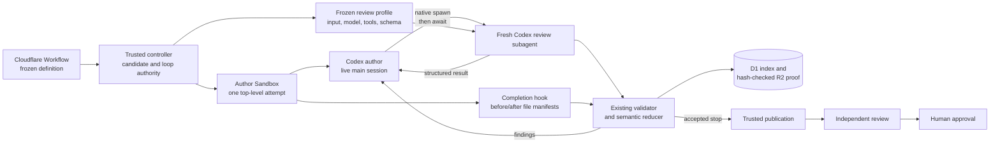

> Clarified by the user on 2026-09-10: preserve v22 review rules. References
> below to fixed-list recheck inventories and adapters apply to planning only.
> Design keeps fresh discovery after repair, including its existing limit stop.

## Context

See `proposal.md` for the motivation and the three delta specs for required
behavior. Today the author and its semantic self-check use separate top-level
attempts and separate Cloudflare Sandboxes. The checked architecture already
provides a sealed Sandbox per top-level attempt, a pinned Codex launch, a
frozen workflow definition, deterministic candidate checks, D1 workflow
authority, and hash-checked R2 evidence.

Codex already has a native subagent facility: a main agent can start fresh
child agents, wait for their results, and continue in the same work session.
This design uses that facility directly. It does not add a second process
orchestrator, private namespace scheme, or parallel request/lease/reuse system
inside the Sandbox. The Cloudflare Sandbox remains the security boundary. Its
author has no GitHub or Linear capability, and its review children receive only
the existing read-only review tools.

The workflow still owns policy. It supplies the same phase-specific review
input, role, model settings, instructions, result schema, limits, and reducer
used by the separate-Sandbox check. Native subagents change where those review
sessions run, not what counts as a valid result or stop.

## Goals / Non-Goals

**Goals:**

- Keep one plan or design author session active through check, repair, and
  recheck.
- Run each declared review session as a fresh native Codex subagent in the
  author's Sandbox, with its own child identity and no inherited author turns.
- Preserve the current planning and design review topologies, finding rules,
  three-repair limit, result schemas, and stop outcomes.
- Prove that the checked files did not change during review and save the native
  child identity, checked input, result, and proof before cleanup.
- Reuse the existing candidate, review, reducer, evidence, and identical-input
  mechanisms instead of creating duplicate control planes.

**Non-Goals:**

- Moving independent review or human approval into the author Sandbox.
- Giving an author or self-reviewer provider access.
- Building a custom subagent runtime, kernel isolation layer, or second durable
  scheduler inside an author attempt.
- Treating a self-check result as human approval.
- Allowing author edits while a review child is reading the checked candidate.

## Component diagram

The Codex main session owns the conversation with its native children: it
starts the configured reviewer, awaits the result, receives findings, repairs
the draft when allowed, and asks for a fresh recheck. The trusted controller
and completion hook do not emulate subagent communication. They provide the
checked input and profile, pause repository writes during review, validate the
result and file manifests, apply the existing semantic policy, and persist the
proof.

## Decisions

### 1. Use native Codex subagents as the only local review runtime

Each author job is launched with allowlisted native reviewer profiles derived
from the frozen workflow definition. A profile fixes the reviewer role,
instructions, model and reasoning settings, result schema, input projection,
and read-only tools. The author may invoke the profile for the current semantic
slot, but cannot replace those settings or add tools.

The invocation starts a new native child with no forked turns. Its task payload
contains the complete service-authored review context and checked candidate
identity. The native launch returns a `subagent_id`; that child remains under
the existing `author_attempt_id` and does not allocate a Workflow visit,
top-level attempt, checkout, or Sandbox. The author awaits the child before it
can edit again. A recheck always starts another fresh child unless the existing
identical-input reuse rule supplies an already accepted result.

The completion hook accepts a child only when the Codex transcript proves the
expected native profile, a new child identity, no parent-turn fork, and a result
for the requested semantic slot. It does not attempt to prove freshness with
new operating-system users, namespaces, cgroups, or supervisor sockets.

Alternative considered: implement a privileged review broker with separate
process lanes. Native Codex already supplies child lifecycle and communication,
so another broker would duplicate bookkeeping without changing the approved
review contract.

Alternative considered: fork the author's chat into a child. That would expose
author conversation and hidden context that the delta spec excludes.

### 2. Freeze review configuration, not a second orchestration system

The controller materializes the same complete review input that the current
separate self-check receives. It also selects the existing phase-specific
profile from the run's frozen definition. The canonical launch payload binds:

- run, author attempt, phase, round, semantic slot, and native profile;
- trusted change identity, checked candidate digest, and tracked path manifest;
- full service-authored change context and declared repository guides;
- role, instructions, model settings, tool policy, input projection, result
  schema, validator, adapter or reconciler, and their revisions; and
- for recheck, the immutable finding inventory and remaining repair count.

The completion hook hashes this payload and records the native child ID and
effective profile digest. A missing field, unexpected profile, inherited turn,
wrong model, undeclared dependency, or incompatible schema rejects the review
before semantic reduction.

The current frozen topologies remain explicit:

| Phase | Native sessions | Accepted aggregation |
|---|---|---|
| Planning discovery | Start fresh `proposal_first` and `requirement_first` children over the same candidate. Neither receives the other result. They may run in parallel because both are read-only. | Require both valid results, then run the existing planning link reconciler. |
| Planning recheck | Start the fresh children declared by the existing planning-recheck profile over the repaired candidate and fixed discovery inventory. | Require the declared results and use the existing planning recheck adapter. |
| Design discovery | Start one fresh `design_review` child with the approved plan, complete design, checked guides, and design rubric. | Validate its existing design result directly; do not use planning reconciliation. |
| Design after repair | Start one fresh `design_review` discovery child with the repaired design and current complete review context. | Use the existing design validator and author-response limit; do not introduce fixed-list design rechecks. |

This table documents the active contract; the frozen workflow definition is
authoritative. The native runtime does not infer a generic topology from the
phase name and does not expose one child's result to another unless that
dependency is declared.

Alternative considered: one generic reviewer for every phase. That would alter
planning's two blind directions and design's single-session contract.

### 3. Keep review file access read-only and verify it with existing manifests

Before each native child starts, the completion hook reruns the phase's
deterministic checks and enumerates the full tracked review scope as ordered
repository paths, byte lengths, and SHA-256 hashes. The author then awaits the
declared child set and performs no repository tool call until it finishes.

Each reviewer profile exposes the same read-only repository tools as the
current self-check and no write, shell-mutation, GitHub, Linear, or other
provider tool. The shared Sandbox itself contains no provider credential. The
native tool transcript is checked against that allowlist.

When each child exits, the completion hook enumerates the same tracked scope
again and binds that manifest to the child. Parallel blind children each keep
their own launch and completion manifests. Every path set, length, and hash
must match its pre-review manifest exactly. Any difference or attempted
write/provider tool rejects the complete semantic-slot review, saves the
fault, and consumes no semantic turn. The check protects the acceptance
decision without treating the author and reviewer as adversarial
operating-system tenants.

Alternative considered: copy the candidate into a private filesystem and
maintain separate mount namespaces. Pausing author edits, applying the native
read-only profile, and comparing the required manifests provide the approved
file invariant with much less machinery.

Alternative considered: trust the read-only profile without a manifest. The
delta spec explicitly requires the same pre- and post-review file proof, so the
manifest remains an acceptance check.

### 4. Route native results through the existing review validator and reducer

The native child returns the current structured result shape. The trusted
validator checks the launch binding, required session set, blindness and
declared dependencies, tool audit, file manifests, schema, and selected adapter
before forwarding anything to the existing semantic reducer.

The reducer remains the sole authority for finding IDs, accepted findings,
semantic turns, pass, judgment, limits, and stop results. Planning discovery creates one
immutable finding inventory. Every planning recheck must rate every existing finding ID
exactly once and cannot add, remove, rename, merge, or split findings. Design keeps
v22 discovery after each repair and its existing author-response limit. The
current contract allows at most three author-repair turns; a fourth repair or
recheck is never offered. Rejected infrastructure or validation work consumes
no semantic turn.

For accepted findings, the bounded result is returned directly to the still
live author session. The author may repair the draft, rerun deterministic
checks, and invoke a fresh native recheck. Pass, third-repair limit, and
judgment produce the same accepted stop records as the current flow.

Alternative considered: implement loop counters and stop decisions in the
author prompt. Prompt-managed policy would not be replay-safe and could diverge
from the frozen workflow reducer.

### 5. Extend existing review evidence with native child correlation

The existing candidate, finding inventory, accepted-review, identical-input
reuse, and R2 evidence paths remain authoritative. The in-Sandbox path adds one
child-session record for each native invocation; it does not create parallel
request, preflight, execution, lease, or reuse tables.

Before spawning, a guarded insert reserves the session key derived from run,
author attempt, phase, round, semantic slot, declared session role, candidate
digest, canonical input digest, and profile digest. Replaying that key returns
the durable running, failed, or accepted state instead of spawning again. The
existing identical-input check may bind an accepted review to the current
author attempt without a child launch or semantic counter change, using the
same verified candidate and review-contract digests it uses today.

Each executed session contributes to one create-only R2 review bundle holding
the canonical launch payload, native child identity and transcript slice,
profile receipt, before/after manifests, tool audit, structured result or
bounded fault, adapter output, and validation receipt. D1 stores the bundle's
exact R2 key, byte length, and SHA-256 on the existing review record. The Worker
reads it back before accepting a stop.

At an allowed stop, the accepted review is linked to the parent author attempt.
Only complete, hash-checked proof permits author completion and normal Sandbox
cleanup. A storage or read-back failure uses the existing proof-repair and
Sandbox-retention path.

Alternative considered: mirror every top-level attempt and lease record for a
child. A native child is not a top-level attempt; one correlated session row
plus the existing review and evidence records is sufficient for replay and
audit.

### 6. Preserve publication, independent review, and approval boundaries

The author Sandbox cannot publish. After an allowed self-check stop, the
trusted publication stage consumes the checked candidate and accepted review,
posts the full allowed artifact paths to the one run branch and pull request,
and records its provider receipt. Missing or invalid candidate, review proof,
or receipt prevents success and Human Review entry.

Independent review remains a later fresh top-level stage over the published
head. Human approval remains a separate gate visit whose signed user event is
the only approval authority. Native self-review advice cannot satisfy either
boundary.

Alternative considered: reuse the native self-review as independent or human
approval. That conflicts with the approved separation and weakens exact-head
review.

## Event flow

1. The author writes a private plan or design and invokes the existing
   deterministic completion checks.
2. The controller accepts the checked candidate, loads the frozen review
   profile and full checked context, derives the session key, and records the
   pre-review file manifest.
3. The author starts the configured reviewer through Codex's native subagent
   operation with no forked turns, then awaits it. Planning discovery starts
   its two blind children; design discovery starts one child.
4. Each child receives only its canonical launch payload and read-only tools.
   Codex returns its native child identity, tool transcript, and structured
   result to the main author session.
5. As each required child exits, the completion hook records its post-review
   manifest. After all required children exit, it verifies freshness, profiles,
   tools, dependencies, result schemas, and unchanged per-child file hashes.
6. A failed launch, forbidden tool request, file change, or invalid result is
   saved as a non-semantic fault. The author receives the bounded failure under
   the existing retry/stop policy; no review turn is consumed.
7. The existing adapter and reducer accept valid results. Findings return to
   the same live author, which may repair and request a fresh native recheck
   while one of the three repair turns remains.
8. A recheck receives the complete immutable finding inventory and must rate
   every ID exactly once. Pass, the third-repair limit, or judgment ends the
   loop with the unchanged stop result.
9. The Worker writes the review bundle, reads it back by exact key, length, and
   SHA-256, binds the accepted stop to the author attempt, and only then permits
   cleanup.
10. Trusted publication, independent review, and human approval continue in
    their existing separate stages.

## Minimal data model

Existing run, top-level attempt, candidate, finding-inventory, accepted-review,
reuse, provider-operation, and evidence records remain authoritative. Native
children never enter the top-level attempt relation.

| Record | Minimal fields | Purpose |
|---|---|---|
| Existing author attempt | `attempt_id`, `run_id`, `sandbox_id`, `definition_digest`, `state` | Owns the live Codex main session and Sandbox. No new attempt is created for a child. |
| Existing accepted review | Existing candidate, phase, round, inventory, result, counters, and stop fields; add nullable `author_attempt_id` and execution location `native_subagent` | Keeps semantic state and downstream result shape unchanged while linking the final review to its live author. |
| `self_review_session` | `session_key`, `author_attempt_id`, `phase`, `round`, `semantic_slot`, `session_role`, `candidate_sha256`, `input_sha256`, `profile_sha256`, nullable `subagent_id`, `state`, nullable `fault_code`, nullable `result_sha256`, `before_manifest_sha256`, nullable `after_manifest_sha256`, nullable `evidence_r2_key`, nullable `evidence_byte_length`, nullable `evidence_sha256`, timestamps | Correlates one declared native child, guards replay, and locates its proof without modeling it as an attempt. |
| Existing R2 review bundle | canonical launch payload, native launch receipt, bounded transcript slice, tool audit, both manifests, child results or faults, adapter output, validation and reuse receipts | Stores immutable detailed proof read back before acceptance. |

`self_review_session.state` is `allocated`, `running`, `accepted`, `rejected`,
or `canceled`. The unique session key prevents duplicate native launches. A
reused review has an existing reuse record and no `self_review_session` row.
Semantic counters remain only on the existing reducer-owned review state.

D1 stores no provider credential, author transcript, hidden model state, or
unsaved notes. Only bounded identities, digests, states, and exact R2 object
references are durable.

## Failure modes

| Failure | Required behavior |
|---|---|
| The pinned Codex version cannot start native subagents | Record an infrastructure failure and start no semantic review. An active run does not invent a custom fallback or change executor type. |
| A child inherits parent turns or uses the wrong native profile | Reject it as a context/configuration fault, save proof, and consume no semantic turn. |
| A required planning direction or design session is missing | Do not run the adapter or infer a partial result. Save the incomplete session set and follow existing retry policy. |
| A blind child receives sibling output or an undeclared dependency | Reject the review before reduction and save the launch/input proof. |
| A reviewer requests a write or provider tool | Deny the tool, record the safe tool class and child identity, reject the result, and perform no external effect. |
| The tracked path set, length, or hash differs after review | Save both manifests, reject the result as a non-consuming file-integrity fault, and require the author to revalidate the candidate. |
| The child returns malformed, incomplete, or wrong-schema output | Save the bounded invalid output and use the existing proof-repair or failure rule; never infer findings from prose. |
| A recheck omits, duplicates, adds, removes, renames, merges, or splits a finding | Reject before reduction, keep the fixed inventory unchanged, and consume no semantic turn. |
| The author requests a fourth repair | Return the existing three-repair limit stop and launch no child. |
| The same session request is replayed | Return its durable state or accepted result. Do not start another child or increment a counter. |
| Verified identical input exists from an eligible prior attempt | Use the existing reuse record and proof; start no child, create no top-level attempt, and consume no turn. |
| The author exits while children are active | Cancel the native children, preserve available proof, and fail or recover the parent through existing top-level attempt policy. Never promote a child to an attempt. |
| A native child does not terminate before the attempt deadline | Cancel it and apply the existing 24-hour top-level failure and cleanup policy; a child cannot extend the attempt lifetime. |
| R2 write/read-back/checksum or D1 indexing fails | Do not accept the author attempt or clean up its Sandbox; enter the existing proof-repair/failure path. |
| Trusted publication fails after a valid self-check | Preserve the accepted private proof and use existing publication reconciliation; the child never publishes. |
| Independent review or human approval is missing | Do not treat native self-review as a substitute and do not advance the corresponding gate. |

## Risks / Trade-offs

- [Native subagent behavior can change with Codex versions] → Pin the Codex
  version and reviewer profiles in the frozen workflow definition, validate the
  effective launch receipt, and canary version changes.
- [Author and reviewer share a filesystem] → Await children, disable author
  edits during review, expose read-only child tools, and compare the complete
  tracked manifest before and after.
- [Fresh-context proof depends on the native runtime] → Require a new native
  child ID, no turn fork, the expected profile digest, and the bounded child
  transcript for every executed session.
- [Parallel planning directions could leak results] → Give each child only its
  canonical input and validate that no sibling dependency appears in either
  launch or tool transcript.
- [Keeping the author alive consumes Sandbox capacity longer] → Keep the
  existing heartbeat, absolute attempt lifetime, repair limit, stop rules, and
  cleanup behavior.
- [Removing a separate review Sandbox reduces physical isolation] → Keep the
  Sandbox as the credential boundary, give children no provider tools, retain
  file manifests, and keep independent review in a separate later stage.

## Migration Plan

1. Define pinned native reviewer profiles from the existing planning discovery,
   planning recheck, design discovery, and design recheck configurations.
2. Add the guarded `self_review_session` correlation record and extend existing
   review evidence with native child identity, profile, transcript, tool audit,
   and before/after manifests.
3. Let the active author invoke only the declared native profiles, await their
   results, and receive accepted findings. Route every result through the
   existing validators, adapters, reducer, reuse, and evidence read-back.
4. Test each phase topology, blindness, fresh no-fork context, read-only tools,
   unchanged manifests, malformed output, fixed finding inventory, three-repair
   limit, replay, reuse, cancellation, evidence failure, and retained
   independent/human boundaries.
5. Register a new immutable workflow definition that selects native subagents
   for plan and design self-checks. Older frozen definitions continue using
   separate review Sandboxes.
6. Canary with a real Cloudflare Sandbox. Prove that one top-level attempt and
   Sandbox span author, check, repair, and recheck; native child IDs are fresh;
   tracked hashes match; proof reads back; cleanup follows proof; publication
   succeeds through trusted code; and independent review remains separate.
7. Enable the new definition only for later runs after the canary passes. Never
   change the executor type of an active run.

Rollback selects the prior registered workflow definition for later runs.
Because definitions are frozen, an active new-version run completes with native
subagents or fails closed through existing attempt recovery; it never switches
mid-loop. The additive child correlation fields and evidence remain readable
after rollback.
