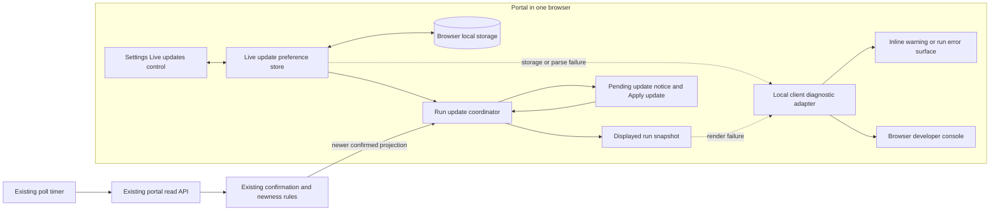

## Context

See `proposal.md` for motivation and `specs/portal-live-updates/spec.md` for observable behavior. The workflow portal already polls for run projections, decides when a projection is confirmed, and offers a manual **Apply update** path. This change adds a browser-owned mode choice around that existing path. It must not change polling, confirmation, APIs, D1, workflow state, or issue state.

The preference must be available before the first poll result is handled. A projection must remain one coherent snapshot so status, graph, history, and stage counts cannot come from different poll results.

## Goals / Non-Goals

**Goals:**

- Give Settings and the run view one browser-local source of truth for the Live updates choice.
- Route each newer confirmed projection to either immediate display or the existing pending-update action.
- Make mode changes deterministic when a poll or pending projection exists.
- Preserve the current manual experience for browsers that have no saved choice.

**Non-Goals:**

- Introduce a server-side preference, API, D1 row, or cross-browser account setting.
- Replace or tune the current poll scheduler, projection confirmation rules, or projection ordering rules.
- Change the shape or production of workflow projections.
- Add a push transport such as WebSockets or server-sent events.

## Component Diagram



The preference store is client-only. It owns parsing, persistence, in-page subscriptions, and same-browser document synchronization. The run update coordinator is the single place that combines the current mode with confirmed poll results. Existing read and confirmation components remain authoritative for whether a projection may enter the coordinator. The diagnostic adapter is also client-only: it sends the original error and operation context to the browser developer console and selects a safe in-page message. It never sends a request or telemetry event.

## Event Flow

1. During portal startup, the preference store reads the saved value synchronously before the run view enables poll-result handling. A valid saved value becomes the current mode; a missing or invalid value defaults to manual mode.
2. Settings reads and writes the same preference store. A successful toggle updates the in-memory value, saves it in browser storage, and updates subscribers in the current document. Other open portal documents receive the browser storage event only as an invalidation signal: each receiver rereads the key, validates the current stored value, and then publishes that value. A receiver never applies the event payload directly, so a delayed event for an older write cannot replace a newer persisted choice.
3. The existing poll timer and read API continue unchanged. The existing confirmation and newness rules discard unconfirmed, older, or equivalent projections before they reach the coordinator.
4. The first confirmed projection for a run always becomes `displayedProjection` immediately in both modes and clears `pendingProjection`. It is the run's baseline, not a manual update, so a newly opened or newly selected run never waits behind **Apply update** with an empty view.
5. After a baseline is displayed, a newer confirmed projection in live mode replaces the displayed snapshot with that complete projection and clears any pending projection. The manual notice is absent.
6. After a baseline is displayed, a newer confirmed projection in manual mode leaves the displayed snapshot unchanged and becomes pending. A later newer confirmed result replaces the pending value, so **Apply update** always promotes the latest confirmed projection.
7. **Apply update** atomically promotes the pending projection to the displayed snapshot and clears the pending value. All run-derived sections render from that one displayed snapshot.
8. Turning Live updates on atomically promotes any pending projection and clears the manual notice. Turning it off leaves the displayed snapshot in place; the next newer confirmed projection becomes pending.
9. If a poll resolves concurrently with a mode change, the coordinator uses the current in-memory mode when it handles the confirmed result. If the viewed run changes, the coordinator clears both snapshots, rejects in-flight results for the old run by run identity, and treats the next confirmed projection for the new run as its baseline under step 4.

## Minimal Data Model

No server data model changes are required.

The browser stores one versioned JSON value under a portal-owned key:

```text
LiveUpdatePreference {
  version: 1,
  enabled: boolean
}
```

Versioning permits invalid or future shapes to fail closed to manual mode. The key is not sent to the portal API and is not copied into D1, workflow records, telemetry payloads, or provider data.

The run view keeps only transient state:

```text
RunUpdateState {
  runIdentity,
  displayedProjection | null,
  pendingProjection | null
}
```

`displayedProjection` and `pendingProjection` are complete projection snapshots in the portal's existing shape. `displayedProjection` is null only while the current run's baseline is loading. There is no pre-ready coordinator state: synchronous preference initialization, including the manual fallback after a read failure, completes before poll-result handling is registered. Existing projection identity and ordering logic determines whether an incoming confirmed projection is newer; this feature does not create a second revision algorithm.

The diagnostic adapter produces only transient presentation state: a notice kind (`preference_fallback`, `preference_not_saved`, or `render_failed`) and a safe message. It sends the original error directly to the developer console and does not serialize that error into browser storage, application state, a request, or telemetry.

## Decisions

### Default to manual mode

A missing, malformed, unsupported, or unreadable saved value resolves to `enabled: false`. This preserves the current behavior for existing browsers and makes storage failures fail closed. Defaulting to live mode was rejected because it would silently change how existing users consume updates.

### Use one versioned browser-local preference store

Settings and run views use one small client abstraction over browser local storage. It exposes the loaded value, a setter, and change subscription rather than letting components read the storage key independently. This prevents inconsistent parsing and lets an already-open run view react to a Settings change. Component-specific storage access was rejected because it can produce stale modes and duplicate fallback rules. Server persistence was rejected by the specification.

### Reuse the existing confirmed-projection pipeline

Mode selection happens only after the current code has established that a projection is confirmed and newer. The coordinator does not poll, fetch, confirm, or reorder data itself. A parallel live-update fetch path was rejected because it could drift from the current timing and confirmation rules.

### Reduce updates as complete projection snapshots

The coordinator changes `displayedProjection` and `pendingProjection` in one state transition. Status, graph, history, and stage counts derive from `displayedProjection`; no section applies an incoming projection independently. Per-widget updates were rejected because a render could combine different confirmed revisions.

### Keep only the latest pending projection

Manual mode stores one pending snapshot and replaces it when a newer confirmed snapshot arrives. It does not queue every intermediate projection. This matches **Apply update** semantics and bounds browser memory. An ordered client queue was rejected because the user asks to reach the latest confirmed view, not replay intermediate renders.

### Synchronize within the browser without creating account sync

The preference store publishes same-document changes and listens for the browser storage event from other portal documents. The stored key is authoritative: every event causes a fresh read and validation, and the event payload is not applied directly. Therefore the last value actually present in browser storage wins without adding timestamps or counters to the preference. This keeps open tabs in one browser aligned while preserving the browser-only boundary. A remote synchronization channel was rejected because it would require server state and cross-browser identity.

### Keep diagnostics and recovery client-local

Caught storage, parsing, and run-render failures call one `reportClientError` adapter with an operation name, relevant run or projection identity, and the original error object. The adapter passes that original object and the context as separate arguments to `console.error`; it does not wrap away the cause, call an API, or emit telemetry. A storage load or validation failure produces a non-blocking portal warning that Live updates fell back to off. A failed preference write shows an inline warning beside the control that the choice is active only for the current page. A run-view error boundary reports a post-promotion render failure and shows a run-level error panel rather than an empty, partial, or silently older snapshot. Sending these diagnostics to a server was rejected because this feature must add no preference-bearing request or server state.

## Failure Modes

- **Browser storage is unavailable or throws while loading**: call `reportClientError` with the original exception and load context, initialize manual mode, and show the fallback warning while the portal continues rendering. Do not call a server fallback.
- **A preference write fails**: keep the selected mode for the current document, call `reportClientError` with the original exception and write context, and show the inline not-saved warning beside the control. A reload may return to manual mode; the UI must not claim that persistence succeeded.
- **Stored JSON is malformed or has an unsupported version**: pass the original parse or validation cause to `reportClientError`, ignore the value, use manual mode, and show the fallback warning. The next successful toggle replaces it with the current schema.
- **A poll returns unconfirmed, older, or equivalent data**: the existing confirmation/newness path rejects it before mode routing; displayed and pending state do not change.
- **A poll request fails**: preserve the current displayed and pending snapshots and let the existing polling error and retry behavior handle the original failure. Live mode must not convert a read failure into an empty render.
- **A mode toggle races with a poll completion**: serialize both through the coordinator and evaluate the result against the latest in-memory preference. This avoids leaving a pending action visible after live mode has applied that projection.
- **The viewed run changes with an old poll in flight**: compare the result's run identity with the coordinator's current run and discard mismatches. Reset pending state on navigation.
- **Another tab changes the preference**: treat the storage event as invalidation, reread and validate the authoritative key, and apply that current value. Ignore the event payload itself. Immediately promote a pending projection if the reread value enables live mode.
- **A render component fails after snapshot promotion**: the run-view error boundary passes the original component error plus run and projection identity to `reportClientError` and shows the run-level error panel. Do not partially mutate other projection fields or fall back to an older snapshot silently.

## Risks / Trade-offs

- **[Browser storage can be cleared or disabled]** → Default safely to manual mode and make failed persistence visible without adding server storage.
- **[Last-write-wins behavior can surprise people using several tabs]** → Reread the authoritative key for every storage event so delayed events cannot regress a document to an older event payload and all open documents converge on the latest persisted choice.
- **[Automatic promotion can expose latent assumptions that updates are user-triggered]** → Put both automatic and manual promotion through the same atomic snapshot transition and test both entry paths against every run-derived section.
- **[Keeping a complete pending snapshot duplicates client memory]** → Retain only one latest pending snapshot and release it after promotion, navigation, or replacement.

## Migration Plan

1. Add the preference store and Settings control with manual mode as the fallback for browsers without a valid saved value.
2. Route confirmed projections through the coordinator while preserving the existing poll, confirmation, and manual apply behavior.
3. Verify the initial confirmed projection fills an empty run view in both modes, then cover reload, reopen, same-browser tab, pending replacement, toggle-race, navigation, and storage-failure cases in portal tests. Verify status, graph, history, and stage counts always use one displayed projection. Exercise each diagnostic path and assert that the safe warning or error panel appears while `console.error` receives the original error object and operation context.
4. Instrument the portal request boundary in tests and assert that changing the preference emits no request and that no existing request contains the storage key, preference value, or preference state. Open separate browser profiles, change one profile's preference, and verify the other profile stays unchanged and receives no synchronization request.
5. Build from the DEOS root with `npm run portal:build`, then deploy with `npx wrangler deploy --config portal/wrangler.jsonc`. No server migration or API rollout is required, and existing browsers begin in manual mode until a person opts in.
6. Read back the deployed portal version and confirm that it serves 100% of traffic before treating the release as active. An upload or local build alone is not activation evidence.
7. Verify the live portal in an Access-authenticated browser. Capture sanitized screenshots of the saved Settings choice and a viewed run in both paths: automatic promotion in live mode and the pending **Apply update** action in manual mode. Attach the visual proof with the deployed-version readback to the implementation pull request.

Rollback removes the control and coordinator routing and restores the existing manual path. The unused browser key is harmless and should remain untouched during rollback so a later redeploy can restore the person's choice. No D1 or workflow rollback is needed.
