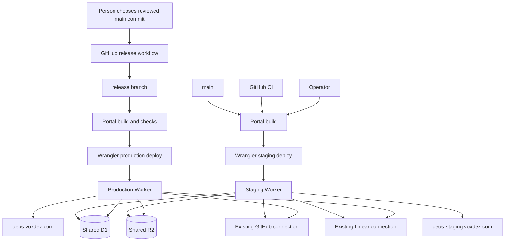

## Context

See `proposal.md` for the reason for this change and
`specs/portal-release-flow/spec.md` for the required behavior. The DEOS workflow
portal is built from the repository root and is currently deployed with
Wrangler as a Cloudflare Worker. It reads portal data from D1 and R2 and uses
the existing GitHub and Linear connections.

This change adds a second deployment of the same portal. Production remains at
`deos.voxdez.com`; staging uses `deos-staging.voxdez.com`. The two deployments
run different revisions of the portal code but bind to the same D1 database,
R2 bucket, and provider connections. This change does not alter those shared
data contracts.

### Component diagram

## Goals / Non-Goals

**Goals:**

- Keep staging and production as separate Worker deployments with fixed hosts.
- Make the source branch and Wrangler target unambiguous for each deployment.
- Let `main` reach staging without initiating a production deployment.
- Make a production change a deliberate, serialized GitHub workflow action
  that deploys a checkout of `release` with Wrangler.
- Keep the existing production Worker active when checks or deployment fail.
- Make the active environment and source commit easy to verify after deploy.

**Non-Goals:**

- Add signed attestations, custom artifact digests, capability issuers,
  deployment mediators, or a release journal.
- Add another D1 database, R2 bucket, or provider connection for staging.
- Change portal schemas, stored records, or provider integration contracts.
- Add feature flags or synchronize code between the two running Workers.
- Add a new DEOS system action or give a DEOS agent Cloudflare credentials.
- Redesign Cloudflare Access or portal authorization.

## Decisions

### Use two fixed Wrangler targets and shared service bindings

The repository will define one production target and one staging target for the
portal. Each target has a distinct Worker name, custom domain, and visible site
value. Both targets reference the same existing D1 database, R2 bucket, and
GitHub and Linear service bindings.

| Target | Source branch | Host | Visible site value |
| --- | --- | --- | --- |
| Staging | `main` | `deos-staging.voxdez.com` | `Staging` |
| Production | `release` | `deos.voxdez.com` | `Production` |

The site value is supplied by the selected target rather than inferred from the
request host. The shared portal shell displays it persistently and includes it
in the document title. The deployed source SHA is also exposed by the existing
safe health or version response so deployment read-back can identify the code
that is active without adding a database record.

Using one Worker with two routes was rejected because both hosts would then run
the same code revision. Copying D1 or R2 was rejected because staging and
production are required to show the same data.

### Deploy `main` to staging with the normal build and Wrangler command

The initial implementation supports two staging paths. Both use one
repository-owned staging entrypoint:

- GitHub CI may deploy after a change reaches `main`.
- An operator may check out `main` and run the same command manually with
  staging deploy access.

The entrypoint accepts no target or resource arguments. It verifies that the
selected commit is contained in `main`, runs `npm run portal:build`, parses the
staging environment from `portal/wrangler.jsonc`, and compares its Worker name,
route, D1 database ID, and R2 bucket name with repository-owned staging
constants. Only after that comparison passes does it run the fixed command
`npx wrangler deploy --config portal/wrangler.jsonc --env staging`. GitHub CI
declares the protected `staging` environment and receives only its
staging-scoped Cloudflare token; neither the environment nor token name is a
workflow input. The release job separately declares the protected `production`
environment. A manual operator uses an equivalently staging-scoped token. The
fixed target preflight prevents that command from naming production even if an
operator's token is broader than intended.

The approved specification permits, but does not require, a DEOS workflow as a
staging path. The current DEOS architecture has no deployment system action,
and its agent Sandboxes have no provider credentials, so this change does not
claim or add that path. Adding it later requires a separately designed trusted
system action that dispatches the fixed GitHub staging workflow through the
trusted GitHub adapter. That workflow invokes the same staging entrypoint; the
DEOS agent Sandbox does not receive GitHub or Cloudflare credentials.

There is no separate notion of an untrusted initiator or attestation issuer in
this design. A staging deployment is an ordinary authorized CI or operator
action. Build output, standard test results, the Git SHA, Wrangler output, and
live host read-back provide the operational record.

Allowing free-form Wrangler target arguments was rejected because a mistaken
target could overwrite production. Rebuilding an independent artifact service
was rejected because the repository build and Wrangler already provide the
required deployment path.

### Promote deliberately to `release`, then deploy that branch with Wrangler

Production uses one repository-owned GitHub Actions release workflow. A person
starts it and supplies the exact reviewed commit from `main`. The workflow:

1. verifies that the commit exists on `main` and that moving `release` to it is
   a fast-forward;
2. updates `release` to that commit;
3. checks out the resulting `release` head and confirms the checkout SHA;
4. runs the portal build and required checks; and
5. runs Wrangler with the fixed production target.

The workflow uses a single non-canceling production concurrency group, so two
release requests cannot update the branch or deploy at the same time. Its
production Cloudflare credential is held by the GitHub production environment
and is not used by staging CI, DEOS, or manual staging deploys. The workflow
stops if its ref, checkout, target, or shared binding IDs do not match the fixed
production settings.

After Wrangler succeeds, the workflow reads `deos.voxdez.com` and records the
active source SHA, the `Production` label, and the deployed Cloudflare version
in the job log. Implementation must verify the Wrangler response and version
read-back behavior against Cloudflare's primary documentation and a real test
resource before relying on it as deployment evidence.

Automatic production deployment from `main` was rejected because it removes
the review period. A long-running release service and signed attestations were
rejected because a protected branch, a manual GitHub workflow, fixed targets,
and live read-back are enough for this non-adversarial release process.

### Keep shared data changes compatible with both portal versions

This change makes no D1 migration, R2 layout change, or provider-link change.
While staging is ahead of production, staging features must continue to use the
current shared data contract. A later feature that needs a data-contract change
must be planned separately and remain compatible with both versions during its
rollout.

Environment-specific portal records were rejected because the two sites must
observe the same stored data. The environment label and source SHA are deploy
metadata, not portal data.

### Treat deployment completion as build, Wrangler, and live read-back

A deployment is successful only when the build and checks pass, Wrangler exits
successfully, and the expected host reports the expected environment and source
SHA. Staging and production use the same validation shape with different fixed
targets.

If Wrangler fails, the pipeline stops and does not run another deploy command.
The currently active production deployment remains the last good release. If
the CLI result is ambiguous, the workflow reads the production host and
Cloudflare version before anyone retries. It reports the ambiguity for manual
inspection; it does not guess, automatically roll back, or add a second
deployment. A retry checks out the same current `release` head and repeats the
normal workflow.

Signed evidence and an operation journal were rejected as unnecessary for this
release model. Provider output and live read-back still matter: a local build
alone does not prove that either site was updated.

## Event Flow

### Staging update

1. A commit reaches `main`, or an allowed operator selects a commit contained
   in `main`.
2. GitHub CI or the operator checks out that commit and runs the fixed staging
   entrypoint.
3. The entrypoint validates the checked-in staging resource tuple, builds the
   portal, and runs Wrangler with only the staging target and credential.
4. Wrangler updates the staging Worker; no production command is invoked.
5. The path reads `deos-staging.voxdez.com` and verifies `Staging`, the selected
   source SHA, and the active provider version.
6. Reviewers try that staging revision against the shared D1, R2, GitHub, and
   Linear data while production continues to run its current release.

### Production release

1. A person chooses the exact reviewed `main` commit and manually starts the
   GitHub release workflow.
2. The workflow serializes with other releases, verifies the commit, and
   fast-forwards `release` to it.
3. The workflow checks out `release`, verifies the checkout SHA, builds the
   portal, and runs checks.
4. Wrangler deploys the fixed production target from that checkout.
5. The workflow reads `deos.voxdez.com` and verifies `Production`, the release
   SHA, and the active provider version.
6. If any step fails, the workflow ends failed and the prior live deployment
   remains available. A push to `main` never enters this flow.

Both Workers continue to read and write the existing shared stores throughout
these flows. Differences between the sites come only from their deployed code
and visible environment identity.

## Minimal Data Model

No new D1 table, R2 namespace, GitHub record type, or Linear record is added.
The release uses only deployment configuration and runtime metadata:

| Field | Staging value | Production value | Purpose |
| --- | --- | --- | --- |
| `site` | `Staging` | `Production` | Exact runtime value and visible environment label |
| `canonicalHost` | `deos-staging.voxdez.com` | `deos.voxdez.com` | Fixed host validation |
| `sourceBranch` | `main` | `release` | Branch allowed to feed the target |
| `sourceSha` | Selected `main` SHA | Current `release` SHA | Live deployment read-back |
| `workerTarget` | Fixed staging Worker | Existing production Worker | Prevents cross-target deploys |
| D1 and R2 bindings | Existing shared IDs | Same existing shared IDs | Keeps one portal data set |
| GitHub and Linear bindings | Existing connections | Same existing connections | Keeps provider links shared |

The target configuration supplies all values except `sourceSha`, which the
build receives from its checked-out commit. Git remains the record of what was
chosen for release, GitHub Actions logs record the release run, and Cloudflare
plus host read-back identify what is active.

## Failure Modes

| Failure | Required behavior |
| --- | --- |
| Selected staging commit is not on `main` | Stop before build or Wrangler. |
| Staging build or checks fail | Do not deploy staging; production is unchanged. |
| Staging Wrangler command fails | Report the failed staging run and do not invoke production. |
| Staging host reports the wrong label, SHA, or version | Mark staging verification failed and investigate the staging target; production is unchanged. |
| Staging config names a production Worker, route, D1 ID, or R2 bucket | The fixed entrypoint's resource-tuple comparison fails before Wrangler runs. |
| A staging CI job requests a production environment or secret | Workflow configuration review fails; the job declares only the protected `staging` environment and accepts no environment or secret input. |
| A DEOS workflow requests staging deployment | No deployment occurs because this change adds no DEOS deployment system action; use GitHub CI or the manual staging entrypoint. |
| Release candidate is not on `main` or is not a fast-forward from `release` | Stop without moving `release` or deploying production. |
| Two release requests overlap | The production concurrency group runs one and queues the other; the queued run rechecks branch state. |
| `release` moves but a later build or check fails | Keep current production active; retry the workflow from the same `release` head after fixing the failure. |
| Production checkout is not the current `release` head | Stop before Wrangler. |
| Production build or checks fail | Do not run Wrangler; keep the prior live release. |
| Production Wrangler command fails | Keep the prior live deployment and record the command failure. |
| Wrangler result is ambiguous | Read the host and provider version, stop further deployment, and require manual inspection before retry. |
| Production host reports the wrong label, SHA, or version | Mark the release failed, keep the observed deployment serving, and inspect before another release. |
| Staging code is incompatible with shared D1, R2, GitHub, or Linear data | Fail staging checks or testing; make no production release. |
| A shared service is unavailable | Use the portal's existing bounded error behavior; do not create fallback or copied data. |
| Production needs rollback | Choose a known-good commit, update `release` through the deliberate release process, and run the same production workflow. |

## Risks / Trade-offs

- **[Staging can affect data seen by production]** → Keep this change free of
  data-contract changes and require later features to remain compatible with
  both deployed versions.
- **[A wrong Wrangler target could affect the wrong site]** → Use named,
  repository-owned targets, separate deployment credentials, fixed hosts, and
  pre-deploy target checks.
- **[The release branch may move before a later deploy step fails]** → Leave
  production on its prior release and rerun the serialized workflow from the
  same `release` head after the failure is understood.
- **[A deployment command can return an unclear result]** → Stop, read the live
  host and Cloudflare version, and do not retry until the active state is known.
- **[Simple logs provide less tamper resistance than signed attestations]** →
  Accept that trade-off for this non-adversarial workflow; retain exact Git
  SHAs, protected workflow history, Wrangler output, and live read-back.
- **[A bad application revision can still pass checks]** → Review it on staging,
  keep release manual, and use the same known-good-commit release process to
  roll back.

## Migration Plan

1. Record the current production Worker, route, shared binding IDs, active
   Cloudflare version, and known-good source commit. Initialize `release` at
   that source commit so creating the branch does not change production.
2. Add the fixed staging target with a distinct Worker and
   `deos-staging.voxdez.com`, the `Staging` runtime value, and the existing
   shared bindings. Deploy `main` with Wrangler and verify the host, label,
   source SHA, shared data, and provider links.
3. Add the manually dispatched GitHub release workflow and its production-only
   environment credential. Exercise the shared build, configuration preflight,
   Wrangler, and live read-back behavior against the real staging Worker. Lint
   and review the release workflow's branch, checkout, fixed target, and
   concurrency declarations without retargeting it. Its actual production-only
   checks are first exercised by the no-feature-change release in step 5, not
   against a different target.
4. Remove or disable every existing `main`-triggered production deployment and
   any general-purpose production credential. Point the fixed production
   target at the existing production Worker, `deos.voxdez.com`, and the shared
   binding IDs. Make the protected GitHub production environment credential
   available only to the manual release workflow, and verify that staging
   credentials cannot edit the production Worker or route. This cutover changes
   who may deploy production; it does not replace the active version.
5. Run a no-feature-change release through `release`. Confirm that production
   remains available during the run, reaches 100 percent traffic on the
   reported version, shows `Production`, and continues to use the same shared
   data. Capture real command output and sanitized browser evidence.
6. Confirm that a later `main`-only change updates staging through an allowed
   path and does not change production.

If the staging rollout fails, remove only its route and Worker; do not change
the shared D1 or R2 resources. If a production release fails, leave the current
deployment active and retry after the failure is understood. Rollback selects a
known-good commit through the same deliberate `release` workflow rather than a
manual production Wrangler command.
