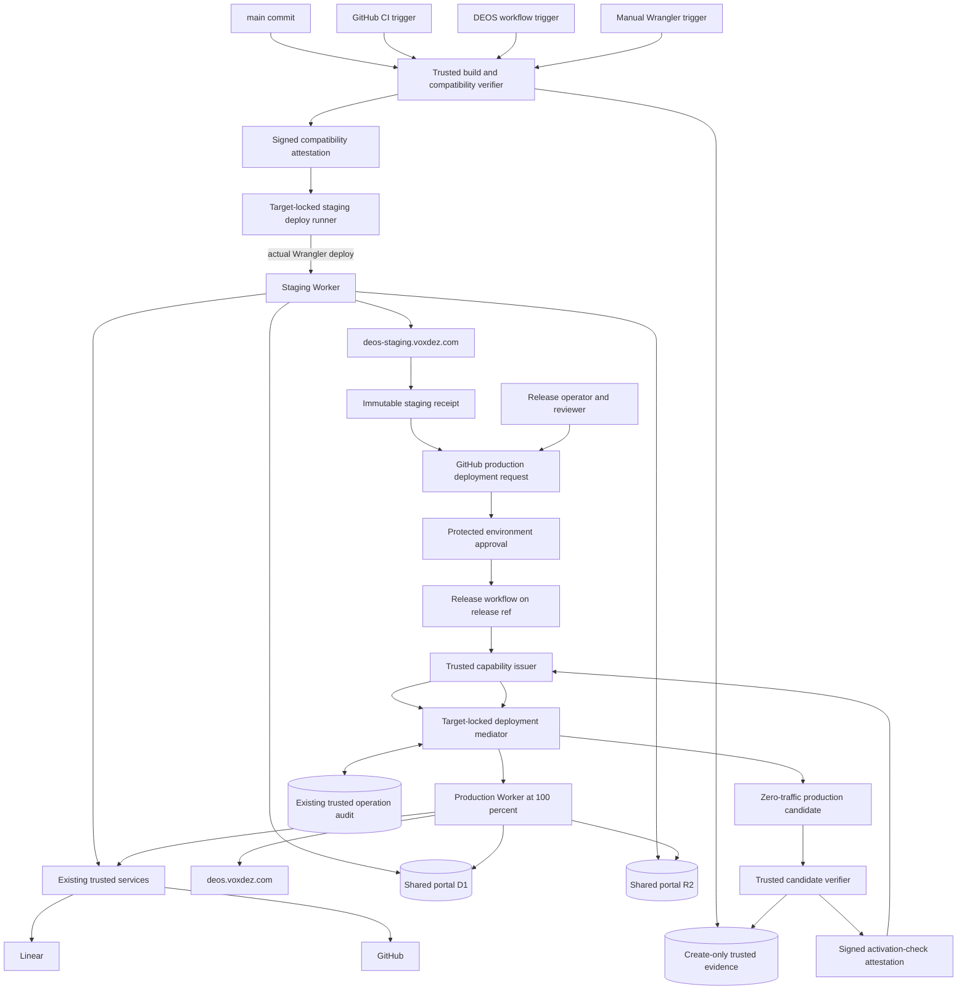

## Context

See `proposal.md` for the reason for this change and
`specs/portal-release-flow/spec.md` for its required behavior. The DEOS workflow
portal is built from the repository root and deployed as a Cloudflare Worker.
It reads D1 and R2 and reaches GitHub and Linear through existing trusted
services. The portal holds no provider secret.

Code from `main` must reach staging without changing production. Production may
move only after a person reviews an exact staging deployment and starts the
GitHub release pipeline. The sites use separate Worker identities and hosts,
but the same D1 database, R2 bucket, Access boundary, and trusted GitHub and
Linear connections. This change does not alter those shared application-data
contracts.

### Component diagram



The staging and production Workers resolve their D1, R2, and internal-service
bindings to the same resources. Separate deployment identities prevent staging
uploads from replacing production. Untrusted initiators can request a staging
run, but only trusted runners hold deployment credentials. Production authority
is available only to the protected release workflow through short-lived,
operation-specific capabilities.

## Goals / Non-Goals

**Goals:**

- Bind each running portal version to an exact Git commit and deterministic
  application artifact.
- Let all three approved paths initiate a real staging deploy while keeping
  build, compatibility, target, and credential enforcement identical.
- Prove that the exact production candidate ran on staging and received a
  provider-recorded human approval.
- Make production promotion, recovery, and reconciliation manual, serialized,
  auditable, compare-and-swap guarded, and replay safe.
- Finish compatibility and candidate checks before traffic changes, retaining
  the prior production version when a check, upload, or activation fails.
- Bootstrap a legacy production Worker without asserting an unproved source
  commit or requesting production authority from a non-`release` ref.

**Non-Goals:**

- Add a second portal D1 database, R2 bucket, provider connection, or portal
  schema.
- Add feature flags or synchronize code between the two Workers.
- Give staging callers, local operators, or repository scripts a production
  credential.
- Redesign portal authentication, provider access, or shared application data.
- Treat local tests as proof that Cloudflare accepted or activated a deploy.

## Decisions

### Use two deployment identities with shared backend bindings

Production and staging are separate Cloudflare Worker deployments. Production
owns `deos.voxdez.com`; staging owns `deos-staging.voxdez.com`. A closed target
manifest fixes the site value, Worker identity, account, and canonical host.
The portal renders a persistent `Production` or `Staging` label in its shared
page shell and includes that identity in the document title and safe read-back
endpoint. Validation accepts only the two fixed target tuples.

Both Workers bind to the same D1 database, R2 bucket, Access policy, and
existing internal services. Provider secrets remain in the existing trusted
service boundary.

Routing both hosts to one deployment was rejected because one Worker version
could not keep production on released code while staging runs `main`. Separate
D1 or R2 copies were rejected because they would violate the shared-data plan.

### Build an exact commit under one byte-level digest contract

Every staging path selects an exact SHA and proves it is reachable from `main`.
The trusted build runner creates a temporary detached checkout from that Git
object, installs from its lockfile, and builds only from the checkout. It
rejects a missing object, submodule mismatch, generated input outside the
checkout, or source tree that differs from the selected commit. A caller's
working tree and caller-supplied prebuilt output are never deployment inputs.

All components implement digest contract `deos-portal-bundle-v1`:

- A digest is SHA-256 and is encoded as `sha256:` followed by 64 lowercase hex
  characters. Comparisons use the decoded 32 bytes, not display text.
- Paths must already be relative, slash-separated UTF-8 in Unicode NFC. The
  builder rejects absolute paths, `.` or `..` segments, invalid UTF-8,
  normalization collisions, symlinks, devices, and other special entries.
- A canonical tree stream begins with the ASCII domain plus NUL, then a
  big-endian unsigned 32-bit entry count. Entries are sorted by raw UTF-8 path
  bytes. Each entry is `u32be(pathLength) || path || u32be(mode) ||
  u64be(contentLength) || content`. Mode is exactly `0644` or `0755`; file
  content is hashed byte-for-byte with no newline or text normalization. The
  encoded mode values are decimal 420 and 493, respectively.
- `applicationDigest` hashes the stream with domain `DEOS-APP-v1`. Its entries
  are the target-neutral deployable module and static-asset inventory emitted
  by the repository build entrypoint. It excludes target configuration,
  release metadata, timestamps, secrets, and the target manifest.
- The target manifest is RFC 8785 canonical JSON encoded as UTF-8 without a
  byte-order mark. `manifestDigest` hashes that JSON with the
  `manifestDigest` member omitted. The completed manifest contains
  `applicationDigest` and `manifestDigest`, but not `packageDigest`.
- `packageDigest` hashes the stream with domain `DEOS-PACKAGE-v1`. Its entries
  are the exact application inventory plus the completed target manifest at
  the fixed path `deos-target-manifest.json`. This canonical package is what
  the target runner materializes for the provider uploader.

The recipient reconstructs the inventory from bytes, validates canonical
paths and modes, and recomputes all three digests before upload. A digest claim
with an unknown contract version is rejected. Provider-generated multipart
boundaries, upload timestamps, and response metadata are outside the package
digest; the embedded manifest and Cloudflare version read-back bind the
provider result to the verified package.

Building in a caller checkout was rejected because dirty or substituted files
could be presented as a clean commit. Hashing an unspecified archive was
rejected because independent tools can serialize the same files differently.
Embedding the digest of a full package in that package was rejected because it
is self-referential.

### Authenticate compatibility before any staging credential or upload

GitHub CI, a DEOS workflow, and a manual operator are initiators, not trusted
attestation issuers. Each requests the same trusted build-and-compatibility
runner with an exact `main` SHA. The runner resolves the commit with the
existing GitHub App boundary, performs the detached build, and runs:

1. portal unit, integration, type, and deterministic-build checks;
2. a scope check that rejects D1 migrations, R2 layout changes,
   provider-link changes, and other shared-contract changes;
3. decoder and renderer tests against the minimum sanitized, read-only sample
   of current shared-data shapes; and
4. write-path contract tests in a disposable fixture, never the shared stores.

After all checks pass, the trusted verifier writes a create-only evidence
object through the existing evidence boundary and emits a DSSE-signed
compatibility attestation. The service-held signing key never enters a runner.
The envelope identifies the key and digest contract and binds attestation ID,
source SHA, `applicationDigest`, `manifestDigest`, and
`stagingPackageDigest`, test-contract revision, complete named-check results,
runner identity, evidence-object digest, issue time, and expiry. The
target-locked deploy service reads the create-only evidence by ID,
verifies its hash and signature against an allowlisted key, requires every
check to pass, and rejects expired or mismatched fields. Caller JSON, logs, or
a locally signed document are not evidence.

Only after verification does the deploy service start an isolated staging
runner and inject a short-lived staging-only credential. For the manual path,
that trusted runner executes the repository-owned, fixed-config
`wrangler deploy`; the operator initiates and observes the real Wrangler
command but never receives the credential or controls bytes after attestation.
GitHub CI and DEOS requests use the same runner and contract. The runner
recomputes the package digest immediately before upload and can address only
the fixed staging Worker. Successful host read-back is recorded in an
immutable GitHub staging deployment receipt.

The implementation must confirm Wrangler, credential scope, and provider
read-back against primary Cloudflare documentation and a real test resource.
A credential or runner that can address production fails this design. Allowing
each caller to report its own check result or keep a free-form deployment token
was rejected because either could put unchecked code beside shared writable
data.

### Bind human review to one immutable staging deployment

The staging receipt contains its provider record ID, source SHA,
`applicationDigest`, `manifestDigest`, and `stagingPackageDigest`,
compatibility attestation ID and digest, staging Worker and version, host,
initiator class, deploy run, and successful host read-back. Its identity is
derived from the canonical fields and provider record ID; mutable summaries
are not authority.

A normal release starts with a receipt ID, not a moving ref. An unprivileged
preparation job confirms that the same version remains active on staging and
creates a GitHub deployment for the protected `production` environment. Its
canonical payload binds receipt ID, candidate SHA, application and package
digests from the staging receipt (`applicationDigest`, `manifestDigest`, and
`stagingPackageDigest`), workflow identity, and release-request digest. The
environment URL points to the exact staging version the reviewer examines. The
later target-specific production build has its own
`productionPackageDigest`; approval is transferred through the equal
target-neutral `applicationDigest` and the server-fixed production target.

GitHub attaches approval to that deployment and workflow run. The trusted
capability issuer reads the deployment, workflow-run, and environment-review
records through the existing GitHub App boundary. It requires a user approval
for the exact deployment ID and verifies every field against the immutable
staging receipt. Approval for another job, deployment, receipt, candidate, or
rerun does not match. Logs, comments, and free-form operator input are not
proof.

Immediately before production preparation, the release job proves that the
candidate remains reachable from `main`, a fresh deterministic build has the
same application digest, and staging still reports the receipt's SHA, digest,
and Cloudflare version. A staging change requires a new request and approval.

An unbound environment approval was rejected because it could be reused for
different bytes. Accepting any commit reachable from `main` was rejected
because reachability does not prove it ran on staging or was reviewed.

### Issue production capabilities only to the protected release workflow

The existing trusted service boundary is the capability issuer and the
deployment mediator is the verifier. A post-approval GitHub job authenticates
with GitHub OIDC. The issuer verifies token signature and expiry and requires
fixed claims for repository ID and owner, protected workflow identity,
`refs/heads/release`, `production` environment, run ID and attempt, and a
dedicated audience. It reads GitHub records itself rather than trusting token
claims or caller input for approval state.

The issuer creates a signed capability with issuer, audience, issue and expiry
times of at most ten minutes, unique ID, workflow/run identity, approved
deployment ID, receipt ID, candidate SHA, `applicationDigest`, production
`manifestDigest`, recomputed `productionPackageDigest`, expected active
production version, and one fixed operation. Allowed ordinary operations are
`prepare-production` and `activate-production`; recovery and reconciliation
use the separately approved procedures below. No capability contains a
caller-chosen account, Worker, route, or provider identifier.

The mediator verifies signature, audience, expiry, exact request fields, and
the server-side production target. Capabilities and OIDC tokens are never
logged or placed in artifacts. Staging jobs, DEOS jobs, local callers, other
repositories, and other workflow files cannot satisfy both the OIDC and
provider-record checks.

Repository-only target validation was rejected because changed scripts could
bypass it. A long-lived production token in a general CI secret was rejected
because it would not be run-, approval-, or candidate-bound.

### Make provider effects crash-safe with a durable operation journal

The mediator uses the existing trusted operation audit as a journal keyed by
capability unique ID and canonical request digest. A guarded D1 transaction
creates one row before any provider call. Its states are `claimed`,
`provider_pending`, `succeeded`, `failed`, and `unknown`; it records operation,
run and attempt, expected old version, intended candidate/version and digests,
provider request correlation when available, observations, and terminal
result. Only `claimed` may advance to `provider_pending`; the provider call is
never made before that commit.

An exact replay returns the recorded state and result. It never makes another
provider call while the row is `provider_pending` or `unknown`. A changed
request, operation, run attempt, or reused unique ID is rejected. If the
process dies around a provider call, the serialized release workflow invokes
the mediator's read-only reconciler:

- For prepare, it lists provider versions and accepts success only when exactly
  one zero-traffic version has the intended manifest and package correlation.
  A complete authoritative result with no match records `failed/no_effect`;
  multiple matches or incomplete evidence records `unknown`.
- For activation or recovery, it reads authoritative traffic. Candidate at
  100% and expected old version at 0% records success; expected old version at
  100% and candidate at 0% records `failed/no_effect`; split, stale, or
  unreadable traffic records `unknown`.

Only `failed/no_effect` may receive a fresh capability and operation ID for a
new attempt. `unknown` blocks later production mutations until the approved
reconciliation flow settles it. Provider idempotency keys may be used only
after their exact contract is verified; they supplement rather than replace
the journal and read-back.

Writing an outcome only after the provider call was rejected because a crash
could repeat an already-applied effect. Blind retry from an ambiguous response
was rejected for the same reason.

### Require a signed activation-check attestation

Preparation uploads a distinct production version at zero traffic. The trusted
candidate verifier, not the GitHub job, then tests that exact provider version
through a version-specific path using the canonical production host. It checks
the target manifest and all digests, source SHA, persistent `Production`
identity, health, current data compatibility, read-only shared D1 and R2 access,
trusted provider paths, and repository portal checks.

The verifier writes create-only evidence and issues a DSSE-signed activation
attestation binding check ID, release-request digest, approved deployment and
receipt IDs, prepared Cloudflare version, source SHA, `applicationDigest`,
production `manifestDigest`, `productionPackageDigest`, expected active
version, named check results, provider observations, verifier identity,
evidence digest, issue time, and short expiry. The capability issuer reads the
evidence through the trusted boundary, verifies its digest and signature, and
requires every check to pass with exact field equality. It also re-reads that
the expected old version remains at 100% and the candidate at 0%.

Only then may the issuer mint `activate-production`, bound to the attestation
ID and digest, prepared version, and expected old version. The mediator repeats
signature, evidence, equality, expiry, and traffic precondition checks before
an atomic 100%-to-100% switch. A GitHub output, test log, caller boolean, stale
attestation, or attestation for another version cannot authorize activation.

Activating before trusted version checks was rejected because rollback cannot
undo writes served during brief exposure. Letting the same untrusted job both
assert and consume check success was rejected because it would make the gate
forgeable.

### Reconcile managed releases and bootstrap legacy production in two runs

After bootstrap, the release branch is source authority and Cloudflare's
active version and immutable manifest are traffic authority. Each ordinary
release enforces:

```text
release HEAD == active production manifest.sourceSha
and active production traffic == 100% for that manifest.version
```

The approved candidate must equal that commit or be its descendant. If
`release` is ahead because an earlier run moved it but did not activate traffic,
only the same reviewed head may retry. Descendants remain blocked. Releases use
one non-canceling production concurrency group and compare-before-write branch
movement.

Legacy bootstrap cannot obtain a `release`-ref OIDC token before the branch
exists, so it deliberately uses two provider-bound workflow runs:

1. A bootstrap coordinator running from the fixed default-branch workflow has
   only GitHub branch-creation authority. It requires `release` to be absent,
   production to have one legacy version at 100%, and no valid managed
   manifest. Given an exact staging receipt, a protected `release-bootstrap`
   environment approval binds receipt, candidate, observed legacy version, and
   coordinator run. It compare-and-swap creates `release` at that candidate and
   records the branch-creation and dispatch IDs. It cannot request a Cloudflare
   production capability.
2. The coordinator dispatches the normal protected workflow on the newly
   created `refs/heads/release` at that exact SHA. This second run creates a new
   `production` deployment request and requires its own exact environment
   approval. Its OIDC token now satisfies the `release`-ref rule. The issuer
   verifies both provider runs, both approvals, the immutable staging receipt,
   exact branch-creation and dispatch records, and unchanged candidate before
   issuing prepare and activation capabilities.

If either run fails before activation, legacy traffic stays at 100%. Once the
branch exists, bootstrap cannot run again; only the same reviewed release head
may retry the normal release workflow. A successful activation must read back
the managed manifest and 100% traffic, after which the ordinary invariant is
mandatory. If immutable provider records independently prove the legacy source,
the coordinator may instead create `release` at that proved SHA, but an
operator assertion or guessed commit is never accepted.

A special production token for a default-branch bootstrap job was rejected
because production must deploy only from `release`. Inventing a legacy source
SHA was rejected because it would manufacture provenance.

### Authorize recovery and reconciliation inside the release pipeline

Recovery and reconciliation are explicit jobs in the same protected GitHub
release workflow, run from `refs/heads/release`, serialized by the ordinary
production concurrency group. Neither is an ad hoc Wrangler command or direct
branch edit. Each creates an immutable GitHub deployment request for the
protected `production-recovery` environment. The canonical payload binds the
operation, reason, release head, current traffic observation, expected active
version, target managed version or journal row, digests, run, and request
digest. A user must approve that exact request. The issuer verifies release-ref
OIDC and reads the request and approval through the GitHub App boundary before
minting a single-operation `recover-production` or `reconcile-production`
capability.

Recovery may select only a prior version whose managed manifest, earlier
successful activation attestation, and 100% traffic history are all verified.
The trusted verifier tests it at zero traffic or through the provider's
version-specific path. The mediator then compare-and-swap switches from the
approved expected version to that version, using the same operation journal
and authoritative read-back. Recovery never rewrites `release`. Success writes
a recovery hold to the existing audit, keeps production available, and blocks
all descendant releases because branch and traffic temporarily differ.

Reconciliation first performs read-only provider and journal read-back. With
the approved capability it may do exactly one of the following:

- settle an `unknown` journal row as applied or no-effect when authoritative
  version and traffic evidence is now conclusive, without changing traffic;
- complete activation of the current `release` head after fresh staging,
  approval, build, compatibility, and activation attestations; or
- while a recovery hold exists, admit a newly reviewed staging receipt for a
  descendant recovery commit, fast-forward `release` with compare-before-write,
  and run the ordinary zero-traffic prepare and activation flow.

It cannot force-push, select unreviewed bytes, bless a mismatched active source,
or clear a hold without restoring the branch/manifest/100%-traffic invariant.
Ambiguous read-back leaves the journal row or hold open. After a successful
operation the job re-reads branch, manifest, traffic, and journal state before
unblocking releases.

Automatic rollback inside a failed deploy was rejected because an ambiguous
response could compound provider state and because emergency traffic changes
need their own approval. Treating branch movement as recovery was rejected
because it does not change live traffic.

### Keep shared data compatible across code versions

No portal D1 migration, R2 copy, or provider-link change is part of this
change. Staging features must continue to read and write the current shared
contract. A later contract change must use an expand-and-contract rollout
compatible with both released production and `main` before staging writes the
new form.

Environment-specific records were rejected because both sites must observe the
same changes. Compatibility evidence is release control data in the existing
trusted audit/evidence boundary, not a copy of portal application data.

## Event Flow

### Staging update and review

1. GitHub CI, a DEOS workflow, or a manual operator selects an exact commit
   reachable from `main` and asks the trusted staging runner to process it.
2. The runner builds the canonical package from a detached checkout, runs all
   compatibility checks, and emits signed immutable evidence.
3. The staging deploy service verifies the attestation and package, injects a
   staging-only credential into an isolated runner, and runs the fixed upload.
   A manual request executes the actual Wrangler command in that runner.
4. The deploy reads back `deos-staging.voxdez.com` and verifies `Staging`, source
   SHA, digests, and active Cloudflare version.
5. GitHub stores an immutable staging receipt. An operator starts a release with
   that receipt and a reviewer approves the exact production deployment request.
6. Production receives no staging deploy operation and remains unchanged.

### Ordinary production release

1. The protected workflow runs on `release`, serializes releases, verifies the
   exact GitHub approval and staging receipt, and rechecks branch and traffic
   reconciliation.
2. It proves a fresh deterministic build equals the reviewed application and
   compare-before-write fast-forwards `release` when needed.
3. The issuer validates release-ref OIDC and provider records, then issues a
   short-lived prepare capability.
4. The mediator journals the request and uploads a zero-traffic candidate. A
   crash or ambiguous response goes to read-only reconciliation, never blind
   retry.
5. The trusted verifier checks that exact version and emits the signed
   activation-check attestation.
6. The issuer validates that attestation and current traffic and issues a
   separate activation capability. The mediator atomically switches 100%
   traffic from the expected old version to the candidate.
7. The pipeline reads back active traffic and captures provider and browser
   evidence. Ambiguity blocks later releases pending approved reconciliation.

### Legacy bootstrap, recovery, and reconciliation

1. Bootstrap first obtains protected approval to create `release` at an exact
   reviewed staging commit; a second workflow run on that new ref obtains a new
   production approval and follows the ordinary release flow.
2. Recovery runs only from `release`, obtains exact recovery approval, verifies
   a prior managed version, and uses compare-and-swap traffic activation. It
   records a hold without rewriting the branch.
3. Reconciliation runs in the same serialized pipeline with exact approval. It
   settles provider ambiguity or restores the ordinary invariant using only an
   attested current-head activation or a newly reviewed descendant commit.

Reads and writes by both public portals continue through the same D1, R2, and
trusted provider paths throughout these flows.

## Minimal Data Model

There is no new portal D1 table, R2 namespace, or provider application record.
Each Worker contains an immutable target manifest:

| Field | Values and purpose |
| --- | --- |
| `contractVersion` | `deos-portal-bundle-v1` |
| `site` | `production` or `staging`; drives visible identity |
| `canonicalHost` | The one allowed host for the site |
| `sourceBranch` | `release` for production or `main` for staging |
| `sourceSha` | Exact commit used for the detached build |
| `applicationDigest` | SHA-256 of the canonical target-neutral tree |
| `manifestDigest` | SHA-256 of canonical manifest JSON with this field omitted |
| `deploymentId` | GitHub run or equivalent trusted staging-run identity |

`packageDigest` is absent from the manifest. It is the SHA-256 of the final
canonical target package and lives in receipts and attestations.

Existing trusted evidence and provider records carry release-control state:

| Record | Minimal fields |
| --- | --- |
| Compatibility attestation | ID, source SHA, application/package digests, contract and check revisions/results, runner, evidence digest, issue/expiry, signature/key ID |
| Staging receipt | provider/deployment IDs, source SHA, application/manifest/staging-package digests, compatibility attestation, staging Worker/version/host, initiator/run, read-back |
| Production deployment request and review | deployment/environment/run IDs, receipt, candidate and staging digests, request digest, reviewer/decision/time |
| Activation-check attestation | ID, request/receipt/deployment IDs, prepared and expected versions, source, application/manifest/production-package digests, named results, observations, evidence digest, issue/expiry, signature/key ID |
| Operation journal row | capability ID, request digest, operation, run/attempt, expected and target versions, digests, state, provider correlation/observations, result |
| Recovery hold | recovery request, release head, active managed version, traffic proof, reason, opened/cleared operation IDs |

The operation journal and recovery hold use the existing trusted operation
audit; signed check bodies use its create-only evidence mechanism. They are
control-plane evidence, not portal records or a second copy of D1/R2 data. Git
history is promotion authority. Active manifest and Cloudflare traffic are
traffic authority. GitHub deployment/review records are approval authority.
Existing shared D1 and R2 remain portal-data authority.

## Failure Modes

| Failure | Required behavior |
| --- | --- |
| Selected staging SHA is absent from `main` | Stop before build, credential issuance, or upload. |
| Caller supplies build bytes or a compatibility result | Ignore caller bytes; accept only trusted detached build and signed create-only evidence. |
| Compatibility check fails, expires, or mismatches package | Issue no staging credential, upload nothing, and create no receipt. |
| Staging upload or host read-back fails | Mark staging failed and do not invoke production. |
| Staging runner can address production | Reject runner and credential policy; the path is invalid. |
| Path, manifest, application, or package digest differs | Stop before upload; recompute using the versioned byte contract. |
| Staging changes after approval request | Reject current-version comparison and require a new request and approval. |
| Approval is for another deployment, run, receipt, or candidate | Capability issuer rejects it. |
| OIDC workflow, release ref, repository, environment, audience, run, or expiry differs | Capability issuer emits no production capability. |
| Bootstrap coordinator requests production authority | Reject it; production starts only in the second run on `release`. |
| Bootstrap branch creation succeeds but second run fails | Keep legacy traffic at 100%; allow only the same release head to retry. |
| Operation crashes before provider call | Journal remains `claimed`; no provider effect occurred. |
| Operation crashes during or after provider call | Return `provider_pending`/`unknown`, perform read-only reconciliation, and never blind retry. |
| Provider read-back proves no effect | Record `failed/no_effect`; a new approved capability may retry. |
| Provider read-back is incomplete, conflicting, or split | Record `unknown`; block production mutation pending approved reconciliation. |
| Activation-check evidence is missing, forged, stale, failed, or for another version | Issue no activation capability and keep prior traffic at 100%. |
| Expected traffic changes after activation attestation | Compare-and-swap fails; keep observed traffic and require fresh evidence. |
| Fresh build differs from reviewed application | Stop before branch movement or production upload. |
| `release` and active managed source differ | Block descendants; permit only same-head retry, approved recovery, or approved reconciliation. |
| Two production, recovery, or reconciliation runs overlap | One non-canceling concurrency group serializes them; queued work revalidates all authority and state. |
| Zero-traffic upload or candidate check fails | Keep the prior production version at 100%; journal the terminal result. |
| Emergency recovery candidate lacks prior manifest and activation proof | Reject it; never activate an operator-named arbitrary version. |
| Recovery succeeds | Keep service on verified traffic, open a recovery hold, and block descendants until invariant-restoring reconciliation. |
| Reconciliation cannot prove one authoritative state | Make no mutation, keep the hold/block, and require another approved attempt after evidence changes. |
| Post-activation evidence cannot be collected | Preserve confirmed traffic, mark evidence incomplete, and require reconciliation before another release. |
| Host, site label, or manifest is wrong | Fail before activation; never infer identity from request text. |
| Shared D1, R2, GitHub, or Linear access fails | Use existing bounded failures; create no fallback or copied portal data. |

## Risks / Trade-offs

- **[Shared writes can expose faulty staging behavior to production data]** →
  Run authenticated compatibility and write-safety gates before credentials or
  upload, retain current access controls, and require expand-and-contract for
  later data changes.
- **[Manual Wrangler needs real provider authority]** → Execute the actual
  Wrangler command in a trusted isolated runner after attestation; give the
  operator no reusable token or post-check byte control.
- **[The release branch can lead traffic after failure or recovery]** → Block
  descendants and allow only same-head retry or the serialized, approval-bound
  reconciliation procedure.
- **[GitHub approvals and signed attestations are security critical]** → Bind
  them to immutable provider/evidence records and make the issuer read and
  verify exact IDs, hashes, signatures, expiries, and candidate fields.
- **[The mediator can crash across provider effects]** → Commit an operation
  state first, prohibit blind replay, and settle effects from authoritative
  version and traffic read-back.
- **[Legacy bootstrap needs a release-ref identity that initially cannot exist]**
  → Separate approved branch creation from a second approved workflow run on
  the new `release` ref.
- **[Recovery temporarily violates the ordinary source/traffic invariant]** →
  Prefer availability, record an explicit hold, and admit no later release
  until approved forward reconciliation restores the invariant.
- **[Provider APIs may not expose the assumed zero-traffic or correlation
  contract]** → Verify primary Cloudflare contracts and a real test resource
  before implementation; if exact isolation/read-back cannot be proved, do not
  enable production authority.

## Migration Plan

1. Read current production version and traffic through Cloudflare. If immutable
   records prove its source, prepare managed reconciliation at that SHA.
   Otherwise classify it only as an unmanifested legacy version; never assign
   it a guessed commit.
2. Implement and test the canonical digest library, trusted compatibility
   verifier, signed create-only evidence, target-locked staging runner, and
   operation journal on a real non-production resource. Prove GitHub CI, DEOS,
   and the manual-triggered actual Wrangler path update only staging.
3. Add the staging Worker and host with shared D1, R2, Access, and service
   bindings. Verify signed compatibility evidence, persistent site label,
   immutable receipt, shared reads, and provider read-back.
4. Add protected GitHub environments and the normal release-ref workflow. Test
   exact approval binding, prepare crash windows, zero-traffic candidate checks,
   signed activation attestations, atomic activation, and authoritative replay
   reconciliation on a real test resource.
5. Add the two-run bootstrap coordinator with branch-only authority. Add the
   serialized, approval-bound recovery and reconciliation jobs. Prove that no
   default-branch, staging, local, or unapproved job can obtain production
   capability.
6. Run a no-change managed release or the reviewed two-run bootstrap. Verify
   staging receipt, both bootstrap approvals when applicable, release-ref OIDC,
   application digest, release SHA, operation journal, activation attestation,
   production at 100% traffic, visible label, shared data, and live browser.
   Preserve real command output, provider records, and sanitized visual proof.

Emergency recovery uses only the approved recovery job and a previously
verified managed version. It does not rewrite `release`. A recovery hold is
cleared only when approved forward reconciliation restores the branch, active
manifest, traffic, and journal invariant. Removing staging detaches its route
and Worker without changing shared stores or production.
