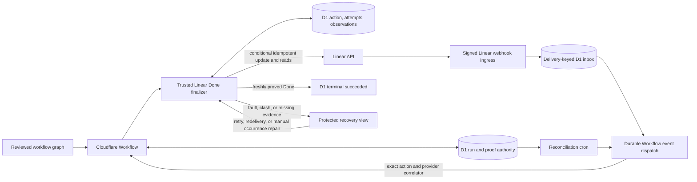

## Context

See `proposal.md` for the motivation and the delta specs for the required
behavior. DEOS already keeps graph authority in the trusted Cloudflare
Workflow and D1, restores each run's immutable workflow definition, and
commits the D1 business outcome before a Workflow returns. Agents cannot
select graph edges or Linear states. Workflow-owned Linear moves use the app
actor and ordered, signed Linear deliveries as provider evidence.

The missing operation belongs between the last successful graph node and the
terminal `done` node. For the simplified planning workflow, its prerequisite
is the saved proof that the authorized pull request and approved planning
files reached the default branch. A workflow with later reviewed gates must
finish those gates too; merging a planning pull request is not a general
shortcut to terminal success.

Linear and D1 do not form one transaction. A provider call can succeed while
its response is lost, a read can fail after a successful call, a signed event
can be delayed, and a Workflow step can replay. The design therefore separates
one logical final action from its attempts and observations. It also makes a
fresh provider read and exact provider-event correlation part of the terminal
success guard.

## Goals / Non-Goals

**Goals:**

- Put one trusted, definition-owned Linear finalizer on each terminal success
  path and make all prior human, merge, and success proofs prerequisites.
- Give the logical finalizer a stable identity across Workflow replay and staff
  retry while retaining every call and read result.
- Preserve a newer Linear state, expose an actionable fault, and retry or
  repair only the finalizer when completion cannot be proved.
- Commit `succeeded` in D1 only after a fresh, strongly consistent Linear read
  shows `Done` and any possibly effective Workflow-owned move has exact signed
  provider evidence.

**Non-Goals:**

- Changing human review, merge authorization, or approved-file verification.
- Giving a Sandbox, agent result, note, or repository file authority to change
  a Linear state.
- Automatically closing historical runs that reached a terminal state before
  this action existed.
- Adding a general state-reconciliation engine or changing ingress signature,
  timestamp, delivery-key, or acknowledgement behavior.

## Decisions

### Component diagram



The finalizer is trusted Worker code called by a reviewed system-action node.
It reuses the existing Linear app adapter, signed webhook ingress, D1
authority, durable Workflow event dispatch, and authenticated stage-retry
pattern. It is not an agent capability. Linear credentials stay outside
Sandboxes and the portal.

Letting the last agent request `Done` was rejected because untrusted output
could bypass graph gates. Letting cron or the portal close any apparently
finished issue was rejected because that would detach the move from the frozen
definition and its exact success proofs.

### Put one finalizer immediately before terminal success

Each applicable immutable workflow definition gets a named system-action node,
`finalize_linear_done`, on every edge that would otherwise enter terminal
`done`. The node is reachable only after the definition's work nodes, user
gates, and merge proofs have passed. Denied, canceled, failed, repair, and wait
edges never enter it.

On entry, one guarded D1 transaction reloads the run and verifies:

1. The run is non-terminal and at the expected finalizer node and visit.
2. The immutable definition and digest still match the run.
3. The definition-specific success-proof record is complete. In the
   simplified planning workflow it includes the authorized pull request,
   exact head, merge commit, default-branch reachability, and approved-file
   hashes.
4. The issue id and expected source-state provenance come from trusted run
   state, not from the triggering event, a current-state read, or agent output.

The transaction creates or reloads the logical action and stores the id and
digest of the accepted success proof. A repair retry validates that reference
but does not rerun review, merge, agents, or GitHub calls.

Every definition containing this finalizer declares the stable node id of the
last Workflow-owned Linear transition on its successful path. Confirmation of
that earlier transition saves the resulting state id, a provider-issued state
occurrence token, provider operation id, and ordered signed-delivery id. The
occurrence token is an opaque revision that changes whenever the issue leaves
and later re-enters the same state. For the simplified planning flow, these
values describe the confirmed transition into `Merging`.

The finalizer copies that provenance into its action exactly once. A retry
cannot refresh it from Linear or a later delivery. Missing, unconfirmed, or
differently sourced provenance is a prerequisite fault and permits no
mutation. Comparing state and occurrence prevents a later transition sequence
that returns to `Merging` from being mistaken for the occurrence DEOS created.

Attaching the action directly to the planning-merge step was rejected because
an immutable workflow can contain later gates, such as design review, and
would then close Linear too early.

### Require verified provider safety and exact event correlation

Before a definition can be enabled, implementation must verify with Linear's
primary contract and a real test issue that the provider supplies these
primitives:

1. A state occurrence token returned by a strongly consistent issue read that
   changes on same-state re-entry.
2. An atomic mutation condition over the current state id and occurrence
   token.
3. A stable idempotency key with definitive operation lookup or exact-key
   replay after a lost response.
4. A provider-authenticated transition correlator shared by the applied
   operation result and its signed webhook event. This can be one immutable
   event id or an immutable resulting occurrence id exposed by both surfaces.
5. A monotonic issue revision shared by issue reads and state-change events,
   plus retained exact-event lookup or redelivery while the provider retains
   the event.
6. Signed state-change webhook fields that expose the prior state id and prior
   occurrence token, the target state id and resulting occurrence token, the
   actor identity, the transition correlator, and the shared issue revision
   used by the exact matcher below.

For an applied attempt, the adapter saves the expected provider correlator
from operation lookup or exact-key replay. An exact-key replay is not
considered reconciled merely because it returns the target state: it must also
return the correlator, or allow a follow-up lookup by the same idempotency key
that returns it. If neither route can recover a correlator, the attempt enters
the bounded manual occurrence-repair path described below; it cannot consume
an unrelated webhook.

After raw-body signature verification, ingress extracts provider fields into
the delivery inbox. A delivery proves an attempted move only when all of these
equal the saved attempt facts:

- issue id;
- app actor id;
- prior state id and prior occurrence token;
- target state id;
- provider transition correlator and resulting occurrence token; and
- provider issue revision greater than the saved source delivery revision and
  no earlier than the claimed operation.

The delivery's `Linear-Delivery` remains the inbox idempotency key. A local
operation id, arrival time, payload timestamp, target-state match, or actor
match by itself is never a correlator. A mismatching signed delivery remains
auditable but cannot wake or prove the action. This exact matching prevents an
unrelated state change, including another app-authored move to `Done`, from
proving the finalizer.

These primitives are release gates. If the verified provider contract lacks
one, implementation must not enable a definition containing this finalizer and
must return the change for redesign. A read-then-write fallback,
state-id-only compare, timestamp guess, webhook-order guess, or evidence waiver
is rejected because it could overwrite newer intent or terminalize an
unconfirmed effect.

### Use stable action and explicit attempt lifecycles

The logical key is:

```text
sha256("linear-done:v1\0" + run_id + "\0" + finalizer_node_id)
```

`finalizer_node_id` is the stable node id in the frozen definition, not a
mutable label or the Cloudflare Workflow instance id. A unique D1 constraint
on `run_id` prevents a second Done action for the same run. A replacement
Workflow or exact step replay therefore finds the same row.

Each authorized attempt has a monotonically increasing attempt number and a
provider operation id derived from `(action_key, attempt_number)`. The
operation id is also the stable provider idempotency key for every transport
retry or status query that reconciles that attempt. The guarded transaction
allocates the attempt before target resolution and the first provider read so
every preflight result has a durable identity.

An attempt follows this explicit lifecycle:

```text
allocated
  -> preflight_failed_no_call
  -> matched_done -> awaiting_terminal_read -> complete
  -> claimed -> applied -> awaiting_evidence -> awaiting_terminal_read -> complete
             -> uncertain -> applied | no_effect | still_unknown
             -> no_effect
still_unknown -> awaiting_evidence -> superseded_by_manual_done_occurrence
              -> awaiting_terminal_read -> complete
```

`allocated` means no mutation claim exists. Target-resolution or pre-call-read
failure changes it to the settled `preflight_failed_no_call` state only while
`call_claimed_at` and `call_started_at` are both null. A pre-call read of the
saved Done state changes it to `matched_done` only when the action has no prior
possibly effective call; this is settled no-call evidence and leads to a new
terminal read without waiting for a mutation webhook. A definitive
conditional mismatch or rejection becomes settled `no_effect`. An ambiguous
call remains `uncertain` or `still_unknown` and is not settled. `complete`
means its accepted evidence and final observation have been committed with
the action.

An exact Workflow replay reuses any open `allocated`, `claimed`, `uncertain`,
`applied`, `awaiting_evidence`, `matched_done`, or `awaiting_terminal_read`
attempt. It does not allocate another number or issue a different logical
mutation. Only initial entry or an authenticated staff retry after a settled
`preflight_failed_no_call` or `no_effect` attempt may allocate the next
attempt. A persistently `still_unknown` attempt never permits a second app
mutation; after bounded same-key lookup, replay, and exact-event recovery are
exhausted, an authenticated operator may move that same attempt into
`awaiting_evidence` by starting manual occurrence repair. This makes recovery
from preflight failures and unknowable effects explicit without risking a
second call after an ambiguous effect.

The existing provider-operation log retains every bounded transport result
for exact-idempotency replay or operation-status lookup. Append-only
observations retain every Linear read. Using only the Workflow step id was
rejected because stage retry can replace the Cloudflare Workflow instance.
Using only the issue id was rejected because one issue can have several
monotonic DEOS runs.

### Event flow

1. The Workflow advances through a reviewed edge into
   `finalize_linear_done`. A guarded transaction reloads D1 authority, creates
   or reuses the action under its stable key, and allocates or reloads the
   initial `allocated` attempt.
2. The adapter resolves the saved `Done` target for the issue's Linear team and
   stores its provider id. A missing or ambiguous target settles the attempt as
   `preflight_failed_no_call`, saves a configuration fault, and performs no
   mutation.
3. The adapter performs a strongly consistent pre-call issue read and appends
   the state id, occurrence token, and issue revision. A failed read settles
   the attempt as `preflight_failed_no_call`. If the action has no prior
   possibly effective call and the issue is already in the saved Done state,
   it atomically changes the attempt to `matched_done`, saves that no-call
   evidence, and proceeds to a new `terminal_read`. If state or occurrence
   differs from the frozen source occurrence, it records a conflict and makes
   no call.
4. If both source values match, D1 atomically changes the attempt from
   `allocated` to `claimed` and sets `call_claimed_at`. The trusted adapter asks
   Linear to move the issue to the saved Done state using the app actor, the
   attempt's idempotency key, and the provider's atomic compare over source
   state plus occurrence. It stores every bounded request result.
5. After every call outcome, including rejection or timeout, the adapter reads
   the issue and appends an observation linked to the same attempt. A failed
   read is retained and never converted into success. A compare mismatch
   cannot write and becomes already Done or conflict only after this read.
6. Signed webhook ingress preserves the existing HMAC, millisecond timestamp,
   `Linear-Delivery`, and HTTP 200 rules. For a delivery that passes the exact
   matching rule above, the inbox transaction creates or reuses a durable
   dispatch intent keyed by `(delivery_id, action_key,
   provider_operation_id)`. The dispatcher sends the fixed event to the run's
   recorded Workflow instance. The finalizer wakes only when both action key
   and provider correlator match, then reloads and verifies the inbox row.
7. Duplicate delivery or dispatch reuses the intent. The existing dispatch
   reconciler retries unsent intents. Cron also finds an action whose matched
   delivery is already in the inbox and recreates a missing intent without
   allocating an attempt or calling Linear.
8. An ambiguous call is reconciled under its existing idempotency key. A
   verified operation lookup or exact-key replay classifies it as applied,
   rejected/no-effect, or still unknown. `no_effect` permits a later
   staff-authorized attempt only if a fresh read still shows the exact frozen
   source occurrence. `applied` saves the provider correlator and waits for the
   exact signed delivery. `still_unknown` prohibits another mutation. After
   bounded provider lookup, same-key replay, retained-event lookup, and
   redelivery are exhausted, an authenticated operator may start manual
   occurrence repair on that same `still_unknown` attempt; the guarded
   transition changes it to `awaiting_evidence` and never classifies the old
   call as applied or no-effect.
9. If an applied or possibly effective call is read in Done but its exact
   delivery is absent, the action records the correlator when available and
   enters `awaiting_provider_redelivery`. Authorized staff may request lookup
   or redelivery of that exact retained event. Only its correctly signed
   request can prove the old attempt.
10. If the event has expired, cannot be redelivered, its correlator cannot be
    recovered, or a `still_unknown` attempt has exhausted bounded provider
    reconciliation, staff can start `manual_done_occurrence_repair`. The
    guarded recovery transaction requires the action to be awaiting evidence
    or the attempt to be `still_unknown`, proves there is no open transport
    request, takes a fresh read of the current occurrence, moves a
    `still_unknown` attempt to `awaiting_evidence`, and saves the state id,
    occurrence token, issue revision, inbox high-water mark, and a repair id.
    It makes no Linear mutation. If the baseline is the ambiguous Done
    occurrence, the protected view instructs staff to make a deliberate
    user-authored move away from it and then back to Done. The matcher requires
    those two later, ordered, correctly signed deliveries for the saved issue
    from the same `actor.type == user`. If the baseline is already non-Done
    because the call had no effect or a later change superseded it, the matcher
    instead requires one later signed user transition from that exact baseline
    occurrence to a new Done occurrence. In both cases, an authenticated
    person chooses the state change; DEOS does not overwrite newer intent. The
    new Done occurrence cannot be the old unconfirmed effect, so the attempt is
    marked `superseded_by_manual_done_occurrence`, not falsely confirmed or
    `no_effect`; no completed review, merge, or agent work is repeated.
11. After operation and exact-delivery evidence, the complete manual occurrence
    repair, or a `matched_done` no-call observation is stored, the finalizer
    changes the attempt to `awaiting_terminal_read` and performs a new strongly
    consistent `terminal_read`. This read must start after the accepted
    evidence, second repair delivery, or `matched_done` observation. For an
    attempted or repaired move it must return the exact Done occurrence and
    monotonic issue revision established by that evidence. For `matched_done`,
    it must return the same Done occurrence observed by the no-call read with a
    revision no older than that observation. A Done read taken earlier in the
    attempt cannot be reused.
12. One guarded D1 batch accepts only that `terminal_read`, verifies that no
    inbox state-change row for the issue has a later provider revision, marks
    the attempt complete and the action succeeded, advances the graph to
    `done`, and commits the run's `succeeded` business outcome. A provider
    change after the terminal read is a new external action outside this
    completion boundary; a change already visible at or before the read cannot
    be hidden by delayed event arrival. Only after this batch may the
    Cloudflare Workflow return normally.
13. Any unproved result leaves the run at the finalizer in a recoverable
    lifecycle state. The protected run view shows the safe cause, last
    observation, and recovery link. Retry, exact-event redelivery, and manual
    occurrence repair operate only on this finalizer.

The terminal read after evidence prevents an earlier Done observation from
being combined with a later delivery. Matching its occurrence and provider
revision to the accepted evidence prevents a stale or unrelated Done state
from terminalizing the run. The `matched_done` path deliberately requires two
ordered reads so a replay can accept existing Done without inventing mutation
evidence or skipping the terminal guard.

### Minimal data model

The design adds three D1 tables and references existing run, success-proof,
delivery inbox, Workflow dispatch, operator-transition, and provider-operation
records.

`linear_done_actions` contains one row per run:

| Field | Purpose |
| --- | --- |
| `action_key` | Primary key derived from run and finalizer node. |
| `run_id` | Unique foreign key to the owning run. |
| `finalizer_node_id` | Stable node id from the immutable definition. |
| `issue_id` | Frozen Linear issue id. |
| `expected_source_state_id`, `expected_source_occurrence_token` | Trusted state occurrence safe to replace. |
| `source_operation_id`, `source_delivery_id`, `source_issue_revision` | Provenance from the definition-declared earlier transition. |
| `target_state_id` | Resolved and saved Done state id. |
| `success_proof_id`, `success_proof_digest` | Immutable prerequisites reused by retry. |
| `status` | `pending`, `in_flight`, `awaiting_reconciliation`, `awaiting_provider_redelivery`, `manual_done_occurrence_repair`, `conflict`, `retryable_failure`, or `succeeded`. |
| `next_attempt_number` | Guarded attempt allocator. |
| `last_observed_state_id`, `last_observed_occurrence_token`, `last_observed_issue_revision`, `last_observed_at` | Denormalized support index for the latest read. |
| `repair_id`, `repair_baseline_state_id`, `repair_baseline_occurrence_token`, `repair_inbox_high_water`, `repair_actor_id`, `repair_leave_delivery_id`, `repair_done_delivery_id` | Nullable manual occurrence-repair guard and evidence; the leave delivery is required only for a Done baseline. |
| `failure_code`, `failure_detail`, `recovery_path` | Bounded, non-secret operator information. |
| `created_at`, `updated_at`, `completed_at` | Audit and reconciliation timestamps. |

`linear_done_attempts` is append-only for each authorized attempt:

| Field | Purpose |
| --- | --- |
| `action_key`, `attempt_number` | Composite primary key and replay identity. |
| `provider_operation_id`, `provider_idempotency_key` | Stable identity for all transport requests reconciling this attempt. |
| `claim_state` | `allocated`, `preflight_failed_no_call`, `matched_done`, `claimed`, `uncertain`, `applied`, `no_effect`, `still_unknown`, `awaiting_evidence`, `awaiting_terminal_read`, `superseded_by_manual_done_occurrence`, or `complete`. |
| `call_claimed_at`, `call_started_at`, `call_outcome`, `call_finished_at` | Mutation claim and bounded result; null claim/start proves a preflight failure or matched-Done path made no call. |
| `provider_transition_id`, `result_occurrence_token`, `result_issue_revision`, `delivery_id` | Exact provider correlation and signed-delivery evidence. |
| `settled_at`, `created_at`, `updated_at` | Retry guard and chronology. |

`linear_done_observations` is append-only for every provider read:

| Field | Purpose |
| --- | --- |
| `action_key`, `observation_number` | Composite primary key allocated under the action. |
| `attempt_number` | Attempt requesting the read; nullable for support and manual-repair reads. |
| `phase` | `pre_call`, `post_call`, `operation_reconcile`, `delivery_reconcile`, `support_reconcile`, `manual_repair_baseline`, or `terminal_read`. |
| `read_outcome` | Bounded success, timeout, rejection, or malformed-result code. |
| `observed_state_id`, `observed_occurrence_token`, `observed_issue_revision`, `observed_at` | Provider state occurrence and revision when available. |
| `provider_operation_id`, `provider_transition_id`, `delivery_id`, `repair_id` | Optional evidence correlation. |
| `read_started_at`, `detail`, `created_at` | Ordering guard, sanitized context, and durable insertion time. |

Provider response bodies, authorization headers, and tokens are not stored.
Call and read details use bounded codes plus sanitized messages. Updating the
action's `last_observed_*` fields never replaces an observation row. Existing
inbox rows retain signed-event actor, prior and target states, occurrence
tokens, correlator, and provider revision used by the exact matcher.

A mutable JSON blob was rejected because concurrent reconciliation could lose
an earlier call or read and D1 could not enforce attempt uniqueness. Copying
all merge and gate facts was rejected because the proof id and digest preserve
an immutable link without creating another source of truth.

### Retry and operator recovery

The authenticated stage-retry route gets a finalizer-only eligibility branch.
It accepts the run id and action identity, verifies the run remains at the same
node and visit, and records the operator transition in the D1 batch that
allocates a permitted next attempt. A `preflight_failed_no_call` attempt is
settled because its null claim and start prove no mutation escaped. A timed-out
operation is not settled; retry first performs lookup or exact-key replay on
that same attempt. Only provider-proved `no_effect` permits another attempt.

The replacement Workflow reloads the current node, so upstream nodes do not
execute again. Eligibility accepts a normally running finalizer and the
`manual_reconciliation_required` state created for premature Cloudflare
completion. For the latter, the guarded batch binds a deterministic replacement
Workflow, restores the recoverable running lifecycle at the unchanged node and
visit, and retains the premature-completion audit row. It never rewrites a
terminal DEOS business outcome.

If the issue is already Done before any finalizer call, the pre-call read
records `matched_done`; a second read after that observation is the terminal
read, so no provider call or mutation webhook is required. If a possibly
effective call exists, Done alone is not enough: retry reconciles its operation
and exact delivery or uses the manual occurrence-repair sequence. If bounded
same-key and exact-event reconciliation leaves the attempt `still_unknown`,
staff may start manual occurrence repair on that same attempt; they may not
allocate a new app mutation. If a prior attempt is proved `no_effect` and the
issue remains at the exact frozen source occurrence, staff may authorize
another call. If state or occurrence differs, retry refreshes the conflict and
does not overwrite it. Returning to the same state id creates a new occurrence
and does not clear the conflict.

The recovery URL is a relative, Access-protected run path generated by trusted
code, with no bearer token in D1. The portal uses an internal service binding
and receives neither Linear credentials nor raw provider replies. Redelivery
requests and manual-repair starts are authenticated, audited actions scoped to
the saved action and current recovery state. Neither can request a Workflow
mutation.

### Failure modes

- **Success proof is absent, stale, or has the wrong digest** -> Create no
  provider attempt. Record a typed prerequisite failure and follow the
  existing failed or repair edge; never move Linear.
- **Expected source provenance is missing or is not the confirmed result of
  the definition-declared transition** -> Do not infer it from a current read.
  Record a prerequisite fault and make no mutation.
- **Done target cannot be resolved uniquely** -> Settle the allocated attempt
  as `preflight_failed_no_call`, save a retryable configuration fault, and link
  to finalizer-only recovery.
- **Pre-call read fails** -> Settle the attempt as
  `preflight_failed_no_call` only while claim and call timestamps are null.
  Save the observation and allow an authenticated later attempt.
- **Pre-call read shows Done and no call may have escaped** -> Record
  `matched_done`, make no mutation, then require a second strongly consistent
  terminal read of the same occurrence before committing success.
- **Current state or occurrence differs from the frozen source** -> Append the
  observation, preserve the newer occurrence, and require staff repair.
  Re-entry into the same state id remains a conflict.
- **Conditional mutation reports a compare mismatch** -> The provider made no
  write. Append the mandatory read and classify the attempt as already Done,
  conflict, or provider-proved `no_effect`; never automatically call again.
- **Concurrent Workflow execution** -> A guarded D1 claim gives one execution
  the attempt. Other executions reconcile it and never call.
- **Call is rejected** -> Save the rejection, perform the required read, and
  settle as `no_effect` only when the provider proves no mutation occurred.
- **Call times out or its response is lost** -> Mark it uncertain, read before
  retry, and use only operation lookup or exact-key replay. Unknown effect
  prohibits another attempt.
- **The call remains `still_unknown` after bounded provider reconciliation** ->
  Keep the old attempt open and prohibit another app mutation. Let an
  authenticated operator move that same attempt into manual occurrence repair,
  establish a fresh baseline, and prove a later user-authored Done occurrence.
- **Exact-key replay proves application but yields no event correlator** ->
  Attempt correlator lookup by the same idempotency key. If unavailable, enter
  manual occurrence repair; never match a delivery by timing or target state.
- **Read after call fails or does not show Done** -> Save both results, leave
  the run non-terminal, and expose finalizer-only recovery.
- **Read shows Done but exact signed delivery is absent** -> Suppress another
  mutation and request exact event lookup or redelivery.
- **The exact event expired or cannot be redelivered** -> Keep the old attempt
  unconfirmed and offer manual Done occurrence repair. Starting from the exact
  saved baseline, require either a signed user move away from ambiguous Done
  and back or, for a non-Done baseline, one signed user move to Done. A new
  terminal read then proves current Done without repeating completed work.
- **Manual occurrence repair is incomplete or interleaved by another state
  change** -> Do not accept it. Refresh the baseline under another authenticated
  recovery action; never splice deliveries from different sequences or actors.
- **A stale Done read predates accepted evidence** -> Reject it for terminal
  success and perform a new `terminal_read` after evidence.
- **A later inbox revision exists at terminal commit** -> Reject the commit,
  reconcile the later state, and preserve it if it is not Done.
- **A signed delivery is unrelated, duplicated, or out of order** -> Store it
  by `Linear-Delivery`, but only the exact provider correlator and revision
  matcher can affect the action.
- **Delivery is stored but Workflow dispatch fails** -> Leave the intent
  pending. Dispatch reconciliation retries it, and cron recreates a missing
  intent without allocating an attempt or calling Linear.
- **D1 fails before claim** -> Make no call. If persistence fails after a call
  may have escaped, reconcile the preallocated operation id before any new
  attempt.
- **Terminal D1 commit conflicts** -> Do not return normal Workflow completion.
  Reload the action and run; accept only an exact succeeded replay or continue
  reconciliation.
- **Cloudflare completes before D1 terminal success** -> For a run stranded at
  this finalizer, cron records `premature_workflow_completion`, changes D1 to
  non-terminal `manual_reconciliation_required`, and exposes finalizer-only
  retry. It never moves Linear or starts a replacement automatically. Other
  premature completions retain the existing terminal `failed` behavior.

## Risks / Trade-offs

- **[Risk] Linear may not offer all required provider primitives** -> Verify
  the primary contract and real test issue before schema or executor work. If
  occurrence compare, strong read/revision ordering, idempotency
  reconciliation, exact event correlation, or either webhook occurrence field
  is absent, stop and redesign.
- **[Risk] Requiring a terminal read and signed delivery can delay completion
  after Linear is visibly Done** -> Keep the action recoverable, suppress
  another mutation, retry dispatch or redelivery, and retain manual occurrence
  repair for expired or persistently unknowable evidence.
- **[Risk] Manual occurrence repair asks staff to make one or two deliberate
  Linear state changes** -> Restrict it to unavailable evidence, require an
  audited baseline plus the exact signed user event sequence, and never rerun
  completed workflow work or represent the old operation as confirmed.
- **[Risk] Additive action, attempt, and observation rows increase D1 writes**
  -> Keep one compact logical row and append bounded attempt and read facts;
  reuse existing transport and inbox history and store no raw provider bodies.
- **[Risk] A workflow-definition rollback could strand finalizer nodes** ->
  Retain loader and executor support for every allocated immutable definition,
  even after the default selector returns to an older version.
- **[Risk] Automatically backfilling old terminal runs could bypass the proof
  model** -> Do not backfill; handle historical issues through a separate,
  explicitly authorized procedure.

## Migration Plan

1. Inspect Linear's primary contract and exercise a real test issue to prove a
   same-state-changing occurrence token, atomic compare on state plus
   occurrence, strongly consistent reads with a shared issue revision,
   definitive same-idempotency reconciliation, an exact operation-to-webhook
   correlator, exact-event lookup or redelivery, and signed webhook payloads
   containing actor, prior and target state ids, both prior and resulting
   occurrence tokens, the correlator, and the shared issue revision. If a hard
   primitive or required webhook field is absent, stop before schema, executor,
   or definition changes and redesign.
2. Add the three D1 tables, constraints, and indexes as an additive migration.
   Deploy code that can read them before a workflow definition references the
   finalizer.
3. Add the trusted finalizer, explicit preflight lifecycle, provider
   reconciliation, append-only observations, exact delivery matcher, durable
   event wake-up, terminal-read guard, protected recovery view, manual
   occurrence repair, premature-completion exception, and finalizer-only retry.
   Keep provider secrets in the Worker and preserve signed-ingress invariants.
4. Register a new immutable definition version with `finalize_linear_done`
   immediately before every successful terminal. Existing runs keep their
   frozen versions and receive no automatic action row. Keep the version
   disabled until validation and provider proof pass.
5. Validate deterministic cases for success, exact replay, preflight failure
   retry, already Done through `matched_done` and a second terminal read,
   ambiguous applied and no-effect calls, persistently `still_unknown` manual
   repair, correlator mismatch, replay-only correlator recovery, same-state
   re-entry, compare mismatch, missing and expired delivery, manual occurrence
   repair, stale Done observation, later provider revision, lost dispatch,
   concurrent claim, premature Workflow completion, replacement retry, and
   terminal conflict.
6. Before enabling the definition, use the real test issue to capture
   provider-originated proof: the app actor performs the conditional move, a
   stale occurrence is rejected without changing the issue, a lost response
   settles under the same idempotency key, the signed webhook contains both
   occurrence fields and its correlator matches the operation, withheld
   evidence is redelivered, remote D1 retains every call and observation, and
   a post-evidence terminal read precedes the success commit. Also exercise the
   already-Done no-call path and the expired or persistently unknown evidence
   manual repair with a non-production issue. Capture Showboat and read-only D1
   evidence plus sanitized screenshots of provider configuration and issue
   state. Label locally signed ingress as synthetic supporting proof, not
   end-to-end proof.
7. Enable the new definition only after that evidence passes. Roll back by
   selecting the previous definition for new runs while retaining additive
   schema and finalizer support for allocated runs. Do not delete action
   history or reinterpret a recoverable action as success.

## Open Questions

None. Provider-contract verification is an implementation prerequisite, not a
deferred design choice. The accepted shape requires occurrence-aware atomic
compare, strong read/revision ordering, definitive idempotency reconciliation,
an exact operation-to-webhook correlator, and both signed webhook occurrence
fields. If Linear lacks one, the design must be revised rather than weakened
with timing guesses or evidence waivers.
