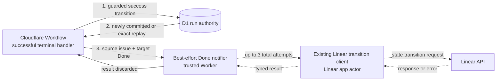

## Context

See [proposal.md](proposal.md) for motivation and
[specs/workflow-state/spec.md](specs/workflow-state/spec.md) for the required
behavior.

DEOS already commits its business outcome to D1 before a Cloudflare Workflow
returns. Workflow-owned Linear transitions run in the trusted Worker with the
Linear app actor; an agent Sandbox has neither the credential nor authority to
change issue state. This change adds one outbound transition after the
authoritative `succeeded` outcome is committed. The outcome must remain
authoritative even when the outbound request fails.

The no-bookkeeping constraint rules out an outbox, Queue message, provider
receipt, read-back, reconciliation row, and repair job. As a result, the design
can make the request promptly and bound its retries, but cannot guarantee that
Linear eventually applies it.

## Goals / Non-Goals

**Goals:**

- Put the Done transition behind the existing trusted Linear client and after
  the durable success commit.
- Give known safe transient failures a small, deterministic retry budget while
  isolating every request result from the DEOS final outcome.
- Make the trigger, retry ownership, and failure boundary unambiguous for the
  implementation and its tests.

**Non-Goals:**

- Providing exactly-once delivery, durable retry progress, later confirmation,
  or repair.
- Adding a new provider credential path, Queue consumer, database object,
  workflow state, or operator setting.
- Changing how non-success terminal outcomes are recorded.

## Component Diagram

The notifier is a function inside the trusted workflow execution boundary, not
a separately dispatched component. The diagram separates it to show its error
boundary and retry ownership.

## Event Flow

1. The terminal handler computes the reviewed terminal outcome using the
   existing workflow graph rules.
2. For `succeeded`, it first performs the existing guarded D1 transition that
   makes the run final. The transition result must classify this invocation as
   either `committed`, when it newly commits `succeeded`, or `exact_replay`,
   when the existing transition row proves that the same terminal traversal
   already committed `succeeded`. Both results enter the Done notifier. A lost
   guard, a different traversal, or an existing terminal outcome not owned by
   this traversal is ineligible and skips the notifier.
3. After an eligible transition result, the handler invokes and awaits the
   notifier in a catch-all best-effort boundary. This lets a replay resume at
   the post-commit side effect if the prior execution stopped after committing
   success. Awaiting the bounded call keeps the Worker alive long enough to
   send it; it does not make the already committed result conditional on
   Linear.
4. The notifier passes the run's frozen source issue identity and the literal
   target state name `Done` to the existing workflow-owned Linear transition
   client. The client remains responsible for its established state-name
   resolution and provider wire contract. The implementation must verify that
   contract against Linear's primary documentation before changing the client.
5. A successful response ends the notifier immediately. The notifier does not
   wait five seconds, read the issue state, or wait for a returning Linear
   webhook before deciding whether to retry. A client error classified as a
   known, safe transient Linear failure may be retried twice, for three total
   attempts in that notifier invocation. The counter is process-local and is
   not restored after a process restart or an exact Workflow replay.
6. Any unclassified error, a non-transient error, or exhaustion of the two
   retries ends the notifier. The terminal handler discards that result and
   returns normally with the run still `succeeded`.
7. For `canceled`, `failed`, `blocked`, or `denied`, the terminal handler skips
   the notifier entirely and preserves the existing terminal behavior.

Cloudflare Workflow-level automatic retries must not be requested in response
to a provider error. The notifier owns the only intentional provider-error
retries, so the limit and error classification remain visible and testable in
one place. An exact replay after an abrupt stop is different: it re-enters the
notifier because D1 proves the same success traversal, and it may repeat the
whole three-attempt local budget. No replay is scheduled merely to repair the
Linear state.

If Linear emits a signed delivery for the resulting `Done` change, it follows
the existing authenticated ingress and Queue path. That delivery is useful as
out-of-band provider proof, but the notifier does not wait for, correlate, or
read it as an acknowledgement. A delayed or absent delivery therefore cannot
start another Done attempt.

## Decisions

### Commit success before contacting Linear

The D1 final-outcome transition remains the authority boundary. Its typed
result exposes `committed`, `exact_replay`, or an ineligible result without
adding a record: `exact_replay` is derived from the existing stable traversal
identity and transition row. Only `committed` and `exact_replay` for the same
`succeeded` terminal traversal may attempt Linear. All notifier exits are
converted to a normal return. This ordering makes provider availability
incapable of changing the business result while allowing an execution that
stopped just after commit to make the request on replay.

The alternative was to call Linear before or inside the success transaction.
That would either let a provider failure prevent completion or hold a database
transaction across a network call, so it is rejected.

### Reuse the workflow-owned Linear transition client

The trusted Worker calls the existing Linear transition abstraction with
`Done`; it does not give a Sandbox a state-mutation capability and does not add
a second direct GraphQL implementation. This best-effort method reuses the
client's credential, transport, and state-name resolution, but it does not enter
the existing signed-delivery confirmation path or claim that the change was
confirmed. The client must expose a typed request outcome whose retryable flag
is true only for errors that Linear's primary contract identifies as transient
and safe for repeating the same state assignment. Every unknown error defaults
to non-retryable.

This preserves the current credential boundary and avoids inventing a wire
format in the workflow layer. A new agent capability or raw provider call was
considered and rejected because agents cannot mutate Linear state and should
not receive provider credentials.

### Keep retries local, bounded, and non-durable

The notifier makes one initial attempt and at most two retries. It uses the
Linear client's bounded request timeout and its verified transient-error
classification; it adds no Workflow retry policy, Queue message, retry row, or
receipt. The retry count is a code constant rather than a setting because the
approved scope calls for a simple fixed limit and no operator process.

An outbox or delayed retry worker would improve eventual delivery, but both
would create bookkeeping and repair behavior excluded by the approved plan.
Unlimited or platform-owned retries are rejected because they would obscure
the bound and could continue work after the run is final.

### Accept ambiguous delivery without read-back

The implementation does not query the issue before or after the transition.
If the process stops after Linear may have accepted a request but before DEOS
receives the response, there is no receipt with which to distinguish applied
from unapplied. An exact replay of the same success traversal re-enters the
notifier and may therefore repeat the same assignment. If the platform does not
replay after a stop, the issue may remain open. Assigning the same target state
is the least harmful duplicate, and the plan explicitly accepts the absence of
confirmation and repair. A stale or different terminal traversal cannot use an
already-successful run as a reason to notify.

A five-second delay followed by an issue-state query is rejected because it is
the later state check explicitly excluded by the approved specification. Using
the returning signed Linear delivery as an acknowledgement is also rejected:
the delivery is asynchronous, its absence is ambiguous, and correlating it to
control another attempt would require the receipt or durable retry state that
the plan forbids. The delivery may still prove the integration externally
during validation; production control flow never consumes it as confirmation.

Adding an idempotency ledger, polling the issue, or gating retries on inbound
delivery would close part of that gap, but each is excluded by the
specification.

## Minimal Data Model

No schema or persisted record is added. The notifier consumes only data already
owned by the run and constants owned by the code:

| Value | Source | Lifetime |
| --- | --- | --- |
| Final outcome | Existing D1 run authority | Existing durable field; must equal `succeeded` before invocation |
| Success-transition result | Existing guarded transition and stable traversal row | Memory-only `committed`, `exact_replay`, or ineligible classification |
| Source Linear issue identity | Existing frozen/correlated run identity | Existing durable run data |
| Target state | Literal `Done` | Code constant |
| Attempt number | Notifier local variable, `1..3` | Memory only |
| Provider result or error | Existing Linear client | Memory only; discarded on return |

There is no Done-delivery status, receipt, state snapshot, next-attempt time,
repair marker, or new telemetry table. Existing generic runtime logs may report
a provider error, but no control-flow decision or later process may depend on
them.

## Failure Modes

| Failure | Behavior |
| --- | --- |
| The guarded D1 success transition newly commits `succeeded` | Classify it as `committed` and call the notifier. |
| The same terminal-success traversal replays after its D1 commit | Derive `exact_replay` from the existing transition row and call the notifier again; do not add a delivery record. |
| The guarded transition loses authority, conflicts, or observes success from a different traversal | Classify it as ineligible, do not call the notifier, and use the existing terminal-transition behavior. |
| The Linear request returns success | Trust the response, stop immediately, and return normally without confirmation. |
| The request returns success but the corresponding signed Linear delivery is delayed or absent | Do not poll, wait, or retry; inbound delivery is evidence only and does not control the notifier. |
| The client returns a contract-verified safe transient error | Retry locally while attempts remain; after attempt 3, discard the error. |
| Linear rejects authentication, authorization, target-state resolution, validation, or another non-transient condition | Do not retry; discard the error and keep `succeeded`. |
| The client returns an unknown error or throws unexpectedly | Treat it as non-retryable at the notifier boundary; keep `succeeded`. |
| A request times out or loses its response | Retry only if the verified client classifier marks that condition safe; accept ambiguous provider state. |
| The Worker stops after the D1 commit and before the first request | D1 remains `succeeded`; an exact replay of that traversal enters the notifier, while absence of a replay leaves Linear unchanged. |
| The Worker stops after sending the request and before receiving its response | D1 remains `succeeded`; an exact replay may repeat the assignment because no receipt or read-back exists. |
| A canceled, failed, blocked, or denied terminal path executes | Skip the notifier, including all retries. |

## Risks / Trade-offs

- [Linear may remain open after a successful run] → Keep the request
  best-effort as specified; do not add reconciliation or alter the D1 outcome.
- [An ambiguous response can lead to a duplicate Done assignment] → Reuse
  the same state-assignment operation and accept duplicates instead of adding a
  receipt or read-back.
- [An exact replay receives a fresh local retry budget] → Admit only the
  same stable success traversal, never schedule replay for a Linear failure,
  and accept bounded-per-execution rather than durable retry accounting.
- [A returning signed delivery can be delayed or absent] → Use it only for
  out-of-band implementation evidence; never make runtime retry behavior depend
  on observing it.
- [Retries extend the executor's tail after the result is visible] → Commit
  success first, cap work at three attempts, and retain the client's bounded
  request timeout.
- [Provider error semantics can drift] → Keep unknown errors
  non-retryable and verify the classifier against Linear's primary contract
  during implementation.
- [A notifier regression could throw outside expected client errors] → Put
  the entire notifier behind the terminal handler's catch-all boundary and test
  both typed failures and unexpected throws.

## Migration Plan

1. Before implementation, inspect Linear's primary state-transition and error
   contracts and identify a real test issue that can exercise the request. Map
   only documented safe transient conditions into the client's typed retryable
   result.
2. Add the notifier and terminal-success hook without a D1 migration, new
   binding, secret, Queue, or route setting. Unit tests cover ordering, the
   three-attempt-per-invocation ceiling, newly committed and exact-replay entry,
   stale/conflicting replay rejection, non-retryable failures, unexpected
   throws, and every non-success terminal outcome.
3. On a non-production or controlled route, use Linear MCP to move a real test
   issue through the configured trigger state so Linear itself emits the signed
   event. Show that the Worker received that event and that the read-only D1
   delivery query records the expected ingress classification. Then allow that
   same run to commit `succeeded` and invoke the Done request. This is the
   provider-originated proof; a directly generated or synthetic dispatch, if
   also tested, must be labeled synthetic and kept separate.
4. After the outbound request, use the existing authenticated ingress evidence
   to capture Linear's ordered signed delivery for the same issue moving to
   `Done` under the Linear app actor. Correlate that later delivery with the
   run's committed `succeeded` result and the prior trigger delivery so the
   provider evidence confirms this workflow-owned transition rather than only
   showing the final issue state. Query the existing D1 delivery record
   read-only; do not add an outbound receipt, application read-back, or control
   flow that waits for this confirmation.
5. Capture sanitized Codex Browser screenshots of the provider configuration,
   the triggering issue state, and the resulting `Done` state. Use Showboat to
   capture the executable commands and real remote output for deployment and
   read-only D1 evidence, including both ordered Linear deliveries, their
   ingress classifications, and the committed `succeeded` result. Link or embed
   the screenshots and Showboat/D1 evidence in the implementation PR. The
   application itself performs no Linear read-back and adds no outbound-delivery
   receipt.
6. Exercise a controlled Linear failure and show that the D1 result remains
   `succeeded` and that no retry/repair record is created. Package this evidence
   with the implementation PR as well.
7. Roll back by removing the terminal hook and notifier. No data rollback is
   required; issues already moved to `Done` are not moved back.
