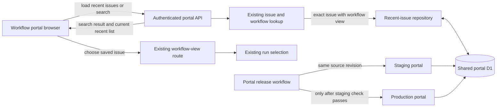

## Context

See `proposal.md` and `specs/portal-recent-issues/spec.md` for the approved
behavior. This change belongs to the DEOS workflow portal, not BettaView. The
portal already authenticates a person, searches for an exact issue and its
workflow view, and opens that view with existing run-selection rules.

The repository currently has one D1 backend used by the portal deployments.
Staging and production therefore do not have separate history stores. The
staging requirement is a release gate for the portal revision, while test data
is isolated from real users by the same trusted person key used for all history
rows. This design does not introduce a second backend, a release controller, or
cryptographic release attestations.

## Component Diagram

## Goals / Non-Goals

**Goals:**

- Keep one server-owned recent-issue list per authenticated person.
- Update deduplication, recency, and the ten-row limit in one D1 transaction.
- Reuse the existing workflow route and run selection when a saved item opens.
- Keep the implementation small enough to test and operate with the current
  single D1 backend.
- Make a passing staging check for the same source revision a prerequisite for
  production deployment.

**Non-Goals:**

- Add operation tokens, a replay ledger, capacity counters, or release
  attestations.
- Create separate staging and production D1 databases.
- Cache workflow runs or store a selected run in recent history.
- Add history deletion, cross-person sharing, or an administrative history UI.
- Change an issue, a workflow state, or the existing run-selection rules.

## Decisions

### 1. Derive the history owner from the authenticated request

The API derives `person_key` from the verified Access identity already used by
the portal. The shared helper trims and lowercases the verified email before any
history query. No recent-issue endpoint accepts a person key from the URL,
query, application headers, or request body.

Server-side identity scoping meets the reload and later-sign-in requirements and
prevents one browser from selecting another person's list. Browser storage was
rejected because it is limited to one browser and is controlled by the client.
A shared unscoped list was rejected because it would expose one person's issue
history to another.

### 2. Record only a successful existing search

The existing search handler remains responsible for deciding whether the input
matches an exact issue and that issue has a workflow view. Only that successful
branch calls the recent-issue repository. Failed searches and issues without a
workflow view return their existing result and do not call the repository.

For an eligible issue, one D1 transaction performs three ordered statements for
the authenticated person:

1. Delete an existing row with the same stable issue ID.
2. Insert the issue ID, current identifier, current title, and a new
   auto-incremented recency ID.
3. Delete rows outside that person's newest ten recency IDs.

Deleting and reinserting the duplicate moves it to the top. When the person
already has ten different issues, inserting an eleventh and trimming removes
only the least recent one. Re-searching an existing issue keeps the count the
same, so no unrelated issue is removed. The unique constraint on
`(person_key, issue_id)` is the final duplicate guard, and D1 transaction order
defines recency for concurrent successful searches.

The handler returns the normal search result plus the current newest-ten list
read after the transaction. A direct client endpoint that accepts an arbitrary
issue to save was rejected because it could bypass the exact-issue and
workflow-view checks. A client-side read-modify-write list was rejected because
two requests could lose each other's updates.

### 3. Load and open saved issues through existing portal paths

On portal load, `GET /api/recent-issues` reads at most ten rows for the trusted
person ordered by `recency_id DESC`. Each item contains `issueId`, `identifier`,
and `title`. The sidebar renders this server result, so reload and a later sign-in
restore the same list without browser persistence.

Choosing a saved item passes its stable `issueId` to the existing workflow-view
route. That route continues to choose a run under its current rules. Opening an
item is read-only: it neither updates recent-list order nor changes Linear or
workflow state. A run ID is not stored because doing so would freeze a choice
that belongs to existing run selection.

The browser assigns increasing request numbers to initial-load and search
requests and applies a returned list only when its request number is newer than
the last applied response. This small guard prevents a delayed load or older
search response from replacing a more recent sidebar. While loading, the
sidebar shows a loading state; a read failure shows a retry action instead of an
empty list.

### 4. Use the single D1 backend for staging and production

Both portal deployments bind the current shared D1 backend. The schema migration
is therefore applied once, before the staging check, and is not repeated during
production deployment. Staging checks use a dedicated authenticated test
identity, so their recent rows cannot appear in a real person's sidebar even
though the underlying table is shared. Test rows may be removed by person key
after evidence is captured.

The portal release workflow builds a named source revision, deploys that revision
to the staging site, reads back the active staging version at 100% traffic, and
runs the recent-issue checks. The production deployment job depends on that
staging job and compares its source SHA with the checked SHA. A missing, failed,
or different-revision staging result prevents the production command from
running. This is a normal deployment dependency; it does not require a signed
attestation service or changes to the DEOS orchestration workflow, which has no
deploy node.

Separate databases were rejected because they do not exist today and are not
needed for this bounded portal feature. An external release controller and key
lifecycle were rejected as disproportionate to a sidebar persistence change.

## Event Flow

1. On page load, the browser requests recent issues from the authenticated
   portal API.
2. The API derives the canonical person key from verified Access identity and
   returns that person's newest ten D1 rows.
3. When the person searches, the API runs the existing exact-issue and workflow
   lookup.
4. If there is no exact issue or no workflow view, the API returns the search
   result and leaves recent history unchanged.
5. If the search is eligible, the repository deletes that person's duplicate,
   inserts the issue with a new recency ID, and trims that person's rows to ten
   in one D1 transaction.
6. The API reads and returns the committed newest-ten list with the normal search
   result. The browser applies it only if the response is not stale.
7. Choosing a sidebar item opens the existing workflow-view route by stable issue
   ID; existing run selection chooses the run without mutating history or state.
8. For release, the same source revision is deployed and checked on staging
   first. Only its passing, matching check enables the production deployment.

## Minimal Data Model

Add one table to the shared portal D1 database:

| Column | Purpose |
| --- | --- |
| `recency_id INTEGER PRIMARY KEY AUTOINCREMENT` | Gives successful searches a total newest-first order. |
| `person_key TEXT NOT NULL` | Canonical verified portal identity that owns the row. |
| `issue_id TEXT NOT NULL` | Stable issue identity used for deduplication and navigation. |
| `issue_identifier TEXT NOT NULL` | Human-readable issue key shown in the sidebar. |
| `issue_title TEXT NOT NULL` | Display title captured from the latest successful search. |

Add `UNIQUE (person_key, issue_id)` and an index on
`(person_key, recency_id DESC)`. No operation, token, capacity, environment, or
run tables are needed. The table holds at most ten rows per person after every
successful transaction; the implementation also limits every read to ten.

The API projection is `{ issueId, identifier, title }`. It never returns
`person_key` or `recency_id` because neither is client input or navigation state.

## Failure Modes

- **Missing or invalid trusted identity:** Reject the request before reading or
  writing recent history.
- **No exact issue or no workflow view:** Return the existing search outcome and
  leave the table unchanged.
- **D1 write failure:** Roll back the duplicate removal, insertion, and trim as
  one transaction. Return the search result with a bounded recent-history error
  so the browser does not claim it was saved, and offer retry.
- **D1 read failure:** Keep the last confirmed sidebar during the session and
  show a retryable error; do not render an empty list as authoritative.
- **Concurrent successful searches:** Let D1 serialize the transactions. The
  later committed recency ID is newest, uniqueness prevents duplicates, and
  each transaction trims only its authenticated person.
- **Delayed browser response:** Ignore its list when a newer request number has
  already been applied.
- **Saved issue later lacks a workflow view:** Use the existing workflow route's
  unavailable result. Keep the saved row until it is refreshed by a successful
  repeat search or removed by normal ten-row trimming.
- **Migration missing or invalid on staging:** Fail the staging check and do not
  run the production deployment.
- **Staging test identity is misconfigured:** Stop the check before writing test
  history; never use a real person's identity as fallback.
- **Staging check fails or refers to another source SHA:** Leave the current
  production portal version active.
- **Production activation or read-back fails:** Do not claim release success;
  restore the prior portal version. The additive history table remains and is
  safe for the prior version to ignore.

## Risks / Trade-offs

- **[Staging and production share D1]** → Use a dedicated staging test identity,
  assert identity isolation during the check, and delete only that identity's
  test rows after evidence is captured.
- **[Display text can become stale]** → Navigate with stable issue ID and refresh
  identifier and title whenever the issue is successfully searched again.
- **[A search may succeed while history persistence fails]** → Keep search
  navigation available, report the history error explicitly, and never update
  the sidebar optimistically.
- **[Concurrent tabs can display an older snapshot briefly]** → Treat D1 as
  authoritative, guard responses within each tab, and refresh on the next
  search or reload.
- **[The table is not user-deleteable]** → Keep it bounded to ten rows per person;
  deletion and administrative tooling remain outside this change.

## Migration Plan

1. Add one idempotent, additive migration for `portal_recent_issues`, its unique
   constraint, and its newest-first index in the shared D1 database.
2. Add repository and route tests for trusted identity isolation, successful
   insert, duplicate movement, eleventh-item trimming, failed-search no-op,
   transactional rollback, reload, stale-response handling, and existing
   workflow navigation and run selection.
3. Build the workflow portal with `npm run portal:build` and deploy the named
   source revision to staging through the portal's staging target.
4. With a dedicated staging identity, search eleven distinct issues that have
   workflow views, repeat one issue, reload, and open a saved issue. Confirm
   newest-first order, uniqueness, the ten-row bound, durability, and unchanged
   workflow state. Also confirm a failed search leaves the list unchanged.
5. Read back the staging version at 100% traffic. Capture sanitized portal
   screenshots, Showboat command output, and read-only D1 evidence for the test
   identity in the implementation PR.
6. Allow production deployment only when the staging job passed for the same
   source SHA. Deploy and read back production at 100% traffic, then verify the
   live browser.
7. If portal behavior regresses, restore the prior portal version. Leave the
   additive table in place; no destructive D1 rollback is required.
