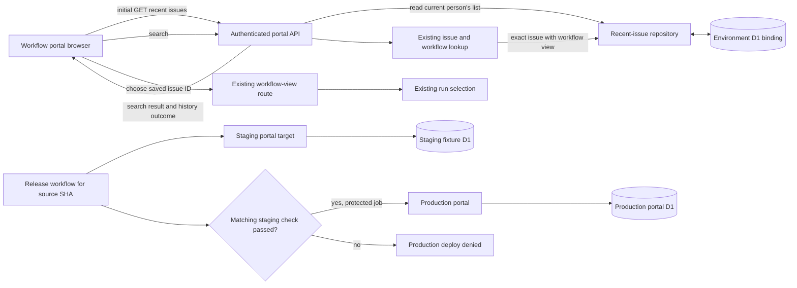

## Context

See `proposal.md` and `specs/portal-recent-issues/spec.md` for the approved
behavior. This change belongs to the DEOS workflow portal, not BettaView. The
portal already authenticates a person, searches for an exact issue and its
workflow view, and opens that view with existing run-selection rules.

The checked repository context documents one production D1 backend and one
production portal deployment command. It does not establish an existing staging
portal target, staging Access policy, or staging database. Those non-production
resources must therefore be created before the approved staging gate can run.
Production continues to have one durable portal D1 backend. Staging uses a
separate D1 binding containing only test fixtures, so code under test cannot
write production data. Identity isolation remains per principal: real people
use their verified Access email, while the automated staging check uses its own
verified Access service principal.

## Component Diagram

## Goals / Non-Goals

**Goals:**

- Keep one server-owned recent-issue list per authenticated person.
- Update deduplication, recency, the ten-row limit, and the returned snapshot in
  one D1 transaction.
- Reuse the existing workflow route and run selection when a saved item opens.
- Prevent an unverified staging revision from writing the production D1 backend.
- Make a passing staging check for the same source revision an enforced
  prerequisite for production deployment.

**Non-Goals:**

- Add operation tokens, a replay ledger, capacity counters, or release
  attestations.
- Create a second production history store or synchronize history between
  environments.
- Cache workflow runs or store a selected run in recent history.
- Add history deletion, cross-person sharing, or an administrative history UI.
- Change an issue, a workflow state, or the existing run-selection rules.

## Decisions

### 1. Derive the history owner from the verified Access principal

The authenticated API derives `person_key`; no recent-issue endpoint accepts it
from a URL, query, application header, or request body. For a human principal in
production, the shared identity helper requires a verified Access email, trims
and lowercases it, and prefixes it with `person:`. This keeps the same key after
a reload or later sign-in and separates human keys from non-human principals.

The automated staging check uses a dedicated Cloudflare Access service token
allowed only by the staging Access application. Because that principal has no
email, staging middleware requires its verified Access JWT `sub` to equal the
configured `STAGING_CHECK_SUBJECT` and derives
`staging-service:<verified-sub>`. It performs this comparison before any portal
handler or D1 write. The token secret is held by the staging check job; only its
non-secret expected subject is portal configuration. Production rejects service
principals for recent history, and staging never falls back to a human identity.

A browser-supplied owner was rejected because it could select another person's
history. Browser storage was rejected because it is controlled by one client
and does not survive a later sign-in on another browser. Treating a service
token as an email was rejected because Access does not supply that claim for the
staging principal.

### 2. Record only a successful existing search

The existing search handler remains responsible for deciding whether the input
matches an exact issue and that issue has a workflow view. Only that successful
branch calls the recent-issue repository. Failed searches and issues without a
workflow view return their existing search outcome and do not call the
repository.

For an eligible issue, one D1 transaction performs four ordered statements for
the authenticated principal:

1. Delete an existing row with the same stable issue ID.
2. Insert the issue ID, current identifier, current title, and a new
   auto-incremented recency ID.
3. Delete rows outside that principal's newest ten recency IDs.
4. Select that principal's newest ten rows in `recency_id DESC` order.

The final select is part of the same transaction, not a later replica read, so
the returned snapshot sees the insert and trim that commit with it. If any
statement or result fails, the transaction rolls back and no snapshot is
reported as updated. Deleting and reinserting a duplicate moves it to the top.
Inserting an eleventh distinct issue removes only the least recent one.
Re-searching an existing issue keeps the count unchanged. The unique constraint
on `(person_key, issue_id)` is the final duplicate guard, and D1 transaction
order defines recency for concurrent successful searches.

The search response adds a bounded `recentIssues` outcome to its existing
result:

- `{ state: "updated", items: [...] }` is returned only after the transaction
  commits; the browser replaces the sidebar with `items`.
- `{ state: "unchanged" }` is returned for an ineligible search; it contains no
  `items`, and the browser preserves its current sidebar.
- `{ state: "error", code: "recent_history_unavailable" }` is returned when
  persistence fails; it contains no `items`, and the browser preserves the last
  confirmed list and offers retry.

An absent `items` member never means an empty history. A direct client endpoint
that accepts an arbitrary issue to save was rejected because it could bypass
the exact-issue and workflow-view checks. A client-side read-modify-write list
was rejected because concurrent requests could lose updates.

### 3. Load and open saved issues through existing portal paths

On portal load, `GET /api/recent-issues` reads at most ten rows for the verified
principal ordered by `recency_id DESC`. It returns `{ items: [...] }`, where each
item contains `issueId`, `identifier`, and `title`. This direct API-to-repository
read does not perform an issue lookup. The sidebar renders the server result, so
reload and a later sign-in restore the same list without browser persistence.

Choosing a saved item passes its stable `issueId` to the existing workflow-view
route. That route continues to choose a run under its current rules. Opening an
item is read-only: it neither updates recent-list order nor changes Linear or
workflow state. A run ID is not stored because doing so would freeze a choice
that belongs to existing run selection.

The browser assigns increasing request numbers to initial-load and search
requests and applies an `items` snapshot only when its request number is newer
than the last applied snapshot. `unchanged` and `error` search outcomes do not
advance the last-applied snapshot number and never clear the list. While initial
history is loading, the sidebar shows a loading state; a read failure shows a
retry action instead of an authoritative empty list.

### 4. Give staging an isolated portal target and D1 binding

Create a non-production Worker environment named `portal-staging`, route it at
`staging.deos.voxdez.com`, and protect it with its own Cloudflare Access
application. Its bindings mirror the portal dependencies needed for lookup and
workflow rendering, except its D1 binding targets a non-production database
named `deos-portal-staging`. That database receives the same additive migration
as production plus bounded fixture issues and workflow runs needed by the
recent-history check. It contains no production portal rows or provider
credentials.

The staging deploy token can update only staging resources and cannot access the
production D1 binding or production portal deployment. The staging revision is
therefore free to exercise insert, delete, trim, reload, and navigation against
representative data without relying on correct `person_key` scoping to protect
real users. The separate database is a test resource, not a second durable user
history store; no staging history is copied into production.

Binding the staging revision to production D1 was rejected because the code
under test could contain a mis-scoped write. A shared database plus a dedicated
test identity limits correct writes but does not limit faulty SQL. A read-only
staging binding was rejected because it cannot verify the required persistence,
deduplication, and trimming behavior.

### 5. Enforce the staging gate with production credential isolation

The release workflow builds a named source SHA, deploys that SHA to
`portal-staging`, reads back the active staging version at 100% traffic, and
runs the recent-issue checks. The staging job records the checked source SHA and
build digest as job outputs. The production job depends on that exact successful
job and rejects a missing result, failed result, SHA mismatch, or build-digest
mismatch.

The production job runs in a protected CI environment named
`portal-production`. It is the sole holder of the Cloudflare credential that
can migrate production D1 or deploy the production portal. The staging job,
ordinary CI jobs, and local `.env` credentials must not have those rights; any
existing broadly scoped local credential must be revoked or narrowed before the
feature can be released. Consequently, the documented direct Wrangler command
cannot authenticate for production outside the protected job. Environment
approval and the matching-job checks occur before the production credential is
made available.

After the gate passes, the protected job applies the additive migration to the
single production D1 backend, deploys the same source SHA and build digest, and
reads the production version back at 100% traffic. A signed release attestation
service was rejected as unnecessary because the protected environment and
credential boundary make the job dependency enforceable. An unprotected job
dependency alone was rejected because a direct deploy could bypass it.

## Event Flow

1. On page load, the browser requests recent issues from the authenticated
   portal API.
2. The API verifies the Access principal, derives its canonical key, reads the
   repository directly, and returns that principal's newest ten D1 rows.
3. When the person searches, the API runs the existing exact-issue and workflow
   lookup.
4. If there is no exact issue or no workflow view, the API returns
   `recentIssues.state = "unchanged"`; the browser keeps its current list.
5. If the search is eligible, the repository deletes the principal's duplicate,
   inserts the issue, trims that principal's rows to ten, and selects the
   resulting snapshot in one D1 transaction.
6. After commit, the API returns the normal search result with
   `recentIssues.state = "updated"` and the transactional snapshot. The browser
   applies it only if it is newer than the last applied snapshot.
7. Choosing a sidebar item opens the existing workflow-view route by stable
   issue ID; existing run selection chooses the run without mutating history or
   state.
8. For release, the source SHA is deployed to the isolated staging target and
   checked with its allowlisted Access service principal.
9. Only the protected production job can use production deploy credentials; it
   requires the matching staging SHA and build digest before migrating and
   deploying production.

## Minimal Data Model

Add one table, with the same schema in staging and production portal D1:

| Column | Purpose |
| --- | --- |
| `recency_id INTEGER PRIMARY KEY AUTOINCREMENT` | Gives successful searches a total newest-first order. |
| `person_key TEXT NOT NULL` | Namespaced, canonical verified Access principal that owns the row. |
| `issue_id TEXT NOT NULL` | Stable issue identity used for deduplication and navigation. |
| `issue_identifier TEXT NOT NULL` | Human-readable issue key shown in the sidebar. |
| `issue_title TEXT NOT NULL` | Display title captured from the latest successful search. |

Add `UNIQUE (person_key, issue_id)` and an index on
`(person_key, recency_id DESC)`. No operation, token, capacity, environment, or
run tables are needed. The table holds at most ten rows per principal after
every successful transaction; every read is also limited to ten.

The API projection is `{ issueId, identifier, title }`. It never returns
`person_key` or `recency_id` because neither is client input or navigation state.
Release job outputs are CI metadata, not application data, and require no D1
table.

## Failure Modes

- **Missing, invalid, or wrong-kind Access principal:** Reject before reading or
  writing history. Production accepts verified human email principals only;
  staging automation accepts only the configured service-token subject.
- **No exact issue or no workflow view:** Return the existing search outcome
  with `recentIssues.state = "unchanged"`; do not query or mutate history.
- **D1 transaction or final-select failure:** Roll back duplicate removal,
  insertion, trim, and snapshot selection together. Return the search result
  with `recentIssues.state = "error"`; keep the last confirmed sidebar.
- **Initial history read failure:** Keep the last confirmed list during the
  session and show a retryable error; do not render an empty list as truth.
- **Concurrent successful searches:** Let D1 serialize the transactions. The
  later committed recency ID is newest, uniqueness prevents duplicates, and
  each transaction trims only its verified principal.
- **Delayed browser response:** Ignore an `updated` or initial-load snapshot
  when a newer snapshot number was already applied. Outcomes without `items`
  never clear or supersede the list.
- **Saved issue later lacks a workflow view:** Use the existing workflow route's
  unavailable result. Keep the row until a successful repeat search refreshes
  it or normal ten-row trimming removes it.
- **Staging target, Access policy, fixtures, or D1 binding is absent:** Fail the
  staging job before deployment or history writes; production remains blocked.
- **Staging service principal subject does not match:** Reject the pre-handler
  identity check, write no history, and fail the staging job. Never substitute a
  real person's identity.
- **Staging migration or behavior check fails:** Record no passing output for
  the source SHA and do not expose the protected production credential.
- **Direct or mismatched production deploy is attempted:** The staging/local
  credential lacks production rights; the protected job rejects mismatched SHA
  or build digest before receiving its production credential.
- **Production migration, activation, or read-back fails:** Do not claim release
  success. Restore the prior portal version; leave the additive table in place
  because the prior version safely ignores it.

## Risks / Trade-offs

- **[Staging data differs from production data]** → Apply the identical schema
  migration and seed only the issue and workflow shapes needed by the approved
  checks; run production migration preflight before activation.
- **[A staging D1 resource adds maintenance]** → Keep it non-production,
  fixture-only, bounded, and managed with the staging target; never synchronize
  user history into it.
- **[Display text can become stale]** → Navigate with stable issue ID and
  refresh identifier and title whenever the issue is successfully searched.
- **[A search may succeed while history persistence fails]** → Keep search
  navigation available, return the explicit history error, and never update the
  sidebar optimistically.
- **[Concurrent tabs can display an older snapshot briefly]** → Treat D1 as
  authoritative, guard responses within each tab, and refresh on the next
  search or reload.
- **[The table is not user-deleteable]** → Keep it bounded to ten rows per
  person; deletion and administrative tooling remain outside this change.

## Migration Plan

1. Provision `portal-staging`, `staging.deos.voxdez.com`, its Access application
   and allowlisted check service token, and `deos-portal-staging`. Configure the
   expected verified service-token subject and seed bounded issue/workflow test
   fixtures.
2. Add one idempotent, additive migration for `portal_recent_issues`, its unique
   constraint, and its newest-first index. Apply it to staging D1 first.
3. Add repository and route tests for human and service-principal derivation,
   identity isolation, successful insert, duplicate movement, eleventh-item
   trimming, ineligible-search no-op, response outcomes, transactional rollback
   and snapshot consistency, reload, stale responses, and existing navigation.
4. Restrict the production migration/deploy credential to the protected
   `portal-production` job and remove production rights from staging, general CI,
   and local credentials. Configure the production job to require the successful
   matching staging SHA and build digest.
5. Build the workflow portal with `npm run portal:build`, deploy the named source
   SHA to staging, and read back the active revision at 100% traffic.
6. Using only the allowlisted staging service principal, search eleven distinct
   fixture issues with workflow views, repeat one, reload, and open one. Confirm
   order, uniqueness, the ten-row bound, durability, unchanged workflow state,
   failed-search no-op, and the expected service-principal namespace.
7. Capture sanitized portal screenshots, Showboat command output, and read-only
   staging D1 evidence. Emit the checked SHA and build digest only after all
   staging assertions pass.
8. Through the protected job, apply the additive migration to production D1,
   deploy the matching source and build, read back production at 100% traffic,
   and verify the live browser.
9. If portal behavior regresses, restore the prior production portal version.
   Leave the additive table in place; no destructive D1 rollback is required.
