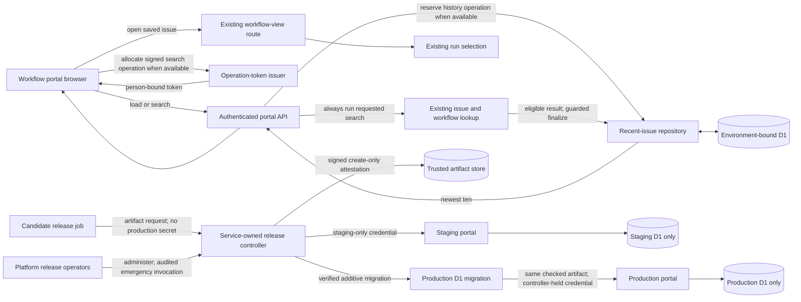

## Context

See `proposal.md` for the motivation and
`specs/portal-recent-issues/spec.md` for the required behavior. This change
belongs to the separate DEOS workflow portal, not BettaView. The portal already
has authenticated issue search and workflow-view paths, including existing run
selection. It does not keep a per-person list of successful searches.

The recent list must be durable in D1 and scoped by the trusted portal identity.
The browser must never choose the identity used for a read or write. This is a
portal data-flow change; it does not add a webhook, Queue message, Workflow
transition, provider credential, or issue-state mutation.

Staging is a separate data plane. It must prove the exact source and build before
production without using the active DEOS workflow as release evidence, because
that workflow has no deploy or release-finalization node.

## Component Diagram

## Goals / Non-Goals

**Goals:**

- Make one server-side protocol responsible for deduplication, recency, replay,
  and the ten-entry limit.
- Keep identity enforcement and history mutation behind authenticated routes.
- Return the committed result for a retry without repeating mutable lookup.
- Keep the existing issue search and workflow result available when recent-list
  recording is temporarily unavailable.
- Prevent delayed responses from replacing newer sidebar state.
- Reuse the existing workflow route and run-selection behavior for saved items.
- Isolate staging history from production history.
- Enforce staging proof for the exact production source and build.
- Keep data migrations additive so the portal can be rolled back safely.

**Non-Goals:**

- Cache workflow runs or select a run when an issue is saved.
- Add a client-writeable recent-history endpoint or browser-local history.
- Add user-facing history deletion, identity merging, or an admin history view.
- Add deploy nodes to the active DEOS workflow.
- Change Linear issues, DEOS workflow state, or orchestration behavior.

## Decisions

### 1. Scope history with the trusted portal identity

The authenticated API derives a canonical person key from the verified Access
identity already available to the portal. One server helper normalizes it for
all token, ledger, and history operations. The key is never accepted from a URL,
query, application header, or JSON body.

D1 meets reload and later-sign-in durability while allowing server-enforced
identity scope. Browser storage was rejected because it is tied to one browser,
is easy to alter, and cannot reliably meet later sign-in. A shared list was
rejected because it could expose one person's work to another.

### 2. Allocate a signed, expiring operation before search

Before sending a search, the browser calls
`POST /api/recent-issue-operations` with the search text. The authenticated API
normalizes the text and computes a request fingerprint as
`SHA-256("recent-search:v1\n" + normalized_text)`. It returns an opaque token
covering a random operation UUID, the trusted person key, the fingerprint, an
issued time, and a 15-minute expiry. The portal signs the token with an
application HMAC key that is unavailable to the browser.

The browser reuses this token only for transport retries of that deliberate
search. A later deliberate search, including one for the same issue, allocates a
new token. The search API verifies the signature, expiry, trusted person binding,
and recomputed fingerprint before allowing any history mutation. Modified,
expired, or cross-person tokens are rejected for recording without changing
history; the ordinary lookup still follows the fail-open rule below.

The token header contains a signing-key ID. Operation-token keys live only in
portal Worker secret bindings as a key ring with one active signing key and
zero or more verification-only keys; they are never stored in D1, browser data,
or repository configuration. Rotation first installs a new verification key,
then makes it active, and retains the former key for at least the 15-minute
token lifetime plus five minutes of clock skew before removal. If a key is
suspected compromised, operators revoke its ID immediately. Tokens bearing that
ID then fail closed for history mutation; the browser keeps the search result,
shows that recent history was not updated, and asks the person to deliberately
resubmit rather than silently allocating a replacement token.

A bare browser UUID was rejected because a ledger row could not later be pruned
without allowing an old request to look new. Once a signed token expires, the
server can reject it even after its ledger row has been removed.

### 3. Consult and reserve the operation ledger before mutable lookup

After token validation, the search handler reads the operation row before it
repeats the existing issue and workflow lookup:

- A completed row returns its saved classification and current canonical history
  immediately. It does not repeat lookup or recency writes.
- A row with a different fingerprint is a conflict.
- A live `pending` row returns a retryable in-progress response.
- An expired `pending` lease can be taken over with a guarded fencing-version
  increment.
- If no row exists, run bounded expired-row cleanup and recheck the storage
  and per-person reservation limits. When either limit is closed, skip history
  reservation even when the token was issued earlier. Otherwise, one guarded D1
  write reserves `pending` with the fingerprint, a 60-second lease, and fencing
  version one.

Only the reservation owner may use an exact-issue and workflow-view lookup result
to finalize history. A non-recording fallback may run the ordinary lookup but
cannot write the ledger or recent list. The reservation owner uses a second
guarded D1 transaction that requires the same operation ID and fencing version:

1. For `no_exact_issue` or `no_workflow_view`, finalize that classification and
   leave `portal_recent_issues` unchanged.
2. For an exact issue with a workflow view, delete the same person's prior row
   for that stable issue ID, insert the canonical snapshot with a new increasing
   recency key, and trim that person to the newest ten.
3. Save the stable issue ID in the operation result, mark the row `saved`, and
   commit the result with the recent-list changes.

The finalized row is the replay result. If a first successful response is lost
and the issue later changes, retry still returns `saved` without repeating the
lookup. If a worker stops while `pending`, no list mutation has committed; a
fenced takeover may safely repeat lookup after the lease. A stale owner cannot
finalize after takeover.

Unsuccessful searches still do not change the saved list. Recording their
private operation classification only makes retries deterministic. A public
`add recent issue` endpoint and client-side read-modify-write were rejected
because they could bypass workflow validation or lose concurrent updates.

The ledger is not allowed to disable the pre-existing search path. If token
allocation, reservation, or the operations table is unavailable, or a capacity
or rate gate declines a new operation, the API still performs the existing exact
issue and workflow lookup and returns that result. It does not write recent
history and returns `recentHistoryStatus: "skipped"` with a bounded reason. The
browser preserves its last confirmed sidebar and offers a retry; it does not
pretend that the issue was saved. A D1 failure inside the final guarded
transaction also rolls back the history change but does not discard the lookup
result. This fail-open rule applies only to search availability: identity and
token validation still fail closed for any attempted history mutation.

### 4. Bound operation retention without weakening replay safety

The server sets `purge_after` to one hour after the signed token expires. This is
longer than the token lifetime, clock-skew allowance, and lease takeover window. An
hourly cleanup deletes completed rows and abandoned pending rows only after
`purge_after`. Each successful reservation also removes a small batch of expired
rows so cleanup continues during cron disruption.

No valid request can arrive after its row is eligible for deletion: the token is
already expired and fails before ledger lookup. Cleanup works in bounded batches
to avoid long D1 transactions. New reservations are limited to 20 per trusted
person in any rolling five-minute window. The reservation query uses the
person-and-created-time index and returns `recentHistoryStatus: "skipped"` with
`retryAfterSeconds` when the limit is reached; the issue search still runs.

Capacity is based only on live rows in `portal_recent_issue_operations`, not on
database-wide bytes or unrelated orchestration tables. Each environment has an
explicit `operation_row_budget` set before release from its verified D1 capacity
plan. A singleton control row keeps `live_operation_rows`, updated atomically on
reservation and cleanup. The hourly cleanup job also performs an authoritative
`COUNT(*)` reconciliation and records `measured_at`. Alert when the reconciled
count reaches 70% of the row budget. Close new reservations at 85%; reopen only
after cleanup and an authoritative recount put the count below 75%, providing
hysteresis. The reservation transaction checks the closed flag and count, so an
hourly sample cannot allow the configured budget to be exceeded. New token
allocation may be skipped while closed to avoid useless work, and an
already-issued token cannot bypass the reservation gate.

Completed replay, an existing pending lease, history read, search, and saved
navigation remain available because they add no ledger row. After expired rows
drain, reservation may resume if the token is still valid; otherwise the person
deliberately starts a new search. Indefinite retention was rejected because it
would make search volume, rather than ten saved issues, the storage bound.

### 5. Keep saved navigation independent from recency mutation

Each sidebar row opens the existing workflow-view path by canonical issue
identity. Opening does not allocate a search operation or change recency. The
existing route continues to select a run under its current rules; no run ID is
stored in recent history.

Storing a run ID was rejected because it would freeze a decision that the
approved requirements leave to existing selection rules. Reusing the workflow
route also keeps the action read-only for Linear and DEOS workflow state.

### 6. Guard the sidebar against stale responses

`GET /api/recent-issues` performs initial load. It and each search response return
the canonical newest-ten projection. Every row contains `issueId`, `identifier`,
and `title`; `issueId` is the stable identity passed to the existing workflow-view
path. Every browser request that can replace the sidebar receives an increasing
in-memory request ordinal. The browser applies a response only when its ordinal
is newer than the last applied ordinal. A delayed load, earlier search, or replay
cannot overwrite newer state.

For a completed replay, `classification: "saved"` describes only what the
original operation committed. The `recentIssues` projection in that response is
the current authoritative sidebar state. The saved issue may be absent because
later searches trimmed it, and the browser neither highlights nor navigates from
the historical classification. Search-result navigation continues to use the
lookup result returned for the deliberate search. The ledger therefore stores
no pointer to a recent-list row that later deduplication or trimming can delete.

The browser serializes search mutations from one tab in submission order. Across
tabs, D1 commit order defines the latest successful search; each tab refreshes
from server state after its action and on reload. An optimistic browser-owned
list was rejected because it can diverge from durable state.

While initial load is pending, the sidebar shows a loading state. On failure it
shows a retry action, not an empty saved list.

### 7. Bind staging and production to separate data planes

Staging and production use separate portal Worker environments and separate D1
database IDs. The binding is fixed by deployment environment; neither a request
parameter nor candidate code can select another environment's database.

The staging deployment credential is scoped only to the staging Worker and
staging D1. Staging Access admits only staging test identities. Staging checks
create and inspect only staging rows and use test issues suitable for that
environment. The production database is never bound to staging, queried for
staging evidence, or copied into test fixtures. Production migrations run only
inside the guarded production promotion after staging proof passes. The
controller applies and verifies the same additive migration that was checked on
staging before it activates candidate portal code.

Sharing one D1 database was rejected because a staging test could reveal or
reorder production history.

### 8. Put attestation and production authority outside candidate code

A service-owned release controller is deployed and administered separately from
the candidate portal revision and repository release job. Candidate code can
submit an immutable source revision and artifact but has no staging-attestation
signing key, create permission for the attestation store, or production token.

The controller alone performs these steps:

1. Verify protected build provenance that binds the repository, source SHA,
   artifact SHA-256, and additive migration digest, then apply that migration to
   staging and deploy the artifact with staging-only credentials.
2. Query Cloudflare directly to confirm the staging version is at 100% traffic.
3. Run the allowlisted staging check contract and verify its real output.
4. Sign an attestation containing source SHA, artifact digest, staging version,
   migration digest, traffic read-back, check outcome, and evidence hashes with
   a controller-held key. Write it to a create-only trusted artifact namespace.
5. On promotion, read back and verify the signature and every identity. Reject
   an absent, failed, malformed, or mismatched attestation.
6. Apply the attested additive migration to production and verify its expected
   tables, indexes, and migration digest. If applying or verifying it fails,
   abort before deployment and leave the current production version active.
7. Use the controller-held production token itself to deploy the already checked
   artifact. The token is never returned to CI or candidate code. Read back the
   production version at 100% traffic before reporting activation. If activation
   fails after the additive migration, restore the prior portal version; that
   version ignores the new tables, so no destructive schema rollback is needed.

The attestation uses an asymmetric signing key stored as an encrypted secret
binding on the separately administered controller Worker; candidate code and
portal Workers never receive the private key. The attestation carries a signer
key ID, and promotion
accepts only public keys in the controller's audited verification registry.
Rotation publishes the next public key before making its private key active and
keeps the former public key until every attestation in its 24-hour promotion
window has expired. On suspected compromise, platform operators revoke the key
ID immediately, reject
every not-yet-promoted attestation signed by it, rotate the key, and rerun the
staging check to create new proof. Removing a key cannot be replaced by a manual
approval note.

The production API token is scoped to the production portal Worker and D1. Its
broker policy accepts requests only from the fixed controller service identity,
not from a repository workflow identity. Changing candidate pipeline code
therefore cannot obtain the token or mint an attestation. A manual note, an
unsigned artifact, or a passing check from another revision cannot satisfy the
gate. Job dependency alone was rejected because repository code could edit it.

The platform release team owns the controller as a separately deployed
Cloudflare control-plane service, its secret store, broker policy, monitoring,
and on-call response. It is required to be available for releases, but it is not
on the portal request path: an outage blocks new staging attestations and
promotions while the active production portal continues serving traffic. The
team bootstraps and updates it through a separately reviewed platform-admin
process with an immutable audit record, never through the candidate repository
job. Continuous health checks page that team; every promotion starts with a
controller, signer, broker, and audit-store preflight. A failed preflight closes
the gate, and the operational recovery target is four hours because the running
portal does not depend on this control plane.

For controller or broker failure, a two-operator break-glass procedure may use a
hardened platform-admin runner to restore a previously active production version
or execute the same pinned controller validation against an already-created,
still-valid attestation. It records the operators, reason, source and artifact
digests, attestation ID, commands, and read-back in the create-only audit store.
It cannot mint proof, skip staging, accept a revoked key, change the attested
artifact, or deploy a new unverified revision. Misconfiguration is repaired
through the platform-admin process before normal promotion resumes.

## Event Flow

1. A signed-in person enters search text. The browser requests a person-bound,
   fingerprint-bound operation token when recent-history recording is available.
2. The browser assigns a request ordinal and sends the search with that token.
3. When a token is present, the API verifies its signature, key ID, expiry,
   person, and request fingerprint before allowing any history mutation.
4. The API checks the operation ledger before issue lookup. Completed operations
   replay their result; pending operations wait or use fenced takeover. A closed
   capacity/rate gate or unavailable ledger marks history as skipped.
5. The API runs the existing exact issue and workflow lookup even when history
   was skipped. A new reservation owner is the only caller allowed to finalize
   a history operation.
6. One guarded final transaction records an unsuccessful classification without
   changing history, or records a successful result while moving the issue to
   the top and trimming only that person's list to ten.
7. The response includes current canonical history and its recording status.
   The browser applies it only if its request ordinal is newest. A replay's
   classification is historical; the returned list is current and authoritative.
8. Initial load separately reads at most ten rows for the trusted person in
   descending recency order and uses the same ordinal guard.
9. Choosing a saved row opens the existing workflow route. Existing run selection
   chooses the run; no search-history, issue, or workflow mutation occurs.
10. Expired operation rows are deleted through the purge index in bounded
    scheduled and opportunistic batches. The control count is reconciled hourly;
    expired tokens are rejected before ledger lookup.
11. For release, the external controller deploys and checks the exact artifact on
    isolated staging and signs the attestation. Promotion verifies the proof,
    applies and verifies the attested additive production migration, then
    activates and reads back that same artifact.

## Minimal Data Model

Add `portal_recent_issues` independently to staging and production D1:

| Column | Purpose |
| --- | --- |
| `recency_id INTEGER PRIMARY KEY AUTOINCREMENT` | Total order for genuine successful searches. |
| `person_key TEXT NOT NULL` | Canonical key from verified portal identity. |
| `issue_id TEXT NOT NULL` | Stable issue identity for deduplication and navigation. |
| `issue_identifier TEXT NOT NULL` | Human-readable issue key for the sidebar. |
| `issue_title TEXT NOT NULL` | Display snapshot from the successful search. |

Use `UNIQUE (person_key, issue_id)` and an index on
`(person_key, recency_id DESC)`. No run ID is stored.

Add `portal_recent_issue_operations` independently to each environment:

| Column | Purpose |
| --- | --- |
| `person_key TEXT NOT NULL` | Scopes the operation to trusted identity. |
| `operation_id TEXT NOT NULL` | UUID from the signed operation token. |
| `request_fingerprint TEXT NOT NULL` | Binds retries to normalized search input. |
| `status TEXT NOT NULL` | `pending`, `saved`, `no_exact_issue`, or `no_workflow_view`. |
| `fencing_version INTEGER NOT NULL` | Rejects stale lease owners. |
| `lease_expires_at TEXT` | Allows bounded takeover of abandoned work. |
| `issue_id TEXT` | Stable issue ID for a finalized saved result. |
| `token_expires_at TEXT NOT NULL` | Server-signed request expiry. |
| `purge_after TEXT NOT NULL` | Earliest safe cleanup time. |
| `created_at TEXT NOT NULL` | Server reservation time. |
| `completed_at TEXT` | Server finalization time. |

Its primary key is `(person_key, operation_id)`. A check constraint limits
`status` to the four named values. Saved status requires `issue_id`; the two
unsuccessful statuses require it to be null. Add indexes on
`(purge_after, person_key, operation_id)` for bounded cleanup and
`(person_key, created_at DESC)` for the reservation-rate check. Initial-load and
search responses return `issueId`, `identifier`, and `title` for each sidebar
row, plus `recentHistoryStatus`, the durable classification, and a replay flag
where a search response needs them.

Add one `portal_recent_issue_operation_capacity` row per environment:

| Column | Purpose |
| --- | --- |
| `singleton_id INTEGER PRIMARY KEY CHECK (singleton_id = 1)` | Ensures one environment-local control row. |
| `operation_row_budget INTEGER NOT NULL` | Explicit maximum live-row planning budget for this ledger. |
| `live_operation_rows INTEGER NOT NULL` | Count updated with reservations and cleanup. |
| `reservations_closed INTEGER NOT NULL` | Gate set at 85% and cleared only below 75%. |
| `measured_at TEXT NOT NULL` | Time of the last authoritative hourly recount. |

The release controller refuses staging or production promotion when the row
budget is absent or non-positive. The count is operational capacity metadata,
not per-person history, and is reconciled from the operations table each hour.

The release attestation is a signed create-only JSON artifact, not portal D1
data. Its minimal fields are schema version, repository, source SHA, artifact
SHA-256, migration digest, staging Worker/version, traffic percentage, check
result, evidence hashes, signer key ID, issued time, a promotion deadline 24
hours after issue, and signature.

## Failure Modes

- **Missing trusted identity:** Reject before issuing a token or querying D1.
- **Modified, expired, revoked-key, or cross-person operation token:** Reject it
  for history mutation. Continue the ordinary issue lookup, report that history
  was skipped, and do not replace the token automatically.
- **Operation fingerprint mismatch:** Reject history mutation as a conflict, run
  the ordinary issue lookup, and keep recent history unchanged.
- **Completed operation replay:** Return its durable classification and current
  list without repeating lookup or recency writes.
- **Live pending operation:** Return a retryable in-progress response. After lease
  expiry, use a fenced takeover; reject stale-owner finalization.
- **Issue absent or workflow view absent:** Finalize the matching unsuccessful
  classification and leave recent history unchanged.
- **Token issuer, ledger reservation, or capacity control unavailable:** Run the
  ordinary issue lookup, leave history unchanged, preserve the last confirmed
  sidebar, and return a retryable skipped-history status.
- **D1 finalization failure:** Roll back classification and recent-list writes,
  but return the completed lookup result. Keep or recover the pending
  reservation through its fenced lease.
- **D1 read failure:** Show a retryable history error, not an empty list.
- **Delayed response:** Ignore it when its browser ordinal is stale.
- **Concurrent tabs:** Let D1 serialize finalized writes; later commit is newer.
- **Saved issue later unavailable:** Use the existing workflow route's bounded
  unavailable result and preserve history until a later search or normal trim.
- **Completed replay after later trim:** Return `classification: "saved"` as the
  original outcome and the current list as authoritative. Do not infer current
  membership or navigate from the classification.
- **Reservation rate limit:** After 20 new reservations for the same person in
  five minutes, skip history mutation with `retryAfterSeconds`; keep search and
  navigation available.
- **Cleanup lag or capacity cutoff:** Use indexed bounded deletion, transactionally
  maintain the live-row count, and reconcile it hourly. Alert at 70%, close at
  85%, and reopen below 75% while preserving search, completed replay, reads,
  and navigation.
- **Staging attempts production D1 access:** The binding is absent and the
  staging credential lacks rights; fail the check without querying production.
- **Unsigned or mismatched staging proof:** The controller rejects promotion and
  leaves the current production version active.
- **Revoked or compromised attestation key:** Reject affected unpromoted proof,
  rotate the key, and repeat staging before promotion.
- **Production migration fails verification:** Abort before artifact activation
  and leave the current production version active. Additive partial schema may
  remain for safe diagnosis and retry.
- **Candidate job requests production credentials:** The broker rejects its
  identity; the controller never discloses the token.
- **Controller or broker unavailable:** Block new promotion without affecting the
  running portal. Use the audited two-operator emergency path only for a known
  prior version or the exact validation of existing valid staging proof.
- **Production read-back fails:** Do not claim activation; retain the prior
  version as rollback target.

## Risks / Trade-offs

- **[Operation allocation adds one request]** → Keep the endpoint small and issue
  one token per deliberate search; it buys bounded, replay-safe semantics, while
  fail-open lookup preserves the existing search when recording is unavailable.
- **[Display snapshots can age]** → Navigate by stable issue identity and refresh
  display fields on a repeat successful search.
- **[Cleanup can temporarily lag]** → Use hourly plus opportunistic batches and
  indexed cleanup, a reconciled ledger-only row budget, and hysteresis.
- **[Two D1 environments require separate migrations]** → Apply the same additive
  migration first to staging and only later through guarded production release.
- **[Release authority is concentrated in the controller]** → Keep candidate
  code outside its signer and credential boundary, scope tokens by environment,
  record create-only attestations, operate an audited emergency runner that
  cannot bypass proof, and audit every promotion.
- **[Key rotation can invalidate outstanding work]** → Carry key IDs, overlap
  verification keys for normal rotation, and make compromise revocation fail
  closed only for mutation while ordinary search remains available.
- **[Additive tables remain after rollback]** → Leave them in place. The old
  portal ignores them, and forward deployment retains valid history.

## Migration Plan

1. Create separate staging and production D1 databases or confirm their distinct
   IDs. Prepare one idempotent additive migration for both data tables, the
   capacity control row, constraints, indexes, and its required environment-local
   row budget. Do not apply it to production yet.
2. Add tests for identity isolation, order, duplicate movement, trim, concurrent
   search, completed replay after lookup changes, fingerprint conflicts, pending
   takeover fencing, token expiry and key rotation, bounded indexed cleanup,
   per-person rate limiting, capacity close/reopen hysteresis, fail-open search,
   replay after trim, stable navigation responses, stale response rejection,
   failed lookup, rollback, reload, and existing run selection.
3. Configure fixed per-environment bindings and least-privilege staging and
   production tokens. Install the operation-token key ring in Worker secret
   bindings and prove staging cannot access production D1.
4. Configure the service-owned controller, protected builder identity,
   attestation signer and public-key registry, create-only artifact namespace,
   production-token broker policy, monitoring, platform owner, and audited
   two-operator emergency runner outside candidate code. Exercise normal and
   compromised-key rotation and prove the emergency runner cannot bypass proof.
5. Build with `npm run portal:build`. Have the controller apply and verify the
   migration on staging, deploy the exact source and artifact, and read back 100%
   active traffic.
6. On staging, use staging-only identities and real test issues with workflow
   views. Check eleven searches, a repeat, a lost-response replay after lookup
   change, a failed search, reload, identity isolation, and saved navigation.
7. Use Showboat for executable deployment, D1-isolation, version read-back, and
   check commands with sanitized real remote output. Capture sanitized portal
   screenshots and read-only staging D1 evidence for order, uniqueness, trim,
   idempotency, cleanup indexes, rate/capacity gating, fail-open search,
   navigation, and identity scope.
8. Put the Showboat record, D1 evidence, screenshots, and signed attestation in
   the implementation PR body or comment. Cite source SHA and artifact digest.
9. Let only the controller verify the signed attestation and its migration
   digest. Apply and verify the additive production D1 migration before portal
   activation; abort on any migration error. Only after schema verification does
   the controller promote the same artifact and read it back at 100% traffic.
   Missing, failed, revoked-key, expired, or mismatched proof blocks production.
10. For rollback, restore the prior portal version and leave both additive tables
    intact; no destructive D1 rollback is required.
