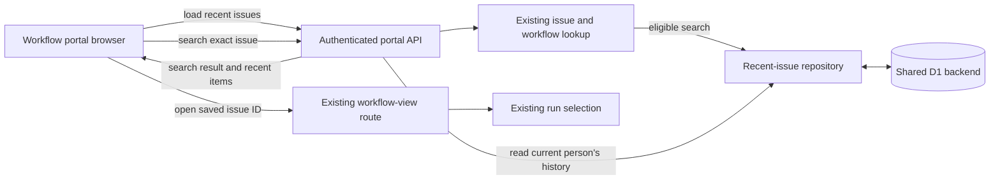

## Context

See `proposal.md` and `specs/portal-recent-issues/spec.md` for the approved
behavior. This change belongs to the DEOS workflow portal, not BettaView. The
portal already authenticates each request with Cloudflare Access, searches for
an exact issue and its workflow view, and opens that view with the existing run
selection rules.

The portal deployments use the existing shared D1 backend. Recent issues are
therefore ordinary portal data in that backend, scoped by the person's verified
Access identity. This design does not add a staging database, staging identity,
release attestation, or new deployment architecture. The existing portal CI
path remains responsible for deploying the revision to the staging portal,
checking it there, and allowing the checked revision to proceed to production.

## Component Diagram

## Goals / Non-Goals

**Goals:**

- Keep one durable, server-owned list for each authenticated person.
- Make deduplication, recency, and the ten-item bound one atomic D1 update.
- Restore the list through the API on page load.
- Reuse the existing workflow route and run selection when an item is opened.

**Non-Goals:**

- Add a separate backend or synchronize history between deployments.
- Add operation ledgers, tokens, attestations, or release-control components.
- Cache workflow runs or save a selected run with an issue.
- Add history deletion, sharing, or administration.
- Change issue state, workflow state, or existing run-selection behavior.

## Decisions

### 1. Scope history with the verified Access email

The authenticated API derives `person_key` from the verified Access email by
trimming it, converting it to lowercase, and prefixing it with `person:`. The
API never accepts `person_key` from a URL, query, application header, or request
body. Every history read, delete, insert, and trim includes this derived key.

This uses the identity the portal already trusts, remains stable across reloads
and later sign-ins, and prevents one browser from selecting another person's
history. Browser-local storage was rejected because it is tied to one client
and cannot restore the list after a later sign-in on another browser.

### 2. Update history only after an eligible search

The existing search handler continues to decide whether a search found the
exact issue and whether that issue has a workflow view. Only that successful
branch passes the issue to the recent-issue repository. A failed search or an
issue without a workflow view leaves history untouched.

For an eligible issue, one atomic D1 batch performs these operations for the
derived `person_key`:

1. Delete any row for the same stable issue ID.
2. Insert the stable issue ID, current identifier, current title, and a new
   auto-incremented recency ID.
3. Delete rows outside that person's ten highest recency IDs.
4. Select that person's remaining rows in `recency_id DESC` order.

Deleting then inserting an existing issue moves it to the top and refreshes its
display text without creating a duplicate. Inserting an eleventh distinct issue
removes only the least recent row. The unique key on `(person_key, issue_id)` is
the final duplicate guard. The selected snapshot is part of the same atomic
operation, so the response reflects the committed insert and trim.

The existing search response gains one `recentIssues` member:

- `{ state: "updated", items: [...] }` after the history update commits.
- `{ state: "unchanged" }` when the search is not eligible for history.
- `{ state: "error", code: "recent_history_unavailable" }` when the history
  update fails.

The browser replaces the sidebar only when `items` is present. An unchanged or
error outcome keeps the last confirmed list. Search and workflow navigation
remain usable when history persistence fails. A separate save endpoint was
rejected because it could record an issue without the existing eligibility
check. Client-side read-modify-write was rejected because concurrent searches
could overwrite one another.

### 3. Load history directly and navigate by stable issue ID

On page load, `GET /api/recent-issues` reads at most ten rows for the derived
`person_key`, ordered by `recency_id DESC`, and returns `{ items: [...] }`. Each
item contains `issueId`, `identifier`, and `title`. The sidebar renders this
server result; it does not use browser persistence.

Choosing a saved item passes its stable `issueId` to the existing workflow-view
route. That route continues to choose a run under its current rules. Opening a
saved item is read-only and does not move it in history. A run ID is not stored
because the existing route owns run selection.

The browser gives its initial history load and each search request an increasing
request number. It applies an `items` snapshot only if no newer snapshot was
already applied. This prevents a slow initial load or older search response from
replacing a newer list. An initial read failure shows a retry action rather than
treating the list as empty.

### 4. Use the existing portal promotion path

No new staging components are part of this feature. The normal CI flow deploys
the source revision to the existing portal staging deployment and checks the
sidebar behavior there. Production promotion remains available only through CI
after that staging check passes for the same revision. A failed or missing check
leaves the current production deployment unchanged.

## Event Flow

1. On page load, the browser requests recent issues from the authenticated
   portal API.
2. The API derives the person's key from the verified Access email and reads
   that person's newest ten D1 rows.
3. The browser displays the returned list in most-recent-first order.
4. When the person searches, the API uses the existing exact-issue and workflow
   lookup.
5. If the search has no exact issue or no workflow view, the API returns
   `recentIssues.state = "unchanged"` and does not update D1.
6. For an eligible result, the repository deletes that person's duplicate,
   inserts the issue, trims that person's rows to ten, and selects the resulting
   snapshot in one atomic D1 batch.
7. The API returns the existing search result with the snapshot. The browser
   applies it if it is newer than the last snapshot it applied.
8. Choosing a sidebar item opens the existing workflow-view route by stable
   issue ID. Existing run selection chooses the run without changing history,
   issue state, or workflow state.

## Minimal Data Model

Add one table to the shared portal D1 backend:

| Column | Purpose |
| --- | --- |
| `recency_id INTEGER PRIMARY KEY AUTOINCREMENT` | Gives successful searches a total newest-first order. |
| `person_key TEXT NOT NULL` | Canonical verified Access identity that owns the row. |
| `issue_id TEXT NOT NULL` | Stable issue identity used for deduplication and navigation. |
| `issue_identifier TEXT NOT NULL` | Human-readable issue key shown in the sidebar. |
| `issue_title TEXT NOT NULL` | Display title captured by the latest successful search. |

Add `UNIQUE (person_key, issue_id)` and an index on
`(person_key, recency_id DESC)`. The update batch leaves at most ten rows for
the affected person, and every read is limited to ten. No environment, run,
operation, token, or release table is needed.

The API projection is `{ issueId, identifier, title }`. It does not return
`person_key` or `recency_id`; neither value is browser input or navigation
state.

## Failure Modes

- **Missing or invalid Access identity:** Reject the request before reading or
  writing history. Never accept a browser-supplied owner key.
- **No exact issue or no workflow view:** Return the existing search outcome
  with `recentIssues.state = "unchanged"`; do not mutate history.
- **D1 update or snapshot read fails:** Roll back the batch, return
  `recentIssues.state = "error"`, and keep the last confirmed sidebar. The
  successful search can still open its workflow view.
- **Initial history read fails:** Show a retryable history error; do not present
  an empty list as an authoritative result.
- **Concurrent successful searches:** Let D1 serialize the atomic batches. The
  later recency ID is newest, uniqueness prevents duplicates, and each batch
  trims only its derived person key.
- **An older browser response arrives late:** Ignore its snapshot when a newer
  request snapshot was already applied. Outcomes without `items` never clear
  the list.
- **A saved issue later has no workflow view:** Use the existing workflow route's
  unavailable result. Keep the row until a later eligible search refreshes it
  or normal trimming removes it.
- **The staging check fails or is missing:** Do not promote that revision through
  the existing CI production path; leave the active production revision in
  place.
- **Production migration or activation fails:** Do not report a successful
  release. Restore the prior portal revision; the additive table can remain
  because the prior revision does not use it.

## Risks / Trade-offs

- **[Display text can become stale]** → Navigate with stable issue ID and
  refresh the identifier and title on every eligible repeat search.
- **[A search can succeed while saving history fails]** → Keep search and
  navigation available, return an explicit history error, and do not update the
  sidebar optimistically.
- **[Concurrent tabs can briefly show different snapshots]** → Keep D1
  authoritative, ignore stale responses within each tab, and refresh on the
  next search or reload.
- **[History has no user-facing delete control]** → Keep it bounded to ten rows
  per person; deletion tools remain outside this change.

## Migration Plan

1. Add one idempotent, additive D1 migration for `portal_recent_issues`, its
   unique constraint, and its newest-first index.
2. Add repository and API tests for identity isolation, insert order, duplicate
   movement, eleventh-item trimming, ineligible-search no-op, rollback, initial
   load, stale responses, and existing workflow navigation.
3. Apply the migration and deploy the source revision through the normal portal
   CI flow to the existing staging portal.
4. On staging, search eleven eligible issues, repeat one, reload, and open a
   saved issue. Confirm newest-first order, uniqueness, the ten-item bound,
   durability, failed-search no-op, and unchanged issue and workflow state.
5. After the staging check passes for that revision, promote it through the
   existing CI production path and verify the active portal.
6. If portal behavior regresses, restore the prior production portal revision.
   Leave the additive table in place; no destructive D1 rollback is required.
