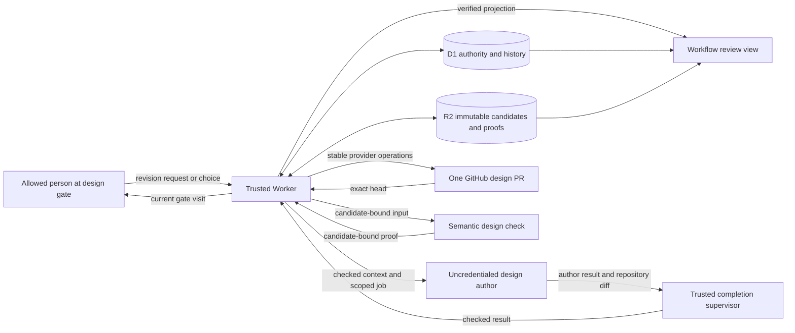

## Context

See `proposal.md` for motivation. The current Design phase starts from a
hash-checked planning merge. It gives an uncredentialed author the approved
proposal, every approved delta spec, repository guidance, and no prior design
on the first round.

The existing fixed flow accepts only `design.md` from that author. This change
must preserve that first-round rule. It may broaden a later round only after an
allowed person requests a plan correction at the active design gate.

The trusted Worker owns candidate validation, durable evidence, publication,
gate state, and merge verification. D1 is authoritative for workflow state.
R2 holds immutable candidate and proof payloads. GitHub holds the design pull
request, while the portal presents hash-checked D1 and R2 history.

All multi-row authority changes use one guarded D1 batch.
[Cloudflare's D1 batch documentation](https://developers.cloudflare.com/d1/worker-api/d1-database/#batch) states that a failed statement rolls back the batch.

## Goals / Non-Goals

**Goals:**

- Add a new immutable flow version whose first design round changes only the
  design.
- Let a trusted, human-authorized revision update the proposal, complete delta
  spec set, and design on the existing design pull request.
- Validate and identify the full plan and design as one candidate before any
  provider write.
- Bind semantic review, human choice, publication, and merge proof to exact
  candidate hashes and the pull request head.
- Preserve every approved and unmerged plan version, choice, and proof in
  chronological history.
- Give the portal enough immutable data to show exact plan edits and current or
  stale coverage.

**Non-Goals:**

- No author receives GitHub, Linear, merge, or approval capability.
- This design does not permit edits to change settings, tasks, application
  code, canonical specs, archives, or another OpenSpec change.
- Existing runs do not adopt the new graph, prompt, guidance, or file scope.
- The workflow does not infer plan-edit authority from arbitrary comments,
  agent output, review results, or an earlier approval.

## Component Diagram



The author can read only the service-authored context and write repository
files allowed by its job. The supervisor and Worker independently enforce the
same saved policy. Only the Worker can read or write provider state.

## Decisions

### 1. Introduce fixed flow version 18

Register the behavior as the next immutable `simple-traceability` definition,
version 18. Its snapshot includes the graph, node job policies, gate rules,
author prompts, pinned guidance, validation rules, and review schedule.

Every run continues to load and verify its saved definition digest. Version 17
and older runs therefore retain design-only author scope. A retry also retains
the run's version unless a separately specified compatibility handoff permits
another exact definition.

Version 18 uses these Design-phase paths:

```text
design_author
  -> validate_design_candidate
  -> publish_design_candidate
  -> due_design_checks
  -> design_review_gate

design_review_gate --human changes requested--> design_revision_author
design_revision_author
  -> validate_design_candidate
  -> publish_design_candidate
  -> due_design_checks
  -> design_review_gate

design_review_gate --human approval--> merge_design_candidate
merge_design_candidate --verified--> done
```

The revision edge stays inside Design and reuses the deterministic design
branch and pull request. The saved review schedule decides whether a later
revision runs a new semantic check.

Alternative considered: mutate version 17 in place. That would change active
runs after allocation and violate frozen-definition replay, so it is rejected.

### 2. Make plan-edit scope an explicit trusted grant

The Worker constructs each author job from the run definition and current gate
history. It never derives scope from author text.

An initial `design_author` job has this write set:

```text
openspec/changes/<change>/design.md
```

A `design_revision_author` job receives a plan-edit grant only when all of the
following are true:

1. The saved version supports design-time plan edits.
2. The active Design gate recorded a revision request from an allowed user.
3. That request belongs to the same run, design pull request, and gate visit.
4. The service-authored context includes the bounded request and current draft.

With that grant, the write set becomes:

```text
openspec/changes/<change>/proposal.md
openspec/changes/<change>/specs/**/spec.md
openspec/changes/<change>/design.md
```

The change's `.openspec.yaml` remains read-only. The grant permits additions
and removals inside `specs/` only when the resulting proposal and complete spec
inventory agree. Without the grant, proposal and spec bytes must match the last
published design candidate, or the approved plan on the first round.

The prompt states that the saved job policy controls scope. Pinned skill text
is advisory and cannot add, remove, or narrow allowed paths.

Alternative considered: always allow plan edits in version 18. That would let
the first author silently replace an approved plan without the required human
request, so it is rejected.

### 3. Assemble and validate one complete candidate

The supervisor reads the checkout diff after the author returns. It first
checks path scope against the exact job grant. It then overlays allowed author
outputs on the last published candidate, or on the approved plan for round one.
This produces a complete draft inventory rather than a partial patch.

The inventory contains:

- the approved, unchanged `.openspec.yaml` used for validation;
- exactly one proposal;
- every draft delta spec declared by the proposal's capability list; and
- exactly one design.

Validation runs in this order:

1. Reject every changed path outside the grant.
2. Require the proposal, design, and complete declared delta spec set.
3. Reject undeclared spec paths and missing declared spec paths.
4. Run strict OpenSpec validation for the named change.
5. Run clean-whitespace and repository readability checks.
6. Scan every candidate file and generated plan diff for credentials before
   either can enter durable candidate storage.
7. Require the design sections for component diagram, event flow, minimal data
   model, and failure modes.
8. Recompute every byte count and SHA-256 value.

The Worker repeats the same inventory, scope, strict OpenSpec, whitespace,
readability, credential, and required-section checks. Credential diagnostics
name the file and scanner rule but redact matched secret material. A scan failure
preserves the original scanner cause and blocks R2 writes and publication. A
supervisor and Worker disagreement is a failed candidate, not an author repair
or a partial publication.

The plan hash is SHA-256 over UTF-8 canonical JSON containing a lexicographically
sorted array of `{path, byteSize, sha256}` for `proposal.md` and every delta
spec. The design hash is the SHA-256 of the exact `design.md` bytes. Candidate
identity hashes this tuple:

```text
run_id, round, approved_plan_hash, plan_hash, design_hash, base_commit,
definition_digest, guidance_manifest_hash
```

The trusted service also computes a unified text diff from the approved plan to
the candidate plan. It records every added, removed, and changed plan path. An
empty diff is stored explicitly as `uses_approved_plan`.

Alternative considered: hash one combined archive. Separate plan and design
hashes are needed to explain approval coverage and stale proof, so one opaque
hash is rejected.

### 4. Store before publishing, then bind proof to the published head

Only a candidate that passed the Worker's credential scan reaches storage.
The Worker writes its manifest, file payloads, plan diff, and validation receipt
to create-only R2 keys. It reads each object back and verifies its SHA-256 before
inserting the candidate index in D1.

Only an indexed candidate may be published. Publication uses a stable operation
identity derived from the run and candidate. It creates or updates the existing
deterministic design branch and pull request with the complete candidate in one
commit. It never deletes unchanged approved plan files.

The Worker then reads the pull request's exact head tree through trusted GitHub
reads. It compares every candidate file's bytes with the R2 manifest. It also
compares the complete base-to-head changed-path inventory with the expected
candidate diff: `design.md` plus only proposal and spec paths whose candidate
bytes differ from the trusted base. `.openspec.yaml` must match the base. Any
extra, missing, or mismatched path rejects publication and keeps the gate closed.

Only after that proof passes does the Worker store the pull request number,
base, exact head, and verified tree digest as a publication record. A due design
check receives one immutable bundle:

- approved plan manifest and hash;
- candidate plan manifest, contents, and hash;
- candidate design and hash;
- candidate identifier;
- pull request number, base, and head; and
- saved review rules and guidance.

The accepted check result must echo those identities. Trusted code rejects a
result with any mismatch. Proof is current only while all named identities
match the latest publication.

When the saved schedule omits a new semantic check after a later human edit,
the Worker records `semantic_check_not_scheduled` for that round. It marks all
older proof stale and presents the trusted checks to the person. It never
labels an older check as coverage for the new candidate.

Alternative considered: review a live pull request checkout. The head could
move between reads and mix candidate versions, so checks use immutable R2 input
instead.

### 5. Bind each human choice and merge to the full candidate

The Worker opens a new visit-scoped Design gate only after publication and all
due checks complete. The visit binds:

```text
run_id, visit_sequence, candidate_id, approved_plan_hash, plan_hash,
design_hash, pull_request_number, base, head
```

Only a signed event from an allowed `actor.type == user` may record the choice.
Approval covers the whole plan and design at that head. A prior planning choice,
agent result, check, comment, or approval for another head has no authority.

Any new publication makes the prior gate visit and its choice stale. The old
records remain append-only. A new visit is required even if the resulting file
contents happen to match an earlier candidate, because the exact head changed.

Before merge, the trusted action compares the open visit, pull request, exact
head, verified publication tree, candidate hashes, and approval again. One
guarded D1 batch then creates a pending merge operation with a stable operation
ID derived from the run, gate visit, candidate, and approved head. The pending
row is durable before the GitHub merge request.

After requesting merge, the Worker reads back the pull request and merge commit.
It verifies that GitHub merged the approved head. It compares the complete
trusted-base-to-merge changed-path inventory with the expected candidate diff,
checks every candidate file byte, rejects every extra path, and checks required
branch reachability under the existing merge-proof contract.

A guarded D1 batch marks the operation complete, appends the merge proof, and
updates current pointers to the plan version, design, and choice. If that batch
fails after GitHub merged, a retry finds the pending operation and reconciles
before issuing any provider request. It verifies the already-merged approved
head and complete merge tree, then idempotently completes the same D1 batch. A
different or unprovable merged head enters repair and leaves the prior approved
set current in D1.

Earlier pointers, choices, candidates, visits, operations, and proofs remain in
history. A failed or canceled revision never changes the current approved set.

Alternative considered: update the approved plan when the candidate reaches
the gate. That would make unmerged or rejected text current, so approval state
changes only after verified merge.

### 6. Derive the workflow view from immutable candidate history

The review endpoint loads D1 indexes and hash-checks referenced R2 objects. For
each design round it shows:

- the prior approved plan hash and candidate plan hash;
- `uses approved plan` or every changed path with its unified text diff;
- the design pull request and exact published head;
- each semantic check and the exact plan, design, base, and head it covered;
- whether a check or choice is current, stale, or not scheduled;
- the allowed actor and choice for each gate visit; and
- the checked merge proof that made a version current.

Current status is computed by exact identity equality, not by timestamps or
display labels. History is ordered by durable visit sequence, round, and stored
event time. The portal does not generate proof or fetch untrusted candidate
content during page load.

Alternative considered: show only the GitHub diff. GitHub is the publication
surface, not durable workflow authority, and cannot explain earlier choices or
proof coverage by itself.

## Event Flow

### Initial design round

1. Planning merge verification freezes the approved plan manifest and base
   commit.
2. Version 18 dispatches `design_author` with design-only scope and no prior
   design.
3. The author writes `design.md`; the supervisor checks the design-only diff.
4. The Worker builds the complete candidate with unchanged approved plan bytes,
   repeats validation, and stores hash-checked R2 evidence plus a D1 index.
5. The Worker publishes the candidate to the deterministic design pull request
   and reads back its exact head.
6. Every due semantic check reads that immutable candidate and returns
   identity-bound proof.
7. The Worker opens a Design gate visit for the exact candidate and head.

### Human-requested revision

1. An allowed person requests changes on the active Design gate.
2. The Worker records the request and starts `design_revision_author` on the
   same branch and pull request with the explicit plan-edit grant.
3. The author receives the approved plan, current complete candidate, design,
   bounded feedback, and saved guidance.
4. The supervisor and Worker validate the returned complete plan and design.
5. The Worker stores a new immutable candidate and updates the same pull request
   in one commit.
6. Old checks and choices become stale. Due checks run for the new exact head,
   or the round records that no semantic check was scheduled.
7. The Worker posts idempotent replies to affected root review threads without
   resolving them, then opens a fresh Design gate visit.

### Approval and merge

1. An allowed user approves the current gate visit.
2. The trusted action rechecks the visit and exact pull request head.
3. A guarded D1 batch records a stable pending merge operation.
4. The Worker requests merge, or reconciles an earlier request with that same
   operation identity.
5. It reads back the merge commit, checks the full changed-path inventory, and
   verifies all candidate file bytes and branch reachability.
6. A guarded D1 batch completes the operation, appends merge proof, and makes
   the plan, design, and choice current.
7. The workflow view shows the new current approval and retains all earlier
   plan versions and choices in order.

## Minimal Data Model

The names below are logical. Existing tables may be extended when they already
own the same lifecycle.

| Record | Minimal fields and purpose |
| --- | --- |
| `workflow_definitions` | `version`, `digest`, graph, job policies, review schedule, prompt hash, guidance hash; immutable after registration. |
| `plan_versions` | `plan_hash`, manifest R2 key, proposal and spec count, parent approved plan hash, created time; content-addressed and immutable. |
| `plan_version_files` | `plan_hash`, `path`, `byte_size`, `sha256`, content R2 key; unique by plan and path. |
| `design_candidates` | `candidate_id`, `run_id`, `round`, `approved_plan_hash`, `plan_hash`, `design_hash`, `base_commit`, definition and guidance hashes, candidate and validation R2 keys, author attempt; immutable. |
| `design_publications` | `candidate_id`, stable provider operation id, pull request number, base, head, published time; one accepted exact-head record per publication. |
| `design_review_results` | `candidate_id`, review kind, plan and design hashes, base, head, result R2 key, status, accepted time; immutable proof identity. |
| `design_gate_visits` | Globally unique `gate_visit_id`, `run_id`, `visit_sequence`, `candidate_id`, pull request number, base, head, plan and design hashes, opened and superseded times. |
| `design_gate_choices` | Globally unique `choice_id`, `gate_visit_id`, actor id and type, choice, signed delivery id, candidate and head, recorded time; append-only. |
| `design_merge_operations` | Stable `operation_id`, `gate_visit_id`, `choice_id`, `candidate_id`, approved head, state, provider request receipt, merge commit, attempt and timestamps; supports post-effect reconciliation. |
| `design_merge_proofs` | `operation_id`, `candidate_id`, `choice_id`, approved head, merge commit, verified full-diff manifest, verification time and outcome. |
| `runs` | Current plan hash, design hash, choice id, node, visit sequence, and frozen definition digest; pointers update only after verified merge. |

Candidate manifests in R2 include the exact plan diff or the explicit
`uses_approved_plan` marker. D1 stores only bounded indexes and authority fields;
large file contents, diffs, and review payloads remain hash-addressed in R2.

Required uniqueness guards include candidate identity, publication operation,
`gate_visit_id`, `(run_id, visit_sequence)`, `choice_id`, signed delivery id,
merge operation identity, and one successful merge proof per candidate. A
choice references `design_gate_visits(gate_visit_id)`. A merge operation and
proof reference exact `choice_id`, `gate_visit_id`, and `candidate_id` rows.
These enforced foreign keys prevent cross-run visit collisions and dangling
choice or proof references.

## Failure Modes

| Failure | Trusted response |
| --- | --- |
| Author changes a forbidden path | Reject the entire result before candidate storage. Record the path and saved grant. Publish nothing. |
| First round changes the proposal or specs | Reject as a scope violation even if strict OpenSpec validation passes. |
| Revision lacks an allowed-user grant | Keep design-only scope and reject any plan edit. An arbitrary comment cannot create authority. |
| Proposal and spec paths disagree | Reject the complete candidate, preserve strict validation output, and do not open review. |
| Required plan or design file is missing | Reject before hashing or publication and identify every missing path. |
| Strict OpenSpec, whitespace, readability, or section check fails | Preserve the original command, message, stack or cause, and check context. Use only the existing bounded author-correctable hook. |
| Credential scan fails | Record the file and scanner rule with secret text redacted. Store no candidate payload or diff and publish nothing. |
| Supervisor and Worker checks disagree | Store `author_completion_verification_mismatch` with both receipts and follow the saved failure edge. |
| R2 create-only write collides | Read the existing object and accept it only when identity and checksum match. Otherwise fail with both keys and hashes. |
| R2 read-back or checksum fails | Do not index or publish the candidate. Retain the storage error as the primary cause. |
| GitHub publication has an ambiguous result | Reconcile by stable operation identity and expected head before retrying. Never create a second design pull request. |
| Published head has an extra, missing, or mismatched path | Reject its publication proof and keep review and the gate closed. Never review only the R2 subset under that head. |
| Pull request head changes after publication | Mark review proof and the gate visit stale. Recheck the full exact-head tree and require a checked candidate publication and fresh visit. |
| Review result mixes plan, design, base, or head identities | Reject the proof and keep the gate closed. Do not consume it as a semantic result. |
| A later round has no scheduled semantic check | Record that fact, show prior proof as stale, and require a fresh human choice after trusted checks. |
| Non-user or disallowed user sends a gate event | Audit the event without changing the visit or approval state. |
| Duplicate signed event or Workflow replay arrives | Reuse the existing delivery, traversal, candidate, or choice record without advancing state. |
| Merge precondition no longer matches | Do not request merge. Supersede the visit and require a current checked head. |
| GitHub merges but the final D1 batch fails | Keep the pending merge operation. On retry, verify the already-merged approved head and full tree, then complete authority state without another merge request. |
| Merge read-back, full path inventory, or file proof mismatches | Keep the prior approved set current, store the original provider and verification evidence, and enter repair. |
| Portal cannot verify an R2 object | Show bounded unavailable evidence and its checksum failure. Never present unverified content as current proof. |
| Cleanup or diagnostic storage also fails | Preserve the primary failure and attach cleanup failure as a secondary cause. |

## Risks / Trade-offs

- **[More immutable objects and rows per revision]** → Keep D1 rows bounded and
  place full content in content-addressed R2 objects.
- **[A small plan edit requires approval of the whole plan]** → Show exact text
  changes beside the approved version while retaining one unambiguous approval
  unit.
- **[No semantic rerun on some later edits can reduce automated assurance]** →
  State that no check ran, mark old proof stale, retain trusted validation, and
  require an exact-head human choice.
- **[Provider head drift can invalidate completed work]** → Bind every stage to
  the exact head and reconcile stable publication operations before proceeding.
- **[Version 18 duplicates some version 17 configuration]** → Prefer immutable
  snapshots and deterministic replay over mutable shared policy.
- **[Unified diffs may expose sensitive text already present in plan files]** →
  Serve them only through the existing Access-protected, no-store review route
  and apply existing credential scanning before storage.

## Migration Plan

1. Add backward-compatible D1 tables or nullable columns, uniqueness guards,
   and indexes. Do not rewrite historical candidates, visits, or choices.
2. Extend trusted candidate serialization, validation, R2 read-back, publication,
   merge proof, and portal projection to understand plan-bearing design
   candidates while retaining the version 17 shape.
3. Register immutable `simple-traceability` version 18 with the new graph,
   prompts, scopes, checks, gate rules, and pinned guidance.
4. Validate version 17 restoration and retry behavior before selecting version
   18 for new runs.
5. Exercise a design-only first round, an unchanged revision, a plan-changing
   revision, a stale-head case, an unscheduled-review case, and a checked merge
   in a non-production workflow route.
6. Make version 18 the default only after durable records and the protected
   workflow view show the expected candidate, diff, choice, and merge history.

Rollback changes only the default selector for future runs. Existing version 18
runs keep their saved snapshot and may finish under it. Schema and immutable
history remain in place so rollback cannot orphan or reinterpret prior evidence.
