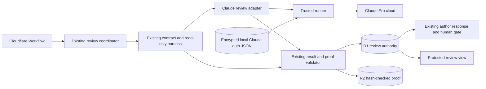

## Context

See `proposal.md` for the reason for this change. The current external plan and design review path already has the controls this change needs: a frozen workflow definition, exact review input and head, a read-only review harness, a trusted runner, D1 authority, R2 proof, bounded retries, author responses, and human gates.

This design changes only the external reviewer route for new workflow versions. It replaces the OpenRouter adapter with a Claude adapter fixed to Opus 5 and `high` effort. Existing OpenRouter runs keep their frozen adapter and labels.

The approved plan requires the trusted runner to use the user's existing local Claude auth JSON. A review comment proposes passing a long-lived setup token through `CLAUDE_CODE_OAUTH_TOKEN`. That is not adopted here because it would change the approved auth contract. Before implementation, the primary Claude client contract must be checked to establish the supported Pro sign-in input, model and effort controls, result metadata, and auth and plan-limit errors. If the approved local auth JSON cannot drive the Pro route, planning must be revised before code is written.

## Goals / Non-Goals

**Goals:**

- Reuse the current external review pipeline and change only its provider adapter and recorded provider facts.
- Fix every new outside plan and design review to Claude Opus 5, `high` effort, Claude Pro, and no fallback.
- Keep auth inside the trusted runner and keep it out of the review Sandbox, prompts, results, and proof.
- Preserve the current review contract, retry and stop rules, author response, and human approval gates.
- Prove the real deployed Claude path without exposing auth or paid API credentials.

**Non-Goals:**

- No new review orchestrator, canary subsystem, account-management UI, or billing manager.
- No change to Codex author or self-check work.
- No migration of an active or historical OpenRouter run.
- No assumption about undocumented Claude flags, token lifetime, error text, or receipt fields.

## Component diagram

The coordinator, harness, validator, proof stores, and gate path remain the same. The new Claude adapter translates the existing review request into the confirmed Claude client contract and normalizes the response back into the existing review result. The trusted runner is the only component that can read Claude auth or contact Claude.

## Decisions

### Replace only the external provider adapter

Add one Claude adapter behind the current attempt-scoped model channel. The coordinator continues to build the same plan or design inventory, prompt, read-only tools, output schema, exact-head binding, stale checks, direction isolation, round counters, and retry identity. The adapter accepts no model, effort, provider, billing, or fallback override from the Sandbox.

The immutable workflow definition for a new run supplies this fixed profile:

- provider: `claude`
- model: the primary contract's exact Opus 5 selector
- effort: `high`
- route: `claude_pro`
- fallback: `none`

The exact model selector is confirmed during contract discovery rather than guessed in the design. The definition digest and profile are frozen with the run using the existing workflow-version mechanism. New Claude runs ignore the old OpenRouter model setting. Frozen OpenRouter runs continue to use their saved profile.

Rebuilding review orchestration was considered and rejected. The approved change keeps the review behavior unchanged, and the current coordinator already supplies the required isolation, retries, stale checks, and human gates.

### Keep the approved local-auth-JSON boundary

Use the existing trusted auth pattern: keep the user's local Claude auth JSON encrypted at rest, check it out only to the trusted runner for one attempt, and remove the attempt-local material during normal cleanup. The review Sandbox receives only its scoped model capability. It never receives the auth JSON, a token copied from it, an Anthropic API key, or an OpenRouter key.

The runner starts the Claude client with a minimal environment and blocks Anthropic API keys, OpenRouter keys, alternate API base URLs, and provider overrides. This prevents an ambient credential from changing the Pro route into paid API use. Missing, expired, revoked, invalid, or wrong-account auth becomes `auth_failure` and cannot produce accepted review proof.

The suggested `CLAUDE_CODE_OAUTH_TOKEN` setup-token route was considered but is not selected by this design. The approved proposal and specs require existing local Claude auth JSON, and the checked inputs do not establish that an environment token has the same custody, account, expiry, or billing behavior. Contract discovery must explicitly test the approved route. If the service requires a setup token instead, that is a planning change, not an adapter detail.

### Confirm provider facts before accepting a review

Before adapter implementation, run the real Claude client with the set Pro account in a safe test resource. Confirm:

- the exact Opus 5 selector and `high` effort control;
- that the approved local auth JSON uses the Claude Pro route without an API key or browser prompt;
- which response or trusted client facts identify model, effort, route, account, completion, and terminal result;
- how auth failure and plan-limit failure are distinguished; and
- whether an interrupted invocation can be looked up without starting more model work.

The adapter normalizes only observed, trustworthy facts. Config values alone do not prove the route. Acceptance compares the observed model, effort, Pro route, review input digest, exact head, and valid result with the run's frozen profile. If the client cannot provide enough facts to prove the required route and result, implementation stops and the plan returns for revision.

Mocks may reproduce an observed contract for tests, but they do not prove provider behavior. Guessing the wire contract from fake payloads was considered and rejected.

### Reuse current idempotency, proof, and cleanup

Use the existing review attempt and Workflow replay identities. Exactly one provider invocation may be associated with an attempt. A replay reuses the durable result and must not start another call. An allowed retry receives a new existing attempt identity and remains subject to current retry and stop limits.

The validator writes the normalized provider receipt, semantic review result, validation record, and input binding through the existing create-only R2 proof path, reads the manifest back by hash, and records the accepted pointer in D1 only after the current Sandbox and auth cleanup checks pass. An interrupted call with no trustworthy completion record fails closed. It may be reconciled only if contract discovery confirms a lookup bound to that invocation; otherwise it consumes the attempt and any later call must be an allowed retry.

Adding a second claim, keyring, cleanup service, and release database was considered and rejected. The checked architecture already has durable attempt identity, encrypted auth checkout, create-only proof, hash read-back, cleanup reconciliation, immutable workflow definitions, and route controls.

### Keep presentation and gate authority unchanged

A structurally valid Claude review completes the outside review stage even when it reports concerns. Concerns remain advice. The existing author-response step records dispositions, and only the existing user action can approve a human gate.

Internal proof stores the model, effort, Claude Pro route, input binding, and result. A passed review page continues to show the semantic review content needed by people but does not show internal provider execution facts. A failed or stopped review page shows only the safe cause: `auth_failure`, `plan_limit`, or `review_failure`. It shows no auth data, raw provider response, or partial review output.

Settings shows Claude Opus 5 and high effort as fixed for the new workflow version and removes the OpenRouter model selector from new external review configuration. Historical proof keeps its original provider label.

### Treat a plan limit as a stop, not a transient retry

When the confirmed Claude contract reports that the Pro plan limit is reached, normalize it to `plan_limit`. Do not fall back and do not schedule an immediate automatic retry. If the provider gives a trustworthy reset or retry-after time, save it as `retry_not_before` and reject retry allocation before it. If no trustworthy time exists, only the existing operator-triggered stage retry may try again after capacity is expected to return. Every retry still uses the same frozen Claude profile and current attempt limits.

Treating quota exhaustion like a network error was considered and rejected because it could consume more attempts without available plan capacity.

## Event flow

1. A new run selects the released Claude workflow version. The current allocator freezes its definition digest and the fixed Claude review profile. An older run keeps its OpenRouter profile.
2. At an outside plan or design review node, the current coordinator loads D1 authority and builds the unchanged exact-input, exact-head review contract.
3. The current attempt allocator creates one direction-specific review attempt and a fresh read-only Sandbox. The Sandbox receives an attempt-scoped model capability, not provider auth.
4. The Claude adapter asks the trusted runner to start the confirmed Claude client contract. The runner checks out the encrypted local auth JSON into attempt-local storage and starts with a minimal environment that rejects paid API and provider overrides.
5. Claude runs Opus 5 with high effort through the Pro account. The adapter normalizes the observed provider facts and existing semantic result shape.
6. The existing validator checks the fixed profile, input digest, head, result schema, stale rules, proof rules, and secret scan. It writes and hash-reads the R2 proof.
7. Existing cleanup removes the Sandbox and attempt-local auth. Only after cleanup and proof checks pass does D1 point to the accepted review.
8. The current author-response and human-gate path continues unchanged. A concern cannot approve the gate.
9. Auth, plan-limit, invocation, result, proof, stale, or cleanup failure leaves no accepted review. A retry can start only through the current retry rules, with a new attempt and the same frozen Claude profile.

## Minimal data model

Use existing records and names where possible. Add only fields that the current schema does not already hold.

| Record | Minimum data | Rule |
| --- | --- | --- |
| Frozen run review profile | definition digest, provider, model, effort, route, fallback | Immutable for the run. New Claude runs ignore the old OpenRouter setting. |
| Review attempt | attempt ID, run, stage, round, direction, input digest, head, status, safe stop cause, optional `retry_not_before` | Existing replay and retry rules apply. No accepted result for a stopped or failed attempt. |
| Provider receipt | attempt ID, observed model, effort, route, terminal result, provider completion ID when available | Built from confirmed provider facts, not configuration alone. Contains no auth or raw account identity. |
| Review proof | normalized receipt, semantic result, validation record, input binding, hashes | Stored through the existing create-only R2 manifest and hash read-back. |
| Auth checkout | existing encrypted object version, attempt owner, lease and cleanup state | Trusted-runner only. Stores no decrypted auth value in D1 or proof. |

No separate canary authorization, promotion record, account-fingerprint table, or new proof store is required. The existing immutable definition, route revision, attempt, cleanup, D1, and R2 records remain authoritative.

## Failure modes

| Failure | Durable result | Behavior |
| --- | --- | --- |
| Local auth JSON is missing, expired, revoked, invalid, or for the wrong account | `auth_failure` | No accepted proof or gate. Retry only through current rules. |
| An Anthropic API key, OpenRouter key, alternate endpoint, or provider override is present | `review_failure` before provider contact | Reject the attempt; do not use paid or fallback service. |
| Claude reports a Pro plan limit with a trustworthy reset time | `plan_limit` with `retry_not_before` | No gate, fallback, automatic retry, or retry before the saved time. |
| Claude reports a Pro plan limit without a trustworthy reset time | `plan_limit` | No polling or automatic retry. A later operator-triggered retry may use current rules. |
| The client cannot prove model, effort, route, account, or terminal result | `review_failure` | Do not accept configured values as proof. Return planning for revision if this is a contract limitation. |
| Provider call, tool loop, or result validation fails | `review_failure` | Show only the safe failure class; preserve no partial accepted review. |
| Result input or head is stale | Existing stale result | Rebuild only through the current flow. |
| R2 write/read-back, D1 update, secret scan, or cleanup check fails | `review_failure` | Leave no accepted D1 pointer and do not enter the gate. |
| Workflow replays an attempt | Existing attempt result is reused | Never start a second provider call for the same attempt. |
| Invocation outcome is ambiguous after interruption | `review_failure` unless confirmed lookup recovers the same call | Consume the attempt; only an allowed new retry may call again. |
| A frozen OpenRouter run resumes | Existing saved provider path | Do not migrate or relabel it. |
| Claude returns valid concerns | Accepted semantic review with concerns | Continue to author response and the unchanged human gate; do not auto-approve. |

## Risks / Trade-offs

- [The approved local auth JSON may not support the required non-interactive Pro route] → Verify the primary client contract first and revise planning if it instead requires a setup token.
- [The provider may not expose trustworthy model, effort, route, or account facts] → Fail closed rather than claim unproved billing or model behavior.
- [Ambient credentials could select paid API billing] → Start from a minimal runner environment and reject API keys, alternate endpoints, and overrides before contact.
- [A call may finish while the runner loses its response] → Reconcile only through a confirmed same-invocation lookup; otherwise consume the attempt and use the existing retry path.
- [A plan limit may last longer than the workflow retry window] → Do not retry automatically; enforce a trustworthy reset time or require the existing operator-triggered retry.
- [Old and new provider records coexist] → Select the adapter from the frozen workflow definition and preserve the original provider label in historical proof.

## Migration Plan

1. Inspect the primary Claude client contract with the set Pro account. Confirm the approved local auth JSON path, exact Opus 5 selector, high-effort control, safe provider facts, and auth and plan-limit signals. Explicitly test whether the setup-token environment route proposed in review is distinct; do not substitute it without an approved planning revision.
2. Add the thin Claude adapter behind the current model channel. Reuse the current coordinator, attempt allocation, review contract, validator, D1/R2 proof, cleanup, retry, and gate code.
3. Add deterministic tests based on the observed contract for plan and design review, exact profile enforcement, ambient-key rejection, expired auth, plan limits with and without reset time, bad or stale results, replay, cleanup failure, old frozen runs, and no fallback.
4. Update Settings for the new workflow version to show the fixed Claude setup and remove the OpenRouter selector. Keep historical data readable.
5. Deploy and register the immutable Claude workflow version without moving active runs. Use the existing route controls to select it for a dedicated test run.
6. Trigger a real review through normal signed Linear ingress, Queue dispatch, and the deployed Workflow. Capture D1 and hash-checked R2 read-back plus sanitized provider-setup and resulting-state screenshots. A mock or direct Worker request is only synthetic proof and does not complete this step.
7. Make the new definition the default only after the real review proves the exact input, Opus 5, high effort, Claude Pro route, valid result, and cleanup. If proof fails, keep the prior definition as the default.

Rollback changes the default for later runs back to the prior immutable workflow definition. It does not reroute an active Claude attempt or rewrite completed proof. A frozen Claude run either completes under its saved definition or stops under the existing failure and retry rules; it never falls back to OpenRouter or paid API use.
