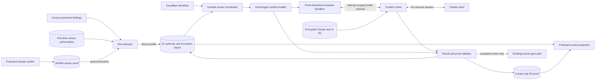

## Context

See `proposal.md` for the reason for this change. Today, each outside review runs in a fresh, read-only Sandbox. Its model route is frozen with the run. D1 holds run and review authority. R2 holds hash-checked evidence. A valid review can advise the author, but only a later human action can approve a gate.

This change crosses the workflow definition, review dispatch, trusted runner, auth storage, proof, and protected views. The checked inputs do not contain the Claude client contract. Before adapter work starts, implementation must inspect that primary contract with the set Pro account. It must confirm the model selector, effort control, auth behavior, stable account subject, result facts, lookup support, and auth and plan-limit errors. Tests may copy observed contracts. They may not invent them.

## Goals / Non-Goals

**Goals:**

- Freeze Claude Opus 5, `high` effort, the Claude Pro route, and the allowed Pro account for each new run.
- Keep the current plan and design review inputs, prompt, tools, output, directional isolation, rounds, retries, stop rules, author replies, and human gates.
- Keep Claude auth in the trusted runner and remove decrypted auth after every terminal or abandoned attempt.
- Prevent ambient keys, automatic replay, and paid fallback.
- Bind safe proof to the exact input, account, model, effort, route, and result.
- Keep old frozen runs and OpenRouter evidence unchanged.

**Non-Goals:**

- This design does not change Codex author or self-check work.
- It does not add sign-in, billing, or quota management to Settings.
- It does not grant gate authority to review output.
- It does not choose undocumented Claude flags, wire fields, error text, or lookup calls.

## Component diagram

Settings shows the fixed setup and no OpenRouter model control for the new flow. The allocator owns the immutable profile. Each Sandbox keeps one direction's review context and read-only tools. The trusted runner owns auth and provider calls. Only the validator may accept provider output.

## Decisions

### Confirm the provider contract before adapter work

The adapter maps durable DEOS values to values observed in the primary Claude client contract. Discovery must prove that the real Pro route exposes a stable account subject and trustworthy model, effort, route, and terminal facts. It must also determine whether a started invocation can be looked up without starting more model work. If any required acceptance fact cannot be proved, implementation stops and the plan returns for revision.

Inferring fields from a mock was considered. It was rejected because local output cannot prove the provider route or account.

### Freeze a typed profile and versioned account binding

The new workflow definition supplies this logical profile:

- provider: `claude`
- model: `claude-opus-5`
- effort: `high`
- billing route: `claude_pro`
- fallback: `none`
- allowed account: `allowed_account_fingerprint`
- fingerprint scheme: `hmac-sha256-v1`
- fingerprint key version: an immutable trusted key ID

Trusted provisioning applies the named HMAC scheme, with the selected runner-only key version, to the provider's stable account subject. It stores no email or raw account ID. The fingerprint, scheme, and key version are frozen with the run. The runner derives each observed fingerprint with that same key version. Acceptance requires an exact match.

Key rotation creates a new key version and allowed fingerprint for later definitions. It never replaces a key used by a frozen run. The trusted keyring retains each verification key through the active-run and audit retention period. Old proof stays readable from saved fingerprints.

New Claude runs ignore a stored OpenRouter model choice. Existing runs keep their saved profile and definition. Keeping a mutable selector was considered, but it would weaken the fixed route and frozen-run rules.

### Keep the review harness and isolate each direction

Plan and design contract builders remain unchanged. They still select the exact files, head, service context, prompt, read-only tools, output schema, stale checks, and proof rules. Each directional pass gets its own Sandbox, model capability, home, client config, conversation ID, auth checkout, and invocation claim. Resume, history import, and session reuse are disabled.

The second pass cannot read the first pass's output, transcript, session ID, temporary state, or proof. Both may use the same encrypted auth source, but their decrypted paths and cleanup records differ. The model channel accepts no provider, model, effort, account, or billing override.

Sharing one Claude conversation was considered. It was rejected because the second directional review must not see the first result.

### Broker auth in a sanitized runner process

Claude auth follows the protected Codex pattern. The local auth JSON is an encrypted, conditionally replaced R2 object. Each attempt gets a D1 checkout for one object version. Only the trusted runner decrypts it into a runner-owned, attempt-only namespace.

Before decryption, the checkout saves an addressable execution owner: Sandbox ID, runner instance ID, process-handle slot, and auth namespace ID. Its path is derived inside that namespace. The checkout also has a lease, expiry, and heartbeat. A `finally` path kills the exact process, removes the whole namespace, and marks cleanup `destroyed` on success, failure, timeout, and cancellation.

A trusted reconciler handles crashes and lost heartbeats. It uses the saved owner IDs to stop the exact runner or container and remove its auth namespace. Cleanup becomes `destroyed` only after the container API reads the owner as absent or destroyed and a cleanup receipt names the same Sandbox, runner, and namespace. If the owner still exists, reconciliation keeps trying within current cleanup limits. No retry or replay that invokes Claude starts before both Sandbox and auth cleanup are `destroyed`.

The Claude subprocess environment is built from an empty allowlist. It contains only inert runtime values, a new attempt-only home and config directory, and the local auth path. A pre-exec guard rejects Anthropic or OpenRouter API keys, API base URLs, inherited user config, and provider overrides in the environment, arguments, or client config. It runs before any provider byte is sent. Old OpenRouter credentials may remain available to old adapters, but a Claude subprocess never inherits them.

A concurrent auth refresh uses the source ETag as a compare-and-swap guard. Passing auth into the Sandbox or using an API key was considered. Both were rejected because they widen secret access and could use paid API billing.

### Claim before calling and fail closed on ambiguity

Before a provider call, D1 creates one invocation claim. Its stable key covers run, review stage, round, direction, retry ordinal, attempt ID, exact input digest, and head. The retry ordinal and attempt ID are allocated durably before the claim. An exact Workflow replay reuses that attempt and claim, while an allowed retry increments the ordinal, allocates a new attempt ID, and therefore gets a new claim. The guarded claim moves from `claimed` to `started` immediately before the call.

The adapter creates a normalized receipt from the real invocation. It binds the claim, attempt, input digest, observed account fingerprint, route, model, effort, completion ID, and terminal execution result. The exact source fields come from the confirmed provider contract. Configured values alone are not proof. The receipt moves the claim to `completed` before later acceptance work.

If a lease expires while a claim is `started` with no receipt, the invocation is `ambiguous`. Trusted code may reconcile it only through a provider lookup confirmed by the primary contract and bound to the same invocation ID. A confirmed result completes the same claim without another model call. If no lookup exists or it is inconclusive, the attempt stops as `review_failure`. The ambiguous call consumes that attempt and its retry budget. Only a new retry allowed by existing rules, after cleanup, may create a new claim.

Relying on process exit or automatically replaying the call was considered. Both were rejected because the provider may have accepted work before the crash.

### Store provider proof but expose only review content

Trusted validation compares account fingerprints and receipt facts with the frozen profile, exact input and head, existing result schema, stale rules, and secret scan. It writes the sanitized receipt, semantic result, and validation record to create-only R2 keys. It reads them back by SHA-256 and marks the attempt `validated_pending_cleanup`. The runner then destroys the Claude process, auth namespace, client state, and Sandbox. Trusted code reads both cleanup records back as `destroyed` and re-reads the exact R2 manifest for final integrity. Only then may one guarded D1 update point to accepted proof. A cleanup or final read-back failure records `review_failure` and leaves no accepted pointer.

D1 keeps account, model, effort, route, provider execution result, completion ID, receipt, and proof checks as internal facts. A passed review page hides those execution facts. It still shows semantic content people need: concerns, cited ranges, directional claims, author dispositions, exact-head freshness, and review history. The hidden provider result does not suppress human review content.

A failed or stopped page shows only `auth_failure`, `plan_limit`, or `review_failure`. It shows no raw provider text or partial semantic output. Settings may show the fixed setup, but not account identity, auth detail, provider replies, or API billing state.

One broad page payload was considered and rejected because proof and review content have different disclosure rules.

### Guard canary allocation and promotion

The Claude definition is first deployed and registered as non-default. A trusted operator creates one expiring D1 canary authorization. It binds one test Linear issue ID, project route revision and digest, repository, and exact definition digest. It is not shown in Settings.

Normal signed Linear ingress and Queue dispatch process the test event. The guarded run insert selects the non-default definition only if every field matches. It consumes the authorization and saves the run ID in the same transaction. An expiry, mismatch, replay, or second issue cannot select the unproved definition.

After the canary, a trusted release verifier creates one immutable release-proof record. It binds the definition digest, consumed authorization, canary run, accepted review and invocation claim, hash-checked D1 and R2 read-back, and sanitized Settings and review-state image hashes. Its status becomes `verified` only when every required item matches.

Promotion is a protected RouteAdmin operation for an allowed Access operator. Its transaction takes the expected route revision, definition digest, and release-proof ID. It checks that proof is `verified`, belongs to the same canary and definition, and has not been used. It then marks the definition selectable, advances the route control revision, consumes the proof for promotion, and writes an audit row atomically. Trusted code reads the route back and requires the new digest and revision before reporting success. A missing image, stale revision, changed digest, used proof, or failed read-back leaves the definition non-default.

Making the definition a normal choice before proof was considered, but it could expose an unproved flow. A direct request was rejected because it would not prove the deployed path.

### Keep gate and retry semantics

A valid Claude result completes outside review even when it has concerns. Concerns remain advice. Existing author response and human gates still follow. The review cannot approve a gate.

Auth, plan-limit, provider, result, proof, stale, or ambiguous failures create no accepted review. A retry follows current limits, counts an ambiguous call as a used attempt, uses the same frozen profile, and starts only after cleanup is proved. It never falls back to another model, provider, API key, or paid route.

## Event flow

1. A new run selects the Claude definition through the released default or an exact one-time canary authorization. The allocator freezes the definition digest, fixed profile, allowed fingerprint, scheme, and key version.
2. At a plan or design review node, the coordinator loads D1 authority and builds the unchanged contract with the exact input manifest and head.
3. The coordinator allocates one direction-specific attempt and retry ordinal. It saves the execution owner, opens a leased auth checkout, and creates a claim keyed by that attempt, ordinal, input, and head.
4. A fresh read-only Sandbox starts with a new client home, config, conversation, scoped model channel, and no history or provider credential. The second direction cannot see the first.
5. The runner builds the Claude environment from an empty allowlist. The pre-exec guard rejects ambient API credentials, endpoints, user config, and overrides before the claim moves to `started`.
6. The runner invokes Claude Opus 5 at high effort through the local account session. Heartbeats renew the lease. Tool work stays in the current read-only harness.
7. The adapter normalizes completion facts and the stable account subject. It writes the receipt against the claim, or leaves an expired `started` claim for fail-closed reconciliation.
8. Validation checks fingerprints, route facts, input, head, output schema, proof rules, and secret scan. Hash-checked R2 proof moves the attempt only to `validated_pending_cleanup`.
9. The runner removes the Claude process, auth namespace, client state, and Sandbox. Trusted cleanup reads both records back as `destroyed`, then re-reads the exact R2 manifest for final integrity.
10. Only a guarded D1 update after cleanup and final integrity may accept the review. Acceptance then follows the current author-response and human-gate path. Any stopped, failed, ambiguous, cleanup-unproved, or integrity-unproved review has no accepted pointer and cannot advance.
11. An allowed retry consumes the prior attempt budget, increments the retry ordinal, allocates a new attempt ID, and creates a new claim only after cleanup is `destroyed`.

## Minimal data model

The logical fields below may use existing repository naming, but their values and guards are required.

| Record | Required data | Constraint |
| --- | --- | --- |
| Frozen review profile | definition, provider, model, effort, billing route, fallback, allowed fingerprint, scheme, key version | Immutable. Old runs retain old values and keys. |
| Review attempt | attempt, run, stage, round, direction, retry ordinal, input, head, copied profile, observed fingerprint, status, safe cause, proof hashes | Acceptance requires `validated_pending_cleanup`, both cleanup records `destroyed`, and final manifest read-back. |
| Invocation claim | stable claim ID, retry ordinal, attempt, input and head, status, started time, provider request or completion ID, receipt hash, ambiguity cause | Exact replay reuses the claim. A retry has a new ordinal and attempt. Ambiguity consumes the attempt. |
| Auth checkout | attempt, encrypted object and ETag, Sandbox and runner IDs, process slot, namespace, lease and heartbeat, cleanup receipt and state | Contains no auth value. `destroyed` needs matching owner and provider read-back. |
| Canary authorization | test issue, route revision and digest, repository, definition, expiry, consumed run | One-time. Consumption and run allocation are atomic. |
| Release proof and promotion | definition, canary, accepted review and claim, data and image hashes, verification, operator, route revision | Promotion requires verified proof and consumes it in the route transaction. |
| R2 review proof | receipt, semantic result, provider result, validation, input binding, SHA-256 manifest | Create-only and read back before acceptance. No auth or raw account ID. |

The old OpenRouter setting remains only for audit and frozen runs. The new allocator does not read it. No old record is relabeled.

## Failure modes

| Failure | Durable outcome | Gate and retry behavior |
| --- | --- | --- |
| Auth is missing, expired, revoked, invalid, or has the wrong account fingerprint | `auth_failure`; no accepted result | No gate. Retry only under current rules and route. |
| Claude reports the Pro plan limit | `plan_limit` | No fallback or gate. A later retry still uses Claude Pro. |
| Claude environment has an ambient key, endpoint, inherited config, or override | `review_failure` before provider contact | Start no process and send no provider byte. |
| Provider call, tool loop, result, or proof fails | `review_failure` | Keep safe internal detail; show only the cause. |
| Receipt disagrees with account, model, effort, route, input, or attempt | `review_failure` | Configured values cannot replace provider proof. |
| Review asks for another route, model, effort, or key | `review_failure` before acceptance | Supply no key and start no fallback. |
| Exact input or head is stale | Existing stale outcome; no acceptance | Rebuild only through current flow rules. |
| R2 write, hash read-back, D1 commit, or secret scan fails | `review_failure`; no accepted pointer | Reuse only a verified create-only object. |
| Sandbox or auth cleanup, destruction read-back, or final manifest integrity is unproved | `review_failure`; remain unaccepted | Do not enter author response or the human gate. |
| Runner crashes or loses its auth heartbeat | Cleanup stays unproved; reconciler stops the saved owner and records matching destruction proof | No invocation retry before `destroyed`. |
| Claim is `started` without a durable receipt | Reconcile by confirmed lookup or stop as `review_failure` and consume the attempt | Exact replay never calls Claude. |
| A direction tries to resume or read another direction | Reject before provider contact | Use a new home, config, conversation, claim, and capability. |
| Auth refresh races with an attempt | Attempt keeps its source ETag | A stale writer cannot replace a newer snapshot. |
| Fingerprint key rotates during a run | Use the frozen scheme and key version | Retain old keys through run and audit retention. |
| Canary guard is absent, stale, mismatched, or consumed | Do not allocate the non-default definition | Ordinary runs keep the released definition. |
| Release proof is incomplete, stale, mismatched, used, or not read back | Do not promote | Keep the definition non-default and audit the result. |
| Frozen OpenRouter run resumes | Restore its saved path and labels | Do not migrate or relabel it. |
| Passed review is rendered | Show semantic content, but no provider execution facts | Internal proof stays on trusted evidence paths. |

## Risks / Trade-offs

- [Claude may not expose a trustworthy account, route, effort, or lookup signal] → Confirm the primary contract first. Stop and revise the plan if acceptance proof is impossible.
- [A runner can inherit a paid API credential] → Build its process environment from an empty allowlist and reject API settings before exec.
- [A runner can crash while auth is decrypted] → Save an addressable owner, use a short lease, destroy its namespace, require provider read-back, and gate retries.
- [A call can finish before its receipt is durable] → Key the claim by retry ordinal and attempt, block exact replay, reconcile by provider ID when supported, and otherwise fail closed while consuming the attempt.
- [Proof can validate while secret-bearing resources are live] → Hold `validated_pending_cleanup`, require both destruction read-backs, then re-read proof before acceptance.
- [Local auth formats may change] → Isolate parsing in the trusted adapter and keep durable fields provider-neutral.
- [The fixed setup reduces operator choice] → Treat that as a safety property. Another route needs a reviewed definition.
- [The real canary consumes plan capacity] → Allow one bounded canary and stop at the plan limit.
- [Old proof and HMAC keys add retention cost] → Select both from the frozen profile and retain them for the audit period.

## Migration Plan

1. Inspect the primary Claude client contract with the set Pro account. Record the stable subject, model and effort controls, auth behavior, result facts, lookup support, and safe auth and limit signals. Stop if account, route, or proof rules cannot be met.
2. Add the provider-neutral profile, fingerprint scheme and key version, invocation claims, release proof, canary authorization, addressable auth checkout, and crash reconciler. Keep old rows readable.
3. Add the Claude adapter behind the current model channel. Give each direction isolated client state and a sanitized process environment. Keep the contract builder, validator, rounds, retries, stop rules, and gates.
4. Change Settings to show the fixed setup and remove the OpenRouter choice for the new flow. Ignore any old saved choice.
5. Test both review stages, ambient-key rejection, wrong auth, fingerprint rotation, direction isolation, plan limit, bad result, exact replay versus a new retry claim, ambiguous replay, cleanup-before-acceptance, owner cleanup, retry gating, canary allocation and promotion, and old runs.
6. Deploy and register the immutable Claude definition as non-default. Read back the deployed version at full traffic.
7. Create one expiring authorization for an exact test issue, route proof, repository, and definition. Trigger it through normal signed Linear ingress and Queue dispatch.
8. Run one real outside review. The release verifier binds safe D1 and R2 read-back and sanitized images to the canary, accepted claim, exact input, account, Opus 5, high effort, result, and Pro route.
9. An allowed Access operator promotes the exact digest through guarded RouteAdmin. Require verified proof, atomic route revision, audit, and read-back. If any check fails, leave it non-default. Never reroute an active Claude attempt to OpenRouter or paid API use.
