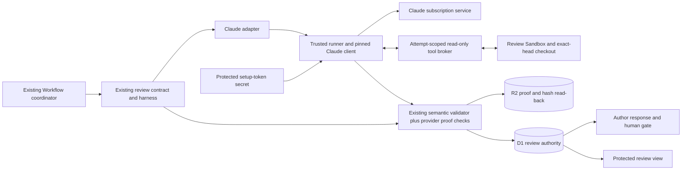

## Context

See `proposal.md` for the reason for this change. Plan amendment #103 selects the existing Claude setup token. It replaces the local-login choice in design #102.

The current review path already supplies frozen workflow definitions, exact inputs and heads, review rules, bounded repairs, D1 authority, R2 proof, author replies, and human gates. Keep those controls. Change the external provider adapter and its auth and proof only.

A local trial with Claude Code 2.1.268 used `CLAUDE_SETUP_TOKEN` as `CLAUDE_CODE_OAUTH_TOKEN`. It returned a successful `claude-opus-5` result. A trusted Stop hook reported applied effort `high`. Provider quota metadata reported overage disabled and unused. No Mac login was copied. This proves a local model call, not the deployed review, tool broker, or account identity.

## Goals / Non-Goals

**Goals:**

- Use the setup token only in the trusted Claude client process.
- Keep the review Sandbox free of provider credentials.
- Preserve the existing review contract and all human gates.
- Check actual model, applied effort, subscription usage, result, and input before accepting proof.
- Keep old runs on their frozen provider path.

**Non-Goals:**

- No copy, refresh, lease, or ownership transfer of the Mac's interactive login.
- No automatic token creation, renewal, browser sign-in, or account-management UI.
- No change to Codex author or self-check work.
- No paid API, usage-credit, alternate-model, or OpenRouter fallback for Claude runs.

## Component diagram

The trusted runner is a separate execution environment from the review Sandbox. It holds no editable repository checkout and loads only service-owned code, configuration, hooks, and tools. The Claude client runs there. Repository reads cross the broker to the existing read-only executor in the review Sandbox. The broker carries no provider credential or unrestricted shell capability.

## Decisions

### Use the approved setup-token route

Trusted provisioning reads `CLAUDE_SETUP_TOKEN` from the operator's ignored `.env`. It stores the value as a protected cloud secret. Only the trusted Claude client process receives that value as `CLAUDE_CODE_OAUTH_TOKEN`. Never include it in an image, command argument, prompt, job record, transcript, proof, or Sandbox-wide environment.

Start the client with a minimal environment and isolated config directory. Reject API keys, credential helpers, alternate endpoints, provider overrides, saved login files, and inherited user or project configuration. Do not use `--bare`: it ignores subscription OAuth tokens. Load only the trusted hook and broker configuration. The model must have no tool that can read the client's environment, credentials, or private files.

An expired, revoked, invalid, missing, or wrongly bound token produces `auth_failure`. The operator replaces it outside the workflow. DEOS does not mint or refresh it. In-flight attempts keep their captured token version; a later allowed retry can use an enrolled replacement for the same account. Replacement never changes a run's provider, model, effort, account binding, or retry limits.

The former local-login checkout, refresh lease, and refresh compare-and-swap design is removed for Claude. Setup tokens do not share the Mac's refreshable login. The existing Codex credential path stays as it is.

### Bind the enrolled token to the intended Pro account

Provisioning is a trusted operator action. The operator enrolls a token for the set Pro account and verifies that account's subscription and disabled paid usage in the provider setup. Record an opaque account binding and a service-keyed HMAC of the token in protected provisioning metadata. Do not store raw account identity in review proof.

Each attempt verifies that its captured secret matches the enrolled token HMAC and that the enrolled account binding matches the run. An unregistered token replacement or mismatched account binding fails before provider contact. Replacing the token requires a fresh trusted enrollment for the same account. Secret and metadata versions must match; an incomplete replacement blocks use rather than selecting one side implicitly.

This binding proves which operator-enrolled credential was used. It is not a claim that Claude returned an account identifier. The setup-token contract is limited to model requests; do not assume it can fetch a profile or use a cached Mac profile as proof. Provider quota events separately prove the observed subscription usage path. If enrollment cannot establish the intended Pro account, do not activate that credential.

This uses protected auth metadata and the existing run profile. It does not add an account table, billing manager, or account-discovery API. Inferring the account from a model response or a local profile was rejected because neither binds an arbitrary setup token to that account.

### Freeze the external review profile

A new immutable workflow definition fixes:

- provider: `claude`;
- model: `claude-opus-5`;
- effort: `high`;
- route: `claude_pro`;
- expected account binding: the enrolled Pro account;
- fallback: `none`.

Freeze the definition digest and profile with the run. The review Sandbox cannot override them. New Claude runs ignore the legacy OpenRouter model setting. Existing OpenRouter runs retain their saved adapter, model, and labels.

Reuse the current coordinator's plan/design inventory, complete context, prompt, exact head, schema, stale checks, directional isolation, round counters, and retry identities. Keep existing read-only repository operations. Broker requests are authorized for one attempt and checked against the frozen checkout. Reject unknown tools, writes, shell expansion, credential access, and provider overrides. Bound tool results using the existing job limits.

Replacing the whole review orchestrator was rejected because these controls already exist. The new adapter translates provider calls and proof without taking over workflow decisions.

### Record actual provider and client facts

Pin the tested Claude client version. Use an explicit service-owned system prompt and disable unrelated client features and nonessential traffic. Preserve the review's full prompt and context. The trial using the default client prompt recorded an auxiliary Haiku call; the explicit-prompt trial recorded only Opus 5. A tool-enabled canary must confirm the same property. Reject proof if any observed model usage belongs to another model.

The trusted runner collects:

- the initialized model and actual result `modelUsage`;
- applied effort from trusted turn hooks, including Stop;
- provider quota events, including overage status and use;
- terminal completion, session identity, and semantic result;
- the enrolled credential/account match, input digest, and exact head.

The tested hook reports the applied effort after client downgrades. Passing `--effort high` alone is not enough. Require high effort for every model turn whose result contributes to the review. Missing or conflicting hook evidence fails proof validation. Hooks are service-owned and cannot be changed or disabled by repository content or the model.

Require provider subscription events to show no overage use and paid overage disabled. A configured route or a list-price cost estimate is not a billing receipt. Before activation, verify paid usage credits are off for the enrolled account. Never enable or manage them in the workflow. If trustworthy usage evidence is absent, contradictory, or reports paid use, reject the result and stop the route. Do not claim that a post-call check can undo provider charges.

Validate the semantic result through the existing schema and review validators. A structurally valid review with concerns remains advice and continues to author response. It cannot approve a human gate.

### Preserve attempts, proof, and cleanup

Use the existing attempt and Workflow replay identities. Persist the invocation claim before starting the client. One client session belongs to the attempt. The session's model/tool loop and existing bounded repair turns belong to that invocation; they do not permit replay to launch another session. Preserve the existing repair count and stopping rules.

A completed replay reuses durable proof. If the invocation outcome is ambiguous, accept no result and do not launch another client for that attempt. Recover only the same invocation when the pinned client supplies trustworthy completion evidence. Otherwise consume the attempt; a later call requires an allowed new attempt.

Write the normalized provider receipt, semantic result, validation record, and input binding through the current create-only R2 proof path. Read the manifest back by hash. D1 accepts the proof pointer only after validation and cleanup pass.

Cleanup terminates the trusted client, destroys attempt-local state, and removes the review Sandbox. It retains the protected cloud secret for later attempts. The cleanup audit covers both execution environments. No token refresh or auth-file persistence step exists on this route. A cleanup, proof, stale-input, or storage failure leaves no accepted review.

### Stop at plan limits

Normalize provider quota exhaustion to `plan_limit`. Do not use fallback or schedule an immediate automatic retry. If the provider supplies a trustworthy reset time, save it as `retry_not_before` and reject early retries. If it does not, only an operator-triggered stage retry may try later. Existing attempt limits still apply.

Missing, expired, revoked, invalid, or mismatched auth is `auth_failure`. Invocation, tool, result, receipt, or cleanup failure is `review_failure`. Do not turn these into a pass. Derive classifications from the pinned client's documented and observed contract. Do not guess from fabricated success or quota payloads.

### Keep Settings and human gates stable

For the new definition, Settings shows Claude Opus 5 and high effort as fixed and hides the OpenRouter selector. Retain the legacy route model value for frozen runs and rollback. Historical proof keeps its original provider label.

A passed review page shows semantic review content, not internal provider facts. A failed or stopped page shows only the safe cause. It shows no token, raw provider response, or partial review output. Existing author dispositions and human approval rights remain unchanged.

## Event flow

1. The operator provisions the setup token and its protected account/credential binding.
2. The allocator freezes the new Claude profile with a new run.
3. The current coordinator builds the exact plan or design input and allocates the review attempt and read-only Sandbox.
4. The adapter checks the enrolled token version and account binding, claims the invocation, and starts the separate trusted client with the protected token.
5. Claude reads repository sources only through the attempt-scoped broker. The existing review and bounded repair contract applies.
6. The runner collects actual model, hook effort, quota, completion, and input evidence. Existing validators check the semantic result.
7. The service writes and hash-reads R2 proof, cleans up both execution environments, and then records the accepted pointer in D1.
8. The unchanged author-response and human-gate path continues. Failures stop without accepted proof or fallback.

## Minimal data model

| Existing record or extension | Minimum data | Rule |
| --- | --- | --- |
| Protected provisioning metadata | opaque account binding, token HMAC, secret version, enrollment evidence reference | No raw token in D1 or review proof. Replacement is an operator action. |
| Frozen run profile | definition digest, provider, model, effort, route, account binding, fallback | Immutable per run. |
| Review attempt | attempt identity, stage, direction, input digest, head, invocation claim, secret version, state, safe cause, optional retry time | Replay cannot launch a second client. |
| Provider receipt | actual models, applied effort, quota facts, enrolled binding match, terminal result, available session identity | Distinguish provider observations from provisioning assertions. |
| R2 review proof | normalized receipt, semantic result, validation, input binding, hashes | Existing create-only writes and hash read-back. |
| Cleanup audit | trusted-runner and review-Sandbox cleanup outcomes | Both must pass before D1 acceptance. |
| Route configuration | retained legacy OpenRouter model | Used only by frozen old runs or explicit rollback. |

Use existing storage and lifecycle records where possible. No Claude refresh lease or replacement-auth object is needed.

## Failure modes

| Failure | Safe cause or state | Behavior |
| --- | --- | --- |
| Token absent, expired, revoked, invalid, or not enrolled for the run | `auth_failure` | No accepted proof. Operator replaces or re-enrolls outside the workflow. |
| Secret and enrollment versions differ | `auth_failure` | Reject before provider contact. |
| API key, helper, endpoint override, or saved login is present | `review_failure` | Reject before provider contact. |
| Plan quota is exhausted | `plan_limit` | No fallback or immediate retry. Enforce a trustworthy reset time when available. |
| Actual model or applied effort differs or is unproved | `review_failure` | Reject proof, including unexpected auxiliary-model use. |
| Subscription-only usage is unproved or paid use is reported | `review_failure` | Reject proof and stop the route. Do not alter billing settings. |
| Broker request escapes its attempt or read-only scope | `review_failure` | Reject the request and review. |
| Invalid result, storage failure, or secret leak in proof | `review_failure` | No accepted pointer or next gate. |
| Input or head is stale | Existing stale state | Rebuild through the current flow. |
| Either execution environment fails cleanup | `review_failure` | Reconcile cleanup before acceptance. |
| Replay after completion | Existing durable result | Reuse proof without another invocation. |
| Interrupted invocation has no trustworthy completion | `review_failure` | Consume the attempt; a new call requires an allowed retry. |
| Valid review reports concerns | Accepted review with concerns | Continue to author response and the unchanged human gate. |
| Frozen OpenRouter run resumes | Existing saved route | Do not migrate or relabel it. |

## Risks / Trade-offs

- [A setup token cannot refresh itself] → Stop clearly on expiry or revocation and use trusted operator replacement.
- [A setup token does not expose a full account profile] → Bind the exact token during trusted enrollment. Label this as enrollment evidence, not a provider-returned identity.
- [Client defaults can add another model or change effort] → Pin the client, isolate its configuration, check actual models and turn-hook effort, and verify the tool-enabled canary.
- [Paid-use settings can change outside DEOS] → Verify disabled paid usage before activation and require provider quota evidence on results. Stop on missing or contradictory proof.
- [The trusted client needs repository tools] → Keep credentials in a separate environment and broker only the existing read-only operations.
- [A call can finish before its response is saved] → Recover only the same invocation with trustworthy evidence; otherwise consume the attempt.

## Migration Plan

1. Use the approved setup-token contract. Confirm the pinned client in a trusted test environment, including tool scope, applied effort, subscription quota signals, token failures, and enrollment checks. Retain the local trial as supporting evidence only.
2. Implement the adapter and trusted runner, preserving the existing coordinator, review prompts, read-only tools, validators, repairs, retries, proof, and gates.
3. Add protected token provisioning and replacement. Do not access the Mac's interactive login or alter the Codex auth path.
4. Test both review phases, wrong or missing token bindings, expiry, revocation, quota stops with and without reset time, ambient credentials, tool scope, actual-profile enforcement, replay, interrupted calls, stale results, cleanup failures, old runs, and rollback.
5. Update Settings for the new immutable definition while retaining old route values and historical labels.
6. Deploy and register the definition without migrating active runs. Select it for a dedicated test route using the existing route controls.
7. Trigger a real review through signed Linear ingress, Queue dispatch, and the deployed Workflow. Capture D1 authority, hash-checked R2 proof, and sanitized provider-setup and resulting-state screenshots. Verify the enrolled token binding, Opus 5, high effort, subscription-only usage, semantic result, and both cleanup outcomes.
8. Promote the new default only after the real review passes those checks. A local trial or synthetic Worker request is not release proof.

Rollback selects the prior immutable definition for later runs and restores its Settings selector. A route needs a valid retained or newly chosen OpenRouter model before activation. Missing configuration blocks allocation. Existing Claude runs retain their fixed profile and never fall back to OpenRouter or paid API use.

## Primary contract references

- [Claude Code authentication](https://code.claude.com/docs/en/authentication#generate-a-long-lived-token): setup-token environment input and its scope.
- [Model configuration](https://code.claude.com/docs/en/model-config): model selection and effort controls.
- [Agent SDK types](https://code.claude.com/docs/en/agent-sdk/typescript): applied hook effort and subscription quota events.
- [Current subscription usage notice](https://support.claude.com/en/articles/15036540-use-the-claude-agent-sdk-with-your-claude-plan): headless CLI subscription usage.
