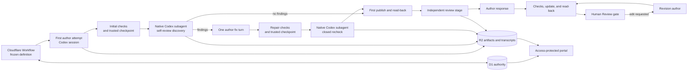

## Context

DEOS already freezes a workflow definition for each run, keeps workflow and
gate authority in D1, stores immutable evidence in R2, and lets only trusted
Worker adapters perform provider writes. The current OpenSpec flow already has
Codex authors, Codex review agents, deterministic completion checks, exact-head
publication, and human approval gates. See [proposal.md](proposal.md) for the
motivation and [the current architecture](../../../docs/current-architecture.md)
for those existing boundaries.

This change does not introduce another review service or another Sandbox tier.
The first self-review and its closed recheck run as native Codex subagents of
the live author session. The main workflow and portal must represent that fact:
self-review is child work inside the author step, while independent review
remains its own workflow stage. The runners must retain the author stream,
addressable child ranges, and the independent review job's own stream so every
saved job has a useful transcript.

The approved requirements are in the
[review-flow](specs/openspec-review-flow/spec.md),
[grounding](specs/grounded-openspec-agents/spec.md),
[fixed-workflow](specs/simplified-planning-workflow/spec.md), and
[observability](specs/workflow-observability/spec.md) delta specs. They require
one bounded self-review, one independent review, current sources and suitable
skills, stale-proof visibility after edits, and human approval. The design
below changes orchestration metadata and presentation around those existing
parts; it does not redesign agent isolation or provider access.

## Goals / Non-Goals

**Goals:**

- Run the two bounded self-review calls through Codex's native subagent
  mechanism inside the first author attempt.
- Enforce the discovery, optional author fix, and closed recheck counts in
  durable phase state so retries cannot create another semantic cycle.
- Capture addressable transcripts for the author, each self-review subagent,
  and the independent review job, and render self-review inside the author
  step.
- Keep one independent review stage, preserve exact-head coverage, and return
  all later human revisions directly to the same human gate after checks.
- Give each role the checked inputs, native web search, and pinned skills named
  by its frozen job policy without widening its authority.

**Non-Goals:**

- Add a review Sandbox, a custom safe-browsing service, or a second agent
  orchestration system.
- Change author or reviewer model routes, provider adapters, or human approval
  authority.
- Add an operator-editable skill settings page. This change records and shows
  the effective frozen skill selection; changing that policy remains a
  versioned workflow-definition change.
- Re-run semantic review after independent-review responses or human edits.
- Rewrite historical graph or review proof.

## Component diagram

`SD` and `SR` are subagent calls made by the live Codex author session. They
are not Workflow nodes, DEOS attempts, or separately provisioned Sandboxes.
Their child identities and transcript ranges are evidence owned by the parent
attempt. Independent review remains a separate stage and uses the existing
review-agent execution path. Only the first-publish edge reaches that stage;
author responses and human-requested revisions use the update edge directly
back to the human gate.

## Event flow

### First plan or design

1. The Workflow enters the first author node from the run's frozen definition.
   The trusted job builder supplies the declared plan files, the allowlisted
   architecture guides for design, the role's tool policy, and the pinned skill
   set. Each file and skill is named with its immutable identity or digest in
   the attempt input manifest.
2. The author creates the full phase artifact. The existing completion hook
   runs allowed-path, OpenSpec, whitespace, readability, and required-section
   checks. It submits the checked files and completion receipt through an
   attempt-scoped review-checkpoint capability. The trusted Worker repeats the
   acceptance checks, stores and reads back the immutable candidate in R2, and
   records its digest in D1. Self-review cannot start before that response.
3. The live author session starts one native Codex subagent with the accepted
   candidate, applicable requirements, checked context, reviewer instructions,
   and a structured finding schema. The child shares the author's Sandbox, so
   its instructions forbid writes but physical write isolation is not claimed.
   The immutable R2 candidate digest is the review input, and the supervisor
   compares candidate paths after the child returns. A mismatch rejects the
   child result and restores the accepted candidate before any parent repair.
   A valid result is an ordered finding set with stable IDs or an explicit empty
   result. Sources used through web search are attached and cited.
4. If discovery is empty, self-review ends. If it contains findings, the parent
   author receives the complete fixed set once and gets one repair turn. The
   repaired candidate must pass the same deterministic checks.
5. A passing repair becomes a new immutable accepted candidate through the same
   trusted checkpoint. After a repair attempt, the author starts one native
   Codex recheck subagent.
   Its schema contains the discovery IDs as a closed set and permits only
   `fixed` or `open` for each ID. Trusted code rejects additional IDs and treats
   a missing or malformed rating as open. The recheck cannot request another
   author turn.
6. Before either child call, the supervisor uses the checkpoint capability to
   reserve the applicable empty slot with a stable invocation ID. Afterward it
   submits the result through that capability. The Worker validates the active
   attempt, frozen cycle and input digest, result schema, and closed discovery
   ID set before it accepts the slot. The Sandbox has no direct D1 or R2 write
   authority.
7. The supervisor captures parent and subagent events from the Codex JSONL
   stream as they occur. It stores one continuous author transcript plus a
   transcript view for each child invocation, all linked to the same DEOS
   attempt. The latest accepted candidate after the optional repair is the
   publication candidate. Its digest, discovery, repair outcome, recheck, open
   set, sources, and transcript manifests are persisted before publication.
8. Trusted publication updates the phase pull request from that publication
   candidate and reads back its exact head. The Workflow binds both its digest
   and the read-back head as the input to the one independent-review stage. The
   independent review-agent supervisor captures that job's own Codex-harness
   JSONL stream into a separate transcript manifest. One structurally valid
   result fills the phase's independent slot; concerns are judgment input, not
   a failed review.
9. One author-response job receives the complete concern set, the checked plan
   and architecture context applicable to the phase, and its frozen tools and
   skills. It records `applied`, `declined`, or `no_change` for every concern
   and may update the artifact. Trusted checks, publication, and read-back save
   the current head. No second independent review runs.
10. The human gate opens after all required results and dispositions exist,
   checks pass, and publication read-back matches the current head. It shows
   the self-review findings and open set, the independent result and responses,
   the reviewed head, and the current head. Only a signed decision by an
   allowed person can leave the gate through an approval edge.

### Retry and recovery

The phase review cycle is created by the trusted checkpoint when the first
checked candidate is accepted, not when a process starts. Discovery, repair
use, and recheck each have one durable slot. Slot reservations and result
acceptance use compare-and-set operations keyed by `(run, phase, cycle,
slot-kind)`; retries with the same invocation or result digest are idempotent.
A replay reconciles the reserved identity and captured result before transport.
It starts a replacement call only when the prior call is terminal without an
accepted result; a replacement may fill the same slot but does not create
another semantic pass.

The new flow adds first plan author and first design author to authenticated
stage-retry eligibility only for typed nested-review failures. The Worker
permits this resume path after the original attempt is terminal and cleanup is
`destroyed`, a trusted accepted candidate and cycle exist, and the requested
action matches an unaccepted slot or a consumed repair marker. The replacement
job is a review-cycle continuation: it receives the same accepted candidate,
finding set, and remaining action. It cannot run draft authoring or repeat an
accepted discovery; a terminal unaccepted discovery reservation may be
reconciled or replaced only within that same slot. If no accepted cycle exists,
this special retry is ineligible.

If the one repair turn was issued but its outcome is ambiguous, the turn is
treated as consumed and the last accepted checked candidate is used for the
closed recheck. This favors visible open findings over an accidental second
repair. A failed recheck leaves its slot empty and fails with a typed cause; an
eligible retry may reconcile or fill only that slot.

The supervisor's existing five-minute heartbeat continues independently while
a child is active, and child lifecycle or output events also count as progress.
Discovery, repair, and recheck share the parent attempt's 24-hour absolute
deadline; no child resets or extends it. Before starting a child, the supervisor
checks the remaining deadline and retains the configured shutdown-and-evidence
reserve. Deadline expiry cancels the child, closes the partial transcript,
leaves its slot unaccepted, and enters normal cleanup before the typed retry
path above can run.

### Human-requested revision

1. A signed user event at the active human gate selects the existing revision
   edge. The revision author receives the current artifact, bounded root review
   comments, the same checked plan and architecture context, and historical
   review proof marked as prior proof.
2. The author edits the artifact and supplies one short response for every
   affected root comment, stating what changed or why no change was made.
3. Trusted checks validate the artifact and complete response set. Publication
   updates the same pull request, reads back the new head, and posts each reply
   idempotently without resolving its thread.
4. The Workflow returns directly to a new visit of the same human gate. It does
   not allocate discovery, recheck, or independent-review work. The portal
   shows the prior reviewed head as stale when it differs from the current head
   and says that no new semantic review was due.

Further human requests repeat only this revision path.

### Grounding, web search, and skills

Role capabilities are declared in the versioned workflow job configuration and
frozen with the run. Each typed job kind has an exact skill list; selection does
not infer scope from model output, repository contents, or mutable Settings.
For this Cloudflare-hosted workflow, the frozen lists for every named plan and
design role include the pinned Cloudflare bundle plus the exact OpenSpec and
repository skills assigned to that job kind. The attempt input manifest records
the web-search flag and supplied skill IDs and digests. The portal may show this
manifest read-only. Policy edits require a new workflow definition and do not
alter active runs.

Both execution paths use the Codex harness: the author path invokes the native
Codex session and the independent-review path invokes its configured model
through that harness. The trusted job builder registers the same existing
native web-search tool in each harness when the frozen policy enables it. Job
startup verifies the tool in the effective capability manifest for plan and
design authors, both self-review child roles, and the independent reviewer; a
missing required tool fails startup instead of degrading to memory-only work.
This adds no custom browsing proxy or provider credential. Search results are
untrusted inputs and cannot change allowed paths, provider rights, or gate
rules. Each role cites every outside page it uses.

Skills are instruction bundles, not capabilities. The trusted job builder
loads the exact list for the typed job kind from the frozen definition and
verifies each digest. A skill can use only tools the job already has. Requests
to write outside the role's file scope, call a blocked provider, access a
secret, or bypass the human gate remain denied by the existing attempt
contract.

## Decisions

### 1. Reuse native Codex subagents inside the author attempt

Self-review discovery and recheck use the Codex session's existing subagent
mechanism. The outer author attempt remains the only DEOS attempt and Sandbox
for this work. The trusted supervisor supplies structured inputs, observes
child lifecycle events, and validates structured results. The child shares the
checkout and tool reach of that Sandbox. Trust therefore comes from immutable
candidate inputs, digest-bound results, post-child path comparison, and trusted
acceptance, not from a claim that the child has a separate read-only filesystem.

This matches the review's actual execution model and lets the portal attach
child transcripts to the author step. A separate Workflow node was rejected
because self-review must not appear as a phase. A separately provisioned review
Sandbox was rejected because it duplicates isolation and lifecycle machinery
that this change does not need.

### 2. Enforce bounds with phase slots, not graph loops

Each first phase has one discovery slot, one repair-used marker, one closed
recheck slot when findings exist, and one independent-review slot. Accepted
results are immutable and retries reconcile the existing slot. The trusted
controller, not reviewer prose, derives the final open set and decides whether
another call is allowed.

Prompt-only counting was rejected because a process retry could repeat work.
Adding more review nodes was rejected because it would make the graph and
portal contradict the required nested presentation.

### 3. Put mid-attempt review state behind a trusted checkpoint capability

The live supervisor reaches a narrow Worker endpoint through its existing
attempt-scoped capability. The endpoint accepts only three operation kinds for
the attempt's frozen run, phase, and cycle: accept a deterministically checked
candidate, reserve a discovery or recheck invocation, and accept its structured
result. Candidate acceptance repeats trusted checks and R2 read-back before D1
indexing. Reservation is a D1 compare-and-set. Result acceptance verifies the
reserved invocation, input digest, schema, and closed finding set before a
create-only R2 write and D1 slot update.

Operation identities derive from the run, phase, cycle, slot kind, candidate or
invocation identity, and payload digest. Exact retries return the saved result;
conflicting payloads fail closed. Giving the Sandbox D1 credentials was
rejected because agent work must not become workflow authority. Deferring all
state until attempt completion was rejected because a crash could otherwise
repeat discovery or repair without a durable bound.

### 4. Capture author, child, and independent-review transcripts

The runner already captures a Codex JSONL stream for the author attempt. It
will preserve subagent start, message, tool, result, and finish events with a
stable child invocation ID. The evidence writer stores the complete parent log
and an indexed child view or child transcript object derived from those same
events. Both carry hashes and event counts.

The independent review-agent supervisor also runs its configured model through
the Codex harness. It stores that job's own JSONL stream as an independent
attempt owner rather than as a child range. A successful new author,
self-review, or independent-review job must have a transcript manifest; an
explicit zero-event manifest is reserved for genuine zero-event or historical
logs, not used as a substitute for missing capture.

The transcript API addresses an owner explicitly: an author attempt or a child
invocation. The portal uses the author owner for the main log and the child
owner for **View transcript** on a nested self-review row. Copying review text
into portal-only state was rejected because it would drift from the captured
execution evidence.

### 5. Keep independent review and exact-head truth unchanged

Independent review remains one top-level stage after the first publication.
The publication uses the initial accepted candidate when discovery is empty or
repair does not produce another accepted candidate; otherwise it uses the
accepted post-repair candidate. The phase binds that publication candidate
digest and its read-back head to the independent result. It also stores the
latest published head. Responses and human revisions may change only the
latest head, so the portal must label coverage stale rather than imply a
recheck.

Repeating independent review was rejected by the approved one-pass rule.
Hiding older proof was rejected because the human gate needs the finding and
coverage history.

### 6. Record exact skill policy in the frozen definition and effective selection in each attempt

The versioned workflow job configuration maps each typed job kind to exact
skill IDs and digests. The trusted job kind, rather than content inference or a
runtime role-and-task heuristic, determines the list. The attempt manifest is
the audit record of what was actually supplied. The portal exposes that
effective selection read-only.

An editable settings page was not selected because changing skill bundles is a
security- and reproducibility-sensitive workflow change, not per-run human
input. Arbitrary repository discovery was rejected because it would weaken the
checked-context proof.

### 7. Use the Codex harness's native web search on both execution paths

Jobs opt into the web-search tool through their frozen role policy. Both the
author runner and independent review-agent runner register that existing tool
with the Codex harness, and startup verifies it is present for every required
role. The design adds no bespoke broker, fetcher, URL policy, or network
service. Citations remain part of the artifact or review result.

A new safe-browsing service was rejected because it expands this change into a
new security product without an approved contract. Unrestricted provider
credentials were rejected because search must not widen job authority.

### 8. Derive both portal views from the durable review model

For the new flow version, the run view groups self-review child records under
their parent author attempt and keeps independent review top-level. The detail
view uses the same records to show discovery, repair, recheck, sources, open
findings, concern dispositions, and exact-head coverage.

Transcript responses have explicit `content`, `empty`, `unavailable`, and
`corrupt` states. A verified log with zero events is `empty` and renders “No
transcript content was captured.” A legacy job with no supported transcript
locator is `unavailable` and gets a clear explanatory message rather than an
error page. Missing or hash-invalid bytes for a required manifest are
`corrupt`; they are never described as empty.

## Minimal data model

These are logical additions to the existing attempt, review, evidence, and gate
records. They do not require one new table per row type.

| Record | Required fields | Purpose |
| --- | --- | --- |
| `phase_review_cycle` | run, phase, initial candidate digest, current accepted candidate digest, publication candidate digest, originating author attempt, discovery slot, repair-used state, recheck slot, independent slot, reviewed head, current head | Enforces one bounded semantic cycle and identifies exactly which checked candidate was published and reviewed. |
| `review_job` | review ID, cycle, kind, owning attempt, parent attempt and native child invocation ID when nested, input digest, result digest, outcome, model-route reference | Indexes discovery, closed recheck, and independent results without turning child reviews into Workflow nodes. |
| `review_finding` | review ID, stable finding ID, ordinal, summary, artifact location, status, author disposition or response | Keeps the immutable finding inventory and the trusted derived open set queryable. |
| `agent_input_manifest` | attempt, typed job kind, role, checked file paths and hashes, required web-search tool identity, exact skill IDs and digests, effective capability digest | Extends the existing typed job input proof with deterministic grounding and tool selection. |
| `source_record` | job or review ID, source ID, URL, title, access time, supported claim or finding ID | Records only outside sources actually used and cited. |
| `transcript_manifest` | owner kind, owner ID, owning attempt, optional parent attempt, R2 object or event range, SHA-256, byte count, event count, format version | Opens an author, nested subagent, or independent-review transcript with integrity and empty-state information. |
| `human_gate_binding` | run, phase, visit, pull-request identity, reviewed head, current head, open finding IDs, no-new-review reason | Shows the human exactly what proof covers and keeps approval visit-scoped. |

Large artifacts, review results, source details, and transcripts remain in
create-only R2 objects. D1 stores the identities, hashes, slot state, head
bindings, and fields needed for workflow decisions and portal queries. No
provider token, authorization header, raw credential, or secret is added.

## Failure modes

| Failure | Required behavior |
| --- | --- |
| A checked plan, architecture file, skill digest, or candidate hash does not match | Fail before starting the affected author or subagent. Do not substitute filesystem discovery or an older manifest. |
| The first draft fails deterministic checks | Keep the author in the existing bounded completion path. Do not allocate self-review. |
| The review-checkpoint capability is absent, expired, or scoped to another attempt or phase | Fail before accepting a candidate or reserving a slot. The Sandbox never writes D1 or R2 directly. |
| Native discovery subagent exits without a valid result | Leave discovery unaccepted, preserve its child transcript, and fail with a typed cause. Retry reconciles that slot before another transport call. |
| A child changes a candidate path | Reject its result, retain the immutable accepted R2 candidate as authority, restore that candidate before parent work resumes, and record a protocol violation. |
| Discovery returns no findings | Save an explicit empty result, mark repair and recheck not required, and continue to publication. |
| The one author repair fails checks or its completion is ambiguous | Mark the repair opportunity consumed and retain the last valid candidate for closed recheck. Do not grant another repair. |
| Recheck returns an unknown ID | Reject that item, record a protocol violation, and never add it to the frozen inventory. |
| Recheck omits or corrupts an original rating | Treat that original item as open and preserve the raw result for diagnosis. |
| Recheck subagent fails without a valid result | Leave the recheck slot empty and fail with a typed cause. An authenticated retry may fill only that same slot and cannot repeat discovery or repair. |
| The shared attempt deadline expires while child work is active | Cancel the child, close and retain captured events, leave its result slot unaccepted, and complete normal attempt cleanup. Do not extend the 24-hour deadline. |
| Parent author attempt ends while child work is active | Stop through the existing attempt-cleanup path, retain captured events, and allow a review-cycle continuation only after cleanup is `destroyed` and the trusted retry preconditions match. Do not create a separate Sandbox lifecycle for the child. |
| Duplicate delivery or process replay tries to accept another result | The slot compare-and-set loses and the controller reuses the accepted result. |
| Independent review has concerns | Save them and continue to the one author-response job; concerns do not fail the stage or approve the work. |
| Independent review or author response is structurally invalid | Keep the required slot or disposition set incomplete and do not open the human gate. |
| Publication succeeds but exact-head read-back is missing or differs | Record an ambiguous provider effect and hold gate entry until trusted reconciliation establishes the current head. |
| A human revision omits a bounded root-comment reply | Reject the response set before returning to the gate. Retry the stable reply operation and never resolve the thread. |
| A later human edit fails checks | Do not publish or start semantic review. Keep the revision on its typed failure path. |
| Required native web search is absent from an author or independent-review harness | Fail job startup because the frozen role capability was not provisioned. Do not degrade to memory-only work. |
| A successful new independent-review result has no transcript manifest | Treat evidence collection as incomplete and do not advance to author response or the human gate. Preserve a genuine verified zero-event result only when the manifest explicitly proves zero events. |
| A skill or web result asks for a forbidden action | Treat it as untrusted input and deny the action under the existing attempt capability. |
| A transcript manifest verifies and has zero events | Return `empty` and render the clear empty message, not an error page. |
| A supported legacy job has no displayable transcript | Return `unavailable` with a clear legacy message. Do not claim that missing evidence is empty. |
| Required transcript bytes are missing or fail their saved hash | Return `corrupt` for that job and show an integrity error without affecting other transcripts. |
| A new deployment reads an old run | Restore its frozen definition and render its historical graph and proof unchanged. Do not project nested reviews onto a flow version that did not define them. |

## Risks / Trade-offs

- **Native child events may differ across Codex runner versions** → Pin the
  runner/event format in the workflow definition, version the transcript
  adapter, and retain readers for formats referenced by stored runs.
- **A subagent shares the outer attempt boundary and writable checkout** → Bind
  review to an immutable accepted candidate, compare candidate paths after each
  child, reject changed files, and restore the accepted snapshot before parent
  work continues.
- **Nested passes consume the parent's finite attempt budget** → Keep the
  five-minute supervisor heartbeat active, share the fixed 24-hour deadline,
  reserve time for transcript persistence and cleanup, and resume only the
  unaccepted durable slot after a typed timeout.
- **Later heads are not semantically re-reviewed** → Show reviewed and current
  heads together, mark stale coverage clearly, and leave judgment with the
  human gate.
- **Frozen skill policies require deployment for changes** → Show effective
  skills in the portal and introduce editable settings only through a later
  change with explicit authorization and versioning requirements.
- **Legacy transcript evidence is inconsistent** → Distinguish verified empty,
  unavailable, and corrupt states instead of turning every absence into an
  error or an empty claim.

## Migration Plan

1. Add the nullable parent-attempt, native-child-invocation, transcript-owner,
   review-slot, initial/current/publication candidate digest, source, and
   exact-head fields needed by the logical model. Keep historical rows and
   immutable R2 evidence unchanged.
2. Add the attempt-scoped review-checkpoint operations to the trusted Worker.
   Verify the frozen attempt and phase, repeat candidate checks and R2 read-back,
   reserve slots with compare-and-set, and validate digest-bound closed-set
   results. Test conflicting idempotency payloads and direct-write denial.
3. Update the Codex author supervisor to issue bounded native subagent prompts,
   keep its heartbeat running, enforce the shared absolute deadline, persist
   stable child identities and structured results through the checkpoint, and
   split or index child events from the parent JSONL stream. Test empty
   discovery, one repair, closed-set violations, child writes, child timeout,
   replay, and cleanup.
4. Update the independent review-agent supervisor to retain its own Codex-
   harness JSONL stream and require a hash-checked transcript manifest before a
   successful result advances. Test eventful, verified-empty, interrupted, and
   corrupt independent logs.
5. Put exact skills and required native web search in every typed job policy in
   the new frozen definition. Register the existing search tool in both Codex
   harness paths, fail startup when it is missing, and record the effective
   selection in each attempt manifest. Verify author, self-review, independent-
   review, response, and revision context without new provider rights.
6. Register a new immutable workflow version with unchanged model-route
   references. Its first-author jobs contain self-review; its independent
   stages remain top-level; its author-response and human-revision edges skip
   semantic review. Extend authenticated stage-retry eligibility to first plan
   and design authors only for nested-review continuation after terminal attempt
   state, destroyed cleanup, an accepted cycle, and a matching remaining slot.
7. Update the workflow portal to nest child review rows under the author step,
   show the read-only context/tool manifest and exact-head coverage, address
   transcripts by owner ID, and render content, empty, unavailable, and corrupt
   states. Build and deploy the workflow portal from the DEOS root, read back
   the active Cloudflare version at 100% traffic, and verify the protected live
   pages.
8. Run a provider-originated canary from a test Linear issue through the new
   flow. Record provider delivery, Workflow state, D1/R2 review and transcript
   evidence, exact pull-request heads, and signed-in portal screenshots as
   separate proof. Do not present synthetic ingress or tests as
   provider-originated verification.
9. Roll back by selecting the prior workflow definition for new runs. Existing
   runs keep their frozen definitions, and portal readers for every already
   selected transcript format remain deployed.
