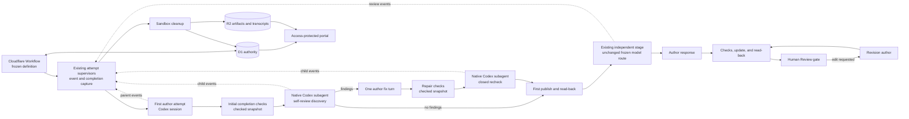

## Context

DEOS already freezes a workflow definition for each run, keeps workflow and
gate authority in D1, stores immutable evidence in R2, and lets only trusted
Worker adapters perform provider writes. The checked architecture currently
describes Codex authors, Codex self-checks, and an independent stage whose
frozen OpenRouter model is reached through the Codex harness. It also has
deterministic completion checks, exact-head publication, and human approval
gates. See [proposal.md](proposal.md) for the motivation and
[the current architecture](../../../docs/current-architecture.md) for those
existing boundaries.

This change does not introduce another review service or another Sandbox tier.
The first self-review and its closed recheck run as native Codex subagents of
the live author session. The main workflow and portal must represent that fact:
self-review is child work inside the author step, while independent review
remains its own workflow stage. The runners must retain the author stream,
addressable child ranges, and the independent review job's own stream so every
saved job has a useful transcript.

The approved requirements are in the
[review-flow](specs/openspec-review-flow/spec.md),
[grounding](specs/grounded-openspec-agents/spec.md),
[fixed-workflow](specs/simplified-planning-workflow/spec.md), and
[observability](specs/workflow-observability/spec.md) delta specs. They require
one bounded self-review, one independent review, current sources and suitable
skills, stale-proof visibility after edits, and human approval. The design
below changes orchestration metadata and presentation around those existing
parts; it does not redesign agent isolation or provider access.

## Goals / Non-Goals

**Goals:**

- Run the two bounded self-review calls through Codex's native subagent
  mechanism inside the first author attempt.
- Enforce the discovery, optional author fix, and closed recheck counts in
  durable phase state so retries cannot create another semantic cycle.
- Capture addressable transcripts for the author, each self-review subagent,
  and the independent review job, and render self-review inside the author
  step.
- Keep one independent review stage, preserve exact-head coverage, and return
  all later human revisions directly to the same human gate after checks.
- Give each role the checked inputs, native web search, and pinned skills named
  by its frozen job policy without widening its authority.

**Non-Goals:**

- Add a review Sandbox, a custom safe-browsing service, or a second agent
  orchestration system.
- Change author or reviewer model routes, provider adapters, or human approval
  authority.
- Add an operator-editable skill settings page. This change records and shows
  the effective frozen skill selection; changing that policy remains a
  versioned workflow-definition change.
- Re-run semantic review after independent-review responses or human edits.
- Rewrite historical graph or review proof.

## Component diagram

`SD` and `SR` are subagent calls made by the live Codex author session. They
are not Workflow nodes, DEOS attempts, or separately provisioned Sandboxes.
Their child identities and transcript ranges are evidence owned by the parent
attempt. Independent review remains a separate stage and uses the existing
review-agent execution path. Only the first-publish edge reaches that stage;
author responses and human-requested revisions use the update edge directly
back to the human gate.

## Event flow

### First plan or design

1. The Workflow enters the first author node from the run's frozen definition.
   The trusted job builder supplies the declared plan files, the allowlisted
   architecture guides for design, the role's tool policy, and the pinned skill
   set. Each file and skill is named with its immutable identity or digest in
   the attempt input manifest.
2. The author creates the full phase artifact. The existing completion hook
   runs allowed-path, OpenSpec, whitespace, readability, and required-section
   checks. The supervisor records the passing snapshot digest in the same
   mechanically produced completion evidence that already records author
   rounds. This supervisor and Codex are inside the one `danger-full-access`
   Sandbox. The supervisor has no D1, R2, provider, or new checkpoint
   credential, so neither process can turn local review state into workflow
   authority. Self-review cannot start before the local checks pass.
3. The live author session starts one native Codex subagent with the checked
   candidate, applicable requirements, checked context, reviewer instructions,
   and a structured finding schema. The child shares the author's Sandbox, so
   its instructions forbid writes but physical write isolation is not claimed.
   The checked snapshot digest is the review input, and the completion hook
   compares candidate paths after the child returns. A mismatch rejects the
   child result and restores the checked snapshot before any parent repair.
   A valid result is an ordered finding set with stable IDs or an explicit empty
   result. The supervisor includes it only when native child start, result, and
   finish events share a stable invocation ID in the captured Codex stream.
   This is advisory review evidence, not a gate decision. Sources used through
   web search are attached and cited.
4. If discovery is empty, self-review ends. If it contains findings, the parent
   author receives the complete fixed set once and gets one repair turn. The
   repaired candidate must pass the same deterministic checks.
5. A passing repair becomes the new checked snapshot. The supervisor records a
   `repair_started` event before resuming the parent for that one turn and its
   checked or failed outcome afterward. After any issued repair attempt, the
   author starts one native Codex recheck subagent. Its result has a `ratings`
   map containing every discovery ID exactly once with only `fixed` or `open`,
   plus the common `sources` and `searchDisposition` fields. Source metadata is
   not part of the finding inventory. Trusted validation rejects additional
   rating IDs and treats a missing or malformed rating as open. The recheck
   cannot request another author turn.
6. The supervisor captures parent and subagent events from the Codex JSONL
   stream as they occur. It stores one continuous author transcript plus a
   transcript view for each child invocation, all linked to the same DEOS
   attempt. The latest checked candidate after the optional repair is the
   publication candidate. After Codex exits and cleanup is `destroyed`, the
   trusted Worker validates the supervisor-produced completion manifest,
   transcript, final patch, schemas, and digests; writes create-only R2
   evidence; and then indexes the cycle and slots in D1. No authority-bearing
   review mutation occurs inside the Sandbox. The manifest records an explicit
   `none_used` disposition when search ran but supplied no source used by the
   result. Otherwise every declared source must be cited by an existing claim
   or finding.
7. Trusted publication updates the phase pull request from that publication
   candidate and reads back its exact head. The Workflow binds both its digest
   and the read-back head as the input to the one independent-review stage. The
   stage keeps the frozen reviewer model route exactly as recorded for the run;
   this change neither selects a Claude harness nor moves the model between
   harnesses. The existing route's executor supplies its native web search,
   pinned reviewer skills, and captured event stream through a route-specific
   adapter. One structurally valid result fills the phase's independent slot;
   concerns are judgment input, not a failed review.
8. One author-response job receives the complete concern set, the checked plan
   and architecture context applicable to the phase, and its frozen tools and
   skills. It records `applied`, `declined`, or `no_change` for every concern
   and may update the artifact. Trusted checks, publication, and read-back save
   the current head. No second independent review runs.
9. The human gate opens after all required results and dispositions exist,
   checks pass, and publication read-back matches the current head. It shows
   the self-review findings and open set, the independent result and responses,
   the reviewed head, and the current head. For recheck, either one valid closed
   result or the exhausted `unavailable` fallback satisfies completion; the
   latter leaves every discovery finding open and is labeled as missing review
   evidence. Only a signed decision by an allowed person can leave the gate
   through an approval edge.

### Retry and recovery

The supervisor's completion manifest is the live attempt's review journal. It
records the checked input digest and the start and terminal event for discovery,
the repair turn, and recheck. After Sandbox cleanup, the Worker validates that
journal against the captured Codex stream and final patch, persists it in R2,
and creates the phase cycle and its D1 slots in one guarded transaction. A
started repair is consumed even when it has no passing result. Missing,
conflicting, or unverifiable journal evidence fails closed; it never causes a
second repair.

The new flow adds first plan author and first design author to authenticated
stage-retry eligibility only for typed nested-review failures. The Worker
permits this resume path after the original attempt is terminal and cleanup is
`destroyed`, trusted R2 failure evidence and a cycle exist, and the requested
action matches the journal's one unfinished slot. The replacement job is a
review-cycle continuation: it receives the last checked candidate, fixed
finding set, prior invocation evidence, and remaining action. It cannot run
draft authoring, issue another repair, or repeat an accepted discovery. If the
journal cannot prove which action started, this special retry is ineligible and
the run enters `manual_reconciliation_required`.

If the one repair turn was issued but its outcome is ambiguous, the turn is
treated as consumed and the last checked candidate is used for the
closed recheck. This favors visible open findings over an accidental second
repair. Discovery and recheck each permit at most two transport invocations:
the original call and one authenticated continuation after a typed failure.
Both invocations for a slot use the same input digest, and only the first valid
result fills it. If both discovery invocations fail, the run enters
`manual_reconciliation_required`; no publication or human approval gate opens
because there is no valid fixed finding inventory. If both recheck invocations
fail, trusted code finalizes recheck as `unavailable`, derives the open set as
every discovery finding, records both causes, and continues to publication.
The missing recheck remains visible and cannot be retried again.

A structurally invalid independent-review result ends that attempt with
`invalid_independent_review_result`; it does not fill or consume the single
valid-result slot. The existing authenticated stage-retry path may make one
replacement attempt against the same published candidate and slot. A second
invalid result moves the run to `manual_reconciliation_required` with no human
approval gate open and no automatic model call. A structurally invalid author
response similarly ends with `invalid_author_response`; one authenticated
replacement receives the same concern inventory and cannot start another
independent review. A second invalid response enters manual reconciliation.

The supervisor's existing five-minute heartbeat continues independently while
a child is active, and child lifecycle or output events also count as progress.
Discovery, repair, and recheck share the parent attempt's 24-hour absolute
deadline; no child resets or extends it. Before starting a child, the supervisor
checks the remaining deadline and retains the configured shutdown-and-evidence
reserve. Deadline expiry cancels the child, closes the partial transcript,
records the slot attempt as terminal without a valid result, and enters normal
cleanup before the bounded continuation path above can run.

### Human-requested revision

1. A signed user event at the active human gate selects the existing revision
   edge. The revision author receives the current artifact, bounded root review
   comments, the same checked plan and architecture context, and historical
   review proof marked as prior proof.
2. The author edits the artifact and supplies one short response for every
   affected root comment, stating what changed or why no change was made.
3. Trusted checks validate the artifact and complete response set. Publication
   updates the same pull request, reads back the new head, and posts each reply
   idempotently without resolving its thread.
4. The Workflow returns directly to a new visit of the same human gate. It does
   not allocate discovery, recheck, or independent-review work. The portal
   shows the prior reviewed head as stale when it differs from the current head
   and says that no new semantic review was due.

Further human requests repeat only this revision path.

### Grounding, web search, and skills

Role capabilities are declared in the versioned workflow job configuration and
frozen with the run. Each typed job kind has an exact skill list; selection does
not infer scope from model output, repository contents, or mutable Settings.
For this Cloudflare-hosted workflow, the frozen lists for every named plan and
design role include the pinned Cloudflare bundle plus the exact OpenSpec and
repository skills assigned to that job kind. The attempt input manifest records
the web-search flag and supplied skill IDs and digests. The portal may show this
manifest read-only. Policy edits require a new workflow definition and do not
alter active runs.

The author and independent-review execution paths keep the model routes and
harness selection already frozen for the run. The Codex author path gives the
author and native Codex subagents Codex web search and pinned skills. The
independent path gives the configured reviewer the native search and skill
mechanism supported by its existing executor. In the checked architecture that
executor is the Codex harness with a signed channel to the frozen OpenRouter
model. If another already-registered route uses a native Claude executor, that
executor must satisfy the same capability contract with Claude's own search
and skills; this change does not create that route or move a model onto it.
Each executor verifies its effective capability manifest at startup. A missing
required search tool or skill fails startup instead of degrading to memory-only
work.

Search results are untrusted inputs and cannot change allowed paths, provider
rights, or gate rules. Each result schema contains `sources` and
`searchDisposition`. A role that relies on a source sets the disposition to
`sources_used`, lists each cited source, and binds it to an existing claim
locator or finding ID. A role that searched but used no result sets
`none_used` and may leave `sources` empty; search without a useful source is not
an error. A role that did not search sets `not_searched`. Trusted checks enforce
the enum, citation presence, locator existence, and safe source fields. They do
not claim to infer semantic reliance from tool events; the human gate judges
omission and citation quality.

A declared URL must parse as credential-free HTTPS, contain no control
characters, and be at most 2,048 bytes. Titles are plain text without control
characters and at most 300 bytes. When a captured harness event exposes a
result URL or event time, the source record stores the matching event identity
and supervisor time with provenance `captured`. When the native stream exposes
only an opaque handle or synthesized content, the sanitized model citation is
stored with provenance `declared` and no invented event URL or timestamp. The
portal labels provenance, HTML-escapes titles, never fetches a saved URL
server-side, and opens external links with `noopener`, `noreferrer`, and
`nofollow`.

Skills are instruction bundles, not capabilities. The trusted job builder
loads the exact list for the typed job kind from the frozen definition and
verifies each digest. A skill can use only tools the job already has. Requests
to write outside the role's file scope, call a blocked provider, access a
secret, or bypass the human gate remain denied by the existing attempt
contract.

## Decisions

### 1. Reuse native Codex subagents inside the author attempt

Self-review discovery and recheck use the Codex session's existing subagent
mechanism. The outer author attempt remains the only DEOS attempt and Sandbox
for this work. The trusted supervisor supplies structured inputs, observes
child lifecycle events, and records structured results. The child shares the
checkout and tool reach of that Sandbox. The review is advisory agent evidence:
it cannot write D1 or R2, publish, approve, or select a workflow edge. Trusted
acceptance of the candidate and evidence happens only after Codex has exited
and the Sandbox has been destroyed. This boundary does not rely on hiding a
credential or process memory from a `danger-full-access` agent.

This matches the review's actual execution model and lets the portal attach
child transcripts to the author step. A separate Workflow node was rejected
because self-review must not appear as a phase. A separately provisioned review
Sandbox was rejected because it duplicates isolation and lifecycle machinery
that this change does not need.

### 2. Enforce bounds with phase slots, not graph loops

Each first phase has one discovery slot, one repair-used marker, one closed
recheck slot when findings exist, and one independent-review slot. The
supervisor's captured journal proves which calls and repair turn started; the
Worker indexes that journal after cleanup. Accepted results are immutable and
bounded continuations reconcile the existing slot. The trusted controller, not
reviewer prose, derives the final open set and decides whether another call is
allowed.

Prompt-only counting was rejected because a process retry could repeat work.
Adding more review nodes was rejected because it would make the graph and
portal contradict the required nested presentation.

### 3. Persist review progress through existing completion evidence

The existing supervisor already captures Codex JSONL and writes
`author-completion.json`. Extend that evidence with append-ordered discovery,
repair-started, repair-result, and recheck events. The supervisor may be
co-resident with Codex inside the `danger-full-access` Sandbox; it therefore
holds no D1, R2, provider, or checkpoint credential. After Codex exits and
cleanup is `destroyed`, the trusted Worker verifies the completion journal
against the captured stream, final patch, input digest, and schemas, then writes
create-only R2 evidence and performs one guarded D1 cycle update.

The journal records `repair_started` before the one author resume, so a failed
or ambiguous repair is still consumed. On a hard failure that leaves no
verifiable journal, automatic continuation is denied and the run enters manual
reconciliation. This fail-closed case is preferable to granting another repair.
A privileged mid-attempt checkpoint was rejected because the checked
architecture provides no safe place for its credential outside the shared
Sandbox boundary. Agent-written slot state was rejected because agent work must
not become workflow authority.

### 4. Capture author, child, and independent-review transcripts

The runner already captures a Codex JSONL stream for the author attempt. It
will preserve subagent start, message, tool, result, and finish events with a
stable child invocation ID. The evidence writer stores the complete parent log
and an indexed child view or child transcript object derived from those same
events. Both carry hashes and event counts.

The independent stage keeps its existing frozen model route and stores the
event stream produced by that route's existing executor as an independent
attempt owner rather than as a child range. In the checked architecture this is
the Codex harness using the signed OpenRouter model channel. A route-specific
transcript adapter may also read an already-registered native executor without
changing its model route. A successful new author, self-review, or independent-
review job must have a transcript manifest; an explicit zero-event manifest is
reserved for genuine zero-event or historical logs, not used as a substitute
for missing capture.

The transcript API addresses one of three owner kinds explicitly:
`author_attempt`, `native_child_invocation`, or
`independent_review_attempt`. The portal uses the author owner for the main
author log, the child owner for **View transcript** on a nested self-review row,
and the independent-review owner for the top-level independent stage. Copying
review text into portal-only state was rejected because it would drift from the
captured execution evidence.

### 5. Keep independent review and exact-head truth unchanged

Independent review remains one top-level stage after the first publication.
The publication uses the initial checked candidate when discovery is empty or
repair does not produce another checked candidate; otherwise it uses the
checked post-repair candidate. The phase binds that publication candidate
digest and its read-back head to the independent result. It also stores the
latest published head. Responses and human revisions may change only the
latest head, so the portal must label coverage stale rather than imply a
recheck.

Repeating independent review was rejected by the approved one-pass rule.
Hiding older proof was rejected because the human gate needs the finding and
coverage history.

### 6. Record exact skill policy in the frozen definition and effective selection in each attempt

The versioned workflow job configuration maps each typed job kind, including
the independent reviewer on its unchanged model route, to exact skill IDs and
digests.
The trusted job kind, rather than content inference or a runtime role-and-task
heuristic, determines the list. The attempt manifest is the audit record of
what was actually supplied. The portal exposes that effective selection
read-only.

An editable settings page was not selected because changing skill bundles is a
security- and reproducibility-sensitive workflow change, not per-run human
input. Arbitrary repository discovery was rejected because it would weaken the
checked-context proof.

### 7. Use each harness's native web search and skill loading

Jobs opt into web search through their frozen role policy. The Codex author
runner registers Codex's native search tool and pinned skills for the author
and its review subagents. The independent stage's existing executor registers
the native search and exact reviewer skills that its frozen route supports.
Each executor verifies the effective capabilities it owns at startup, and the
attempt manifest records their identities and digests. The design adds no
bespoke broker, fetcher, cross-harness shim, network service, or model-route
change. Submitted source bindings are structurally validated; matching native
search events enrich provenance when the executor exposes them. This proves
citation structure without pretending every harness exposes the same event
fields. The human gate retains judgment over semantic citation completeness.

A new safe-browsing service was rejected because it expands this change into a
new security product without an approved contract. Unrestricted provider
credentials were rejected because search must not widen job authority.

### 8. Derive both portal views from the durable review model

For the new flow version, the run view groups self-review child records under
their parent author attempt and keeps independent review top-level. The detail
view uses the same records to show discovery, repair, recheck, sources, open
findings, concern dispositions, and exact-head coverage.

Transcript responses have explicit `content`, `empty`, `unavailable`, and
`corrupt` states. A verified log with zero events is `empty` and renders “No
transcript content was captured.” A legacy job with no supported transcript
locator is `unavailable` and gets a clear explanatory message rather than an
error page. Missing or hash-invalid bytes for a required manifest are
`corrupt`; they are never described as empty.

## Minimal data model

These are logical additions to the existing attempt, review, evidence, and gate
records. They do not require one new table per row type.

| Record | Required fields | Purpose |
| --- | --- | --- |
| `phase_review_cycle` | run, phase, initial candidate digest, current checked candidate digest, publication candidate digest, originating author attempt, discovery status and transport count, repair-started state, recheck status and transport count, independent slot and invalid-attempt count, author-response invalid-attempt count, reviewed head, current head | Enforces one bounded semantic cycle, including discovery manual reconciliation, the recheck fallback, and retry caps, and identifies exactly which checked candidate was published and reviewed. |
| `review_job` | review ID, cycle, kind, owning attempt, parent attempt and native child invocation ID when nested, executor and transcript-adapter kind, observed lifecycle digest, input digest, result digest, outcome, model-route reference | Indexes discovery, closed recheck, and independent results without turning child reviews into Workflow nodes, identifies the transcript adapter, and binds nested results to captured native child events. |
| `review_finding` | review ID, stable finding ID, ordinal, summary, artifact location, status, author disposition or response | Keeps the immutable finding inventory and the trusted derived open set queryable. |
| `agent_input_manifest` | attempt, typed job kind, role, checked file paths and hashes, required web-search tool identity, exact skill IDs and digests, effective capability digest | Extends the existing typed job input proof with deterministic grounding and tool selection. |
| `source_record` | job or review ID, source ID, normalized HTTPS URL, plain-text title, claim locator or finding ID, provenance (`captured` or `declared`), optional search-event ID and supervisor access time | Records sanitized sources declared as used and cited without assuming identical native event fields across executors. |
| `review_progress_manifest` | attempt, checked input and candidate digests, ordered discovery/repair/recheck events, native child IDs, terminal causes, manifest digest | Lets trusted post-cleanup code derive consumed work and bounded continuation without a credential inside the Sandbox. |
| `transcript_manifest` | owner kind, owner ID, owning attempt, optional parent attempt, R2 object or event range, SHA-256, byte count, event count, format version | Opens an author, nested subagent, or independent-review transcript with integrity and empty-state information. |
| `human_gate_binding` | run, phase, visit, pull-request identity, reviewed head, current head, open finding IDs, no-new-review reason | Shows the human exactly what proof covers and keeps approval visit-scoped. |

Large artifacts, review results, source details, and transcripts remain in
create-only R2 objects. D1 stores the identities, hashes, slot state, head
bindings, and fields needed for workflow decisions and portal queries. No
provider token, authorization header, raw credential, or secret is added.

## Failure modes

| Failure | Required behavior |
| --- | --- |
| A checked plan, architecture file, skill digest, or candidate hash does not match | Fail before starting the affected author or subagent. Do not substitute filesystem discovery or an older manifest. |
| The first draft fails deterministic checks | Keep the author in the existing bounded completion path. Do not allocate self-review. |
| Completion evidence conflicts with the captured stream, final patch, or input digest | Reject it as `author_completion_verification_mismatch`. Do not index cycle state or publish; the Sandbox never writes D1 or R2 directly. |
| A nested result has no matching native child start, result, and finish events | Reject it as `unobserved_child_invocation`, preserve the transcript, and treat that transport invocation as failed. |
| Native discovery subagent exits without a valid result | Preserve its child transcript and fail with a typed cause. One continuation may target the same checked input; after a second failure enter `manual_reconciliation_required` without publishing or opening the human gate. |
| A child changes a candidate path | Reject its result, restore the supervisor's checked snapshot before parent work resumes, and record a protocol violation. Trusted post-cleanup checks still derive the accepted R2 candidate from the final allowed patch. |
| Discovery returns no findings | Save an explicit empty result, mark repair and recheck not required, and continue to publication. |
| The one author repair fails checks or its completion is ambiguous | The supervisor journal's `repair_started` event marks the opportunity consumed. Retain the last valid candidate for closed recheck and do not grant another repair. If that event cannot be verified, require manual reconciliation. |
| Recheck returns an unknown ID | Reject that item, record a protocol violation, and never add it to the frozen inventory. |
| Recheck omits or corrupts an original rating | Treat that original item as open and preserve the raw result for diagnosis. |
| Recheck subagent fails without a valid result | Fail with a typed cause. One authenticated replacement may target only the same slot and inventory; if that also fails, mark the recheck `unavailable`, mark every discovery finding open, and continue with no further recheck calls. |
| The shared attempt deadline expires while child work is active | Cancel the child, close and retain captured events, leave its result slot unaccepted, and complete normal attempt cleanup. Do not extend the 24-hour deadline. |
| Parent author attempt ends while child work is active | Stop through the existing attempt-cleanup path, retain captured events, and allow a review-cycle continuation only after cleanup is `destroyed` and the trusted retry preconditions match. Do not create a separate Sandbox lifecycle for the child. |
| Duplicate delivery or process replay tries to accept another result | The slot compare-and-set loses and the controller reuses the accepted result. |
| Independent review has concerns | Save them and continue to the one author-response job; concerns do not fail the stage or approve the work. |
| Independent review is structurally invalid | End with `invalid_independent_review_result` and leave the valid-result slot empty. Permit one authenticated replacement against the same head; on a second invalid result enter `manual_reconciliation_required` without opening the human gate. |
| Author response is structurally invalid | End with `invalid_author_response` and keep the disposition set incomplete. Permit one authenticated replacement with the same concerns and no new review; on a second invalid response enter `manual_reconciliation_required`. |
| Publication succeeds but exact-head read-back is missing or differs | Record an ambiguous provider effect and hold gate entry until trusted reconciliation establishes the current head. |
| A human revision omits a bounded root-comment reply | Reject the response set before returning to the gate. Retry the stable reply operation and never resolve the thread. |
| A later human edit fails checks | Do not publish or start semantic review. Keep the revision on its typed failure path. |
| Required native web search or a pinned skill is absent from the author, self-review, or frozen independent-review executor | Fail job startup because the existing executor did not provision the frozen role capability. Do not change the model route or degrade to memory-only or skill-less work. |
| An author artifact has an invalid source disposition, a used source without a citation, or a citation without a valid claim locator | Fail the source check inside the existing author-correctable completion hook before candidate acceptance. A repeated failure exhausts that hook's existing bound and follows `invalid_candidate`; it does not consume the one semantic repair. |
| A review result has an invalid source disposition, or a declared used source is not cited by an existing claim or finding | Reject the result as `uncited_search_result`, preserve the transcript, and count that transport invocation under the slot's bounded failure policy. An explicit `none_used` with an empty source list is valid. |
| A source URL or title violates scheme, credential, control-character, or length rules | Reject the source record as `invalid_source_record`; do not render or persist it as an operator link. Lack of URL fields in a native search event is not an error; store the sanitized citation as `declared` provenance. |
| A successful new independent-review result has no transcript manifest | Treat evidence collection as incomplete and do not advance to author response or the human gate. Preserve a genuine verified zero-event result only when the manifest explicitly proves zero events. |
| A skill or web result asks for a forbidden action | Treat it as untrusted input and deny the action under the existing attempt capability. |
| A transcript manifest verifies and has zero events | Return `empty` and render the clear empty message, not an error page. |
| A supported legacy job has no displayable transcript | Return `unavailable` with a clear legacy message. Do not claim that missing evidence is empty. |
| Required transcript bytes are missing or fail their saved hash | Return `corrupt` for that job and show an integrity error without affecting other transcripts. |
| A new deployment reads an old run | Restore its frozen definition and render its historical graph and proof unchanged. Do not project nested reviews onto a flow version that did not define them. |

## Risks / Trade-offs

- **Native child events may differ across Codex runner versions** → Pin the
  runner/event format in the workflow definition, version the transcript
  adapter, and retain readers for formats referenced by stored runs.
- **A subagent shares the outer attempt boundary and writable checkout** → Bind
  review to the checked snapshot digest, compare candidate paths after each
  child, reject changed files, and restore the checked snapshot before parent
  work continues. Treat its output as advisory evidence, never authority.
- **Nested passes consume the parent's finite attempt budget** → Keep the
  five-minute supervisor heartbeat active, share the fixed 24-hour deadline,
  reserve time for transcript persistence and cleanup, and resume only the
  unaccepted durable slot after a typed timeout.
- **Later heads are not semantically re-reviewed** → Show reviewed and current
  heads together, mark stale coverage clearly, and leave judgment with the
  human gate.
- **Frozen skill policies require deployment for changes** → Show effective
  skills in the portal and introduce editable settings only through a later
  change with explicit authorization and versioning requirements.
- **Legacy transcript evidence is inconsistent** → Distinguish verified empty,
  unavailable, and corrupt states instead of turning every absence into an
  error or an empty claim.
- **A saved outside source becomes misleading or hostile later** → Persist only
  sanitized cited URLs with explicit provenance, escape display text, never
  fetch links from the portal, and apply external-link isolation attributes.

## Migration Plan

1. Add the nullable parent-attempt, native-child-invocation, transcript-owner,
   review-slot, initial/current/publication candidate digest, source, and
   exact-head fields needed by the logical model. Keep historical rows and
   immutable R2 evidence unchanged.
2. Extend the existing supervisor-owned completion manifest with the ordered
   review journal. After Sandbox cleanup, make the trusted Worker validate that
   journal against the Codex stream, patch, and input digest before create-only
   R2 persistence and one guarded D1 cycle update. Test repair-started crash
   recovery, missing or conflicting journals, unobserved children, duplicate
   collection, and direct-write denial. Add no Sandbox credential or checkpoint
   endpoint.
3. Update the Codex author supervisor to issue bounded native subagent prompts,
   keep its heartbeat running, enforce the shared absolute deadline, preserve
   stable child identities, and split or index child events from the parent
   JSONL stream. Test empty discovery, one repair, closed-set ratings with
   source fields, child writes, child timeout, the two-invocation discovery
   manual-reconciliation bound, the two-invocation recheck fallback, and
   cleanup.
4. Keep the independent review stage's frozen model route unchanged. Extend the
   existing executor's transcript adapter to retain its current event stream
   and require a hash-checked transcript manifest before a successful result
   advances. Add the bounded invalid-result and author-response recovery paths.
   Test the current OpenRouter-through-Codex route plus eventful,
   verified-empty, interrupted, invalid, and corrupt logs. A native Claude
   adapter is in scope only when it already belongs to a registered unchanged
   route; this migration does not create or select one.
5. Put exact skills and required native web search in every typed job policy in
   the new frozen definition, including the independent reviewer on its
   unchanged route. Register Codex's native search and skill loading in the
   Codex author path and use the independent executor's existing native
   capability mechanism. Verify each executor's effective capability manifest,
   fail startup when a requirement is missing, and record the effective
   selection in each attempt manifest. Verify author, self-review, independent-
   review, response, and revision context without new provider rights. Validate
   `sources_used`, `none_used`, and `not_searched`, apply source bounds, and
   enrich provenance only when captured events expose matching fields.
6. Update the workflow portal to nest child review rows under the author step,
   show the read-only context/tool manifest and exact-head coverage, address
   all three transcript owner kinds, validate and safely render source links,
   and render content, empty, unavailable, and corrupt states. Build and deploy
   the workflow portal from the DEOS root, read back the active Cloudflare
   version at 100% traffic, and verify the protected live pages.
7. Only after portal readiness is recorded, register and select a new immutable
   workflow version with unchanged model-route references. Its first-author
   jobs contain self-review; its independent stages remain top-level; its
   author-response and human-revision edges skip semantic review. Extend
   authenticated stage-retry eligibility for bounded nested-review continuation
   and invalid author responses, and use the existing independent-stage retry
   for its one allowed replacement. Selection fails closed when the portal
   readiness marker does not name the compatible review and transcript schema.
8. Run a provider-originated canary from a test Linear issue through the new
   flow. Record provider delivery, Workflow state, D1/R2 review and transcript
   evidence, exact pull-request heads, and signed-in portal screenshots as
   separate proof. Do not present synthetic ingress or tests as
   provider-originated verification.
9. Roll back by selecting the prior workflow definition for new runs. Existing
   runs keep their frozen definitions, and portal readers for every already
   selected transcript format remain deployed.
