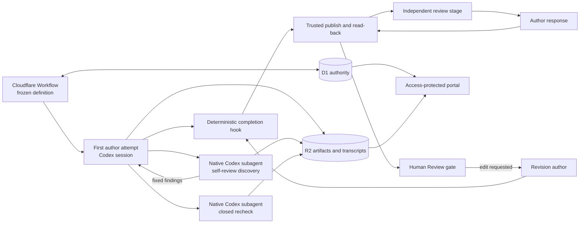

## Context

DEOS already freezes a workflow definition for each run, keeps workflow and
gate authority in D1, stores immutable evidence in R2, and lets only trusted
Worker adapters perform provider writes. The current OpenSpec flow already has
Codex authors, Codex review agents, deterministic completion checks, exact-head
publication, and human approval gates. See [proposal.md](proposal.md) for the
motivation and [the current architecture](../../../docs/current-architecture.md)
for those existing boundaries.

This change does not introduce another review service or another Sandbox tier.
The first self-review and its closed recheck run as native Codex subagents of
the live author session. The main workflow and portal must represent that fact:
self-review is child work inside the author step, while independent review
remains its own workflow stage. The runner must also retain enough of the Codex
event stream to open the parent and child transcripts separately.

The approved requirements are in the
[review-flow](specs/openspec-review-flow/spec.md),
[grounding](specs/grounded-openspec-agents/spec.md),
[fixed-workflow](specs/simplified-planning-workflow/spec.md), and
[observability](specs/workflow-observability/spec.md) delta specs. They require
one bounded self-review, one independent review, current sources and suitable
skills, stale-proof visibility after edits, and human approval. The design
below changes orchestration metadata and presentation around those existing
parts; it does not redesign agent isolation or provider access.

## Goals / Non-Goals

**Goals:**

- Run the two bounded self-review calls through Codex's native subagent
  mechanism inside the first author attempt.
- Enforce the discovery, optional author fix, and closed recheck counts in
  durable phase state so retries cannot create another semantic cycle.
- Capture an addressable transcript for the author and each review subagent and
  render those reviews inside the author step.
- Keep one independent review stage, preserve exact-head coverage, and return
  all later human revisions directly to the same human gate after checks.
- Give each role the checked inputs, native web search, and pinned skills named
  by its frozen job policy without widening its authority.

**Non-Goals:**

- Add a review Sandbox, a custom safe-browsing service, or a second agent
  orchestration system.
- Change author or reviewer model routes, provider adapters, or human approval
  authority.
- Add an operator-editable skill settings page. This change records and shows
  the effective frozen skill selection; changing that policy remains a
  versioned workflow-definition change.
- Re-run semantic review after independent-review responses or human edits.
- Rewrite historical graph or review proof.

## Component diagram

`SD` and `SR` are subagent calls made by the live Codex author session. They
are not Workflow nodes, DEOS attempts, or separately provisioned Sandboxes.
Their child identities and transcript ranges are evidence owned by the parent
attempt. Independent review remains a separate stage and uses the existing
review-agent execution path.

## Event flow

### First plan or design

1. The Workflow enters the first author node from the run's frozen definition.
   The trusted job builder supplies the declared plan files, the allowlisted
   architecture guides for design, the role's tool policy, and the pinned skill
   set. Each file and skill is named with its immutable identity or digest in
   the attempt input manifest.
2. The author creates the full phase artifact. The existing completion hook
   runs allowed-path, OpenSpec, whitespace, readability, and required-section
   checks. Self-review cannot start until those checks accept a candidate and
   trusted state records its digest.
3. The live author session starts one native Codex subagent with the accepted
   candidate, applicable requirements, checked context, reviewer instructions,
   and a structured finding schema. The subagent cannot change the author
   files. Its result is either a valid ordered finding set with stable IDs or a
   valid empty result. Sources used through web search are attached to the
   result and cited by the reviewer.
4. If discovery is empty, self-review ends. If it contains findings, the parent
   author receives the complete fixed set once and gets one repair turn. The
   repaired candidate must pass the same deterministic checks.
5. After a repair attempt, the author starts one native Codex recheck subagent.
   Its schema contains the discovery IDs as a closed set and permits only
   `fixed` or `open` for each ID. Trusted code rejects additional IDs and treats
   a missing or malformed rating as open. The recheck cannot request another
   author turn.
6. The supervisor captures parent and subagent events from the Codex JSONL
   stream as they occur. It stores one continuous author transcript plus a
   transcript view for each child invocation, all linked to the same DEOS
   attempt. The accepted candidate, discovery, repair outcome, recheck, open
   set, sources, and transcript manifests are persisted before publication.
7. Trusted publication updates the phase pull request and reads back its exact
   head. The Workflow then enters the one independent-review stage for the
   phase. One structurally valid result fills that phase's independent slot;
   concerns are saved as judgment input, not treated as a failed review.
8. One author-response job receives the complete concern set and records
   `applied`, `declined`, or `no_change` for every concern. It may update the
   artifact. Trusted checks, publication, and read-back save the current head.
   No second independent review runs.
9. The human gate opens after all required results and dispositions exist,
   checks pass, and publication read-back matches the current head. It shows
   the self-review findings and open set, the independent result and responses,
   the reviewed head, and the current head. Only a signed decision by an
   allowed person can leave the gate through an approval edge.

### Retry and recovery

The phase review cycle is created when the first checked candidate is accepted,
not when a process starts. Discovery, repair use, and recheck each have one
durable slot. Before making a subagent call, the supervisor records the child
invocation identity against the empty slot. A replay first reconciles that
identity and its captured result. It starts a replacement call only when the
prior call is terminal without an accepted result; a replacement may fill the
same slot but does not create another semantic pass.

If the author attempt ends after discovery, a replacement attempt receives the
same candidate, finding set, and remaining action. It cannot rediscover
findings. If the one repair turn was issued but its outcome is ambiguous, the
turn is treated as consumed and the last fully checked candidate is used for
the closed recheck. This favors visible open findings over an accidental second
repair. A failed recheck leaves its slot empty and fails the attempt with a
typed cause; an authenticated stage retry may reconcile or fill that same slot
without repeating discovery or repair.

### Human-requested revision

1. A signed user event at the active human gate selects the existing revision
   edge. The revision author receives the current artifact, bounded root review
   comments, the same checked plan and architecture context, and historical
   review proof marked as prior proof.
2. The author edits the artifact and supplies one short response for every
   affected root comment, stating what changed or why no change was made.
3. Trusted checks validate the artifact and complete response set. Publication
   updates the same pull request, reads back the new head, and posts each reply
   idempotently without resolving its thread.
4. The Workflow returns directly to a new visit of the same human gate. It does
   not allocate discovery, recheck, or independent-review work. The portal
   shows the prior reviewed head as stale when it differs from the current head
   and says that no new semantic review was due.

Further human requests repeat only this revision path.

### Grounding, web search, and skills

Role capabilities are declared in the versioned workflow job configuration and
frozen with the run. The attempt input manifest records the effective web-search
flag and the exact skill IDs and digests selected for that role. The portal may
show this manifest in a read-only “Context and tools” section so operators can
see which skills an author or reviewer received. No new mutable settings model
is needed for this change: policy edits create a new workflow definition and
do not alter active runs.

The runner exposes the existing native Codex web-search tool when the frozen
role policy enables it. This design does not add a custom browsing proxy or
grant generic provider credentials. Search and fetched pages are untrusted
inputs; they cannot change the job's allowed paths, provider rights, or gate
rules. A role cites every outside page it actually uses. If a current external
claim cannot be checked, the role omits the claim or fails rather than
presenting model memory as verified fact.

Skills are instruction bundles, not capabilities. The trusted job builder
selects them from the versioned allowlist by role and task, including the pinned
Cloudflare bundle when Cloudflare is in scope. A skill can use only tools the
job already has. Requests to write outside the role's file scope, call a
blocked provider, access a secret, or bypass the human gate remain denied by
the existing attempt contract.

## Decisions

### 1. Reuse native Codex subagents inside the author attempt

Self-review discovery and recheck use the Codex session's existing subagent
mechanism. The outer author attempt remains the only DEOS attempt and Sandbox
for this work. The trusted supervisor supplies structured inputs, observes
child lifecycle events, and validates structured results.

This matches the review's actual execution model and lets the portal attach
child transcripts to the author step. A separate Workflow node was rejected
because self-review must not appear as a phase. A separately provisioned review
Sandbox was rejected because it duplicates isolation and lifecycle machinery
that this change does not need.

### 2. Enforce bounds with phase slots, not graph loops

Each first phase has one discovery slot, one repair-used marker, one closed
recheck slot when findings exist, and one independent-review slot. Accepted
results are immutable and retries reconcile the existing slot. The trusted
controller, not reviewer prose, derives the final open set and decides whether
another call is allowed.

Prompt-only counting was rejected because a process retry could repeat work.
Adding more review nodes was rejected because it would make the graph and
portal contradict the required nested presentation.

### 3. Capture child transcript views from the parent Codex stream

The runner already captures a Codex JSONL stream for the author attempt. It
will preserve subagent start, message, tool, result, and finish events with a
stable child invocation ID. The evidence writer stores the complete parent log
and an indexed child view or child transcript object derived from those same
events. Both carry hashes and event counts.

The transcript API addresses an owner explicitly: an author attempt or a child
invocation. The portal uses the author owner for the main log and the child
owner for **View transcript** on a nested self-review row. Copying review text
into portal-only state was rejected because it would drift from the captured
execution evidence.

### 4. Keep independent review and exact-head truth unchanged

Independent review remains one top-level stage after the first publication.
The phase stores both the head reviewed independently and the latest published
head. Responses and human revisions may change the latter without changing the
former, so the portal must label coverage stale rather than imply a recheck.

Repeating independent review was rejected by the approved one-pass rule.
Hiding older proof was rejected because the human gate needs the finding and
coverage history.

### 5. Record skill policy in the frozen definition and effective selection in each attempt

The versioned workflow job configuration is the source of truth for skills
available to each role. The attempt manifest is the audit record of what was
actually supplied. The portal exposes that effective selection read-only.

An editable settings page was not selected because changing skill bundles is a
security- and reproducibility-sensitive workflow change, not per-run human
input. Arbitrary repository discovery was rejected because it would weaken the
checked-context proof.

### 6. Use the runtime's native web search rather than inventing a browsing boundary

Jobs opt into the web-search tool through their frozen role policy. The design
relies on the agent runner's existing tool integration and existing attempt
permissions; it adds no bespoke broker, fetcher, URL policy, or network service.
The implementation must verify the configured tool is present for every named
role and must capture citations in the artifact or review result.

A new safe-browsing service was rejected because it expands this change into a
new security product without an approved contract. Unrestricted provider
credentials were rejected because search must not widen job authority.

### 7. Derive both portal views from the durable review model

For the new flow version, the run view groups self-review child records under
their parent author attempt and keeps independent review top-level. The detail
view uses the same records to show discovery, repair, recheck, sources, open
findings, concern dispositions, and exact-head coverage.

Transcript responses have explicit `content`, `empty`, `unavailable`, and
`corrupt` states. A verified log with zero events is `empty` and renders “No
transcript content was captured.” A legacy job with no supported transcript
locator is `unavailable` and gets a clear explanatory message rather than an
error page. Missing or hash-invalid bytes for a required manifest are
`corrupt`; they are never described as empty.

## Minimal data model

These are logical additions to the existing attempt, review, evidence, and gate
records. They do not require one new table per row type.

| Record | Required fields | Purpose |
| --- | --- | --- |
| `phase_review_cycle` | run, phase, first candidate digest, originating author attempt, discovery slot, repair-used state, recheck slot, independent slot, reviewed head, current head | Enforces one bounded semantic cycle and exact-head coverage across retries. |
| `review_job` | review ID, cycle, kind, parent attempt, native child invocation ID when nested, input digest, result digest, outcome, model-route reference | Indexes discovery, closed recheck, and independent results without turning child reviews into Workflow nodes. |
| `review_finding` | review ID, stable finding ID, ordinal, summary, artifact location, status, author disposition or response | Keeps the immutable finding inventory and the trusted derived open set queryable. |
| `agent_input_manifest` | attempt, role, checked file paths and hashes, web-search flag, selected skill IDs and digests, effective capability digest | Extends the existing typed job input proof with grounding and tool selection. |
| `source_record` | job or review ID, source ID, URL, title, access time, supported claim or finding ID | Records only outside sources actually used and cited. |
| `transcript_manifest` | owner kind, owner ID, parent attempt, R2 object or event range, SHA-256, byte count, event count, format version | Opens the continuous author transcript or one nested subagent transcript with integrity and empty-state information. |
| `human_gate_binding` | run, phase, visit, pull-request identity, reviewed head, current head, open finding IDs, no-new-review reason | Shows the human exactly what proof covers and keeps approval visit-scoped. |

Large artifacts, review results, source details, and transcripts remain in
create-only R2 objects. D1 stores the identities, hashes, slot state, head
bindings, and fields needed for workflow decisions and portal queries. No
provider token, authorization header, raw credential, or secret is added.

## Failure modes

| Failure | Required behavior |
| --- | --- |
| A checked plan, architecture file, skill digest, or candidate hash does not match | Fail before starting the affected author or subagent. Do not substitute filesystem discovery or an older manifest. |
| The first draft fails deterministic checks | Keep the author in the existing bounded completion path. Do not allocate self-review. |
| Native discovery subagent exits without a valid result | Leave discovery unaccepted, preserve its child transcript, and fail with a typed cause. Retry reconciles that slot before another transport call. |
| Discovery returns no findings | Save an explicit empty result, mark repair and recheck not required, and continue to publication. |
| The one author repair fails checks or its completion is ambiguous | Mark the repair opportunity consumed and retain the last valid candidate for closed recheck. Do not grant another repair. |
| Recheck returns an unknown ID | Reject that item, record a protocol violation, and never add it to the frozen inventory. |
| Recheck omits or corrupts an original rating | Treat that original item as open and preserve the raw result for diagnosis. |
| Recheck subagent fails without a valid result | Leave the recheck slot empty and fail with a typed cause. An authenticated retry may fill only that same slot and cannot repeat discovery or repair. |
| Parent author attempt ends while child work is active | Stop through the existing attempt-cleanup path, retain captured events, and resume from durable phase slots in a replacement attempt. Do not create a separate Sandbox lifecycle for the child. |
| Duplicate delivery or process replay tries to accept another result | The slot compare-and-set loses and the controller reuses the accepted result. |
| Independent review has concerns | Save them and continue to the one author-response job; concerns do not fail the stage or approve the work. |
| Independent review or author response is structurally invalid | Keep the required slot or disposition set incomplete and do not open the human gate. |
| Publication succeeds but exact-head read-back is missing or differs | Record an ambiguous provider effect and hold gate entry until trusted reconciliation establishes the current head. |
| A human revision omits a bounded root-comment reply | Reject the response set before returning to the gate. Retry the stable reply operation and never resolve the thread. |
| A later human edit fails checks | Do not publish or start semantic review. Keep the revision on its typed failure path. |
| Native web search is absent for a role that needs a current fact | Omit the unsupported claim or fail the job; do not present memory as checked evidence. |
| A skill or web result asks for a forbidden action | Treat it as untrusted input and deny the action under the existing attempt capability. |
| A transcript manifest verifies and has zero events | Return `empty` and render the clear empty message, not an error page. |
| A supported legacy job has no displayable transcript | Return `unavailable` with a clear legacy message. Do not claim that missing evidence is empty. |
| Required transcript bytes are missing or fail their saved hash | Return `corrupt` for that job and show an integrity error without affecting other transcripts. |
| A new deployment reads an old run | Restore its frozen definition and render its historical graph and proof unchanged. Do not project nested reviews onto a flow version that did not define them. |

## Risks / Trade-offs

- **Native child events may differ across Codex runner versions** → Pin the
  runner/event format in the workflow definition, version the transcript
  adapter, and retain readers for formats referenced by stored runs.
- **A subagent shares the outer attempt boundary** → Keep reviewer instructions
  read-only, pass an immutable candidate, validate all outputs, and rely on the
  existing author file-scope checks before accepting any candidate.
- **Later heads are not semantically re-reviewed** → Show reviewed and current
  heads together, mark stale coverage clearly, and leave judgment with the
  human gate.
- **Frozen skill policies require deployment for changes** → Show effective
  skills in the portal and introduce editable settings only through a later
  change with explicit authorization and versioning requirements.
- **Legacy transcript evidence is inconsistent** → Distinguish verified empty,
  unavailable, and corrupt states instead of turning every absence into an
  error or an empty claim.

## Migration Plan

1. Add the nullable parent-attempt, native-child-invocation, transcript-owner,
   review-slot, source, and exact-head fields needed by the logical model.
   Keep historical rows and immutable R2 evidence unchanged.
2. Update the Codex supervisor to issue the bounded native subagent prompts,
   persist stable child identities and structured results, and split or index
   child events from the captured parent JSONL stream. Test empty discovery,
   one repair, closed-set violations, child failure, replay, and cleanup.
3. Add frozen role policies for web search and pinned skills to the new job
   definitions. Record the effective selection in each attempt manifest and
   verify that author, self-review, independent-review, response, and revision
   roles receive the required checked context without new provider rights.
4. Register a new immutable workflow version with unchanged model-route
   references. Its first-author jobs contain self-review; its independent
   stages remain top-level; its human-revision edges skip semantic review.
5. Update the workflow portal to nest child review rows under the author step,
   show the read-only context/tool manifest and exact-head coverage, address
   transcripts by owner ID, and render content, empty, unavailable, and corrupt
   states. Build and deploy the workflow portal from the DEOS root, read back
   the active Cloudflare version at 100% traffic, and verify the protected live
   pages.
6. Run a provider-originated canary from a test Linear issue through the new
   flow. Record provider delivery, Workflow state, D1/R2 review and transcript
   evidence, exact pull-request heads, and signed-in portal screenshots as
   separate proof. Do not present synthetic ingress or tests as
   provider-originated verification.
7. Roll back by selecting the prior workflow definition for new runs. Existing
   runs keep their frozen definitions, and portal readers for every already
   selected transcript format remain deployed.
