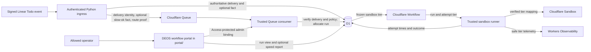

## Context

See `proposal.md` for the reason for this change. Authenticated Linear start
events pass through ingress and Queue handling before one guarded D1 write
allocates a run. The run then drives author and review attempts through a trusted
sandbox runner. The DEOS workflow portal in `portal/` reads durable run and
attempt facts from D1. BettaView in `portal/bettaview/` does not own this feature.

The tier choice must fit that authority model. It must come from the accepted
event, become part of the immutable run, and survive Queue replay, Workflow
replay, and agent retry. The sandbox must not hold Linear or Cloudflare
credentials. Existing route, workflow, model, review, and approval facts stay
unchanged.

The “tier trial” in the approved plan is an optional, operator-run speed
comparison after the feature is available. It is not a rollout mode, a new
workflow path, or an approval gate. It runs equivalent, predeclared issues once
on Basic and once on Standard-2, then reports elapsed time and outcomes without
choosing the long-term default.

The checked inputs do not define the exact Linear `Todo` webhook label shape or
the Cloudflare request value for either sandbox class. Before parser or adapter
implementation, the owner must inspect both primary contracts. They must trigger
real labeled and unlabeled Linear test events and create a real test sandbox of
each class. Fake requests cannot prove either provider contract.

## Goals / Non-Goals

**Goals:**

- Make one auditable tier choice while the run is allocated.
- Keep that choice stable for all author, review, repair, and retry attempts.
- Give sandbox creation one closed, typed value instead of label data.
- Expose the saved choice and comparable attempt timing in the DEOS portal.
- Stage the default change with an auditable stop control and no tier rewrite
  after a run starts.

**Non-Goals:**

- Resize a running sandbox or any non-agent Cloudflare service.
- Let agents, portal clients, or later Linear events select a tier.
- Change model routes, review edges, retry limits, or human gates.
- Use the optional speed comparison to choose the long-term default.

## Component Diagram

Ingress records only positive evidence that the authenticated event contained
the exact `slow-ok` label. If that evidence is not present, the fact is simply
missing; there is no separate `unavailable` state. The Queue consumer owns the
tier policy, rechecks the durable delivery, and freezes the result with the
other run facts. Workflow and runner code consume the saved result and never
receive label-based choice logic.

## Event Flow

1. Ingress authenticates the raw Linear body and accepts the `Todo` start event
   under the existing delivery and route checks. It inspects labels in that
   authenticated event. A label matches only when its provider name is the
   exact string `slow-ok`; there is no case folding or whitespace trimming.
2. When the exact label is present, ingress saves `start_slow_ok: true` on the
   accepted delivery. Otherwise that optional fact is missing, whether the
   event proves the label absent or does not contain usable label data. The
   Queue message carries the delivery identity, a copy of the optional fact,
   and the existing frozen route proof. Ingress does not fetch current labels.
3. The Queue consumer validates the route and repository rights as it does now,
   then loads the delivery by its queued identity. It requires exact agreement
   between the queued and durable presence of `start_slow_ok`; when present,
   the only valid value is `true`. A missing row, invalid value, or disagreement
   fails before allocation and never defaults a tier.
4. In the same guarded allocation, the consumer reads the route's
   `sandbox_standard2_enabled` value and control revision. When enabled, it maps
   positive `slow-ok` evidence to `basic` and a missing fact to `standard-2`.
   While staged rollout is disabled, it maps both cases to `basic`. The insert
   saves the tier, reason, and policy revision with the other frozen run facts.
   If the issue is a predeclared speed-comparison member, it also binds that
   member to this run exactly once.
5. A duplicate delivery cannot allocate a second run. A Queue replay that finds
   the run already allocated reads its saved tier and does not inspect the fact
   or route switch again.
6. Before any agent provider call, the runner creates the attempt row and copies
   the run tier into it. The runner rejects a missing, unknown, or mismatched
   tier. It maps the closed internal value to the provider's verified sandbox
   class and creates the sandbox under the existing deterministic attempt and
   sandbox identities.
7. Every path that allocates a new author, review, repair, or retry sandbox uses
   the same attempt reservation path. Same-sandbox author completion repair
   rounds create no attempt and retain their existing sandbox. No path accepts
   a tier override, and a later Linear label event cannot update either tier.
8. Trusted Worker time records attempt start just before the sandbox create call
   and attempt end at a terminal outcome. Both tiers use this UTC millisecond
   clock, the same stage names, and the same outcomes. Telemetry names the run,
   attempt, tier, stage, and outcome without storing the issue's label list.
9. For the optional speed comparison, an allowed operator first uses the
   Access-protected `/settings/sandbox-tier-trial` surface in the DEOS workflow
   portal to store an immutable manifest through the trusted Worker's internal
   admin binding. The manifest cannot change run selection or workflow policy.
   The report binds each planned issue to its run and includes a pair only when
   actual run tiers equal planned tiers and workload and frozen-control digests
   match. The normal run API and view always return `sandbox_tier` from the run.

## Minimal Data Model

Use a closed internal enum with values `basic` and `standard-2`. Convert those
values to `Basic` and `Standard-2` only at user-facing or provider adapter
boundaries.

| Record | Field | Purpose and rule |
| --- | --- | --- |
| Project workflow policy | `sandbox_standard2_enabled` and existing control revision | Access-protected rollout switch. `false` selects Basic for later allocations; `true` applies the event policy. Allocation freezes the observed revision on the run. |
| Accepted delivery | `start_slow_ok` | Optional positive fact. Store only `true` when the authenticated start event contains the exact label; otherwise leave it missing. The immutable delivery is authoritative, and the Queue copy must have the same presence. |
| Run | `sandbox_tier` | Required closed enum for post-migration allocations. Write it during guarded allocation, then never update it. A pre-activation null-to-`basic` compare-and-set is the sole legacy migration exception. This field is authoritative for later work and portal display. |
| Run | `sandbox_tier_source` | `event_slow_ok`, `event_default_standard2`, `rollout_basic`, or `legacy_basic`. This explains the choice without storing label names. |
| Run | `sandbox_tier_policy_revision` | Frozen revision of the route policy used at allocation. Legacy rows use the migration revision that supplied `legacy_basic`. |
| Agent attempt | `sandbox_tier` | Required copy of the run value, written before sandbox creation. A guarded insert or check prevents a different value. |
| Agent attempt | existing stage, start, end, and outcome fields | Reuse the authoritative attempt identity and lifecycle fields. Do not add another timing record or use sandbox-reported duration. |
| Speed-comparison member | comparison, pair, and issue IDs; workload and control digests; planned tier; launch order; bound run ID | Fields are immutable after the pre-launch write. Guarded run allocation may bind the run once. This records the benchmark assignment without affecting run authority. |

The run value is normalized authority. The attempt copy is deliberate
denormalization for proof and reporting. A consistency query must find zero
attempts whose tier differs from their run.

The optional speed report includes only complete pairs whose actual run tiers
match their planned tiers and whose workload digest, repository base, workflow
definition, model route, thought setting, and other frozen controls match. A
tier mismatch keeps the binding for audit, excludes the whole pair with reason
`planned_tier_mismatch`, and shows planned and actual values. For each tier and
stage, the report shows completed attempt count, median elapsed milliseconds,
first-pass success count, failed attempt count, and retry count, plus the paired
elapsed difference. Failed and later attempts stay in the sample but do not
count as first-pass success. Empty groups show zero and no median. Exclusions
remain visible. The report never ranks tiers or recommends a default.

## Decisions

### Store only positive event-time label evidence and choose at allocation

Ingress has the authenticated event body, so it is the only component that can
classify event-time evidence without another provider read. It stores the exact
`slow-ok` match as an optional positive fact. A missing fact covers every case
that lacks positive evidence because all such cases have the same approved
Standard-2 result. This avoids inventing another durable label state.

The Queue consumer already owns guarded run allocation, so it maps the fact to
a tier. The delivery row, rather than the Queue body, is authoritative; exact
presence comparison detects a stale or corrupt message. Querying Linear during
Queue work was rejected because it could observe later labels. Passing every
label was rejected because it stores unrelated provider data without improving
the decision.

### Make the run tier authoritative and copy it into every attempt

The run is allocated once and already freezes route and workflow controls. The
tier belongs with those facts. Attempts copy it before external creation so the
record proves what the runner requested. All attempt entry points use one
reservation function that accepts a run identity, not an optional tier.

Deriving the tier per attempt was rejected because retries and later review
paths could drift. Storing it only on attempts was rejected because the portal
could not state one authoritative run choice.

### Keep provider names behind one checked adapter mapping

Workflow code uses the closed enum. One sandbox adapter maps each value to the
exact Cloudflare resource class confirmed by the primary contract. An unknown
value fails before a provider request; there is no default mapping branch.

Spreading provider strings through workflow nodes would make audits and
provider changes harder. Provider omission as Standard-2 was rejected because
an API default can change and does not prove which class was requested.

### Fail closed instead of falling back to another tier

If the provider rejects or cannot supply the saved class, the attempt follows
the existing typed failure and retry path. A retry gets the same run tier. It
never tries the other class and never edits the run.

Automatic fallback would make the portal value false, mix benchmark cohorts,
and violate the frozen-run contract.

### Put rollout authority in the existing project route policy

The Access-protected DEOS workflow portal exposes
`sandbox_standard2_enabled` with existing project connection controls. Saves
use the trusted Worker's internal admin binding, advance the route's control
revision, and are append-only audited. Allocation freezes the revision. A
change affects later allocations only.

A deploy-time flag was rejected because emergency rollback would require a
release and would not share the durable route revision. Percentage selection
within one route was rejected because Standard-2 would no longer be the default
for otherwise eligible runs. Rollout therefore enables whole canary routes and
widens route by route.

### Keep the optional speed comparison separate from tier selection

Before results exist, the operator stores pairs of equivalent benchmark issues,
their workload and frozen-control digests, planned tiers, and launch order. One
issue has `slow-ok` before `Todo`; its pair does not. The report verifies each
planned tier against the actual run tier before comparing trusted Worker start
and end times.

An arbitrary run list or time window was rejected because different issue
content, repository state, concurrency, or warm-up could dominate the tier
effect. Sandbox CPU time alone was rejected because it omits startup and
orchestration. The comparison remains optional and cannot alter production run
selection.

## Failure Modes

| Failure | Required behavior |
| --- | --- |
| Event label data is missing, malformed, incomplete, or proves no exact match | Leave `start_slow_ok` missing. With event policy enabled, allocate `standard-2`; while rollout is disabled, allocate `basic`. Do not query Linear for replacement facts. |
| A real labeled test event cannot provide positive event-time label evidence | Stop before parser implementation and revise the approach. Do not ship a parser that misses the exact label. |
| Event has similar text such as `Slow-Ok` or `slow-ok ` | Leave `start_slow_ok` missing because only exact provider name equality matches. |
| Durable delivery is missing, has a value other than `true`, or disagrees with the Queue fact's presence | Fail before allocation and emit a bounded integrity cause. Do not map a tier or acknowledge successful Queue handling. |
| Delivery or Queue work is replayed | Reuse the delivery identity and saved run. Do not allocate again or recompute the tier. |
| D1 cannot atomically save the run and tier | Do not dispatch Workflow or acknowledge successful Queue handling. Let existing Queue retry policy retry the delivery. |
| A run or attempt has a missing or unknown tier | Fail before sandbox creation and record a bounded internal cause. Do not guess from labels, history, or provider defaults. |
| Attempt tier differs from run tier | Reject attempt reservation or creation, emit safe mismatch telemetry, and leave the run unchanged. |
| Cloudflare rejects or lacks the saved class | Mark the attempt through the existing typed failure path. Any allowed retry uses the same class. Never fall back. |
| Standard-2 creation reports capacity, quota, or concurrency failure during rollout | Stop widening, alert by tier and route, and turn off Standard-2 selection for later allocations on enabled canary routes. Existing Standard-2 runs retain their tier and retry fail-closed. |
| Sandbox creation has an ambiguous response | Reconcile using the deterministic sandbox identity before retrying. Any retry still uses the saved class. |
| Attempt lacks a terminal timestamp | Exclude it from elapsed-time aggregates until existing reconciliation supplies a terminal outcome; show it as incomplete in trace data. |
| Portal reads a corrupt or missing run tier | Show `Tier not recorded` and emit safe diagnostics. Do not infer a value from labels or an attempt. New writes must make this impossible. |
| A speed-comparison run differs from its planned tier | Retain the binding for audit, exclude the pair as `planned_tier_mismatch`, and show planned and actual values. |
| A speed-comparison group is small or empty | Show its sample count and no result where needed. Do not hide failures, rank tiers, or choose a default. |

## Risks / Trade-offs

- **[The primary Linear event may not carry usable label facts]** → Prove the
  labeled and unlabeled event contract before parser work. Stop for an upstream
  decision if the contract cannot support the Basic rule. A missing optional
  fact handles an isolated malformed event, not a provider contract that never
  exposes labels.
- **[Standard-2 can cost more without enough speed gain]** → Keep comparison
  rules, counts, elapsed time, outcomes, and retries visible. Make no automatic
  policy change from the report.
- **[Standard-2 demand can exhaust Sandbox capacity]** → Measure recent peak
  concurrency and account limits before activation. Canary whole routes, alert
  on creation outcomes by tier and route, and stop on the first explicit
  capacity, quota, or concurrency failure.
- **[A copied attempt field can drift from the run]** → Write it through one
  guarded reservation path and check for mismatch before provider calls and in
  operator validation.
- **[A provider API name may differ from the product label]** → Verify both real
  classes against the primary contract and isolate mapping in one adapter.
- **[A rollback could strand Standard-2 runs]** → Keep both enum values and
  adapter mappings supported until every such run is final.
- **[Median duration does not prove causation]** → Show the comparison controls
  and all outcome counts. Treat the report as evidence, not a verdict.

## Migration Plan

1. Inspect the primary Linear webhook contract and move real test issues to
   `Todo` with and without the exact label. Confirm that the signed event exposes
   positive event-time evidence. Inspect the primary Cloudflare sandbox contract
   and create one real test sandbox of each class. Stop and revise the design if
   either provider contract cannot support the required behavior.
2. Add the optional delivery fact, nullable run and attempt tier fields, route
   switch, frozen run policy revision, and optional speed-comparison table.
   Initialize every route switch to `false`. Deploy readers that understand both
   tier values and a temporary missing legacy value.
3. While every switch is `false`, deploy compatibility writers on every run and
   attempt creation path. New runs explicitly save `basic` with source
   `rollout_basic`; new attempts copy their run. For an allocated legacy run
   that is null, allow one guarded `WHERE sandbox_tier IS NULL` compare-and-set
   to `basic` with source `legacy_basic`. Never update a non-null tier.
4. Before any switch becomes `true`, backfill remaining pre-cutover runs from
   null to `basic` with the same null-only compare-and-set. Backfill attempts
   from their run in guarded batches and reject mismatches. Do not reconstruct
   old optional label facts from current Linear labels.
5. Verify that no run or attempt tier is null, every value is in the closed enum,
   every attempt matches its run, and active pre-cutover runs remain Basic.
   Remove the legacy null writer, require run and attempt tiers, and only then
   permit route switches to become `true`. No run-tier update path remains.
6. Deploy the verified ingress classifier, durable-delivery recheck, Queue
   choice, optional comparison manifest, DEOS workflow portal fields and report,
   and sandbox adapter while switches remain `false`. Test exact and missing
   facts, invalid values, Queue disagreement, duplicate delivery, replay, every
   new-sandbox role, same-sandbox repair, retry, attempt mismatch, planned-tier
   mismatch, and provider rejection.
7. Before activation, record Sandbox class availability, concurrency and quota
   limits, recent peak concurrent sandboxes, and headroom for author and review
   retries. Add creation-failure alerts grouped by tier and route with explicit
   capacity, quota, and concurrency causes.
8. Enable Standard-2 on one low-volume canary route. Repeat provider-originated
   Linear checks for both label choices. Use read-only D1 evidence to prove the
   policy revision and one tier per run and attempt. Capture the DEOS workflow
   portal run view. If operators run the optional speed comparison, also capture
   its Access-protected report. Keep synthetic ingress, provider-originated, and
   visual proof separate.
9. Observe at least 20 Standard-2 creation attempts on the canary. Do not widen
   after any explicit capacity, quota, or concurrency failure, any tier mismatch,
   or a Standard-2 creation-failure rate above 5%. On a stop condition, set the
   canary route switch to `false` and require a new clean window. Otherwise
   enable remaining routes one at a time with the same rule.
10. Roll back by setting every route switch to `false`, selecting Basic only for
    later allocations without a deploy. Do not rewrite existing runs. The
    deployed version must still create Standard-2 retries for saved Standard-2
    runs. Keep both adapter mappings and additive fields until all compatible
    versions and active Standard-2 runs are gone.
