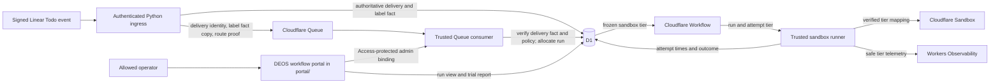

## Context

See `proposal.md` for the reason for this change. Today, authenticated Linear
start events pass through ingress and Queue handling before one guarded D1 write
allocates a run. The run then drives author and review attempts through a trusted
sandbox runner. The portal reads durable run and attempt facts from D1.

The tier choice must fit that authority model. It must come from the accepted
event, become part of the immutable run, and survive Queue replay, Workflow
replay, and agent retry. The sandbox must not hold Linear or Cloudflare
credentials. Existing route, workflow, model, review, and approval facts stay
unchanged. The DEOS workflow portal in `portal/` owns the run-tier view, trial
report, and rollout control. BettaView in `portal/bettaview/` does not.

The checked inputs do not define the exact Linear `Todo` webhook label shape or
the Cloudflare request value for either sandbox class. Before any parser or
adapter implementation, the owner must inspect both primary contracts. They must
trigger real labeled and unlabeled Linear test events and create a real test
sandbox of each class. Fake requests cannot prove either provider contract.

## Goals / Non-Goals

**Goals:**

- Make one auditable tier choice while the run is allocated.
- Keep that choice stable for all author, review, repair, and retry attempts.
- Give sandbox creation one closed, typed value instead of label data.
- Expose the saved choice and comparable attempt timing in the portal.
- Stage the default change with an auditable stop control and no tier rewrite
  after a run starts.

**Non-Goals:**

- Resize a running sandbox or any non-agent Cloudflare service.
- Let agents, portal clients, or later Linear events select a tier.
- Change model routes, review edges, retry limits, or human gates.
- Draw a long-term cost or speed conclusion from the first trial.

## Component Diagram

Ingress derives only an event-time label fact. The Queue consumer owns the
tier policy, rechecks the durable delivery fact, and freezes the result with the
other run facts. The same trusted Worker handles the existing internal admin
binding for rollout policy and trial setup. The Workflow and runner consume the
saved result. They never receive label-based choice logic.

## Event Flow

1. Ingress authenticates the raw Linear body and accepts the `Todo` start event
   under the existing delivery and route checks. It inspects the labels in that
   authenticated event. A label matches only when its provider name is the
   exact string `slow-ok`. There is no case folding or whitespace trimming.
2. Ingress records a three-state label fact on the accepted delivery:
   `present`, `absent`, or `unavailable`. Missing, malformed, or incomplete
   event label data becomes `unavailable`. The durable delivery row is the
   authority. The Queue message carries its delivery identity, a copy of the
   fact, and the existing frozen route proof. Ingress does not fetch current
   issue labels.
3. The Queue consumer validates the route and repository rights as it does now,
   then loads the delivery row by the queued identity. It requires a known fact
   and exact equality between the queued copy and durable value. A missing row,
   invalid enum, or mismatch fails before allocation; it never defaults a tier.
   In the same guarded allocation, the consumer reads the route's
   `sandbox_standard2_enabled` value and control revision. When enabled, it maps
   `present` to `basic` and both other valid facts to `standard-2`. While staged
   rollout is disabled, it maps every valid fact to `basic`. The insert stores
   the tier, reason, and policy revision with the other frozen run facts. If the
   issue is a predeclared trial member, it also binds that member to this run
   exactly once.
4. A duplicate delivery cannot allocate a second run. A Queue replay that finds
   the run already allocated reads its saved tier and does not evaluate label
   facts again.
5. Before any agent provider call, the runner creates the attempt row and copies
   the run tier into it. The runner rejects a missing, unknown, or mismatched
   tier. It then maps the closed internal value to the provider's verified
   sandbox class and creates the sandbox under the existing deterministic
   attempt and sandbox identities.
6. Every path that allocates a new author, review, repair, or retry sandbox uses
   the same attempt reservation path and copies the run tier. Same-sandbox author
   completion repair rounds create no attempt and keep the tier of their existing
   sandbox. No path accepts an override. A later Linear label event cannot update
   either tier field.
7. Trusted Worker time records attempt start just before the sandbox create call
   and attempt end when the attempt reaches a terminal outcome. Both tiers use
   this UTC millisecond clock, the same stage names, and the same outcome set.
   Sandbox-local clocks are not used for the comparison. Start and end
   telemetry names the run, attempt, tier, stage, and outcome with no label list.
8. Before trial events start, an allowed operator uses the Access-protected DEOS
   workflow portal to store the immutable pair manifest through the trusted
   Worker's internal admin binding. Manifest writes cannot change run selection
   or workflow policy.
9. The DEOS workflow portal's existing run API and view return the value from the
   run row. Its Access-protected `/settings/sandbox-tier-trial` surface owns the
   manifest action and report. Attempt trace data returns each copied value. The
   report binds predeclared issue pairs to their runs and compares only pairs
   whose actual run tiers equal their planned tiers and whose workload and
   frozen-control digests match.

## Minimal Data Model

Use a closed internal enum with values `basic` and `standard-2`. Convert those
values to the labels `Basic` and `Standard-2` only at user-facing or provider
adapter boundaries.

| Record | Field | Purpose and rule |
| --- | --- | --- |
| Project workflow policy | `sandbox_standard2_enabled` and existing control revision | Access-protected, operator-controlled rollout switch. `false` selects Basic for later allocations; `true` applies the event policy. A guarded allocation freezes the observed revision on the run. |
| Accepted delivery | `start_label_fact` | Required `present`, `absent`, or `unavailable`, derived once from the authenticated start event. The immutable row is authoritative; the Queue copy must match it. |
| Run | `sandbox_tier` | Required closed enum for post-migration allocations. It is written in the guarded run allocation and is then immutable. The sole migration exception is one pre-activation null-to-`basic` compare-and-set for a legacy run. This is the authority for later work and portal display. |
| Run | `sandbox_tier_source` | `event_slow_ok`, `event_without_slow_ok`, `event_labels_unavailable`, `rollout_basic`, or `legacy_basic`. This explains the choice without storing all label names. |
| Run | `sandbox_tier_policy_revision` | Frozen revision of the route policy used at allocation. Legacy rows use the migration revision that supplied `legacy_basic`. |
| Agent attempt | `sandbox_tier` | Required copy of the run value, written before sandbox creation. A guarded insert or check prevents a different value. |
| Agent attempt | existing stage, start, end, and outcome fields | Reuse the authoritative attempt identity and lifecycle fields. Do not add a second timing record or a sandbox-reported duration. |
| Trial member | trial, pair, and issue IDs; workload and control digests; planned tier; random seed; launch order; bound run ID | Manifest fields are immutable after the pre-launch write. Guarded run allocation may set the bound run ID once. The row records assignment without affecting run authority. |

The run value is normalized data authority, while the attempt copy is deliberate
denormalization for proof and reporting. The copy lets an operator detect a bad
creation path without joining provider logs. A consistency query must find zero
attempts whose tier differs from their run.

The report includes only complete pairs whose two bound runs have the planned
tiers and whose workload digest, repository base, workflow definition, model
route, thought setting, and other frozen controls match their manifest. Binding
is retained for audit when a tier differs, but the report excludes the whole
pair with the visible reason `planned_tier_mismatch` and shows planned and actual
tiers. For each tier and stage, it reports completed attempt count, median
elapsed milliseconds, first-pass success count, failed attempt count, and retry
count. It also reports the paired elapsed difference. A first-pass success is
the earliest attempt for one run and stage when that attempt succeeds. Failed
and later attempts stay in the sample but not in first-pass success. Empty
groups show zero and no median. Excluded pairs and reasons remain visible. The
report does not rank tiers or recommend a default.

## Decisions

### Derive a three-state fact at ingress and choose the tier at allocation

Ingress has the authenticated event body, so it is the only component that can
classify event-time label evidence without another provider read. The Queue
consumer already owns guarded run allocation, so it owns the policy that maps
that evidence to a tier. This split keeps authentication and policy separate.

The alternative was to query Linear when Queue work starts. That could observe
a later label state and would break replay stability. Another alternative was
to pass every label into the run. The three-state fact is smaller and keeps
unrelated provider data out of durable workflow state.

The delivery row, rather than the Queue body, is authoritative because ingress
has already authenticated and persisted it. Comparing the Queue copy detects a
corrupt or stale message while preserving the current route-proof pattern.

### Make the run tier authoritative and copy it into every attempt

The run is allocated once and already freezes route and workflow controls. The
tier belongs with those facts. Attempts copy it before any external creation so
their records prove what the runner requested. All attempt entry points use one
reservation function that accepts a run identity, not an optional tier.

The alternative was to derive the tier per attempt. That would let retries or
new review paths drift after a label change. Storing only on attempts was also
rejected because the portal could not state one authoritative run choice.

### Keep provider names behind one checked adapter mapping

Workflow code uses the closed internal enum. One sandbox adapter maps each value
to the exact Cloudflare resource class confirmed by the primary contract. An
unknown value fails before a provider request. There is no default branch in
this mapping.

The alternative was to spread provider strings through workflow nodes. That
would make policy audits and provider changes harder. Treating provider omission
as Standard-2 was rejected because an API default can change and gives weak
proof of the requested class.

### Fail closed instead of falling back to another tier

If the provider rejects or cannot supply the saved class, the attempt follows
the existing typed failure and retry path. A retry creates a new attempt with
the same run tier. It never tries the other class and never edits the run.

Automatic fallback was rejected because it would make the portal value false,
mix trial cohorts, and violate the frozen-run contract.

### Put rollout authority in the existing project route policy

The Access-protected DEOS workflow portal exposes
`sandbox_standard2_enabled` with the existing project connection controls. Its
save travels through the trusted Worker's internal admin binding, advances the
route's control revision, and is append-only audited like other Settings access.
The Queue consumer reads it during guarded allocation and freezes the revision.
Changing it affects only later allocations; existing runs keep their tiers.

A deploy-time flag was rejected because it would make emergency rollback depend
on a release and would not leave the selection control beside the durable route
revision. A percentage decision inside one enabled route was rejected because
it would make Standard-2 cease to be the default for otherwise eligible runs.
Staging therefore enables whole canary routes before widening route by route.

### Use paired randomized workloads and trusted lifecycle time for the trial

Before outcomes are visible, the operator stores an immutable trial manifest.
Each pair names two copies of the same benchmark, its workload digest, repository
base commit, workflow definition, model and control revisions, planned tier, and
randomized launch order. The Basic member has `slow-ok` before `Todo`; the
Standard-2 member does not. The pair starts in one short window. Repeated pairs
randomize tier assignment to the copies and launch order to spread concurrency
and warm-up effects.

The report binds each issue to its allocated run. It rejects or clearly excludes
a pair when an actual tier differs from its planned tier or when workload or
frozen controls differ. Trusted Worker start and end times then produce per-tier
results and paired elapsed-time differences.

An arbitrary run list or time window was rejected because issue content, base
state, concurrency, and warm-up could dominate the tier effect. Sandbox CPU time
alone was rejected because it omits startup and orchestration cost.

## Failure Modes

| Failure | Required behavior |
| --- | --- |
| Event labels are missing, malformed, or incomplete | Record `unavailable`. With the event policy enabled, allocate `standard-2`; during the pre-activation migration window, follow the disabled route switch and allocate `basic`. Do not query Linear for replacement facts. |
| A real labeled test event has no event-time label facts | Stop before parser implementation and revise the approach. Do not ship a path that always classifies labels as `unavailable`. |
| Event has similar text such as `Slow-Ok` or `slow-ok ` | Record `absent` because only exact provider name equality matches. |
| Durable delivery fact is missing, invalid, or differs from the Queue copy | Fail before run allocation and emit a bounded integrity cause. Do not map the value or acknowledge successful Queue handling. |
| Delivery or Queue work is replayed | Reuse the delivery identity and saved run. Do not allocate again or recompute the tier. |
| D1 cannot atomically save the run and tier | Do not dispatch the Workflow or acknowledge successful Queue handling. Let the existing Queue retry policy retry the same delivery. |
| A run or attempt has a missing or unknown tier | Fail before sandbox creation and record a bounded internal cause. Do not guess from labels, history, or provider defaults. |
| Attempt tier differs from run tier | Reject the attempt reservation or creation. Emit safe mismatch telemetry and leave the run unchanged. |
| Cloudflare rejects or lacks the saved class | Mark the attempt through the existing typed failure path. Any allowed retry uses the same class. Never fall back. |
| Standard-2 creation reports a capacity, quota, or concurrency cause during rollout | Stop widening immediately, alert on the tier and route, and turn off Standard-2 selection for later allocations on enabled canary routes. Existing Standard-2 runs retain their tier and retry fail-closed. |
| Sandbox creation has an ambiguous response | Reconcile with the existing deterministic sandbox identity before retrying. A retry still uses the same saved class. |
| Attempt starts but no terminal timestamp is recorded | Keep it out of elapsed-time aggregates until existing cleanup or reconciliation gives it a terminal outcome. Show it as incomplete in trace data. |
| Portal reads a corrupt or missing tier | Show an explicit unavailable state and emit safe diagnostics. Do not infer a value from current labels or one attempt. New writes must make this state impossible. |
| A trial member's bound run differs from its planned tier | Keep the binding for audit, exclude the whole pair as `planned_tier_mismatch`, and show both planned and actual tiers. |
| A trial group is small or empty | Show the sample count and no result where needed. Do not hide failures, rank tiers, or choose a default. |

## Risks / Trade-offs

- **[The primary Linear event may not carry usable label facts]** → Prove the
  labeled and unlabeled event contract before parser work. Stop for an upstream
  decision if the contract cannot support the Basic rule. Reserve `unavailable`
  for an isolated event whose normally supplied facts are missing or malformed.
- **[Standard-2 can cost more without enough speed gain]** → Keep cohort rules,
  counts, elapsed time, outcomes, and retries visible. Make no automatic policy
  change from the report.
- **[Standard-2 demand can exhaust Sandbox capacity]** → Measure current peak
  concurrency and account limits before activation. Canary whole routes first,
  alert on creation outcomes by tier and route, and stop on the first explicit
  capacity, quota, or concurrency failure. Do not widen while any such alert is
  open.
- **[A copied attempt field can drift from the run]** → Write it through one
  guarded reservation path and check for mismatches before provider calls and
  in operator validation.
- **[A provider API name may differ from the product label]** → Verify both real
  classes against the primary contract and isolate the mapping in one adapter.
- **[A rollback could strand Standard-2 runs]** → Keep both enum values and both
  adapter mappings supported until every such run is final.
- **[Median duration does not prove causation]** → Show the cohort controls and
  all outcome counts. Treat the report as trial evidence, not a verdict.

## Migration Plan

1. Before parser or adapter code is written, inspect the primary Linear webhook
   contract and move real test issues to `Todo` with and without the exact label.
   Confirm that the signed event contains usable event-time label facts. Also
   inspect the primary Cloudflare sandbox contract and create one real test
   sandbox of each class. If a labeled Linear event cannot supply the needed
   facts, stop and revise the plan; `unavailable` is not a substitute for a
   provider contract that never exposes labels.
2. Add nullable delivery, run, and attempt tier fields, the route-policy switch,
   frozen run policy revision, and the trial manifest table. Initialize every
   route's switch to `false`. Deploy readers that understand both tier values
   and a temporary missing legacy value.
3. While every route switch is `false`, deploy compatibility writers on every
   run and attempt creation path. New runs explicitly save `basic` with source
   `rollout_basic`. New attempts copy their run value. For an allocated legacy
   run that is still null, allow exactly one guarded `WHERE sandbox_tier IS NULL`
   compare-and-set to `basic` with source `legacy_basic`; a lost comparison reads
   and uses the winner. Never update a non-null tier. This release must already
   understand both tier values so later rollback remains safe.
4. Before any switch becomes `true`, backfill every remaining pre-cutover run
   from null to `basic` with source `legacy_basic`, using the same null-only
   compare-and-set. Backfill attempts from their run in guarded batches and
   reject mismatches. Backfill accepted start deliveries only when their event
   fact is already provable; otherwise use `unavailable`. Never read current
   Linear labels for the backfill.
5. Check that no run or attempt tier is null, every run has one valid tier, every
   attempt matches its run, and active pre-cutover runs remain Basic. Remove the
   legacy null writer, enforce required run and attempt values, and then permit
   route switches to become `true`. After this point no run tier update path
   exists.
6. Deploy the verified ingress classifier, durable-delivery recheck, Queue
   choice, trial manifest, DEOS workflow portal fields and report, and sandbox
   mapping while all switches remain `false`. Test exact, absent, unavailable,
   missing, invalid, and mismatched label facts; duplicate delivery; Queue replay;
   every new-sandbox role; same-sandbox repair; retry; tier mismatch; trial
   planned-tier mismatch; and provider rejection.
7. Before activation, record the account's Sandbox class availability,
   concurrency and quota limits, recent peak concurrent sandboxes, and headroom
   for author plus review retries. Add alerts grouped by tier and route for
   creation failures, with explicit capacity, quota, and concurrency causes.
8. Enable Standard-2 on one low-volume canary route. Repeat provider-originated
   Linear checks for both label choices. Use read-only D1 evidence to prove the
   policy revision and one tier per run and attempt. Capture the DEOS workflow
   portal run view and Access-protected trial report, keeping synthetic ingress
   proof separate from provider-originated and visual proof.
9. Observe at least 20 Standard-2 sandbox creation attempts on the canary. Do not
   widen if any explicit capacity, quota, or concurrency failure occurs, if any
   tier mismatch exists, or if the Standard-2 creation-failure rate exceeds 5%.
   On a stop condition, set the canary route switch to `false`, investigate, and
   require a new clean canary window before widening. Otherwise enable remaining
   routes one at a time with the same stop rule.
10. Roll back by setting every route switch to `false`, which selects Basic only
   for later allocations without a deploy. Do not rewrite existing runs. The
   deployed version must still create Standard-2 retries for runs that saved that
   tier. Keep both adapter mappings and additive fields until all compatible
   versions and active Standard-2 runs are gone.
