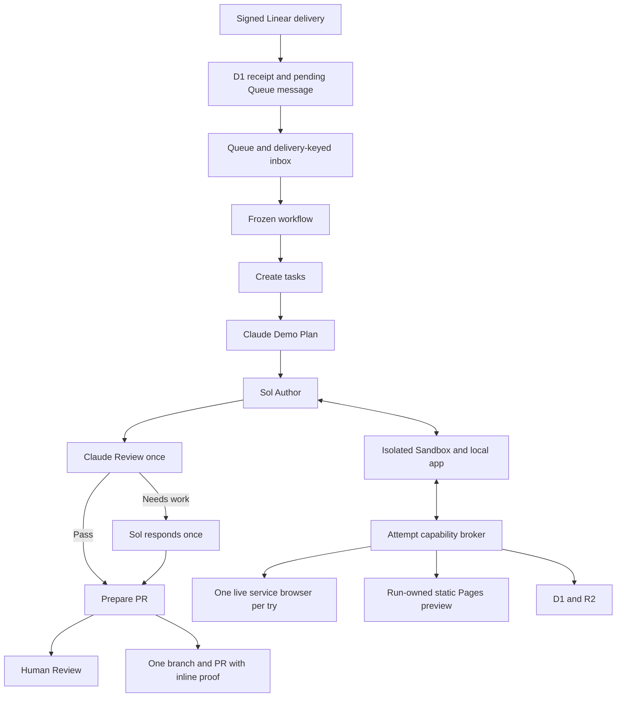

## Context

SAC-172 extends the approved planning and design flow into cloud implementation.
SAC-182 and SAC-225 exposed faults in continuation, capture, previews and publishing.
This design incorporates the user's 16 September corrections and replaces the
retired machine quality gates. See `docs/implementation-canary-lessons.md` for
the detailed lessons and `container/skills/deos-implementation/SKILL.md` for the
instructions shipped to each author.

The calculator reached its PR with supervision. It need not merge or release.
SAC-182 stays parked while small web-app canaries test unattended delivery.

## Goals / Non-Goals

- Continue from approved design to a reviewable implementation PR in Cloudflare.
- Provide current docs, an isolated app, a browser and durable preview publishing.
- Preserve accepted context and completed work across retries and human replies.
- Show useful behavior proof; keep internal detail and errors in transcripts.
- Keep approval, merge and live release under human authority.

The workflow does not judge code quality, tests, screenshot meaning, coverage,
evidence freshness or Claude's judgment. It does not run an automatic review loop.
Agents receive no personal browser state, provider keys or production release
authority. Static previews are not a general backend deployment tool.

## Component Diagram

## Decisions

### Preserve the run and approved inputs

The service reads back the design merge and supplies the approved proposal, specs
and design as files. A run retains its stable branch, approved design identity,
policy, human identity and frozen definition. Each execution try gets fresh compute
and isolated local data. Saved patches restore cumulative work; a retry does not
regenerate the proposal, design or implementation.

New runs select the new definition. Deployment alone cannot alter an old run.
An authenticated upgrade records source and target definitions, the failed attempt
and visit, approved input and saved work. It rejects active attempts or incompatible
gates. Activation-only mode changes the definition while retaining the failed
state, visit, workflow instance and work. SAC-182 uses this mode without resuming.

### Give judgment to agents and the human

Claude chooses useful demos from the approved artifacts and available capabilities.
Their number follows the implementation; there is no five-image quota. Sol implements,
runs useful checks, starts the app and captures behavior. A fresh Claude session
reviews the first implementation once. The workflow forwards its Pass, Needs work
or Blocked response unchanged.

Needs work returns to Sol once, then the result goes to human PR review. The workflow
neither generates repairs nor judges whether findings were satisfied. It does not
ask Claude again automatically. Later human revisions also return through Sol to
the same PR and human gate. The original review remains historical context.

Blocked uses clarification. Execution failures preserve original errors and can
retry the failed stage. Routing formats, authenticated attempts and safe filesystem
and provider boundaries remain transport contracts, not quality judgments.

### Keep accepted human answers in context

Each accepted question and answer retains its source identity after the question
closes. Sol and Claude receive that history and apply relevant later direction over
older assumptions or demo instructions. A reply does not grant provider permissions.

Ordinary clarification resumes Author with the ready demo plan. A missing or blocked
plan returns to Demo Plan. Claude may revise recommendations in response to accepted
answers; the workflow enforces no monotonic scenario-count or coverage rule.
Prior plans remain available in history.

Clarification requires a new trusted comment from the run's allowed human on the
same issue after the question. Text does not establish identity. Final implementation
choices remain separate state events: In Progress requests revision; Merging
authorizes the merge path.

### Ship a working development path

The container installs the implementation skill and a readable runtime guide.
Prompts and command help point to scratch-file placement, current docs, CA setup,
localhost checks, previews, ordered demos, publication and recovery. Shell hooks
and checked commands supply the Cloudflare CA without disabling TLS verification.

Requests and scratch scripts stay outside the repository. Native search and the
document broker provide current primary docs. Apps use per-try workerd data or an
isolated static server. Local health checks use localhost. The service browser uses
the public preview transport. A pending quick tunnel is reconciled through its saved
identity and health response, rather than repeatedly allocated. Browser capacity
waits and cleanup likewise preserve ownership.

If public relay readiness fails after local startup, retain the healthy app and
its test data. An identical preview request reconciles the same tunnel without
spawning another local process. Local startup failures still clean up.

After a browser connection failure, retain provider inventory and available
session history with the original error. A scenario reset may replace a session
confirmed absent from inventory once per active try, using the same origins.
Archive the old resource receipt before allocation. Keep ambiguous allocation
quarantined and ask for help if the replacement also ends. Never silently replay
an individual action whose response was lost or restart completed agent stages.

### Capture whole scenarios without interleaving

One saved `demo` request holds the runtime queue for its entire scenario list.
Each scenario starts with a fresh browser context, fixed target and viewport,
known data, ordered actions and explicit screenshot checkpoints. The author resets
server fixtures when needed; a fresh browser context does not reset a database.
The app and harness stay fixed during capture.

An action failure stops collection and retains its cause and partial artifacts.
The author fixes it and reruns from zero. Only a complete selected gallery reaches
the PR; exploratory and partial captures stay diagnostic. Each checkpoint owns its
caption even if two images have identical bytes. The workflow does not judge image
meaning or require a collection to pass before accepting agent completion.

### Publish static previews through the trusted service

The `static-preview-v1` capability reads a dedicated build directory as the
unprivileged author. The trusted publisher accepts bounded static files, not Worker
code, bindings, secrets or deploy scripts. It chooses a separate direct-upload Pages
project per run and a nonproduction review branch. Provider keys stay in the Worker.

Build bytes are saved in R2 and publication state in D1 before the provider write.
A lost response is reconciled by a unique deployment marker before another write.
Provider read-back and served asset hashes establish what was uploaded. A stable
run-owned alias fits the browser's fixed origins; the immutable deployment URL is
the human review link and survives sandbox cleanup.

Sol decides when edits require rebuilding and republishing. Preview revision is
context, not a completion gate. Authenticated maintainer-preview registration
remains available for recovery. Backend demos use the isolated local runtime unless
a separate safe adapter is available.

### Recover the failed operation

Agent retries restore patch, tasks, accepted plan, human answers and prior results.
Sol decides which checks to repeat after actual edits. Publication retries reuse
the saved candidate and reconcile the branch, proof commit and PR. They do not
rerun completed agent stages.

Identical provider requests reuse an operation ID; changed data uses a new ID.
Ambiguous writes require read-back. Original messages, stacks, causes and context
survive cleanup. Diagnostic failures must not mask the first error.

Linear ingress saves the delivery and pending Queue payload in one D1 transaction.
Immediate dispatch and scheduled replay share a lease. Only confirmed Queue delivery
marks the handoff complete. A lost successful response may resend the same delivery
identity; the consumer inbox deduplicates it. HTTP 200 follows durable acceptance.

If publishing finished code fails, save the error, post one concrete Linear question,
and wait. The accepted answer resumes Sol with saved work, without expanding
permissions or automatically repeating Claude's review.

### Package useful proof

The PR contains the issue title, implementation/release statement, Linear link,
approved Proposal and Specs PR, approved design PR, numbered images with explanations,
and one Showboat link. Include a durable preview URL when available. Internal tests,
check dumps and agent discussion remain in transcripts.

Selected images and Showboat live on a content-addressed proof branch in the same
GitHub repository. Commit-pinned links render under GitHub's access rules without
changing the implementation head. Nonvisual behavior enters Showboat only when
explicitly selected for review; command logs and browser measurements default to
diagnostics.

The publisher protects the reserved branch and reconciles one PR. Evidence origin
and revision remain context. Tests, checklists, citations, evidence kinds or freshness
do not become completion gates.

### Preserve the portal and human authority

Use existing map styling. Demo Plan, Author, Claude Review, Prepare PR and Human
Review reflect actual stages. Author's task meter opens an accessible checklist.
A full count does not mean review or publication is finished. Task changes signal
the workflow; heartbeat polling recovers missed signals. Transcripts retain current
commands, elapsed work, failures and explicit waits.
The watcher resends transiently failed signals with capped backoff until accepted
or its attempt deadline. Credential rejection stops the watcher. It never invents
progress counts or changes a workflow decision.

Only the allowed human's saved event permits revision or merge. The merge service
checks that event against the PR head and branch identity. Agent output is never
approval. Code merged and live released are separate states; this flow has no
production release step.

## Rollout and canaries

Apply additive migrations, validate the runtime and provider paths, deploy backend
and ingress, and read back active versions at 100% traffic plus the expected healthy
container image. Deploy the separate staging portal when its contract changes.
Backend work must not overwrite BettaView.

Select the new definition for sample-project runs. Migrate SAC-182 with activation-only
mode, comparing approved inputs, patch, branch, PR and human binding before and after.
Keep it stopped.

Choose another small web app with the user after activation. Exercise proposal/specs,
design, implementation, real browser demos, one Claude review and PR publication.
Record every supervisor intervention and fix its general cause. Do not finish the
sample locally and claim unattended success. A small static app does not prove
arbitrary integrations, backend deployments or concurrent whole-run isolation.

Rollback retains additive data and immutable history. A frozen upgraded run that
an older runtime cannot support stays stopped; rollback does not downgrade its
definition, discard work, merge its PR or release its code.
