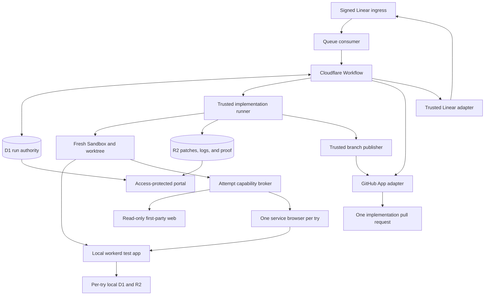
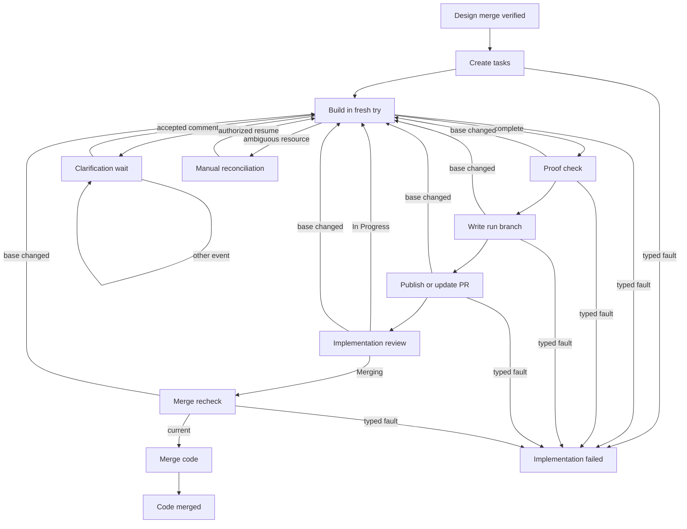
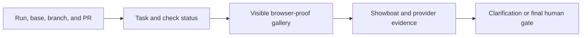

## Context

The current flow already freezes its workflow definition, repository route,
GitHub App installation, and control revisions for each run. It also restores
checked patches from R2 into a fresh Sandbox and keeps provider keys in the
trusted Worker. This design extends those boundaries after the design merge.
See `proposal.md` for the reason for the change and the delta specs for the
required behavior.

The implementation stage starts only from a merge commit that the trusted
service has read from the base branch. The approved proposal, delta specs, and
design at that commit form the implementation contract. A later base-branch
head may include other work, so proof must bind both the approved design commit
and the exact base head used for the check.

Cloudflare states that each Sandbox has separate filesystem, process, and
network isolation. It also says that the application must add authentication
and authorization around a Sandbox. This supports a Sandbox per try, but not
trust based on a Sandbox ID alone
([Cloudflare Sandbox security](https://developers.cloudflare.com/sandbox/concepts/security/)).

## Goals / Non-Goals

**Goals:**

- Add one immutable workflow version that continues from a checked design merge
  through tasks, implementation, proof, and implementation review.
- Give every run a stable implementation branch and every try fresh compute,
  browser, preview, and test identities.
- Keep credentials and authority in trusted services while still letting the
  agent edit, test, browse first-party docs, and inspect its test app.
- Make a code pull request eligible for review only when its tasks, checks, and
  behavior proof match its exact code and base.
- Preserve enough state to resume in a fresh try after failure, clarification,
  or a requested revision.

**Non-Goals:**

- This design does not add a task approval gate.
- It does not let an agent push, approve, merge, deploy, or release work.
- It does not provide a personal browser session or general provider access.
- It does not change old runs or reinterpret their frozen workflow graphs.
- It does not make the implementation merge a release signal.

## Component Diagram



The Workflow owns graph movement and human gates. The runner owns agent process
lifecycle and collection. The capability broker validates narrow operations;
it does not give provider credentials to the Sandbox. D1 is the authority for
run state and identities. R2 holds immutable, hash-checked payloads. The portal
is a read-only projection of those stores.

## Decisions

### 1. Add an immutable implementation tail to a new flow version

The new graph adds these reviewed nodes and edges after trusted design-merge
verification. It is a Mermaid diagram so GitHub and the design-review renderer
can present it as a visual rather than a plain text block.



`implementation_tasks`, `implementation_build`, clarification, proof check,
branch write, and publication are nodes in the implementation stage.
`implementation_review` and merge recheck are nodes in the final human-review
stage. `implementation_clarification_wait` is visit-scoped to an expected
comment event; `implementation_review` is a separate visit scoped to a state
event. `implementation_manual_reconciliation` is a recoverable durable wait,
while `implementation_failed` commits the complete original error evidence to
R2 and the typed failure reference to D1 before it ends the executor as
errored. The graph snapshot contains every listed back edge and terminal edge
before a run can select this version.

`implementation_tasks` is a typed `/opsx:continue` job. It creates only
`tasks.md` from the checked plan and design. Trusted validation then starts a
typed `/opsx:apply` job without a gate. These are two tries and therefore two
fresh Sandboxes: the task Sandbox is destroyed after its checked patch is
saved, and the apply Sandbox restores that patch from R2. The apply job works
until every task is complete, returns a clarification request, or fails. Tasks
remain an internal work artifact until they are included with the code pull
request.

Each graph decision reloads D1 authority and uses the current visit and stable
traversal rules. A run keeps the graph, node rules, model route, access policy,
and definition digest selected at allocation. Only newly allocated runs can
select this version.

The alternative was one new agent protocol that combines task creation and
implementation. Separate typed native jobs reuse the current OpenSpec contract,
make their allowed writes easier to check, and still add no human stop.

### 2. Use a stable run branch and disposable tries

The trusted service derives one readable branch as
`deos/agent/<linear-identifier>/run-<issue-run-sequence>`, for example
`deos/agent/SAC-172/run-1`. The Linear identifier explains why the work exists,
`agent` distinguishes it from human branches, and the monotonic issue run keeps
repeated work unique. The branch identity never changes for the run and is
reserved in D1 before work starts. Each try derives a distinct attempt ID,
Sandbox ID, worktree path, browser operation, preview origin, and test namespace
from the run and try sequence.

The trusted runner, not the agent, provisions every test scope. Local checks get
a fresh data directory or database name under the try. A remote safe-test
adapter creates one provider resource with a run-and-try marker and saves the
exact provider resource ID before use. The capability broker checks that ID on
every read or write. An integration with no resource-level check is not a safe
remote test path, even if its host is allowlisted.

The same adapter owns cleanup. Allocation starts as `allocating`, becomes
`ready` only after provider read-back, and ends as `destroyed` only after
read-back proves removal. An unclear allocation or cleanup becomes
`quarantined`; no agent may use it and no later try may reuse its identity.

Worker application changes do not create or deploy a new Cloudflare Worker.
The try runs the checked code with `wrangler dev --local` in its Sandbox and
passes a try-owned directory with `--persist-to`. Cloudflare documents that
local development runs the Worker in local `workerd`, uses locally simulated
bindings by default, and can disable all remote bindings with `--local`
([Cloudflare Workers local development](https://developers.cloudflare.com/workers/local-development/)).
Miniflare creates local D1 and R2 data under the selected persistence directory,
so each try gets empty or explicitly seeded data that cannot reach production
([Cloudflare local data](https://developers.cloudflare.com/workers/local-development/local-data/)).
The runner rejects `remote: true`, `wrangler dev --remote`, and any production
binding in this path. The shared D1 and R2 named elsewhere in this design are
DEOS control-plane stores; they are never mounted as the test application's D1
or R2. The attempt preview routes the service browser to the local process. If a
real provider cannot call that safe preview, the proof requirement becomes a
capability clarification instead of deploying the changed Worker.

A fresh try checks out the current approved base and restores the latest
complete cumulative patch only after its R2 digest matches D1. It never attaches
to an old worktree, process, browser, preview, or test resource. A requested edit
restores the same run branch into a new try. Two concurrent runs therefore have
no shared writable identity.

Cloudflare recommends separate Sandboxes for complete isolation and notes that
destroying a Sandbox deletes its files, processes, and state. Durable recovery
must therefore come from D1 and R2, not the container
([Cloudflare Sandbox lifecycle](https://developers.cloudflare.com/sandbox/concepts/sandboxes/)).

The alternative was to retain a Sandbox across pauses. That would make recovery
depend on an idle container and would let an old tool remain authoritative.

### 3. Put every external act behind an attempt capability

The Sandbox receives an opaque, short-lived capability for its exact run,
repository, branch, try, operation class, and expiry. It can call only the
checked checkout, browser-control, read-only web, safe-test, and evidence-staging
routes. It cannot read a token or call the GitHub, Linear, Cloudflare, D1, or R2
provider APIs directly.

Safe-test routes authorize the saved provider resource ID, account, and test
namespace as well as the host and method. Preview routes authorize the exact
try process and origin. A request with a valid capability but a different
resource ID is denied and recorded as a cross-run attempt.

Sandbox egress is deny by default. Package hosts and current first-party docs
are allowlisted only while needed. The trusted outbound handler validates the
container identity, method, host, and operation before it forwards a request.
Cloudflare documents both host allowlists and Worker-side outbound handlers that
can keep credentials outside the Sandbox
([Cloudflare outbound traffic](https://developers.cloudflare.com/sandbox/guides/outbound-traffic/)).

When a required site or provider is outside the saved capability policy, the
agent first records why it is necessary and checks whether the approved design
supports a safe substitute. If not, it opens a clarification wait. A human
reply is direction, not a credential or access grant: the fresh try resumes
only after trusted code reads back a separately completed Settings or
infrastructure change and proves that the concrete host or test resource fits
an operation class already allowed by the run's frozen policy. A change that
would add approval, live-write, deploy, or release rights requires a later flow
definition or run and cannot be authorized by comment text.

Git checkout keeps the existing read-only Git proxy. Pull request create,
update, and merge stay in the trusted GitHub adapter. Linear questions and
state changes stay in the trusted workflow adapter. The agent cannot invoke an
approval, merge choice, state transition, deploy, or release operation.

The alternative was to place scoped provider tokens in the Sandbox. Even a
narrow token could leak through commands, patches, logs, or proof, so the Worker
remains the credential boundary.

### 4. Broker exactly one browser and one safe preview per try

When the changed area has a web surface, the Sandbox starts the app against its
own test namespace. The runner exposes only that process through an
attempt-scoped preview origin. The browser broker creates one Cloudflare browser
session under the DEOS service account and records only its session ID and safe
metadata. The Cloudflare API creates a session with a service token and returns
a session ID and debugger URL
([Cloudflare browser sessions](https://developers.cloudflare.com/browser-run/cdp/session-management/)).

The broker retains the service token and debugger URL. A try may own exactly
one browser session, and its agent serializes all browser commands through that
session; it cannot open a second browser in the same Sandbox. Different runs
may each own one session while the provider account has capacity. The broker
restricts navigation to the preview origin and any explicit safe provider-test
origin. It returns page state, console faults, and sanitized screenshots. It
refuses personal Google cookies, downloads of credentials, live admin origins,
and state-changing live requests.

DEOS adds no fixed account cap. The allocator reads and obeys the provider's
current account concurrency and create-rate responses, queues a try when no
capacity is available, and honors `Retry-After` for a rate limit. Cloudflare
documents that Browser Run limits depend on the account plan and that explicit
close releases a session
([Cloudflare Browser Run limits](https://developers.cloudflare.com/browser-run/limits/)).
Capacity accounting never permits more than one active or quarantined browser
allocation for a try.

The allocator serializes only the create request and its immediate inventory
reads under a 30-second lease. It requests a 60-second keep-alive and saves the
pre-call session inventory. A clear response binds the returned `sessionId` to
the try; Cloudflare documents that the create response supplies that ID and a
debugger URL
([Cloudflare browser session management](https://developers.cloudflare.com/browser-run/cdp/session-management/)).
The lease then ends, so other tries may create or keep using their own sessions.

If the response is lost before the session ID is saved, only that try's
allocation and the otherwise-unbound sessions first observed in its
non-overlapping create window become `quarantined`. The create lease ends after
the immediate inventory read even when the result is unclear. Later successful
creates bind their explicit IDs and cannot adopt a quarantined candidate. The
broker never makes a second create call for the unclear operation. It checks
inventory until the requested 60-second keep-alive plus a 30-second grace has
passed. Proven absence closes the allocation as `destroyed`; an unavailable or
ambiguous inventory after 90 seconds moves only that try to manual
reconciliation. Other runs continue whenever the provider reports capacity.

A new try always gets a new browser operation and session. Cleanup closes the
session and preview, then reads the provider inventory back. It records each
result without masking an earlier build fault.

The alternative was to run a browser process inside the build Sandbox. The
service browser gives the agent the needed view while keeping its provider key
and policy enforcement outside agent-controlled code.

### 5. Treat clarification as a durable build wait

The build agent first makes and records every safe assumption supported by the
approved plan and design, continues work, and lists those assumptions in the
pull request. It returns `needs_human` only when no safe assumption can preserve
intent or safety. Each wait carries one actionable question, a short reason,
and a deterministic block key so the human can answer enough for work to
continue. This is not a one-question limit on the run: after one block is
answered and closed, a genuinely different later blocker may open another
clarification visit. The runner saves the patch, task state, checks, proof, and
complete original error evidence before cleanup. It does not post the question
itself.

The Workflow inserts the open question, a new clarification gate visit, and its
Linear operations in one guarded D1 transaction. The binding freezes the issue,
question, `Human Review` state ID, saved allowed user ID, opening delivery, and
`expected_event_kind = comment`. The operation key is `(run_id, block_key)`, so
retries reconcile the same comment. The trusted adapter posts that comment and
moves the issue to `Human Review`. The old agent and all try tools are then
destroyed.

Signed Linear comment events enter the existing delivery-keyed inbox. A reply
is eligible only if it belongs to the same issue, follows the open question,
and has the exact saved Linear user ID for the allowed Gmail-backed account.
Names, email text, bots, service users, changed comments, deleted comments, and
old deliveries do not count. An unclear event triggers a trusted Linear
read-back and leaves the gate closed until provenance is proven.

An eligible comment starts a fresh try with the saved branch, question, reply,
and prior work. The new agent decides whether the text answers the question. If
it does not, it returns the same block key and the Workflow keeps the one open
question instead of posting another. A distinct later blocker gets a new key
and question only after the first one is closed.

A signed state event received during this visit is recorded as
`ignored_wrong_event_kind` against the clarification binding. It is never tested
against an implementation-review binding and cannot select `In Progress` or
`Merging`. If it moved the provider issue out of `Human Review`, the trusted
adapter reconciles the same visit's gate-entry operation back to `Human Review`
and keeps waiting for a qualifying comment. Conversely, comments received at
the later implementation-review visit are recorded as the wrong event kind and
cannot leave that gate. At most one binding kind is open for a run at a time.

The alternative was to keep an agent process waiting. A durable wait costs no
live Sandbox and makes reply authority a trusted ingress decision.

### 6. Bind proof to the exact behavior subject

Each accepted proof item records this subject:

```text
change + approved_design_sha + tested_base_sha + implementation_tree_sha
```

The approved design SHA proves the contract. The tested base SHA is the target
branch head used to build and check the patch. The implementation tree SHA
identifies the exact tasks, code, and tests. A changed tree or base makes the
affected proof stale. The service must rerun the affected checks before another
pull request update or final gate.

Before task execution, trusted code creates a proof-requirement snapshot from
the union of the approved proposal, delta specs, design, the immutable
workflow-version path policy, and the planned affected components. It
recomputes that snapshot from the actual cumulative diff before every proof
check. Requirements can stay the same or become stronger; an agent declaration
cannot remove one. The snapshot always requires behavior proof beyond unit
tests. A match to configured UI paths or approved user-interface behavior
requires `browser_image`. A match to provider ingress or adapter paths, or an
approved provider-integration requirement, requires `provider_originated` when
the trusted safe-resource registry has a matching test adapter. Other changed
behavior requires `showboat`.

If UI work cannot be rendered in the assigned safe preview, the run records a
capability or implementation failure rather than accepting an agent's
`nonvisual` claim. `showboat` may replace a browser image only when the checked
planning and design inputs classify the behavior as nonvisual. If a required
provider adapter has no safe real resource, readiness is blocked for a trusted
capability decision; synthetic ingress never lowers that requirement. An agent
may request extra proof kinds, but its classification is advisory only.

Proof items have a declared kind: `browser_image`, `showboat`,
`provider_originated`, `synthetic_ingress`, or `unit_test`. Provider delivery
records remain separate from synthetic ingress, and unit tests may support but
never satisfy the behavior-proof requirement alone.

Read-only documentation access produces `documentation-sources.json`. Every
opened first-party document from which content was returned must have one entry
with its title, canonical HTTPS URL, the implementation claim it informed, and
an artifact path-and-line citation. The broker's attempt access log is the
trusted inventory: the completion hook rejects a missing citation, a cited URL
that was not opened, or a non-first-party URL. The artifact is hash-checked in
R2, indexed in D1, and linked from the pull request. Search result listings that
return no document content are logged but are not treated as used sources.

The completion hook checks task completion, command results, the trusted proof
requirement snapshot, proof kinds, subject hashes, sanitization status,
documentation citations, and required provider receipts. It writes immutable
payloads to R2, reads them back by SHA-256, and commits their accepted index in
D1. If proof storage fails after a build failure, both errors are kept and the
build error remains primary.

The alternative was to attach proof to an attempt. Attempts are lifecycle
records, while a subject digest lets trusted code state exactly when evidence
became stale.

### 7. Publish the checked tree and one pull request idempotently

The agent and read-only Git proxy never push. After proof passes, a trusted
branch publisher reads the hash-checked cumulative patch and tree manifest from
R2, reconstructs the exact Git blobs and tree, and uses the frozen GitHub App
installation to create one snapshot commit whose parent is `tested_base_sha`.
It creates or replaces only the saved
`deos/agent/<linear-identifier>/run-<issue-run-sequence>` branch. The branch-write
operation is `(run_id, branch_sequence, tested_base_sha,
implementation_tree_sha)`.

On retry, the publisher reads the branch ref, commit parent, and tree. An exact
match reconciles the operation without another commit or ref update. A later
sequence may replace the prior snapshot commit, including after a rebase, only
with a compare-and-swap read proving that the ref still equals the prior
accepted branch head. This is the sole permitted force update. A missing ref
may be created once; an unrelated head is a typed branch conflict and cannot be
overwritten. D1 saves the resulting commit SHA and read-back receipt before
pull request publication begins.

Trusted publication separates pull request identity from update identity. One
stable `implementation_pr_identity` operation creates or finds the pull request
for the fixed run branch. Each desired publication gets a guarded sequence and
a digest of its tested base, tree, body, and proof manifest. Its operation key
is `(run_id, publication_sequence, publication_digest)`. A retry of the same
desired state reuses that key. A later revision gets a new sequence and digest,
but updates the same pull request. The agent cannot choose another base,
repository, pull request, sequence, or operation key.

The pull request body is generated from checked records. It lists the approved
planning and design commits, task checklist, exact checks, current proof links,
provider-proof labels, documentation sources, and every safe assumption. Before
each post, the trusted service reads the branch commit, pull request head, and
target base. It rejects publication unless the branch and pull request head are
the saved commit, that commit has the checked tree and tested-base parent, and
the target branch still has `tested_base_sha` as its head. The approved design
commit must remain reachable from that base, and the approved plan files must
keep their checked hashes.

The existing Worker cron also checks target-base heads for runs in proof check,
branch write, publication, or final review. A changed head inserts one
idempotent `implementation_base_changed` inbox event. That event marks subject
proof and any unpublished branch sequence stale and follows the frozen
`base_changed` edge to a fresh build try. The same synchronous check runs before
each branch write, pull request update, gate entry, and merge.

The alternative was to let the agent push and compose the final review state.
Trusted publication is needed to enforce one pull request and to prevent claims
that do not match stored proof.

### 8. Reuse the existing human-gate authority for code review

Project setup extends the repository route with one authoritative human
binding. The Access-verified Gmail address is paired with a Linear user chosen
from a trusted Linear catalog read. "Read back" means RouteAdmin immediately
queries Linear by that selected user ID, confirms the provider returns the same
account, then stores the exact ID with the route revision and an audit row. It
does not infer identity from a display name, email in a comment, or cached form
text. A route cannot select the implementation flow while this validation is
absent or fails.

Run allocation freezes the route's exact Linear user ID and binding revision.
Settings edits affect only later runs. Clarification and final-review checks use
the frozen ID, while the Gmail address remains an Access setup fact and is not
treated as event proof.

After pull request read-back and proof validation, D1 creates a visit-scoped
implementation review binding and the Workflow moves the issue to
`Human Review`. Only a new signed Linear state event from the saved allowed user
can leave that gate. `In Progress` starts a fresh edit try. `Merging` records the
human merge choice and enters merge recheck. A comment, label, agent result,
check result, service actor, or unclear event cannot choose either edge.

The merge adapter verifies the gate visit, actor event, repository, pull
request, exact head, target base, and current proof again. If the subject is
current, it requests the merge once and reads the result back. If the base or
head is stale, it records the event as
`merge_choice_not_executed_stale_subject`, closes that gate visit without a
merge, and follows `base_changed` to a fresh build try. The saved choice remains
auditable but cannot authorize a rebuilt head; after new proof, a new final-gate
visit requires a new allowed-user state event. No capability in this graph can
deploy or release. The terminal state is `code_merged`, with release shown as
not begun.

The alternative was to infer approval from the GitHub pull request state. The
approved contract requires the saved Linear identity and state event to remain
the sole human authority.

### 9. Project implementation state into the portal

The portal reads the implementation run, tries, tasks, branch, pull request,
checks, questions, replies, and proof index from D1. It reads proof payloads only
through the existing hash-checking, no-store R2 route. It computes current or
stale status from the proof subject and the latest checked head; it does not
generate proof during page load.

The canary UI keeps Implementation as a normal workflow node with one Author
and the shared Human Review connection. The Author task counter opens a
read-only popup on demand. It preserves OpenSpec headings, task numbers and
checked states, with All, Remaining and Done filters. The trusted progress read
saves the task text in R2 before its digest and counts in D1. The popup verifies
that snapshot and never changes tasks or workflow authority. It supports
keyboard focus, Escape, and a scrolling task list at mobile widths. Internal
checks, branch details and proof records stay out of the default workflow map.

The build clarification wait is shown inside the build stage with its question,
safe reason, allowed reply, and resumed try. The final implementation review is
a separate gate. Proof labels distinguish visual images, Showboat logs, real
provider events, synthetic events, and supporting unit tests. Private comment
text and secrets are not included in public-safe status fields.

The review page embeds sanitized browser images as visible thumbnails with the
checked subject and caption; it does not make the reviewer follow an opaque R2
link to discover the visual proof. Selecting a thumbnail opens the existing
Access-protected, hash-checking, no-store route. The intended layout is:



The alternative was to derive status from agent summaries. D1 and hash-checked
R2 records provide an auditable view and keep old proof in history.

## Event Flow

### Normal implementation

1. The trusted merge action reads the design pull request after merge. It proves
   the merge commit is on the base branch and verifies all approved plan and
   design hashes.
2. The Workflow loads the validated project human binding and builds a checked
   input manifest. That manifest contains the approved planning files and
   design, exact base revision, prior planning/design validation and merge
   receipts from hash-checked D1/R2 records, and a trusted Linear issue snapshot.
   The issue snapshot comes from signed ingress plus service read-back. It keeps
   the exact identifier, project, state, URL, title, description, and accepted
   clarification reply without new field-specific truncation. Provider text is
   stored as a separate UTF-8 file, labeled as untrusted data, and never
   interpolated into instructions. If the existing job artifact limit cannot
   hold it, the job fails with the actual size and provider error instead of
   silently shortening it. Unrelated comments are omitted. The manifest is
   written to a file and passed to each runner by path. The Workflow also
   records its route revision, exact Linear user ID, approved design SHA,
   current tested base SHA, and deterministic branch.
3. A fresh typed task try runs `/opsx:continue`, creates only `tasks.md`, and
   passes OpenSpec and allowed-path checks. It receives the complete checked
   input manifest. Its Sandbox is destroyed after the checked task patch is
   saved. No human gate is created.
4. A fresh build try restores the checked task patch. Trusted adapters allocate
   its local data, preview, and any safe provider resource, then `/opsx:apply`
   receives the same checked inputs, current task and patch manifests, prior
   proof, and new resource identities. It updates each task as work passes.
   Worker code runs locally with the try's D1/R2 persistence directory; commands
   can use only those exact resource IDs and deny live targets.
5. For web work, the runner starts the test app and the broker creates the try's
   browser. The agent inspects the page, fixes proven faults, and reruns affected
   checks. Other work records the proof required by the trusted proof snapshot.
   Any opened documentation is recorded in `documentation-sources.json`.
6. The completion hook saves tasks, patch, command results, proof, cited sources,
   and complete original errors. Trusted checks accept only a complete, current
   proof subject.
7. The branch publisher writes the checked tree as one commit on the fixed run
   branch and reads the ref, parent, and tree back. The GitHub adapter then
   creates or updates the fixed pull request and reads its exact head and base
   back.
8. The Workflow binds the final gate and moves the issue to `Human Review`.
   The portal shows the current pull request, checks, tasks, and proof.

### Clarification and resume

1. A build try records safe assumptions and continues whenever possible. Only
   when no safe assumption preserves the approved intent, safety, and design
   does it return one actionable question for the current blocker.
2. The Workflow saves the question and stable operation, posts or reconciles one
   Linear comment, creates a comment-only clarification binding, enters
   `Human Review`, and destroys the try resources.
3. Ingress authenticates and deduplicates each later comment event. The Workflow
   checks issue, actor ID, order, and question binding. An unclear event is read
   back before use.
4. A valid allowed-user reply returns the issue to active work and creates a new
   try. The try restores the run patch and receives the exact question and
   reply, but no old browser or test capability.
5. A state event during this wait is recorded as the wrong event kind. It cannot
   select a final-review edge; the clarification visit remains open for a
   qualifying comment. After an answered block closes, the run may open another
   visit only for a distinct later blocker.

### Revision or merge

1. At the final gate, an allowed-user move to `In Progress` closes that gate
   visit and starts a fresh try on the same branch and pull request.
2. Changed code or tasks marks affected proof stale. Target-base movement is
   detected by the trusted pre-effect checks or cron event and autonomously
   follows `base_changed` to a fresh try. The try rebuilds against the new base
   and replaces affected proof before the final gate can reopen.
3. An allowed-user move to `Merging` saves the exact event as the merge choice.
   The trusted adapter verifies the current head, base, and proof. A current
   subject merges once. A stale subject records the unexecuted choice, rebuilds,
   and requires a new choice for the new gate visit and head.
4. The Workflow records `code_merged`. It does not dispatch a deployment or
   claim that the change is live.

## Minimal Data Model

Existing delivery inbox, transition, gate-binding, provider-operation, attempt,
and artifact-manifest records remain authoritative. The implementation tail adds
or extends only these logical records:

| Record | Key fields | Purpose and invariants |
| --- | --- | --- |
| `project_workflow_policies` extension | `project_id`, `allowed_access_email`, `allowed_linear_user_id`, `human_binding_revision`, `human_binding_checked_at` | Route-level source of human authority. Settings saves the Access identity and a trusted Linear catalog result together. New implementation runs require a successful user read-back. |
| `implementation_runs` | `run_id`, `linear_identifier`, `issue_run_sequence`, `change`, `approved_design_sha`, `tested_base_sha`, `branch`, `allowed_linear_user_id`, `status`, `pr_number`, `pr_head_sha` | One row per workflow run. `branch` is derived as `deos/agent/<linear_identifier>/run-<issue_run_sequence>` and is fixed with the pull request identity. The approved design SHA never changes. |
| `implementation_tries` | `attempt_id`, `run_id`, `try_sequence`, `kind`, `sandbox_id`, `status`, `input_patch_sha`, `output_patch_sha`, `primary_error_manifest`, `public_error_code` | One row per task or build try. `(run_id, try_sequence)` and the Sandbox identity are unique. The primary manifest points to complete restricted diagnostics; the public code is only a projection. Old resource IDs are historical only. |
| `implementation_resources` | `resource_id`, `run_id`, `attempt_id`, `kind`, `slot_id`, `allocation_op`, `provider`, `provider_resource_id`, `namespace`, `local_persist_path`, `preview_origin`, `status`, `create_window`, `quarantine_until`, `cleanup_receipt` | One row per browser, preview, local data scope, or remote safe-test resource. `provider_resource_id`, namespace, local persistence path, preview origin, and active browser slot are unique when present. Only `ready` resources bound to the calling try may be used. |
| `implementation_branch_publications` | `run_id`, `branch_sequence`, `tested_base_sha`, `tree_sha`, `operation_key`, `commit_sha`, `prior_ref_sha`, `status`, `provider_receipt` | One checked tree-to-branch operation. Exact retries reconcile the commit and ref. A later sequence may advance only its prior accepted head. |
| `implementation_publications` | `run_id`, `publication_sequence`, `publication_digest`, `tested_base_sha`, `tree_sha`, `proof_manifest_sha`, `status`, `provider_receipt` | One desired pull request state per sequence. The digest includes the body and exact subject. Retrying the same sequence is idempotent; a changed desired state needs the next sequence. |
| `implementation_proof_requirements` | `run_id`, `requirement_sequence`, `approved_input_digest`, `diff_sha`, `required_kinds`, `safe_provider_adapter_ids`, `decision_reasons`, `status` | Trusted, immutable proof obligation snapshot. It is derived from approved inputs, frozen path policy, safe-resource registry, and actual diff. Agent input may add but cannot remove requirements. |
| `implementation_proof` | `proof_id`, `run_id`, `attempt_id`, `kind`, `approved_design_sha`, `tested_base_sha`, `tree_sha`, `r2_key`, `sha256`, `sanitized`, `provider_delivery_id` | Immutable proof index. Current status is derived by comparing its subject fields with the checked run head and base. |
| `implementation_doc_sources` | `source_id`, `run_id`, `attempt_id`, `url`, `title`, `claim`, `artifact_locator`, `access_event_id`, `r2_key`, `sha256` | Checked citations for opened first-party documentation. Every content-returning doc access must map to one cited entry. |
| `implementation_questions` | `question_id`, `run_id`, `block_key`, `gate_visit`, `expected_event_kind`, `linear_comment_id`, `opened_delivery_id`, `opened_at`, `status`, `answer_delivery_id`, `answer_comment_id`, `answer_actor_id` | One open question per `(run_id, block_key)`. Its visit accepts comments only; an answer is usable only after trusted provenance and order checks. Distinct closed blocks may be followed by later visits. |

R2 stores the checked input manifest, cumulative patch, task snapshot, command
log, screenshots, provider evidence, `documentation-sources.json`, complete
original error chain, and completion manifest under create-only keys. D1 stores
their byte sizes and SHA-256 values. Error evidence retains the actual message,
stack, cause chain, operation context, stdout, and stderr. Field-aware secret
redaction removes only confirmed credential values and records where redaction
occurred; it does not paraphrase the error. A separate safe portal summary may
exist but can never replace the restricted original. Browser keys, GitHub
tokens, Linear tokens, authorization headers, and raw secret-bearing replies
are stored in neither system.

Stable provider operation identities are:

- `(browser_account, browser_slot_id, allocation_generation)` for one browser create and quarantine lifecycle;
- `(run_id, try_sequence, resource_kind, allocate_or_cleanup)` for test scope and preview reconciliation;
- `(run_id, block_key, clarification_question)` for one question;
- `(run_id, branch_sequence, tested_base_sha, implementation_tree_sha)` for one branch commit and ref advance;
- `(run_id, implementation_pr_identity)` for the fixed pull request;
- `(run_id, publication_sequence, publication_digest)` for one desired update;
- `(run_id, gate_kind, gate_visit, linear_state)` for clarification or review gate entry; and
- `(run_id, gate_visit, implementation_merge)` for an authorized merge.

## Failure Modes

| Failure | Required handling |
| --- | --- |
| Design merge or approved files cannot be proved | Do not allocate tasks or a Sandbox. Record the exact hash, reachability, or read-back error. |
| Task generation writes another path or fails validation | Reject the task candidate, preserve the original output and error, and enter the typed failure path. Do not start apply. |
| Sandbox or worktree creation is unclear | Reconcile by the derived resource ID. Never allocate a second resource identity for the same try. |
| A Sandbox stops or is replaced | Restore only the latest hash-matched D1/R2 checkpoint into a new try. Never claim that container files were durable. |
| A Worker test command requests remote mode or a production binding | Deny the command before startup. Preserve the requested config and actual Wrangler error, and keep the run out of the pass path. Use only local `workerd` with the try's persistence directory. |
| A run reaches another run's branch, test data, preview, or capability | Compare the requested provider resource ID, namespace, or preview origin with its `ready` resource row. Deny a mismatch, record both identities, and fail the try. |
| A command or browser action targets live state | Deny it before forwarding, retain the requested safe target facts, and keep the run out of the pass path. |
| Test resource allocation is unclear | Quarantine the allocation and reconcile by its stable operation and provider marker. Do not use it or allocate a replacement until absence or cleanup is proved. |
| Browser creation has an unclear response | Quarantine only that try's allocation and candidate sessions, release the 30-second create lease after the immediate inventory read, and never create again for that operation. Prove absence after the 90-second bound or enter manual reconciliation for that try while other provider capacity remains usable. |
| Browser or test preview cannot be reached | Keep the browser proof incomplete, save console and connection errors, and retry only in a fresh try when the old resources are closed. |
| Trusted proof classification requires a browser or provider test that is not run | Preserve the proof-requirement snapshot, label synthetic checks as synthetic, and block publication and final review. An agent claim cannot waive the missing kind. |
| A documentation page is opened without a checked citation | Reject completion, preserve the access event and citation error, and require the attempt's `documentation-sources.json` to map the URL to an artifact claim. |
| A build command fails | Preserve the actual command, exit status, stdout, stderr, message, stack, cause chain, patch, task state, and prior proof before cleanup. Keep any safe display summary separate from this original evidence. |
| Evidence storage or cleanup also fails | Preserve each secondary error without replacing the first build error. Mark cleanup for existing reconciliation. |
| Code or target base changes after proof | Mark affected proof stale by subject mismatch. A trusted pre-effect check or cron event follows `base_changed` into a fresh build try; block branch/PR effects and the final gate until replacement proof passes. |
| Branch write response is lost | Read the fixed ref, commit parent, and tree. Reconcile an exact match; advance only from the prior accepted head; never overwrite an unrelated head. |
| A human `Merging` event arrives after the subject became stale | Save it as `merge_choice_not_executed_stale_subject`, do not merge, rebuild on the current base, and require a new state event for the new gate visit and head. |
| Pull request create or update response is lost | Find the fixed pull request by its identity, then compare the desired publication digest and exact head. Retry only that publication key and never suppress a later sequence. |
| Clarification posting is unclear | Reconcile by `(run_id, block_key)` and Linear read-back. Keep one open question and remain waiting. |
| A state event arrives during clarification | Record `ignored_wrong_event_kind`, reconcile that clarification visit to `Human Review` if needed, and keep waiting for a bound comment. Never evaluate it as final review. |
| A reply is old, edited, deleted, untrusted, or on another issue | Record a safe rejection reason, keep private text out of the portal, and leave the clarification gate closed. |
| An allowed reply does not answer the question | A fresh agent returns the same block key. Keep the existing question open and do not post a duplicate. |
| Agent or service output looks like approval | Ignore it. Only the bound signed state event from the saved user can leave the final gate. |
| Merge response is lost | Reconcile the fixed pull request and merge operation. Never request a second merge for a different head. |
| Workflow ends without a final D1 outcome | Existing cron reconciliation records `premature_workflow_completion` and does not infer success or allocate a new run. |

## Risks / Trade-offs

- **Two native agent jobs add orchestration state** -> Keep both inside one
  implementation stage, use the same cumulative patch contract, and add no gate
  between them.
- **A preview origin can expose unfinished work** -> Use an attempt-scoped origin,
  test-only data, browser navigation policy, short lifetime, and cleanup. Never
  expose a live app or personal session.
- **Deny-by-default egress can block valid builds** -> Freeze reviewed package,
  documentation, preview, and safe-test operation classes in the workflow
  version. A missing material host becomes a clarification and capability wait;
  a reply alone cannot widen access.
- **Strict proof freshness can require costly reruns after base movement** -> Show
  the stale reason early, use the explicit `base_changed` edge, and rerun only
  checks affected by the changed subject.
- **Local Worker simulation does not cover every network-specific behavior** ->
  Keep code and D1/R2 local by default. Use a safe provider callback through the
  attempt preview when possible; otherwise ask for a capability decision and do
  not deploy the changed Worker from this flow.
- **Provider browser capacity can delay checks** -> Give each try exactly one
  session, queue against the provider's current limit, quarantine only the
  ambiguous try, and surface capacity waits separately from build failures.
- **Path-based proof rules may over-require evidence** -> Combine frozen path
  policy with approved design declarations, record the decision reasons, and
  allow agents to add but never remove a trusted requirement.
- **The agent judges whether an allowed reply is useful** -> Trusted ingress
  decides identity and order; an inadequate reply cannot pass work and reuses
  the same block key.
- **Provider test resources vary by integration** -> Require the implementation
  to identify the provider's primary contract and safe real test path before it
  chooses the proof plan. Lack of a safe required path blocks readiness.
- **Service-owned merge capability is sensitive** -> Scope it to the exact saved
  human event, gate visit, pull request, and head, and omit every deploy or
  release action from the graph.

## Migration Plan

1. Add the D1 fields and tables with nullable or additive migrations. Add the
   project human binding as optional for old flow versions. Existing runs keep
   their frozen definitions and do not need backfill.
2. Add the task, build, local Worker preview, browser, proof classification,
   branch publication, clarification, base-drift, pull request, and portal
   handlers behind a new immutable workflow version. Keep it unselected while
   contract and migration checks run.
3. Configure the allowed Access email and exact Linear user ID through the
   trusted project catalog, then require a successful read-back before enabling
   the new version for that route.
4. Verify synthetic safety first: readable branch uniqueness, separate task and
   build Sandboxes, per-try local D1/R2 paths, remote-binding denial, concurrent
   run identities, resource-ID denial, slot-scoped ambiguous browser and test
   allocation, branch-write and pull request retries, later revisions, proof
   classification, citation completeness, base-drift recovery, wrong-kind gate
   events, repeatable clarification visits, untrusted replies, complete original
   diagnostics, and cleanup error precedence.
5. Run a service-owned canary from an approved design through a real code pull
   request. Use a safe provider event when the canary changes an integration,
   and capture sanitized browser proof when it changes the portal.
6. Select the new version only for new routes or new runs. Confirm the stored
   graph digest, D1/R2 hashes, provider receipts, exact pull request head,
   destroyed Sandboxes, and portal projection before wider use.

Rollback stops selecting the new workflow version and restores the prior
default for future runs. Existing runs keep their frozen version. A run that
cannot continue safely remains in its recorded wait or failure state; rollback
does not rewrite its graph, merge its pull request, or deploy its code.
