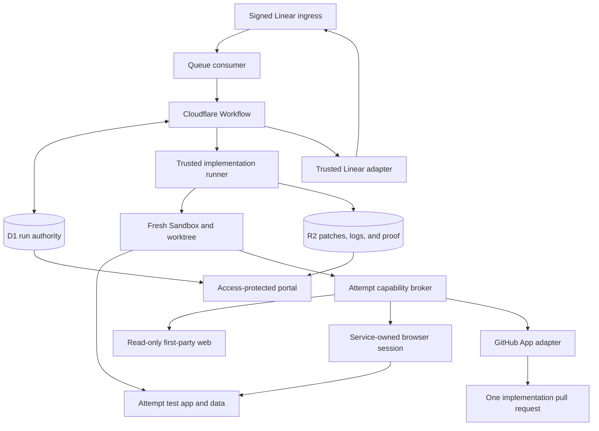

## Context

The current flow already freezes its workflow definition, repository route,
GitHub App installation, and control revisions for each run. It also restores
checked patches from R2 into a fresh Sandbox and keeps provider keys in the
trusted Worker. This design extends those boundaries after the design merge.
See `proposal.md` for the reason for the change and the delta specs for the
required behavior.

The implementation stage starts only from a merge commit that the trusted
service has read from the base branch. The approved proposal, delta specs, and
design at that commit form the implementation contract. A later base-branch
head may include other work, so proof must bind both the approved design commit
and the exact base head used for the check.

Cloudflare states that each Sandbox has separate filesystem, process, and
network isolation. It also says that the application must add authentication
and authorization around a Sandbox. This supports a Sandbox per try, but not
trust based on a Sandbox ID alone
([Cloudflare Sandbox security](https://developers.cloudflare.com/sandbox/concepts/security/)).

## Goals / Non-Goals

**Goals:**

- Add one immutable workflow version that continues from a checked design merge
  through tasks, implementation, proof, and implementation review.
- Give every run a stable implementation branch and every try fresh compute,
  browser, preview, and test identities.
- Keep credentials and authority in trusted services while still letting the
  agent edit, test, browse first-party docs, and inspect its test app.
- Make a code pull request eligible for review only when its tasks, checks, and
  behavior proof match its exact code and base.
- Preserve enough state to resume in a fresh try after failure, clarification,
  or a requested revision.

**Non-Goals:**

- This design does not add a task approval gate.
- It does not let an agent push, approve, merge, deploy, or release work.
- It does not provide a personal browser session or general provider access.
- It does not change old runs or reinterpret their frozen workflow graphs.
- It does not make the implementation merge a release signal.

## Component Diagram



The Workflow owns graph movement and human gates. The runner owns agent process
lifecycle and collection. The capability broker validates narrow operations;
it does not give provider credentials to the Sandbox. D1 is the authority for
run state and identities. R2 holds immutable, hash-checked payloads. The portal
is a read-only projection of those stores.

## Decisions

### 1. Add an immutable implementation tail to a new flow version

The new graph adds these stages after trusted design-merge verification:

```text
implementation_tasks -> implementation_build -> implementation_proof_check
    -> implementation_publish -> implementation_review -> code_merge_or_edit
```

`implementation_tasks` is a typed `/opsx:continue` job. It creates only
`tasks.md` from the checked plan and design. Trusted validation then starts a
typed `/opsx:apply` job without a gate. The apply job works until every task is
complete, returns one clarification block, or fails. Tasks remain an internal
work artifact until they are included with the code pull request.

Each graph decision reloads D1 authority and uses the current visit and stable
traversal rules. A run keeps the graph, node rules, model route, access policy,
and definition digest selected at allocation. Only newly allocated runs can
select this version.

The alternative was one new agent protocol that combines task creation and
implementation. Separate typed native jobs reuse the current OpenSpec contract,
make their allowed writes easier to check, and still add no human stop.

### 2. Use a stable run branch and disposable tries

The trusted service derives one branch as
`deos/implementation/<run-hash>`. The branch identity never changes for the
run. It is unique in D1 before work starts. Each try derives a distinct attempt
ID, Sandbox ID, worktree path, browser operation, preview origin, and test
namespace from the run and try sequence.

The trusted runner, not the agent, provisions every test scope. Local checks get
a fresh data directory or database name under the try. A remote safe-test
adapter creates one provider resource with a run-and-try marker and saves the
exact provider resource ID before use. The capability broker checks that ID on
every read or write. An integration with no resource-level check is not a safe
remote test path, even if its host is allowlisted.

The same adapter owns cleanup. Allocation starts as `allocating`, becomes
`ready` only after provider read-back, and ends as `destroyed` only after
read-back proves removal. An unclear allocation or cleanup becomes
`quarantined`; no agent may use it and no later try may reuse its identity.

A fresh try checks out the current approved base and restores the latest
complete cumulative patch only after its R2 digest matches D1. It never attaches
to an old worktree, process, browser, preview, or test resource. A requested edit
restores the same run branch into a new try. Two concurrent runs therefore have
no shared writable identity.

Cloudflare recommends separate Sandboxes for complete isolation and notes that
destroying a Sandbox deletes its files, processes, and state. Durable recovery
must therefore come from D1 and R2, not the container
([Cloudflare Sandbox lifecycle](https://developers.cloudflare.com/sandbox/concepts/sandboxes/)).

The alternative was to retain a Sandbox across pauses. That would make recovery
depend on an idle container and would let an old tool remain authoritative.

### 3. Put every external act behind an attempt capability

The Sandbox receives an opaque, short-lived capability for its exact run,
repository, branch, try, operation class, and expiry. It can call only the
checked checkout, browser-control, read-only web, safe-test, and evidence-staging
routes. It cannot read a token or call the GitHub, Linear, Cloudflare, D1, or R2
provider APIs directly.

Safe-test routes authorize the saved provider resource ID, account, and test
namespace as well as the host and method. Preview routes authorize the exact
try process and origin. A request with a valid capability but a different
resource ID is denied and recorded as a cross-run attempt.

Sandbox egress is deny by default. Package hosts and current first-party docs
are allowlisted only while needed. The trusted outbound handler validates the
container identity, method, host, and operation before it forwards a request.
Cloudflare documents both host allowlists and Worker-side outbound handlers that
can keep credentials outside the Sandbox
([Cloudflare outbound traffic](https://developers.cloudflare.com/sandbox/guides/outbound-traffic/)).

Git checkout keeps the existing read-only Git proxy. Pull request create,
update, and merge stay in the trusted GitHub adapter. Linear questions and
state changes stay in the trusted workflow adapter. The agent cannot invoke an
approval, merge choice, state transition, deploy, or release operation.

The alternative was to place scoped provider tokens in the Sandbox. Even a
narrow token could leak through commands, patches, logs, or proof, so the Worker
remains the credential boundary.

### 4. Broker one browser and one safe preview per try

When the changed area has a web surface, the Sandbox starts the app against its
own test namespace. The runner exposes only that process through an
attempt-scoped preview origin. The browser broker creates one Cloudflare browser
session under the DEOS service account and records only its session ID and safe
metadata. The Cloudflare API creates a session with a service token and returns
a session ID and debugger URL
([Cloudflare browser sessions](https://developers.cloudflare.com/browser-run/cdp/session-management/)).

The broker retains the service token and debugger URL. Agent browser commands
refer to the attempt browser capability. The broker restricts navigation to the
preview origin and any explicit safe provider-test origin. It returns page
state, console faults, and sanitized screenshots. It refuses personal Google
cookies, downloads of credentials, live admin origins, and state-changing live
requests.

Browser creation goes through one account-level allocator. The allocator holds
an exclusive create lease, saves the provider's active-session inventory, and
then makes one create call with a short keep-alive. A clear response binds the
returned session ID to the try before the lease ends.

If the response is lost before the session ID is saved, the allocation becomes
`quarantined`. While it still holds the lease, the broker compares the provider
inventory with the saved inventory. Because the browser token is exclusive to
this broker, exactly one new session can be bound to the try. Any other result
stays quarantined. The broker creates no second session for that try. It waits
for the short keep-alive to expire, confirms that no unbound session remains,
and only then releases the allocator for a fresh try. If that proof is not
possible, the run enters manual reconciliation.

A new try always gets a new browser operation and session. Cleanup closes the
session and preview, then reads the provider inventory back. It records each
result without masking an earlier build fault.

The alternative was to run a browser process inside the build Sandbox. The
service browser gives the agent the needed view while keeping its provider key
and policy enforcement outside agent-controlled code.

### 5. Treat clarification as a durable build wait

The build agent may return `needs_human` only with one question, a short reason,
and a deterministic block key. The runner saves the patch, task state, checks,
proof, and first error before cleanup. It does not post the question itself.

The Workflow inserts the open question and its Linear operation in one guarded
D1 transaction. The operation key is `(run_id, block_key)`, so retries reconcile
the same comment. The trusted adapter posts that comment and moves the issue to
`Human Review`. The old agent and all try tools are then destroyed.

Signed Linear comment events enter the existing delivery-keyed inbox. A reply
is eligible only if it belongs to the same issue, follows the open question,
and has the exact saved Linear user ID for the allowed Gmail-backed account.
Names, email text, bots, service users, changed comments, deleted comments, and
old deliveries do not count. An unclear event triggers a trusted Linear
read-back and leaves the gate closed until provenance is proven.

An eligible comment starts a fresh try with the saved branch, question, reply,
and prior work. The new agent decides whether the text answers the question. If
it does not, it returns the same block key and the Workflow keeps the one open
question instead of posting another. A distinct later blocker gets a new key
and question only after the first one is closed.

The alternative was to keep an agent process waiting. A durable wait costs no
live Sandbox and makes reply authority a trusted ingress decision.

### 6. Bind proof to the exact behavior subject

Each accepted proof item records this subject:

```text
change + approved_design_sha + tested_base_sha + implementation_tree_sha
```

The approved design SHA proves the contract. The tested base SHA is the target
branch head used to build and check the patch. The implementation tree SHA
identifies the exact tasks, code, and tests. A changed tree or base makes the
affected proof stale. The service must rerun the affected checks before another
pull request update or final gate.

Proof has a declared kind: `browser_image`, `showboat`,
`provider_originated`, `synthetic_ingress`, or `unit_test`. User-facing work
requires a current sanitized browser image when a useful visual state exists.
Nonvisual behavior requires a current Showboat record of the real command and
output. Provider integration work uses a safe real provider resource when one
exists and keeps its delivery record apart from synthetic ingress. Unit tests
may support those items but never satisfy the behavior-proof rule alone.

The completion hook checks task completion, command results, proof kinds,
subject hashes, sanitization status, and required provider receipts. It writes
immutable payloads to R2, reads them back by SHA-256, and commits their accepted
index in D1. If proof storage fails after a build failure, both errors are kept
and the build error remains primary.

The alternative was to attach proof to an attempt. Attempts are lifecycle
records, while a subject digest lets trusted code state exactly when evidence
became stale.

### 7. Publish one idempotent implementation pull request

Trusted publication separates pull request identity from update identity. One
stable `implementation_pr_identity` operation creates or finds the pull request
for the fixed run branch. Each desired publication gets a guarded sequence and
a digest of its tested base, tree, body, and proof manifest. Its operation key
is `(run_id, publication_sequence, publication_digest)`. A retry of the same
desired state reuses that key. A later revision gets a new sequence and digest,
but updates the same pull request. The agent cannot choose another base,
repository, pull request, sequence, or operation key.

The pull request body is generated from checked records. It lists the approved
planning and design commits, task checklist, exact checks, current proof links,
provider-proof labels, and any safe assumptions. Before each post, the trusted
service reads the pull request head and target base. It rejects publication if
the head differs from the checked tree or if the target base differs from the
tested base. The approved design commit must remain reachable from that base,
and the approved plan files must keep their checked hashes.

The alternative was to let the agent push and compose the final review state.
Trusted publication is needed to enforce one pull request and to prevent claims
that do not match stored proof.

### 8. Reuse the existing human-gate authority for code review

Project setup extends the repository route with one authoritative human
binding. The Access-verified Gmail address is paired with a Linear user chosen
from a trusted Linear catalog read. The RouteAdmin service reads that user back,
stores the exact Linear user ID with the route revision, and writes an audit
row. A route cannot select the implementation flow while this binding is absent
or cannot be read back. Names and email text from later events never update it.

Run allocation freezes the route's exact Linear user ID and binding revision.
Settings edits affect only later runs. Clarification and final-review checks use
the frozen ID, while the Gmail address remains an Access setup fact and is not
treated as event proof.

After pull request read-back and proof validation, D1 creates a visit-scoped
implementation review binding and the Workflow moves the issue to
`Human Review`. Only a new signed Linear state event from the saved allowed user
can leave that gate. `In Progress` starts a fresh edit try. `Merging` records the
human merge choice and permits one trusted merge operation. A comment, label,
agent result, check result, service actor, or unclear event cannot choose either
edge.

The merge adapter verifies the gate visit, actor event, repository, pull
request, exact head, and current proof again. It then requests the merge once
and reads the result back. No capability in this graph can deploy or release.
The terminal state is `code_merged`, with release shown as not begun.

The alternative was to infer approval from the GitHub pull request state. The
approved contract requires the saved Linear identity and state event to remain
the sole human authority.

### 9. Project implementation state into the portal

The portal reads the implementation run, tries, tasks, branch, pull request,
checks, questions, replies, and proof index from D1. It reads proof payloads only
through the existing hash-checking, no-store R2 route. It computes current or
stale status from the proof subject and the latest checked head; it does not
generate proof during page load.

The build clarification wait is shown inside the build stage with its question,
safe reason, allowed reply, and resumed try. The final implementation review is
a separate gate. Proof labels distinguish visual images, Showboat logs, real
provider events, synthetic events, and supporting unit tests. Private comment
text and secrets are not included in public-safe status fields.

The alternative was to derive status from agent summaries. D1 and hash-checked
R2 records provide an auditable view and keep old proof in history.

## Event Flow

### Normal implementation

1. The trusted merge action reads the design pull request after merge. It proves
   the merge commit is on the base branch and verifies all approved plan and
   design hashes.
2. The Workflow loads the read-back project human binding. It records its route
   revision and exact Linear user ID with the approved design SHA, current
   tested base SHA, and deterministic branch.
3. A fresh typed task try runs `/opsx:continue`, creates only `tasks.md`, and
   passes OpenSpec and allowed-path checks. No human gate is created.
4. A fresh build try restores the checked task patch. Trusted adapters allocate
   its local data, preview, and any safe provider resource, then `/opsx:apply`
   updates each task as work passes. Commands can use only those exact resource
   IDs and deny live targets.
5. For web work, the runner starts the test app and the broker creates the try's
   browser. The agent inspects the page, fixes proven faults, and reruns affected
   checks. Other work records a fitting Showboat or provider proof.
6. The completion hook saves tasks, patch, command results, proof, and original
   errors. Trusted checks accept only a complete, current proof subject.
7. The GitHub adapter creates or updates the fixed pull request and reads its
   exact head and base back.
8. The Workflow binds the final gate and moves the issue to `Human Review`.
   The portal shows the current pull request, checks, tasks, and proof.

### Clarification and resume

1. A build try returns one bounded question because no safe assumption preserves
   the approved intent, safety, and design.
2. The Workflow saves the question and stable operation, posts or reconciles one
   Linear comment, enters `Human Review`, and destroys the try resources.
3. Ingress authenticates and deduplicates each later comment event. The Workflow
   checks issue, actor ID, order, and question binding. An unclear event is read
   back before use.
4. A valid allowed-user reply returns the issue to active work and creates a new
   try. The try restores the run patch and receives the exact question and
   reply, but no old browser or test capability.

### Revision or merge

1. At the final gate, an allowed-user move to `In Progress` closes that gate
   visit and starts a fresh try on the same branch and pull request.
2. Changed code, tasks, or base marks affected proof stale. The new try must
   rebuild and replace it before the final gate can reopen.
3. An allowed-user move to `Merging` saves the exact event as the merge choice.
   The trusted adapter verifies the current head and proof, merges once, and
   reads the result back.
4. The Workflow records `code_merged`. It does not dispatch a deployment or
   claim that the change is live.

## Minimal Data Model

Existing delivery inbox, transition, gate-binding, provider-operation, attempt,
and artifact-manifest records remain authoritative. The implementation tail adds
or extends only these logical records:

| Record | Key fields | Purpose and invariants |
| --- | --- | --- |
| `project_workflow_policies` extension | `project_id`, `allowed_access_email`, `allowed_linear_user_id`, `human_binding_revision`, `human_binding_checked_at` | Route-level source of human authority. Settings saves the Access identity and a trusted Linear catalog result together. New implementation runs require a successful user read-back. |
| `implementation_runs` | `run_id`, `change`, `approved_design_sha`, `tested_base_sha`, `branch`, `allowed_linear_user_id`, `status`, `pr_number`, `pr_head_sha` | One row per workflow run. `branch` and pull request identity are unique and fixed. The approved design SHA never changes. |
| `implementation_tries` | `attempt_id`, `run_id`, `try_sequence`, `kind`, `sandbox_id`, `status`, `input_patch_sha`, `output_patch_sha`, `primary_error_manifest` | One row per task or build try. `(run_id, try_sequence)` and the Sandbox identity are unique. Old resource IDs are historical only. |
| `implementation_resources` | `resource_id`, `run_id`, `attempt_id`, `kind`, `allocation_op`, `provider`, `provider_resource_id`, `namespace`, `preview_origin`, `status`, `quarantine_until`, `cleanup_receipt` | One row per browser, preview, local data scope, or remote safe-test resource. `provider_resource_id`, namespace, and preview origin are unique when present. Only `ready` resources bound to the calling try may be used. |
| `implementation_publications` | `run_id`, `publication_sequence`, `publication_digest`, `tested_base_sha`, `tree_sha`, `proof_manifest_sha`, `status`, `provider_receipt` | One desired pull request state per sequence. The digest includes the body and exact subject. Retrying the same sequence is idempotent; a changed desired state needs the next sequence. |
| `implementation_proof` | `proof_id`, `run_id`, `attempt_id`, `kind`, `approved_design_sha`, `tested_base_sha`, `tree_sha`, `r2_key`, `sha256`, `sanitized`, `provider_delivery_id` | Immutable proof index. Current status is derived by comparing its subject fields with the checked run head and base. |
| `implementation_questions` | `question_id`, `run_id`, `block_key`, `linear_comment_id`, `opened_delivery_id`, `opened_at`, `status`, `answer_delivery_id`, `answer_comment_id`, `answer_actor_id` | One open question per `(run_id, block_key)`. An answer is usable only after trusted provenance and order checks. |

R2 stores the cumulative patch, task snapshot, command log, screenshots, provider
evidence, original error chain, and completion manifest under create-only keys.
D1 stores their byte sizes and SHA-256 values. Browser keys, GitHub tokens,
Linear tokens, authorization headers, and raw secret-bearing replies are stored
in neither system.

Stable provider operation identities are:

- `(browser_account, allocator_generation)` for one serialized browser create;
- `(run_id, try_sequence, resource_kind, allocate_or_cleanup)` for test scope and preview reconciliation;
- `(run_id, block_key, clarification_question)` for one question;
- `(run_id, implementation_pr_identity)` for the fixed pull request;
- `(run_id, publication_sequence, publication_digest)` for one desired update;
- `(run_id, gate_visit, linear_state)` for gate entry; and
- `(run_id, gate_visit, implementation_merge)` for an authorized merge.

## Failure Modes

| Failure | Required handling |
| --- | --- |
| Design merge or approved files cannot be proved | Do not allocate tasks or a Sandbox. Record the exact hash, reachability, or read-back error. |
| Task generation writes another path or fails validation | Reject the task candidate, preserve the original output and error, and enter the typed failure path. Do not start apply. |
| Sandbox or worktree creation is unclear | Reconcile by the derived resource ID. Never allocate a second resource identity for the same try. |
| A Sandbox stops or is replaced | Restore only the latest hash-matched D1/R2 checkpoint into a new try. Never claim that container files were durable. |
| A run reaches another run's branch, test data, preview, or capability | Compare the requested provider resource ID, namespace, or preview origin with its `ready` resource row. Deny a mismatch, record both identities, and fail the try. |
| A command or browser action targets live state | Deny it before forwarding, retain the requested safe target facts, and keep the run out of the pass path. |
| Test resource allocation is unclear | Quarantine the allocation and reconcile by its stable operation and provider marker. Do not use it or allocate a replacement until absence or cleanup is proved. |
| Browser creation has an unclear response | Keep the exclusive allocator lease, compare provider inventory, and bind only one proven new session. Otherwise wait for expiry and read-back, or enter manual reconciliation. Never create a second browser for that try. |
| Browser or test preview cannot be reached | Keep the browser proof incomplete, save console and connection errors, and retry only in a fresh try when the old resources are closed. |
| A safe real provider test exists but is not run | Label synthetic checks as synthetic and block publication and final review until provider-originated proof exists. |
| A build command fails | Preserve the command, exit status, stdout, stderr, stack, cause chain, patch, task state, and prior proof before cleanup. |
| Evidence storage or cleanup also fails | Preserve each secondary error without replacing the first build error. Mark cleanup for existing reconciliation. |
| Code or target base changes after proof | Mark affected proof stale by subject mismatch. Block pull request posting and the final gate until replacement proof passes. |
| Pull request create or update response is lost | Find the fixed pull request by its identity, then compare the desired publication digest and exact head. Retry only that publication key and never suppress a later sequence. |
| Clarification posting is unclear | Reconcile by `(run_id, block_key)` and Linear read-back. Keep one open question and remain waiting. |
| A reply is old, edited, deleted, untrusted, or on another issue | Record a safe rejection reason, keep private text out of the portal, and leave the clarification gate closed. |
| An allowed reply does not answer the question | A fresh agent returns the same block key. Keep the existing question open and do not post a duplicate. |
| Agent or service output looks like approval | Ignore it. Only the bound signed state event from the saved user can leave the final gate. |
| Merge response is lost | Reconcile the fixed pull request and merge operation. Never request a second merge for a different head. |
| Workflow ends without a final D1 outcome | Existing cron reconciliation records `premature_workflow_completion` and does not infer success or allocate a new run. |

## Risks / Trade-offs

- **Two native agent jobs add orchestration state** -> Keep both inside one
  implementation stage, use the same cumulative patch contract, and add no gate
  between them.
- **A preview origin can expose unfinished work** -> Use an attempt-scoped origin,
  test-only data, browser navigation policy, short lifetime, and cleanup. Never
  expose a live app or personal session.
- **Deny-by-default egress can block valid builds** -> Freeze reviewed package,
  documentation, preview, and safe-test hosts in the workflow version. A missing
  material host becomes a capability wait, not an unrestricted fallback.
- **Strict proof freshness can require costly reruns after base movement** -> Show
  the stale reason early and rerun only checks affected by the changed subject.
- **The agent judges whether an allowed reply is useful** -> Trusted ingress
  decides identity and order; an inadequate reply cannot pass work and reuses
  the same block key.
- **Provider test resources vary by integration** -> Require the implementation
  to identify the provider's primary contract and safe real test path before it
  chooses the proof plan. Lack of a safe required path blocks readiness.
- **Service-owned merge capability is sensitive** -> Scope it to the exact saved
  human event, gate visit, pull request, and head, and omit every deploy or
  release action from the graph.

## Migration Plan

1. Add the D1 fields and tables with nullable or additive migrations. Add the
   project human binding as optional for old flow versions. Existing runs keep
   their frozen definitions and do not need backfill.
2. Add the task, build, browser, proof, clarification, publication, and portal
   handlers behind a new immutable workflow version. Keep it unselected while
   contract and migration checks run.
3. Configure the allowed Access email and exact Linear user ID through the
   trusted project catalog, then require a successful read-back before enabling
   the new version for that route.
4. Verify synthetic safety first: concurrent run identities, resource-ID
   denial, ambiguous browser and test allocation, later pull request revisions,
   stale proof, untrusted replies, and cleanup error precedence.
5. Run a service-owned canary from an approved design through a real code pull
   request. Use a safe provider event when the canary changes an integration,
   and capture sanitized browser proof when it changes the portal.
6. Select the new version only for new routes or new runs. Confirm the stored
   graph digest, D1/R2 hashes, provider receipts, exact pull request head,
   destroyed Sandboxes, and portal projection before wider use.

Rollback stops selecting the new workflow version and restores the prior
default for future runs. Existing runs keep their frozen version. A run that
cannot continue safely remains in its recorded wait or failure state; rollback
does not rewrite its graph, merge its pull request, or deploy its code.
