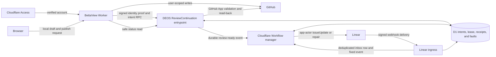

## Context

See `proposal.md` for motivation and the two delta specifications for required
behavior. The current system already keeps workflow authority in D1, freezes
route, graph, pull-request, and gate-visit facts per run, sends provider work
through a trusted Worker, and treats a signed Linear delivery as the proof for
a workflow-owned state transition. BettaView is the Access-protected interface
at `portal/bettaview/`; it has a signed-in GitHub user session but no Linear
credential. The trusted DEOS Worker owns GitHub App read access and Linear app
access.

This change crosses four trust boundaries: browser to BettaView, BettaView to
the private DEOS service binding, DEOS to GitHub and Linear, and provider events
back to the Workflow. Cloudflare does not propagate `ctx.access` through a
service binding, so the downstream Worker cannot infer the reviewer's Access
identity from the binding call
(https://developers.cloudflare.com/workers/runtime-apis/bindings/service-bindings/).

GitHub's create-review endpoint accepts `commit_id`, a review event, a review
body, and an array of new inline comments. It can therefore publish the review
choice and all new inline notes as one commit-pinned request
(https://docs.github.com/en/rest/pulls/reviews). Replies to existing review
comments use a separate endpoint that names the top-level comment and does not
accept `commit_id`; its response exposes the inherited commit and reply relation
for validation (https://docs.github.com/en/rest/pulls/comments).

Linear changes issue state through `issueUpdate` with a `stateId`. Its GraphQL
responses can contain an `errors` array even with HTTP 200, so transport success
alone is not a successful mutation (https://linear.app/developers/graphql).
With actor authorization, Linear records status changes as app acts rather than
human acts (https://linear.app/developers/oauth-actor-authorization). The saved
BettaView review is therefore the human decision; the later app event is only
proof that DEOS performed the mapped state change.

## Goals / Non-Goals

**Goals:**

- Preserve one checked human identity across Access, GitHub, and Linear, while
  freezing the checked IDs and policy version for each new run.
- Publish every required GitHub reply and one atomic review bundle as the
  signed-in GitHub user before DEOS starts the Linear state operation.
- Make GitHub publication, Linear movement, and workflow continuation a
  durable, idempotent sequence that can recover from lost provider replies.
- Keep the gate-bound pull request, frozen graph, and Workflow manager
  authoritative for state and path selection.
- Give BettaView a truthful two-step status, including abandoned and repaired
  outcomes, without exposing provider secrets or replacing original failures.

**Non-Goals:**

- BettaView does not receive a Linear token, call Linear, choose a graph edge,
  merge a pull request, or create another human gate.
- The DEOS app actor does not impersonate the reviewer. GitHub writes use the
  user's session; Linear writes use the app actor and remain linked to the
  checked review.
- Existing active runs are not retroactively assigned a person link. They keep
  their existing Linear-event gate path.
- This design does not make two providers transactional. It uses durable
  checkpoints, leases, read-back, and compensating repair.

## Component Diagram

BettaView owns the user-facing GitHub session and strips browser-supplied
identity fields. `ReviewContinuation` is a named, non-public service entrypoint
on the trusted DEOS Worker. It checks the BettaView assertion, the frozen run
person, the exact pull request and head bound to the open gate visit, and the
gate-scoped continuation lease. The Workflow manager remains the only component
that starts a Linear state change or chooses a graph path.

## Event Flow

### 1. Enroll and freeze the allowed person

1. Only an Access account in the existing `reviewer_link_admin` subset of the
   route-administrator policy may initiate or approve a reviewer-link version.
   A candidate reviewer opens the enrollment link in their own Access and
   GitHub sessions. The initiator, candidate reviewer, and approver identities
   come from trusted sessions, never form fields.
2. BettaView reads the candidate's Access account and numeric GitHub user ID.
   Its user-scoped GitHub read must also return a verified account email. DEOS
   reads the selected Linear user through private app access. The normalized,
   verified GitHub and Linear emails must both equal the verified Access email;
   missing or unequal evidence fails closed. The durable authority remains the
   three provider-native IDs, while the email match is enrollment evidence that
   they describe one natural person. GitHub's authenticated-user email endpoint
   supplies the required verified flag
   (https://docs.github.com/en/rest/users/emails).
3. A second `reviewer_link_admin`, distinct from the candidate reviewer and the
   initiator, approves the candidate facts and bound digest. DEOS then activates
   the next `policy_version` with a route-revision compare-and-set and appends
   both administrative acts and all safe provider-read facts to the audit log.
   An administrator cannot activate their own link, and editing an active link
   always creates a new candidate version and new approval.
4. Run allocation copies the three IDs and policy version into the immutable
   run snapshot in the same guarded operation that freezes route and control
   facts. Later Settings changes affect only later runs. A run without all
   frozen IDs remains readable but cannot use review continuation.

### 2. Keep drafts non-authoritative and prepare one intent

1. The browser creates and persists a UUIDv7 `review_id` when it first creates
   the draft. Draft autosaves keep the ID, content item IDs, bodies, and targets
   in BettaView storage only. They make no GitHub write, acquire no gate lease,
   create no review choice, and emit no review-ready event. Editing a content
   item creates a new content digest; changing its meaning or target creates a
   new item ID.
2. The Publish action revalidates Access and performs a trusted GitHub user read
   with the server-held user session. BettaView validates the persisted ID and
   derives stable part IDs for each reply and for one `review_bundle` containing
   the review body, review type, and all new inline notes.
3. A canonical bound digest covers the review ID, repository, pull request,
   head, run, gate visit, review type, frozen person-link version, ordered part
   IDs and content item IDs, content digests, and targets. The page cannot set
   checked identities or any frozen binding.
4. BettaView calls `prepareReview` through the service binding with a short-lived
   HMAC assertion over the method, body digest, checked Access account, numeric
   GitHub user ID, issued time, and nonce. DEOS checks the MAC, time window,
   one-use nonce, and exact frozen IDs.
5. DEOS requires the submitted repository and pull-request number to equal the
   pull request frozen on that exact gate visit, and requires the submitted head
   to equal both the gate visit's frozen head and GitHub's live head. Another
   pull request for the same run is not eligible. It also proves that the pull
   request and gate are open through D1 and GitHub App reads.
6. One D1 transaction inserts the caller-supplied intent or returns the existing
   exact record and acquires the gate visit's exclusive continuation lease. A
   different active review ID on that visit returns `gate_review_in_progress`
   with its safe status and performs no host write. If the prepare response is
   lost, the browser resends the same ID and digest and recovers the row. Reuse
   with different bound facts returns `id_clash`.

The feature-enabled path removes the old behavior that wrote a note to GitHub
at draft-save time. Existing GitHub drafts created before rollout are displayed
as legacy records but cannot be adopted into an intent; the reviewer must either
submit or discard them in GitHub before BettaView enables Publish. This avoids
re-keying a pre-intent host receipt or silently binding old-head content.

### 3. Publish replies and one atomic GitHub review

1. Before each missing part, BettaView requests a one-use permit. DEOS checks
   the intent digest, gate-bound pull request and frozen head, live head, open
   gate, and ownership of the active gate lease.
2. Replies to existing threads are the only separate writes. For each reply,
   DEOS first reads the top-level parent and checks repository, pull request,
   parent ID, commit, current visibility, and top-level status. BettaView writes
   the reply as the signed-in user with a hidden marker. Because the reply API
   has no `commit_id`, DEOS validates the response's user, inherited commit,
   `in_reply_to` value, marker, and current live head before saving the receipt
   (https://docs.github.com/en/rest/pulls/comments).
3. After all replies are saved, BettaView makes one create-review request with
   the exact `commit_id`, final `COMMENT`, `REQUEST_CHANGES`, or `APPROVE` event,
   review body, and all new inline notes in the `comments` array. The bundle and
   each inline body carry versioned markers containing the review ID, stable
   part or item ID, and facts digest. GitHub documents this single request shape
   for commit-pinned reviews (https://docs.github.com/en/rest/pulls/reviews).
4. On a clear response, DEOS verifies the review ID, commit, numeric user, event,
   and bundle marker. Because the create-review response is a review object, not
   an embedded comment list, DEOS then lists comments for that returned review
   ID and verifies every inline target and marker before recording their host
   IDs. An incomplete item read requires host checking but never repeats the
   successful bundle. The bundle is all-or-unknown; DEOS never retries only a
   subset of its inline notes.
5. On a lost reply, DEOS completes the relevant paginated review or comment
   listing and filters by marker plus every bound fact. One exact match is done.
   A zero-match list is not treated as absence because the listing contract does
   not promise read-after-write consistency. Zero or multiple matches, an
   incomplete read, or conflicting facts becomes `host_check_required`; only a
   clear provider rejection or stronger trusted absence evidence can permit a
   new generation.
6. Only after all replies and the review bundle are recorded does DEOS set the
   GitHub step to `done`. It reads the gate-bound pull request head once more and
   inserts one durable review-ready event. A closed gate or stale head starts no
   Linear work and terminalizes the intent as described below.

If the gate closes or the head advances after any GitHub receipt but before a
Linear operation is allocated, DEOS revokes unused permits, records
`abandoned_before_linear`, releases the gate lease, and reports each published
host URL and each unpublished item to the reviewer. A replacement uses a new
review ID and `supersedes_review_id` but retains stable content item IDs. Exact
replies already visible on the same parent are recorded as
`published_prior_intent` and are never sent again. Old-head inline notes and a
submitted old-head review are shown as already published and are excluded from
the replacement by default; repeating one requires an explicit edit or retarget
that creates a new content item ID. Thus a reload cannot silently duplicate
visible feedback.

### 4. Move Linear under the same gate lease

1. The active Workflow receives the review-ready event, reloads D1 authority,
   verifies the run's frozen graph digest and open gate visit, and checks all
   GitHub receipts. It again requires the intent's pull request and head to equal
   the gate visit's frozen values and GitHub's live values. Event payload facts
   never override D1.
2. The frozen graph maps `COMMENT` and `REQUEST_CHANGES` to the configured
   `In Progress` state ID and edit edge, and maps `APPROVE` to the configured
   `Merging` state ID and trusted merge edge. These are graph mappings, not a
   choice made by BettaView.
3. Immediately before allocating a Linear operation, one guarded D1 transaction
   upgrades the active gate lease from `publishing` to `linear_pending`, proves
   that no other intent or direct choice owns or committed the visit, and saves
   logical key `review:<review_id>:linear-state`. A second intent cannot queue
   or allocate a Linear mutation while that lease exists. It receives
   `gate_review_in_progress` and may retry status only.
4. The Workflow appends mutation generation
   `review:<review_id>:linear-state:<generation>` only when the previous effect
   is proved absent. It calls Linear `issueUpdate` as the DEOS app actor and
   rejects HTTP errors, a GraphQL `errors` array, `success != true`, a missing
   issue, or a returned state that differs from the target.
5. A clear mutation response saves only the mutation receipt and a frozen
   eight-hour delivery deadline. It sets Linear to `awaiting_delivery`; it does
   not commit the human choice or traversal.
6. Linear ingress verifies HMAC-SHA256 over the raw body, treats
   `Linear-Timestamp` as milliseconds, and accepts a signed timestamp from
   8 hours 15 minutes in the past through 5 minutes in the future. This covers
   the documented retries after 1 minute, 1 hour, and 6 hours while bounding the
   replay window. Durable `Linear-Delivery` uniqueness, retained longer than the
   window, is the replay guard. The handler budgets at most four seconds to
   authenticate, insert an accepted, ignored, or duplicate inbox row, schedule
   the fixed Workflow event, and return HTTP 200; provider work never runs in
   the acknowledgement path. Linear treats a non-200 response or a response
   slower than five seconds as failed delivery
   (https://linear.app/developers/webhooks).
7. The signed event must match the issue, expected old gate state, target state,
   app actor, pending operation, and run. Immediately before committing the
   choice, the Workflow reads the GitHub head again. If it is exact, one guarded
   D1 transaction links the event, records the review as the human choice, marks
   Linear done, releases the lease, writes the business transition, and selects
   the traversal.
8. If the head changed after the Linear write, the Workflow records the mutation
   effect and projects Linear as `reverting`. It starts no graph path and runs
   the existing stable repair operation to restore `Human Review` once. A
   matching signed restoration delivery moves Linear to `reverted`, sets final
   intent outcome `abandoned_stale_after_linear`, releases the lease, and tells
   the reviewer to load the new head and publish a new review. GitHub remains
   truthfully `done`; the old review is never a gate choice. An absent or unclear
   restoration moves Linear and the intent to `host_check_required`, retains the
   lease, and opens or updates one stable ops item.
9. If the delivery deadline expires, reconciliation scans the signed inbox for
   one unlinked exact event. One match resumes step 7. With no match, DEOS saves
   `linear_delivery_missing`, moves the step to `host_check_required`, retains
   the lease, and opens or updates the stable ops item. If Linear is at the
   target, repair restores `Human Review` and must receive a signed restoration
   delivery before the same review can get a new Linear generation. An operator
   statement never substitutes for signed provider evidence.
10. A direct Linear event from the frozen Linear user remains an alternate
    human act. The gate compare-and-set either commits it before the lease is
    upgraded, causing the pending review to become `conflict`, or retains it as
    a losing conflict after the lease owns Linear work. It never authorizes a
    second mutation or traversal.

### 5. Retry, abandon, and display status

1. BettaView reads status only through `ReviewContinuation`; it never queries
   Linear. The response contains safe labels, goal state, per-step status,
   redacted provider text, safe error code, published-part links, final outcome,
   and an action-specific one-use token.
2. GitHub can be `not_started`, `publishing`, `failed_retryable`, `done`,
   `host_check_required`, or `abandoned`. Linear can be `not_started`, `moving`,
   `failed_retryable`, `awaiting_delivery`, `reverting`, `reverted`, `done`, or
   `host_check_required`. Intent outcomes are `active`, `continued`,
   `abandoned_before_linear`, `abandoned_stale_after_linear`, `conflict`, or
   `host_check_required`. These are projections from append-only facts.
3. A retry reloads the exact intent and appends one attempt generation. It is
   available only after a clear rejection or trusted proof that the prior effect
   is absent. It runs only the first incomplete reply, the atomic review bundle,
   or the Linear operation. A done or uncertain part cannot reopen, and a final
   intent returns its stored result.
4. The reviewer may voluntarily abandon only before a Linear operation is
   allocated and only when no GitHub result is uncertain. DEOS revokes permits,
   applies the same published-item reporting and replacement rules as a stale
   head, sets `abandoned_before_linear`, and releases the lease. An intent with
   Linear work or a host-check condition remains leased until signed repair or
   trusted reconciliation makes it safely terminal.
5. If a Linear mutation reply was lost, DEOS reads task state before retry. At
   the target it does not mutate again and waits for an exact signed app event.
   At the exact old gate state, a new generation is allowed only when provider
   evidence proves the mutation absent. Any other or unreadable state requires
   host checking.

## Minimal Data Model

Existing run, gate visit, provider operation, delivery, transition, and fault
tables remain authoritative. New tables store provider-native IDs; timestamps
are audit facts and never replace stable identities.

| Record | Key fields and constraints |
| --- | --- |
| `project_reviewer_links` | `(project_id, policy_version)` primary key; status, checked Access account, numeric GitHub user ID, Linear user ID, normalized verified-email digest, evidence digest, initiating admin, approving admin, route revision, and timestamps. Only one `current` version per project; candidate, initiator, and approver constraints enforce the two-person rule. |
| `reviewer_link_audit` | Append-only candidate, host-read, approval, activation, rejection, and rotation facts keyed by audit ID and policy version. Provider tokens and raw assertions are excluded. |
| Frozen run person link | The three IDs and `reviewer_policy_version` on the immutable run snapshot. All four values are non-null together and never updated after allocation. |
| `review_drafts` and content items | Browser-created `review_id` primary key plus draft version. Content items have stable UUIDs, kind, body digest, and target digest. Draft rows have no provider receipt and cannot be a gate choice. |
| `review_intents` | `review_id` primary key; `bound_digest`, optional `supersedes_review_id`, run, issue, repository, gate-bound pull request and frozen head, gate visit, type, person-link version, target state and edge, step projections, final outcome, and timestamps. Reuse requires an identical digest. |
| `review_continuation_leases` | `gate_visit_id` primary key, unique active `review_id`, phase, acquired time, and release fact. A guarded lease transition permits at most one publishing or Linear-pending intent for an open visit. |
| `review_parts` | `(review_id, part_id)` primary key; `content_item_id`, kind (`reply` or `review_bundle`), ordinal, content and target digests, marker version, receipt status, GitHub record IDs, commit/user/event facts, and optional prior-intent receipt. A unique provider-record constraint prevents adoption twice. |
| `review_attempts` | `(review_id, step, scope_id, generation)` primary key with every key column explicitly `NOT NULL`; `scope_id` is the part ID for GitHub or sentinel `linear-state` for the Linear step. A partial unique index on `(review_id, step, scope_id)` where `finished_at IS NULL` permits one active generation. Rows keep permit, request digest, times, outcome, provider operation, and fault reference and are append-only. SQLite otherwise permits NULL in ordinary composite primary keys (https://www.sqlite.org/quirks.html). |
| Existing provider operations and faults | Stable operation ID, provider, request digest, outcome, first provider message, cause chain, safe act facts, public code, redaction version, and timestamps. The first error is write-once; later errors reference rather than overwrite it. |
| Existing gate and delivery records | Link `review_id`, lease, expected Linear operation, signed delivery, app actor, old/new states, gate choice, and traversal. Existing unique gate-choice and traversal constraints remain the final one-path guard. |
| `review_proof_nonces` | `(key_version, nonce)` primary key with issue time, expiry, and request digest. A nonce authenticates exactly one service call. |

Part receipts, attempt rows, faults, lease transitions, and gate choices are
append-only or monotonic. A retry is a new generation, never a failed row moving
back to running. `done`, `reverted`, and terminal intent outcomes cannot reopen.
`host_check_required` advances only through a trusted reconciliation record:
one exact host match marks a part done, direct provider evidence of rejection
may grant one new generation, and signed Linear repair may safely release a
lease. Otherwise an operator can only retain or abandon without another write.

## Decisions

### Use a durable saga with one gate-scoped lease

D1 checkpoints every externally visible effect, while the Workflow owns Linear
and graph selection. One active lease prevents two published reviews for the
same open visit from allocating competing Linear moves. Calling Linear directly
from BettaView was rejected because it would place graph authority and a Linear
credential in the wrong component. Relying only on the final gate compare-and-
set was rejected because two mutations could already have changed the issue
before either choice committed.

### Keep draft saves out of GitHub

The stable review ID exists from draft creation, but GitHub receives nothing
until Publish. This makes draft editing retryable without inventing a receipt
adoption protocol, and it ensures one saved note cannot become a human choice.
Adopting arbitrary legacy draft comments was rejected because their marker,
head, content digest, and intent binding cannot all be proved. Legacy drafts
must be resolved before enabling the new path.

### Use one atomic review bundle plus separate replies

New inline notes and the final review choice use GitHub's single create-review
request with `commit_id`, `event`, body, and `comments`. This removes N separate
inline writes and prevents a subset of new comments from being published
without the review. An N-part publication model was rejected because it
multiplies uncertain replies and stranded old-head notes. Replies cannot join
that request, so they retain per-part permits and receipts. Publishing replies
first ensures the final review means every prerequisite host write is already
saved; replacement lineage prevents those replies from being posted twice.

### Authenticate derived identity and require two-person enrollment

BettaView proves the candidate's Access and GitHub sessions; DEOS proves Linear
and the run copy. Matching verified provider emails supplies enrollment evidence
that all three stable IDs belong to one person. A distinct authorized admin
activates the version, and every act is audited. Trusting form fields, allowing
one Settings visitor to self-designate, or forwarding a raw Access token was
rejected because each either lacks cross-provider evidence or broadens secret
handling.

### Keep provider writes with their existing actors

BettaView uses the user-scoped GitHub session. DEOS uses the GitHub App only for
validation and read-back. The Workflow uses the Linear app actor. This makes
the GitHub review the human act and the Linear app event machine proof. Having
the App publish the review or treating the app event as approval was rejected
because either would turn automation into the gate decision.

### Put stable, lineage-aware IDs in readable GitHub bodies

Bodies carry opaque hidden markers; D1 stores content and target digests.
GitHub has no caller idempotency key for these writes, so response IDs alone
cannot reconcile a lost response. Stable content item IDs also let a replacement
report and suppress already visible feedback. Matching only body text or marker
was rejected because identical text can be valid twice and a reused marker with
different facts is a clash.

### Require signed Linear delivery before continuation

An immediate response or state read can prevent a repeated mutation, but it
does not prove the ordered provider event used by current workflow authority.
The Workflow starts no edge until a signed, delivery-keyed event is stored and
correlated. A widened but bounded timestamp window admits documented retries;
durable delivery deduplication, not a sixty-second window, prevents replay.

### Freeze state, person, pull-request, and head facts

Settings resolves state and person identities to stable IDs. The gate visit
freezes its exact pull request and head. Review handling uses those values even
if Settings changes or another pull request exists for the run. Reading current
Settings or accepting any run-linked pull request was rejected because either
would let policy drift change an already-open human gate.

## Failure Modes

| Failure | Required behavior |
| --- | --- |
| Unauthorized reviewer-link writer, self-approval, missing evidence, or email mismatch | Reject activation, append the checked provider and administrator facts, keep the prior policy version current, and freeze no new link. |
| Missing or mismatched frozen Access, GitHub, or Linear identity | Reject before provider work, append a safe rule fault, and leave both steps not started. Browser fields never override trusted proof. |
| Invalid service MAC, expired assertion, or replayed nonce | Reject and record safe authentication context without storing assertion or secret material. |
| Pull request differs from the gate-bound pull request, is closed, or has a stale/forked head | Block host writes, keep draft content readable, and request a reload. Another pull request for the same run is never sufficient. |
| A second intent targets the same open gate visit | Return the active intent's safe status under `gate_review_in_progress`; allocate no permit, Linear operation, or queue entry. |
| Same review, part, or content item ID has different facts | Return `id_clash`, perform no provider effect, and preserve both digests in safe diagnostics. |
| GitHub clearly rejects a reply or review bundle | Preserve the original message and cause chain. Mark absence only when rejection proves no write, keep Linear not started, and permit one new generation. |
| GitHub response is lost or read-back is incomplete | One exact marker-and-facts match is success. Zero or multiple matches and incomplete reads require host checking; list zero alone never permits another write. |
| User session expires during publication | Keep completed receipts, preserve the original failure, and do not start Linear. A new matching session resumes only a provably absent part. |
| Head advances after some replies or the old-head review is saved | Terminalize before Linear, release the lease, list published URLs, and create a replacement lineage. Exact visible items are suppressed; repeating old-head feedback requires explicit edit or retarget. |
| Browser or Worker stops after GitHub succeeds | Durable intent, lease, and review-ready inbox let the Workflow start only Linear. No GitHub part is repeated. |
| Linear returns HTTP 200 with GraphQL errors or a false, missing, or mismatched result | Treat the mutation as failed or unclear, preserve the original GraphQL cause chain, and do not claim target state. |
| Linear mutation reply is lost | Read task state. At target, do not write again and await signed delivery. At the exact old state, retry only with provider proof of absence; otherwise require host checking. |
| Linear webhook retry carries an old timestamp | Accept a valid signature within the 8-hour-15-minute past window, dedupe by `Linear-Delivery`, store/schedule within the four-second budget, and return 200. |
| Linear delivery deadline expires | Scan the signed inbox once. If no exact event exists, retain the gate lease, save `linear_delivery_missing`, require host checking, and open/update the stable ops item. |
| Head advances after the Linear mutation | Project `reverting`; start no path. Signed restoration proof produces `reverted` and `abandoned_stale_after_linear`. Unproved restoration requires host checking and retains the lease. |
| Signed Linear event is duplicate, late, or for the wrong actor/state | Dedupe and retain it for audit without choosing a path. Only the event matching the pending review operation is app proof. |
| A direct Linear human event races the leased BettaView intent | The gate and lease compare-and-set commits at most one authority source. Record the loser as conflict with no second mutation or traversal. |
| Unauthorized automation moves the gate state | Use the existing one-time restoration to `Human Review`. If restoration is unproved, save the repair fault, stop gate work, and open/update the ops item. |
| D1 compare-and-set or diagnostic write fails | Return failure, never success-shaped output. Preserve the primary provider error; diagnostic failure is additional context and cannot mask it. |
| Status read is unavailable | Show unknown, not success. Do not infer completion from browser state or enable retry without an exact DEOS action. |

## Risks / Trade-offs

- **Replies remain separate from the atomic review** -> Permit and receipt each
  reply, publish them before the bundle, and use lineage to suppress exact
  already-visible replies after abandonment.
- **A review saved just before a head advance is valid GitHub history but not a
  gate choice** -> Show GitHub done, compensate any Linear effect, and require a
  new review for the new head.
- **Hidden markers add metadata to provider bodies** -> Keep them versioned,
  opaque, and hidden in rendered Markdown. Missing or edited markers are
  uncertain unless a clear response was already durably saved.
- **Read-back can be expensive on a large pull request** -> Narrow by pull
  request, head, user, kind, and creation window, but finish all relevant pages
  before declaring one match. Stop safely on rate limits or incomplete reads.
- **The wider webhook timestamp window admits more signed replays** -> Persist
  `Linear-Delivery` uniqueness beyond the window, acknowledge duplicates, and
  bind event facts to the pending operation before any state decision.
- **Two-person reviewer enrollment adds setup friction** -> Limit it to new or
  rotated policy versions and retain immutable evidence so run-time checks stay
  automatic.
- **Waiting for signed Linear delivery adds latency** -> Show
  `awaiting_delivery`, freeze an eight-hour deadline, then escalate rather than
  waiting forever (https://linear.app/developers/webhooks).
- **Frozen IDs may make a legitimate account change unusable for an active
  run** -> Fail closed for that run, rotate Settings for future runs, and use
  trusted reconciliation for the active visit.

## Migration Plan

1. Add the candidate/approval records, intent and lineage tables, explicit
   `NOT NULL` attempt keys, active-lease constraint, and nullable frozen-run
   fields. Existing routes and runs keep the current Linear-event path.
2. Extend Settings with the authorized two-person enrollment flow and trusted
   Access, GitHub, and Linear reads. Do not enable continuation until one current
   link and required `Human Review`, `In Progress`, and `Merging` state IDs pass.
3. Deploy Linear ingress compatibility first: accept the bounded retry window,
   persist delivery-key deduplication, and prove the under-five-second
   acknowledgement path with provider-originated retries.
4. Deploy the trusted Worker with backward-compatible `ReviewContinuation`,
   leases, read-back, Workflow event handling, repair states, status API, and
   diagnostics. Service-binding callees precede callers
   (https://developers.cloudflare.com/workers/runtime-apis/bindings/service-bindings/).
5. Deploy BettaView with local-only drafts, atomic review bundles, reply markers,
   replacement lineage, signed RPC assertions, and two-step status. Keep the
   project feature off and require legacy GitHub drafts to be resolved.
6. Enable one test project. New runs freeze the person link and gate-bound pull
   request; old runs retain prior behavior. Expand only after provider proof.
7. Use a real pull request, reviewer session, and Linear issue for evidence.
   Capture separately: synthetic authenticated service ingress;
   provider-originated GitHub review and Linear signed delivery with D1 facts;
   stale-head repair and delayed retry evidence; and sanitized Settings and
   two-step BettaView screenshots. Synthetic ingress is not end-to-end proof.

Rollback first disables new draft-to-intent preparation per project. Keep the
compatible BettaView publisher and status routes until every active gate lease
is released by completion, signed repair, or a safely terminal pre-Linear
abandonment. Then remove the caller behavior. Keep the trusted Worker until all
accepted Linear operations, delivery waits, and repairs are done or safely
terminal; only then remove its compatibility methods. Additive D1 records,
provider receipts, lineage, and original diagnostics remain for audit, and no
rollback deletes a receipt or changes a committed workflow choice.
