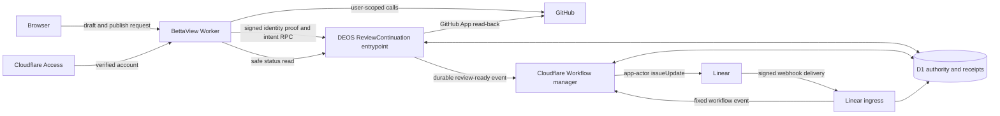

## Context

See `proposal.md` for motivation and the two delta specifications for required
behavior. The current system already keeps workflow authority in D1, freezes
route and graph facts per run, sends provider work through a trusted Worker,
and treats a signed Linear delivery as the proof for a workflow-owned state
transition. BettaView is the Access-protected user interface at
`portal/bettaview/`; it has a signed-in GitHub user session but no Linear
credential. The trusted DEOS Worker owns the GitHub App and Linear app access.

This change crosses four trust boundaries: browser to BettaView, BettaView to
the private DEOS service binding, DEOS to GitHub and Linear, and provider events
back to the Workflow. Cloudflare does not propagate `ctx.access` through a
service binding, so the downstream Worker cannot infer the reviewer's Access
identity from the binding call
(https://developers.cloudflare.com/workers/runtime-apis/bindings/service-bindings/).

GitHub accepts a head `commit_id` and the `APPROVE`, `REQUEST_CHANGES`, and
`COMMENT` review events, and its review response exposes the saved user, state,
and commit for read-back (https://docs.github.com/en/rest/pulls/reviews).
Review-comment records also expose the commit, user, target, and reply relation;
new comments can be pinned to a commit and replies can name a top-level comment
(https://docs.github.com/en/rest/pulls/comments).

Linear changes issue state through `issueUpdate` with a `stateId`. Its GraphQL
responses can contain an `errors` array even with HTTP 200, so transport success
alone is not a successful mutation (https://linear.app/developers/graphql).
With actor authorization, Linear records status changes as app acts rather than
human acts (https://linear.app/developers/oauth-actor-authorization). The saved
BettaView review is therefore the human decision; the later app event is only
proof that DEOS performed the mapped state change.

## Goals / Non-Goals

**Goals:**

- Preserve one checked human identity across Access, GitHub, and Linear, while
  freezing the checked IDs and policy version for each new run.
- Publish every GitHub review part as the signed-in GitHub user before DEOS
  starts the Linear state operation.
- Make GitHub publication, Linear movement, and workflow continuation a
  durable, idempotent sequence that can recover from lost provider replies.
- Keep the existing graph and Workflow manager authoritative for state and
  path selection.
- Give BettaView a truthful two-step status without exposing provider secrets
  or replacing the original provider failure.

**Non-Goals:**

- BettaView does not receive a Linear token, call Linear, choose a graph edge,
  merge a pull request, or create another human gate.
- The DEOS app actor does not impersonate the reviewer. GitHub writes use the
  user's session; Linear writes use the app actor and remain linked to the
  checked review.
- Existing active runs are not retroactively assigned a person link. They keep
  their existing Linear-event gate path.
- This design does not make two providers transactional. It uses durable
  checkpoints and read-back to make each effect safe to resume.

## Component Diagram

BettaView owns the user-facing GitHub session and strips any browser-supplied
identity fields. `ReviewContinuation` is a named, non-public service entrypoint
on the trusted DEOS Worker. It validates the BettaView assertion, frozen run
facts, live pull-request head, and gate before accepting an intent or part.
The Workflow manager remains the only component that starts a Linear state
change or chooses a graph path.

## Event Flow

### 1. Set up and freeze the allowed person

1. Project setup reads the current Access identity from the verified Access
   context, reads the numeric GitHub user ID through the user's GitHub session,
   and asks DEOS to read the selected Linear user ID with its private access.
2. DEOS saves the three checked IDs as one project reviewer link. Each semantic
   change increments `policy_version`; verification timestamps and safe host
   facts are audit data, not substitute identities.
3. Run allocation copies the three IDs and policy version into the immutable
   run snapshot in the same guarded operation that freezes route and control
   facts. Later Settings changes affect only later runs.
4. A run without all frozen IDs remains readable in BettaView but cannot use
   review continuation. Its existing checked Linear-user event path remains.

### 2. Prepare the exact review intent

1. Before its first network call for Publish, the browser creates and persists a
   UUIDv7 `review_id` with the draft. It sends that ID, review content, targets,
   and review type to BettaView. The ID is only an idempotency key and grants no
   authority. Identity fields in the body are ignored, and their presence is an
   invalid request.
2. BettaView revalidates Access and performs a trusted GitHub user read with the
   server-held user session. It compares both identities with the session facts
   used at setup.
3. BettaView validates the `review_id` format and derives stable `part_id` values
   for every note, reply, and final review. A canonical bound digest covers the
   review ID, repository, pull request, head, run, gate visit, review type,
   frozen person-link version, ordered part IDs, content digests, and targets.
4. BettaView calls `prepareReview` through the service binding. The call carries
   a short-lived HMAC assertion over the method, body digest, checked Access
   account, numeric GitHub user ID, issued time, and nonce. The browser never
   sees the assertion key. DEOS checks the MAC, time window, one-use nonce, and
   exact frozen IDs.
5. DEOS reads D1 to prove the run-to-pull-request and open-gate visit binding,
   then reads GitHub with the frozen App installation to prove that the pull
   request is open and its live head equals the sent head. It atomically inserts
   the caller-supplied ID and bound intent or returns the existing exact record.
   If the response is lost, the browser resends the same persisted ID and
   recovers that row. Reuse with any different bound fact is an `id_clash` and
   performs no provider work.

Draft editing or a single draft save does not create a review choice or a
review-ready event. If the existing draft path writes a GitHub note before
Publish, it must use the same DEOS preflight and part receipt rules, but the
draft remains ineligible for Linear movement. Publish freezes the review type
and adopts only exact, revalidated draft-part receipts into the review intent.

### 3. Publish GitHub parts as the reviewer

1. Before each missing part, BettaView requests a one-use authorization from
   DEOS. DEOS rechecks the intent digest, open gate, and live head. New review
   comments and the final review include the exact `commit_id`. GitHub's reply
   endpoint accepts a top-level comment ID and body, not a `commit_id`, so DEOS
   validates that parent comment's pull request, commit, and top-level status
   before granting a reply permit. After the reply, it verifies the response's
   inherited commit and `in_reply_to` facts
   (https://docs.github.com/en/rest/pulls/comments).
2. BettaView writes parts in a stable order: notes and replies first, then the
   final `COMMENT`, `REQUEST_CHANGES`, or `APPROVE` review. Each body contains a
   hidden marker of the form
   `<!-- deos-review-part:v1:<review_id>:<part_id>:<facts_digest> -->`.
   Marker values are opaque and contain no account or provider credential.
3. A clear GitHub response is reported to DEOS. DEOS checks the returned host
   ID, commit, numeric user ID, review event or comment target, reply relation,
   and marker before recording that part as done.
4. If BettaView loses the response, DEOS lists all relevant reviews or review
   comments through the GitHub App, follows pagination to completion, and
   filters by marker plus every bound fact. One exact match is recorded as done.
   GitHub does not document list read-after-write consistency, so a zero-match
   list is not proof that the write was absent. Zero matches, more than one
   match, an incomplete read, or conflicting facts moves the part to
   `host_check_required` and never authorizes an automatic repeat. A new attempt
   is allowed only after an explicit provider rejection proved that no record
   was created, or after trusted reconciliation supplies stronger absence proof.
5. Only after every note and reply and the final submitted review are recorded
   does DEOS set `github_step=done`. It reads the pull request head once more
   and inserts one durable review-ready inbox event. A stale head or closed gate
   leaves the GitHub result visible but never starts Linear work.

### 4. Move Linear and choose the graph path

1. The active Workflow receives the review-ready event, reloads D1 authority,
   verifies the run's frozen graph digest and open gate visit, and checks that
   the review and all GitHub parts are done. It ignores any event payload facts
   that disagree with D1. Immediately before allocating a Linear operation, it
   uses the frozen GitHub App installation to prove again that the pull request
   is open and its live head equals the intent head. A failed or stale read
   allocates no Linear operation.
2. The frozen graph maps `COMMENT` and `REQUEST_CHANGES` to the configured
   `In Progress` state ID and edit edge. It maps `APPROVE` to the configured
   `Merging` state ID and trusted merge edge. These are reviewed graph mappings,
   not a new hard-coded gate in BettaView.
3. After that live-head proof, the Workflow uses the logical operation key
   `review:<review_id>:linear-state` and allocates mutation attempt
   `review:<review_id>:linear-state:<generation>`. A new generation exists only
   after the prior effect is proved absent. It calls Linear `issueUpdate` as the
   DEOS app actor and rejects HTTP errors, a GraphQL `errors` array,
   `success != true`, a missing issue, or a mismatched returned state.
4. A clear mutation response marks only the mutation receipt as saved and sets
   a frozen delivery deadline. The workflow waits for authenticated Linear
   ingress to store the provider-originated delivery. Linear currently retries
   a failed webhook at bounded backoff intervals and may disable an unresponsive
   endpoint, so this wait cannot be unbounded
   (https://linear.app/developers/webhooks). The default deadline is eight hours,
   longer than the documented final retry, and is frozen with the operation.
5. The event must match the issue, expected old gate state, expected target
   state, app actor, pending operation, and run. Before committing the choice,
   the Workflow reads the GitHub head once more. If it is still exact, one
   guarded D1 transaction links the app event to the review, records the review
   as the human choice, marks Linear done, writes the business transition, and
   selects the traversal.
6. If the head changed after the Linear preflight, the Workflow records
   `stale_head_after_linear_write`, starts no graph path, and uses the existing
   stable repair operation to put the task back in `Human Review` once. The gate
   remains open. An unproved repair becomes a repair fault and ops item; it does
   not turn the stale review into a choice.
7. If the delivery deadline expires, reconciliation first scans the durable
   signed ingress inbox for an unlinked exact event. One match resumes step 5.
   With no match, DEOS records `linear_delivery_missing`, sets the Linear step to
   `host_check_required`, and opens or updates one stable ops item. If Linear is
   already at the target, repair must restore `Human Review` through the app,
   prove that restoration with a signed delivery and thereby prove ingress
   health, and then let the same review retry only its Linear move so a fresh
   signed delivery can exist. No operator record substitutes for a signed event.
8. A direct Linear event from the frozen Linear user remains an alternate valid
   human act. The gate-visit compare-and-set permits only the first valid choice
   to commit. A later review or state event is retained as a conflict or linked
   proof, but cannot start another path.

### 5. Retry and display status

1. BettaView reads status only through `ReviewContinuation`; it never queries
   Linear. The response contains safe labels, goal state, per-step status,
   redacted provider text, safe error code, and an action-specific retry token.
2. GitHub can be `not_started`, `publishing`, `failed_retryable`, `done`, or
   `host_check_required`. Linear can be `not_started`, `moving`,
   `failed_retryable`, `awaiting_delivery`, `done`, or `host_check_required`.
   These are projections from immutable part and attempt records, not mutable
   attempt states.
3. A retry reloads the exact intent and atomically appends the next attempt
   generation with a one-use permit. It is available only when the prior attempt
   has a clear provider rejection or trusted reconciliation proves the effect
   absent. It runs only the first incomplete part or Linear operation. Once a
   part is done or requires host checking, an automatic retry cannot reopen it.
   Once GitHub is done, no retry can post a GitHub part. Once the graph choice is
   committed, every retry returns the saved two-step result.
4. If the Linear mutation reply was lost, DEOS reads the issue state before any
   retry. If the task is at the target, it does not mutate again and waits until
   the delivery deadline for an exact signed app delivery. If it is provably
   still at the old gate state, the next attempt generation may issue one needed
   mutation under the same logical operation key. Any other or unreadable state
   requires a host check.

## Minimal Data Model

All IDs are stored in provider-native form. Timestamps are audit facts and do
not replace stable IDs. Existing run, gate visit, provider operation, delivery,
transition, and diagnostic tables remain authoritative and are extended rather
than duplicated.

| Record | Key fields and constraints |
| --- | --- |
| `project_reviewer_links` | `(project_id, policy_version)` primary key; checked Access account, numeric GitHub user ID, Linear user ID, verification facts, `created_at`; one current version per project. |
| Frozen run person link | Add the three IDs and `reviewer_policy_version` to the immutable run snapshot. All four values are non-null together and never updated after allocation. |
| `review_intents` | Browser-created `review_id` primary key; `bound_digest` unique comparison value; run, issue, repository, pull request, head, gate visit, review type, frozen IDs/version, target state/edge, derived GitHub and Linear step projections, final outcome, timestamps. Insertion binds the ID atomically; reuse requires an identical digest. |
| `review_parts` | `(review_id, part_id)` primary key; kind, stable ordinal, content digest, canonical target facts, marker version, status, GitHub record ID, saved commit/user/event facts. Host record ID is unique within repository and kind when present. |
| `review_attempts` | `(review_id, step, part_id, generation)` primary key; one-use permit ID, request digest, started/finished times, `running`, `succeeded`, `failed_absent`, or `uncertain` outcome, provider operation ID, and fault reference. One active generation is allowed per part or Linear step. Rows are append-only. |
| Existing provider operations and faults | Stable operation ID, provider, request digest, outcome, first provider message, cause chain, safe act facts, public code, redaction version, and timestamps. The first error is append-only or write-once; later errors reference it rather than overwrite it. |
| Existing gate and delivery records | Link `review_id` to the gate choice, expected Linear operation, signed delivery key, app actor, old/new state IDs, and traversal ID. Unique constraints on gate choice and traversal enforce one path. |
| `review_proof_nonces` | `(key_version, nonce)` primary key with issue time, expiry, and request digest. A nonce can authenticate exactly one service call. |

Part receipts, attempt rows, provider faults, and gate choices are append-only or
monotonic. A failed attempt never returns to running; a retry is the next
generation. The displayed step state is derived from the latest generation and
the terminal part receipts. `done` cannot reopen. `host_check_required` can
advance only through a trusted reconciliation record: one exact host match marks
the part done; direct provider evidence that the original request was rejected
may grant one new generation; otherwise an operator can only abandon the intent,
not authorize a repeated write. Linear cannot start until all GitHub parts are
done, and a guarded update enforces the open gate visit at every generation.

## Decisions

### Use a durable saga, not a browser callback chain

D1 checkpoints every externally visible effect and the Workflow owns Linear
and path selection. This preserves current architecture and makes recovery
independent of a browser tab. The alternative was to call Linear immediately
from BettaView after GitHub returned. That would expose Linear authority to the
wrong component, lose workflow graph checks, and leave no safe recovery after
the page disconnects.

### Authenticate derived identity across the service binding

BettaView verifies Access and GitHub itself, then sends a short-lived signed
assertion to a named private entrypoint. DEOS validates the assertion and the
frozen run copy. Passing the inbound request or trusting identity fields in the
RPC object was rejected because Access context does not cross the binding and
browser-controlled values are not proof. Forwarding a raw Access token was also
rejected because it broadens credential handling when only checked identity
facts and request integrity are needed.

### Keep provider writes with their existing actors

BettaView uses the user-scoped GitHub session for notes, replies, and the review.
DEOS uses the GitHub App only for link/head validation and read-back. The
Workflow uses the Linear app actor for `issueUpdate`. This makes the GitHub
review the human act and the Linear app event machine proof. Having the GitHub
App publish the review or treating the Linear app event as approval was rejected
because either would turn automation into the human gate decision.

### Put stable IDs in readable GitHub bodies

Every body carries an opaque hidden marker, while D1 stores content and target
digests separately. GitHub has no caller-defined idempotency key for these
writes, so response IDs alone cannot reconcile a lost response. A zero-result
list is also not treated as absence without a documented consistency guarantee.
Matching only body text was rejected because identical feedback can be valid
more than once. Matching only the marker was rejected because an ID reused on a
different head, user, event, or target must be a clash, not success.

### Require signed Linear delivery before continuation

An immediate Linear response or state read can prevent a repeated mutation,
but it does not prove the ordered provider event that current workflow authority
uses. The Workflow therefore starts no graph edge until the signed delivery is
stored and correlated. Treating an HTTP 200, a GraphQL payload, or the app actor
as the human decision was rejected.

### Freeze state IDs in the graph and person IDs in the run

Settings resolves actual Linear state names and host identities to stable IDs.
Run allocation freezes those IDs and the policy version. Review handling uses
the run's graph and person link even if Settings changes later. Reading current
Settings during a retry was rejected because it would let policy drift alter an
already-open human gate.

## Failure Modes

| Failure | Required behavior |
| --- | --- |
| Missing or mismatched Access, GitHub, or Linear identity | Reject before provider work, append a safe rule fault, and leave both steps not started. Browser identity fields never override trusted proof. |
| Invalid service MAC, expired assertion, or replayed nonce | Reject the call and record the authentication context without storing the assertion or secret. |
| Pull request is unlinked, closed, on another run/gate, or stale | Keep review content readable, block new host writes, and tell the user to reload or use the linked gate. No Linear operation is allocated. |
| Same review or part ID with different facts | Return `id_clash`, perform no provider read/write beyond validation, and preserve both digests in safe diagnostics. |
| GitHub rejects a note, reply, or review | Persist the original message and cause chain, append a `failed_absent` attempt only when rejection proves no write, keep Linear not started, and permit one next generation for that part. |
| GitHub reply is lost | Complete paginated read-back. One exact marker-and-facts match is success. Zero or multiple matches, or an incomplete/unreadable result, is uncertain and requires host checking; list zero alone never permits another write. |
| User session expires during publication | Keep completed part receipts, fail the current GitHub part with the original provider error, and do not start Linear. A new matching session resumes only missing work. |
| Head or gate changes during publication | Reviews and new comments are commit-pinned; replies receive parent/head checks before and after the write. Final and Workflow preflight reads block Linear. A race detected after Linear restores `Human Review` once and starts no path. |
| Worker or browser stops after GitHub succeeds | The durable review-ready inbox and intent let the Workflow or a same-ID retry start only Linear. GitHub remains done. |
| Linear returns HTTP 200 with GraphQL errors or false/missing result | Treat the mutation as failed or unclear, preserve the full original GraphQL error chain, and do not claim the target state. |
| Linear mutation reply is lost | Read task state. At target, do not write again and await an exact signed app event until the frozen deadline; at the exact old gate state, append one retry generation; otherwise require host checking. |
| Linear delivery deadline expires | Search the durable signed inbox once for an unlinked exact event. If none exists, save `linear_delivery_missing`, require host checking, and open/update the stable ops item. Restore the gate and prove ingress health before the same review may move Linear again. |
| Signed Linear event is duplicate, late, or for the wrong actor/state | Dedupe on `Linear-Delivery`, retain it for audit, and do not choose a path. Only the event matching the pending review operation is app proof. |
| A valid direct Linear human event races a BettaView choice | The gate-visit compare-and-set commits one choice and one traversal. The loser is recorded without another state write or graph edge. |
| Unauthorized automation moves the gate state | Use the existing one-time restoration to `Human Review`. If restoration cannot be proved, record the repair fault, stop gate work, and open or update the ops item. |
| D1 compare-and-set or diagnostic write fails | Return failure, never a success-shaped result. Preserve the primary provider error as the cause; a cleanup or diagnostic error is additional context and cannot replace it. |
| Status read is unavailable | Show the step as unknown, not successful. Do not infer completion from local browser state and do not enable a retry until DEOS returns an exact allowed action. |

## Risks / Trade-offs

- **Cross-provider race after a valid head preflight** -> Commit-pin reviews and
  new comments, validate reply parents around each reply, and recheck the live
  head before and after Linear. A post-write head race triggers one gate-state
  repair and never starts the graph path.
- **Hidden markers add metadata to provider bodies** -> Keep markers versioned,
  opaque, and hidden in rendered Markdown. Treat a missing or edited marker as
  uncertain unless a clear response was already durably saved.
- **Read-back can be expensive on a large pull request** -> Restrict by pull
  request, head, user, record kind, and creation window, but still finish all
  relevant pages before concluding that no match exists. Respect provider rate
  limits and stop safely when the search is incomplete.
- **A signed proof key introduces rotation work** -> Store a key version with
  each nonce, accept the current and previous key only for a bounded overlap,
  and never persist assertion bodies or key material.
- **Waiting for provider-originated Linear delivery adds latency** -> Show
  `awaiting_delivery` separately and freeze an eight-hour deadline based on the
  current provider retry horizon (https://linear.app/developers/webhooks). On
  expiry, escalate instead of waiting forever. This prevents an app mutation
  response from becoming a human approval.
- **Frozen IDs may make a legitimate account change unusable for an active
  run** -> Fail closed for that run. Update Settings for future runs and use the
  existing operator reconciliation path for an active one.

## Migration Plan

1. Add the D1 tables, constraints, and nullable frozen-run fields. Existing
   routes and runs continue using the current Linear event path.
2. Extend Settings with trusted Access, GitHub, and Linear reads. Do not enable
   BettaView continuation for a project until one complete versioned link and
   the required `Human Review`, `In Progress`, and `Merging` state IDs validate.
3. Deploy the trusted Worker first with the backward-compatible
   `ReviewContinuation` entrypoint, read-back adapters, workflow event handling,
   status API, and diagnostics. Service-binding callees must exist before a new
   caller depends on them, and caller/callee changes should be staged compatibly
   (https://developers.cloudflare.com/workers/runtime-apis/bindings/service-bindings/).
4. Deploy BettaView with the new service binding, proof signer, GitHub markers,
   two-step status, and action-specific retries. Keep the project feature off.
5. Enable one test project. New runs freeze the person link; old runs remain on
   their prior behavior. Then expand by project after provider proof passes.
6. For implementation evidence, use a real test pull request, reviewer session,
   and Linear issue. Capture separately: a synthetic authenticated service call;
   provider-originated GitHub review plus Linear signed delivery and D1 records;
   and sanitized screenshots of checked Settings and the resulting two-step
   BettaView state. A local test or direct synthetic request is not end-to-end
   provider proof.

Rollback first disables creation of new review IDs per project while retaining
the compatible BettaView publisher and status routes. Prepared and partially
published intents drain through their user-scoped GitHub sessions, or an
operator marks them safely terminal with no future write permit. Only after no
intent can require another GitHub user write does BettaView roll back. The
trusted Worker remains until every accepted Linear operation and repair is done
or safely terminal; only then may its methods roll back. Additive D1 records and
original diagnostics stay for audit, and no rollback deletes receipts or changes
a committed workflow choice.
