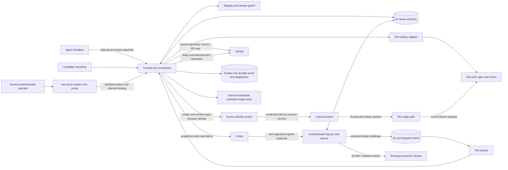

## Context

See `proposal.md` for motivation and
`specs/shared-test-environment/spec.md` for required behavior. DEOS already
uses authenticated Linear ingress, a trusted Worker, D1 authority, Cloudflare
Workflows, attempt-scoped capabilities, and provider adapters that keep GitHub
and Linear credentials out of agent Sandboxes. The shared test environment must
extend those boundaries rather than create a second control plane.

The environment is a singleton, but its apps span more than one deployed
service. Each lease therefore needs one atomic owner record and one immutable,
per-service staging manifest. A lease may add test-only deploys and data, but it
must never gain a staging or live binding. Loss of an owner is a cleanup trigger,
not an unlock signal.

The real Linear team is part of the test because provider-originated proof is a
goal. Test isolation comes from a saved task/run/lease scope, a unique expected
provider event, and test-only app stores, not from a special issue label. Durable
proof must move out of the test environment before that environment is erased.

## Goals / Non-Goals

**Goals:**

- Put lease, write-fence, setup, release-attestation, and cleanup decisions
  behind one trusted D1-backed coordinator.
- Reproduce the complete staging release active at grant time and make any
  version mismatch a hard gate before agent, browser, or provider writes.
- Let an agent exercise the real app through narrowly scoped capabilities and
  browser sessions while secrets and staging/live resources remain unreachable.
- Make setup, use, proof publication, cleanup, and reuse resumable and
  idempotent after retries or process loss.
- Give reviewers durable provider-originated, command, data, and visual proof
  that remains readable after the shared site is free.

**Non-Goals:**

- General-purpose preview environments or concurrent per-branch environments.
- A new release action from the test site to staging or live.
- Copying staging or live data into test stores.
- Giving the browser or Sandbox direct Cloudflare, GitHub, or Linear
  credentials.
- Treating a synthetic signed webhook request as provider-originated evidence.

## Component diagram



The trusted test coordinator is a Worker-side service, not an agent tool with
provider credentials. It owns lease admission, state transitions, browser
sessions, capability checks, deployment orchestration, release attestations,
proof publication, and cleanup.

There is one Linear webhook registration and one secret owner: the existing
authenticated ingress. It verifies and deduplicates each delivery once, then
atomically chooses either the test inbox or the existing production path. The
test environment does not register a second webhook and does not expose a test
webhook route. The existing invariants remain in force: verify the raw body with
HMAC-SHA256, treat `Linear-Timestamp` as milliseconds, deduplicate with
`Linear-Delivery`, and return HTTP 200 for accepted, ignored, and duplicate
deliveries.

`test-deos.voxdez.com` fronts the environment. Its root is the status portal,
and both the portal and test app routes are Access-protected at the edge. The
portal accepts only a verified, allowlisted human Access principal, passes that
identity to the coordinator over an internal service binding, and receives a
sanitized status view. It cannot read secrets, private app rows, or stored
diagnostic detail. Test app routes additionally require the active lease session.
The cloud browser uses a distinct lease-scoped Access service identity created
and held by the trusted browser service. Its credential is never returned to the
Sandbox, is accepted only for this Access application and test-app policy, and
is revoked and read back as absent during cleanup.

## Event flow

### Mandatory app-task gate

1. After implementation produces a verified cumulative patch, trusted workflow
   code compares changed paths with the deployable app and provider-integration
   roots registered in the test environment's service manifest. A match marks
   the run `test_required`. This deterministic classification needs no Linear
   label and cannot be supplied or waived by an agent.
2. A new `shared_test_demo` agent node sits after implementation and before
   evidence verification and native OpenSpec verify. Its trusted admission
   prelude creates a UUIDv7 demo attempt and derived Sandbox ID, restores the
   hash-checked cumulative patch and exact candidate from R2, and submits the
   visit-scoped lease request before starting the Sandbox. A waiting request
   records the current attempt but runs no process. A trusted stage retry may
   replace that attempt only after the old attempt is terminal and its Sandbox
   is destroyed; it reuses the same request and FIFO sequence.
3. After grant, the existing supervisor starts a fresh demo Sandbox bound to the
   attempt, run, lease, candidate, and fence. The saved demo request and source
   bundle are passed through files. The Sandbox receives only the lease-scoped
   app/browser capability and the cloud service browser; it gets no provider or
   Access credential. The browser service holds a short-lived Access service
   token whose identity names the lease, whose policy reaches only test-app
   routes, and whose resource intent is part of cleanup. The Sandbox drives the
   real app, maintains the lease heartbeat, and saves sanitized screenshots and
   command output. Trusted adapters perform the exact GitHub/Linear operations,
   D1 reads, evidence ingestion, and proof publication. Only the coordinator can
   create the attestation after checking those outputs.
4. The supervisor collects the result through the existing attempt lifecycle and
   destroys the Sandbox before completion. Agent failure or heartbeat loss
   quiesces and cleans the lease; it cannot produce an attestation. Waiting for
   the singleton, blocked proof, failed cleanup, a missing demo result, and a
   changed candidate all prevent advancement to verification, final approval,
   archive, or success.
5. A run with no changed registered app/provider path records a trusted
   `test_not_required` decision with the patch digest and may pass the node. The
   release guard independently rejects later deployment of an app candidate
   without a complete attestation, so workflow and release both fail closed.
6. The node ships in a new immutable workflow definition. SAC-182 starts a fresh
   run under that definition as the first `test_required` task; its prior frozen
   run is not mutated. Later ordinary app tasks enter by deterministic patch
   classification, not by a special test label or agent choice.

### Acquire and prepare

1. The `shared_test_demo` prelude derives the stable request ID from run, node
   visit, task, and candidate commit, and submits it with the current attempt,
   workflow stage, and frozen GitHub repository, branch, and pull request. An
   exact stage retry for the same visit and candidate CAS-replaces
   `current_attempt_id` after proving the prior attempt terminal and destroyed;
   it keeps the existing row and FIFO sequence. If the candidate changes,
   trusted code cancels the old waiting request. An active old-candidate lease
   must quiesce and clean before the new candidate gets its distinct request ID
   and sequence.
2. The coordinator performs a trusted Linear read. It saves the issue ID, key,
   title, and current team ID. A task outside the current DEOS team is rejected.
   No test label is read or required.
3. Staging deployment uses a D1 staging-release pointer. Before changing any
   staging traffic, the staging controller atomically marks that pointer
   `updating` with an operation ID, intended manifest, owner, and heartbeat
   deadline. After every service reaches 100% of the intended version and is
   read back, it publishes one immutable manifest containing all source commits,
   deployed versions, and one traffic revision, then marks the pointer `stable`.
   A reconciler handles an expired update: it publishes the intended manifest if
   actual traffic reached it, restores the prior stable pointer if actual traffic
   never moved, or records `manual_reconciliation_required` for mixed or unknown
   traffic. It never guesses a stable base.
4. Submission only inserts or reloads a `waiting` request and allocates its
   monotonic sequence; submission never grants. When there is no owner, the
   coordinator installs `grant_validation` for the minimum waiting sequence,
   then revalidates its Workflow attempt, DEOS team, exact candidate commit, and
   frozen GitHub scope. A guarded transaction records the validation revision
   and deadline and changes that head to `eligible`, or changes a stale head to
   `canceled` and repeats with the next sequence. The validation hold has a
   deadline; after controller loss, a reconciler may reclaim it only for the
   same current minimum sequence.
5. Before grant, the coordinator reads each service's actual staging traffic and
   running version twice. Both reads must show the same traffic revision at 100%
   and must match the pointer's complete stable manifest, including source
   commit and deployed version. This detects direct or out-of-band deploys that
   did not participate in the pointer protocol. Drift marks the pointer
   `reconciliation_required` and blocks grant until a new manifest is proved
   from actual live staging.
6. The sole grant transaction requires all of these facts together: no owner;
   the validation hold belongs to this request; the request is `eligible` with
   an unexpired current validation; no older `waiting`, `validating`, or
   `eligible` row exists; the staging pointer is `stable`; and the just-read
   actual traffic revision still matches. It binds the staging manifest and
   traffic revision, installs the first recorded lease fence epoch, changes the
   site to `preparing`, and clears the hold. A concurrent staging rollout either
   precedes that captured manifest or starts after grant. A new or unvalidated
   request can never acquire the site or bypass an older head.
7. The deploy adapter resolves each manifest entry to immutable deploy input,
   creates only lease-namespaced test resources, and starts every service from
   that base. It reads every running version back. All source, deploy, and
   traffic facts must match before the lease becomes `active`.
8. Before every external resource creation, one D1 transaction inserts a
   `planned` resource intent with lease/run ownership, creation fence, a stable
   operation ID, deterministic provider name or marker, and any encrypted
   recovery-payload reference. Only then may the adapter call the provider. A
   retry looks up that identity at the provider and moves the same intent to
   `created`; it never creates a second resource. Cleanup cannot pass until every
   intent, including one with no saved provider response, reconciles to a known
   resource and then to proved absence.

### Exercise the app

1. The active lease gives the Sandbox opaque, attempt-scoped operations. Every
   call reloads D1 and must match run, attempt, lease, current fence epoch, and
   allowed operation.
2. The coordinator issues a one-use launch token only through the active
   attempt capability. The trusted browser service presents the lease's Access
   service token to the edge and exchanges the launch token for a short-lived
   HttpOnly, Secure, SameSite lease session. Every test-app request reloads the
   singleton owner and requires the session's lease, run, fence epoch, and
   `access_identity_id` to match. It injects that scope into the app; all
   test-store access is partitioned by lease. An old session fails immediately
   after the fence changes, and a caller without both the lease-specific Access
   identity and a current lease session cannot reach test app routes. Human
   portal identities cannot exchange agent launch tokens.
3. Test changes may replace a service's test deploy with a build from the saved
   run branch and candidate commit. The pinned base manifest remains unchanged
   for attribution and reset. Unchanged services continue on their pinned base.
   No test operation can target a staging or live route.
4. The apps receive only test-store and test-service bindings. Provider secrets
   remain in trusted adapters. GitHub operations are checked against the saved
   repository, branch, and pull request. Before each Linear write, the
   coordinator re-reads the issue and stops if it left the saved DEOS team.
5. The selected provider operation is a reversible test fixture on the admitted
   Linear Issue: the adapter appends one standalone lease marker to the exact
   saved description without creating a second issue. The provider's Issue
   `update` webhook must carry the admitted issue ID,
   team ID, actor, action/type, changed description with marker, prior
   description fact, and millisecond timestamp in the signed body. Before code
   implementation, a real temporary issue in the DEOS team must prove those
   fields, signature rules, timestamp unit, actor identity, and response contract
   from Linear's primary documentation and a provider-originated delivery. The
   captured sanitized payload and D1 classification become contract evidence.
   If any required fact is absent or transformed, implementation stops and this
   design is revised; a comment or synthetic payload is not substituted.
6. The reserved marker is `<!-- deos-test-v1:<expectation_id>:<mac> -->`,
   where `mac` is `base64url(HMAC-SHA256(versioned_test_challenge_secret,
   expectation_id))`. D1 saves the expectation ID, secret version, and challenge
   hash, so trusted code can reconstruct and authenticate the same marker after loss
   without storing plaintext. Before the Linear call, it writes both the
   expected-event row and a `planned` resource intent containing the issue ID,
   exact marker bytes, before/after hashes, deterministic operation ID, and an
   encrypted reference to the original description. Cleanup removes only those
   exact marker bytes from the latest provider value and preserves all other
   bytes, including a concurrent human edit. If the marker is already absent,
   cleanup records absence. A changed or ambiguous marker enters audited manual
   reconciliation rather than overwriting unrelated text.
7. The existing ingress authenticates and deduplicates before routing. It parses
   a reserved marker only as a candidate. In one D1 transaction it verifies the
   marker MAC, loads an active unclaimed expectation, and compares the signed
   issue, team, entity, action, actor, prior-value, challenge, time, and fence
   facts. Only that complete exact match gets exclusive test routing. A missing,
   malformed, unknown, expired, already claimed, foreign, wrong-fence, or
   otherwise mismatched marker is audited and follows the existing production
   routing rules; text alone can never suppress a production event.
8. For the exact test match, the same transaction claims the expectation and
   inserts a `pending` dispatch keyed by `Linear-Delivery`. After commit, ingress
   sends that stable ID to the test Queue. The dispatch is exclusive: one
   delivery can have only a production intent or a test intent. Accepted,
   ignored, production-routed, and duplicate deliveries all return HTTP 200.
9. The consumer claims `pending`, or reclaims `processing` whose claim deadline
   expired, by writing a new claim token and deadline. Processing uses stable
   operation IDs, heartbeats the claim, and may mark `done` only with its current
   token. The reconciler scans pending and stale-processing rows and resends the
   delivery ID. Duplicate ingress returns HTTP 200 and triggers the same
   reconciliation for any non-done dispatch. Process loss therefore cannot
   strand or duplicate the provider proof effect.
10. Successful app exercise creates an `observed` test attestation bound to the
   task, run, lease, repository, candidate commit, pull request, and base
   manifest. It becomes `complete` only when the pre-clean proof gate, cleanup,
   absence checks, and atomic lease close finish.
   Every later staging or live deployment entrypoint must ask the trusted
   release guard for a `complete` attestation for the exact task and candidate
   commit. A missing, stale, or different-commit attestation rejects release.
   The active workflow currently has no release node; this guard is the common
   precondition any later release path must use, not a new test-site release.
11. The supervisor and Sandbox heartbeat the attempt and lease while the demo
   runs. Heartbeats extend an observation deadline but never transfer ownership. If
   the deadline passes or the Workflow fails, a guarded transition increments
   the fence, records the new epoch in the lease history, and moves the
   environment to `quiescing`. Old capabilities and
   browser sessions are rejected, and recovery proceeds through cleanup.

### Publish proof and clean

1. Normal completion and recovery enter `quiescing`. The coordinator increments
   the fence, appends that epoch to the lease history, disables new app sessions
   and provider operations, and reconciles already accepted operations to a
   recorded outcome. It does not hide an ambiguous outcome behind cleanup.
2. Safe screenshots, Showboat command output, D1 read-back, and provider
   receipts are copied to create-only proof objects outside the test site's
   deploy and stores. Each item has a media type, byte count, SHA-256, and
   durable review URL. Synthetic ingress, provider-originated ingress, and
   visual proof are labeled separately. Raw and diagnostic objects remain on an
   Access-protected route. A second store accepts only sanitizer-approved image
   bytes and serves each immutable object at an opaque, non-listable anonymous
   URL so GitHub can render it. It has no cookies, index, mutation route, or
   access to raw proof.
3. Before cleanup, the coordinator allocates stable URLs for both the initial
   proof items and a later cleanup/free manifest. It publishes and reads back the
   initial objects first. The trusted GitHub adapter then GETs the pull request
   body, replaces only the lease marker, and updates it. If the provider canary
   proves a strong ETag precondition, it uses `If-Match` and retries a failed
   precondition from a fresh GET. Otherwise it uses a D1 mutex for DEOS writers,
   persists the observed pre-write body and digest, performs a marker-scoped
   read/merge/update/read loop, and retries any observed body revision from a
   fresh merge. An unmergeable or unverifiable conflict blocks before cleanup.
   The body embeds the renderable sanitized images, links command, data, receipt
   items individually, and links the stable cleanup/free manifest. A repository
   path or test-host path is not an attachment. Read-back must preserve all
   unrelated content from the accepted input revision and verify the marker and
   every initial item by byte count and SHA-256.
4. Cleanup uses a capability bound to the current cleanup fence, but ownership
   comes from the immutable resource ledger. It may delete a resource only when
   its provider tags and ledger row match the same run and lease and its
   `creation_fence_epoch` has a row in that lease's append-only fence history. It
   never requires the creation epoch to equal the newer cleanup epoch and never
   deletes an unledgered resource.
5. Cleanup removes test app data, the admitted issue's exact lease marker, test
   deploy state, lease-scoped secret material, and the browser Access service
   identity. Marker removal preserves all other current description bytes. Each
   removal is followed by a provider or store read that proves the owned fixture,
   credential, data, or deploy is absent. A resource with another run or lease
   is left unchanged and raises a scoped fault.
6. A recoverable ambiguity changes the owned phase to `blocked` and creates a
   `manual_reconciliation_required` record. An allowlisted Access operator may
   choose only a typed retry or a resource-specific reconciliation against the
   saved operation and current revision. The coordinator repeats the provider
   read, records operator identity, evidence hashes, decision, and original cause,
   and accepts absence only from authoritative provider/store evidence. It may
   remove the exact lease marker from a human-edited description, but cannot
   discard other text, waive a remaining resource, widen ownership, or force the
   site free. A successful bounded reconciliation resumes the same checkpoint.
7. Once every cleanup and absence row passes, one guarded D1 transaction verifies
   the current owner and fence, writes the immutable cleanup facts and committed
   free-transition receipt, changes the exact attestation to `complete`, closes
   the lease, clears the owner, and sets the environment to `free`. The receipt
   describes the revision that actually committed; no receipt predicting a
   future transition is published. The next request may validate immediately and
   must capture actual current staging again.
8. After commit, a projector copies the already-durable cleanup facts, absence
   checks, committed receipt, and historical closed-lease portal view into the
   stable cleanup/free manifest linked from the pull request. This does not retain
   site ownership or delay the next lease. A projection failure preserves its
   original cause and retries from D1; it makes the demonstration evidence
   incomplete but cannot turn the already cleaned site back into an owned state.

### First full demonstration

SAC-182 is the first admitted task. Its final evidence set must show, in order,
the replay-safe lease grant, actual-live staging capture and running read-back,
SAC-182 identity on the portal, lease-bound real app behavior, scoped GitHub
result, one challenge-correlated provider-emitted Linear delivery, durable app
and provider records, pre-clean proof read-back, cleanup absence checks, the
atomic committed free-transition receipt, the linked final manifest read-back,
and the portal's historical closed-lease view showing the free transition. A direct
correctly signed request can be retained only under the separate `synthetic
ingress` classification.

## Decisions

### App tasks cannot bypass the shared-test node

The trusted patch-to-service-manifest comparison is the sole eligibility rule.
A required run blocks at `shared_test_demo` until pre-clean proof, cleanup, and
absence checks make the exact candidate attestation complete in the lease-close
transaction. Its trusted prelude allocates the attempt and lease; its fresh
supervised Sandbox is the only demo driver, and trusted
adapters are the only evidence and attestation producers. The graph cannot treat
waiting, blocked cleanup, agent output, or a missing result as success. The
release guard is a second enforcement point, not the only one.

A Linear label was rejected because approved requirements allow ordinary tasks
without one. Agent judgment was rejected because eligibility and workflow
progression must remain deterministic and auditable.

### D1 is the lease authority and write fence

The environment, request, lease, and staging pointer are read and changed in
guarded D1 transactions. Grant selects the minimum eligible sequence and proves
that no older waiting request exists in the same transaction. An increasing
fence epoch is included in capabilities, browser sessions, and side-effect
operations. State and hold transitions are:

```text
free -> preparing -> active -> quiescing -> cleaning -> free
          |           |           |          |
          +-----------+-----------+----------+--> blocked
                                                    |
                         bounded reconciliation ----+
                         resumes the saved owned phase
```

Version mismatch and heartbeat loss may move `preparing` directly to
`quiescing`. `blocked` is an owned overlay with a saved resume phase, not an
unowned terminal; bounded reconciliation can return only to that checkpoint.
There is no expiry-to-free or operator force-free transition. A timed
distributed lock was rejected because expiry can overlap a provider call or
incomplete cleanup. Workflow memory alone was rejected because retries, deploys,
and lost processes must not lose state.

### Staging publishes one stable release manifest

Managed staging deployment entrypoints participate in the `updating`/`stable`
pointer protocol. The pointer carries rollout ownership and an expiry, and its
reconciler derives recovery only from actual traffic. The manifest is published
only after 100% traffic and version read-back and contains every app service.
Grant independently double-reads actual staging control-plane state and requires
it to match the stable manifest. A direct deploy therefore creates detected
drift rather than a false base. Lease grant and manifest capture occur in one
transaction against the rechecked traffic revision. A later rollout may begin
immediately after grant, but cannot alter the saved manifest.

Independent service reads only after grant were rejected because a rollout can
split the base. Trusting only the pointer was rejected because direct deployment
can bypass it. A hostname or branch was rejected because both move. A staging
data snapshot was rejected because the requirement calls for isolated test data.

### One ingress routes a qualified Issue-update challenge exactly once

The selected contract is a Linear Issue description update whose signed `update`
event carries the task, team, actor, old description, challenged description,
and provider timestamp. A real-resource canary must prove that primary contract
before implementation. The reserved `deos-test-v1` marker has an HMAC-authenticated
expectation ID and is deterministically recoverable from a versioned secret.
The prefix alone has no routing authority. Only a valid MAC plus one active,
unclaimed expectation and a full signed-fact match selects test routing. Every
other delivery follows ordinary production rules while any marker anomaly is
also audited; user-controlled description text cannot suppress production.

The authenticated production ingress remains the only Linear endpoint and
secret owner. Its claim transaction inserts the replayable test dispatch intent
alongside the expectation and delivery; Queue notification is reconciliation of
that intent, not the durable decision. A second webhook was rejected because it
can duplicate or miss deliveries. A comment was rejected unless the primary
contract proves every signed task/team fact; issue/team plus a time window was
rejected because unrelated activity could be misattributed.

### Every external resource begins with a durable intent

Deploys, stores, secrets, app fixtures, browser Access identities, and the
temporary Linear description marker all receive a D1 intent before a provider
call. Stable names or ownership markers let retries and cleanup find provider
state without a response. The Linear intent retains the exact marker bytes and
an encrypted recovery reference to the original description. The fixture is the
marker on the admitted task, not a disposable second issue; cleanup proves that
marker absent while preserving other description text. No intent can be omitted
from absence checks.

Recording only successful creates was rejected because a crash after provider
acceptance could create an orphan that the resource ledger cannot discover.

### Portal and app access are fenced at the edge

The status portal requires a verified allowlisted Access identity and reaches
the coordinator only through an internal binding. It returns the minimum
sanitized issue, stage, base, and lease status required by the specification.

Access authentication alone identifies a principal, not a lease. Human portal
users use allowlisted email identities. The trusted browser service holds a
separate, short-lived Access service token created for one lease and accepted
only by the test-app policy; the Sandbox never sees it. The one-use launch
exchange adds run, lease, attempt, Access identity, and fence scope. Every
request checks current D1 authority, and the app can address only the injected
lease partition. Cleanup revokes the service token and proves it absent. This
makes stale browser cookies or browser-service credentials harmless after
quiescing or reuse.

An unscoped shared hostname was rejected because an old browser session could
write into the next run. Passing provider or store credentials to the page was
rejected because it would bypass the edge fence.

### Release requires an exact completed test attestation

The test result is a durable attestation for one candidate commit, not a mutable
branch. Staging and live deployment authorities fail closed unless the exact
task and candidate have a completed attestation. A new commit requires a new
test lease. The test site itself has no release capability.

Relying on workflow convention was rejected because an independent or future
release entrypoint could bypass it. Attesting only a branch was rejected because
the branch can move after testing.

### Cleanup frees the site before projecting final proof

The initial proof set is attached and read back before destructive cleanup.
The body also carries a stable link to the future cleanup/free manifest, so it
does not require a post-cleanup body rewrite. Strong ETag conditional update is
preferred when the provider canary proves it. The defined fallback serializes
DEOS writers and uses a persisted marker-scoped read/merge/update/read loop;
any unmergeable conflict blocks before destruction. Sanitized images use a
separate immutable GitHub-renderable store, while raw evidence stays protected.

After absence is proved, one transaction saves the cleanup facts, completes the
attestation, closes the lease, records the committed free receipt, and frees the
site. A projector then fills the already-linked final manifest from those durable
facts without holding the environment. Resources retain their creation epoch;
a newer cleanup capability is authorized over exactly the epochs recorded in the
lease history and the planned intents for that lease.

One best-effort handler was rejected because partial failure can lose remaining
work. Holding a cleaned site for external proof publication was rejected because
the approved plan says not to keep it open merely to preserve proof. Publishing
only after cleanup was rejected because the required pre-destruction proof gate
would be lost.

### Failures use create-only proof storage and D1 as independent sinks

The coordinator first serializes a redacted failure envelope containing the
original message, stack, cause chain, operation context, and lease facts. It
writes a deterministic create-only diagnostic object outside the test site,
then indexes its hash in D1. If object storage fails, D1 stores the full envelope
plus that storage error. If D1 fails after the object succeeds, a secondary
create-only object records the D1 failure and points to the primary object. A
reconciler indexes unindexed diagnostic objects later.

The phase cannot mark failure complete, clean resources, or clear a hold until
at least one sink durably contains the primary error. If both sinks are
unavailable, it propagates the combined error and retries without advancing.
Cleanup or diagnostic-write failures are secondary and never replace the first
cause.

### Public status and private diagnostics are separate views

The portal view contains state, issue key and title, workflow stage, base
versions, lease start time, and any admission hold. `preparing`, `active`,
`quiescing`/`cleaning`, `blocked`, and `free` have explicit human-readable
presentations. A historical closed-lease view exposes the sanitized committed
free transition even if another lease has since started. Only closed-owner
`free` is called free; the issue is the leading owner identity; role and opaque
IDs are secondary.

Detailed errors, stacks, cause chains, provider payloads, and private app data
remain in trusted diagnostics. A bounded safe code may appear in the portal,
but never replaces the retained original error.

## Minimal data model

| Record | Key fields | Purpose and invariants |
| --- | --- | --- |
| `test_environment` | `environment_id`, `state`, `resume_state`, `active_run_id`, `active_lease_id`, `fence_epoch`, `heartbeat_deadline`, `admission_hold`, `last_lease_id`, `blocked_failure_id`, `revision` | Singleton authority. Owned and blocked states carry run and lease; grant requires no owner/hold and a validated queue head. |
| `staging_release_pointer` | `environment`, `state`, `manifest_id`, `traffic_revision`, `update_operation_id`, `update_owner`, `intended_manifest_id`, `heartbeat_deadline`, `reconciliation_failure_id`, `revision` | Shared staging controller/grant lock. Grant requires `stable` plus matching double-read actual traffic. Expired updates reconcile from provider state. |
| `staging_release_services` | `manifest_id`, `service`, `source_commit`, `deployed_version`, `immutable_deploy_input`, `traffic_read_back_at` | Immutable complete service set for one staging traffic revision. |
| `test_task_decisions` | `run_id`, `candidate_commit`, `patch_sha256`, `manifest_revision`, `decision`, `matched_service_roots`, `decided_at` | Trusted deterministic record of `test_required` or `test_not_required`; agents cannot waive it. |
| `test_lease_requests` | `request_id`, `request_sequence`, `run_id`, `node_visit`, `current_attempt_id`, `task_id`, `candidate_commit`, `state`, `validation_revision`, `validation_deadline`, `validated_at`, `superseded_attempts` | Unique on run, node visit, task, and candidate commit. A trusted retry replaces only a terminal destroyed attempt and preserves FIFO identity. Grant requires current validation and no older waiter. |
| `test_leases` | `lease_id`, `request_id`, `run_id`, `attempt_id`, `task_id`, `task_key`, `task_title`, `team_id`, `workflow_stage`, `state`, `current_fence_epoch`, `staging_manifest_id`, `started_at`, `closed_at`, `repository`, `branch`, `pull_request`, `candidate_commit` | Immutable owner and provider scope. Scope and base fields cannot change after grant. |
| `test_lease_fence_epochs` | `lease_id`, `run_id`, `fence_epoch`, `reason`, `created_at`, `transition_revision` | Append-only authority history. Resource cleanup accepts a creation epoch only when this exact lease owns a matching row. |
| `test_access_identities` | `access_identity_id`, `run_id`, `lease_id`, `resource_id`, `audience`, `policy`, `principal_hash`, `created_at`, `revoked_at`, `absence_checked_at` | Lease-specific browser service identity. The credential stays in the trusted browser service and is revoked and read back during cleanup. |
| `test_app_sessions` | `session_hash`, `lease_id`, `run_id`, `attempt_id`, `fence_epoch`, `access_identity_id`, `access_principal_hash`, `expires_at`, `revoked_at` | Hashed, short-lived browser session. Each request also checks current D1 fence and lease Access identity. |
| `test_resources` | `resource_id`, `lease_id`, `run_id`, `creation_fence_epoch`, `resource_type`, `intent_state`, `deterministic_provider_key`, `provider_resource_id`, `create_operation_id`, `recovery_payload_ref`, `cleanup_state`, `absence_checked_at` | Pre-create intent and resource ledger. Cleanup resolves every intent, including one without a provider response. Secret values are never stored. |
| `test_expected_events` | `expectation_id`, `run_id`, `lease_id`, `fence_epoch`, `task_id`, `team_id`, `entity`, `action`, `actor_id`, `challenge_secret_version`, `challenge_hash`, `marker_hash`, `prior_value_hash`, `valid_from_ms`, `valid_to_ms`, `claimed_delivery` | One-use Issue-update matcher. Trusted code can reconstruct the deterministic challenge after loss. A prefix without a full active match has no routing authority. |
| `test_provider_deliveries` | `linear_delivery`, `linear_timestamp_ms`, `task_id`, `team_id`, `lease_id`, `run_id`, `classification`, `routing_destination`, `expectation_id`, `marker_audit`, `result_ref` | Global idempotency and exclusive routing evidence. `linear_delivery` is unique; only a complete expectation match selects test routing. |
| `test_delivery_dispatch` | `linear_delivery`, `run_id`, `lease_id`, `expectation_id`, `state`, `claim_token`, `claim_deadline`, `queue_operation_id`, `attempt_count`, `last_attempt_at`, `result_ref` | Replayable test inbox. Pending and expired processing claims are reconciled by delivery ID until `done`. |
| `test_operations` | `operation_id`, `run_id`, `lease_id`, `fence_epoch`, `kind`, `target`, `state`, `provider_receipt`, `started_at`, `finished_at` | Reconciles retries and in-flight app/provider effects before teardown. |
| `test_attestations` | `attestation_id`, `task_id`, `run_id`, `lease_id`, `repository`, `candidate_commit`, `pull_request`, `base_manifest_id`, `state`, `completed_at`, `close_revision` | Exact release precondition. The atomic close transaction changes `observed` to `complete` only after initial proof, cleanup, and absence gates pass. |
| `test_proof_items` | `proof_id`, `run_id`, `lease_id`, `phase`, `kind`, `classification`, `visibility`, `storage_key`, `media_type`, `byte_count`, `sha256`, `review_url`, `body_marker`, `read_back_at`, `projected_at` | Immutable proof inventory outside the test environment. Only approved sanitized images may use anonymous render URLs; raw proof stays Access-protected. |
| `test_cleanup_checks` | `run_id`, `lease_id`, `resource_id`, `remove_operation_id`, `remove_state`, `read_back_state`, `checked_at` | Per-resource removal and absence gate. All required rows must pass before free state. |
| `test_lease_closures` | `lease_id`, `run_id`, `close_revision`, `attestation_id`, `cleanup_digest`, `absence_digest`, `committed_at`, `receipt_signature`, `projection_state` | Receipt for an already committed close-and-free transaction and source for post-close proof projection. |
| `test_manual_reconciliations` | `reconciliation_id`, `run_id`, `lease_id`, `resource_id`, `resume_state`, `required_action`, `expected_revision`, `operator_principal_hash`, `decision`, `evidence_hashes`, `primary_failure_id`, `resolved_at` | Bounded operator recovery. It cannot waive absence, change ownership, or force free; a successful resolution resumes the saved phase. |
| `test_failures` | `failure_id`, `run_id`, `lease_id`, `phase`, `operation_id`, `safe_code`, `diagnostic_object_key`, `diagnostic_sha256`, `original_message`, `stack`, `cause_chain`, `context`, `occurred_at`, `secondary_failure_ids` | D1 index or full fallback envelope. The first failure remains primary; secondary writes cannot mask it. |

All timestamps used for provider admission are stored with their source; the
Linear webhook timestamp remains an integer number of milliseconds. Raw
secrets, authorization headers, and unredacted provider replies are not stored.

## Failure modes

| Failure | Required behavior | Recovery gate |
| --- | --- | --- |
| Two requests race or one request replays | Submission never grants. Visit-and-candidate identity returns one row, head validation records a deadline, and the sole grant predicate requires that currently validated eligible head with no older request. | Only the oldest currently validated eligible request can be granted. |
| Stage retry replaces the demo attempt | Prove the prior attempt terminal and Sandbox destroyed, CAS-replace `current_attempt_id` on the existing waiting request, and preserve its sequence. An active prior attempt quiesces and cleans before reuse. | One run, node visit, task, and candidate has one request; the granted lease binds the current attempt. |
| Staging rollout races grant | `updating` blocks grant; double-read actual traffic and a grant transaction capture one matching stable manifest before a later rollout can start. | A complete manifest matching unchanged 100% actual traffic is required. |
| Direct staging deploy causes pointer drift | Mark the pointer `reconciliation_required`; do not trust the stale stable manifest or deploy it to test. | Rebuild and publish a manifest from twice-stable actual traffic with known source commits and versions. |
| Staging controller dies while `updating` | The deadline reconciler reads actual traffic. It completes the intended manifest, restores the prior stable pointer, or records manual reconciliation for mixed/unknown state. | Only authoritative, unchanged 100% traffic can return the pointer to `stable`. |
| Running service differs from saved base | Keep the owner in `preparing`, fence app/provider writes, save the mismatch, and transition through `quiescing` to cleanup when setup cannot be repaired. | Correct and prove every service version, or clean the owned setup before another grant. |
| Old capability, browser session, Access identity, or foreign caller reaches the site | Reject at the trusted endpoint or edge before app/store access; audit the mismatched lease, identity, and fence safely. | Caller must use the current attempt capability, lease Access identity, and lease session. |
| Task leaves the DEOS team | Stop the pending Linear write, preserve the provider/read cause, and quiesce if the run cannot safely continue. | A trusted read must establish valid scope; never start a live flow as fallback. |
| Linear primary contract lacks a required signed fact | Stop before implementation or enablement and preserve the provider-originated canary evidence. Do not substitute a fake payload or weaker matcher. | The selected Issue update must prove every matcher and response fact on a real DEOS-team test issue. |
| Linear description update loses its response | Reconstruct the deterministic challenge and operation ID, reconcile the pre-create intent by issue ID and exact marker bytes, and reuse or remove it. | The intent must resolve to created or marker-absent before cleanup passes. |
| Human edits the challenged description | Remove only the exact standalone lease marker from the latest value and preserve all other bytes. An altered ambiguous marker enters manual reconciliation. | Provider read-back must prove the marker absent; no unrelated text may be discarded. |
| Linear delivery does not match the expected challenge | Audit the marker mismatch and route the delivery through existing production rules. Never let marker text alone suppress production or dispatch one delivery to both destinations. | Only one authenticated, active, unclaimed full matcher can enter test flow. |
| Claimed test delivery loses Queue notification | Leave its dispatch `pending`; duplicate ingress and the reconciler resend the stable delivery ID. | The consumer must record `done` before provider proof is complete. |
| Test consumer dies while processing | Let the claim deadline expire; the reconciler resends and a consumer takes over with a new token and stable effect IDs. A stale token cannot commit. | Current-token processing must record `done`. |
| Linear delivery is duplicate | Return HTTP 200, reuse its exclusive classification, and reconcile pending or expired-processing test dispatch without another claim. | The first route is final; dispatch remains replayable. |
| Release asks for an untested or changed commit | The common release guard rejects staging/live deployment and records the missing or stale attestation. | Exact task and candidate commit must have a `complete` attestation. |
| Heartbeat is lost | Increment the fence and enter `quiescing`; reject old app sessions and do not grant a waiter. | Reconcile operations, publish initial proof, and complete cleanup. |
| Provider effect times out ambiguously | Preserve the original timeout and context; reconcile by stable operation ID before retry or cleanup. | Confirmed provider result or explicit manual reconciliation is required. |
| Pull request body changes during proof update | With proven ETag support, retry a failed precondition from a fresh GET. Otherwise hold the DEOS writer mutex, persist the observed body, rerun the marker-scoped merge, and fail before cleanup on an unmergeable or unverifiable revision. | Read-back must preserve unrelated content from the accepted input revision and verify the marker and initial items. |
| Initial proof update or read-back fails | Keep resources and lease fenced, retain proof objects and first cause, and do not enter cleaning. | Body marker and every initial item must match size and SHA-256. |
| GitHub cannot render protected proof images | Publish only sanitizer-approved image bytes to the immutable, opaque render store; keep raw proof on Access-protected routes. | GitHub body read-back and image fetch must return the expected media type, byte count, and SHA-256 before cleanup. |
| Resource deletion fails | Continue only independent diagnostic reads; do not report success or replace the delete failure. | Retry idempotent delete and prove absence. |
| Cleanup sees a prior fence epoch for the same lease | Permit deletion only through the current cleanup capability, immutable ledger/provider ownership match, and exact row in `test_lease_fence_epochs`. | Same run and lease plus the recorded creation epoch are required. |
| Cleanup finds another run's resource | Leave it unchanged and raise a scoped cleanup fault. | Resolve ownership; never widen the delete query. |
| Blocked cleanup needs operator action | Create a revision-bound `manual_reconciliation_required` record and retain the original cause. Permit only typed retry or resource-specific reconciliation with authoritative evidence. | All owned resources must still pass absence checks; there is no force-free action. |
| Close-and-free transaction conflicts or is lost | Publish no transition receipt. Reload the owned cleaning checkpoint and retry the single guarded transaction; an exact committed replay returns the stored closure. | Only a committed `test_lease_closures` row may be projected as the free receipt. |
| Post-close proof projection fails | Keep the committed environment free, retain the projection error separately, and retry from immutable closure and cleanup rows. Do not publish a predictive receipt or reclaim ownership. | The SAC-182 demonstration stays incomplete until the linked final manifest and each item read back. |
| D1 diagnostic write fails | Preserve the primary create-only diagnostic object and add a secondary object for the D1 failure. | Reconciler must index the hash before the phase is considered recorded. |
| Diagnostic object write fails | Store the full primary envelope and object-write error in D1. If both sinks fail, propagate and do not advance or clean. | At least one independent durable sink must retain the primary cause. |
| Portal cannot load private detail | Show only a safe unavailable/blocked state; never fall back to raw errors or provider payloads. | Restore the sanitized coordinator read. |

## Risks / Trade-offs

- **One environment serializes demonstrations** -> Keep acquisition FIFO and
  make setup/cleanup resumable. Never trade isolation for throughput.
- **Staging deployment now participates in a manifest protocol** -> Route managed
  entrypoints through the pointer and double-read actual traffic at every grant
  so direct deploy drift fails closed.
- **Per-request D1 fence checks add latency** -> Keep the status row compact and
  favor strict stale-session rejection over caching authority across requests.
- **Real provider challenges temporarily change the admitted Linear task** -> Use
  one standalone nonce marker, record its exact bytes before the write, remove
  only that marker, and prove it absent without replacing human edits.
- **Durable proof can expose private data** -> Sanitize before immutable upload,
  keep raw items Access-protected, and expose only approved image bytes through
  opaque, non-listable render URLs independent from test stores.
- **A blocked proof or cleanup reduces availability** -> Expose the exact phase
  and retained first cause, then use revision-bound operator reconciliation to
  resume its checkpoint. Never force-clear the owner or waive required absence.

## Migration Plan

1. Before implementation, inspect Linear's primary Issue-update webhook and
   mutation contracts, then use a real temporary DEOS-team issue to prove the
   signed description challenge, issue/team/actor facts, prior value, timestamp,
   HMAC verification, response identity, exact-marker removal after a concurrent
   edit, and cleanup behavior. Also test GitHub's strong-ETag conditional body
   update. If GitHub does not honor it, enable the defined D1-mutex and
   marker-scoped read/merge/update/read fallback. Stop and revise the design only
   if Linear cannot supply the signed facts or safe marker lifecycle.
2. Add the D1 records, deterministic app-path classifier, `shared_test_demo`
   workflow node, diagnostic object path, authenticated-ingress demux, and
   trusted coordinator with lease admission and test routing disabled. Schema
   changes are additive and retained on rollback.
3. Put managed staging deployment entrypoints behind the staging manifest
   pointer and every staging/live deployment entrypoint behind the
   test-attestation guard. Add pointer expiry recovery and actual-traffic drift
   detection. Seed one stable manifest only after two unchanged reads of 100%
   staging traffic and its source/version facts.
4. Provision test-only routes, stores, service bindings, deploy targets, the
   browser-service Access policy, protected proof routes, sanitized image route,
   and secret references. Verify that no staging/live data binding is present
   and that the browser identity cannot reach portal-admin, staging, or live
   routes.
5. Enable base capture and setup for a non-agent dry run. Read every running
   service version back, exercise session and Access-identity fencing, then run
   initial proof, cleanup, the atomic close receipt, post-close projection, and
   absence gates. Exercise the bounded manual reconciliation path without
   force-free behavior.
6. Put the portal and app routes behind Access, then enable sanitized portal
   states at `test-deos.voxdez.com`. Keep provider writes fenced until lease,
   session, version, and exclusive ingress routing
   gates are proven.
7. Enable one FIFO lease and resume SAC-182 through the mandatory workflow
   node. Collect challenge-correlated provider-made, visual, command, D1,
   GitHub, initial proof, cleanup, committed free-state, and projected final
   read-back evidence. Synthetic ingress may supplement but not replace the
   provider-made event.
8. Permit later tasks as soon as SAC-182's cleanup transaction has closed its
   lease and the portal reports free; its post-close projector may finish from
   immutable D1 facts without retaining the site. Enable release only for exact
   candidates carrying complete test attestations.

Rollback first disables new lease admission, test-event matching, and release.
It then increments any active fence. If a lease exists, the deployed coordinator
version that understands its ledger must finish initial proof and cleanup before
test routes or bindings are removed. An authenticated operator may use only the
bounded reconciliation actions described above. Rollback must not clear the
owner, clear an admission hold, delete diagnostics, or drop tables to make the
site appear reusable. Post-close proof projection remains retryable from retained
closure rows after the site is free.
