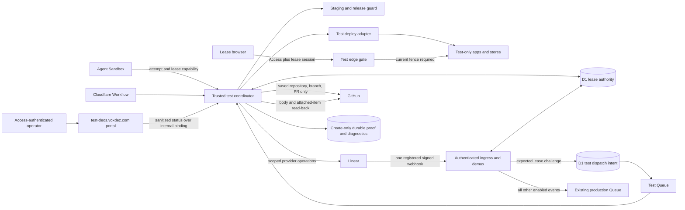

## Context

See `proposal.md` for motivation and
`specs/shared-test-environment/spec.md` for required behavior. DEOS already
uses authenticated Linear ingress, a trusted Worker, D1 authority, Cloudflare
Workflows, attempt-scoped capabilities, and provider adapters that keep GitHub
and Linear credentials out of agent Sandboxes. The shared test environment must
extend those boundaries rather than create a second control plane.

The environment is a singleton, but its apps span more than one deployed
service. Each lease therefore needs one atomic owner record and one immutable,
per-service staging manifest. A lease may add test-only deploys and data, but it
must never gain a staging or live binding. Loss of an owner is a cleanup trigger,
not an unlock signal.

The real Linear team is part of the test because provider-originated proof is a
goal. Test isolation comes from a saved task/run/lease scope, a unique expected
provider event, and test-only app stores, not from a special issue label. Durable
proof must move out of the test environment before that environment is erased.

## Goals / Non-Goals

**Goals:**

- Put lease, write-fence, setup, release-attestation, and cleanup decisions
  behind one trusted D1-backed coordinator.
- Reproduce the complete staging release active at grant time and make any
  version mismatch a hard gate before agent, browser, or provider writes.
- Let an agent exercise the real app through narrowly scoped capabilities and
  browser sessions while secrets and staging/live resources remain unreachable.
- Make setup, use, proof publication, cleanup, and reuse resumable and
  idempotent after retries or process loss.
- Give reviewers durable provider-originated, command, data, and visual proof
  that remains readable after the shared site is free.

**Non-Goals:**

- General-purpose preview environments or concurrent per-branch environments.
- A new release action from the test site to staging or live.
- Copying staging or live data into test stores.
- Giving the browser or Sandbox direct Cloudflare, GitHub, or Linear
  credentials.
- Treating a synthetic signed webhook request as provider-originated evidence.

## Component diagram



The trusted test coordinator is a Worker-side service, not an agent tool with
provider credentials. It owns lease admission, state transitions, browser
sessions, capability checks, deployment orchestration, release attestations,
proof publication, and cleanup.

There is one Linear webhook registration and one secret owner: the existing
authenticated ingress. It verifies and deduplicates each delivery once, then
atomically chooses either the test inbox or the existing production path. The
test environment does not register a second webhook and does not expose a test
webhook route. The existing invariants remain in force: verify the raw body with
HMAC-SHA256, treat `Linear-Timestamp` as milliseconds, deduplicate with
`Linear-Delivery`, and return HTTP 200 for accepted, ignored, and duplicate
deliveries.

`test-deos.voxdez.com` fronts the environment. Its root is the status portal,
and both the portal and test app routes are Access-protected at the edge. The
portal accepts only a verified, allowlisted Access principal, passes that
identity to the coordinator over an internal service binding, and receives a
sanitized status view. It cannot read secrets, private app rows, or stored
diagnostic detail. Test app routes additionally require the active lease session.

## Event flow

### Mandatory app-task gate

1. After implementation produces a verified cumulative patch, trusted workflow
   code compares changed paths with the deployable app and provider-integration
   roots registered in the test environment's service manifest. A match marks
   the run `test_required`. This deterministic classification needs no Linear
   label and cannot be supplied or waived by an agent.
2. A new `shared_test_demo` agent node sits after implementation and before
   evidence verification and native OpenSpec verify. Its trusted admission
   prelude creates a UUIDv7 demo attempt and derived Sandbox ID, restores the
   hash-checked cumulative patch and exact candidate from R2, and submits the
   lease request before starting the Sandbox. A waiting request retains the
   attempt record but runs no process.
3. After grant, the existing supervisor starts a fresh demo Sandbox bound to the
   attempt, run, lease, candidate, and fence. The saved demo request and source
   bundle are passed through files. The Sandbox receives only the lease-scoped
   app/browser capability and the cloud service browser; it gets no provider
   credential. It drives the real app, maintains the lease heartbeat, and saves
   sanitized screenshots and command output. Trusted adapters perform the exact
   GitHub/Linear operations, D1 reads, evidence ingestion, and proof publication.
   Only the coordinator can create the attestation after checking those outputs.
4. The supervisor collects the result through the existing attempt lifecycle and
   destroys the Sandbox before completion. Agent failure or heartbeat loss
   quiesces and cleans the lease; it cannot produce an attestation. Waiting for
   the singleton, blocked proof, failed cleanup, a missing demo result, and a
   changed candidate all prevent advancement to verification, final approval,
   archive, or success.
5. A run with no changed registered app/provider path records a trusted
   `test_not_required` decision with the patch digest and may pass the node. The
   release guard independently rejects later deployment of an app candidate
   without a complete attestation, so workflow and release both fail closed.
6. The node ships in a new immutable workflow definition. SAC-182 starts a fresh
   run under that definition as the first `test_required` task; its prior frozen
   run is not mutated. Later ordinary app tasks enter by deterministic patch
   classification, not by a special test label or agent choice.

### Acquire and prepare

1. The `shared_test_demo` prelude derives the stable request ID from run,
   demo attempt, task, and candidate commit, and submits it with workflow stage
   and frozen GitHub repository, branch, and pull request. An exact retry for the
   same candidate returns the existing row. If the candidate changes, trusted
   code cancels the old waiting request; an active old-candidate lease must
   quiesce and clean before the new candidate gets its distinct request ID and
   sequence.
2. The coordinator performs a trusted Linear read. It saves the issue ID, key,
   title, and current team ID. A task outside the current DEOS team is rejected.
   No test label is read or required.
3. Staging deployment uses a D1 staging-release pointer. Before changing any
   staging traffic, the staging controller atomically marks that pointer
   `updating`. After every service reaches 100% of the intended version and is
   read back, it publishes one immutable manifest containing all source commits,
   deployed versions, and one traffic revision, then marks the pointer `stable`.
4. Submission only inserts or reloads a `waiting` request and allocates its
   monotonic sequence; submission never grants. When there is no owner, the
   coordinator installs `grant_validation` for the minimum waiting sequence,
   then revalidates its Workflow attempt, DEOS team, exact candidate commit, and
   frozen GitHub scope. A guarded transaction records the validation revision
   and deadline and changes that head to `eligible`, or changes a stale head to
   `canceled` and repeats with the next sequence. The validation hold has a
   deadline; after controller loss, a reconciler may reclaim it only for the
   same current minimum sequence.
5. The sole grant transaction requires all of these facts together: no owner;
   the validation hold belongs to this request; the request is `eligible` with
   an unexpired current validation; no older `waiting`, `validating`, or
   `eligible` row exists; and the staging pointer is `stable`. It binds the
   staging manifest and traffic revision, installs the fence, changes the site to
   `preparing`, and clears the hold. A concurrent staging rollout either precedes
   that captured manifest or starts after grant. A new or unvalidated request
   can never acquire the site or bypass an older head.
6. The deploy adapter resolves each manifest entry to immutable deploy input,
   creates only lease-namespaced test resources, and starts every service from
   that base. It reads every running version back. All source, deploy, and
   traffic facts must match before the lease becomes `active`.
7. Before every external resource creation, one D1 transaction inserts a
   `planned` resource intent with lease/run ownership, creation fence, a stable
   operation ID, deterministic provider name or marker, and any encrypted
   recovery-payload reference. Only then may the adapter call the provider. A
   retry looks up that identity at the provider and moves the same intent to
   `created`; it never creates a second resource. Cleanup cannot pass until every
   intent, including one with no saved provider response, reconciles to a known
   resource and then to proved absence.

### Exercise the app

1. The active lease gives the Sandbox opaque, attempt-scoped operations. Every
   call reloads D1 and must match run, attempt, lease, current fence epoch, and
   allowed operation.
2. The coordinator issues a one-use launch token only through the active
   attempt capability. The edge exchanges it, together with the authenticated
   Access principal, for a short-lived HttpOnly, Secure, SameSite lease session.
   Every test-app request reloads the singleton owner and requires the session's
   lease, run, and fence epoch to match. It injects that scope into the app; all
   test-store access is partitioned by lease. An old session fails immediately
   after the fence changes, and a caller without both Access and a current lease
   session cannot reach test app routes.
3. Test changes may replace a service's test deploy with a build from the saved
   run branch and candidate commit. The pinned base manifest remains unchanged
   for attribution and reset. Unchanged services continue on their pinned base.
   No test operation can target a staging or live route.
4. The apps receive only test-store and test-service bindings. Provider secrets
   remain in trusted adapters. GitHub operations are checked against the saved
   repository, branch, and pull request. Before each Linear write, the
   coordinator re-reads the issue and stops if it left the saved DEOS team.
5. The selected provider operation is an update to the admitted Linear
   Issue's description. The adapter appends a lease marker to the exact saved
   description; the provider's Issue `update` webhook must carry the issue ID,
   team ID, actor, action/type, changed description with marker, prior
   description fact, and millisecond timestamp in the signed body. Before code
   implementation, a real temporary issue in the DEOS team must prove those
   fields, signature rules, timestamp unit, actor identity, and response contract
   from Linear's primary documentation and a provider-originated delivery. The
   captured sanitized payload and D1 classification become contract evidence.
   If any required fact is absent or transformed, implementation stops and this
   design is revised; a comment or synthetic payload is not substituted.
6. The reserved marker is `<!-- deos-test-v1:<expectation_id>:<mac> -->`,
   where `mac` is `base64url(HMAC-SHA256(versioned_test_challenge_secret,
   expectation_id))`. D1 saves the expectation ID, secret version, and challenge
   hash, so trusted code can reconstruct and authenticate the same marker after loss
   without storing plaintext. Before the Linear call, it writes both the
   expected-event row and a `planned` resource intent containing the issue ID,
   before/after hashes, deterministic operation ID, and encrypted reference to
   the exact original description. Cleanup restores only if the current value
   still equals the challenged value; otherwise it blocks rather than overwrite
   a human edit.
7. The existing ingress authenticates and deduplicates before routing. It
   first applies namespace precedence to signed Issue updates: no reserved
   `deos-test-v1` marker follows normal production routing; any reserved marker
   is test-only and can never enter production. A valid MAC then identifies the
   expectation. Malformed MACs and unknown, expired, already claimed, foreign,
   or wrong-fence expectations are recorded `ignored` with HTTP 200.
8. For an active exact test marker, one D1 transaction compares signed issue,
   team, entity, action, actor, prior-value, and challenge facts, claims the
   expectation, and inserts a `pending` dispatch keyed by `Linear-Delivery`.
   After commit, ingress sends that stable ID to the test Queue. The dispatch is
   exclusive: one delivery can have only a production intent or a test intent.
9. The consumer claims `pending`, or reclaims `processing` whose claim deadline
   expired, by writing a new claim token and deadline. Processing uses stable
   operation IDs, heartbeats the claim, and may mark `done` only with its current
   token. The reconciler scans pending and stale-processing rows and resends the
   delivery ID. Duplicate ingress returns HTTP 200 and triggers the same
   reconciliation for any non-done dispatch. Process loss therefore cannot
   strand or duplicate the provider proof effect.
10. Successful app exercise creates an `observed` test attestation bound to the
   task, run, lease, repository, candidate commit, pull request, and base
   manifest. It becomes `complete` only after final proof and cleanup finish.
   Every later staging or live deployment entrypoint must ask the trusted
   release guard for a `complete` attestation for the exact task and candidate
   commit. A missing, stale, or different-commit attestation rejects release.
   The active workflow currently has no release node; this guard is the common
   precondition any later release path must use, not a new test-site release.
11. The supervisor and Sandbox heartbeat the attempt and lease while the demo
   runs. Heartbeats extend an observation deadline but never transfer ownership. If
   the deadline passes or the Workflow fails, a guarded transition increments
   the fence and moves the environment to `quiescing`. Old capabilities and
   browser sessions are rejected, and recovery proceeds through cleanup.

### Publish proof and clean

1. Normal completion and recovery enter `quiescing`. The coordinator increments
   the fence, disables new app sessions and provider operations, and reconciles
   already accepted operations to a recorded outcome. It does not hide an
   ambiguous outcome behind cleanup.
2. Safe screenshots, Showboat command output, D1 read-back, and provider
   receipts are copied to create-only proof objects outside the test site's
   deploy and stores. Each item has a media type, byte count, SHA-256, and
   durable review URL. Synthetic ingress, provider-originated ingress, and
   visual proof are labeled separately.
3. Before cleanup, the trusted GitHub adapter GETs the pull request body and
   strong ETag, replaces only the lease marker in memory, and conditionally
   PATCHes with `If-Match`. A precondition failure causes a fresh GET and marker
   merge; it never writes the stale whole body. Images are embedded and command,
   data, and receipt objects are linked individually. A repository path or
   test-host path is not an attachment. Provider-contract qualification must
   prove the conditional update behavior before enablement. The coordinator
   reads the body back, verifies that unrelated content from the successful GET
   remains, fetches each item, and checks byte count and SHA-256 before cleaning.
4. Cleanup uses a capability bound to the current cleanup fence, but ownership
   comes from the immutable resource ledger. It may delete a resource only when
   its provider tags and ledger row match the same run and lease and its
   `creation_fence_epoch` is one of that lease's recorded prior epochs. It never
   requires the creation epoch to equal the newer cleanup epoch and never
   deletes an unledgered resource.
5. Cleanup removes test app data, the nonce-bearing Linear fixture, test deploy
   state, and lease-scoped secret material. Each delete is followed by a
   provider or store read that proves absence. A resource with another run or
   lease is left unchanged and raises a scoped fault.
6. After absence checks pass, one transaction moves the lease and environment
   to `proof_finalizing` while retaining `active_lease_id`, the fence, all lease
   facts, and the blocked-failure slot. The portal says cleanup is complete but
   final proof is pending; it does not call the site free, and no waiter can be
   validated or granted.
7. The coordinator creates final items for resource removal, every absence
   check, and a signed ready-to-free transition receipt naming the next D1
   revision. It uses the GET/strong-ETag/conditional-PATCH loop to replace only
   the lease marker, then reads the body and every initial and final item back by
   size and SHA-256 while preserving unrelated content. A save or read-back
   failure keeps the same lease in `proof_finalizing`, records the first cause,
   and makes the portal show proof finalization blocked.
8. Only after final proof read-back does one D1 transaction verify the named
   transition revision, change the exact attestation to `complete`, close the
   lease, clear the owner, and set the environment to `free`. That transaction
   is the durable free-state receipt referenced by the attached proof. The
   portal then shows the actual free state; no external proof save remains after
   closure. The next request repeats validation and captures the current stable
   staging manifest; it cannot inherit the previous base.

### First full demonstration

SAC-182 is the first admitted task. Its final evidence set must show, in order,
the replay-safe lease grant, atomic staging manifest and running read-back,
SAC-182 identity on the portal, lease-bound real app behavior, scoped GitHub
result, one challenge-correlated provider-emitted Linear delivery, durable app
and provider records, pre-clean proof read-back, cleanup absence checks, the
portal's proof-finalizing state, final PR proof read-back, the atomic free
transition receipt, and the portal's later free state. A direct
correctly signed request can be retained only under the separate `synthetic
ingress` classification.

## Decisions

### App tasks cannot bypass the shared-test node

The trusted patch-to-service-manifest comparison is the sole eligibility rule.
A required run blocks at `shared_test_demo` until final proof makes the exact
candidate attestation complete. Its trusted prelude allocates the attempt and
lease; its fresh supervised Sandbox is the only demo driver, and trusted
adapters are the only evidence and attestation producers. The graph cannot treat
waiting, blocked cleanup, agent output, or a missing result as success. The
release guard is a second enforcement point, not the only one.

A Linear label was rejected because approved requirements allow ordinary tasks
without one. Agent judgment was rejected because eligibility and workflow
progression must remain deterministic and auditable.

### D1 is the lease authority and write fence

The environment, request, lease, and staging pointer are read and changed in
guarded D1 transactions. Grant selects the minimum eligible sequence and proves
that no older waiting request exists in the same transaction. An increasing
fence epoch is included in capabilities, browser sessions, and side-effect
operations. State and hold transitions are:

```text
free -> preparing -> active -> quiescing -> cleaning
  ^                                              |
  |                                              v
  +---- proof read back and lease closed <- proof_finalizing
```

`proof_finalizing` retains the owner, fence, and lease facts and is not free.
Any owned phase can retain its owner with a blocked failure. There
is no expiry-to-free transition. A timed distributed lock was rejected because
expiry can overlap a provider call or incomplete cleanup. Workflow memory alone
was rejected because retries, deploys, and lost processes must not lose state.

### Staging publishes one stable release manifest

All staging deployment entrypoints participate in the `updating`/`stable`
pointer protocol. The manifest is published only after 100% traffic and version
read-back and contains every app service. Lease grant and manifest capture occur
in one transaction while that pointer is stable. A later rollout may begin
immediately after grant, but cannot alter the saved manifest.

Independent service reads after grant were rejected because a rollout can split
the base. A hostname or branch was rejected because both move. A staging data
snapshot was rejected because the requirement calls for isolated test data.

### One ingress routes a qualified Issue-update challenge exactly once

The selected contract is a Linear Issue description update whose signed `update`
event carries the task, team, actor, old description, challenged description,
and provider timestamp. A real-resource canary must prove that primary contract
before implementation. The reserved `deos-test-v1` marker has an HMAC-authenticated
expectation ID and is deterministically recoverable from a versioned secret.
Absence of the prefix is ordinary production input. Presence of the prefix is
always test-only: an invalid or stale marker is ignored and never falls through
to production.

The authenticated production ingress remains the only Linear endpoint and
secret owner. Its claim transaction inserts the replayable test dispatch intent
alongside the expectation and delivery; Queue notification is reconciliation of
that intent, not the durable decision. A second webhook was rejected because it
can duplicate or miss deliveries. A comment was rejected unless the primary
contract proves every signed task/team fact; issue/team plus a time window was
rejected because unrelated activity could be misattributed.

### Every external resource begins with a durable intent

Deploys, stores, secrets, app fixtures, and the temporary Linear description
change all receive a D1 intent before a provider call. Stable names or ownership
markers let retries and cleanup find provider state without a response. The
Linear intent also retains an encrypted recovery reference to the exact original
description. No intent can be omitted from absence checks.

Recording only successful creates was rejected because a crash after provider
acceptance could create an orphan that the resource ledger cannot discover.

### Portal and app access are fenced at the edge

The status portal requires a verified allowlisted Access identity and reaches
the coordinator only through an internal binding. It returns the minimum
sanitized issue, stage, base, and lease status required by the specification.

Access authentication alone identifies a person, not a lease. The one-use
launch exchange adds run, lease, attempt, and fence scope. Every request checks
current D1 authority, and the app can address only the injected lease partition.
This makes stale browser cookies harmless after quiescing or reuse.

An unscoped shared hostname was rejected because an old browser session could
write into the next run. Passing provider or store credentials to the page was
rejected because it would bypass the edge fence.

### Release requires an exact completed test attestation

The test result is a durable attestation for one candidate commit, not a mutable
branch. Staging and live deployment authorities fail closed unless the exact
task and candidate have a completed attestation. A new commit requires a new
test lease. The test site itself has no release capability.

Relying on workflow convention was rejected because an independent or future
release entrypoint could bypass it. Attesting only a branch was rejected because
the branch can move after testing.

### Cleanup is a two-proof durable saga

The initial proof set is attached and read back before destructive cleanup.
After absence is proved, the owner lease remains in `proof_finalizing`. Cleanup,
absence, and a signed ready-to-free transition receipt are appended and read
back before one D1 transaction closes the lease and makes the environment free.
Each body update uses a strong ETag conditional write and recomputes only the
lease marker after a conflict, so concurrent human or bot text is preserved.
Resources retain their creation epoch; a newer cleanup capability is authorized
over all ledgered epochs and planned intents for that lease.

One best-effort handler was rejected because partial failure can lose remaining
work. Publishing only before cleanup was rejected because absence and free-state
proof do not yet exist. Publishing only after cleanup was rejected because the
required pre-destruction proof gate would be lost.

### Failures use create-only proof storage and D1 as independent sinks

The coordinator first serializes a redacted failure envelope containing the
original message, stack, cause chain, operation context, and lease facts. It
writes a deterministic create-only diagnostic object outside the test site,
then indexes its hash in D1. If object storage fails, D1 stores the full envelope
plus that storage error. If D1 fails after the object succeeds, a secondary
create-only object records the D1 failure and points to the primary object. A
reconciler indexes unindexed diagnostic objects later.

The phase cannot mark failure complete, clean resources, or clear a hold until
at least one sink durably contains the primary error. If both sinks are
unavailable, it propagates the combined error and retries without advancing.
Cleanup or diagnostic-write failures are secondary and never replace the first
cause.

### Public status and private diagnostics are separate views

The portal view contains state, issue key and title, workflow stage, base
versions, lease start time, and any admission hold. `preparing`, `active`,
`quiescing`/`cleaning`, `proof_finalizing`, `blocked`, and `free` have explicit
human-readable presentations. Only closed-owner `free` is called free; the issue is the leading owner
identity; role and opaque IDs are secondary.

Detailed errors, stacks, cause chains, provider payloads, and private app data
remain in trusted diagnostics. A bounded safe code may appear in the portal,
but never replaces the retained original error.

## Minimal data model

| Record | Key fields | Purpose and invariants |
| --- | --- | --- |
| `test_environment` | `environment_id`, `state`, `active_run_id`, `active_lease_id`, `fence_epoch`, `heartbeat_deadline`, `admission_hold`, `last_lease_id`, `blocked_failure_id`, `revision` | Singleton authority. Owned states carry run and lease; grant requires no owner/hold and a validated queue head. |
| `staging_release_pointer` | `environment`, `state`, `manifest_id`, `traffic_revision`, `revision` | Shared staging controller/grant lock. Grant is allowed only while `stable`. |
| `staging_release_services` | `manifest_id`, `service`, `source_commit`, `deployed_version`, `immutable_deploy_input`, `traffic_read_back_at` | Immutable complete service set for one staging traffic revision. |
| `test_task_decisions` | `run_id`, `candidate_commit`, `patch_sha256`, `manifest_revision`, `decision`, `matched_service_roots`, `decided_at` | Trusted deterministic record of `test_required` or `test_not_required`; agents cannot waive it. |
| `test_lease_requests` | `request_id`, `request_sequence`, `run_id`, `attempt_id`, `task_id`, `candidate_commit`, `state`, `validation_revision`, `validation_deadline`, `validated_at` | `request_id` is uniquely derived from run, attempt, task, and candidate commit. Grant requires current validation and no older waiter. |
| `test_leases` | `lease_id`, `request_id`, `run_id`, `attempt_id`, `task_id`, `task_key`, `task_title`, `team_id`, `workflow_stage`, `state`, `current_fence_epoch`, `staging_manifest_id`, `started_at`, `closed_at`, `repository`, `branch`, `pull_request`, `candidate_commit` | Immutable owner and provider scope. Scope and base fields cannot change after grant. |
| `test_app_sessions` | `session_hash`, `lease_id`, `run_id`, `attempt_id`, `fence_epoch`, `access_principal_hash`, `expires_at`, `revoked_at` | Hashed, short-lived browser session. Each request also checks current D1 fence. |
| `test_resources` | `resource_id`, `lease_id`, `run_id`, `creation_fence_epoch`, `resource_type`, `intent_state`, `deterministic_provider_key`, `provider_resource_id`, `create_operation_id`, `recovery_payload_ref`, `cleanup_state`, `absence_checked_at` | Pre-create intent and resource ledger. Cleanup resolves every intent, including one without a provider response. Secret values are never stored. |
| `test_expected_events` | `expectation_id`, `run_id`, `lease_id`, `fence_epoch`, `task_id`, `team_id`, `entity`, `action`, `actor_id`, `challenge_secret_version`, `challenge_hash`, `prior_value_hash`, `valid_from_ms`, `valid_to_ms`, `claimed_delivery` | One-use Issue-update matcher. Trusted code can reconstruct the deterministic challenge after loss. |
| `test_provider_deliveries` | `linear_delivery`, `linear_timestamp_ms`, `task_id`, `team_id`, `lease_id`, `run_id`, `classification`, `expectation_id`, `result_ref` | Global idempotency and exclusive routing evidence. `linear_delivery` is unique. |
| `test_delivery_dispatch` | `linear_delivery`, `run_id`, `lease_id`, `expectation_id`, `state`, `claim_token`, `claim_deadline`, `queue_operation_id`, `attempt_count`, `last_attempt_at`, `result_ref` | Replayable test inbox. Pending and expired processing claims are reconciled by delivery ID until `done`. |
| `test_operations` | `operation_id`, `run_id`, `lease_id`, `fence_epoch`, `kind`, `target`, `state`, `provider_receipt`, `started_at`, `finished_at` | Reconciles retries and in-flight app/provider effects before teardown. |
| `test_attestations` | `attestation_id`, `task_id`, `run_id`, `lease_id`, `repository`, `candidate_commit`, `pull_request`, `base_manifest_id`, `state`, `completed_at` | Exact release precondition. Only final proof read-back can change `observed` to `complete`. |
| `test_proof_items` | `proof_id`, `run_id`, `lease_id`, `phase`, `kind`, `classification`, `storage_key`, `media_type`, `byte_count`, `sha256`, `review_url`, `body_marker`, `read_back_at` | Initial and final immutable proof inventory outside the test environment. |
| `test_cleanup_checks` | `run_id`, `lease_id`, `resource_id`, `remove_operation_id`, `remove_state`, `read_back_state`, `checked_at` | Per-resource removal and absence gate. All required rows must pass before free state. |
| `test_failures` | `failure_id`, `run_id`, `lease_id`, `phase`, `operation_id`, `safe_code`, `diagnostic_object_key`, `diagnostic_sha256`, `original_message`, `stack`, `cause_chain`, `context`, `occurred_at`, `secondary_failure_ids` | D1 index or full fallback envelope. The first failure remains primary; secondary writes cannot mask it. |

All timestamps used for provider admission are stored with their source; the
Linear webhook timestamp remains an integer number of milliseconds. Raw
secrets, authorization headers, and unredacted provider replies are not stored.

## Failure modes

| Failure | Required behavior | Recovery gate |
| --- | --- | --- |
| Two requests race or one request replays | Submission never grants. Candidate-bound identity returns one row, head validation records a deadline, and the sole grant predicate requires that currently validated eligible head with no older request. | Only the oldest currently validated eligible request can be granted. |
| Staging rollout races grant | `updating` blocks grant; a grant transaction captures one stable manifest before a later rollout can mark the pointer updating. | A complete stable manifest with 100% traffic read-back is required. |
| Running service differs from saved base | Keep `preparing`, fence app/provider writes, and save the mismatch without substituting current staging. | Correct or remove the deploy and prove every service version. |
| Old capability, browser session, or foreign caller reaches the site | Reject at the trusted endpoint or edge before app/store access; audit the mismatched lease and fence safely. | Caller must obtain a current attempt capability and lease session. |
| Task leaves the DEOS team | Stop the pending Linear write, preserve the provider/read cause, and quiesce if the run cannot safely continue. | A trusted read must establish valid scope; never start a live flow as fallback. |
| Linear primary contract lacks a required signed fact | Stop before implementation or enablement and preserve the provider-originated canary evidence. Do not substitute a fake payload or weaker matcher. | The selected Issue update must prove every matcher and response fact on a real DEOS-team test issue. |
| Linear description update loses its response | Reconstruct the deterministic challenge and operation ID, reconcile the pre-create intent by issue ID and exact challenged value, and reuse or clean it. | The intent must resolve to created/restored/absent before cleanup passes. |
| Linear delivery does not match the expected challenge | Route an ordinary event through production rules; classify an expired/foreign test challenge `ignored`. Never dispatch one delivery to both. | Only one authenticated, active, unclaimed exact matcher can enter test flow. |
| Claimed test delivery loses Queue notification | Leave its dispatch `pending`; duplicate ingress and the reconciler resend the stable delivery ID. | The consumer must record `done` before provider proof is complete. |
| Test consumer dies while processing | Let the claim deadline expire; the reconciler resends and a consumer takes over with a new token and stable effect IDs. A stale token cannot commit. | Current-token processing must record `done`. |
| Linear delivery is duplicate | Return HTTP 200, reuse its exclusive classification, and reconcile pending or expired-processing test dispatch without another claim. | The first route is final; dispatch remains replayable. |
| Release asks for an untested or changed commit | The common release guard rejects staging/live deployment and records the missing or stale attestation. | Exact task and candidate commit must have a `complete` attestation. |
| Heartbeat is lost | Increment the fence and enter `quiescing`; reject old app sessions and do not grant a waiter. | Reconcile operations, publish initial proof, and complete cleanup. |
| Provider effect times out ambiguously | Preserve the original timeout and context; reconcile by stable operation ID before retry or cleanup. | Confirmed provider result or explicit manual reconciliation is required. |
| Pull request body changes during proof update | Conditional PATCH fails without overwriting the new body; reread, replace only the lease marker, and retry. | Successful ETag update plus read-back must preserve unrelated body text and verify all items. |
| Initial proof update or read-back fails | Keep resources and lease fenced, retain proof objects and first cause, and do not enter cleaning. | Body marker and every initial item must match size and SHA-256. |
| Resource deletion fails | Continue only independent diagnostic reads; do not report success or replace the delete failure. | Retry idempotent delete and prove absence. |
| Cleanup sees a prior fence epoch for the same lease | Permit deletion only through the current cleanup capability and immutable ledger/provider ownership match. | Same run and lease plus a recorded creation epoch are required. |
| Cleanup finds another run's resource | Leave it unchanged and raise a scoped cleanup fault. | Resolve ownership; never widen the delete query. |
| Final proof update or read-back fails | Keep the owner lease and environment in blocked `proof_finalizing`; preserve lease facts and grant no waiter. | Cleanup, absence, and ready-to-free items must read back before the atomic close-and-free transition. |
| D1 diagnostic write fails | Preserve the primary create-only diagnostic object and add a secondary object for the D1 failure. | Reconciler must index the hash before the phase is considered recorded. |
| Diagnostic object write fails | Store the full primary envelope and object-write error in D1. If both sinks fail, propagate and do not advance or clean. | At least one independent durable sink must retain the primary cause. |
| Portal cannot load private detail | Show only a safe unavailable/blocked state; never fall back to raw errors or provider payloads. | Restore the sanitized coordinator read. |

## Risks / Trade-offs

- **One environment serializes demonstrations** -> Keep acquisition FIFO and
  make setup/cleanup resumable. Never trade isolation for throughput.
- **Staging deployment now participates in a manifest protocol** -> Put every
  staging entrypoint behind the same guard and block lease grant while traffic
  is changing.
- **Per-request D1 fence checks add latency** -> Keep the status row compact and
  favor strict stale-session rejection over caching authority across requests.
- **Real provider challenges add temporary Linear data** -> Use a minimal,
  nonce-bearing fixture, record it before creation, and prove its removal.
- **Durable proof can expose private data** -> Sanitize before immutable upload,
  store only approved items, and keep proof routes independent from test stores.
- **A blocked proof or cleanup reduces availability** -> Expose the exact phase
  and retained first cause, then resume its checkpoint. Never force-clear the
  owner or admission hold without required read-backs.

## Migration Plan

1. Before implementation, inspect Linear's primary Issue-update webhook and
   mutation contracts, then use a real temporary DEOS-team issue to prove the
   signed description challenge, issue/team/actor facts, prior value, timestamp,
   HMAC verification, response identity, and cleanup behavior. Also prove
   GitHub's strong-ETag conditional body update. Stop and revise the design if
   either provider contract cannot supply the selected guarantees.
2. Add the D1 records, deterministic app-path classifier, `shared_test_demo`
   workflow node, diagnostic object path, authenticated-ingress demux, and
   trusted coordinator with lease admission and test routing disabled. Schema
   changes are additive and retained on rollback.
3. Put every staging deployment entrypoint behind the staging manifest pointer
   and every staging/live deployment entrypoint behind the test-attestation
   guard. Seed one stable manifest only after reading 100% staging traffic back.
4. Provision test-only routes, stores, service bindings, deploy targets, and
   secret references. Verify that no staging/live data binding is present.
5. Enable base capture and setup for a non-agent dry run. Read every running
   service version back, exercise session fencing, then run both proof phases,
   cleanup, and absence gates.
6. Put the portal and app routes behind Access, then enable sanitized portal
   states at `test-deos.voxdez.com`. Keep provider writes fenced until lease,
   session, version, and exclusive ingress routing
   gates are proven.
7. Enable one FIFO lease and resume SAC-182 through the mandatory workflow
   node. Collect challenge-correlated provider-made,
   visual, command, D1, GitHub, initial proof, cleanup, free-state, and final
   read-back evidence. Synthetic ingress may supplement but not replace the
   provider-made event.
8. Admit later tasks only after SAC-182's final proof read-back closes its
   lease and the portal reports free. Enable release
   only for exact candidates carrying complete test attestations.

Rollback first disables new lease admission, test-event matching, and release.
It then increments any active fence. If a lease exists, the deployed coordinator
version that understands its ledger must finish both proof phases and cleanup
before test routes or bindings are removed. Rollback must not clear the owner,
clear an admission hold, delete diagnostics, or drop tables to make the site
appear reusable.
