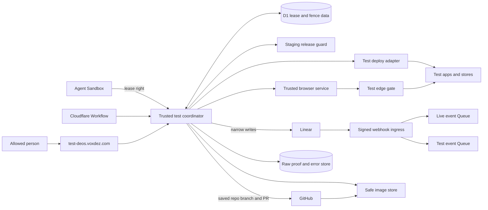

## Context

See `proposal.md` for the reason for this change. See the shared test spec for
the rules it must meet. DEOS has signed Linear input, a trusted Worker, D1,
Cloudflare Workflows, short-lived agent rights, and safe GitHub and Linear
adapters. This design builds on those parts. It does not add a new trust path.

The site is shared by one run at a time. One lease may start many app services.
It still has one owner and one fixed base. A lost owner starts safe cleanup. It
does not make the site free.

The real DEOS team is part of the test. Test data is not live data. Safe scope
comes from the saved task, run, lease, and write fence. Lasting proof must leave
the test site before the site is wiped.

## Goals / Non-Goals

**Goals:**

- Keep the lease and all write fences in one trusted service.
- Start each lease from one full release that is live on staging.
- Keep that base fixed until the lease ends.
- Give the agent narrow app and browser rights. Keep all secrets in trusted code.
- Make setup, proof, cleanup, and retry safe after a crash.
- Keep clear proof after the site is free.
- Use plain text that a person can scan with ease.

**Non-Goals:**

- More than one test site or more than one owner.
- A new path from test to staging or live.
- A copy of staging or live data.
- Provider keys in the agent, page, or browser.
- Fake webhook input as proof of a real provider event.

## Component diagram



The coordinator is a trusted Worker service. It owns the lease, setup, fence,
proof, and cleanup. The agent cannot call GitHub, Linear, Cloudflare, or Access
with a raw key.

There is one Linear webhook. The current ingress checks the raw body once. It
uses HMAC-SHA256 and `Linear-Signature`. It treats `Linear-Timestamp` as
milliseconds. It uses `Linear-Delivery` as the one delivery key. It returns HTTP
200 for an accepted, ignored, or repeat event.

The root of `test-deos.voxdez.com` is the status page. Access guards the page and
all test app routes. A person uses an allowed email. The cloud browser uses a
short-lived service identity for one lease. The browser service holds its key.
Cleanup revokes that identity and checks that it is gone.

## Event flow

### Decide if a demo is needed

| Step | Trusted action | Gate or saved proof |
| --- | --- | --- |
| 1 | Compare the final patch with the app and provider roots in the service manifest. | Save `test_required` or `test_not_required` with the patch hash. The agent cannot pick or waive the result. |
| 2 | Put `shared_test_demo` after implementation and before evidence review and native verify. | A required run cannot move on while it waits, runs, saves proof, or cleans. |
| 3 | Make one stable request ID from run, node visit, task, and candidate commit. | A retry keeps the same request and queue place. It may replace the attempt only after the old attempt is final and its Sandbox is gone. |
| 4 | Start a fresh demo Sandbox only after lease grant. Restore the checked patch and source bundle from files. | The Sandbox gets only the current app and browser right. It gets no provider or Access key. |
| 5 | Let a no-match run pass with its saved decision. | A common release guard still rejects an app build that lacks a full test record. |

The first required run is new work for SAC-182. The old frozen run is not
changed. Later app work uses the same path rule. It needs no special label.

### Get and prepare the lease

| Step | Trusted action | Gate or saved proof |
| --- | --- | --- |
| 1 | Add or reload one waiting request. Give a new request a growing queue number. | Request save never grants the site. An old request must be canceled before a new candidate can wait. |
| 2 | Read Linear and save the task ID, key, title, and team. Save the GitHub repo, branch, pull request, and commit. | Reject a task outside the current DEOS team. Do not read a test label. |
| 3 | Keep one staging release pointer. A deploy marks it `updating`, then writes one full, fixed manifest only after all services reach 100% and match a read-back. | The pointer has an owner, work ID, planned manifest, and due time. A dead update is checked against real traffic. Mixed or unknown traffic needs manual repair. |
| 4 | Check the oldest waiter again. | Its Workflow attempt, team, commit, and GitHub scope must still match. A short validation hold belongs only to that queue head. |
| 5 | Read real staging traffic and service versions twice. | Both reads must show the same 100% traffic state and the full stable manifest. Drift blocks grant. |
| 6 | Grant in one D1 transaction. | It must see no owner, the right queue head, no older waiter, a stable base, and the same traffic revision. It then saves the base and first fence. |
| 7 | Make lease-named test services and stores from fixed build input. | Each running service must match its saved source and deploy version before app or provider writes start. |
| 8 | Save a resource plan before each call that may create a remote item. | The plan has one work ID, safe provider name, lease, run, and fence. A retry finds the same item. |

A staging deploy can start after grant. It cannot change the base that the lease
saved. A direct staging deploy causes drift. The next grant then waits for a new
stable manifest made from real traffic.

### Use the app

| Step | Trusted action | Gate or saved proof |
| --- | --- | --- |
| 1 | Check D1 on each agent call. | Run, attempt, lease, fence, and allowed action must match. |
| 2 | Give the browser service a one-use launch code. It swaps the code for a short, secure app session. | Each app request must match the current lease, run, fence, and Access identity. A person who can view status cannot swap an agent code. |
| 3 | Put the candidate build on changed test services. Leave other services on the fixed base. | No test action can name a staging or live route or store. |
| 4 | Let trusted adapters act for the run. | GitHub must match the saved repo, branch, and pull request. Linear must still show the task in the saved team before each write. |
| 5 | Add one stand-alone test mark to the saved Linear task description. | First use a real short-lived DEOS issue to prove the true Linear event shape. Stop and revise this design if the signed event lacks a required fact. |
| 6 | Make the mark from an expectation ID and a keyed hash. Save its exact bytes and the before and after hashes before the Linear call. | A crash can find or remove the same mark. Cleanup removes only that mark from the latest text and keeps all human edits. |
| 7 | Let the one signed ingress choose the route in one D1 transaction. | Only a valid keyed hash plus one live, unused expectation and all saved event facts may use the test route. All other events keep the normal live route and get a safe audit fact. |
| 8 | Claim the matched expectation and save a pending dispatch before Queue send. | One delivery can have only one route. Queue send is a retry of the saved choice. |
| 9 | Claim test work with a token and due time. | A dead claim can be taken by a new token. Stable work IDs stop a second provider effect. |
| 10 | Save an observed test record for the exact task, run, lease, repo, commit, pull request, and base. | It becomes complete only in the final close transaction. Any later release must ask for this exact complete record. |

The mark has this form:

```text
<!-- deos-test-v1:<expectation_id>:<mac> -->
```

The MAC uses HMAC-SHA256 with a versioned test key. D1 stores the key version
and a hash of the challenge. It does not store the key. A matching prefix on its
own has no power. A bad, old, used, or foreign mark must not hide a live event.

The signed event must match the saved issue, team, kind, action, actor, old
value, new value, time range, and fence. The first canary must prove these facts
from Linear docs and from a real event. A local signed call is only fake-input
proof.

### Save proof and clean

| Step | Trusted action | Gate or saved proof |
| --- | --- | --- |
| 1 | Move to `quiescing` on normal end, failure, or lost heartbeat. Raise the fence first. | Old agent rights and browser sessions stop at once. Finish or check all accepted work before delete. |
| 2 | Copy safe screen shots, Showboat logs, D1 reads, and provider receipts to create-only proof storage. | Each item has type, byte count, SHA-256, and a lasting URL. Raw proof stays behind Access. Safe images use an opaque, read-only URL that GitHub can show. |
| 3 | Put the first proof set and a link for the later close report in the pull request body. Read the body and each item back. | Keep all other body text. A file path or test-site link does not count as attached proof. A body clash blocks cleanup. |
| 4 | Stop and remove each owned test item. | Delete only a ledger item whose provider tag, run, lease, and saved create fence all match. Read the provider or store back to prove it is gone. |
| 5 | If a safe retry cannot fix one item, enter `blocked`. | An allowed person may retry that item or give a resource-bound repair choice. The choice cannot waive proof, widen scope, or force the site free. |
| 6 | Close in one guarded D1 transaction. | Check all proof and absence rows. Complete the exact test record. Save the close receipt. Clear the owner. Set the site to `free`. |
| 7 | Build the final close report after commit from fixed D1 facts. | A failed report retries without taking the clean site back. SAC-182 proof is not complete until the report reads back. |

The GitHub adapter first tests if a strong ETag update works. If it does, it
uses `If-Match` and reads again after a clash. If it does not, a D1 lock guards
DEOS writers. The adapter then does a marked read, merge, write, and read loop.
It saves the old body and hash. Any merge it cannot prove stops before cleanup.

Cleanup may use a newer fence than setup used. The resource row keeps its create
fence. The lease also keeps each fence it has used. Delete is safe only when the
row and that lease history agree.

### First full demo

SAC-182 is the first task. Its proof must show the steps below in order.

1. Grant the only lease.
2. Read the live staging base and the running test versions.
3. Show the SAC-182 key and title as the owner on the portal.
4. Use the real app through the lease-bound browser.
5. Save one scoped GitHub result.
6. Receive one provider-made Linear event for the saved test mark.
7. Read the app and provider rows from D1.
8. Attach and read back the first proof set.
9. Remove all owned test data and access. Prove that each item is gone.
10. Commit the free state and read back the final report.

## Decisions

### The app path rule owns test entry

The patch check is the only test rule. The agent cannot bypass it. A special
Linear label is not used. The workflow node and the release guard both fail
closed. A branch is not enough proof because it can move. The saved commit is
the test key.

### D1 owns the lease and write fence

D1 holds the one owner, queue, base, fence, proof state, and cleanup state. A
lease timeout never means free. A timed lock alone was not safe because it can
end during a remote write. Workflow memory alone was not safe because a retry
can lose it.

```text
free -> preparing -> active -> quiescing -> cleaning -> free
          |           |           |          |
          +-----------+-----------+----------+--> blocked
                                                    |
                         bounded repair ------------+
                         resumes the saved phase
```

`blocked` still has an owner. It also has a saved phase to resume. There is no
age-to-free rule. There is no force-free act. A base fault may move setup right
to quiet and cleanup.

### Staging has one stable release manifest

Each managed staging deploy takes part in the pointer rule. Grant also checks
real traffic twice. This catches a deploy that did not use the pointer. A host
name or branch was not used because both can move. A data copy was not used
because test stores must stay apart.

### One ingress routes one exact Linear test event

The current signed ingress stays the one secret owner. A second webhook could
send two copies or miss an event. Text alone has no route power. The keyed mark,
one live expectation, and all signed facts must match. The claim and pending
dispatch are saved before Queue send, so a crash cannot lose the chosen route.

### Each remote item starts with a saved plan

The plan is saved before the remote call. A fixed name or mark lets retry and
cleanup find an item even when the call reply was lost. Saving only a good call
reply was not safe. A crash after the remote side accepts the call would leave
an item that cleanup could not find.

### Portal and app access are separate

A person can view safe status with an allowed Access email. The trusted browser
has a service identity for one lease and only the app routes. A one-use launch
code adds run, attempt, lease, and fence scope. This stops an old cookie or old
browser key from writing in the next lease.

The page leads with the task key and title while a lease has an owner. It also
shows the stage, fixed base, lease start time, and a clear site state. It names
setup, active use, cleanup, and blocked cleanup in plain words. Only a row with
no owner may say the site is free. A past-lease view keeps the safe close state.
It never shows a raw error, provider reply, secret, or private app row.

### Final proof does not keep the site owned

The first proof set is attached before delete. The close link is placed in the
body at the same time. The final report is filled after the close transaction.
This lets the clean site become free at once. It also keeps all proof away from
the test stores.

### Original errors have two safe stores

The coordinator first makes a redacted error record. It keeps the first message,
stack, cause chain, work name, and lease facts. It writes a fixed create-only
object and indexes its hash in D1. If object save fails, D1 keeps the full record
and that save error. If D1 fails after object save, a second object keeps the D1
error and points to the first object.

The phase cannot look done until one store has the first error. If both stores
fail, the full error goes up and the phase does not move. A cleanup error never
replaces the first cause. The public page shows only a safe code and state.

### All change text has a plain-language gate

The trusted service scores the Linear issue title and body as one text. It also
scores `proposal.md`, each delta spec, and `design.md` as separate files. It uses
the same whole-text rule at author exit and before trusted publish. Headings,
code, charts, tables, URLs, IDs, and paths do not count in the score.

The Flesch Reading Ease score must be at least 70. The Flesch-Kincaid grade must
be no more than 8.0. This design treats the review phrase “FK below 80” as grade
8.0, since a lower grade is easier while a higher Reading Ease score is easier.
The exact score and command go in the saved check record.

The service must not rewrite text after review. A bad issue score asks a person
to edit the issue. A bad approved plan score goes back through the plan review
path. A bad design score stays in the same design author repair loop. No check
may weaken a rule just to raise a score.

## Minimal data model

| Record | Key fields | Rule |
| --- | --- | --- |
| `test_environment` | state, saved phase, owner run and lease, fence, heartbeat due, hold, last lease, fault, revision | One row is the site authority. Owned and blocked states keep the owner. |
| `staging_release_pointer` | state, manifest, traffic revision, work ID, owner, planned manifest, heartbeat due, fault, revision | Grant needs `stable` and two real traffic reads that match. |
| `staging_release_services` | manifest, service, source commit, deploy version, fixed build input, read time | Fixed full service set for one staging traffic revision. |
| `test_task_decisions` | run, candidate, patch hash, service map revision, choice, matched roots, time | Fixed path rule result. |
| `test_lease_requests` | request ID, queue number, run, node visit, current attempt, task, candidate, state, validation facts, old attempts | Unique for run, visit, task, and candidate. Retry keeps the row and queue place. |
| `test_leases` | lease, request, run, attempt, task facts, team, stage, state, fence, base, times, GitHub scope, candidate | Fixed owner, task, provider, GitHub, and base scope. |
| `test_lease_fence_epochs` | lease, run, fence, reason, time, transition revision | Append-only fence history used by cleanup. |
| `test_access_identities` | identity, run, lease, remote item, audience, policy, principal hash, made, revoked, absence check | One browser service identity for one lease. No key is stored here. |
| `test_app_sessions` | session hash, lease, run, attempt, fence, Access identity, principal hash, expiry, revoke time | Short app session. Each call also checks the live D1 fence. |
| `test_resources` | item, lease, run, create fence, kind, plan state, fixed provider key, remote ID, work ID, recovery ref, cleanup state, absence time | Plan-before-call ledger. Cleanup must settle every row. |
| `test_expected_events` | expectation, run, lease, fence, task, team, kind, action, actor, key version, hashes, time range, claimed delivery | One-use Linear event match. The mark prefix alone has no power. |
| `test_provider_deliveries` | delivery, provider time, task, team, lease, run, class, route, expectation, mark audit, result | Global one-delivery record and route proof. |
| `test_delivery_dispatch` | delivery, run, lease, expectation, state, claim token, claim due, Queue work ID, count, time, result | Retry-safe test inbox. |
| `test_operations` | work ID, run, lease, fence, kind, target, state, receipt, start, end | Stable app and provider effects. |
| `test_attestations` | record, task, run, lease, repo, candidate, pull request, base, state, done time, close revision | Exact release gate. Only the close transaction can make it complete. |
| `test_proof_items` | proof ID, run, lease, phase, kind, class, view rule, store key, type, bytes, hash, URL, body mark, read time, project time | Fixed proof list outside the test site. Only safe images get a public render URL. |
| `test_cleanup_checks` | run, lease, item, remove work ID, remove state, read state, time | Per-item delete and absence proof. |
| `test_lease_closures` | lease, run, close revision, test record, cleanup hash, absence hash, commit time, signed receipt, report state | Receipt for a close that already committed. |
| `test_manual_reconciliations` | repair ID, run, lease, item, saved phase, allowed act, expected revision, person hash, choice, proof hashes, first fault, done time | Narrow human repair. It cannot force free or waive absence. |
| `test_failures` | fault ID, run, lease, phase, work ID, safe code, object key and hash, first message, stack, causes, context, time, later faults | Full first cause or index to its fixed object. |
| `readability_checks` | source kind, source ID, source hash, scorer version, ease score, grade score, pass, checked time | Trusted text gate for the issue, plan files, and design. A source hash makes the result exact. |

Provider event times keep their source and unit. Linear time stays an integer in
milliseconds. No raw secret, auth header, or full private reply is saved.

## Failure modes

| Failure | Safe result | Gate to move on |
| --- | --- | --- |
| Two requests race or one is sent twice | Save or load one request. Validate only the oldest queue head. | One current and checked head can grant. |
| A retry has a new agent attempt | Prove the old attempt is final and its Sandbox is gone. Swap the attempt on the same request. | One visit, task, and candidate keeps one queue row. |
| Staging changes during grant | `updating` blocks grant. Two traffic reads and the grant transaction bind one stable base. | All services show one unchanged 100% revision. |
| A direct deploy makes the pointer stale | Mark it for repair and block grant. | Build a new full manifest from two equal real traffic reads. |
| The staging controller dies | Read actual traffic. Finish the planned manifest, restore the old stable one, or block on mixed state. | Never guess a stable base. |
| A test service has the wrong version | Keep writes fenced. Save the fault. Quiet and clean if setup cannot be fixed. | Every service must match, or all owned setup must be gone. |
| An old app right, cookie, or browser key is used | Reject it before app or store access. Save a safe audit fact. | Current attempt, Access identity, lease session, and fence must all match. |
| The task leaves the DEOS team | Stop the Linear write. Keep the read and first cause. Do not start live work. | A new trusted read must prove the saved team. |
| The real Linear contract lacks a needed fact | Stop before build or use. Keep the real canary proof. | Revise the design. Do not use fake input or a weaker match. |
| A Linear write reply is lost | Find the fixed mark and work ID from the saved plan. Reuse or remove that same mark. | The plan must end as made or proved absent. |
| A person edits the marked description | Remove only the exact stand-alone mark from the latest text. Block if the mark itself is unclear. | Read-back proves the mark is gone and all other text stays. |
| A Linear event does not match | Audit it and use the normal live route. | Only a full live expectation match may use the test route. |
| Queue send is lost | Keep dispatch pending. A repeat event or scan sends the same delivery ID. | A consumer must save `done`. |
| A test consumer dies | Let its claim end. Give a new token the same stable work IDs. | Only the current token can save `done`. |
| Linear sends a repeat delivery | Return HTTP 200 and use its first route. Repair any pending test dispatch. | The first route stays final. |
| Release asks for a new or untested commit | Reject the deploy and save the missing test fact. | The exact task and commit need a complete test record. |
| Heartbeat stops | Raise the fence and enter quiet state. Keep the owner. | Check accepted work, save first proof, and clean. |
| A remote effect times out | Keep the first timeout and full work context. Check by the stable work ID. | Prove one result or use the narrow human repair path. |
| The pull request body changes | Retry from a fresh GET with ETag, or use the D1 writer lock and marked merge loop. | Read-back keeps other text and proves each first proof item. |
| First proof save or read fails | Keep the lease fenced. Keep proof objects and the first cause. Do not clean. | Body mark, size, and hash must read back. |
| GitHub cannot show a protected image | Copy only safe image bytes to the opaque render store. | Fetch must match type, size, and hash. |
| Delete fails | Keep the first delete fault. Run only safe reads and retry the same delete. | The remote side or store must prove absence. |
| Cleanup sees an old fence from this lease | Check the current cleanup right, the ledger owner, provider tag, and lease fence history. | Run, lease, item, and saved create fence must match. |
| Cleanup sees another run's item | Leave it in place and block with a scope fault. | Prove the right owner. Never widen the delete query. |
| Cleanup needs a person | Save a revision-bound repair row and the first cause. Allow only retry or one item repair. | All items still need real absence proof. No force-free act exists. |
| Close transaction loses a race or its reply | Publish no guessed receipt. Reload the owned clean state and retry the same transaction. | Only a saved closure row can prove free. |
| Final report save fails | Keep the site free. Save this later fault and retry from fixed close rows. | The first demo stays incomplete until the report reads back. |
| D1 error save fails | Keep the first create-only error object. Add a second object for the D1 fault. | A scan must index the first hash. |
| Error object save fails | Put the full first error and object fault in D1. If both stores fail, stop and raise both. | One safe store must hold the first cause before phase change or cleanup. |
| Status cannot load private facts | Show only a safe unavailable or blocked view. | Restore the clean status read. Never show raw errors. |
| Issue or artifact prose misses the text gate | Keep the exact scores and source hash. Do not publish or make tasks. | Issue text needs a human edit. Plan or design text must pass its own review path. |

## Risks / Trade-offs

- **One site makes work wait.** Use a fair queue and safe retry. Do not trade
  clean scope for speed.
- **The staging pointer adds work to deploys.** Check real traffic at grant, so
  an out-of-band deploy fails closed.
- **A D1 check on each app call adds delay.** Keep the owner row small. Fresh
  fence checks matter more than a fast stale session.
- **The test mark edits a real task for a short time.** Save its exact bytes.
  Remove only those bytes. Prove they are gone.
- **Lasting proof can leak private data.** Clean each item first. Keep raw proof
  behind Access. Give GitHub only safe image bytes.
- **A blocked cleanup lowers use of the site.** Show the phase and first cause.
  Give a person only narrow repair acts.
- **Short prose can lose a needed fact.** Keep exact gates in the flow, data,
  and fault tables. Never drop a safety rule to pass the text score.

## Migration Plan

1. Check Linear's main Issue update docs. Use one real short-lived DEOS task to
   prove the signed fields, time unit, reply, human-edit case, and mark cleanup.
   Also test a strong ETag update on a GitHub pull request body.
2. Add the D1 rows, app path rule, demo node, error path, ingress route choice,
   and coordinator with lease grant and test event use off.
3. Put all managed staging deploys behind the stable pointer. Put all staging
   and live deploys behind the exact complete test check. Seed the first base
   only after two equal reads of 100% staging traffic.
4. Add test-only routes, stores, app services, browser Access policy, raw proof
   route, safe image route, and secret refs. Check that no live or staging store
   is bound.
5. Run setup and cleanup without an agent. Check each version, old session,
   browser identity, proof item, close receipt, final report, and absence read.
6. Turn on the safe portal at `test-deos.voxdez.com`. Keep provider writes off
   until the lease, version, session, and event route checks pass.
7. Turn on one lease. Resume SAC-182 through the required demo node. Save the
   real provider event, app use, GitHub result, screen shots, D1 reads, cleanup,
   free state, and final report.
8. Run the issue and artifact text gate before design publish and task creation.
   Save the scorer version, source hash, Reading Ease, grade, and pass result.
9. Let later work start once SAC-182 has closed and the portal says free. Its
   final report may still retry from fixed close facts.

Rollback first stops new grants, test event matches, and release. It then raises
the fence on any owner. The coordinator version that knows that lease must save
first proof and clean every ledger item. Rollback must not clear an owner, clear
a hold, drop proof, or drop data to make the site look free. A person may use
only the narrow repair acts above. A final report may still retry after the site
is free.
