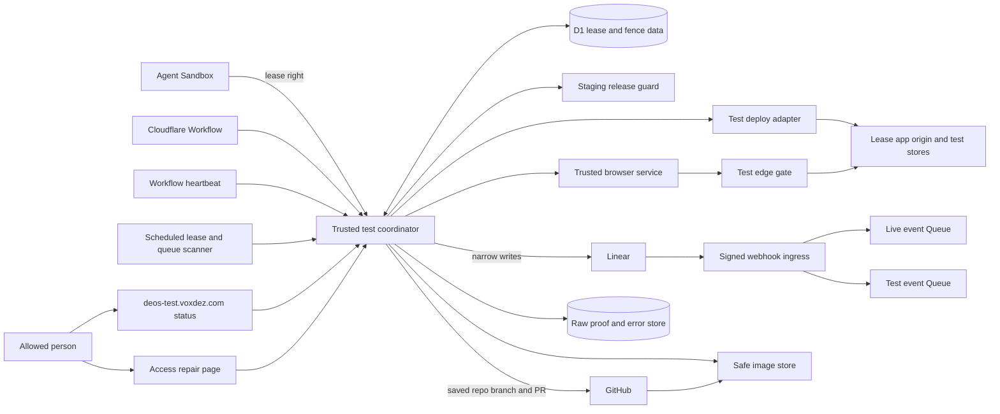

## Context

See `proposal.md` for the reason for this change. See the shared test spec for
the rules it must meet. DEOS has signed Linear input, a trusted Worker, D1,
Cloudflare Workflows, short-lived agent rights, and safe GitHub and Linear
adapters. This design builds on those parts. It does not add a new trust path.

It does extend the trusted Linear adapter with one narrow issue-description
patch action. That action is a new provider capability, but not a new trust
boundary: the agent still has no provider token and cannot send free-form text.

The site is shared by one run at a time. One lease may start many app services.
It still has one owner and one fixed base. A lost owner starts safe cleanup. It
does not make the site free.

The real DEOS team is part of the test. Test data is not live data. Safe scope
comes from the saved task, run, lease, and write fence. Lasting proof must leave
the test site before the site is wiped.

## Goals / Non-Goals

**Goals:**

- Keep the lease and all write fences in one trusted service.
- Start each lease from one full release that is live on staging.
- Keep that base fixed until the lease ends.
- Give the agent narrow app and browser rights. Keep all secrets in trusted code.
- Make setup, proof, cleanup, and retry safe after a crash.
- Keep clear proof after the site is free.

**Non-Goals:**

- More than one test site or more than one owner.
- A new path from test to staging or live.
- A copy of staging or live data.
- Provider keys in the agent, page, or browser.
- Fake webhook input as proof of a real provider event.

## Human-controlled prerequisites

The design handoff must name account changes that an agent cannot make. An
operator performs these steps and supplies non-secret read-back evidence before
the dependent implementation or live test is enabled. The Sandbox agent receives
no Cloudflare, Access, Linear, or GitHub account credential.

| Before | Operator-owned setup | Read-back needed |
| --- | --- | --- |
| Status-page verification | Attach `deos-test.voxdez.com` to the status Worker and include it in the owner-only Access application. | The exact Worker domain mapping and an authenticated status-page visit. |
| Pinned staging build reuse | Let the staging deploy credential write and read `shared-test/builds/` objects in the private DEOS artifact bucket. Each staging job saves and reads back the exact bundle before it deploys the version. BettaView also saves a compiled Worker module from the same source commit and pins it to the raw build digest. | A content-addressed bundle for each service whose bytes recompute the version endpoint's build digest, plus the checked BettaView module. |
| Candidate build dispatch | Land the trusted `shared-test-candidate-build` GitHub workflow on the default branch before granting a live lease. Keep its build job free of provider credentials. Its separate upload job uses a bucket-scoped `SHARED_TEST_R2_UPLOAD_TOKEN` secret; the portal staging deploy token stays unchanged. The current GitHub App's Contents write grant can send the repository dispatch. | The workflow is present on `main`; one dispatch from the saved candidate commit yields a verified bundle in private R2 without giving the candidate process the upload secret. |
| Browser-based app test | Configure separate Access protection for the lease app origins under `*.apps.deos-test.voxdez.com`, with a scoped service identity held by the trusted browser service. | Application and policy IDs, allowed origin, service identity scope, and a real browser admission check. |
| Provider visual proof | Keep the connected external browser signed in to Linear with access to the saved DEOS issue. The Sandbox agent never receives that session. | A real issue screenshot showing the saved issue key and provider event state; the trusted sanitizer must pass before a public copy is linked. |
| Provider test and cleanup | Put the marker-signing key and any required provider or cleanup credentials in trusted services with the narrow scopes in this design. | Presence and scope checks without exposing secret values to the agent, plus a successful owned-item removal and absence read-back. |

The current Cloudflare dashboard steps and the status-login redirect fix are in
[`docs/sac-253-cloudflare-prerequisites.md`](../../../docs/sac-253-cloudflare-prerequisites.md).

Staging base initialization is automated. The trusted coordinator reads
`/api/version` from both staging Workers through service bindings and saves the
full manifest through its D1 binding. Two matching version reads are required.
Each returned version is assumed to serve 100% of staging traffic. This does
not need a Cloudflare deployment read or a human traffic check.

If an operator cannot provide one of these prerequisites, keep the related
grant or write gate disabled and revise this design before relying on it. Do
not ask an agent to gain account-wide permissions to bridge the gap.

## Component diagram


```mermaid
flowchart LR
    A[Agent Sandbox] -->|lease right| C[Trusted test coordinator]
    W[Cloudflare Workflow] --> C
    H[Workflow heartbeat] --> C
    N[Scheduled lease and queue scanner] --> C
    C <--> D[(D1 lease and fence data)]
    C --> S[Staging release guard]
    C --> X[Test deploy adapter]
    X --> T[Lease app origin and test stores]
    C --> B[Trusted browser service]
    B --> E[Test edge gate]
    E --> T
    O[Allowed person] --> P[deos-test.voxdez.com status]
    P --> C
    O --> M[Access repair page]
    M --> C
    L[Linear] --> I[Signed webhook ingress]
    I --> Q[Live event Queue]
    I --> TQ[Test event Queue]
    C -->|narrow writes| L
    C -->|saved repo branch and PR| G[GitHub]
    C --> R[(Raw proof and error store)]
    C --> SI[Safe image store]
    G --> SI
```

The coordinator is a trusted Worker service. It owns the lease, setup, fence,
proof, and cleanup. The agent cannot call GitHub, Linear, Cloudflare, or Access
with a raw key.

There is one Linear webhook. The current ingress checks the raw body once. It
uses HMAC-SHA256 and `Linear-Signature`. It treats `Linear-Timestamp` as
milliseconds. It uses `Linear-Delivery` as the one delivery key. It returns HTTP
200 for an accepted, ignored, or repeat event.

The root of `deos-test.voxdez.com` is the status page. Access guards the page and
all test app routes. Candidate code runs on a separate lease host under
`*.apps.deos-test.voxdez.com`, never on the portal origin. Portal cookies use a
`__Host-` name, have no `Domain` attribute, and never go to an app host. App
sessions use a different host-only cookie and cannot call portal or repair
routes. A person uses an allowed email. The cloud browser uses a short-lived
service identity for one lease. The browser service holds its key. Cleanup
revokes that identity and checks that it is gone.

## Event flow

### Decide if a demo is needed

| Step | Trusted action | Gate or saved proof |
| --- | --- | --- |
| 1 | Compare the final patch with the app and provider roots in one saved service-manifest revision. | Save `test_required` or `test_not_required` with the patch hash, candidate commit, and manifest revision. The agent cannot pick or waive the result. Any app or provider root match must be `test_required`. |
| 2 | Register a new immutable workflow version after version 17. Put `shared_test_demo` after implementation and before evidence review and native verify. | Only newly admitted runs select it. A required run cannot move on while it waits, runs, saves proof, or cleans. |
| 3 | Make one stable request ID from run, node visit, task, and candidate commit. | A retry keeps the same request and queue place. It may replace the attempt only after the old attempt is final and its Sandbox is gone. |
| 4 | Start a fresh demo Sandbox only after lease grant. Restore the checked patch and source bundle from files. | The Sandbox gets only the current app and browser right. It gets no provider or Access key. |
| 5 | Let a no-match run pass with its exact saved decision. | The release guard reads the same patch, candidate, and service-manifest revision. It accepts `test_not_required` only when no app or provider root matched; otherwise it needs a complete test record. |

The first required run is newly admitted work for SAC-182 under the new workflow
version. The old frozen run is not changed or made eligible for a graph swap.
Any old-version app candidate must enter a new run and pass the new demo before
release. The release guard stays in observe-only mode until the new workflow,
lease path, and SAC-182 canary can create the records it will require. Later app
work uses the same path rule. It needs no special label.

### Get and prepare the lease

| Step | Trusted action | Gate or saved proof |
| --- | --- | --- |
| 1 | Add or reload one waiting request. Give a new request a growing queue number. | Request save never grants the site. One run and node visit may have only one waiting candidate. |
| 2 | Read Linear and save the task ID, key, title, and team. Save the GitHub repo, branch, pull request, and commit. | Reject a task outside the current DEOS team. Do not read a test label. |
| 3 | Keep one staging release pointer. The coordinator reads both version endpoints and saves a full fixed manifest when the observed versions change. | The pointer has an owner, work ID, planned manifest, and due time during refresh. An interrupted refresh is checked against the running versions. |
| 4 | The scheduled scanner checks waiting rows, then checks the oldest live waiter again. | A terminal or canceled run is marked `canceled` only after its Sandbox is gone. A superseded candidate is marked `superseded`. Its Workflow attempt, team, commit, and GitHub scope must still match. A short validation hold belongs only to the live queue head. |
| 5 | Read each staging service version twice. | Both reads must show the same full manifest. Treat each returned version as serving 100% by policy. Observed drift blocks grant. |
| 6 | Grant in one D1 transaction. | It must see no owner, the right queue head, no older waiter, a stable base, and the same traffic revision. It then saves the base and first fence. |
| 7 | Make lease-named test services and stores from fixed build input. | Each running service reports its source commit, build input, staging base version, and its own deployed version twice. Save those readbacks before changing the lease from `preparing` to `active`. App and provider writes need `active`. |
| 8 | Save a resource plan before each call that may create a remote item. | The plan has one work ID, safe provider name, lease, run, and fence. A retry finds the same item. |

The portal test service gets its own lease-named D1 database and R2 bucket.
The staging portal build bundle also pins the SQL migration files. The trusted
coordinator applies that schema to the empty lease database before the test
Worker serves app traffic; it never copies staging rows into the lease.
Its activation check requires both records to have confirmed remote identities.
The BettaView session Durable Object belongs to its separate lease-named Worker.
The portal Worker is created first because BettaView binds to it. The BettaView
Worker upload uses its checked compiled module, including package imports and
the session class, from the exact pinned source commit.
A lost store-create response leaves the saved plan uncertain; recovery looks up
that exact name and never allocates a substitute name.
Store deletion waits for a proved Worker absence and all required public proof.
It uses the saved remote identity, reads the fixed name absent twice, and writes
the resource and cleanup receipt in one guarded D1 transaction. An R2 bucket
with remaining objects stays owned until its contents are removed and the
provider confirms bucket absence.

While the lease is `preparing` or `active`, the owning Workflow sends a
coordinator heartbeat every 30 seconds. The saved deadline is two minutes after
the last accepted heartbeat. A Worker scheduled event runs each minute. It
atomically raises the fence and moves an expired owner to `quiescing`, then
drives the same ledger-based proof and cleanup path used for normal end. That
driver does not need the dead Sandbox or Workflow to be present.

A staging deploy can start after grant. It cannot change the base that the lease
saved. A direct staging deploy causes drift. The next grant then waits for a new
stable manifest made from the running version responses.

### Use the app

| Step | Trusted action | Gate or saved proof |
| --- | --- | --- |
| 1 | Check D1 on each agent call. | Run, attempt, lease, fence, and allowed action must match. |
| 2 | Give the browser service a one-use launch code. It swaps the code for a short, secure app session. | Each app request must match the current lease, run, fence, and Access identity. A person who can view status cannot swap an agent code. |
| 3 | Put the candidate build on changed test services. Leave other services on the fixed base. | No test action can name a staging or live route or store. |
| 4 | Let trusted adapters act for the run. | GitHub must match the saved repo, branch, and pull request. Linear must still show the exact task in the saved team before each write. |
| 5 | Use the new `test_issue_marker_patch` adapter action to add one stand-alone mark to the saved Linear task description. | The action accepts an expectation ID, not free-form text. Trusted code derives the exact mark and permits only insert, find, or remove on that issue during the current lease. First use a short-lived DEOS issue to prove the true event shape. |
| 6 | Make the mark from an expectation ID and a keyed hash. Save its exact bytes and the before and after hashes before the Linear call. | A crash can find or remove the same mark. Cleanup removes only that mark from the latest text and keeps all human edits. |
| 7 | Let the one signed ingress choose the route in one D1 transaction. | Only a valid keyed hash plus one live, unused expectation and all saved event facts may use the test route. All other events keep the normal live route and get a safe audit fact. |
| 8 | Claim the matched expectation and save a pending dispatch before Queue send. | One delivery can have only one route. Queue send is a retry of the saved choice. |
| 9 | Claim test work with a token and due time. | A dead claim can be taken by a new token. Stable work IDs stop a second provider effect. |
| 10 | Save an observed test record for the exact task, run, lease, repo, commit, pull request, and base. | It becomes complete only in the final close transaction. Any later release must ask for this exact complete record. |

The mark has this form:

```text
<!-- deos-test-v1:<expectation_id>:<mac> -->
```

The MAC uses HMAC-SHA256 with a versioned test key. D1 stores the key version
and a hash of the challenge. It does not store the key. A matching prefix on its
own has no power. A bad, old, used, or foreign mark must not hide a live event.

The signed event must match the saved issue, team, kind, action, actor, old
value, new value, time range, and fence. The first canary must prove these facts
from Linear docs and from a real event. A local signed call is only fake-input
proof.

Quiescing disables the expectation before any other cleanup act, so a mark that
remains visible cannot route another test event. The coordinator retains only
the remove form of `test_issue_marker_patch` after agent rights are revoked. It
keeps retrying that exact removal. An unclear human edit enters `blocked` and
uses the revision-bound repair route described below; it never widens the patch.

### Save proof and clean

| Step | Trusted action | Gate or saved proof |
| --- | --- | --- |
| 1 | Move to `quiescing` on normal end, failure, or lost heartbeat. Raise the fence first. | Old agent rights and browser sessions stop at once. Finish or check all accepted work before delete. |
| 2 | Copy raw screen shots, Showboat logs, D1 reads, and provider receipts to create-only Access-protected storage. Project a public image only through the trusted sanitizer. | Each item has type, byte count, SHA-256, class, and view rule. A public image needs an allowlisted capture recipe, stripped metadata, fixed crops and masks for private fields, and OCR whose text consists only of saved public proof fields such as the issue key, approved title, state, and UI labels. Any token, email, secret, private ID, unknown text, or uncertain image stays private and blocks required proof. Save the sanitizer version and pass result. |
| 3 | Put the first proof set and a `close pending` marker in the pull request body. Read the body and every attached first-set item back. | Keep all other body text. Do not publish a close-report URL before the report exists. A file path or test-site link does not count as attached proof. A body clash blocks cleanup. |
| 4 | Stop and remove each owned test item. | Delete only a ledger item whose provider tag, run, lease, and saved create fence all match. Read the provider or store back to prove it is gone. |
| 5 | If a safe retry cannot fix one item, enter `blocked`. | An allowed person uses the Access-protected repair page at `/admin/test-environment/repairs/<repair-id>`. The portal calls the coordinator through an internal binding. The choice can retry or repair only the named item and cannot waive proof, widen scope, or force the site free. |
| 6 | Close in one guarded D1 transaction. | Check all proof and absence rows. Complete the exact test record. Save the close receipt. Clear the owner. Set the site to `free`. |
| 7 | Build the final close report after commit from fixed D1 facts. Write it first, read it back, then replace `close pending` with its lasting URL and read the pull request body back. | A failed report or body update retries without taking the clean site back. No dangling URL is published. SAC-182 proof is not complete until the report and final body read back. |

The GitHub adapter first tests if a strong ETag update works. If it does, it
uses `If-Match` and reads again after a clash. If it does not, a D1 lock guards
DEOS writers. The adapter then does a marked read, merge, write, and read loop.
It saves the old body and hash. Any merge it cannot prove stops before cleanup.

Cleanup may use a newer fence than setup used. The resource row keeps its create
fence. The lease also keeps each fence it has used. Delete is safe only when the
row and that lease history agree.

The repair page requires the same Access operator allowlist as Settings plus a
fresh CSRF token. The coordinator rechecks the operator, repair ID, current
environment revision, allowed action, and named resource. It writes an
append-only audit row with the operator hash. The status page remains read-only.

### First full demo

SAC-182 is the first task. Its proof must show the steps below in order.

1. Grant the only lease.
2. Read the live staging base and the running test versions.
3. Show the SAC-182 key and title as the owner on the portal.
4. Use the real app through the lease-bound browser.
5. Save one scoped GitHub result.
6. Receive one provider-made Linear event for the saved test mark.
7. Read the app and provider rows from D1.
8. Attach and read back the first proof set.
9. Remove all owned test data and access. Prove that each item is gone.
10. Commit the free state and read back the final report.

## Decisions

### The app path rule owns test entry

The patch check is the only test rule. The agent cannot bypass it. A special
Linear label is not used. The workflow node and the release guard both fail
closed. A branch is not enough proof because it can move. The saved commit is
the test key. The path decision and release guard share one manifest revision.
Thus a non-app change may use its exact `test_not_required` record, while a
change that touches any app or provider root cannot use that result.

The node ships only in a new immutable workflow version. Existing frozen runs
keep their graph and cannot release an app candidate under the new guard. A new
run is required. For SAC-182, a trusted, exact-subject handoff seeds that new
run from its stopped v43 run and PR #137. It does not change the v43 graph or
claim that the old run performed the shared test. The new run owns every lease,
provider event, proof item, cleanup record, and attestation.

The handoff checks the old executor's terminal error and saved diagnostic, no
active attempt or lease, the approved planning and design merge receipts, the
current DEOS issue and route, the saved patch hash and bytes, and PR #137's
exact branch and head. It carries the old code onto current `main` with a clean
tree merge, verifies the resulting tree and single-parent commit, and updates
the existing branch with an exact old-head precondition. The candidate build
uses the new commit. The new run starts at the shared test decision with a
fresh implementation subject; old proof is retained as history and cannot
satisfy the new run's test or release guard. An immutable handoff record names
both runs, old and new commit and patch identities, the current base, and the
source approval receipts. If any readback changes, the handoff stops before
admission. The new run has its own unique run branch identity and separately
records the existing PR branch it tests, leaving the source row unchanged. It
creates no new planning, design, or implementation pull request.

### D1 owns the lease and write fence

D1 holds the one owner, queue, base, fence, proof state, and cleanup state. A
lease timeout never means free. A timed lock alone was not safe because it can
end during a remote write. Workflow memory alone was not safe because a retry
can lose it.

The Workflow heartbeat is only liveness input. The scheduled coordinator is the
recovery owner: it expires dead waiters, fences a dead lease owner, and resumes
proof and cleanup from D1. Expiring a waiter never grants the site in the same
transaction. Grant still validates the next oldest live row. This preserves
fair order without letting a dead queue head block all work.

```text
free -> preparing -> active -> quiescing -> cleaning -> free
          |           |           |          |
          +-----------+-----------+----------+--> blocked
                                                    |
                         bounded repair ------------+
                         resumes the saved phase
```

`blocked` still has an owner. It also has a saved phase to resume. There is no
age-to-free rule. There is no force-free act. A base fault may move setup right
to quiet and cleanup.

### Staging has one stable release manifest

The coordinator refreshes the pointer from two matching version reads before
grant. This catches an observed staging version change without a deployment job
writing to D1. The returned version is assumed to serve 100% of traffic;
the API cannot detect a split deployment. A host name or branch was not used
because both can move. A data copy was not used because test stores must stay
apart.

### One ingress routes one exact Linear test event

The current signed ingress stays the one secret owner. A second webhook could
send two copies or miss an event. Text alone has no route power. The keyed mark,
one live expectation, and all signed facts must match. The claim and pending
dispatch are saved before Queue send, so a crash cannot lose the chosen route.

The description-marker action is an explicit extension to the trusted Linear
adapter. It was chosen over giving the Sandbox a general issue-update action.
Its schema contains the saved issue and expectation identity; trusted code
derives the marker bytes and compares the latest description hash. After
quiesce, only exact removal remains allowed. Notes were not used because they do
not prove the same issue-update event contract required by the test.

### Each remote item starts with a saved plan

The plan is saved before the remote call. A fixed name or mark lets retry and
cleanup find an item even when the call reply was lost. Saving only a good call
reply was not safe. A crash after the remote side accepts the call would leave
an item that cleanup could not find.

### Portal and app access are separate

A person can view safe status with an allowed Access email. The trusted browser
has a service identity for one lease and only the app routes. A one-use launch
code adds run, attempt, lease, and fence scope. This stops an old cookie or old
browser key from writing in the next lease.

The portal and candidate app use separate origins. Candidate script therefore
cannot read portal responses under the same-origin policy. Host-only cookies,
separate Access audiences, and route allowlists prevent either session from
being replayed at the other origin. Path-only separation was rejected because
an app compromise on one origin could reach portal paths and cookies.

The page leads with the task key and title while a lease has an owner. It also
shows the stage, fixed base, lease start time, and a clear site state. It names
setup, active use, cleanup, and blocked cleanup in plain words. Only a row with
no owner may say the site is free. A past-lease view keeps the safe close state.
It never shows a raw error, provider reply, secret, or private app row.

### Final proof does not keep the site owned

The first proof set is attached before delete. The body says that close proof is
pending but has no future URL. After the close transaction, the report is
created and read back before its URL replaces that marker. This lets the clean
site become free at once, keeps proof away from test stores, and cannot leave a
link to an object that was never made.

Raw captures remain behind Access. Public proof is a new byte sequence made by
a trusted, versioned sanitizer from an allowlisted capture recipe. It strips
metadata, masks declared private regions, and accepts OCR text only when every
value is in the proof item's saved public-field allowlist.
This was chosen over making raw screenshots available through secret URLs;
unguessable is not an access rule. A failed or uncertain safety check blocks
the required first proof instead of publishing the image.

### Original errors have two safe stores

The coordinator first makes a redacted error record. It keeps the first message,
stack, cause chain, work name, and lease facts. It writes a fixed create-only
object and indexes its hash in D1. If object save fails, D1 keeps the full record
and that save error. If D1 fails after object save, a second object keeps the D1
error and points to the first object.

The phase cannot look done until one store has the first error. If both stores
fail, the full error goes up and the phase does not move. A cleanup error never
replaces the first cause. The public page shows only a safe code and state.

## Minimal data model

| Record | Key fields | Rule |
| --- | --- | --- |
| `test_environment` | state, saved phase, owner run and lease, fence, heartbeat source and due time, cleanup driver, hold, last lease, fault, revision | One row is the site authority. Owned and blocked states keep the owner. |
| `staging_release_pointer` | state, manifest, version revision, work ID, owner, planned manifest, heartbeat due, fault, revision | Grant needs `stable` and two version reads that match. |
| `staging_release_services` | manifest, service, source commit, deploy version, fixed build input, read time | Fixed full service set for one staging version revision. |
| `test_task_decisions` | run, candidate, patch hash, service map revision, choice, matched roots, time | Fixed path rule result. The release guard uses the same manifest revision. |
| `test_lease_requests` | request ID, queue number, run, node visit, current attempt, task, candidate, state, validation facts, old attempts, terminal proof, cancel time | Unique for run, visit, task, and candidate. Retry keeps the row and queue place; the scanner cancels only a proved-dead waiter. |
| `test_leases` | lease, request, run, attempt, task facts, team, stage, state, fence, base, times, GitHub scope, candidate | Fixed owner, task, provider, GitHub, and base scope. |
| `test_lease_fence_epochs` | lease, run, fence, reason, time, transition revision | Append-only fence history used by cleanup. |
| `test_access_identities` | identity, run, lease, remote item, origin, audience, policy, principal hash, made, revoked, absence check | One browser service identity for one lease and app origin. No key is stored here. |
| `test_app_sessions` | session hash, lease, run, attempt, fence, origin, cookie class, Access identity, principal hash, expiry, revoke time | Short host-only app session. Each call also checks the live D1 fence. |
| `test_resources` | item, lease, run, create fence, kind, plan state, fixed provider key, remote ID, work ID, recovery ref, cleanup state, absence time | Plan-before-call ledger. Cleanup must settle every row. |
| `test_expected_events` | expectation, run, lease, fence, task, team, kind, action, actor, key version, hashes, time range, claimed delivery | One-use Linear event match. The mark prefix alone has no power. |
| `test_provider_deliveries` | delivery, provider time, task, team, lease, run, class, route, expectation, mark audit, result | Global one-delivery record and route proof. |
| `test_delivery_dispatch` | delivery, run, lease, expectation, state, claim token, claim due, Queue work ID, count, time, result | Retry-safe test inbox. |
| `test_operations` | work ID, run, lease, fence, kind, target, expected description hash, state, receipt, start, end | Stable app and provider effects, including exact marker insert and removal. |
| `test_attestations` | record, task, run, lease, repo, candidate, pull request, base, state, done time, close revision | Exact release gate. Only the close transaction can make it complete. |
| `test_proof_items` | proof ID, run, lease, phase, kind, class, view rule, capture recipe, sanitizer version and result, source hash, store key, type, bytes, hash, URL, body mark, read time, project time | Fixed proof list outside the test site. Only a passed safe projection gets a public render URL. |
| `test_cleanup_checks` | run, lease, item, remove work ID, remove state, read state, time | Per-item delete and absence proof. |
| `test_lease_closures` | lease, run, close revision, test record, cleanup hash, absence hash, commit time, signed receipt, report state | Receipt for a close that already committed. |
| `test_manual_reconciliations` | repair ID, run, lease, item, saved phase, allowed act, expected revision, person hash, choice, proof hashes, first fault, done time | Narrow repair from the Access-protected portal route. It cannot force free or waive absence. |
| `test_failures` | fault ID, run, lease, phase, work ID, safe code, object key and hash, first message, stack, causes, context, time, later faults | Full first cause or index to its fixed object. |

Provider event times keep their source and unit. Linear time stays an integer in
milliseconds. No raw secret, auth header, or full private reply is saved.

## Failure modes

| Failure | Safe result | Gate to move on |
| --- | --- | --- |
| Two requests race or one is sent twice | Save or load one request. Validate only the oldest queue head. | One current and checked head can grant. |
| A retry has a new agent attempt | Prove the old attempt is final and its Sandbox is gone. Swap the attempt on the same request. | One visit, task, and candidate keeps one queue row. |
| The oldest waiter dies or is canceled | The scheduled scanner saves terminal run proof and Sandbox absence, then marks that row `canceled`. It does not grant in that transaction. | A later scan may validate the next oldest live waiter. |
| An older frozen workflow has no demo node | Keep its graph unchanged and reject release of an app candidate without new proof. | Admit a new run under the post-version-17 graph. For SAC-182, use the guarded PR #137 handoff above; the new run still has to produce every lease-bound test and cleanup receipt. |
| Staging changes during grant | `updating` blocks grant. Two version reads and the grant transaction bind one stable base. | All services return one unchanged version revision. |
| A direct deploy makes the pointer stale | Block grant until coordinator refreshes it. | Build a new full manifest from two equal version reads. |
| The staging controller dies | Read the running versions. Finish the planned manifest, restore the old stable one, or block if versions change between reads. | Never guess a stable base beyond the explicit 100% assumption. |
| A test service has the wrong version | Keep writes fenced. Save the fault. Quiet and clean if setup cannot be fixed. | Every service must match, or all owned setup must be gone. |
| An old app right, cookie, or browser key is used | Reject it before app or store access. Save a safe audit fact. | Current attempt, Access identity, lease session, and fence must all match. |
| The task leaves the DEOS team | Stop the Linear write. Keep the read and first cause. Do not start live work. | A new trusted read must prove the saved team. |
| The real Linear contract lacks a needed fact | Stop before build or use. Keep the real canary proof. | Revise the design. Do not use fake input or a weaker match. |
| A Linear write reply is lost | Find the fixed mark and work ID from the saved plan. Reuse or remove that same mark. | The plan must end as made or proved absent. |
| A person edits the marked description | Remove only the exact stand-alone mark from the latest text. Block if the mark itself is unclear. | Read-back proves the mark is gone and all other text stays. |
| Marker cleanup is blocked | Disable its expectation first and keep only the exact remove capability. Show the safe fault and named repair action. | Authenticated, revision-bound repair or retry proves the marker absent. |
| A Linear event does not match | Audit it and use the normal live route. | Only a full live expectation match may use the test route. |
| Queue send is lost | Keep dispatch pending. A repeat event or scan sends the same delivery ID. | A consumer must save `done`. |
| A test consumer dies | Let its claim end. Give a new token the same stable work IDs. | Only the current token can save `done`. |
| Linear sends a repeat delivery | Return HTTP 200 and use its first route. Repair any pending test dispatch. | The first route stays final. |
| Release asks for a new or untested app commit | Reject the deploy and save the missing test fact. | The exact task and commit need a complete test record. A non-app commit needs an exact `test_not_required` decision from the same manifest revision. |
| Workflow heartbeat is two minutes late | The minute scanner raises the fence and enters `quiescing`. Keep the owner while it drives cleanup from D1. | Check accepted work, save first proof, and clean. |
| A remote effect times out | Keep the first timeout and full work context. Check by the stable work ID. | Prove one result or use the narrow human repair path. |
| The pull request body changes | Retry from a fresh GET with ETag, or use the D1 writer lock and marked merge loop. | Read-back keeps other text and proves each first proof item. |
| First proof save or read fails | Keep the lease fenced. Keep proof objects and the first cause. Do not clean. | Body mark, size, and hash must read back. |
| Image safety cannot be proved | Keep the raw image behind Access. Publish no opaque URL and retain the sanitizer cause. | An allowlisted recapture and sanitizer pass must prove safe bytes, type, size, and hash. |
| Delete fails | Keep the first delete fault. Run only safe reads and retry the same delete. | The remote side or store must prove absence. |
| Cleanup sees an old fence from this lease | Check the current cleanup right, the ledger owner, provider tag, and lease fence history. | Run, lease, item, and saved create fence must match. |
| Cleanup sees another run's item | Leave it in place and block with a scope fault. | Prove the right owner. Never widen the delete query. |
| Cleanup needs a person | Save a revision-bound repair row and the first cause. Allow only retry or one item repair. | All items still need real absence proof. No force-free act exists. |
| A repair request is stale or unauthorized | Reject it, audit the safe reason, and leave the blocked lease unchanged. | Current Access operator, CSRF token, repair ID, environment revision, and allowed item action must all match. |
| Close transaction loses a race or its reply | Publish no guessed receipt. Reload the owned clean state and retry the same transaction. | Only a saved closure row can prove free. |
| Final report save or body update fails | Keep the site free and the body marker at `close pending`; publish no report URL. Save this later fault and retry from fixed close rows. | The first demo stays incomplete until the report and final body read back. |
| D1 error save fails | Keep the first create-only error object. Add a second object for the D1 fault. | A scan must index the first hash. |
| Error object save fails | Put the full first error and object fault in D1. If both stores fail, stop and raise both. | One safe store must hold the first cause before phase change or cleanup. |
| Status cannot load private facts | Show only a safe unavailable or blocked view. | Restore the clean status read. Never show raw errors. |

## Risks / Trade-offs

- **One site makes work wait.** Use a fair queue and safe retry. Do not trade
  clean scope for speed.
- **The staging pointer adds work to grant.** Check versions at grant, so an
  observed out-of-band version change fails closed. A split rollout that returns
  the same version on both reads is outside this check by explicit assumption.
- **A D1 check on each app call adds delay.** Keep the owner row small. Fresh
  fence checks matter more than a fast stale session.
- **The test mark edits a real task for a short time.** The trusted adapter can
  only derive, insert, find, or remove that one mark. Disable its route before
  cleanup and prove its removal.
- **Lasting proof can leak private data.** Keep raw proof behind Access. Publish
  only a sanitizer-passed projection from an allowlisted capture recipe.
- **A blocked cleanup lowers use of the site.** Show the phase and first cause.
  Give an allowed operator only revision-bound, item-level repair acts.
- **A missed scheduler run delays recovery.** The deadline stays in D1 and the
  next scheduled event resumes the same fenced cleanup. It never treats age as
  proof that the site is free.

## Migration Plan

1. Check Linear's main Issue update docs. Use one real short-lived DEOS task to
   prove the signed fields, time unit, reply, human-edit case, and mark cleanup.
   Also test a strong ETag update on a GitHub pull request body.
2. Add the D1 rows, path rule, scheduled waiter and lease scanner, error path,
   ingress route choice, narrow Linear marker action, and coordinator with lease
   grant and test event use off.
3. Register the new immutable workflow version after version 17. Admit only new
   runs to it. Keep the release guard in observe-only mode.
4. Refresh the stable pointer in the trusted coordinator. Seed the first base
   after two equal reads of both staging version endpoints. Staging deploy jobs
   need no D1 permission for this step.
5. Add the portal origin, separate lease app origins, test stores, browser
   Access policy, repair route, raw proof route, sanitizer, safe image route,
   and secret refs. Check that no live or staging store is bound.
6. Run setup, missed-heartbeat recovery, dead-waiter expiry, proof, bounded
   repair, and cleanup without an agent. Check each version, session, browser
   identity, proof item, close receipt, final report, and absence read.
7. Turn on the safe portal at `deos-test.voxdez.com`. Keep provider writes off
   until the lease, version, origin, session, sanitizer, and event checks pass.
8. Turn on one lease. Verify and apply the guarded SAC-182 handoff from its
   stopped run and PR #137 to a newly admitted run, then enter the required demo node.
   Save the real provider event, app use, GitHub result, screen shots, D1 reads,
   cleanup, free state, and final report.
9. Change the staging and live release guard from observe-only to enforcement
   only after SAC-182 proves the new workflow can create a complete record. The
   guard accepts an exact no-match decision only for non-app work under the same
   service-manifest revision.
10. Let later work start once SAC-182 has closed and the portal says free. Its
   final report may still retry from fixed close facts.

Rollback first stops new grants, test event matches, and release. It then raises
the fence on any owner. The coordinator version that knows that lease must save
first proof and clean every ledger item. Rollback must not clear an owner, clear
a hold, drop proof, or drop data to make the site look free. A person may use
only the narrow repair acts above. A final report may still retry after the site
is free.
