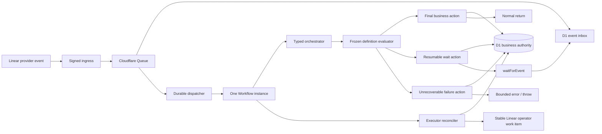
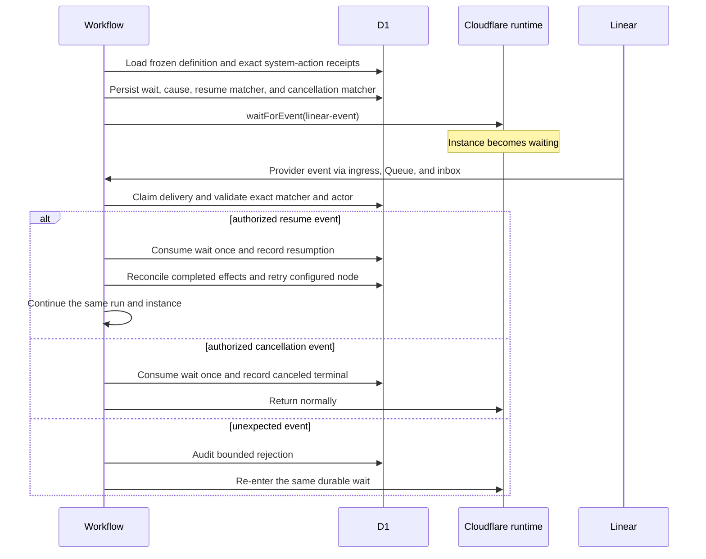

## Context

See [proposal.md](proposal.md) for the lifecycle mismatch and scope. The shipped version 3 workflow has one terminal `blocked` node, and agent or system-action failure edges commonly target it. `WorkflowOrchestrator.run()` returns whenever it reaches any terminal node, so Cloudflare correctly classifies that invocation as complete even when D1 says the DEOS run is blocked.

D1 already owns run identity, current node, transitions, provider receipts, and the Workflow instance mapping. The dispatcher already routes later Linear deliveries to active mappings, and the orchestrator already uses durable `waitForEvent` calls for human gates. The correction extends those boundaries rather than adding another business-state authority.

Cloudflare execution and DEOS business outcome cannot be made atomically authoritative in one transaction. The runtime therefore records the business control action before it waits, returns, or throws. A reconciliation check translates unexpected terminal executor outcomes into bounded DEOS state and reports the DEOS result on the correlated Linear issue. Raw provider status remains internal infrastructure evidence, and a failed status read never invents a business transition.

## Goals / Non-Goals

**Goals:**

- Make final business outcomes, resumable waits, and unrecoverable failures different typed graph actions.
- Preserve one D1-authoritative run and one Cloudflare Workflow instance across reconciliation.
- Make both the resume event and cancellation event exact, persisted, sanitized, and definition-controlled for every wait.
- Reconcile premature completion and out-of-band executor error or termination into safe DEOS states visible to the operator.
- Keep version 3 runs and their historical `blocked` outcome readable.
- Produce deterministic and provider-originated evidence for waiting, resumption, cancellation, final completion, and executor error behavior.

**Non-Goals:**

- Implement the SAC-101 operator interface or the SAC-102 native graph work.
- Expose Cloudflare Workflow status in the SAC-101 API or operator interface.
- Generalize reconciliation into an unrestricted operator command channel.
- Permit an agent or event payload to select a node, DEOS status, or Linear transition.
- Rewrite immutable version 3 definitions or historical run records.
- Implement unrelated missing system actions.

## Component Diagram



## Event Flow

### Resumable missing-capability path



Duplicate deliveries reuse the inbox idempotency key and cannot consume the wait twice. A provider event can request only the resume or cancellation edge already frozen in the definition; it cannot provide a target node or status.

### Final and failure paths

For a final business action, the orchestrator first commits the terminal node and DEOS outcome, then returns normally. A final rejection therefore becomes DEOS `denied` while Cloudflare becomes `complete`.

For an unrecoverable executor or invariant failure, the orchestrator exhausts the definition's bounded retries, commits DEOS `failed` with a service-authored cause, and throws. If D1 itself is unavailable, the Workflow throws without claiming a DEOS terminal state; recovery reconciles the run from its last durable state before any further action.

If Cloudflare nevertheless reports an instance `complete`, `errored`, or `terminated` while D1 remains non-final, reconciliation maps the confirmed provider outcome to a bounded DEOS failure cause. Every guarded update preserves the same run identity, and a stable operation key creates or updates one operator-visible Linear work item. If a provider read fails, the reconciler preserves D1, records a bounded internal diagnostic, and retries according to policy rather than guessing a business transition. The reconciler never moves the issue to Done or automatically creates a replacement run.

## Decisions

### 1. Add typed wait and failure actions to versioned workflow definitions

Version 4 definitions add two node types and narrow terminal nodes:

```yaml
nodes:
  openspec_tasks:
    type: system_action
    action: openspec.create_tasks
    edges:
      completed: implementation
      failed: await_openspec_tasks

  await_openspec_tasks:
    type: wait
    deosStatus: awaiting_capability
    resumeEvent:
      type: linear.issue.state_changed
      actorType: user
      toState: In Progress
      action: openspec.create_tasks
    cancelEvent:
      type: linear.issue.state_changed
      actorType: user
      toState: Canceled
    edges:
      received: openspec_tasks
      canceled: canceled

  canceled:
    type: terminal
    deosStatus: canceled
    executorAction: return

  denied:
    type: terminal
    deosStatus: denied
    executorAction: return

  failed:
    type: failure
    deosStatus: failed
    executorAction: throw
```

A version 4 `terminal` node may name only a final business outcome and always returns normally. A `wait` node must name one resumable DEOS status, exact typed resume and cancellation descriptors, and configured edges for both events. A `failure` node names a bounded safe cause and always throws after durable failure recording. Definition validation rejects a version 4 terminal `blocked` node, a wait without a cancellation path, or an edge whose target does not make final, resumable, or failure semantics explicit.

Existing version 3 snapshots remain valid and executable for historical compatibility. They retain legacy `blocked` behavior; the new validator rules apply only to version 4 and later.

Alternative considered: infer whether `blocked` is resumable from the error message or agent result. Rejected because untrusted or unstable text would become workflow policy and old definitions would remain ambiguous.

### 2. Keep one D1 business status and preserve waits as first-class audit records

The `orchestration_runs.status` constraint expands to:

- non-final: `pending_dispatch`, `active`, `awaiting_human`, `awaiting_capability`, and `manual_reconciliation_required`;
- final: `succeeded`, `denied`, `failed`, and `canceled`;
- legacy: `blocked`, retained only for version 3 records.

`terminal_at` is set only for final or legacy terminal statuses. The one-active-run index includes both new resumable statuses, preventing a new run or instance while reconciliation is possible.

Because the existing SQLite CHECK constraint cannot be widened in place, deployment performs a tested copy-and-swap migration while trial dispatch is disabled. It copies every row, verifies row counts and key invariants, recreates foreign keys and indexes, and only then replaces the old table. Rollback retains the expanded table because old code can continue using its existing status values.

Each wait is recorded separately:

```text
workflow_waits
  wait_id                  stable primary key
  run_id                   D1 run identity
  node_id                  frozen wait node
  status                   awaiting | consumed | canceled
  resume_event_type        service-authored event class
  resume_event_json        canonical sanitized typed matcher
  resume_event_digest      integrity and idempotency key
  cancel_event_type        service-authored event class
  cancel_event_json        canonical sanitized typed matcher
  cancel_event_digest      integrity and idempotency key
  cause_reference          bounded transition/system-action cause
  created_at
  consumed_delivery_id     nullable, unique when present
  consumed_at              nullable
```

Matchers contain only allowlisted fields needed by the evaluator. They cannot contain executable expressions, raw provider content, or a target node selected by the event. Consumption and the configured next-node transition use one D1 transaction or batch guarded by the current node, wait status, and delivery ID.

Alternative considered: store matchers only on the run row. Rejected because it loses wait history and makes replay and duplicate-consumption audits harder.

### 3. Treat resume and cancellation as normal authenticated events

The first implementation uses the existing signed Linear event path. A wait node declares the exact Linear event shapes and verified actor types that can resume or cancel it. Ingress authentication, delivery idempotency, Queue delivery, the D1 inbox, and Workflow event delivery remain unchanged.

The dispatcher considers `awaiting_capability` and `manual_reconciliation_required` resumable mappings. It routes a related issue event to the recorded Workflow instance and never allocates a replacement. The Workflow, not the dispatcher, makes the final matcher and authorization decision from the frozen definition.

This permits provider-originated proof: a run can wait because `openspec.create_tasks` lacks an exact receipt; a real human Linear transition can request a retry on the same run after the capability is repaired, or a configured cancellation transition can end that same run. A retried node still requires the exact successful or reconciled system-action receipt before following its success edge.

Alternative considered: expose a generic endpoint that writes D1 status or resumes arbitrary nodes. Rejected because it bypasses provider authentication, frozen graph policy, and inbox idempotency.

### 4. Translate unexpected executor outcomes as a core fail-safe

A reconciliation path reads Cloudflare instance status and the correlated D1 run. For a non-final D1 run it applies this closed mapping:

- `complete` becomes DEOS `failed` with `premature_workflow_completion`;
- `errored` becomes DEOS `failed` with `execution_failed` unless the matching failure transition was already committed;
- `terminated` becomes DEOS `failed` with `execution_terminated` unless the matching DEOS cancellation was already committed; and
- a failed status read preserves D1, emits only a bounded internal diagnostic, and retries according to policy.

Each mutation uses a compare-and-set from the D1 state inspected before the provider read. Provider enum values and provider error bodies remain internal diagnostics; operator consumers read only the resulting DEOS status, current node, safe cause, and expected event from D1.

After that transition, it uses a stable operation key derived from the run and failure cause to create or update one operator-visible work item on the Linear issue. The notice identifies the failed run and safe cause and states that operator reconciliation is required. Repeated reconciliation reuses the same record and notice. If the D1 compare-and-set loses a race, the reconciler preserves the newer state and does not publish a stale notice.

This is the complete operator-facing boundary: executor evidence is translated internally, while SAC-101 presents the D1-authoritative DEOS business graph without a parallel Cloudflare status.

Alternative considered: leave the run non-final and report only Cloudflare `complete`. Rejected because the original instance can no longer receive its configured event and the operator would have no actionable business error.

### 5. Make failure ordering fail closed

Business state is committed before executor termination:

1. reload and compare the current D1 node and status;
2. apply the configured bounded retry policy;
3. commit the final DEOS failure transition and safe cause;
4. throw a service-authored error without raw dependency content.

If step 3 cannot be durably confirmed, the runtime throws and leaves the last confirmed D1 state intact. It does not return, mark the run successful, or advance Linear. A later reconciliation process inspects the Cloudflare error and the last D1 transition before deciding whether to retry or mark the run failed.

Alternative considered: return `{ outcome: "failed" }`. Rejected because Cloudflare would report `complete`, collapsing an executor failure into a normal return.

## Failure Modes

| Failure | Required behavior |
| --- | --- |
| Wait record commits but `waitForEvent` is not reached | Workflow retry reloads the same wait and invokes `waitForEvent`; no new run is created. |
| Event is sent but inbox state is not updated | Delivery ID and wait-consumption guards make replay a duplicate. |
| Unexpected or unauthorized event arrives | Audit bounded rejection, preserve wait, and continue waiting. |
| Resume and cancellation deliveries race | The first guarded wait consumption wins; the loser is audited as already consumed. |
| Reconciled action still lacks its exact receipt | Return to the same wait with the same stable event identities or apply the configured bounded failure rule. |
| D1 final transition commits but return or throw is interrupted | Retry reloads the final node and repeats only the matching executor action. |
| Cloudflare reports `complete` while D1 is non-final | Compare-and-set DEOS to failed with `premature_workflow_completion` and create or update the stable Linear operator work item. |
| Cloudflare reports `errored` while D1 is non-final | Compare-and-set DEOS to failed with `execution_failed`, unless the matching durable DEOS failure already exists. |
| Cloudflare reports `terminated` without a final DEOS cancellation | Compare-and-set DEOS to failed with `execution_terminated`; never infer business cancellation from provider termination. |
| Cloudflare status cannot be read | Preserve D1, record a bounded internal diagnostic, and retry according to policy; do not guess a DEOS result. |
| Premature-completion reconciliation loses a D1 race | Preserve the newer business state, audit the conflict, and suppress a stale Linear notice. |
| D1 is unavailable during failure recording | Throw, leave the last durable state unchanged, and require reconciliation; never claim DEOS success. |
| Legacy version 3 run is loaded | Restore its immutable snapshot and preserve legacy semantics without applying version 4 validation retroactively. |

## Risks / Trade-offs

- **[Risk] A human Linear transition is used as the first reconciliation signal even though capability repair occurs outside Linear.** → The frozen definition names the exact transition and actor policy; the event only requests reevaluation, while the trusted adapter and exact durable receipt still prove the capability.
- **[Risk] Copy-and-swap migration affects a table referenced by many orchestration records.** → Disable dispatch, back up and verify production D1, test the migration against a copy, check row counts, foreign keys, active-run uniqueness, and rollback before re-enabling the canary.
- **[Risk] Resume and cancellation events can arrive concurrently.** → Claim the wait with a single guarded D1 transaction and audit the losing delivery without side effects.
- **[Risk] Reconciliation could produce duplicate Linear notices.** → Use one stable operation key per run and failure cause and update the existing work item idempotently.
- **[Risk] A provider status read can race a legitimate DEOS transition.** → Guard every reconciliation write with the D1 state/version inspected before the read and preserve any newer business transition.
- **[Risk] Version 3 and version 4 semantics coexist.** → Select behavior by immutable definition version and keep legacy `blocked` read-only for old runs.
- **[Risk] A resumable wait can remain indefinitely.** → Every wait has an explicit definition-controlled cancellation event; implicit timeout success is forbidden.

## Migration Plan

1. Keep trial dispatch disabled and capture a D1 backup plus row-count and foreign-key baselines.
2. Apply the status-constraint migration and create `workflow_waits` with resume and cancellation matchers.
3. Deploy runtime support for version 4 definitions and bounded executor-to-DEOS reconciliation while leaving active project policy on version 3.
4. Register a version 4 canary definition and validate its digest and typed lifecycle nodes.
5. Enable only the test-project canary and trigger a real Linear run that reaches the missing-`openspec.create_tasks` wait.
6. Prove D1 `awaiting_capability`, both exact event matchers, the same run/instance mapping, and Cloudflare `waiting`.
7. Enable or reconcile the trusted system-action capability, then use Linear MCP to produce the configured human event and prove idempotent resumption of the same run.
8. Produce the configured Linear cancellation event on a separate waiting canary and prove the same run reaches DEOS `canceled` with no resume effects.
9. Prove one normal final path, one bounded in-process executor-failure path, one premature-completion reconciliation path, and one out-of-band terminal reconciliation path, including the resulting D1 state and stable operator-visible Linear work item.
10. Keep dispatch disabled after proof until the evidence is reviewed.

Rollback disables dispatch and points new runs back to the version 3 definition. The schema remains expanded and existing version 4 runs retain their immutable definitions; they are canceled or reconciled explicitly rather than downgraded.
