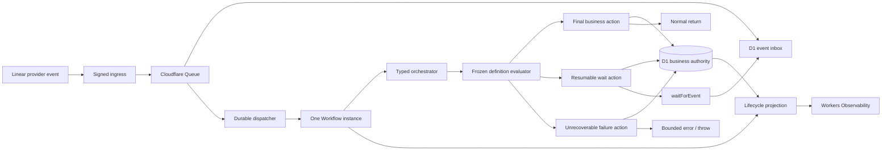
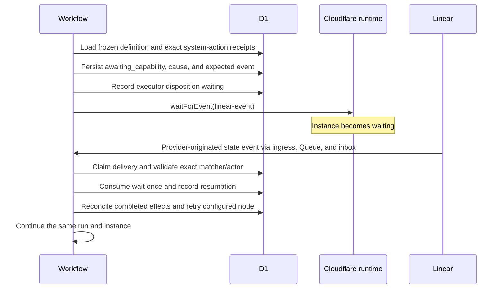

## Context

See [proposal.md](proposal.md) for the lifecycle mismatch and scope. The shipped version 3 workflow has one terminal `blocked` node, and agent or system-action failure edges commonly target it. `WorkflowOrchestrator.run()` returns whenever it reaches any terminal node, so Cloudflare correctly classifies that invocation as complete even when D1 says the DEOS run is blocked.

D1 already owns run identity, current node, transitions, provider receipts, and the Workflow instance mapping. The dispatcher already routes later Linear deliveries to active mappings, and the orchestrator already uses durable `waitForEvent` calls for human gates. The correction should extend those boundaries rather than add another business-state authority.

Cloudflare execution and DEOS business outcome cannot be made atomically authoritative in one transaction. The runtime can durably record the control action it is taking before it waits, returns, or throws; provider-originated proof and status reads then confirm the resulting Cloudflare instance state.

## Goals / Non-Goals

**Goals:**

- Make final business outcomes, resumable waits, and unrecoverable failures different typed graph actions.
- Preserve one D1-authoritative run and one Cloudflare Workflow instance across reconciliation.
- Make the event that can resume a wait exact, persisted, sanitized, and definition-controlled.
- Prevent Cloudflare `complete` from being interpreted as DEOS success.
- Keep version 3 runs and their historical `blocked` outcome readable.
- Produce deterministic and provider-originated evidence for waiting, resumption, final completion, and executor error behavior.

**Non-Goals:**

- Implement the SAC-101 operator interface or the SAC-102 native graph work.
- Generalize reconciliation into an unrestricted operator command channel.
- Permit an agent or event payload to select a node, DEOS status, or Linear transition.
- Rewrite immutable version 3 definitions or historical run records.
- Implement unrelated missing system actions.

## Component Diagram



## Event Flow

### Resumable missing-capability path



An event that fails the matcher or actor policy is marked processed with a bounded rejection cause and the Workflow re-enters the same durable wait. Duplicate deliveries reuse the inbox idempotency key and cannot consume the wait twice.

### Final and failure paths

For a final business action, the orchestrator first commits the terminal node and DEOS outcome, records executor disposition `complete`, emits the two-layer observation, and returns normally. A final rejection therefore becomes DEOS `denied` while Cloudflare becomes `complete`.

For an unrecoverable executor or invariant failure, the orchestrator exhausts the definition's bounded retries, commits DEOS `failed` with a service-authored cause, records executor disposition `errored`, emits a failure observation, and throws. If D1 itself is unavailable, the Workflow throws without claiming a DEOS terminal state; recovery must reconcile the run from its last durable state before any further action, and no projection may label it successful.

## Decisions

### 1. Add typed wait and failure actions to versioned workflow definitions

Version 4 definitions add two node types and narrow terminal nodes:

```yaml
nodes:
  openspec_tasks:
    type: system_action
    action: openspec.create_tasks
    edges:
      completed: implementation
      failed: await_openspec_tasks

  await_openspec_tasks:
    type: wait
    deosStatus: awaiting_capability
    expectedEvent:
      type: linear.issue.state_changed
      actorType: user
      toState: In Progress
      action: openspec.create_tasks
    edges:
      received: openspec_tasks

  denied:
    type: terminal
    deosStatus: denied
    executorAction: return

  failed:
    type: failure
    deosStatus: failed
    executorAction: throw
```

A version 4 `terminal` node may name only a final business outcome and always returns normally. A `wait` node must name one resumable DEOS status, an exact typed event descriptor, and a configured continuation edge. A `failure` node must name a bounded safe cause and always throws after durable failure recording. Definition validation rejects a version 4 terminal `blocked` node or an edge outcome whose target does not make final, resumable, or failure semantics explicit.

Existing version 3 snapshots remain valid and executable for historical compatibility. They retain legacy `blocked` behavior; the new validator rules apply only to version 4 and later.

Alternative considered: infer whether `blocked` is resumable from the error message or agent result. Rejected because untrusted or unstable text would become workflow policy and old definitions would remain ambiguous.

### 2. Keep one D1 business status and preserve waits as first-class audit records

The `orchestration_runs.status` constraint expands to:

- non-final: `pending_dispatch`, `active`, `awaiting_human`, `awaiting_capability`, and `manual_reconciliation_required`;
- final: `succeeded`, `denied`, `failed`, and `canceled`;
- legacy: `blocked`, retained only for version 3 records.

`terminal_at` is set only for final or legacy terminal statuses. The one-active-run index includes both new resumable statuses, preventing a new run or instance while reconciliation is possible.

Because the existing SQLite CHECK constraint cannot be widened in place, deployment performs a tested copy-and-swap migration while trial dispatch is disabled. It copies every row, verifies row counts and key invariants, recreates foreign keys and indexes, and only then replaces the old table. Rollback retains the expanded table because old code can continue using its existing status values.

Each wait is recorded separately:

```text
workflow_waits
  wait_id                  stable primary key
  run_id                   D1 run identity
  node_id                  frozen wait node
  status                   awaiting | consumed | canceled
  expected_event_type      service-authored event class
  expected_event_json      canonical sanitized typed matcher
  expected_event_digest    integrity and idempotency key
  cause_reference          bounded transition/system-action cause
  created_at
  consumed_delivery_id     nullable, unique when present
  consumed_at              nullable
```

The matcher contains only allowlisted fields needed by the evaluator. It cannot contain executable expressions, raw provider content, or a target node selected by the event. Consumption and the next node transition use one D1 transaction or batch guarded by the current node, wait status, and delivery ID.

Alternative considered: store only `expected_event` on the run row. Rejected because it loses wait history and makes replay and duplicate-consumption audits harder.

### 3. Treat reconciliation as a normal authenticated event, not an operator mutation

The first implementation uses the existing signed Linear event path. A wait node declares the exact Linear event shape and verified actor type that can resume it. Ingress authentication, delivery idempotency, Queue delivery, the D1 inbox, and Workflow event delivery remain unchanged.

The dispatcher considers `awaiting_capability` and `manual_reconciliation_required` resumable mappings. It routes a matching issue event to the recorded Workflow instance and never allocates a replacement. The Workflow, not the dispatcher, makes the final matcher and authorization decision from the frozen definition.

This permits a provider-originated proof: a run can wait because `openspec.create_tasks` lacks an exact receipt, the trusted capability can be enabled or reconciled, and a real human Linear transition can trigger a retry on the same run. The retried node still requires the exact successful or reconciled system-action receipt before following its success edge.

Alternative considered: expose a generic endpoint that writes D1 status or resumes arbitrary nodes. Rejected because it bypasses provider authentication, frozen graph policy, and inbox idempotency.

### 4. Record executor disposition separately and verify provider state

Before each control boundary, the orchestrator appends a `workflow_execution_observations` record:

```text
workflow_execution_observations
  observation_id
  run_id
  workflow_instance_id
  status               running | waiting | complete | errored
  source               orchestrator | cloudflare_api
  node_id
  transition_cause
  observed_at
```

An orchestrator observation records the action DEOS is taking immediately before `waitForEvent`, normal return, or throw. A read-only Cloudflare API observation can confirm the actual instance state during proof or operator inspection. Projections expose the latest value and its source; they never overwrite `orchestration_runs.status`.

Every waiting or terminal lifecycle event includes:

- `cloudflare.execution.status`
- `cloudflare.execution.status_source`
- `deos.run.status`
- `deos.current_node`
- `deos.transition.cause`
- `deos.expected_event` only for a wait

`deos.expected_event` is a bounded event identifier plus sanitized matcher, never the raw event. SAC-101 may display these fields but does not redefine them.

Alternative considered: derive DEOS status from the Cloudflare API. Rejected because provider execution is not the governed business process and provider status may lag or be unavailable.

### 5. Make failure ordering fail closed

Business state is committed before executor termination:

1. reload and compare the current D1 node and status;
2. apply the configured bounded retry policy;
3. commit the final DEOS failure transition and safe cause;
4. record and emit executor disposition `errored`;
5. throw a service-authored error without raw dependency content.

If steps 3 or 4 cannot be durably confirmed, the runtime throws and leaves the last confirmed D1 state intact. It does not return, mark the run successful, or advance Linear. A later reconciliation process must inspect the Cloudflare error and the last D1 transition before deciding whether to retry or mark the run failed.

Alternative considered: return `{ outcome: "failed" }` so D1 and Cloudflare both have a terminal record. Rejected because Cloudflare would report `complete`, collapsing an executor failure into a normal return.

## Failure Modes

| Failure | Required behavior |
| --- | --- |
| Wait record commits but `waitForEvent` is not reached | Workflow retry reloads the same wait and invokes `waitForEvent`; no new run is created. |
| Event is sent but inbox state is not updated | Delivery ID and wait consumption guards make replay a duplicate. |
| Unexpected or unauthorized event arrives | Audit bounded rejection, preserve wait, and continue waiting. |
| Reconciled action still lacks its exact receipt | Return to the same wait with the same stable expected-event identity or apply the configured bounded failure rule. |
| D1 final transition commits but return/throw is interrupted | Retry reloads the final node and repeats only the matching return or throw disposition. |
| Cloudflare status readback disagrees with the orchestrator disposition | Preserve both observations, make D1 primary, and flag reconciliation rather than rewriting business state. |
| D1 is unavailable during failure recording | Throw, emit only safe telemetry when possible, leave the last durable state unchanged, and require reconciliation; never claim DEOS success. |
| Legacy version 3 run is loaded | Restore its immutable snapshot and preserve legacy semantics without applying version 4 validation retroactively. |

## Risks / Trade-offs

- **[Risk] A human Linear transition is used as the first reconciliation signal even though capability repair occurs outside Linear.** → The frozen definition names the exact transition and actor policy; the event only requests reevaluation, while the trusted adapter and exact durable receipt still prove the capability.
- **[Risk] Copy-and-swap migration affects a table referenced by many orchestration records.** → Disable dispatch, back up and verify production D1, test the migration against a copy, check row counts, foreign keys, active-run uniqueness, and rollback before re-enabling the canary.
- **[Risk] The runtime-declared executor disposition can briefly precede the provider's visible status.** → Include `status_source` and timestamp, and require Cloudflare API confirmation in provider proof.
- **[Risk] Version 3 and version 4 semantics coexist.** → Select behavior by immutable definition version and keep legacy `blocked` read-only for old runs.
- **[Risk] A resumable wait can remain indefinitely.** → Surface wait age and exact expected event; cancellation remains an explicit final event rather than an implicit timeout success.

## Migration Plan

1. Keep trial dispatch disabled and capture a D1 backup plus row-count and foreign-key baselines.
2. Apply the status-constraint migration and create `workflow_waits` and `workflow_execution_observations`.
3. Deploy runtime support for version 4 definitions while leaving the active project policy on version 3.
4. Register a version 4 canary definition and validate its digest and typed lifecycle nodes.
5. Enable only the test-project canary and trigger a real Linear run that reaches the missing-`openspec.create_tasks` wait.
6. Prove D1 `awaiting_capability`, the exact expected event, the same run/instance mapping, Cloudflare `waiting`, and bounded telemetry.
7. Enable or reconcile the trusted system-action capability, then use Linear MCP to produce the configured human event and prove idempotent resumption of the same run.
8. Prove one normal final path and one bounded executor-failure path, including D1, Cloudflare API, Workers Observability, Linear, and visual evidence.
9. Keep dispatch disabled after proof until the evidence is reviewed.

Rollback disables dispatch and points new runs back to the version 3 definition. The schema remains expanded and existing version 4 runs retain their immutable definitions; they are canceled or reconciled explicitly rather than downgraded.
