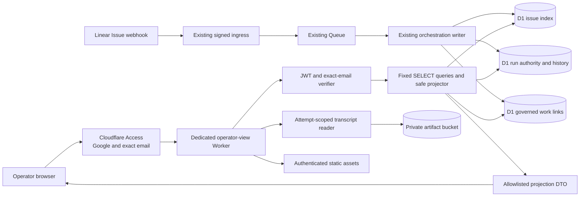
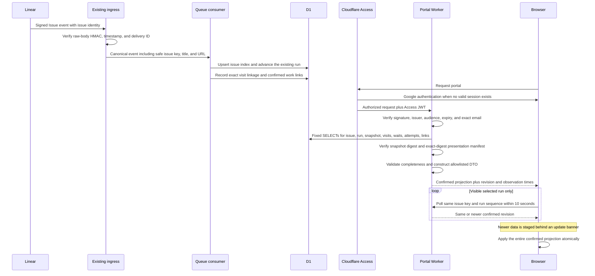

## Context

See [proposal.md](proposal.md) for the motivation and
[workflow-operator-view/spec.md](specs/workflow-operator-view/spec.md) for the
approved behavior. SAC-123 supplies the approved blue-charcoal, two-row visual
direction. The implementation must replace its fixture data without changing
the chosen information hierarchy, theme behavior, or provider-neutral language.

D1 already owns run sequence, current business status, current node and visit,
ordered transitions, waits, agent attempts, provider operations, artifacts, and
the immutable definition snapshot selected for each run. The existing ingress
and orchestration Worker also has Queue, Workflow, Sandbox, R2, GitHub, and
Linear mutation capabilities. Reusing that Worker for the portal would make a
read-only HTTP surface share an unnecessarily broad capability boundary.

A read-only remote inventory on 2026-08-21 found stored definition versions 1
through 11; runs reference every stored version except version 3. The transition
ledger identifies visits exactly, but
`agent_attempts` and `workflow_waits` do not yet record their visit sequence,
and the webhook anti-corruption layer currently discards the human Linear issue
key. Those gaps must be repaired durably rather than inferred by the browser.

Cloudflare Access is deny-by-default and supports an exact email selector. A
Worker behind Access must still validate the Access JWT it receives. Workers
Static Assets can run Worker code before every asset request, which allows one
authentication boundary to protect both the application shell and API. These
provider contracts are documented in
[Access policies](https://developers.cloudflare.com/cloudflare-one/access-controls/policies/),
[Access JWT
validation](https://developers.cloudflare.com/cloudflare-one/access-controls/applications/http-apps/authorization-cookie/validating-json/),
and [Static Assets bindings](https://developers.cloudflare.com/workers/static-assets/binding/).
Linear's signed Issue webhook contains the serialized issue plus its provider
URL, so the existing authenticated ingress can preserve the safe issue identity
without giving the portal a Linear credential; see
[Linear webhooks](https://linear.app/developers/webhooks).

## Goals / Non-Goals

**Goals:**

- Isolate the portal in a separate Worker with D1, one read-only artifact-bucket
  binding, and its static asset binding.
- Authenticate every asset and API request twice: first by an exact-email
  Access policy and then by Worker-side JWT and email validation.
- Resolve a human issue key and run sequence entirely from safe D1 index rows.
- Project graph structure from the selected run's digest-verified frozen
  definition without returning prompts, job specifications, or canonical JSON.
- Preserve exact visits, cycles, waits, attempts, outcomes, and governed work
  links with explicit durable relationships.
- Reuse the approved prototype as the presentation source while replacing all
  fixtures with one allowlisted API contract and confirmed-update polling.
- Prove authorization, capability inventory, non-mutation, projection,
  redaction, live wait/resumption, and terminal behavior separately.

**Non-Goals:**

- Add portal-side Linear or GitHub lookup, general R2 artifact browsing, push
  updates, Workflow executor status, or any mutation endpoint.
- Change the workflow graph, business lifecycle, human-gate transitions, or
  definition selected by an existing run.
- Repair historical transition rows whose absence cannot be proven from D1.
- Expose diffs, diagnostics, provider payloads, definition documents, or any R2
  body other than an accepted, integrity-verified `transcript.jsonl` through
  the portal.

## Component Diagram



The portal Worker has no Queue producer or consumer, Workflow, Durable Object,
Sandbox, service binding, GitHub credential, Linear credential, cron, or
provider-capability route. Its sole R2 binding can read the private artifact
bucket, and portal code exposes only the D1-resolved transcript path. The
deployment-only credential used to configure Access is never bound to the
Worker.

## Event Flow



No browser action in this flow writes durable state. Search, selected theme,
recent issue keys, pending projection, and expanded stage state are local UI
state only.

## Minimal Data Model

Existing run and transition tables remain authoritative. Add only the durable
relationships that the safe read model cannot currently prove:

```text
linear_issue_index
  issue_id                 TEXT PRIMARY KEY
  project_id               TEXT NOT NULL
  issue_key                TEXT NOT NULL
  title                    TEXT NOT NULL
  linear_url               TEXT NOT NULL
  source_delivery_id       TEXT NOT NULL
  observed_at              TEXT NOT NULL
  UNIQUE (project_id, issue_key)

agent_attempts
  ...existing fields
  visit_sequence           INTEGER NULL CHECK (> 0)

workflow_waits
  ...existing fields
  visit_sequence           INTEGER NULL CHECK (> 0)

governed_work_links
  link_id                  TEXT PRIMARY KEY
  run_id                   TEXT NOT NULL
  visit_sequence           INTEGER NOT NULL CHECK (> 0)
  attempt_id               TEXT NULL
  kind                     openspec_artifact | pull_request | transcript_document
  safe_label               TEXT NOT NULL
  destination_url          TEXT NOT NULL
  provider_operation_id    TEXT NULL
  confirmed_at             TEXT NOT NULL
  UNIQUE (run_id, visit_sequence, kind, safe_label)
```

New attempts and waits always copy the run's current visit sequence at creation.
The nullable migration permits truthful handling of legacy rows: the backfill
sets a value only when node identity and one transition-bounded visit interval
produce exactly one match. An ambiguous or incomplete run is unavailable in
the portal until reconciled; it is never assigned to a guessed cycle.

`governed_work_links` is written only by trusted orchestration code after a
provider effect is confirmed. OpenSpec artifact rows come from the exact
allowlisted file paths in the confirmed GitHub request. Implementation and
validation rows point to the governed pull request. An attempt transcript is
available only when the attempt owns a complete manifest whose accepted
`transcript.jsonl` row records the exact R2 key, byte size, and SHA-256. None of
those storage identifiers is returned in the workflow projection.

## Decisions

### 1. Deploy a separate read-only TypeScript Worker

The portal is a new Worker with one D1 binding, one R2 artifact-bucket binding,
and one Static Assets binding.
Its module exposes only `fetch`; its Wrangler configuration contains no Queue,
Workflow, Durable Object, Sandbox, service, cron, or provider credential.
Static Assets use `run_worker_first: true`, so the Worker authenticates before
serving even a hashed asset or SPA fallback.

The D1 binding itself is not method-scoped. The portal therefore uses a small
read store whose SQL is a closed set of constant prepared `SELECT` statements
and whose interface exposes only `first` and `all`. CI enumerates every portal
statement and rejects non-SELECT SQL, dynamic identifiers, `.run()`, and
`.batch()`. Route tests inject a recording D1 adapter and assert zero writes for
every method and error path.

Alternatives considered:

- Adding routes to the existing orchestration Worker was rejected because an
  HTTP parsing or authorization defect would share its mutation bindings.
- General R2 browsing and caller-supplied object keys are rejected because the
  bucket also contains patches and diagnostics. The narrow exception resolves
  one attempt's accepted `transcript.jsonl` row through fixed D1 queries and
  verifies its stored byte size and SHA-256 before returning it.
- A separate read-replica database was rejected because D1 remains the required
  live authority and asynchronous copying would add a second freshness model.

### 2. Enforce Access policy and Worker-side identity validation

An idempotent deployment script creates or reconciles one self-hosted Access
application for the portal hostname, restricts login to the configured Google
identity provider, and attaches one Allow policy whose only Include selector is
the exact email `sachinkundu@gmail.com`. Access denies all unmatched identities
by default. The script uses an operator-held Cloudflare token with Access write
permission; the token is not a Worker secret.

Every request must carry `Cf-Access-Jwt-Assertion`. The Worker verifies RS256
with the team-domain JWKS, the exact issuer, the application's audience tag,
expiry, and the exact email claim using `jose`. Missing or invalid identity
returns a generic `403` before assets, API routing, D1 reads, or error details.
The allowed email and Access audience are non-secret deployment variables;
changing either requires configuration review and redeployment.

Alternative considered: trust only the edge policy. Rejected because the spec
requires the backend to reject absent or wrong trusted identity and because a
route or Access configuration mistake must not expose D1 data.

### 3. Preserve issue-key identity at authenticated ingress

The Linear anti-corruption layer adds `issue_key`, bounded `title`, and
validated `linear_url` to the canonical Queue event after the existing raw-body
signature verification. The Queue consumer upserts `linear_issue_index` before
run selection. The index uses provider issue UUID as primary identity and
project plus human key as the lookup identity. URLs must be HTTPS Linear issue
URLs and titles are length-bounded before storage.

Historical rows are backfilled by a one-time operator script while dispatch is
disabled. The script reads distinct D1 issue IDs, queries Linear with a
separate OAuth token authorized for `read` only, validates the response, and
writes the index through Wrangler. That token is used only by the backfill and
is never deployed with the portal. Any unresolved or conflicting issue remains
unavailable by key and is reported in the migration evidence.

Alternative considered: call Linear on every search and poll. Rejected because
it would add a credential and external dependency to the portal, repeat issue
lookups every few seconds, and weaken the read-only resource inventory.

### 4. Project each digest-verified frozen definition through a closed manifest

The backend loads the selected `workflow_definitions.canonical_json` only after
the run's definition identity, version, and digest match the snapshot row. It
uses the existing canonical restore/digest rules to reject tampering. It then
selects a checked-in presentation manifest by exact definition identity,
version, and digest.

The manifest contains only safe display metadata: product stage IDs and labels,
node-to-stage membership, stage order and two-row placement, cycle-entry nodes,
and safe node labels. Canonical nodes and edges still come from the frozen
snapshot. The projector validates that every canonical node is mapped exactly
once, every manifest node exists, every edge target exists, and every collapsed
forward or return edge is retained. Internal edges inside one stage become an
explicit stage loop when the manifest marks the corresponding cycle entry.

Implementation inventories every stored snapshot and supplies a manifest for
every exact digest in the current deployment, including the currently
unreferenced version 3 snapshot. A new or altered digest without a reviewed
manifest
produces an unavailable projection instead of falling back to the current
definition or dropping unknown nodes. The response labels the definition
version and digest as provenance for the complete frozen definition and states
that the displayed safe projection is not the digested document.

Alternatives considered:

- Returning canonical JSON and hiding fields in React was rejected because the
  document contains prompts and execution settings.
- Guessing groups from node names was rejected because semantic inference could
  silently hide an unfamiliar node or loop.
- Storing display metadata inside future definitions was rejected for this
  slice because immutable historical snapshots do not contain it. Exact-digest
  manifests support history without rewriting those snapshots.

### 5. Build exact visits and cycles before constructing the response

Visit one is the frozen start node at run creation. Every transition contributes
one ordered source visit and one next visit using its existing from/to visit
sequences. The read model requires contiguous sequences from one through the
run's current visit, exact agreement among current node, last transition, and
run status, and at most one outgoing transition per source visit. Missing or
conflicting ledger data makes the selected run unavailable.

Attempts and waits join by `(run_id, visit_sequence, node_id)`. Each attempt is
returned separately in chronological order with only its safe display label,
attempt ID, ordinal within the visit, normalized confirmed state or outcome,
start and end times, and transcript availability. Job specifications,
Sandbox/process IDs, raw result classes, and R2 keys never enter the DTO.

Cycle counts are not inferred from elapsed time or a topological sort. Each
presentation manifest names the cycle-entry node for a grouped stage; visits to
that entry increment that stage's cycle number, and the ordered visit list
assigns every later visit to the active cycle until the next entry. Explicit
canonical return edges remain visible as self-loops or backward stage edges.

Wait rows expose only status, observation times, and service-authored guidance
selected from a closed safe-cause catalog. Raw matcher JSON, delivery IDs,
actor IDs, cause references, and diagnostics remain server-side. Human approval
waits always use the indexed Linear issue URL as their action destination.

Alternative considered: correlate legacy attempts by nearest timestamp in the
request path. Rejected because retries and repeated visits can overlap or tie;
the migration must prove one interval or leave the row unmapped.

### 6. Persist and validate governed work destinations

The trusted capability boundary records a work link only after the related
GitHub operation is `succeeded` or `reconciled`. It validates repository,
branch, path, URL origin, run, attempt, and visit before insertion. Planning
visits receive one row per confirmed OpenSpec artifact path; implementation and
validation receive the confirmed pull request as their primary destination.
Multiple artifact labels may intentionally open the same authenticated pull
request Files view.

Existing provider operations are backfilled through a read-only GitHub lookup
using their confirmed operation identity and governed branch. Ambiguous results
remain unavailable. The portal never accepts a destination from query input and
selects links only through the selected run and visit, so a URL recorded for
another run cannot be requested by changing an identifier.

The transcript route accepts only an attempt ID. A fixed query joins the
configured project, run, attempt, complete manifest, and accepted
`transcript.jsonl` artifact. The Worker fetches the D1-selected R2 key, applies
a bounded size limit, computes SHA-256 with Web Crypto, and returns a generic
unavailable response unless both stored size and digest match. The R2 key and
manifest storage path never leave the Worker.

Alternative considered: reconstruct GitHub URLs in the browser. Rejected
because the browser could not prove provider confirmation or selected-run
ownership and D1 currently stores the provider resource ID rather than the
confirmed URL.

### 7. Return one closed projection DTO and generic failures

The API surface is deliberately small:

```text
GET /api/issues/:issueKey/runs
GET /api/issues/:issueKey/runs/:runSequence
GET /api/attempts/:attemptId/transcript
GET /api/attempts/:attemptId/transcript.jsonl
GET /healthz
GET /assets/* and SPA navigation
```

`issueKey` is normalized to uppercase and must match a bounded Linear-key
grammar. `runSequence` must be a positive decimal integer. The first route
returns only safe issue context, newest-first sequences, selected sequence, and
summary state. The second returns one complete projection. `healthz` proves
only that the Worker is serving and discloses no bindings or data.

The complete projection comes from one constant `SELECT` statement whose CTEs
select the run and aggregate its snapshot, transitions, attempts, waits, and
links. One SQLite statement gives the projector one coherent read point while
keeping the SQL and result shape bounded. Run-list lookup is a separate bounded
statement and never contributes state to an already selected projection.

The response builder assigns every property explicitly. It returns issue key,
bounded title and Linear URL; run sequence; normalized DEOS status and outcome;
safe current visit; projected stages and edges; ordered visits, attempts,
waits, and governed destinations; definition version and digest; `observedAt`,
`runUpdatedAt`, and an opaque revision digest. It never spreads a D1 row or
serialized definition into a response.

Non-GET and non-HEAD methods return `405`; unknown paths return `404`;
validation and missing data return safe `400` or `404`; authorization returns
`403`; and all internal read, digest, projection, or rendering failures return
one generic unavailable response with a retry hint. API responses use
`Cache-Control: no-store`, restrictive security headers, and no stack, SQL,
binding, provider, or internal identifier text.

The transcript metadata route returns attempt ID, safe run and agent context,
verified byte size and SHA-256, and parsed JSONL records. The download route
returns the same verified bytes as `application/x-ndjson` with an attachment
filename. Both use `Cache-Control: no-store`; neither accepts a storage key.

### 8. Poll confirmed projections and stage updates behind a banner

The client fetches the selected issue and latest run on navigation, then polls
only the exact selected issue key and run sequence every five seconds while the
document is visible. It pauses when hidden and fetches immediately on
`visibilitychange` back to visible. Starting a newer request aborts the prior
one, so navigation cannot apply a late response for another issue or run.

The client compares the opaque revision with the displayed revision. Equal
revisions update only observation freshness. A newer revision is retained as a
complete pending DTO and produces the informational banner. The graph, history,
counts, status, and selected detail change together only when the operator
applies that DTO. A poll failure preserves the last confirmed DTO, labels it
unconfirmed with its observation time, and exposes Retry.

The approved prototype supplies component anatomy, two-row graph layout,
blue-charcoal tokens, System/Light/Dark themes, issue rail, detail panel, and
active-state breathing treatment. Theme is the only durable browser preference.
The selected-stage detail is deliberately sparse. After the visible state, it
shows only Started and Duration, followed by recorded transcript, pull request,
file, or Linear destinations. It does not render result, evidence, validation,
or explanatory summary copy that duplicates the graph state or linked work.
The read projection still retains the underlying records for history,
authorization, polling, and future trace-system use.
`prefers-reduced-motion: reduce` removes all breathing and transition animation
while preserving outline, color, icon, and text treatments for active work.
Recent issue keys may appear in navigation but are never background-polled.

Alternative considered: replace the displayed graph as soon as a poll returns.
Rejected because it can move content while the operator is reading and violates
the approved confirmed-update behavior.

### 9. Verify deterministic, deployed, and provider-originated claims separately

Deterministic tests cover JWT validation, exact email, route methods, SQL
inventory, zero writes, issue/run selection, snapshot digest checks, every
stored presentation manifest, unknown-node failure, visit completeness, cycle
counting, link ownership, DTO redaction, safe errors, polling, stale response
cancellation, themes, and reduced motion. Browser tests use seeded local D1
fixtures and the real compiled client; they do not count as provider proof.

Deployment evidence inventories the portal's Worker bindings and secrets,
Access application, Google identity provider restriction, exact-email policy,
and active Worker version. A Showboat record compares read-only D1 counts and
selected rows before and after portal requests to demonstrate no durable write.
Sanitized browser screenshots show Access configuration and the deployed
portal.

Provider-originated proof uses real Linear Issue events through the existing
signed ingress, Queue, Workflow, and D1 path. One canary reaches a human wait,
the portal shows the confirmed wait, a human performs the configured Linear
resume transition, and the portal offers the newer visit within ten seconds. A
separate canary reaches a wait and uses the configured human cancellation path
to produce a terminal `canceled` D1 outcome; the portal shows that exact final
visit, run sequence, definition version, and digest. Synthetic signed requests
and deterministic tests are labeled separately and never used as this proof.

## Failure Modes

| Failure | Required behavior |
| --- | --- |
| Access policy is missing or names another identity provider | Deployment verification fails; the portal is not declared ready. |
| JWT is absent, expired, signed by another issuer, has another audience, or names another email | Return generic `403` before assets or D1 access. |
| Issue key is malformed, absent from the index, or conflicts with another issue | Return safe validation/not-found state without fallback provider lookup. |
| Selected run sequence is absent | Return safe not-found state and preserve the available sequence list. |
| Frozen snapshot is absent, mismatched, or fails digest verification | Mark the graph unavailable; never use the deployed definition. |
| Exact-digest presentation manifest is absent or omits a node/edge | Mark the projection unavailable; never silently drop structure. |
| Transition visit sequence is missing, duplicated, or disagrees with the run | Mark the selected run unavailable and retain a bounded server diagnostic only. |
| Attempt or wait cannot be linked to exactly one visit | Mark the selected run unavailable rather than assigning a guessed cycle. |
| Governed destination belongs to another run or has an unapproved origin | Omit and deny the destination; retain a safe unavailable label. |
| D1 read or projection fails during initial load | Show unavailable with Retry and no prior state presented as current. |
| Poll fails after a confirmed view | Keep the last confirmed view, mark it unconfirmed with time, and stop claiming freshness. |
| Older poll completes after navigation | Ignore the aborted/stale response and preserve the newly selected issue and run. |
| D1 changes while a projection statement is executing | Return the one coherent statement snapshot; the next poll observes and stages the newer revision. |
| New workflow definition is deployed before its presentation manifest | Runs on that digest remain truthfully unavailable until a reviewed manifest ships. |

## Risks / Trade-offs

- **[Risk] The D1 binding can technically execute writes even though the portal
  exposes only reads.** → Isolate it in a dedicated Worker, keep a closed SQL
  inventory, prohibit write methods in the store interface, test every route
  with a recording adapter, inspect the deployed bundle and bindings, and
  compare remote D1 before/after evidence.
- **[Risk] Exact-digest manifests add maintenance whenever the workflow
  definition changes.** → Validate manifest coverage in CI and fail closed
  for unknown digests; the deliberate gate prevents a new node from being
  silently hidden.
- **[Risk] Some legacy runs may contain transition gaps or attempt timing that
  cannot prove visit ownership.** → Backfill only uniquely provable rows,
  report unresolved counts, and show those runs as unavailable rather than
  fabricating history.
- **[Risk] Issue title and URL are as fresh as the latest signed Issue event.**
  → Record the provider observation time, update the index on every relevant
  signed Issue event, and do not use Linear issue status as DEOS state.
- **[Risk] Polling adds repeated D1 reads and can return cross-query races.** →
  Poll only one visible run every five seconds, select bounded columns with
  indexes, validate one coherent revision, and stage updates atomically.
- **[Risk] Storing external URLs creates an open-redirect or cross-run risk.** →
  Accept links only from trusted confirmed provider adapters, validate origins
  and kinds on write and read, and query them through run and visit ownership.
- **[Risk] Requiring Worker execution before static assets adds latency.** →
  Keep the authentication path small, cache the remote JWKS through `jose`, use
  hashed assets, and accept the cost because private data protection is the
  primary constraint.
- **[Risk] The completion proof requires live human and provider actions.** →
  Keep dispatch scoped to disposable canaries, retain provider and portal
  screenshots plus read-only D1 evidence, and disable the canary after proof.

## Migration Plan

1. Keep trial dispatch disabled. Capture remote D1 schema, row-count,
   foreign-key, definition-version, and unresolved-link baselines with Showboat.
2. Inventory every frozen definition referenced by a run and add an
   exact-identity/version/digest presentation manifest. Validate total node and
   edge coverage without copying prompts into portal fixtures or evidence.
3. Add `linear_issue_index`, nullable visit linkage on attempts and waits, and
   `governed_work_links`. Backfill visit linkage only when one node-matching
   transition interval is provable; record unresolved counts without guessing.
4. Run the one-time read-scoped Linear issue-index backfill and read-only GitHub
   work-link backfill. Re-read D1 to prove uniqueness, origins, associations,
   and unresolved cases. Remove those credentials from the deployment context.
5. Deploy the existing ingress/orchestration writers that preserve issue index,
   visit linkage, and confirmed work destinations. Leave dispatch disabled and
   verify replay/idempotency against the additive schema.
6. Build and deploy the separate portal Worker with D1, the transcript-only R2
   binding, and Static Assets.
   Generate Worker types, run a Wrangler dry run and startup check, and inspect
   the deployed binding/secret inventory.
7. Create or reconcile the Access application, restrict it to Google, apply the
   exact-email Allow policy, record the audience, and verify Worker-side JWT
   rejection before enabling the portal hostname for use.
8. Run deterministic local and deployed authorization, read-only, projection,
   redaction, polling, theme, and reduced-motion checks. Capture sanitized
   Access and portal screenshots and D1 before/after read evidence.
9. Enable only the bounded canary. Use Linear MCP for the provider-originated
   wait/resume canary and a separate terminal cancellation canary. Capture the
   matching Linear, D1, portal, and timing evidence, then disable dispatch.
10. Publish one final implementation PR containing tasks, code, migrations,
    tests, configuration, Showboat/D1 evidence, and sanitized visual proof.

Rollback first removes user traffic from the portal hostname and disables
canary dispatch. Roll back the portal Worker and Access application/policy as a
pair, or leave the stricter Access policy in place while the portal is offline.
The D1 additions remain because they are backward-compatible audit fields;
destructive down-migrations and deletion of unresolved historical mappings are
not automated. If a writer rollback cannot populate the new optional fields,
new affected runs remain unavailable in the portal until repaired forward.
