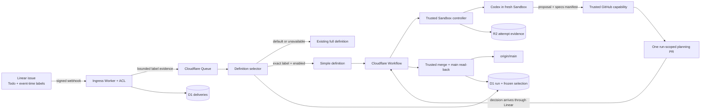
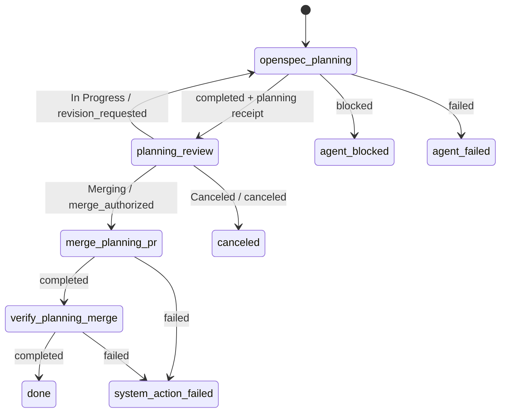

## Context

See `proposal.md` for motivation and the delta specifications for the approved
observable behavior. The current Worker bundles one full workflow from
`config/workflow.deos.yaml`, stores one default definition in
`project_workflow_policies`, and freezes that definition on each
`orchestration_runs` row before creating the Cloudflare Workflow instance.
Human gates currently interpret two global outcome groups, `approved` and
`rejected`; they cannot express the simplified planning gate's distinct revise,
merge, and cancel decisions.

The ingress Worker already verifies the exact Linear request body, translates it
through the Python anti-corruption layer, records the delivery in D1, and sends a
canonical event to Queue. That canonical event does not yet carry label evidence.
The Queue consumer therefore has no immutable basis for label-selected dispatch.
A later Linear read would observe mutable current state and is not acceptable as
selection evidence for the accepted `Todo` event.

Sandbox attempts already run behind a trusted controller that prepares a fresh
checkout, writes the service-authored prompt, collects bounded outputs, stores
attempt evidence in R2, and exposes credentialless provider capabilities. The
current GitHub publication path uses one branch per attempt. The simplified
workflow needs isolated attempts but one durable planning branch and pull request
per run so that human-requested revisions update the same review surface.

The provider boundaries remain authoritative: Linear originates signed start and
decision events, D1 owns business state and the frozen definition, Cloudflare
Workflow owns durable orchestration, GitHub owns the pull request and merge, and
R2 owns attempt evidence. The new selector remains disabled until implementation,
deployment, and a separately authorized provider-originated canary are ready.

## Goals / Non-Goals

**Goals:**

- Preserve bounded label membership from the authenticated start event before
  Queue dispatch and freeze the resulting selection on the run.
- Register the existing full definition and a separate immutable `simple`
  definition without changing existing or historical runs.
- Give each initial planning attempt and revision the same remote branch and pull
  request while retaining a fresh isolated Sandbox attempt.
- Restrict the agent to one OpenSpec change containing only its scaffold,
  proposal, and required delta specifications.
- Keep Linear transitions, pull-request merge, and default-branch verification
  in trusted workflow-owned actions.

**Non-Goals:**

- Generalize label selectors into an end-user rules engine or settings UI.
- Generate a design, tasks, runtime implementation, archive, or release artifacts
  inside the simplified planning workflow.
- Replace the current full workflow, rewrite frozen definitions, or migrate the
  Sandbox SDK package line.
- Treat local tests, fixtures, or synthetic ingress as provider-originated proof.

## Component diagram

## Decisions

### 1. Translate webhook labels into bounded event-time evidence

The Python ACL will add a provider-neutral `label_selection_evidence` value to
`ApplicationEvent`. It has two states:

- `available`, with sorted, unique Linear label identities and exact label names
  obtained from the authenticated issue payload; or
- `unavailable`, with no inferred membership.

The adapter will accept only the label representation established by Linear's
primary contract and a captured provider-originated issue event. Unexpected,
partial, or malformed label data becomes `unavailable`; it never becomes an
empty, authoritative label set. The adapter does not query Linear after ingress,
because that could observe labels changed after the accepted `Todo` event.

Ingress writes the bounded canonical evidence and its digest with the D1 delivery
record before enqueueing the same canonical value. It does not persist arbitrary
webhook fields. The Queue consumer verifies that the queued evidence digest
matches the delivery record before it can select a non-default definition.

Alternative considered: read the issue's current labels through GraphQL during
Queue consumption. That read is authenticated but temporally wrong: retries or
queue delay could select from a later label state and violate event-time
determinism.

### 2. Select from an inactive, repository-scoped definition registry

`workflow-bundle.ts` will expose an immutable registry containing the existing
full definition and the new `simple` definition. The existing full definition
remains the project default. A new D1 selector row is scoped by project,
repository, exact label name, and target definition identity. Registration is
idempotent and creates the selector disabled; it cannot overwrite another digest
for an existing definition version.

For a new accepted start event, the Queue consumer selects `simple` only when all
of these facts are true:

1. the event is the configured `Todo` transition;
2. its verified event-time evidence is `available` and contains the exact
   `simple-workflow` label;
3. the selector is enabled for the event's project and configured repository;
4. the target definition name, version, and digest resolve to the registered
   immutable snapshot.

Every other case selects the existing full definition and records a bounded
reason such as `label_absent`, `label_evidence_unavailable`, or
`selector_disabled`. Selection occurs before run allocation. The run freezes the
definition identity, source delivery, evidence digest, selector value, and
selection reason. Queue redelivery reconciles the stable issue-run identity and
never re-evaluates labels or creates a second Workflow instance.

Alternative considered: add a second mutable default to
`project_workflow_policies`. A mutable default would make unlabeled issues and
existing dispatch assumptions ambiguous; an independently disabled selector
keeps the current behavior explicit.

### 3. Encode a small graph with per-gate Linear decisions

The separately versioned `simple` definition contains one agent node, one human
gate, two trusted GitHub actions, and explicit terminal failures:

`human_gate` nodes gain an optional `decisions` map from bounded workflow outcomes
to exact Linear state names. A definition without this map retains the current
global `approved` and `rejected` behavior, preserving the full and historical
definitions. For a mapped gate, a valid decision must depart the exact active
`Human Review` state, carry a stable actor id with Linear actor type `user`, and
match one configured destination. Linear's own project permissions remain the
authorization boundary for those users. Bot, integration, unknown-actor, and
unmapped transitions select no business edge and invoke the existing
visit-scoped restore-to-`Human Review` policy.

Alternative considered: add `Merging` to the global approved-state list. That
would collapse revision and merge into the same outcome and could authorize the
wrong edge in another definition.

### 4. Separate attempt identity from planning work-product identity

Every Sandbox attempt keeps its isolated checkout and attempt identity. The
trusted service separately allocates one remote branch for the run,
`deos/planning/<stable-run-digest>`, and records it in `run_work_products`. The
first successful publication creates one ready-for-review pull request to
`main`. A revision attempt receives the durable prior patch, prior result,
recorded branch and pull-request identity, and bounded Linear and GitHub feedback.
It publishes a new complete manifest to that same branch and pull request.

The GitHub adapter creates one commit from the complete allowed manifest and
moves the remote branch with an expected-old-head check. A revision removes
stale files only inside the exact OpenSpec change directory. Ambiguous responses
are reconciled by repository, branch, pull-request database id, and head SHA
before retry. The adapter never creates a replacement pull request merely because
a prior Sandbox no longer exists.

`run_work_products` stores the GitHub database id separately from the human pull
request number, along with repository, base, remote branch, current head SHA,
manifest digest, latest publication operation, merge SHA, and verification time.

Alternative considered: publish directly from each attempt branch. That would
make every revision produce a different head and would break the approved
same-pull-request loop.

### 5. Add a proposal-and-specification-only GitHub capability

The planning job declares `github.publish_planning_work_product` as its sole
provider capability. Both the signed attempt grant and the trusted router enforce
that action. The service supplies the repository, base branch, run-scoped remote
branch, and OpenSpec change identity; the agent cannot choose them.

The complete manifest may contain only:

- the named change's required `.openspec.yaml` scaffold;
- `proposal.md`; and
- one or more `specs/**/spec.md` files beneath that same change.

The adapter rejects `design.md`, `tasks.md`, canonical specs, archive paths,
runtime code, workflow configuration, absolute paths, traversal, symlinks, and
files belonging to another change. A completed outcome additionally requires
strict validation evidence plus a successful or reconciled GitHub receipt whose
head tree exactly matches the manifest digest. The pull-request body links the
Linear issue and OpenSpec change, lists the review order, and reports the exact
planning validation. Provider text is treated as untrusted task data and cannot
expand the capability or file allowlist.

The logical operation key is `planning-publish-<attempt-id>`. Retries of the same
attempt reconcile that operation; a later human-requested revision has a fresh
attempt and operation but updates the same work product.

Alternative considered: reuse the generic `publish_work_product` capability. Its
attempt-scoped branch and broad file contract cannot enforce this workflow's
review boundary.

### 6. Version and preserve the exact planning prompt

The static prompt is stored as `config/prompts/openspec-planning.md` and included
in the immutable definition digest. It directs the agent to:

1. use only the service-authored change identity;
2. inspect status and artifact instructions;
3. create or coherently revise proposal and every required delta specification
   in dependency order;
4. validate the named change;
5. publish the complete allowed manifest once through the declared capability;
6. never create design, tasks, runtime changes, Linear transitions, approvals,
   review resolutions, or merges.

The trusted controller appends the run, node, visit, attempt, deadline, change
identity, branch and pull-request identity, bounded issue and feedback data, and
required output contract. It stores the exact rendered prompt and SHA-256 digest
as protected R2 evidence before starting Codex. The Sandbox cannot replace that
service-authored copy.

A deterministic controller test renders the first-visit prompt with fixed ids and
asserts the complete content, prompt digest, allowed action, proposal/specification
file boundary, and absence of design, task, generic provider, Linear-transition,
or merge authority. The implementation PR will expose that rendered first prompt
for human inspection before any live selector activation.

Alternative considered: adapt the generic one-artifact-at-a-time OpenSpec prompt
at runtime. Runtime composition would make the security boundary harder to audit
and would not prove the exact first prompt that Codex received.

### 7. Keep merge and default-branch verification as trusted system actions

`github.merge_planning_pull_request` reads the recorded work product and verifies
repository, base `main`, exact remote branch, expected head SHA, manifest digest,
and current GitHub merge policy before requesting a merge. A visit-scoped
operation identity makes the action idempotent. If the response is lost, the
service reads back the same pull request before retrying. A closed-unmerged pull
request, changed base or head, conflict, or policy rejection produces a bounded
non-success result and never substitutes another pull request.

`github.verify_planning_merge` independently reads the merged pull request and
the recorded merge commit on `origin/main`, fetches every approved manifest path,
rejects forbidden planning paths, recomputes the manifest digest, and records a
separate receipt. The workflow reaches `done` only when the merge and verification
receipts both exist and match the frozen work product. GitHub credentials and raw
provider responses stay inside the trusted Worker boundary.

Alternative considered: allow the planning agent to merge after the issue enters
`Merging`. That would give an untrusted process workflow-state authority and
would not independently prove which reviewed head reached `main`.

## Event flow

1. A human attaches `simple-workflow` to a configured Linear test issue before
   moving it to `Todo`.
2. Ingress authenticates the exact Linear body, translates bounded event-time
   label evidence, records the delivery and evidence digest in D1, enqueues the
   canonical event, and returns `200`.
3. The Queue consumer verifies the delivery evidence, reads the repository-scoped
   selector, chooses `simple` only for an enabled exact match, and otherwise
   chooses the full default. It freezes the selection before creating the stable
   Workflow instance.
4. `openspec_planning` allocates a fresh attempt. The controller restores durable
   prior context when present, stores the rendered prompt evidence, and starts
   Codex in Sandbox.
5. Codex creates or revises only the proposal and required delta specifications,
   validates them, and calls `publish_planning_work_product`. The trusted adapter
   updates the run-scoped branch and one pull request and records the receipt.
6. Only after artifact, result, validation, manifest, and provider-receipt checks
   succeed does the Workflow move the issue to `Human Review`.
7. `In Progress` dispatches a fresh revision attempt for the same pull request;
   `Canceled` terminates without merge; `Merging` invokes the trusted merge path.
8. The verification action proves the approved planning manifest at the recorded
   `main` commit before D1 records the run as succeeded.

## Minimal data model

| Record | Added or authoritative fields | Purpose |
| --- | --- | --- |
| `deliveries` | bounded `label_evidence_json` and `label_evidence_digest` | Preserves authenticated event-time label evidence before Queue dispatch without storing arbitrary provider payload fields. |
| `workflow_definitions` | existing immutable `(definition_id, version, digest, canonical_json)` | Stores the full and `simple` snapshots without mutation. |
| `workflow_definition_selectors` | project, repository, exact label name, target definition identity, `enabled`, timestamps | Holds the independently toggled selector; initial registration is disabled. |
| `orchestration_runs` | existing frozen definition plus selection kind, value, reason, source delivery, and evidence digest | Proves why one immutable definition was selected for the run. |
| `run_work_products` | run, repository, remote branch, PR database id and number/URL, base, head SHA, manifest digest, latest publication operation, merge SHA, verification time | Gives revisions, merge, and read-back one durable pull-request identity. |
| `provider_operations` | existing capability, action, request digest, state, resource, and reconciliation fields | Records planning publication, trusted merge, and trusted verification receipts. |
| `agent_attempts`, manifests, and R2 objects | existing attempt identity plus protected rendered-prompt reference and digest | Preserves each isolated attempt and the exact service-authored prompt it received. |

All schema changes are additive. Selector and work-product records reference
existing projects, definitions, and runs. No migration rewrites frozen definitions
or historical run state.

## Failure modes

| Failure | Required behavior |
| --- | --- |
| Webhook label fields are absent, malformed, or not yet provider-proven | Record `unavailable`, select the existing full definition, and never read current labels as a substitute. |
| Queue evidence differs from the stored delivery digest | Fail dispatch safely, record a bounded correlation error, and allocate no run from the unverified message. |
| Selector row is absent, mismatched, or disabled | Select and freeze the existing full definition with the exact fallback reason. |
| Definition registration collides on version with another digest | Fail registration before dispatch and never overwrite the immutable snapshot. |
| Queue redelivers after instance creation or D1 mapping ambiguity | Reconcile by stable issue-run and Workflow instance identities, reuse the frozen definition, and create no duplicate run. |
| Sandbox output is invalid, incomplete, or contains a forbidden path | Reject completion, retain failed evidence, and do not enter `Human Review`. |
| GitHub publication times out or the branch update response is lost | Reconcile the operation, exact branch, PR identity, head SHA, and manifest digest before retry. |
| A revision conflicts with newer `main` | Return blocked with durable conflict evidence and do not create another branch or pull request. |
| Human leaves `Human Review` through an unmapped state or non-user actor | Record the event, select no business edge, and restore or retain the visit-scoped gate. |
| Merge base/head differs or GitHub rejects policy checks | Keep the run non-successful and require reconciliation; do not merge a substituted head. |
| GitHub reports merged but `main` does not match the approved manifest | Record verification failure and do not mark the run succeeded. |
| Sandbox cleanup or evidence persistence fails | Preserve the non-success outcome under existing controller policy; the graph cannot enter review or success. |

## Risks / Trade-offs

- [Linear can change or omit label representation in webhook payloads] → Parse
  only provider-proven fields, treat every unknown shape as unavailable, and
  require a real captured start event before enabling the selector.
- [Safe fallback can send an intended simple issue through the full workflow] →
  Record an explicit fallback reason and surface it in operator evidence; never
  trade determinism for a mutable label read.
- [A specialized publication action adds adapter surface] → Keep the action
  limited to one change directory and reuse existing grant, receipt, and
  reconciliation machinery.
- [A complete manifest update may delete a renamed or removed delta] → Compare
  only the exact change subtree, perform one expected-head commit, and reject any
  deletion outside the allowlist.
- [Per-gate decisions add definition schema complexity] → Make the map optional
  and preserve the current global behavior for all definitions without it.
- [New commits on `main` can make a revision conflict] → Stop with durable
  evidence instead of silently rebasing or replacing the pull request.
- [Provider API behavior can drift] → Verify current Linear and GitHub primary
  contracts during implementation and retain provider-originated canary evidence.

## Migration Plan

1. Add the bounded delivery evidence, selector, frozen selection, work-product,
   and prompt-evidence fields or tables through an additive D1 migration; verify
   local and remote schema read-back.
2. Add the definition registry, `simple` graph, per-gate decisions, exact prompt
   bundle, planning capability, durable work-product identity, trusted merge, and
   verification paths with the selector still disabled.
3. Validate definition digests, event translation, Queue retry reconciliation,
   forbidden-path rejection, same-PR revision, merge read-back, and preservation
   of the current full definition. Publish the exact rendered first prompt in the
   implementation evidence.
4. Deploy code and migration with the full workflow still selected by default;
   confirm existing and historical runs restore their frozen definitions.
5. Only after separate human authorization, enable the selector for one controlled
   project and repository and trigger a real Linear issue with the label attached
   before its `Todo` transition.
6. Capture visual Linear and GitHub proof plus D1 delivery, selection, run,
   publication, decision, merge, and `origin/main` verification records. Synthetic
   ingress may supplement diagnosis but cannot replace this provider-originated
   path.
7. Disable the selector after the canary unless continued activation is separately
   authorized. Rollback is immediate selector disablement followed by code rollback
   if required; additive schema and immutable evidence remain for audit.
