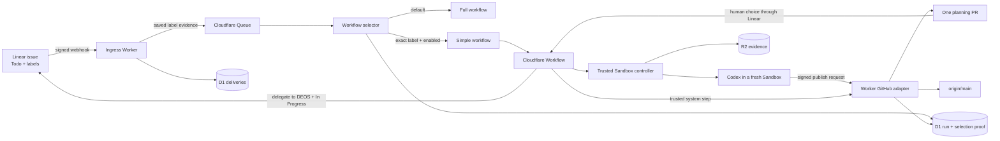
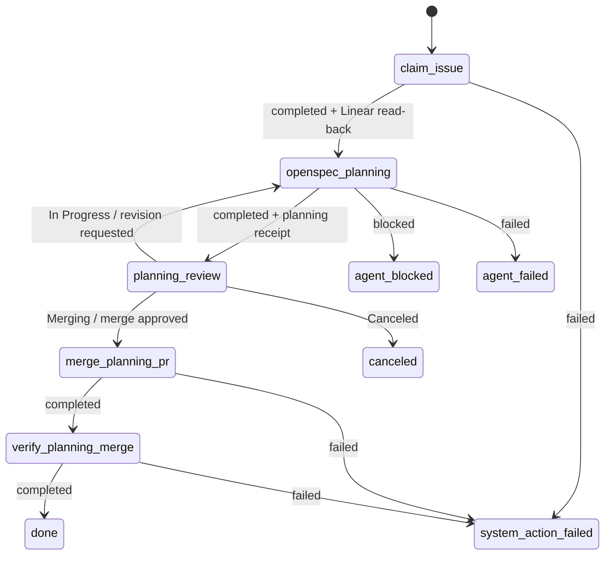

## Context

See `proposal.md` for why this change is needed. The delta specs define the
required behavior.

Today, DEOS has one full workflow. It comes from
`config/workflow.deos.yaml`. Each run stores the workflow name, version, and
hash in D1. This keeps the workflow fixed after a run starts.

Human gates have two global choices today: `approved` and `rejected`. The simple
flow needs three choices. A person can ask for a revision, approve a merge, or
cancel the run.

The ingress Worker already checks the signed Linear request. It saves the
delivery in D1 and sends a smaller event to Queue. That event does not include
label evidence yet. A later Linear read is not safe for this choice. The labels
may have changed while the event waited in Queue.

Each Sandbox run already gets a fresh checkout and a trusted prompt. The
controller saves its output in R2. It also gives the agent safe tools for GitHub
and Linear. Today, each attempt uses a new GitHub branch. Revisions need a fresh
Sandbox but must update the same branch and pull request.

The new selector will start disabled. It stays disabled until the code is
deployed and a live trial is approved.

## Goals / Non-Goals

**Goals:**

- Save label evidence from the signed Linear start event.
- Choose the simple flow only for the exact label and an enabled selector.
- Keep the current full flow as the default.
- Keep Backlog human-owned, then let the simple Workflow delegate and start work after a person moves an eligible issue to Todo.
- Reuse one branch and pull request for all planning revisions in a run.
- Limit the agent to the OpenSpec proposal and delta specs.
- Keep Linear moves, pull request merge, and final checks under DEOS control.
- Let one authenticated operator save the project repository and guarded workflow controls in D1 when no run is active.

**Non-Goals:**

- Build a general rules editor or edit the repository during an active run.
- Create design, tasks, code, archive, or release files in the simple flow.
- Replace the full workflow or change old runs.
- Change the Sandbox SDK version.
- Use local tests as proof of a live provider flow.

## Component diagram

## Decisions

### 1. Save labels from the signed webhook

The Python ACL will add `label_selection_evidence` to `ApplicationEvent`. It has
two states:

- `available`: a sorted list of exact Linear label names and ids.
- `unavailable`: the payload did not give safe label evidence.

The ACL reads labels only after it checks the webhook signature. It accepts only
the shape shown by Linear's current contract and a real Linear event. Missing or
broken label data becomes `unavailable`. Missing data does not mean that the
issue had no labels.

Ingress saves the limited evidence and its hash with the delivery record. Then
it adds the same value to the queue. It skips extra webhook data. The queue
worker checks that the hash matches the record. Only then can it pick a
non-default workflow.

We will not read current labels through GraphQL during Queue work. That read may
happen after the labels changed. It would no longer describe the accepted
`Todo` event.

### 2. Keep the simple selector separate and off by default

The workflows will stay in separate YAML files. The current full workflow stays
in `config/workflow.deos.yaml`. The simple workflow gets its own file at
`config/workflow.simple.yaml`.

`workflow-bundle.ts` will not define either workflow in TypeScript. It will load
both YAML files and build the fixed registry with their prompts and schemas. The
full workflow stays the default.

A new D1 row will hold the simple selector. It records the project, repository,
exact label, target workflow, and enabled state. Setup creates this row with the
selector off. It cannot replace a saved workflow version with different content.

The Queue worker picks `simple` only when all four checks pass:

1. The event moves the issue to `Todo`.
2. The saved evidence contains the exact `simple-workflow` label.
3. The selector is on for this project and repository.
4. The saved workflow name, version, and hash match the registry.

All other start events use the full workflow. D1 records why. The reason may be
`label_absent`, `label_evidence_unavailable`, or `selector_disabled`.

The worker makes this choice before it creates the run. The run saves the chosen
workflow, source delivery, evidence hash, label, and reason. A Queue retry reuses
that choice. It does not check labels again or create a second Workflow instance.

We will not add a second default to `project_workflow_policies`. Two defaults
would make unlabeled issues unclear. A separate selector keeps the current rule
simple.

### 3. Delegate and start work before the Sandbox

The simple definition starts with `claim_issue`, a trusted system action. It
reads the issue through Linear, preserves any human assignee, sets the DEOS app
user as the delegate, and moves the issue from `Todo` to `In Progress` in one
bounded update. It reads the issue again before it reports success.

The action has one stable D1 provider-operation id for the run visit. A replay
first reads the current delegate and state. Matching values reconcile without a
new update. A different delegate or a human state change fails safely and stops
the planning agent.

We use Linear's `delegateId`, not `assigneeId`. This keeps a person responsible
for the issue while the DEOS agent works on their behalf.

### 4. Add three clear choices at the planning gate

The `simple` workflow has one agent step and one human gate. DEOS owns the merge
and final check.

A `human_gate` may have a `decisions` map. It links a workflow result to an exact
Linear state. Workflows without this map keep the current `approved` and
`rejected` rules. This protects the full workflow and old saved versions.

For the simple gate, the event must leave the active `Human Review` state. The
actor must have a Linear user id and actor type `user`. Linear permissions decide
which users may move the issue. A bot, app, unknown actor, or unknown state picks
no edge. DEOS records the event and returns the issue to `Human Review`.

We will not treat `Merging` as a global approval state. That could approve the
wrong action in another workflow.

### 5. Reuse one planning pull request

Each Sandbox attempt stays separate. DEOS also creates one remote branch for the
run: `deos/planning/<run-hash>`. D1 saves this branch and its pull request in
`run_work_products`.

The first successful attempt creates a ready pull request to `main`. A revision
gets the prior patch, result, branch, pull request, and limited human feedback.
It updates the same branch and pull request.

Each revision also replies to every affected human review thread. The reply says
what changed or why no change was made. The trusted GitHub action posts each
reply with an action marker, checks it by read-back, and does not expose a thread
resolution action. A retry finds the marker and does not post the reply twice.

The GitHub tool creates one commit from the full allowed file list. It updates
the branch only when the old head matches. A revision may remove old files only
inside the named OpenSpec change folder.

If a GitHub response is unclear, DEOS reads the branch and pull request again.
It checks the repository, pull request id, branch, head, and file hash before it
retries. It does not create a new pull request because a Sandbox was removed.

D1 stores the GitHub id and pull request number as separate values. It also
stores the repository, base, branch, head, file hash, last publish action, merge
commit, and check time.

We will not publish from each Sandbox branch. That would create a new review
surface for every revision.

### 6. Give the agent one narrow GitHub action

The planning job may call only `github.publish_planning_work_product`. The job
grant and the trusted router both check this rule. DEOS supplies the repository,
base branch, planning branch, and OpenSpec change name.

The file list may contain only:

- the change's required `.openspec.yaml` file;
- `proposal.md`; and
- one or more `specs/**/spec.md` files in the same change.

The tool rejects `design.md`, `tasks.md`, main specs, archive files, code,
workflow files, unsafe paths, links, and files from another change.

Success needs four things. The OpenSpec check must pass. Each reviewer-facing
file must pass the readability check. GitHub must return a saved or reconciled
receipt. The branch contents must match the full file list.

The pull request links the Linear issue and OpenSpec change. It also lists the
reading order and exact checks. Text from Linear or GitHub is input data. It
cannot widen the file list or tool access.

Each attempt uses `planning-publish-<attempt-id>` as its action key. A retry of
the same attempt reuses that key. A later revision has a new key but updates the
same pull request.

When the trusted router denies a planning request, it returns and records one
bounded rule category. The category can identify the request shape, file list,
body, copied Linear text, readability, or validation evidence. It does not copy
the request body or provider reply into D1 or telemetry.

We will not reuse the broad `publish_work_product` action. Its file and branch
rules are too wide for this flow.

### 7. Save the exact prompt that the agent receives

The fixed prompt will live in `config/prompts/openspec-planning.md`. Its text is
part of the workflow hash. It tells the agent to:

1. Use only the OpenSpec change name supplied by DEOS.
2. Read OpenSpec status and instructions.
3. Create or revise the proposal and all needed delta specs.
4. Run the strict OpenSpec check.
5. Check the full proposal, each delta spec, and the pull request text for clear
   language.
6. Publish the full allowed file list through the one GitHub action.
7. Never create design, tasks, code, Linear moves, approvals, review resolutions,
   or merges.

Clear language is the default, not a final cleanup step. The agent uses short
sentences, plain verbs, and one idea per sentence. It keeps exact technical names
when they matter and explains them in simple words.

The agent checks each reviewer-facing Markdown file as a whole. The checker
ignores headings, code blocks, diagrams, URLs, ids, and file paths. Each file
must have a Flesch Reading Ease score of at least 70 and a Flesch-Kincaid grade
of 8 or lower. A score above 80 still passes because easier text is welcome.

The agent records the command and score for every file in `validation.txt`. The
trusted GitHub tool runs the same check before it writes anything. A failed score
blocks publication. The agent must not weaken a requirement to improve a score.
If plain wording would change the meaning, it returns `blocked` and explains the
conflict.

The controller adds trusted run details to the prompt. These include the run,
step, visit, attempt, deadline, branch, pull request, issue data, and feedback.
It saves the exact final prompt and its hash in R2 before Codex starts. The
Sandbox cannot replace this copy.

A fixed test will render the first prompt with known ids. It will check the full
text, hash, allowed action, and allowed files. It will also check that the prompt
gives no power to move Linear or merge GitHub work. Separate tests cover the
readability limits, whole-file scoring, easier-than-target text, and meaning-safe
failure behavior.

The implementation pull request will show this exact first prompt. The selector
will stay off until that prompt is reviewed.

We will not build this prompt from the general OpenSpec prompt at runtime. A
fixed prompt is easier to review and prove.

### 8. Let DEOS merge and check the approved work

Cloudflare Workflow runs Worker code. It can call an external API inside a
durable `step.do` step. For these system actions, the Workflow calls the DEOS
GitHub adapter directly inside the Worker.

The adapter gets a short-lived GitHub App token and uses HTTPS requests to the
GitHub API. It does not start a Sandbox or run the `gh` command. GitHub secrets
stay in the Worker. Sandbox is used only for Codex agent steps.

The agent publish path and the system action path reuse the same GitHub client.
The agent reaches it through a signed, narrow capability. The Workflow reaches
it as trusted Worker code. Each path records its own D1 provider operation and
receipt.

`github.merge_planning_pull_request` reads the saved work record. It checks the
repository, base `main`, branch, expected head, file hash, and GitHub merge rules.
Then it asks GitHub to merge.

The action has a stable key for this visit. If the response is lost, DEOS reads
the same pull request before it retries. It stops if the pull request is closed,
uses another base or head, has a conflict, or fails a required check.

`github.verify_planning_merge` performs a separate check. It reads the merge
commit from `origin/main`. Then it reads every approved planning file and builds
the file hash again. It also confirms that no forbidden planning file was added.

The run ends as successful only when both actions have matching receipts. GitHub
credentials and raw replies stay inside the trusted Worker.

The agent will not merge the pull request. An agent result is not human approval.

### 9. Preserve terminal evidence before Sandbox cleanup

The supervisor captures Codex JSONL in a private temporary file. After Codex
stops, it replaces `transcript.jsonl` with that trusted stream. The prompt tells
the agent not to write the transcript, patch, provider references, or status.
This keeps an agent write from truncating the audit record. The supervisor also
captures stderr and uses it as `validation.txt` only when the agent did not
write its own validation record. It writes bounded exit data to `status.json`.
It captures the repository patch and sanitized provider references after Codex
stops even when Codex exits with a non-zero status.

The controller treats terminal evidence collection as a required step before
cleanup. It inspects the allowlisted output names, stores every available
policy-safe file, and creates a trusted `failure-summary.json`. The summary
lists stored, absent, and policy-rejected file names and derives only a bounded
safe category such as `codex_exit_nonzero`, `codex_terminated`, or
`supervisor_failed`. It never copies raw error text into D1 or telemetry.

Failure manifests are complete evidence snapshots even though their agent
attempts remain failed. D1 links the failed attempt to that manifest. R2 keeps
the immutable objects under the attempt prefix. A failed R2 or manifest write
stops cleanup and leaves the Sandbox recoverable for a Workflow retry. Once the
manifest is verified, the controller records the terminal attempt, destroys the
Sandbox, verifies the manifest again, and emits the failed attempt category.

Interrupted work is stopped before collection so the supervisor can flush its
files. The controller waits briefly for exit, escalates termination only when
needed, and then follows the same evidence-first path. Missing files are facts,
not collection failures. Unsafe files are omitted with a policy-rejected entry
in the trusted summary so credentials are never persisted as artifacts.

### 10. Keep repository permission and selection separate

GitHub App installation settings decide which repositories the DEOS App may
use. The portal does not hold GitHub credentials and cannot widen that access.

D1 stores the exact `owner/name` repository for the Linear project. The deploy
value seeds a new policy only. Scheduled setup preserves later portal changes.
Queue selection, Sandbox checkout, and GitHub grants read the D1 value.

The settings page is behind the existing Cloudflare Access check. It shows the
saved repository, workflow dispatch, simple selector, revisions, and last
editors. Repository and workflow controls have separate revisions. A control
save writes both switches in one D1 batch and reads them back. It is all or
nothing for a current revision. A repository save turns dispatch and every
simple selector for the project off.

The active-run check is part of each guarded D1 update, not only a page check.
The portal rejects a save if another session changed that kind of setting or a
run started first. This keeps settings fixed for work already in flight without
changing old runs. GitHub access is granted in GitHub and proved there before a
test starts.

## Event flow

1. A person adds `simple-workflow` to a test issue. They do this before moving
   the issue to `Todo`.
2. Ingress checks the Linear signature. It saves the delivery and label evidence
   in D1, sends the event to Queue, and returns `200`.
3. The Queue worker checks the saved evidence. It picks `simple` only for an
   enabled exact match. Otherwise, it picks the full workflow. It saves the
   choice before it creates the Workflow instance.
4. The Workflow keeps the human assignee, delegates the issue to the DEOS app,
   moves it to `In Progress`, and reads both values back from Linear.
5. `openspec_planning` starts a fresh Sandbox. The controller restores prior
   work when needed. It saves the final prompt before Codex starts.
6. Codex creates or revises only the proposal and delta specs. It checks them and
   calls the narrow GitHub action. That action updates the run's branch and pull
   request.
7. DEOS checks the artifacts, result, file list, and GitHub receipt. Only then
   does it move the issue to `Human Review`.
8. `In Progress` starts a revision on the same pull request. `Canceled` ends the
   run. `Merging` starts the trusted merge.
9. DEOS checks the approved files on `main`. Only then does D1 mark the run as
   successful.

## Minimal data model

| Record | Saved data | Why |
| --- | --- | --- |
| `deliveries` | Limited label evidence and its hash. | Proves what the signed start event said before Queue work. |
| `workflow_definitions` | Existing fixed workflow id, version, hash, and JSON. | Stores both full and simple workflows without changing them. |
| `workflow_definition_selectors` | Project, repository, label, target workflow, enabled state, and times. | Holds the simple selector. It starts off. |
| `project_workflow_policies` | Existing policy plus separate repository and workflow-control revisions and editors. | Makes D1 the settings source after first setup. |
| `orchestration_runs` | Existing workflow fields plus the label, reason, source delivery, and evidence hash. | Proves why this run chose its workflow. |
| `run_work_products` | Run, repository, branch, pull request ids, base, head, file hash, publish action, merge commit, and check time. | Gives every revision one pull request. |
| `provider_operations` | Existing action, request hash, state, resource, and retry data. | Records publish, merge, and final check receipts. |
| `agent_attempts`, manifests, and R2 | Existing attempt data plus the saved prompt and hash. | Proves what each fresh Sandbox received and returned. |

All database changes add new data. They do not rewrite old workflows or runs.

## Failure modes

| Failure | Response |
| --- | --- |
| Label data is missing, broken, or not yet proven with Linear. | Save `unavailable` and use the full workflow. Do not read current labels. |
| Queue evidence does not match the D1 hash. | Stop dispatch, record the error, and create no run from that message. |
| The selector is missing, off, or for another repository. | Use the full workflow and save the reason. |
| A settings save has an old revision or an active run exists. | Reject the whole save and keep the current settings. |
| A workflow version already has another hash. | Stop setup. Never replace the saved workflow. |
| Queue retries after an unclear create result. | Find the run and Workflow by stable id. Do not create a second one. |
| Sandbox output is missing, invalid, or contains a blocked path. | Save every available policy-safe file plus a bounded failure summary. Do not enter `Human Review`. |
| A proposal, spec, or pull request text fails the readability limits. | Return it for a full rewrite. Do not publish partial wording fixes. |
| A GitHub publish result is unclear. | Read the same branch and pull request before retrying. |
| A revision conflicts with new work on `main`. | Stop with conflict evidence. Do not open another pull request. |
| A bot or unknown state moves the issue from `Human Review`. | Record it, pick no edge, and return the issue to the gate. |
| The Todo claim finds another delegate or a newer human state. | Record the conflict and stop before the planning agent. |
| GitHub changed the saved base or head, or required checks fail. | Do not merge. Mark the action for repair. |
| GitHub says merged, but the files on `main` do not match. | Keep the run open for repair. Do not report success. |
| Terminal evidence storage fails. | Keep the Sandbox recoverable and retry collection. Do not clean up or enter review. |
| Sandbox cleanup fails after evidence is verified. | Keep the attempt unsuccessful with its durable manifest and require cleanup reconciliation. |

## Risks / Trade-offs

- [Linear may change or omit label data] → Accept only a proven shape. Use the
  full workflow when the evidence is unclear. Test a real event before enabling
  the selector.
- [Safe fallback may run the full flow by mistake] → Save and show the exact
  fallback reason. Do not trade a clear audit trail for a later label read.
- [The new GitHub action adds more code] → Keep it limited to one OpenSpec change
  and reuse the current grant, receipt, and retry code.
- [A full file list can remove an old delta spec] → Limit removal to the named
  change folder. Update the branch only from the expected old head.
- [Each gate can now map its own choices] → Keep this map optional. Old workflows
  keep their current rules.
- [New work on `main` may block a revision] → Stop and show the conflict. Do not
  hide it with a new branch or pull request.
- [Provider APIs may change] → Check current Linear and GitHub contracts during
  implementation. Keep real provider proof for the live trial.
- [A score may reward short but awkward text] → Score the whole file, keep human
  review as the final check, and never trade exact meaning for a better number.

## Migration Plan

1. Add the D1 fields and tables for label evidence, selectors, saved choices,
   pull requests, and prompt proof. Check the schema locally and after deploy.
2. Add the simple workflow in its own YAML file. Add the registry, gate choices,
   fixed prompt, narrow GitHub action, saved pull request, merge action, and final
   check. Keep the selector off.
3. Test workflow hashes, label parsing, Queue retries, blocked paths, same-pull-
   request revisions, readability checks, merge checks, and the unchanged full
   workflow. Show the exact first prompt in the implementation pull request.
4. Deploy the code and database change. Confirm that the full workflow stays the
   default. Confirm that old runs keep their saved workflow.
5. After separate approval, enable the selector for one project and repository.
   Trigger a real Linear issue with the label added before `Todo`.
6. Save screenshots from Linear and GitHub. Save D1 proof for the delivery,
   choice, run, publish, decision, merge, and final file check. Synthetic requests
   may help debug, but they do not replace this live proof.
7. Turn the selector off after the trial unless continued use is approved. If
   needed, roll back the code. Keep the added data and evidence for audit.
