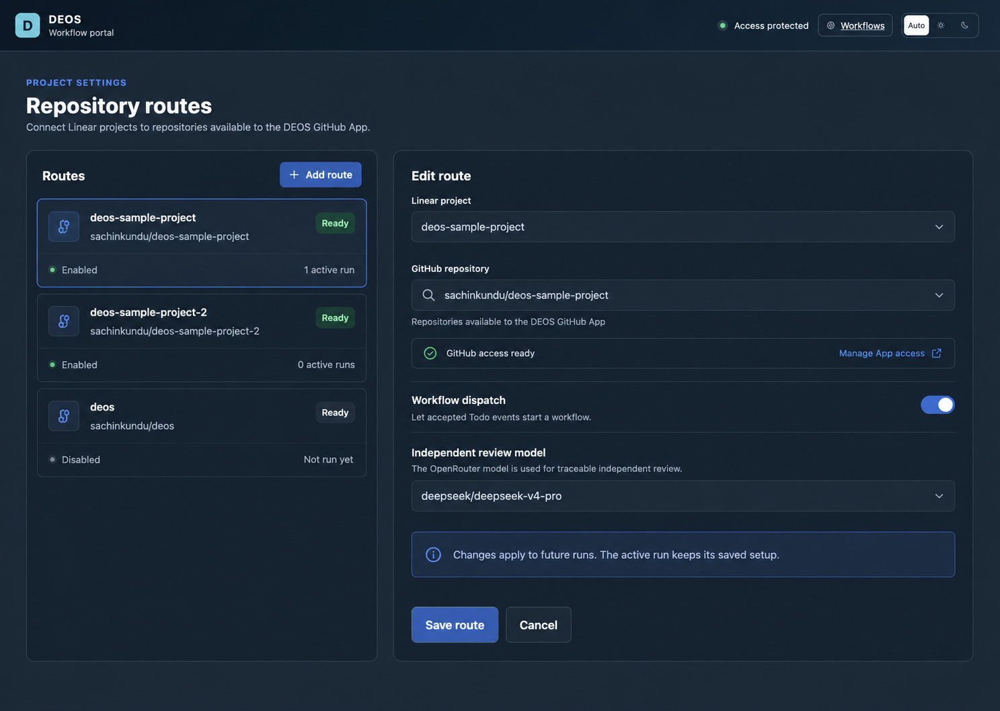
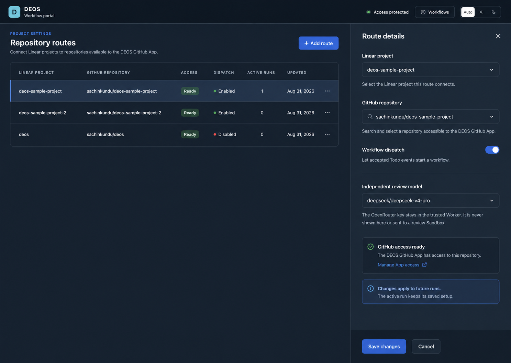
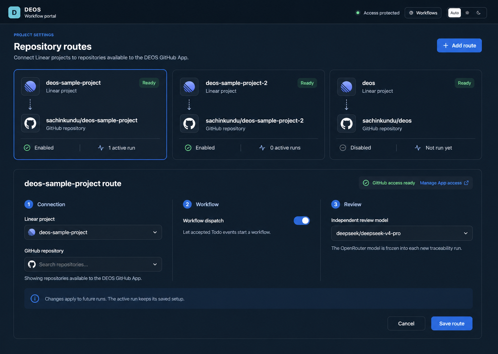
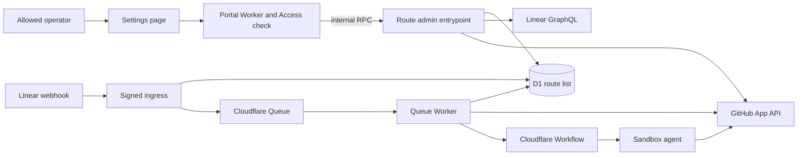

## Context

See `proposal.md` for the reason for this change.

DEOS can admit more than one Linear project at ingress. Most run rows also
store a project id. Yet three parts still use one fixed route:

- setup reads one Linear project and one GitHub repo;
- the portal edits one policy row; and
- GitHub calls use one App install id.

Here, a **route** joins one Linear project to one GitHub repo. A route also
holds its workflow and review controls. This change allows any number of such
routes.

The D1 policy table already has one row for each Linear project. We can use it
as the route list. This keeps current issue and run links intact. It also avoids
a second route id.

Some old runs may still be active during rollout. Their repo and provider scope
must not change.

GitHub grants App access outside DEOS. One DEOS App can have many installs.
Each install can expose many repos. DEOS may list that safe data with its App
identity. The portal must never get the App key, an App JWT, or a repo token.
The Settings page can use this list as the repo picker. It does not need one
GitHub login or token for each route.

## Goals / Non-Goals

**Goals:**

- Treat each project policy as one route.
- Manage all routes on the current Settings page.
- Add routes without a deploy.
- Keep provider secrets in the trusted queue Worker.
- Freeze all route data that can change a run's scope.
- Let any route change settings while active runs keep frozen data.
- Keep old runs and the sample route safe during rollout.

**Non-Goals:**

- Pick from many repos inside one Linear project.
- Add personal GitHub tokens.
- Add more than one DEOS GitHub App.
- Grant GitHub access from DEOS.
- Move an active run to a new route or workflow.
- Change the workflow graph or its human review rules.

## Decisions

### 1. Verify provider contracts and test resources first

Implementation starts by reading the current primary contracts. This includes
Linear project and webhook data, GitHub App installs, short-lived install
tokens, repo lists, rights, and Cloudflare Worker bindings.

Read-only live calls must then prove the real response shapes. They must also
show that the current Linear app and DEOS GitHub App can reach usable test
resources. The second sample project and repo must exist, and the App must have
access, before provider adapter code starts.

This keeps wire formats, time units, rights, paging, and errors grounded in the
providers. Tests can then model the observed contracts. A fake-first adapter
was rejected because passing tests would not prove the real provider shape.

### 2. Use the Linear project id as the route id

`project_workflow_policies` becomes the route list. Its `project_id` stays the
stable key. One row links one project to one repo and its controls.

Each row will also hold:

- the Linear project name;
- the GitHub App install id;
- one shared route revision; and
- a safe GitHub access result and check time.

The route revision rises after any change that can affect a new run. Existing
repo, workflow, and review revisions still guard each Settings card. The shared
revision guards events and run start.

Provider ids are the source of truth. Provider names are only labels.

A new audit table will keep each access check. It stores the route, repo,
install, permission digest, result, actor, and time. It stores no token and no
raw provider reply.

We considered a new route id. That could support many repos per project. It
would also need an issue-level route choice, which is out of scope.

We also ruled out a JSON route list and one D1 database per repo. Both would
make safe edits, joins, and audit work harder.

### 3. Freeze the full route on each new run

Ingress finds a route from the event's Linear project id. It reads only an
enabled route. The queued event carries the project id, route revision, and a
digest of all run-facing route data.

Dispatch compares that proof with D1, then checks live GitHub access. The final
run insert is one atomic D1 operation. It requires the route to still be on with
the same revision and digest. It also writes the frozen route snapshot.

If Settings changes the route during the GitHub check, the D1 guard fails. DEOS
records a safe stale-route result and starts no run or Sandbox.

A new run stores this data:

- route and project ids;
- repo and App install id;
- route revision;
- workflow definition and gate states;
- author settings; and
- review settings.

Job input, checkout, GitHub calls, and publish work use this frozen copy. A
later human event first finds the active run. It does not read new route values.

Before run start, the trusted GitHub adapter makes a short-lived token. It uses
only the saved App install. It checks the repo and all needed rights. If the
check fails, DEOS records a safe result and blocks new work on that route. It
does not start a run or Sandbox.

This live check is needed even after a Settings check. GitHub access may change
at any time. Reading current route data at each node was also rejected because
it would let an active run drift.

### 4. Keep workflow definitions global

Workflow definitions stay as fixed global snapshots. Scheduled setup loads the
bundle once. It saves each new definition once, then links it to every route.

That link step changes only the definition ref and digest. It keeps the route's
repo, install, controls, revisions, and active runs.

Deploy values seed the first route only when the route list is empty. After
that, D1 is the live source of truth. The deployed project list is not a live
allowlist.

This avoids a deploy for each route change. It also avoids duplicate workflow
snapshots.

### 5. Put provider lookup behind an internal entrypoint

The queue Worker exports a named route-admin entrypoint. The portal calls it
through an internal Worker binding. There is no public admin URL.

The portal first checks Cloudflare Access. It then sends the verified operator
email as small audit data. Access context does not cross the Worker binding.
The binding grants call access, and the entrypoint still checks every input.

The entrypoint owns route work that needs live provider data. It uses the
current Linear app token to list projects. It uses the GitHub App key to list
all installs. Short-lived install tokens list every repo and its rights. The
user can pair any listed repo with a Linear project.

Route enablement runs a fresh GitHub check in the same trusted call as the
guarded D1 save. A failed check cannot enable a route.

The portal gets only safe fields. These include names, ids, rights, status, and
a GitHub settings link. Saved routes stay visible when a provider is down.

We rejected secrets in the portal, a public admin API, and browser calls to the
providers. Each choice would widen the trust boundary.

### 6. Turn Settings into a route list and editor

The page loads saved routes first. The list shows each project, repo, workflow
state, GitHub access state, and active-run count.

An operator selects a route to open its current repo, workflow, and review
cards. **Add route** uses the live Linear and GitHub lists.

Each save uses that route's own revision. The user may save repo, workflow, or
review changes while a run is active. The save changes only later runs. The
active run keeps its frozen values.

A repo or install change turns dispatch off for that route. A new live GitHub
check must pass before the route can be enabled.

When access is missing, the page links to the App install settings on GitHub.
The operator changes access there, then uses **Recheck** in DEOS. DEOS does not
grant or remove GitHub access.

Routes stay in D1 when disabled. This change does not hard-delete a route that
may be named by old events, runs, or audit rows.

#### Settings layout concepts

These mockups explore the same route model in the current DEOS visual system.
Human review selected option 3, **Project connection cards**, for implementation.
The other two remain as design history.

1. **Rejected: Route rail and editor.** A compact route list stays visible beside the
   selected route form. This favors quick movement between a modest number of
   routes.

   

2. **Rejected: Route table and side sheet.** A dense comparison table opens the selected
   route in a side sheet. This favors scanning and managing many routes.

   

3. **Selected: Project connection cards.** Route cards show each
   Linear-to-GitHub pairing above one expanded editor. This makes the
   relationship easiest to see at a glance while keeping route controls on one
   page.

   

Each option shows GitHub App access, active-run state, and the rule that saved
changes affect future runs while active work keeps its frozen setup.

## Component Diagram

## Event Flow

1. Linear sends a signed issue event.
2. Ingress checks the raw request and finds the route in D1.
3. It accepts an unknown or disabled route with HTTP 200, but starts no work.
4. An enabled route adds its revision and digest to the queued event.
5. Dispatch compares that proof with a current D1 route candidate.
6. The GitHub adapter checks the App install, repo, and needed rights.
7. One D1 operation checks the same enabled revision and creates the run.
8. That same operation freezes the route values on the run.
9. All later nodes use that frozen data. Route edits affect only new runs.

## Minimal Data Model

| Record | Key | Main values |
| --- | --- | --- |
| Route | Linear project id | Project name, repo, App install, route revision, workflow and review controls, access state |
| Access check | Check id | Project id, repo, App install, rights digest, result, actor, time |
| Queued event | Linear delivery id | Project id, route revision, route digest, fixed label proof |
| Workflow run | Run id | Frozen project, repo, App install, route revision, workflow, author and review settings |
| Provider receipt | Operation id | Frozen run target, safe result, provider item id |

## Failure Modes

- **Unknown or disabled project:** accept and record it, but start no work.
- **Old route proof:** record the mismatch and start no run.
- **Route changes during a GitHub check:** the atomic insert fails and starts no run.
- **GitHub list is down:** keep saved routes visible and block enablement.
- **GitHub access was removed:** mark that route down and start no Sandbox.
- **Old Settings revision:** reject only that route's save.
- **Active run on the edited route:** save for later runs and keep the run fixed.
- **Active run on another route:** save the edit and keep both runs fixed.
- **Setup stops partway:** keep all route values and retry missing links by id.
- **Internal admin call fails:** show a safe error and save no partial change.
- **Bad provider reply:** store a safe class, not the raw reply.

## Risks / Trade-offs

- A live GitHub check adds time to run start. It runs once at that boundary.
- A route can change during that check. Atomic D1 allocation rejects stale data.
- One GitHub App may span many installs. Each route names only one install.
- One project maps to one repo. A later selector is needed for more.
- Old runs lack new frozen fields. We backfill active runs before rollout.
- Provider lists may be large. We page and bound all results.

## Migration Plan

1. Read the primary provider contracts and prove live read-only response shapes.
2. Create the second sample Linear project and GitHub repo. Grant App access.
3. Add nullable route and run fields, plus the access audit table.
4. Turn the current sample policy into the first route and save its App install.
5. Backfill all active runs, then read each saved snapshot back.
6. Deploy the queue Worker with route admin and per-route GitHub tokens.
7. Deploy ingress with D1 route lookup. Keep only the first sample route on.
8. Deploy the portal binding and the route-based Settings page.
9. Add and enable the second sample route through Settings.
10. Create the same real issue in both sample projects: "create a simple text
    graphics generator which can create popular graphics on command line
    terminal".
11. Prove separate durable work, fixed run data, receipts, and cleanup.
12. Only after both pass, add the DEOS project and `sachinkundu/deos` as the
    third route. Check and enable it, but do not run an issue yet.
13. Keep the old seed fields for one release as rollback input.

Rollback is additive. Disable new routes first. Do not roll back ingress while
a new-route run still needs Linear events. Let those runs end or cancel them.
Then restore the prior Workers. Keep the added D1 rows as audit history.
