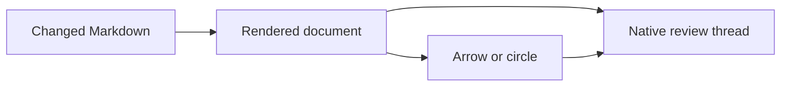
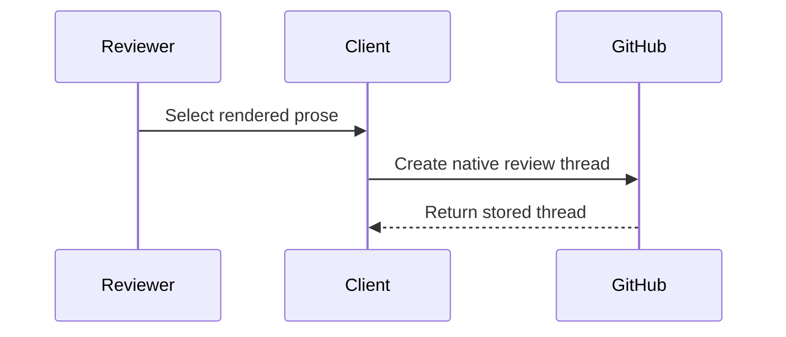

# Rendered review fixture

This baseline document exists so the experiment pull request can exercise
native GitHub review anchors against changed Markdown prose and Mermaid source.

## Prose anchors

This sentence is added by the fixture pull request and is the primary changed-line
target for a native rendered review thread.

The original introduction above remains unchanged so G0 can record whether
GitHub accepts a thread anchored to context that is visible but not modified.

> [!NOTE]
> This alert checks repository-context GitHub Flavored Markdown rendering.

| Anchor case | Expected experiment result |
| --- | --- |
| Changed line | GitHub accepts a native review thread. |
| Unchanged line | Record whether the API accepts or rejects the anchor. |
| Outdated line | A later fixture commit makes the original thread outdated. |

Additional rendered content

- [x] Task-list item
- [ ] Unfinished task-list item
- Repository link: [`implementation-plan.md`](../implementation-plan.md)
- Footnote reference.[^fixture]

[^fixture]: This footnote is part of the GitHub Markdown parity fixture.

## Flowchart annotation target

## Sequence annotation target

